```python
#!/usr/bin/env python3
#-*- coding: utf8 -*-


########################################################################################################
########################################################################################################

# DRIVEN DATA - PREDICT BLOOD DONATIONS

########################################################################################################
########################################################################################################


from IPython.display import Image
Image("../intro.png")
```


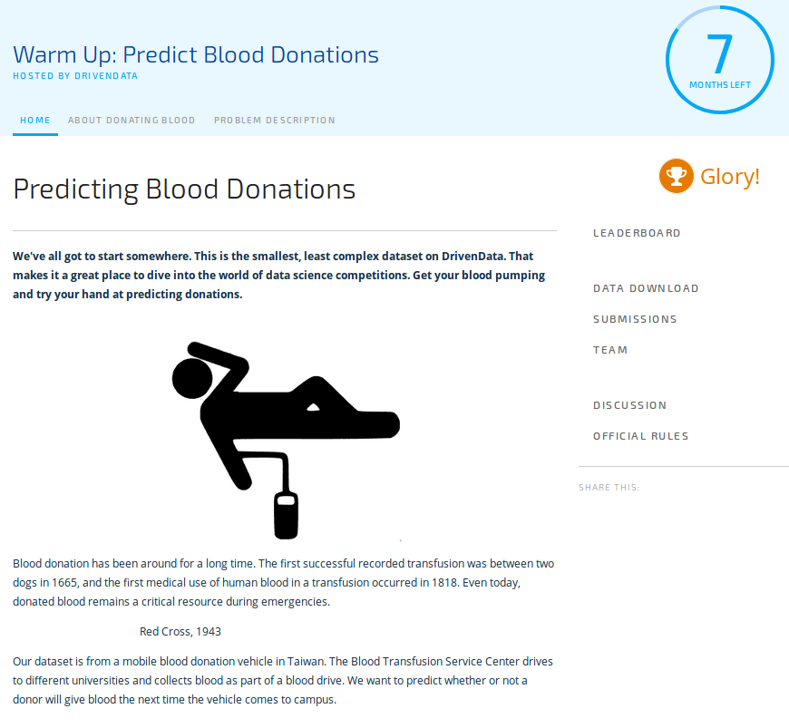


```python
########################################################################################################
########################################################################################################

# 00-first_dataset_tour.py

########################################################################################################
########################################################################################################


# Find here a first study of the dataset, in which we seek to understand and
# give meaning to the dataset.

# We are not trying to solve our problem but will focus on visualization,
# clenaning and feature engineering.

# At first we will just study the corelations, the links, the quality and the
# meaning of our dataset.External research and more general considerations may be included in this work

```


```python
# import

import os, sys, logging, random, time

import pandas as pd
import numpy as np

from matplotlib import pyplot as plt
import seaborn as sns

```


```python
# logging and warnings

l = logging.WARNING
logging.basicConfig(level=l, format="%(levelname)s : %(message)s")
info = logging.info

import warnings
warnings.filterwarnings('ignore')

```


```python
# graph

%matplotlib inline
sns.set()

```


```python
# consts

PROJECT     = "Driven-Data-Blood-Donations"
DATA        = "data"
SUBMISSIONS = "submissions"
TRAIN_FILE  = "training_data.csv"
TEST_FILE   = "test_data.csv"

```


```python
# 'overkill' First we define two decorators. it will be useful to control 
# complex and long algo (grid search, finding meta params...) :

def caller(funct) : 
    """decorator to give call and end of a function"""

    def wrapper(*args, **kwargs) : 

        msg = funct.__name__ + " : called"
        print(msg)
        

        res = funct(*args, **kwargs)

        msg = funct.__name__ + " : ended"
        print(msg)

        return res

    return wrapper


def timer(funct) : 
    """decorator to give runing time of a function"""

    def wrapper(*args, **kwargs) : 
        
        t = time.time()

        res = funct(*args, **kwargs)

        t = round(time.time() - t, 2)
        msg = funct.__name__ + " : " + str(t) + " secs" 
        print(msg)

        return res

    return wrapper


####


@caller
@timer
def _print() : 
    print("this is a test")
    
_print()
```

    wrapper : called
    this is a test
    _print : 0.0 secs
    wrapper : ended


```python
# Our first function : just find the data folder in the repo 
# structure from anywhere

def finding_master_path(folder, project=PROJECT) :
    """just find our data folder in the repo structure from
    anywhere"""

    path = os.getcwd()
    path = path.split("/")

    idx  = path.index(project)
    path = path[:idx+1]
    folder = str(folder) + "/"
    path.append(folder)
    
    path = "/".join(path)

    # check if path is a valid path
    if os.path.isdir(path) : 
        return path
    
    li = [i for i in os.listdir() if (os.path.isdir(i) and (i[0]!="."))]
    if project in li : 
        path = os.getcwd + "/" + project
        return path

    return ValueError("project not found, please 'cd project")


####


path = finding_master_path(DATA)
path

```


    '/home/alex/Driven-Data-Blood-Donations/data/'


```python
# Control that our datafiles are Ok

def return_datasets(path) : 

    return [i for i in os.listdir(path) if ".csv" in i ]


####


datasets = return_datasets(path)
datasets

```


    ['submission_format.csv', 'test_data.csv', 'training_data.csv']


```python
# Init our dataframe 

def init_df(path, file) : 

    df = pd.read_csv(path+file, index_col=0)

    if len(df.columns)  == 5 : 
        df.columns  = pd.Index( ["last_don", "num_don","vol_don", "first_don", 
                            "target"], dtype="object")
    elif len(df.columns )  == 4 : 
        df.columns  = pd.Index( ["last_don", "num_don","vol_don", "first_don", 
                            ], dtype="object")
    else : 
        raise ValueError("invalid numb of columns")

    return df


####


df = init_df(path, TRAIN_FILE)
df.head()

```


<div>
<style scoped>
    .dataframe tbody tr th:only-of-type {
        vertical-align: middle;
    }

    .dataframe tbody tr th {
        vertical-align: top;
    }

    .dataframe thead th {
        text-align: right;
    }
</style>
<table border="1" class="dataframe">
  <thead>
    <tr style="text-align: right;">
      <th></th>
      <th>last_don</th>
      <th>num_don</th>
      <th>vol_don</th>
      <th>first_don</th>
      <th>target</th>
    </tr>
  </thead>
  <tbody>
    <tr>
      <th>619</th>
      <td>2</td>
      <td>50</td>
      <td>12500</td>
      <td>98</td>
      <td>1</td>
    </tr>
    <tr>
      <th>664</th>
      <td>0</td>
      <td>13</td>
      <td>3250</td>
      <td>28</td>
      <td>1</td>
    </tr>
    <tr>
      <th>441</th>
      <td>1</td>
      <td>16</td>
      <td>4000</td>
      <td>35</td>
      <td>1</td>
    </tr>
    <tr>
      <th>160</th>
      <td>2</td>
      <td>20</td>
      <td>5000</td>
      <td>45</td>
      <td>1</td>
    </tr>
    <tr>
      <th>358</th>
      <td>1</td>
      <td>24</td>
      <td>6000</td>
      <td>77</td>
      <td>0</td>
    </tr>
  </tbody>
</table>
</div>


```python
# Let's have a first raw tour about this df

def print_df(df) : 

    print("data frame dimension :       ")
    print(df.ndim)

    print("\n\ndata frame shape :       ")
    print(df.shape)

    print("\n\ndata frame types :      ")
    print(df.dtypes)

    print("\n\ndata frame index :       ") 
    print(df.index)

    print("\n\ndata frame columns :     ")
    print(df.columns)

    print("\n\ndata frame head :        ")
    print(df.head(3))

    print("\n\ndata frame tail :        ")
    print(df.tail(3))

    print("\n\ndata frame desc :        ")
    print(df.describe())

    
####


print_df(df)

```

    data frame dimension :       
    2
    
    
    data frame shape :       
    (576, 5)
    
    
    data frame types :      
    last_don     int64
    num_don      int64
    vol_don      int64
    first_don    int64
    target       int64
    dtype: object
    
    
    data frame index :       
    Int64Index([619, 664, 441, 160, 358, 335,  47, 164, 736, 436,
                ...
                361,  30, 337, 496, 169, 698, 433, 360, 541,  74],
               dtype='int64', length=576)
    
    
    data frame columns :     
    Index(['last_don', 'num_don', 'vol_don', 'first_don', 'target'], dtype='object')
    
    
    data frame head :        
         last_don  num_don  vol_don  first_don  target
    619         2       50    12500         98       1
    664         0       13     3250         28       1
    441         1       16     4000         35       1
    
    
    data frame tail :        
         last_don  num_don  vol_don  first_don  target
    360        21        2      500         52       0
    541        39        1      250         39       0
    74         72        1      250         72       0
    
    
    data frame desc :        
             last_don     num_don       vol_don   first_don      target
    count  576.000000  576.000000    576.000000  576.000000  576.000000
    mean     9.439236    5.427083   1356.770833   34.050347    0.239583
    std      8.175454    5.740010   1435.002556   24.227672    0.427200
    min      0.000000    1.000000    250.000000    2.000000    0.000000
    25%      2.000000    2.000000    500.000000   16.000000    0.000000
    50%      7.000000    4.000000   1000.000000   28.000000    0.000000
    75%     14.000000    7.000000   1750.000000   49.250000    0.000000
    max     74.000000   50.000000  12500.000000   98.000000    1.000000


```python
# 'overkill' Let's retype our values to reduce mem usage 

def re_dtype(df) : 

    # li = [np.uint8, np.uint16]
    # [print(i,  np.iinfo(i).min, np.iinfo(i).max) for i in li]

    if len(df.columns) == 5 : 
        dtypes_dict = { "last_don"  : np.uint8, 
                        "num_don"   : np.uint8,
                        "vol_don"   : np.uint16, 
                        "first_don" : np.uint8, 
                        "target"    : np.uint8       }

        return df.astype(dtypes_dict)

    elif len(df.columns) == 4 : 
        dtypes_dict = { "last_don"  : np.uint8, 
                        "num_don"   : np.uint8,
                        "vol_don"   : np.uint16, 
                        "first_don" : np.uint8,      }

        return df.astype(dtypes_dict) 

    raise ValueError("pb occured")
    

####


df = re_dtype(df)
df.head()
df.dtypes

```


    last_don      uint8
    num_don       uint8
    vol_don      uint16
    first_don     uint8
    target        uint8
    dtype: object


```python
# Let's have a second tour of our dataset but with graphical tools

def graph_each_feature(df)  : 

    # features = [i for i in df.columns if "target" not in i] 

    features = df.columns

    fig, _axes = plt.subplots(1, 5, figsize=(13,13))
    axes = _axes.flatten()

    info(fig)
    info(axes)
    info(len(axes))

    for i, feat in enumerate(features) :
        info(i, feat)

        # -----------------------------------------
        # use sns.pairplot() !!!!!!
        # sns.distplot --> (kde=True ) ???
        # -----------------------------------------

        axes[i].hist(df[feat], bins=30)
        axes[i].set_title(feat)

    plt.suptitle("features distribution")
    plt.show()
    
    
####


graph_each_feature(df)

```


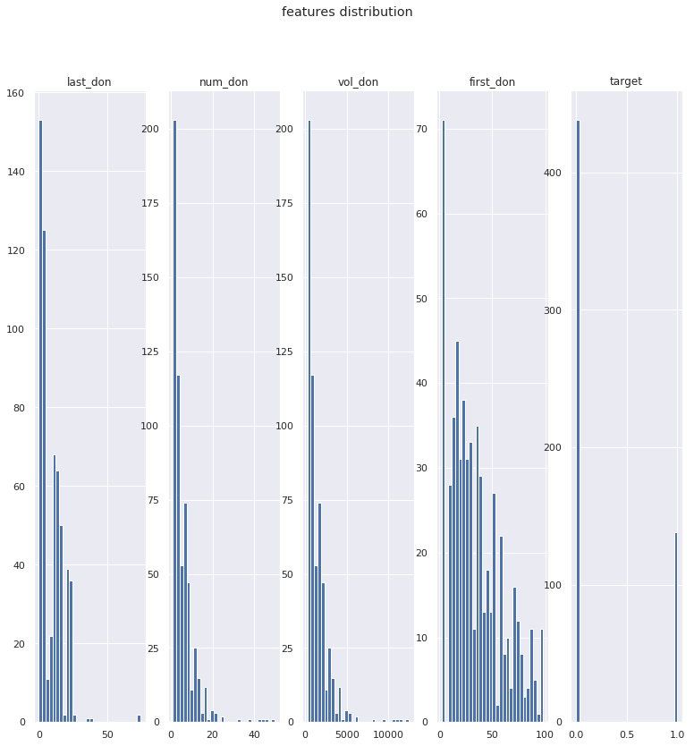


```python
# Idem for target

def graph_target(df) : 

    df.target.hist()
    plt.xlabel("target")
    plt.ylabel("values")
    plt.title("target value's distribution")
    plt.show()
    
    
####


graph_target(df)

```


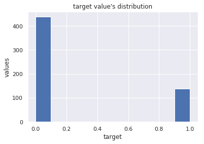


```python
# Looking in depth : finding correlation between features

def graph_corr_matrix(df) : 
    
    corr_mat = df.corr()
    sns.heatmap(corr_mat, cmap="coolwarm", annot=True, fmt='.3g')

    plt.title("correlation matrix")
    plt.show()

    
####


graph_corr_matrix(df)

```


```python
# So without doupt we can drop perfectly correlated features

def drop_corr_features(df) : 

    df = df.drop("vol_don", axis=1)

    return df 


####


df = drop_corr_features(df)
df.head()

```


<div>
<style scoped>
    .dataframe tbody tr th:only-of-type {
        vertical-align: middle;
    }

    .dataframe tbody tr th {
        vertical-align: top;
    }

    .dataframe thead th {
        text-align: right;
    }
</style>
<table border="1" class="dataframe">
  <thead>
    <tr style="text-align: right;">
      <th></th>
      <th>last_don</th>
      <th>num_don</th>
      <th>first_don</th>
      <th>target</th>
    </tr>
  </thead>
  <tbody>
    <tr>
      <th>619</th>
      <td>2</td>
      <td>50</td>
      <td>98</td>
      <td>1</td>
    </tr>
    <tr>
      <th>664</th>
      <td>0</td>
      <td>13</td>
      <td>28</td>
      <td>1</td>
    </tr>
    <tr>
      <th>441</th>
      <td>1</td>
      <td>16</td>
      <td>35</td>
      <td>1</td>
    </tr>
    <tr>
      <th>160</th>
      <td>2</td>
      <td>20</td>
      <td>45</td>
      <td>1</td>
    </tr>
    <tr>
      <th>358</th>
      <td>1</td>
      <td>24</td>
      <td>77</td>
      <td>0</td>
    </tr>
  </tbody>
</table>
</div>


```python
# What about nas?

def study_nas(df) : 

    print("nas all : ")
    print(df.isna().all())
    print("\n\nnas any : ")
    print(df.isna().any())
    
    
####


study_nas(df)

```

    nas all : 
    last_don     False
    num_don      False
    first_don    False
    target       False
    dtype: bool
    
    
    nas any : 
    last_don     False
    num_don      False
    first_don    False
    target       False
    dtype: bool


```python
# Ok perfect, too easy maybe...
# what about outliers ? 

def study_outliers(df, k=1.5) : 

    fig, _axes = plt.subplots(1, 4, figsize=(13,13))
    axes = _axes.flatten()

    info(fig)
    info(axes)
    info(len(axes))

    for i, feat in enumerate(df.columns) :
        info(i, feat)
        axes[i].boxplot(df[feat], whis=k)
        axes[i].set_title(feat)

    plt.suptitle("features outliers for k > {}".format(k))
    
    plt.show()

    
####


study_outliers(df)

```


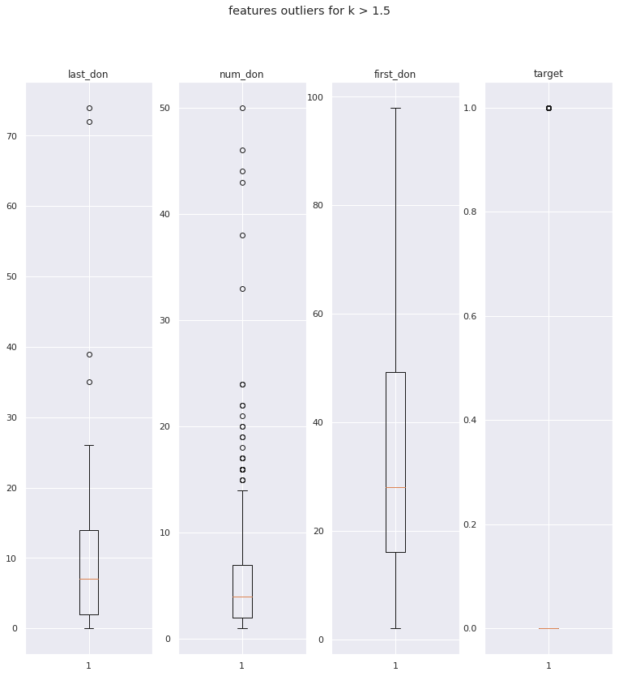


```python
# After all ! we have a first real data scientist job to do : cleaning! 
# so we will design one function to be able to reshape our df at will

def return_outliers(ser, k) : 

    desc = ser.describe()
    q1, q3, q2 = desc["25%"], desc["75%"], desc["50%"]
    IQ = q3-q1
    range_min, range_max = q1 - k * IQ, q3 + k*IQ

    # outliers = ser[(ser > range_max) or (ser < range_min)]
    
    return ser >= range_max


def delete_outliers(df, k) : 

    li = [i for i in df.columns if "target" not in i]

    for feat in li : 
        df = df[return_outliers(df[feat], k) == False]

    return df


####


print(df.shape)

_df = delete_outliers(df, 1.5)
print(_df.shape)

```

    (576, 4)
    (537, 4)


```python
# Let's resume all of this in a global function

# @caller
# @timer
def first_tour(folder=None, filename=None, project=PROJECT) : 

    # build data path
    path = finding_master_path(folder, project)
    print(path)                             # UNCOMMENT IF NEEDED

    # just show dataset list
    datasets = return_datasets(path)        # UNCOMMENT IF NEEDED
    print(datasets)                         # UNCOMMENT IF NEEDED

    # build our df
    df = init_df(path, filename)

    # print main info
    print_df(df)                            # UNCOMMENT IF NEEDED

    # (overkilled) recast dataframe in a better dtype
    df = re_dtype(df)

    # graph features distr and correlation  # UNCOMMENT IF NEEDED
    graph_each_feature(df)                  
    graph_corr_matrix(df)                   # UNCOMMENT IF NEEDED

    # drop corr values
    df = drop_corr_features(df)

    # nas
    study_nas(df)                           # UNCOMMENT IF NEEDED

    for i in [1.5, 2, 2.5, 3] :             # UNCOMMENT IF NEEDED
        study_outliers(df, i)               # UNCOMMENT IF NEEDED

```


```python
# Finally we define a function to auto build our data frame

@caller
@timer
def build_df(folder=None, filename=None, project=PROJECT) : 

    path = finding_master_path(folder, project)
    df = init_df(path, filename)
    df = re_dtype(df)
    df = drop_corr_features(df)

    return df


####


df = build_df(DATA, TRAIN_FILE)
df.head()

```

    wrapper : called
    build_df : 0.01 secs
    wrapper : ended


<div>
<style scoped>
    .dataframe tbody tr th:only-of-type {
        vertical-align: middle;
    }

    .dataframe tbody tr th {
        vertical-align: top;
    }

    .dataframe thead th {
        text-align: right;
    }
</style>
<table border="1" class="dataframe">
  <thead>
    <tr style="text-align: right;">
      <th></th>
      <th>last_don</th>
      <th>num_don</th>
      <th>first_don</th>
      <th>target</th>
    </tr>
  </thead>
  <tbody>
    <tr>
      <th>619</th>
      <td>2</td>
      <td>50</td>
      <td>98</td>
      <td>1</td>
    </tr>
    <tr>
      <th>664</th>
      <td>0</td>
      <td>13</td>
      <td>28</td>
      <td>1</td>
    </tr>
    <tr>
      <th>441</th>
      <td>1</td>
      <td>16</td>
      <td>35</td>
      <td>1</td>
    </tr>
    <tr>
      <th>160</th>
      <td>2</td>
      <td>20</td>
      <td>45</td>
      <td>1</td>
    </tr>
    <tr>
      <th>358</th>
      <td>1</td>
      <td>24</td>
      <td>77</td>
      <td>0</td>
    </tr>
  </tbody>
</table>
</div>


```python
# Conclusion

# Through this first study, we can see several things. Our dataset is of very good quality, few outliers, 
# no missing values, a number of features reduced and little corelation.

# Its simplicity will be an obvious limit when it comes to making feature engineering, benchmarking 
# models and looking for marginal improvements.

```


```python
########################################################################################################
########################################################################################################

# 01-first_naive_models.py

########################################################################################################
########################################################################################################


# In this second part, we will implement our first logistic regression model.

# We will first implement by hand a naive classifier, then a dummy classifier 
# (who does the same job), and finally a basic logistic regression model.

# Rather than looking at the results of a regression we will implement a 
# function that will test the model x times and that will average the results
# obtained

```


```python
# import

from sklearn.model_selection import train_test_split

from sklearn.dummy import DummyClassifier
from sklearn.linear_model import LogisticRegression

from sklearn.metrics import accuracy_score, log_loss

# from first_dataset_tour import *

```


```python
# consts 

# COLUMNS = ["naive", "dummy", "basic", "features eng."]
# MODELS = [naive_model, dummy_model, basic_model]

```


```python
# Split our features from our target

def return_X_y(df) : 

    if "target" in df.columns : 

        X = df.drop("target", axis=1)
        y = df.target

        return X, y  

    else : 
        return df 

    
####


X,y = return_X_y(df)
print(X.columns)
print(y.name)

```

    Index(['last_don', 'num_don', 'first_don'], dtype='object')
    target


```python
# Split test and train df/target

def split(X,y, size=0.33) : 

    return train_test_split(X, y, test_size=size)


####


X_tr, X_te, y_tr, y_te = tup = split(X,y)
for i in tup : print(i.shape)
    
```

    (385, 3)
    (191, 3)
    (385,)
    (191,)


```python
# 'overkill' Build from scratch a naive/dummy model which make prediction regarding global target probabilities

def naive_model(df=None, param=None) :

    if not isinstance(df, pd.DataFrame): 
        df = build_df(DATA, TRAIN_FILE)

    X,y     = return_X_y(df)
    X_train, X_test, y_train, y_test  = split(X,y)

    freq = y_test.value_counts() / len(y_test)
        
    y_pred = np.random.binomial(1, freq[1], len(y_test))
    y_pred = pd.Series(y_pred)

    lolo = log_loss(y_test, y_pred).round(3)

    return lolo, None 


####


lolo, mod = naive_model(df)
print(lolo)

```

    11.935


```python
# Rather than coding a dummy model from scratch, use sklearn DummyClassifier (same job)

def dummy_model(df=None, param=None) : 

    if not isinstance(df, pd.DataFrame): 
        df = build_df(DATA, TRAIN_FILE)
    
    X,y     = return_X_y(df)
    X_train, X_test, y_train, y_test = split(X,y)

    model = DummyClassifier()
    model.fit(X_train, y_train)
    y_pred = model.predict(X_test) 

    lolo = log_loss(y_test, y_pred).round(3)

    return lolo, model


####


lolo, mod = dummy_model(df)
print(lolo)

```

    13.201


```python
# Just for fun trying to make predictions with a very basic model (no meta params, no features engineering)
# this one will be our model prediction base
# it is suposed to be better that our DummyClassifier. If not there is a major issue...

def basic_model(df=None, param=None) : 

    if not isinstance(df, pd.DataFrame): 
        df = build_df(DATA, TRAIN_FILE)
    
    X,y     = return_X_y(df)

    X_train, X_test, y_train, y_test = split(X,y)

    model = LogisticRegression()
    model.fit(X_train, y_train)
    y_pred = model.predict_proba(X_test)
    y_pred = y_pred[:, 1]

    lolo = log_loss(y_test, y_pred).round(3)
    
    return lolo, model


####


lolo, mod = basic_model(df)
print(lolo)

```

    0.45


```python
@caller
@timer
def model_accuracy_mean(model=None, n=50, df=None) : 
    
    if not isinstance(df, pd.DataFrame): 
        df = build_df(DATA, TRAIN_FILE)

    if not model : 
        model = basic_model

    scores = pd.Series([model(df)[0] for i in range(n)])

    fix, ax = plt.subplots(1,2)
    scores.hist(ax=ax[0])
    pd.DataFrame({"":scores}).boxplot(ax=ax[1])
    plt.suptitle("log loss hist and box plot for {} runs for basic_model".format(n))
    plt.show()
    
    info(type(scores))
    info(type(range(n)))

    return scores.describe()


####


model_accuracy_mean(n=50)
```

    wrapper : called
    wrapper : called
    build_df : 0.01 secs
    wrapper : ended


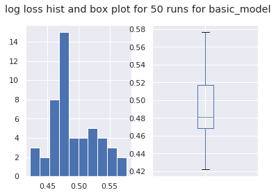


    model_accuracy_mean : 0.55 secs
    wrapper : ended


    count    50.000000
    mean      0.490120
    std       0.036009
    min       0.422000
    25%       0.468250
    50%       0.481000
    75%       0.517500
    max       0.577000
    dtype: float64


```python

@caller
@timer
def first_approch_of_feat_eng(model=None, n=20, df=None) : 

    if not isinstance(df, pd.DataFrame): 
        df = build_df(DATA, TRAIN_FILE)

    if not model : 
        model = basic_model
        
    k_list = np.arange(10, 50)/10
    
    outlier_df = lambda k : delete_outliers(df, k)
    results = [ [basic_model(outlier_df(k))[0] for k in k_list]
                   for i in range(n) ]
    
    results = pd.DataFrame(results, columns=k_list)
       
    results.boxplot()
    # plt.x_label("k") ; plt.y_label("log loss")
    plt.title("log loss for various 'k' values - outliers detection")
    plt.show()
    
    return results
    
    
####

results = first_approch_of_feat_eng(n=20)
results.describe()
```

    wrapper : called
    wrapper : called
    build_df : 0.01 secs
    wrapper : ended


    first_approch_of_feat_eng : 11.83 secs
    wrapper : ended


<div>
<style scoped>
    .dataframe tbody tr th:only-of-type {
        vertical-align: middle;
    }

    .dataframe tbody tr th {
        vertical-align: top;
    }

    .dataframe thead th {
        text-align: right;
    }
</style>
<table border="1" class="dataframe">
  <thead>
    <tr style="text-align: right;">
      <th></th>
      <th>1.0</th>
      <th>1.1</th>
      <th>1.2</th>
      <th>1.3</th>
      <th>1.4</th>
      <th>1.5</th>
      <th>1.6</th>
      <th>1.7</th>
      <th>1.8</th>
      <th>1.9</th>
      <th>...</th>
      <th>4.0</th>
      <th>4.1</th>
      <th>4.2</th>
      <th>4.3</th>
      <th>4.4</th>
      <th>4.5</th>
      <th>4.6</th>
      <th>4.7</th>
      <th>4.8</th>
      <th>4.9</th>
    </tr>
  </thead>
  <tbody>
    <tr>
      <th>count</th>
      <td>20.000000</td>
      <td>20.000000</td>
      <td>20.000000</td>
      <td>20.000000</td>
      <td>20.000000</td>
      <td>20.000000</td>
      <td>20.000000</td>
      <td>20.000000</td>
      <td>20.000000</td>
      <td>20.000000</td>
      <td>...</td>
      <td>20.000000</td>
      <td>20.000000</td>
      <td>20.000000</td>
      <td>20.000000</td>
      <td>20.000000</td>
      <td>20.000000</td>
      <td>20.000000</td>
      <td>20.000000</td>
      <td>20.000000</td>
      <td>20.000000</td>
    </tr>
    <tr>
      <th>mean</th>
      <td>0.502500</td>
      <td>0.487900</td>
      <td>0.485800</td>
      <td>0.491350</td>
      <td>0.482950</td>
      <td>0.480700</td>
      <td>0.496700</td>
      <td>0.497000</td>
      <td>0.489950</td>
      <td>0.484800</td>
      <td>...</td>
      <td>0.496450</td>
      <td>0.501850</td>
      <td>0.488050</td>
      <td>0.487100</td>
      <td>0.490450</td>
      <td>0.482250</td>
      <td>0.484550</td>
      <td>0.483150</td>
      <td>0.490700</td>
      <td>0.478250</td>
    </tr>
    <tr>
      <th>std</th>
      <td>0.045744</td>
      <td>0.047682</td>
      <td>0.034077</td>
      <td>0.034485</td>
      <td>0.041354</td>
      <td>0.040351</td>
      <td>0.042189</td>
      <td>0.034057</td>
      <td>0.035442</td>
      <td>0.041455</td>
      <td>...</td>
      <td>0.029181</td>
      <td>0.037187</td>
      <td>0.029362</td>
      <td>0.028226</td>
      <td>0.029651</td>
      <td>0.031308</td>
      <td>0.030003</td>
      <td>0.039663</td>
      <td>0.031503</td>
      <td>0.029449</td>
    </tr>
    <tr>
      <th>min</th>
      <td>0.444000</td>
      <td>0.421000</td>
      <td>0.431000</td>
      <td>0.415000</td>
      <td>0.429000</td>
      <td>0.432000</td>
      <td>0.454000</td>
      <td>0.441000</td>
      <td>0.408000</td>
      <td>0.415000</td>
      <td>...</td>
      <td>0.441000</td>
      <td>0.440000</td>
      <td>0.431000</td>
      <td>0.440000</td>
      <td>0.440000</td>
      <td>0.435000</td>
      <td>0.424000</td>
      <td>0.424000</td>
      <td>0.431000</td>
      <td>0.423000</td>
    </tr>
    <tr>
      <th>25%</th>
      <td>0.468000</td>
      <td>0.455500</td>
      <td>0.469250</td>
      <td>0.469250</td>
      <td>0.457250</td>
      <td>0.454500</td>
      <td>0.462250</td>
      <td>0.475000</td>
      <td>0.464500</td>
      <td>0.452250</td>
      <td>...</td>
      <td>0.480000</td>
      <td>0.483000</td>
      <td>0.461750</td>
      <td>0.475000</td>
      <td>0.471000</td>
      <td>0.466000</td>
      <td>0.469500</td>
      <td>0.458750</td>
      <td>0.472500</td>
      <td>0.463000</td>
    </tr>
    <tr>
      <th>50%</th>
      <td>0.499500</td>
      <td>0.486500</td>
      <td>0.483500</td>
      <td>0.492500</td>
      <td>0.472500</td>
      <td>0.472000</td>
      <td>0.488500</td>
      <td>0.486000</td>
      <td>0.494000</td>
      <td>0.480500</td>
      <td>...</td>
      <td>0.502500</td>
      <td>0.500500</td>
      <td>0.492500</td>
      <td>0.485000</td>
      <td>0.489000</td>
      <td>0.477500</td>
      <td>0.477000</td>
      <td>0.476000</td>
      <td>0.489500</td>
      <td>0.480500</td>
    </tr>
    <tr>
      <th>75%</th>
      <td>0.520750</td>
      <td>0.512250</td>
      <td>0.497500</td>
      <td>0.508250</td>
      <td>0.494250</td>
      <td>0.493250</td>
      <td>0.507750</td>
      <td>0.522000</td>
      <td>0.520000</td>
      <td>0.512500</td>
      <td>...</td>
      <td>0.517750</td>
      <td>0.519000</td>
      <td>0.513000</td>
      <td>0.496750</td>
      <td>0.508000</td>
      <td>0.498500</td>
      <td>0.494000</td>
      <td>0.504750</td>
      <td>0.500500</td>
      <td>0.499250</td>
    </tr>
    <tr>
      <th>max</th>
      <td>0.607000</td>
      <td>0.615000</td>
      <td>0.561000</td>
      <td>0.560000</td>
      <td>0.576000</td>
      <td>0.595000</td>
      <td>0.605000</td>
      <td>0.579000</td>
      <td>0.540000</td>
      <td>0.576000</td>
      <td>...</td>
      <td>0.542000</td>
      <td>0.603000</td>
      <td>0.539000</td>
      <td>0.576000</td>
      <td>0.567000</td>
      <td>0.546000</td>
      <td>0.547000</td>
      <td>0.567000</td>
      <td>0.567000</td>
      <td>0.524000</td>
    </tr>
  </tbody>
</table>
<p>8 rows × 40 columns</p>
</div>


```python
# conclusion

# We could see through this first study that we are on a dataset quite simple, allowing our first approach 
# to have pretty good results.

# Our base model offers a performance of 0.75 and the impact of the ouliers on the model's performance 
# seems at first glance quite low.

# Having a fairly simple dataset, the possibilities for improving the models will not be that simple due 
# to the small number of variables and the small size of the dataset : the possibilities offered by 
# the feature engineering are indeed quite low.

```


```python
########################################################################################################
########################################################################################################

# 02-starting_ML.py

########################################################################################################
########################################################################################################


# In this third part we will finally start to make real machine learning. We will first code a high-level
# function to handle the tests of the different models.

# We will then benchmark the different classification models as well as the impact of the different meta 
# variables on the relevance of the basic model: number of folds, preprocessing, scoring method, clips
# of the predicted values, etc.

# This work is clearly laborious, but its successful execution depends on our ability to really push 
# our model at best.

```


```python
# import

from math import ceil
import itertools as it
from collections import OrderedDict, Iterable

from sklearn.model_selection import GridSearchCV
from sklearn.pipeline import Pipeline
from sklearn.decomposition import PCA
from sklearn.preprocessing import StandardScaler, Normalizer, MinMaxScaler

from sklearn.ensemble import RandomForestClassifier, AdaBoostClassifier
from sklearn.tree import DecisionTreeClassifier
from sklearn.linear_model import Perceptron, RidgeClassifier
from sklearn.neighbors import KNeighborsClassifier
from sklearn.neural_network import MLPClassifier
from sklearn.svm import LinearSVC, NuSVC

# from first_naive_models import *

```


```python
# let's define a new decorator that will allow us to beeper during long tests of algo sessions

def beeper(funct) : 
    """decorator to beep when a long algo as finished"""

    def wrapper(*args, **kwargs) : 
        
        res = funct(*args, **kwargs)

        freq=440
        duration=3
        cmd = 'play --no-show-progress --null --channels 1 synth %s sine %f' % (duration, freq)
        os.system(cmd)

        return res

    return wrapper

```


```python
# Please find here our meta GridSearchCV. For each params grid, it initiates a df, split 
# test / train data, launches the grid search, and returns the model and the log loss in final output

# @timer
# @caller
def run_GSCV(   model=None,     params=None, 
                df=None,        tup=None,
                cv=0,           n_jobs=None,
                scoring=None,   test_size=None, 
                verbose=None,   debug_mode=None) : 

    # init default params
    if not model        : model = LogisticRegression()
    else : 
        try             : model = model()
        except          : pass

    is_df               = isinstance(df, pd.DataFrame)
    if not is_df        : df = build_df(DATA, TRAIN_FILE)
    if not params       : params = dict()
    if not cv           : cv=5
    if not n_jobs       : n_jobs = 6
    if not scoring      : scoring = "accuracy"
    if not verbose      : verbose = 1
    if not test_size    : test_size = 0.33
    if not debug_mode   : debug_mode = False
    grid = None

    if not tup : # prepare X, y
        X,y                 = return_X_y(df)
        X_tr,X_te,y_tr,y_te = split(X,y, test_size)
    else :
        X_tr,X_te,y_tr,y_te = tup
    
    info(model.__class__)
    try : # init grid      
        grid        = GridSearchCV( estimator=model, 
                                    param_grid=params,  
                                    cv=cv, 
                                    n_jobs=n_jobs,
                                    scoring=scoring, 
                                    verbose=verbose)
        info("grid init ok")
        info(grid)

    except Exception as e : 
        info("grit init went wrong")
        if debug_mode : input()
        raise(e)

    try : # fit
        grid.fit(X_tr, y_tr)
        info("grid fit OK")
        info(grid.best_estimator_)
        info(grid.best_score_)
        info(grid.best_params_)

    except Exception as e : 
        info("grit fit went wrong")
        if debug_mode : input()
        raise(e)

    try : # pred
        y_pred = grid.predict_proba(X_te)
        y_pred = y_pred[:,1]
        info("pred OK")
        info("run_GSCV 0") 
    
    except Exception as e : 
        info("pred went wrong")
        info("maybe predict_proba do not exists just predict")       
        try : 
            y_pred = grid.predict(X_te)
            info("second pred Method OK")
            info("run_GSCV 1")

        except Exception as e : 
            info("2nd pred method went wrong")
            if debug_mode : input()
            raise(e)

    try : # compute log_loss as 'lolo' 
        lolo = log_loss(y_te, y_pred).round(3)
        info("lolo ok")
        info(lolo)

    except Exception as e : 
        info("lolo went wrong")
        if debug_mode : input()
        raise(e)

    # return lolo and grid
    if isinstance(lolo, float) and grid : 
        return lolo, grid
    # else raise Error
    raise ValueError("lolo and/or grid error")
    
    
####

lolo, grid = run_GSCV()

```

    wrapper : called
    build_df : 0.01 secs
    wrapper : ended
    Fitting 5 folds for each of 1 candidates, totalling 5 fits
    0.459
    GridSearchCV(cv=5, error_score='raise',
           estimator=LogisticRegression(C=1.0, class_weight=None, dual=False, fit_intercept=True,
              intercept_scaling=1, max_iter=100, multi_class='ovr', n_jobs=1,
              penalty='l2', random_state=None, solver='liblinear', tol=0.0001,
              verbose=0, warm_start=False),
           fit_params=None, iid=True, n_jobs=6, param_grid={},
           pre_dispatch='2*n_jobs', refit=True, return_train_score='warn',
           scoring='accuracy', verbose=1)


    [Parallel(n_jobs=6)]: Done   5 out of   5 | elapsed:    0.0s finished


```python
print(lolo)
print(grid)
```

    0.459
    GridSearchCV(cv=5, error_score='raise',
           estimator=LogisticRegression(C=1.0, class_weight=None, dual=False, fit_intercept=True,
              intercept_scaling=1, max_iter=100, multi_class='ovr', n_jobs=1,
              penalty='l2', random_state=None, solver='liblinear', tol=0.0001,
              verbose=0, warm_start=False),
           fit_params=None, iid=True, n_jobs=6, param_grid={},
           pre_dispatch='2*n_jobs', refit=True, return_train_score='warn',
           scoring='accuracy', verbose=1)


```python
# Find here the models we will try and test

COLUMNS = [     "LR",       "RC",
                "SVC",      # "Nu",
                "KNN",
                "DT", 
                "RF", 
                "Ada", 
                "Per",      "MLP"   ]

MODELS = [      LogisticRegression, RidgeClassifier,
                LinearSVC, # NuSVC,
                KNeighborsClassifier,
                DecisionTreeClassifier,
                RandomForestClassifier,
                AdaBoostClassifier,
                Perceptron, MLPClassifier   ]

```


```python
# we now will benchmark various models, without any feat eng. or meta params. Just have a first look...

# @timer
def benchmark_various_models(  n=5, df=None, graph=True, params=None,
                                    models = MODELS, columns= COLUMNS) : 

    if not isinstance(df, pd.DataFrame): 
        df = build_df(DATA, TRAIN_FILE)

    if len(models) != len(columns) : 
        raise ValueError("lens not goods")

    if not params : params = dict()    

    results = [     pd.Series([run_GSCV(m, params, df)[0] for m in models], 
                        index=columns) for i in range(n)]
    
    results = pd.DataFrame(results, columns=columns)

    return results


####


results = benchmark_various_models(20)

```

    wrapper : called
    build_df : 0.01 secs
    wrapper : ended
    Fitting 5 folds for each of 1 candidates, totalling 5 fits
    Fitting 5 folds for each of 1 candidates, totalling 5 fits


    [Parallel(n_jobs=6)]: Done   5 out of   5 | elapsed:    0.0s finished
    [Parallel(n_jobs=6)]: Done   5 out of   5 | elapsed:    0.0s finished


    Fitting 5 folds for each of 1 candidates, totalling 5 fits
    Fitting 5 folds for each of 1 candidates, totalling 5 fits


    [Parallel(n_jobs=6)]: Done   5 out of   5 | elapsed:    0.1s finished


    Fitting 5 folds for each of 1 candidates, totalling 5 fits


    [Parallel(n_jobs=6)]: Done   5 out of   5 | elapsed:    0.0s finished


    Fitting 5 folds for each of 1 candidates, totalling 5 fits


    [Parallel(n_jobs=6)]: Done   5 out of   5 | elapsed:    0.0s finished


    Fitting 5 folds for each of 1 candidates, totalling 5 fits


    [Parallel(n_jobs=6)]: Done   5 out of   5 | elapsed:    0.1s finished


    Fitting 5 folds for each of 1 candidates, totalling 5 fits


    [Parallel(n_jobs=6)]: Done   5 out of   5 | elapsed:    0.3s finished


    Fitting 5 folds for each of 1 candidates, totalling 5 fits


    [Parallel(n_jobs=6)]: Done   5 out of   5 | elapsed:    0.0s finished


    Fitting 5 folds for each of 1 candidates, totalling 5 fits


    [Parallel(n_jobs=6)]: Done   5 out of   5 | elapsed:    0.2s finished


    Fitting 5 folds for each of 1 candidates, totalling 5 fits


    [Parallel(n_jobs=6)]: Done   5 out of   5 | elapsed:    0.0s finished


    Fitting 5 folds for each of 1 candidates, totalling 5 fits


    [Parallel(n_jobs=6)]: Done   5 out of   5 | elapsed:    0.0s finished


    Fitting 5 folds for each of 1 candidates, totalling 5 fits


    [Parallel(n_jobs=6)]: Done   5 out of   5 | elapsed:    0.1s finished
    [Parallel(n_jobs=6)]: Done   5 out of   5 | elapsed:    0.0s finished


    Fitting 5 folds for each of 1 candidates, totalling 5 fits
    Fitting 5 folds for each of 1 candidates, totalling 5 fits


    [Parallel(n_jobs=6)]: Done   5 out of   5 | elapsed:    0.0s finished


    Fitting 5 folds for each of 1 candidates, totalling 5 fits


    [Parallel(n_jobs=6)]: Done   5 out of   5 | elapsed:    0.1s finished


    Fitting 5 folds for each of 1 candidates, totalling 5 fits


    [Parallel(n_jobs=6)]: Done   5 out of   5 | elapsed:    0.3s finished


    Fitting 5 folds for each of 1 candidates, totalling 5 fits


    [Parallel(n_jobs=6)]: Done   5 out of   5 | elapsed:    0.0s finished
    [Parallel(n_jobs=6)]: Done   5 out of   5 | elapsed:    1.2s finished


    Fitting 5 folds for each of 1 candidates, totalling 5 fits
    Fitting 5 folds for each of 1 candidates, totalling 5 fits


    [Parallel(n_jobs=6)]: Done   5 out of   5 | elapsed:    0.0s finished


    Fitting 5 folds for each of 1 candidates, totalling 5 fits


    [Parallel(n_jobs=6)]: Done   5 out of   5 | elapsed:    0.0s finished


    Fitting 5 folds for each of 1 candidates, totalling 5 fits


    [Parallel(n_jobs=6)]: Done   5 out of   5 | elapsed:    0.1s finished


    Fitting 5 folds for each of 1 candidates, totalling 5 fits


    [Parallel(n_jobs=6)]: Done   5 out of   5 | elapsed:    0.0s finished


    Fitting 5 folds for each of 1 candidates, totalling 5 fits


    [Parallel(n_jobs=6)]: Done   5 out of   5 | elapsed:    0.0s finished


    Fitting 5 folds for each of 1 candidates, totalling 5 fits


    [Parallel(n_jobs=6)]: Done   5 out of   5 | elapsed:    0.1s finished


    Fitting 5 folds for each of 1 candidates, totalling 5 fits


    [Parallel(n_jobs=6)]: Done   5 out of   5 | elapsed:    0.3s finished


    Fitting 5 folds for each of 1 candidates, totalling 5 fits


    [Parallel(n_jobs=6)]: Done   5 out of   5 | elapsed:    0.0s finished


    Fitting 5 folds for each of 1 candidates, totalling 5 fits


    [Parallel(n_jobs=6)]: Done   5 out of   5 | elapsed:    0.2s finished


    Fitting 5 folds for each of 1 candidates, totalling 5 fits


    [Parallel(n_jobs=6)]: Done   5 out of   5 | elapsed:    0.0s finished


    Fitting 5 folds for each of 1 candidates, totalling 5 fits


    [Parallel(n_jobs=6)]: Done   5 out of   5 | elapsed:    0.0s finished


    Fitting 5 folds for each of 1 candidates, totalling 5 fits


    [Parallel(n_jobs=6)]: Done   5 out of   5 | elapsed:    0.1s finished
    [Parallel(n_jobs=6)]: Done   5 out of   5 | elapsed:    0.0s finished


    Fitting 5 folds for each of 1 candidates, totalling 5 fits
    Fitting 5 folds for each of 1 candidates, totalling 5 fits


    [Parallel(n_jobs=6)]: Done   5 out of   5 | elapsed:    0.0s finished


    Fitting 5 folds for each of 1 candidates, totalling 5 fits


    [Parallel(n_jobs=6)]: Done   5 out of   5 | elapsed:    0.1s finished
    [Parallel(n_jobs=6)]: Done   5 out of   5 | elapsed:    0.2s finished


    Fitting 5 folds for each of 1 candidates, totalling 5 fits
    Fitting 5 folds for each of 1 candidates, totalling 5 fits


    [Parallel(n_jobs=6)]: Done   5 out of   5 | elapsed:    0.0s finished


    Fitting 5 folds for each of 1 candidates, totalling 5 fits


    [Parallel(n_jobs=6)]: Done   5 out of   5 | elapsed:    0.2s finished


    Fitting 5 folds for each of 1 candidates, totalling 5 fits


    [Parallel(n_jobs=6)]: Done   5 out of   5 | elapsed:    0.0s finished


    Fitting 5 folds for each of 1 candidates, totalling 5 fits


    [Parallel(n_jobs=6)]: Done   5 out of   5 | elapsed:    0.0s finished


    Fitting 5 folds for each of 1 candidates, totalling 5 fits


    [Parallel(n_jobs=6)]: Done   5 out of   5 | elapsed:    0.1s finished


    Fitting 5 folds for each of 1 candidates, totalling 5 fits


    [Parallel(n_jobs=6)]: Done   5 out of   5 | elapsed:    0.0s finished


    Fitting 5 folds for each of 1 candidates, totalling 5 fits


    [Parallel(n_jobs=6)]: Done   5 out of   5 | elapsed:    0.0s finished


    Fitting 5 folds for each of 1 candidates, totalling 5 fits


    [Parallel(n_jobs=6)]: Done   5 out of   5 | elapsed:    0.1s finished
    [Parallel(n_jobs=6)]: Done   5 out of   5 | elapsed:    0.3s finished


    Fitting 5 folds for each of 1 candidates, totalling 5 fits
    Fitting 5 folds for each of 1 candidates, totalling 5 fits


    [Parallel(n_jobs=6)]: Done   5 out of   5 | elapsed:    0.0s finished
    [Parallel(n_jobs=6)]: Done   5 out of   5 | elapsed:    0.3s finished


    Fitting 5 folds for each of 1 candidates, totalling 5 fits
    Fitting 5 folds for each of 1 candidates, totalling 5 fits


    [Parallel(n_jobs=6)]: Done   5 out of   5 | elapsed:    0.0s finished


    Fitting 5 folds for each of 1 candidates, totalling 5 fits


    [Parallel(n_jobs=6)]: Done   5 out of   5 | elapsed:    0.0s finished


    Fitting 5 folds for each of 1 candidates, totalling 5 fits


    [Parallel(n_jobs=6)]: Done   5 out of   5 | elapsed:    0.1s finished


    Fitting 5 folds for each of 1 candidates, totalling 5 fits


    [Parallel(n_jobs=6)]: Done   5 out of   5 | elapsed:    0.0s finished


    Fitting 5 folds for each of 1 candidates, totalling 5 fits


    [Parallel(n_jobs=6)]: Done   5 out of   5 | elapsed:    0.0s finished


    Fitting 5 folds for each of 1 candidates, totalling 5 fits


    [Parallel(n_jobs=6)]: Done   5 out of   5 | elapsed:    0.1s finished
    [Parallel(n_jobs=6)]: Done   5 out of   5 | elapsed:    0.2s finished


    Fitting 5 folds for each of 1 candidates, totalling 5 fits
    Fitting 5 folds for each of 1 candidates, totalling 5 fits


    [Parallel(n_jobs=6)]: Done   5 out of   5 | elapsed:    0.0s finished
    [Parallel(n_jobs=6)]: Done   5 out of   5 | elapsed:    0.3s finished


    Fitting 5 folds for each of 1 candidates, totalling 5 fits
    Fitting 5 folds for each of 1 candidates, totalling 5 fits


    [Parallel(n_jobs=6)]: Done   5 out of   5 | elapsed:    0.0s finished


    Fitting 5 folds for each of 1 candidates, totalling 5 fits


    [Parallel(n_jobs=6)]: Done   5 out of   5 | elapsed:    0.0s finished


    Fitting 5 folds for each of 1 candidates, totalling 5 fits


    [Parallel(n_jobs=6)]: Done   5 out of   5 | elapsed:    0.1s finished
    [Parallel(n_jobs=6)]: Done   5 out of   5 | elapsed:    0.0s finished


    Fitting 5 folds for each of 1 candidates, totalling 5 fits
    Fitting 5 folds for each of 1 candidates, totalling 5 fits


    [Parallel(n_jobs=6)]: Done   5 out of   5 | elapsed:    0.0s finished
    [Parallel(n_jobs=6)]: Done   5 out of   5 | elapsed:    0.1s finished


    Fitting 5 folds for each of 1 candidates, totalling 5 fits


    [Parallel(n_jobs=6)]: Done   5 out of   5 | elapsed:    0.3s finished


    Fitting 5 folds for each of 1 candidates, totalling 5 fits
    Fitting 5 folds for each of 1 candidates, totalling 5 fits


    [Parallel(n_jobs=6)]: Done   5 out of   5 | elapsed:    0.0s finished
    [Parallel(n_jobs=6)]: Done   5 out of   5 | elapsed:    0.2s finished


    Fitting 5 folds for each of 1 candidates, totalling 5 fits
    Fitting 5 folds for each of 1 candidates, totalling 5 fits


    [Parallel(n_jobs=6)]: Done   5 out of   5 | elapsed:    0.0s finished


    Fitting 5 folds for each of 1 candidates, totalling 5 fits


    [Parallel(n_jobs=6)]: Done   5 out of   5 | elapsed:    0.0s finished


    Fitting 5 folds for each of 1 candidates, totalling 5 fits


    [Parallel(n_jobs=6)]: Done   5 out of   5 | elapsed:    0.1s finished


    Fitting 5 folds for each of 1 candidates, totalling 5 fits


    [Parallel(n_jobs=6)]: Done   5 out of   5 | elapsed:    0.0s finished


    Fitting 5 folds for each of 1 candidates, totalling 5 fits


    [Parallel(n_jobs=6)]: Done   5 out of   5 | elapsed:    0.0s finished


    Fitting 5 folds for each of 1 candidates, totalling 5 fits


    [Parallel(n_jobs=6)]: Done   5 out of   5 | elapsed:    0.1s finished
    [Parallel(n_jobs=6)]: Done   5 out of   5 | elapsed:    0.2s finished


    Fitting 5 folds for each of 1 candidates, totalling 5 fits
    Fitting 5 folds for each of 1 candidates, totalling 5 fits


    [Parallel(n_jobs=6)]: Done   5 out of   5 | elapsed:    0.0s finished


    Fitting 5 folds for each of 1 candidates, totalling 5 fits


    [Parallel(n_jobs=6)]: Done   5 out of   5 | elapsed:    0.2s finished


    Fitting 5 folds for each of 1 candidates, totalling 5 fits


    [Parallel(n_jobs=6)]: Done   5 out of   5 | elapsed:    0.0s finished


    Fitting 5 folds for each of 1 candidates, totalling 5 fits


    [Parallel(n_jobs=6)]: Done   5 out of   5 | elapsed:    0.0s finished


    Fitting 5 folds for each of 1 candidates, totalling 5 fits


    [Parallel(n_jobs=6)]: Done   5 out of   5 | elapsed:    0.1s finished


    Fitting 5 folds for each of 1 candidates, totalling 5 fits


    [Parallel(n_jobs=6)]: Done   5 out of   5 | elapsed:    0.0s finished


    Fitting 5 folds for each of 1 candidates, totalling 5 fits


    [Parallel(n_jobs=6)]: Done   5 out of   5 | elapsed:    0.0s finished


    Fitting 5 folds for each of 1 candidates, totalling 5 fits


    [Parallel(n_jobs=6)]: Done   5 out of   5 | elapsed:    0.1s finished


    Fitting 5 folds for each of 1 candidates, totalling 5 fits


    [Parallel(n_jobs=6)]: Done   5 out of   5 | elapsed:    0.3s finished


    Fitting 5 folds for each of 1 candidates, totalling 5 fits


    [Parallel(n_jobs=6)]: Done   5 out of   5 | elapsed:    0.0s finished


    Fitting 5 folds for each of 1 candidates, totalling 5 fits


    [Parallel(n_jobs=6)]: Done   5 out of   5 | elapsed:    0.1s finished


    Fitting 5 folds for each of 1 candidates, totalling 5 fits


    [Parallel(n_jobs=6)]: Done   5 out of   5 | elapsed:    0.0s finished


    Fitting 5 folds for each of 1 candidates, totalling 5 fits


    [Parallel(n_jobs=6)]: Done   5 out of   5 | elapsed:    0.0s finished


    Fitting 5 folds for each of 1 candidates, totalling 5 fits


    [Parallel(n_jobs=6)]: Done   5 out of   5 | elapsed:    0.1s finished


    Fitting 5 folds for each of 1 candidates, totalling 5 fits


    [Parallel(n_jobs=6)]: Done   5 out of   5 | elapsed:    0.0s finished


    Fitting 5 folds for each of 1 candidates, totalling 5 fits


    [Parallel(n_jobs=6)]: Done   5 out of   5 | elapsed:    0.0s finished


    Fitting 5 folds for each of 1 candidates, totalling 5 fits


    [Parallel(n_jobs=6)]: Done   5 out of   5 | elapsed:    0.1s finished


    Fitting 5 folds for each of 1 candidates, totalling 5 fits


    [Parallel(n_jobs=6)]: Done   5 out of   5 | elapsed:    0.3s finished


    Fitting 5 folds for each of 1 candidates, totalling 5 fits


    [Parallel(n_jobs=6)]: Done   5 out of   5 | elapsed:    0.0s finished


    Fitting 5 folds for each of 1 candidates, totalling 5 fits


    [Parallel(n_jobs=6)]: Done   5 out of   5 | elapsed:    0.2s finished
    [Parallel(n_jobs=6)]: Done   5 out of   5 | elapsed:    0.0s finished


    Fitting 5 folds for each of 1 candidates, totalling 5 fits
    Fitting 5 folds for each of 1 candidates, totalling 5 fits


    [Parallel(n_jobs=6)]: Done   5 out of   5 | elapsed:    0.0s finished


    Fitting 5 folds for each of 1 candidates, totalling 5 fits


    [Parallel(n_jobs=6)]: Done   5 out of   5 | elapsed:    0.1s finished


    Fitting 5 folds for each of 1 candidates, totalling 5 fits


    [Parallel(n_jobs=6)]: Done   5 out of   5 | elapsed:    0.0s finished


    Fitting 5 folds for each of 1 candidates, totalling 5 fits


    [Parallel(n_jobs=6)]: Done   5 out of   5 | elapsed:    0.0s finished


    Fitting 5 folds for each of 1 candidates, totalling 5 fits


    [Parallel(n_jobs=6)]: Done   5 out of   5 | elapsed:    0.1s finished


    Fitting 5 folds for each of 1 candidates, totalling 5 fits


    [Parallel(n_jobs=6)]: Done   5 out of   5 | elapsed:    0.3s finished


    Fitting 5 folds for each of 1 candidates, totalling 5 fits


    [Parallel(n_jobs=6)]: Done   5 out of   5 | elapsed:    0.0s finished
    [Parallel(n_jobs=6)]: Done   5 out of   5 | elapsed:    0.7s finished


    Fitting 5 folds for each of 1 candidates, totalling 5 fits
    Fitting 5 folds for each of 1 candidates, totalling 5 fits


    [Parallel(n_jobs=6)]: Done   5 out of   5 | elapsed:    0.0s finished


    Fitting 5 folds for each of 1 candidates, totalling 5 fits


    [Parallel(n_jobs=6)]: Done   5 out of   5 | elapsed:    0.0s finished


    Fitting 5 folds for each of 1 candidates, totalling 5 fits


    [Parallel(n_jobs=6)]: Done   5 out of   5 | elapsed:    0.1s finished
    [Parallel(n_jobs=6)]: Done   5 out of   5 | elapsed:    0.0s finished


    Fitting 5 folds for each of 1 candidates, totalling 5 fits
    Fitting 5 folds for each of 1 candidates, totalling 5 fits


    [Parallel(n_jobs=6)]: Done   5 out of   5 | elapsed:    0.0s finished


    Fitting 5 folds for each of 1 candidates, totalling 5 fits


    [Parallel(n_jobs=6)]: Done   5 out of   5 | elapsed:    0.1s finished


    Fitting 5 folds for each of 1 candidates, totalling 5 fits


    [Parallel(n_jobs=6)]: Done   5 out of   5 | elapsed:    0.3s finished


    Fitting 5 folds for each of 1 candidates, totalling 5 fits


    [Parallel(n_jobs=6)]: Done   5 out of   5 | elapsed:    0.0s finished


    Fitting 5 folds for each of 1 candidates, totalling 5 fits


    [Parallel(n_jobs=6)]: Done   5 out of   5 | elapsed:    0.2s finished
    [Parallel(n_jobs=6)]: Done   5 out of   5 | elapsed:    0.0s finished


    Fitting 5 folds for each of 1 candidates, totalling 5 fits
    Fitting 5 folds for each of 1 candidates, totalling 5 fits


    [Parallel(n_jobs=6)]: Done   5 out of   5 | elapsed:    0.0s finished


    Fitting 5 folds for each of 1 candidates, totalling 5 fits


    [Parallel(n_jobs=6)]: Done   5 out of   5 | elapsed:    0.1s finished
    [Parallel(n_jobs=6)]: Done   5 out of   5 | elapsed:    0.0s finished


    Fitting 5 folds for each of 1 candidates, totalling 5 fits
    Fitting 5 folds for each of 1 candidates, totalling 5 fits


    [Parallel(n_jobs=6)]: Done   5 out of   5 | elapsed:    0.0s finished


    Fitting 5 folds for each of 1 candidates, totalling 5 fits


    [Parallel(n_jobs=6)]: Done   5 out of   5 | elapsed:    0.1s finished
    [Parallel(n_jobs=6)]: Done   5 out of   5 | elapsed:    0.3s finished


    Fitting 5 folds for each of 1 candidates, totalling 5 fits
    Fitting 5 folds for each of 1 candidates, totalling 5 fits


    [Parallel(n_jobs=6)]: Done   5 out of   5 | elapsed:    0.0s finished


    Fitting 5 folds for each of 1 candidates, totalling 5 fits


    [Parallel(n_jobs=6)]: Done   5 out of   5 | elapsed:    0.3s finished


    Fitting 5 folds for each of 1 candidates, totalling 5 fits


    [Parallel(n_jobs=6)]: Done   5 out of   5 | elapsed:    0.0s finished


    Fitting 5 folds for each of 1 candidates, totalling 5 fits


    [Parallel(n_jobs=6)]: Done   5 out of   5 | elapsed:    0.0s finished


    Fitting 5 folds for each of 1 candidates, totalling 5 fits


    [Parallel(n_jobs=6)]: Done   5 out of   5 | elapsed:    0.1s finished
    [Parallel(n_jobs=6)]: Done   5 out of   5 | elapsed:    0.0s finished


    Fitting 5 folds for each of 1 candidates, totalling 5 fits
    Fitting 5 folds for each of 1 candidates, totalling 5 fits


    [Parallel(n_jobs=6)]: Done   5 out of   5 | elapsed:    0.0s finished


    Fitting 5 folds for each of 1 candidates, totalling 5 fits


    [Parallel(n_jobs=6)]: Done   5 out of   5 | elapsed:    0.1s finished
    [Parallel(n_jobs=6)]: Done   5 out of   5 | elapsed:    0.2s finished


    Fitting 5 folds for each of 1 candidates, totalling 5 fits
    Fitting 5 folds for each of 1 candidates, totalling 5 fits


    [Parallel(n_jobs=6)]: Done   5 out of   5 | elapsed:    0.0s finished


    Fitting 5 folds for each of 1 candidates, totalling 5 fits


    [Parallel(n_jobs=6)]: Done   5 out of   5 | elapsed:    0.3s finished


    Fitting 5 folds for each of 1 candidates, totalling 5 fits


    [Parallel(n_jobs=6)]: Done   5 out of   5 | elapsed:    0.0s finished


    Fitting 5 folds for each of 1 candidates, totalling 5 fits


    [Parallel(n_jobs=6)]: Done   5 out of   5 | elapsed:    0.0s finished


    Fitting 5 folds for each of 1 candidates, totalling 5 fits


    [Parallel(n_jobs=6)]: Done   5 out of   5 | elapsed:    0.1s finished


    Fitting 5 folds for each of 1 candidates, totalling 5 fits


    [Parallel(n_jobs=6)]: Done   5 out of   5 | elapsed:    0.0s finished


    Fitting 5 folds for each of 1 candidates, totalling 5 fits


    [Parallel(n_jobs=6)]: Done   5 out of   5 | elapsed:    0.0s finished


    Fitting 5 folds for each of 1 candidates, totalling 5 fits


    [Parallel(n_jobs=6)]: Done   5 out of   5 | elapsed:    0.1s finished
    [Parallel(n_jobs=6)]: Done   5 out of   5 | elapsed:    0.3s finished


    Fitting 5 folds for each of 1 candidates, totalling 5 fits
    Fitting 5 folds for each of 1 candidates, totalling 5 fits


    [Parallel(n_jobs=6)]: Done   5 out of   5 | elapsed:    0.0s finished


    Fitting 5 folds for each of 1 candidates, totalling 5 fits


    [Parallel(n_jobs=6)]: Done   5 out of   5 | elapsed:    0.3s finished


    Fitting 5 folds for each of 1 candidates, totalling 5 fits


    [Parallel(n_jobs=6)]: Done   5 out of   5 | elapsed:    0.0s finished


    Fitting 5 folds for each of 1 candidates, totalling 5 fits


    [Parallel(n_jobs=6)]: Done   5 out of   5 | elapsed:    0.0s finished


    Fitting 5 folds for each of 1 candidates, totalling 5 fits


    [Parallel(n_jobs=6)]: Done   5 out of   5 | elapsed:    0.1s finished


    Fitting 5 folds for each of 1 candidates, totalling 5 fits


    [Parallel(n_jobs=6)]: Done   5 out of   5 | elapsed:    0.0s finished


    Fitting 5 folds for each of 1 candidates, totalling 5 fits


    [Parallel(n_jobs=6)]: Done   5 out of   5 | elapsed:    0.0s finished


    Fitting 5 folds for each of 1 candidates, totalling 5 fits


    [Parallel(n_jobs=6)]: Done   5 out of   5 | elapsed:    0.1s finished


    Fitting 5 folds for each of 1 candidates, totalling 5 fits


    [Parallel(n_jobs=6)]: Done   5 out of   5 | elapsed:    0.3s finished


    Fitting 5 folds for each of 1 candidates, totalling 5 fits


    [Parallel(n_jobs=6)]: Done   5 out of   5 | elapsed:    0.0s finished
    [Parallel(n_jobs=6)]: Done   5 out of   5 | elapsed:    0.5s finished


    Fitting 5 folds for each of 1 candidates, totalling 5 fits
    Fitting 5 folds for each of 1 candidates, totalling 5 fits


    [Parallel(n_jobs=6)]: Done   5 out of   5 | elapsed:    0.0s finished


    Fitting 5 folds for each of 1 candidates, totalling 5 fits


    [Parallel(n_jobs=6)]: Done   5 out of   5 | elapsed:    0.0s finished


    Fitting 5 folds for each of 1 candidates, totalling 5 fits


    [Parallel(n_jobs=6)]: Done   5 out of   5 | elapsed:    0.1s finished


    Fitting 5 folds for each of 1 candidates, totalling 5 fits


    [Parallel(n_jobs=6)]: Done   5 out of   5 | elapsed:    0.0s finished


    Fitting 5 folds for each of 1 candidates, totalling 5 fits


    [Parallel(n_jobs=6)]: Done   5 out of   5 | elapsed:    0.0s finished


    Fitting 5 folds for each of 1 candidates, totalling 5 fits


    [Parallel(n_jobs=6)]: Done   5 out of   5 | elapsed:    0.1s finished
    [Parallel(n_jobs=6)]: Done   5 out of   5 | elapsed:    0.3s finished


    Fitting 5 folds for each of 1 candidates, totalling 5 fits
    Fitting 5 folds for each of 1 candidates, totalling 5 fits


    [Parallel(n_jobs=6)]: Done   5 out of   5 | elapsed:    0.0s finished
    [Parallel(n_jobs=6)]: Done   5 out of   5 | elapsed:    0.6s finished


    Fitting 5 folds for each of 1 candidates, totalling 5 fits
    Fitting 5 folds for each of 1 candidates, totalling 5 fits


    [Parallel(n_jobs=6)]: Done   5 out of   5 | elapsed:    0.0s finished


    Fitting 5 folds for each of 1 candidates, totalling 5 fits


    [Parallel(n_jobs=6)]: Done   5 out of   5 | elapsed:    0.0s finished


    Fitting 5 folds for each of 1 candidates, totalling 5 fits


    [Parallel(n_jobs=6)]: Done   5 out of   5 | elapsed:    0.1s finished


    Fitting 5 folds for each of 1 candidates, totalling 5 fits


    [Parallel(n_jobs=6)]: Done   5 out of   5 | elapsed:    0.0s finished


    Fitting 5 folds for each of 1 candidates, totalling 5 fits


    [Parallel(n_jobs=6)]: Done   5 out of   5 | elapsed:    0.0s finished


    Fitting 5 folds for each of 1 candidates, totalling 5 fits


    [Parallel(n_jobs=6)]: Done   5 out of   5 | elapsed:    0.1s finished


    Fitting 5 folds for each of 1 candidates, totalling 5 fits


    [Parallel(n_jobs=6)]: Done   5 out of   5 | elapsed:    0.3s finished


    Fitting 5 folds for each of 1 candidates, totalling 5 fits


    [Parallel(n_jobs=6)]: Done   5 out of   5 | elapsed:    0.0s finished


    Fitting 5 folds for each of 1 candidates, totalling 5 fits


    [Parallel(n_jobs=6)]: Done   5 out of   5 | elapsed:    0.3s finished


    Fitting 5 folds for each of 1 candidates, totalling 5 fits


    [Parallel(n_jobs=6)]: Done   5 out of   5 | elapsed:    0.0s finished


    Fitting 5 folds for each of 1 candidates, totalling 5 fits


    [Parallel(n_jobs=6)]: Done   5 out of   5 | elapsed:    0.0s finished


    Fitting 5 folds for each of 1 candidates, totalling 5 fits


    [Parallel(n_jobs=6)]: Done   5 out of   5 | elapsed:    0.1s finished
    [Parallel(n_jobs=6)]: Done   5 out of   5 | elapsed:    0.0s finished


    Fitting 5 folds for each of 1 candidates, totalling 5 fits
    Fitting 5 folds for each of 1 candidates, totalling 5 fits


    [Parallel(n_jobs=6)]: Done   5 out of   5 | elapsed:    0.0s finished


    Fitting 5 folds for each of 1 candidates, totalling 5 fits


    [Parallel(n_jobs=6)]: Done   5 out of   5 | elapsed:    0.1s finished
    [Parallel(n_jobs=6)]: Done   5 out of   5 | elapsed:    0.3s finished


    Fitting 5 folds for each of 1 candidates, totalling 5 fits
    Fitting 5 folds for each of 1 candidates, totalling 5 fits


    [Parallel(n_jobs=6)]: Done   5 out of   5 | elapsed:    0.0s finished
    [Parallel(n_jobs=6)]: Done   5 out of   5 | elapsed:    0.5s finished


    Fitting 5 folds for each of 1 candidates, totalling 5 fits
    Fitting 5 folds for each of 1 candidates, totalling 5 fits


    [Parallel(n_jobs=6)]: Done   5 out of   5 | elapsed:    0.0s finished


    Fitting 5 folds for each of 1 candidates, totalling 5 fits


    [Parallel(n_jobs=6)]: Done   5 out of   5 | elapsed:    0.0s finished


    Fitting 5 folds for each of 1 candidates, totalling 5 fits


    [Parallel(n_jobs=6)]: Done   5 out of   5 | elapsed:    0.1s finished


    Fitting 5 folds for each of 1 candidates, totalling 5 fits


    [Parallel(n_jobs=6)]: Done   5 out of   5 | elapsed:    0.0s finished


    Fitting 5 folds for each of 1 candidates, totalling 5 fits


    [Parallel(n_jobs=6)]: Done   5 out of   5 | elapsed:    0.0s finished


    Fitting 5 folds for each of 1 candidates, totalling 5 fits


    [Parallel(n_jobs=6)]: Done   5 out of   5 | elapsed:    0.1s finished
    [Parallel(n_jobs=6)]: Done   5 out of   5 | elapsed:    0.3s finished


    Fitting 5 folds for each of 1 candidates, totalling 5 fits
    Fitting 5 folds for each of 1 candidates, totalling 5 fits


    [Parallel(n_jobs=6)]: Done   5 out of   5 | elapsed:    0.0s finished
    [Parallel(n_jobs=6)]: Done   5 out of   5 | elapsed:    0.3s finished


```python
# print out  raw values

results

```


<div>
<style scoped>
    .dataframe tbody tr th:only-of-type {
        vertical-align: middle;
    }

    .dataframe tbody tr th {
        vertical-align: top;
    }

    .dataframe thead th {
        text-align: right;
    }
</style>
<table border="1" class="dataframe">
  <thead>
    <tr style="text-align: right;">
      <th></th>
      <th>LR</th>
      <th>RC</th>
      <th>SVC</th>
      <th>KNN</th>
      <th>DT</th>
      <th>RF</th>
      <th>Ada</th>
      <th>Per</th>
      <th>MLP</th>
    </tr>
  </thead>
  <tbody>
    <tr>
      <th>0</th>
      <td>0.504</td>
      <td>8.499</td>
      <td>7.776</td>
      <td>2.001</td>
      <td>8.764</td>
      <td>1.386</td>
      <td>0.679</td>
      <td>26.040</td>
      <td>0.572</td>
    </tr>
    <tr>
      <th>1</th>
      <td>0.536</td>
      <td>7.957</td>
      <td>7.052</td>
      <td>3.379</td>
      <td>8.605</td>
      <td>1.868</td>
      <td>0.681</td>
      <td>8.137</td>
      <td>0.449</td>
    </tr>
    <tr>
      <th>2</th>
      <td>0.444</td>
      <td>9.403</td>
      <td>13.382</td>
      <td>3.020</td>
      <td>8.554</td>
      <td>2.540</td>
      <td>0.677</td>
      <td>11.573</td>
      <td>0.720</td>
    </tr>
    <tr>
      <th>3</th>
      <td>0.452</td>
      <td>7.595</td>
      <td>8.137</td>
      <td>2.719</td>
      <td>8.587</td>
      <td>1.357</td>
      <td>0.681</td>
      <td>8.318</td>
      <td>0.632</td>
    </tr>
    <tr>
      <th>4</th>
      <td>0.431</td>
      <td>7.776</td>
      <td>8.137</td>
      <td>2.572</td>
      <td>8.760</td>
      <td>1.350</td>
      <td>0.678</td>
      <td>8.680</td>
      <td>0.466</td>
    </tr>
    <tr>
      <th>5</th>
      <td>0.494</td>
      <td>7.233</td>
      <td>13.743</td>
      <td>2.898</td>
      <td>8.431</td>
      <td>1.865</td>
      <td>0.682</td>
      <td>9.584</td>
      <td>0.516</td>
    </tr>
    <tr>
      <th>6</th>
      <td>0.521</td>
      <td>7.957</td>
      <td>6.872</td>
      <td>2.701</td>
      <td>8.417</td>
      <td>2.932</td>
      <td>0.680</td>
      <td>7.776</td>
      <td>0.756</td>
    </tr>
    <tr>
      <th>7</th>
      <td>0.503</td>
      <td>9.222</td>
      <td>8.680</td>
      <td>1.850</td>
      <td>8.768</td>
      <td>1.574</td>
      <td>0.683</td>
      <td>9.042</td>
      <td>0.653</td>
    </tr>
    <tr>
      <th>8</th>
      <td>0.472</td>
      <td>8.861</td>
      <td>7.776</td>
      <td>1.318</td>
      <td>7.868</td>
      <td>1.913</td>
      <td>0.682</td>
      <td>26.583</td>
      <td>0.735</td>
    </tr>
    <tr>
      <th>9</th>
      <td>0.494</td>
      <td>8.137</td>
      <td>8.499</td>
      <td>3.140</td>
      <td>9.889</td>
      <td>1.540</td>
      <td>0.680</td>
      <td>7.957</td>
      <td>0.524</td>
    </tr>
    <tr>
      <th>10</th>
      <td>0.456</td>
      <td>7.595</td>
      <td>8.861</td>
      <td>2.869</td>
      <td>8.955</td>
      <td>2.957</td>
      <td>0.687</td>
      <td>7.776</td>
      <td>0.526</td>
    </tr>
    <tr>
      <th>11</th>
      <td>0.495</td>
      <td>6.872</td>
      <td>19.168</td>
      <td>1.838</td>
      <td>10.961</td>
      <td>2.538</td>
      <td>0.691</td>
      <td>22.966</td>
      <td>0.547</td>
    </tr>
    <tr>
      <th>12</th>
      <td>0.500</td>
      <td>7.595</td>
      <td>8.318</td>
      <td>2.055</td>
      <td>8.574</td>
      <td>1.917</td>
      <td>0.681</td>
      <td>7.052</td>
      <td>0.487</td>
    </tr>
    <tr>
      <th>13</th>
      <td>0.595</td>
      <td>9.042</td>
      <td>8.137</td>
      <td>2.577</td>
      <td>9.515</td>
      <td>1.284</td>
      <td>0.680</td>
      <td>17.541</td>
      <td>0.613</td>
    </tr>
    <tr>
      <th>14</th>
      <td>0.484</td>
      <td>8.318</td>
      <td>6.872</td>
      <td>3.408</td>
      <td>10.011</td>
      <td>3.158</td>
      <td>0.683</td>
      <td>7.776</td>
      <td>0.610</td>
    </tr>
    <tr>
      <th>15</th>
      <td>0.545</td>
      <td>9.222</td>
      <td>7.776</td>
      <td>2.412</td>
      <td>9.164</td>
      <td>1.847</td>
      <td>0.687</td>
      <td>7.595</td>
      <td>0.441</td>
    </tr>
    <tr>
      <th>16</th>
      <td>0.492</td>
      <td>7.414</td>
      <td>7.233</td>
      <td>4.819</td>
      <td>8.411</td>
      <td>2.890</td>
      <td>0.682</td>
      <td>9.223</td>
      <td>0.525</td>
    </tr>
    <tr>
      <th>17</th>
      <td>0.532</td>
      <td>7.776</td>
      <td>7.052</td>
      <td>2.336</td>
      <td>8.416</td>
      <td>1.148</td>
      <td>0.677</td>
      <td>11.393</td>
      <td>0.702</td>
    </tr>
    <tr>
      <th>18</th>
      <td>0.518</td>
      <td>8.499</td>
      <td>11.212</td>
      <td>3.040</td>
      <td>8.403</td>
      <td>2.210</td>
      <td>0.672</td>
      <td>7.957</td>
      <td>0.505</td>
    </tr>
    <tr>
      <th>19</th>
      <td>0.548</td>
      <td>6.510</td>
      <td>8.318</td>
      <td>2.195</td>
      <td>8.775</td>
      <td>1.546</td>
      <td>0.684</td>
      <td>7.957</td>
      <td>0.518</td>
    </tr>
  </tbody>
</table>
</div>


```python
# lets have fancy representation of our results

_results = results.describe().T.sort_values(by="50%")
_results

```


<div>
<style scoped>
    .dataframe tbody tr th:only-of-type {
        vertical-align: middle;
    }

    .dataframe tbody tr th {
        vertical-align: top;
    }

    .dataframe thead th {
        text-align: right;
    }
</style>
<table border="1" class="dataframe">
  <thead>
    <tr style="text-align: right;">
      <th></th>
      <th>count</th>
      <th>mean</th>
      <th>std</th>
      <th>min</th>
      <th>25%</th>
      <th>50%</th>
      <th>75%</th>
      <th>max</th>
    </tr>
  </thead>
  <tbody>
    <tr>
      <th>LR</th>
      <td>20.0</td>
      <td>0.50080</td>
      <td>0.039596</td>
      <td>0.431</td>
      <td>0.48100</td>
      <td>0.4975</td>
      <td>0.52375</td>
      <td>0.595</td>
    </tr>
    <tr>
      <th>MLP</th>
      <td>20.0</td>
      <td>0.57485</td>
      <td>0.097575</td>
      <td>0.441</td>
      <td>0.51325</td>
      <td>0.5365</td>
      <td>0.63725</td>
      <td>0.756</td>
    </tr>
    <tr>
      <th>Ada</th>
      <td>20.0</td>
      <td>0.68135</td>
      <td>0.004095</td>
      <td>0.672</td>
      <td>0.67975</td>
      <td>0.6810</td>
      <td>0.68300</td>
      <td>0.691</td>
    </tr>
    <tr>
      <th>RF</th>
      <td>20.0</td>
      <td>1.99100</td>
      <td>0.635166</td>
      <td>1.148</td>
      <td>1.50150</td>
      <td>1.8665</td>
      <td>2.53850</td>
      <td>3.158</td>
    </tr>
    <tr>
      <th>KNN</th>
      <td>20.0</td>
      <td>2.65735</td>
      <td>0.749663</td>
      <td>1.318</td>
      <td>2.16000</td>
      <td>2.6390</td>
      <td>3.02500</td>
      <td>4.819</td>
    </tr>
    <tr>
      <th>RC</th>
      <td>20.0</td>
      <td>8.07415</td>
      <td>0.804928</td>
      <td>6.510</td>
      <td>7.59500</td>
      <td>7.9570</td>
      <td>8.58950</td>
      <td>9.403</td>
    </tr>
    <tr>
      <th>SVC</th>
      <td>20.0</td>
      <td>9.15005</td>
      <td>3.055014</td>
      <td>6.872</td>
      <td>7.64025</td>
      <td>8.1370</td>
      <td>8.72525</td>
      <td>19.168</td>
    </tr>
    <tr>
      <th>Per</th>
      <td>20.0</td>
      <td>11.54630</td>
      <td>6.347096</td>
      <td>7.052</td>
      <td>7.91175</td>
      <td>8.4990</td>
      <td>11.43800</td>
      <td>26.583</td>
    </tr>
    <tr>
      <th>DT</th>
      <td>20.0</td>
      <td>8.89140</td>
      <td>0.711944</td>
      <td>7.868</td>
      <td>8.42750</td>
      <td>8.6825</td>
      <td>9.00725</td>
      <td>10.961</td>
    </tr>
  </tbody>
</table>
</div>


```python
# graph it 

results.boxplot()
plt.xlabel("models")
plt.ylabel("log_loss score")
plt.title("benchmark various models, without feat eng or meta params")
plt.show()

```


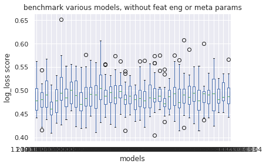


```python
# An other test could benchmark various k values of outliers threshold

def benchmark_various_outliers(     n=5, df=None, graph=True, params=None,
                                    k_list=None, model=None ) :

    if not isinstance(df, pd.DataFrame): 
        df = build_df(DATA, TRAIN_FILE)

    if not isinstance(k_list, Iterable) : 
        k_list = np.arange(1, 5, 0.1,).round(1) 

    if not model : model = LogisticRegression

    if not params : params = dict() 

    results = [ pd.Series([run_GSCV(model, params, delete_outliers(df, k))[0] for k in k_list], 
                        index=k_list) for i in range(n)]
    
    results = pd.DataFrame(results, columns=k_list)

    return results


####

results = benchmark_various_outliers(20)

```

    wrapper : called
    build_df : 0.01 secs
    wrapper : ended
    Fitting 5 folds for each of 1 candidates, totalling 5 fits
    Fitting 5 folds for each of 1 candidates, totalling 5 fits


    [Parallel(n_jobs=6)]: Done   5 out of   5 | elapsed:    0.0s finished


    Fitting 5 folds for each of 1 candidates, totalling 5 fits


    [Parallel(n_jobs=6)]: Done   5 out of   5 | elapsed:    0.0s finished


    Fitting 5 folds for each of 1 candidates, totalling 5 fits


    [Parallel(n_jobs=6)]: Done   5 out of   5 | elapsed:    0.0s finished


    Fitting 5 folds for each of 1 candidates, totalling 5 fits


    [Parallel(n_jobs=6)]: Done   5 out of   5 | elapsed:    0.0s finished


    Fitting 5 folds for each of 1 candidates, totalling 5 fits


    [Parallel(n_jobs=6)]: Done   5 out of   5 | elapsed:    0.0s finished


    Fitting 5 folds for each of 1 candidates, totalling 5 fits


    [Parallel(n_jobs=6)]: Done   5 out of   5 | elapsed:    0.0s finished


    Fitting 5 folds for each of 1 candidates, totalling 5 fits


    [Parallel(n_jobs=6)]: Done   5 out of   5 | elapsed:    0.0s finished


    Fitting 5 folds for each of 1 candidates, totalling 5 fits


    [Parallel(n_jobs=6)]: Done   5 out of   5 | elapsed:    0.0s finished


    Fitting 5 folds for each of 1 candidates, totalling 5 fits


    [Parallel(n_jobs=6)]: Done   5 out of   5 | elapsed:    0.0s finished


    Fitting 5 folds for each of 1 candidates, totalling 5 fits


    [Parallel(n_jobs=6)]: Done   5 out of   5 | elapsed:    0.0s finished


    Fitting 5 folds for each of 1 candidates, totalling 5 fits


    [Parallel(n_jobs=6)]: Done   5 out of   5 | elapsed:    0.0s finished


    Fitting 5 folds for each of 1 candidates, totalling 5 fits


    [Parallel(n_jobs=6)]: Done   5 out of   5 | elapsed:    0.0s finished


    Fitting 5 folds for each of 1 candidates, totalling 5 fits


    [Parallel(n_jobs=6)]: Done   5 out of   5 | elapsed:    0.0s finished


    Fitting 5 folds for each of 1 candidates, totalling 5 fits


    [Parallel(n_jobs=6)]: Done   5 out of   5 | elapsed:    0.0s finished


    Fitting 5 folds for each of 1 candidates, totalling 5 fits


    [Parallel(n_jobs=6)]: Done   5 out of   5 | elapsed:    0.0s finished


    Fitting 5 folds for each of 1 candidates, totalling 5 fits


    [Parallel(n_jobs=6)]: Done   5 out of   5 | elapsed:    0.0s finished


    Fitting 5 folds for each of 1 candidates, totalling 5 fits


    [Parallel(n_jobs=6)]: Done   5 out of   5 | elapsed:    0.0s finished


    Fitting 5 folds for each of 1 candidates, totalling 5 fits


    [Parallel(n_jobs=6)]: Done   5 out of   5 | elapsed:    0.0s finished


    Fitting 5 folds for each of 1 candidates, totalling 5 fits


    [Parallel(n_jobs=6)]: Done   5 out of   5 | elapsed:    0.0s finished


    Fitting 5 folds for each of 1 candidates, totalling 5 fits


    [Parallel(n_jobs=6)]: Done   5 out of   5 | elapsed:    0.0s finished


    Fitting 5 folds for each of 1 candidates, totalling 5 fits


    [Parallel(n_jobs=6)]: Done   5 out of   5 | elapsed:    0.0s finished


    Fitting 5 folds for each of 1 candidates, totalling 5 fits


    [Parallel(n_jobs=6)]: Done   5 out of   5 | elapsed:    0.0s finished


    Fitting 5 folds for each of 1 candidates, totalling 5 fits


    [Parallel(n_jobs=6)]: Done   5 out of   5 | elapsed:    0.0s finished


    Fitting 5 folds for each of 1 candidates, totalling 5 fits


    [Parallel(n_jobs=6)]: Done   5 out of   5 | elapsed:    0.0s finished


    Fitting 5 folds for each of 1 candidates, totalling 5 fits


    [Parallel(n_jobs=6)]: Done   5 out of   5 | elapsed:    0.0s finished


    Fitting 5 folds for each of 1 candidates, totalling 5 fits


    [Parallel(n_jobs=6)]: Done   5 out of   5 | elapsed:    0.1s finished


    Fitting 5 folds for each of 1 candidates, totalling 5 fits


    [Parallel(n_jobs=6)]: Done   5 out of   5 | elapsed:    0.0s finished


    Fitting 5 folds for each of 1 candidates, totalling 5 fits


    [Parallel(n_jobs=6)]: Done   5 out of   5 | elapsed:    0.0s finished


    Fitting 5 folds for each of 1 candidates, totalling 5 fits


    [Parallel(n_jobs=6)]: Done   5 out of   5 | elapsed:    0.0s finished


    Fitting 5 folds for each of 1 candidates, totalling 5 fits


    [Parallel(n_jobs=6)]: Done   5 out of   5 | elapsed:    0.0s finished


    Fitting 5 folds for each of 1 candidates, totalling 5 fits


    [Parallel(n_jobs=6)]: Done   5 out of   5 | elapsed:    0.0s finished


    Fitting 5 folds for each of 1 candidates, totalling 5 fits


    [Parallel(n_jobs=6)]: Done   5 out of   5 | elapsed:    0.0s finished


    Fitting 5 folds for each of 1 candidates, totalling 5 fits


    [Parallel(n_jobs=6)]: Done   5 out of   5 | elapsed:    0.0s finished


    Fitting 5 folds for each of 1 candidates, totalling 5 fits


    [Parallel(n_jobs=6)]: Done   5 out of   5 | elapsed:    0.0s finished


    Fitting 5 folds for each of 1 candidates, totalling 5 fits


    [Parallel(n_jobs=6)]: Done   5 out of   5 | elapsed:    0.0s finished


    Fitting 5 folds for each of 1 candidates, totalling 5 fits


    [Parallel(n_jobs=6)]: Done   5 out of   5 | elapsed:    0.0s finished


    Fitting 5 folds for each of 1 candidates, totalling 5 fits


    [Parallel(n_jobs=6)]: Done   5 out of   5 | elapsed:    0.0s finished


    Fitting 5 folds for each of 1 candidates, totalling 5 fits


    [Parallel(n_jobs=6)]: Done   5 out of   5 | elapsed:    0.0s finished


    Fitting 5 folds for each of 1 candidates, totalling 5 fits


    [Parallel(n_jobs=6)]: Done   5 out of   5 | elapsed:    0.0s finished


    Fitting 5 folds for each of 1 candidates, totalling 5 fits


    [Parallel(n_jobs=6)]: Done   5 out of   5 | elapsed:    0.0s finished


    Fitting 5 folds for each of 1 candidates, totalling 5 fits


    [Parallel(n_jobs=6)]: Done   5 out of   5 | elapsed:    0.0s finished


    Fitting 5 folds for each of 1 candidates, totalling 5 fits


    [Parallel(n_jobs=6)]: Done   5 out of   5 | elapsed:    0.0s finished


    Fitting 5 folds for each of 1 candidates, totalling 5 fits


    [Parallel(n_jobs=6)]: Done   5 out of   5 | elapsed:    0.0s finished


    Fitting 5 folds for each of 1 candidates, totalling 5 fits


    [Parallel(n_jobs=6)]: Done   5 out of   5 | elapsed:    0.0s finished


    Fitting 5 folds for each of 1 candidates, totalling 5 fits


    [Parallel(n_jobs=6)]: Done   5 out of   5 | elapsed:    0.0s finished


    Fitting 5 folds for each of 1 candidates, totalling 5 fits


    [Parallel(n_jobs=6)]: Done   5 out of   5 | elapsed:    0.0s finished


    Fitting 5 folds for each of 1 candidates, totalling 5 fits


    [Parallel(n_jobs=6)]: Done   5 out of   5 | elapsed:    0.0s finished


    Fitting 5 folds for each of 1 candidates, totalling 5 fits


    [Parallel(n_jobs=6)]: Done   5 out of   5 | elapsed:    0.0s finished


    Fitting 5 folds for each of 1 candidates, totalling 5 fits


    [Parallel(n_jobs=6)]: Done   5 out of   5 | elapsed:    0.0s finished


    Fitting 5 folds for each of 1 candidates, totalling 5 fits


    [Parallel(n_jobs=6)]: Done   5 out of   5 | elapsed:    0.0s finished


    Fitting 5 folds for each of 1 candidates, totalling 5 fits


    [Parallel(n_jobs=6)]: Done   5 out of   5 | elapsed:    0.0s finished


    Fitting 5 folds for each of 1 candidates, totalling 5 fits


    [Parallel(n_jobs=6)]: Done   5 out of   5 | elapsed:    0.0s finished


    Fitting 5 folds for each of 1 candidates, totalling 5 fits


    [Parallel(n_jobs=6)]: Done   5 out of   5 | elapsed:    0.0s finished


    Fitting 5 folds for each of 1 candidates, totalling 5 fits


    [Parallel(n_jobs=6)]: Done   5 out of   5 | elapsed:    0.0s finished


    Fitting 5 folds for each of 1 candidates, totalling 5 fits


    [Parallel(n_jobs=6)]: Done   5 out of   5 | elapsed:    0.0s finished


    Fitting 5 folds for each of 1 candidates, totalling 5 fits


    [Parallel(n_jobs=6)]: Done   5 out of   5 | elapsed:    0.0s finished


    Fitting 5 folds for each of 1 candidates, totalling 5 fits


    [Parallel(n_jobs=6)]: Done   5 out of   5 | elapsed:    0.0s finished


    Fitting 5 folds for each of 1 candidates, totalling 5 fits


    [Parallel(n_jobs=6)]: Done   5 out of   5 | elapsed:    0.0s finished


    Fitting 5 folds for each of 1 candidates, totalling 5 fits


    [Parallel(n_jobs=6)]: Done   5 out of   5 | elapsed:    0.0s finished


    Fitting 5 folds for each of 1 candidates, totalling 5 fits


    [Parallel(n_jobs=6)]: Done   5 out of   5 | elapsed:    0.0s finished


    Fitting 5 folds for each of 1 candidates, totalling 5 fits


    [Parallel(n_jobs=6)]: Done   5 out of   5 | elapsed:    0.0s finished


    Fitting 5 folds for each of 1 candidates, totalling 5 fits


    [Parallel(n_jobs=6)]: Done   5 out of   5 | elapsed:    0.0s finished


    Fitting 5 folds for each of 1 candidates, totalling 5 fits


    [Parallel(n_jobs=6)]: Done   5 out of   5 | elapsed:    0.0s finished


    Fitting 5 folds for each of 1 candidates, totalling 5 fits


    [Parallel(n_jobs=6)]: Done   5 out of   5 | elapsed:    0.0s finished


    Fitting 5 folds for each of 1 candidates, totalling 5 fits


    [Parallel(n_jobs=6)]: Done   5 out of   5 | elapsed:    0.0s finished


    Fitting 5 folds for each of 1 candidates, totalling 5 fits


    [Parallel(n_jobs=6)]: Done   5 out of   5 | elapsed:    0.0s finished


    Fitting 5 folds for each of 1 candidates, totalling 5 fits


    [Parallel(n_jobs=6)]: Done   5 out of   5 | elapsed:    0.0s finished


    Fitting 5 folds for each of 1 candidates, totalling 5 fits


    [Parallel(n_jobs=6)]: Done   5 out of   5 | elapsed:    0.0s finished


    Fitting 5 folds for each of 1 candidates, totalling 5 fits


    [Parallel(n_jobs=6)]: Done   5 out of   5 | elapsed:    0.0s finished


    Fitting 5 folds for each of 1 candidates, totalling 5 fits


    [Parallel(n_jobs=6)]: Done   5 out of   5 | elapsed:    0.0s finished


    Fitting 5 folds for each of 1 candidates, totalling 5 fits


    [Parallel(n_jobs=6)]: Done   5 out of   5 | elapsed:    0.0s finished


    Fitting 5 folds for each of 1 candidates, totalling 5 fits


    [Parallel(n_jobs=6)]: Done   5 out of   5 | elapsed:    0.0s finished


    Fitting 5 folds for each of 1 candidates, totalling 5 fits


    [Parallel(n_jobs=6)]: Done   5 out of   5 | elapsed:    0.0s finished


    Fitting 5 folds for each of 1 candidates, totalling 5 fits


    [Parallel(n_jobs=6)]: Done   5 out of   5 | elapsed:    0.0s finished


    Fitting 5 folds for each of 1 candidates, totalling 5 fits


    [Parallel(n_jobs=6)]: Done   5 out of   5 | elapsed:    0.0s finished


    Fitting 5 folds for each of 1 candidates, totalling 5 fits


    [Parallel(n_jobs=6)]: Done   5 out of   5 | elapsed:    0.0s finished


    Fitting 5 folds for each of 1 candidates, totalling 5 fits


    [Parallel(n_jobs=6)]: Done   5 out of   5 | elapsed:    0.0s finished


    Fitting 5 folds for each of 1 candidates, totalling 5 fits


    [Parallel(n_jobs=6)]: Done   5 out of   5 | elapsed:    0.0s finished


    Fitting 5 folds for each of 1 candidates, totalling 5 fits


    [Parallel(n_jobs=6)]: Done   5 out of   5 | elapsed:    0.0s finished


    Fitting 5 folds for each of 1 candidates, totalling 5 fits


    [Parallel(n_jobs=6)]: Done   5 out of   5 | elapsed:    0.0s finished


    Fitting 5 folds for each of 1 candidates, totalling 5 fits


    [Parallel(n_jobs=6)]: Done   5 out of   5 | elapsed:    0.0s finished


    Fitting 5 folds for each of 1 candidates, totalling 5 fits


    [Parallel(n_jobs=6)]: Done   5 out of   5 | elapsed:    0.0s finished


    Fitting 5 folds for each of 1 candidates, totalling 5 fits


    [Parallel(n_jobs=6)]: Done   5 out of   5 | elapsed:    0.0s finished


    Fitting 5 folds for each of 1 candidates, totalling 5 fits


    [Parallel(n_jobs=6)]: Done   5 out of   5 | elapsed:    0.0s finished


    Fitting 5 folds for each of 1 candidates, totalling 5 fits


    [Parallel(n_jobs=6)]: Done   5 out of   5 | elapsed:    0.0s finished


    Fitting 5 folds for each of 1 candidates, totalling 5 fits


    [Parallel(n_jobs=6)]: Done   5 out of   5 | elapsed:    0.0s finished


    Fitting 5 folds for each of 1 candidates, totalling 5 fits


    [Parallel(n_jobs=6)]: Done   5 out of   5 | elapsed:    0.0s finished


    Fitting 5 folds for each of 1 candidates, totalling 5 fits


    [Parallel(n_jobs=6)]: Done   5 out of   5 | elapsed:    0.0s finished


    Fitting 5 folds for each of 1 candidates, totalling 5 fits


    [Parallel(n_jobs=6)]: Done   5 out of   5 | elapsed:    0.0s finished


    Fitting 5 folds for each of 1 candidates, totalling 5 fits


    [Parallel(n_jobs=6)]: Done   5 out of   5 | elapsed:    0.0s finished


    Fitting 5 folds for each of 1 candidates, totalling 5 fits


    [Parallel(n_jobs=6)]: Done   5 out of   5 | elapsed:    0.0s finished


    Fitting 5 folds for each of 1 candidates, totalling 5 fits


    [Parallel(n_jobs=6)]: Done   5 out of   5 | elapsed:    0.0s finished


    Fitting 5 folds for each of 1 candidates, totalling 5 fits


    [Parallel(n_jobs=6)]: Done   5 out of   5 | elapsed:    0.0s finished


    Fitting 5 folds for each of 1 candidates, totalling 5 fits


    [Parallel(n_jobs=6)]: Done   5 out of   5 | elapsed:    0.0s finished


    Fitting 5 folds for each of 1 candidates, totalling 5 fits


    [Parallel(n_jobs=6)]: Done   5 out of   5 | elapsed:    0.0s finished


    Fitting 5 folds for each of 1 candidates, totalling 5 fits


    [Parallel(n_jobs=6)]: Done   5 out of   5 | elapsed:    0.0s finished


    Fitting 5 folds for each of 1 candidates, totalling 5 fits


    [Parallel(n_jobs=6)]: Done   5 out of   5 | elapsed:    0.0s finished


    Fitting 5 folds for each of 1 candidates, totalling 5 fits


    [Parallel(n_jobs=6)]: Done   5 out of   5 | elapsed:    0.0s finished


    Fitting 5 folds for each of 1 candidates, totalling 5 fits


    [Parallel(n_jobs=6)]: Done   5 out of   5 | elapsed:    0.0s finished


    Fitting 5 folds for each of 1 candidates, totalling 5 fits


    [Parallel(n_jobs=6)]: Done   5 out of   5 | elapsed:    0.0s finished


    Fitting 5 folds for each of 1 candidates, totalling 5 fits


    [Parallel(n_jobs=6)]: Done   5 out of   5 | elapsed:    0.0s finished


    Fitting 5 folds for each of 1 candidates, totalling 5 fits


    [Parallel(n_jobs=6)]: Done   5 out of   5 | elapsed:    0.0s finished


    Fitting 5 folds for each of 1 candidates, totalling 5 fits


    [Parallel(n_jobs=6)]: Done   5 out of   5 | elapsed:    0.0s finished


    Fitting 5 folds for each of 1 candidates, totalling 5 fits


    [Parallel(n_jobs=6)]: Done   5 out of   5 | elapsed:    0.0s finished


    Fitting 5 folds for each of 1 candidates, totalling 5 fits


    [Parallel(n_jobs=6)]: Done   5 out of   5 | elapsed:    0.0s finished


    Fitting 5 folds for each of 1 candidates, totalling 5 fits


    [Parallel(n_jobs=6)]: Done   5 out of   5 | elapsed:    0.0s finished


    Fitting 5 folds for each of 1 candidates, totalling 5 fits


    [Parallel(n_jobs=6)]: Done   5 out of   5 | elapsed:    0.0s finished


    Fitting 5 folds for each of 1 candidates, totalling 5 fits


    [Parallel(n_jobs=6)]: Done   5 out of   5 | elapsed:    0.0s finished


    Fitting 5 folds for each of 1 candidates, totalling 5 fits


    [Parallel(n_jobs=6)]: Done   5 out of   5 | elapsed:    0.0s finished


    Fitting 5 folds for each of 1 candidates, totalling 5 fits


    [Parallel(n_jobs=6)]: Done   5 out of   5 | elapsed:    0.0s finished


    Fitting 5 folds for each of 1 candidates, totalling 5 fits


    [Parallel(n_jobs=6)]: Done   5 out of   5 | elapsed:    0.0s finished


    Fitting 5 folds for each of 1 candidates, totalling 5 fits


    [Parallel(n_jobs=6)]: Done   5 out of   5 | elapsed:    0.0s finished


    Fitting 5 folds for each of 1 candidates, totalling 5 fits


    [Parallel(n_jobs=6)]: Done   5 out of   5 | elapsed:    0.0s finished


    Fitting 5 folds for each of 1 candidates, totalling 5 fits


    [Parallel(n_jobs=6)]: Done   5 out of   5 | elapsed:    0.0s finished


    Fitting 5 folds for each of 1 candidates, totalling 5 fits


    [Parallel(n_jobs=6)]: Done   5 out of   5 | elapsed:    0.0s finished


    Fitting 5 folds for each of 1 candidates, totalling 5 fits


    [Parallel(n_jobs=6)]: Done   5 out of   5 | elapsed:    0.0s finished


    Fitting 5 folds for each of 1 candidates, totalling 5 fits


    [Parallel(n_jobs=6)]: Done   5 out of   5 | elapsed:    0.0s finished


    Fitting 5 folds for each of 1 candidates, totalling 5 fits


    [Parallel(n_jobs=6)]: Done   5 out of   5 | elapsed:    0.0s finished


    Fitting 5 folds for each of 1 candidates, totalling 5 fits


    [Parallel(n_jobs=6)]: Done   5 out of   5 | elapsed:    0.0s finished


    Fitting 5 folds for each of 1 candidates, totalling 5 fits


    [Parallel(n_jobs=6)]: Done   5 out of   5 | elapsed:    0.0s finished


    Fitting 5 folds for each of 1 candidates, totalling 5 fits


    [Parallel(n_jobs=6)]: Done   5 out of   5 | elapsed:    0.0s finished


    Fitting 5 folds for each of 1 candidates, totalling 5 fits


    [Parallel(n_jobs=6)]: Done   5 out of   5 | elapsed:    0.0s finished


    Fitting 5 folds for each of 1 candidates, totalling 5 fits


    [Parallel(n_jobs=6)]: Done   5 out of   5 | elapsed:    0.0s finished


    Fitting 5 folds for each of 1 candidates, totalling 5 fits


    [Parallel(n_jobs=6)]: Done   5 out of   5 | elapsed:    0.0s finished


    Fitting 5 folds for each of 1 candidates, totalling 5 fits


    [Parallel(n_jobs=6)]: Done   5 out of   5 | elapsed:    0.0s finished


    Fitting 5 folds for each of 1 candidates, totalling 5 fits


    [Parallel(n_jobs=6)]: Done   5 out of   5 | elapsed:    0.0s finished


    Fitting 5 folds for each of 1 candidates, totalling 5 fits


    [Parallel(n_jobs=6)]: Done   5 out of   5 | elapsed:    0.0s finished


    Fitting 5 folds for each of 1 candidates, totalling 5 fits


    [Parallel(n_jobs=6)]: Done   5 out of   5 | elapsed:    0.0s finished


    Fitting 5 folds for each of 1 candidates, totalling 5 fits


    [Parallel(n_jobs=6)]: Done   5 out of   5 | elapsed:    0.0s finished


    Fitting 5 folds for each of 1 candidates, totalling 5 fits


    [Parallel(n_jobs=6)]: Done   5 out of   5 | elapsed:    0.0s finished


    Fitting 5 folds for each of 1 candidates, totalling 5 fits


    [Parallel(n_jobs=6)]: Done   5 out of   5 | elapsed:    0.0s finished


    Fitting 5 folds for each of 1 candidates, totalling 5 fits


    [Parallel(n_jobs=6)]: Done   5 out of   5 | elapsed:    0.0s finished


    Fitting 5 folds for each of 1 candidates, totalling 5 fits


    [Parallel(n_jobs=6)]: Done   5 out of   5 | elapsed:    0.0s finished


    Fitting 5 folds for each of 1 candidates, totalling 5 fits


    [Parallel(n_jobs=6)]: Done   5 out of   5 | elapsed:    0.0s finished


    Fitting 5 folds for each of 1 candidates, totalling 5 fits


    [Parallel(n_jobs=6)]: Done   5 out of   5 | elapsed:    0.0s finished


    Fitting 5 folds for each of 1 candidates, totalling 5 fits


    [Parallel(n_jobs=6)]: Done   5 out of   5 | elapsed:    0.0s finished


    Fitting 5 folds for each of 1 candidates, totalling 5 fits


    [Parallel(n_jobs=6)]: Done   5 out of   5 | elapsed:    0.0s finished


    Fitting 5 folds for each of 1 candidates, totalling 5 fits


    [Parallel(n_jobs=6)]: Done   5 out of   5 | elapsed:    0.0s finished


    Fitting 5 folds for each of 1 candidates, totalling 5 fits


    [Parallel(n_jobs=6)]: Done   5 out of   5 | elapsed:    0.0s finished


    Fitting 5 folds for each of 1 candidates, totalling 5 fits


    [Parallel(n_jobs=6)]: Done   5 out of   5 | elapsed:    0.0s finished


    Fitting 5 folds for each of 1 candidates, totalling 5 fits


    [Parallel(n_jobs=6)]: Done   5 out of   5 | elapsed:    0.0s finished


    Fitting 5 folds for each of 1 candidates, totalling 5 fits


    [Parallel(n_jobs=6)]: Done   5 out of   5 | elapsed:    0.0s finished


    Fitting 5 folds for each of 1 candidates, totalling 5 fits


    [Parallel(n_jobs=6)]: Done   5 out of   5 | elapsed:    0.0s finished


    Fitting 5 folds for each of 1 candidates, totalling 5 fits


    [Parallel(n_jobs=6)]: Done   5 out of   5 | elapsed:    0.0s finished


    Fitting 5 folds for each of 1 candidates, totalling 5 fits


    [Parallel(n_jobs=6)]: Done   5 out of   5 | elapsed:    0.0s finished


    Fitting 5 folds for each of 1 candidates, totalling 5 fits


    [Parallel(n_jobs=6)]: Done   5 out of   5 | elapsed:    0.0s finished


    Fitting 5 folds for each of 1 candidates, totalling 5 fits


    [Parallel(n_jobs=6)]: Done   5 out of   5 | elapsed:    0.0s finished


    Fitting 5 folds for each of 1 candidates, totalling 5 fits


    [Parallel(n_jobs=6)]: Done   5 out of   5 | elapsed:    0.0s finished


    Fitting 5 folds for each of 1 candidates, totalling 5 fits


    [Parallel(n_jobs=6)]: Done   5 out of   5 | elapsed:    0.0s finished


    Fitting 5 folds for each of 1 candidates, totalling 5 fits


    [Parallel(n_jobs=6)]: Done   5 out of   5 | elapsed:    0.0s finished


    Fitting 5 folds for each of 1 candidates, totalling 5 fits


    [Parallel(n_jobs=6)]: Done   5 out of   5 | elapsed:    0.0s finished


    Fitting 5 folds for each of 1 candidates, totalling 5 fits


    [Parallel(n_jobs=6)]: Done   5 out of   5 | elapsed:    0.0s finished


    Fitting 5 folds for each of 1 candidates, totalling 5 fits


    [Parallel(n_jobs=6)]: Done   5 out of   5 | elapsed:    0.0s finished


    Fitting 5 folds for each of 1 candidates, totalling 5 fits


    [Parallel(n_jobs=6)]: Done   5 out of   5 | elapsed:    0.0s finished


    Fitting 5 folds for each of 1 candidates, totalling 5 fits


    [Parallel(n_jobs=6)]: Done   5 out of   5 | elapsed:    0.0s finished


    Fitting 5 folds for each of 1 candidates, totalling 5 fits


    [Parallel(n_jobs=6)]: Done   5 out of   5 | elapsed:    0.0s finished


    Fitting 5 folds for each of 1 candidates, totalling 5 fits


    [Parallel(n_jobs=6)]: Done   5 out of   5 | elapsed:    0.0s finished


    Fitting 5 folds for each of 1 candidates, totalling 5 fits


    [Parallel(n_jobs=6)]: Done   5 out of   5 | elapsed:    0.0s finished


    Fitting 5 folds for each of 1 candidates, totalling 5 fits


    [Parallel(n_jobs=6)]: Done   5 out of   5 | elapsed:    0.0s finished


    Fitting 5 folds for each of 1 candidates, totalling 5 fits


    [Parallel(n_jobs=6)]: Done   5 out of   5 | elapsed:    0.0s finished


    Fitting 5 folds for each of 1 candidates, totalling 5 fits


    [Parallel(n_jobs=6)]: Done   5 out of   5 | elapsed:    0.0s finished


    Fitting 5 folds for each of 1 candidates, totalling 5 fits


    [Parallel(n_jobs=6)]: Done   5 out of   5 | elapsed:    0.0s finished


    Fitting 5 folds for each of 1 candidates, totalling 5 fits


    [Parallel(n_jobs=6)]: Done   5 out of   5 | elapsed:    0.0s finished


    Fitting 5 folds for each of 1 candidates, totalling 5 fits


    [Parallel(n_jobs=6)]: Done   5 out of   5 | elapsed:    0.0s finished


    Fitting 5 folds for each of 1 candidates, totalling 5 fits


    [Parallel(n_jobs=6)]: Done   5 out of   5 | elapsed:    0.0s finished


    Fitting 5 folds for each of 1 candidates, totalling 5 fits


    [Parallel(n_jobs=6)]: Done   5 out of   5 | elapsed:    0.0s finished


    Fitting 5 folds for each of 1 candidates, totalling 5 fits


    [Parallel(n_jobs=6)]: Done   5 out of   5 | elapsed:    0.0s finished


    Fitting 5 folds for each of 1 candidates, totalling 5 fits


    [Parallel(n_jobs=6)]: Done   5 out of   5 | elapsed:    0.0s finished


    Fitting 5 folds for each of 1 candidates, totalling 5 fits


    [Parallel(n_jobs=6)]: Done   5 out of   5 | elapsed:    0.0s finished


    Fitting 5 folds for each of 1 candidates, totalling 5 fits


    [Parallel(n_jobs=6)]: Done   5 out of   5 | elapsed:    0.0s finished


    Fitting 5 folds for each of 1 candidates, totalling 5 fits


    [Parallel(n_jobs=6)]: Done   5 out of   5 | elapsed:    0.0s finished


    Fitting 5 folds for each of 1 candidates, totalling 5 fits


    [Parallel(n_jobs=6)]: Done   5 out of   5 | elapsed:    0.0s finished


    Fitting 5 folds for each of 1 candidates, totalling 5 fits


    [Parallel(n_jobs=6)]: Done   5 out of   5 | elapsed:    0.0s finished


    Fitting 5 folds for each of 1 candidates, totalling 5 fits


    [Parallel(n_jobs=6)]: Done   5 out of   5 | elapsed:    0.0s finished


    Fitting 5 folds for each of 1 candidates, totalling 5 fits


    [Parallel(n_jobs=6)]: Done   5 out of   5 | elapsed:    0.0s finished


    Fitting 5 folds for each of 1 candidates, totalling 5 fits


    [Parallel(n_jobs=6)]: Done   5 out of   5 | elapsed:    0.0s finished


    Fitting 5 folds for each of 1 candidates, totalling 5 fits


    [Parallel(n_jobs=6)]: Done   5 out of   5 | elapsed:    0.0s finished


    Fitting 5 folds for each of 1 candidates, totalling 5 fits


    [Parallel(n_jobs=6)]: Done   5 out of   5 | elapsed:    0.0s finished


    Fitting 5 folds for each of 1 candidates, totalling 5 fits


    [Parallel(n_jobs=6)]: Done   5 out of   5 | elapsed:    0.0s finished


    Fitting 5 folds for each of 1 candidates, totalling 5 fits


    [Parallel(n_jobs=6)]: Done   5 out of   5 | elapsed:    0.0s finished


    Fitting 5 folds for each of 1 candidates, totalling 5 fits


    [Parallel(n_jobs=6)]: Done   5 out of   5 | elapsed:    0.0s finished


    Fitting 5 folds for each of 1 candidates, totalling 5 fits


    [Parallel(n_jobs=6)]: Done   5 out of   5 | elapsed:    0.0s finished


    Fitting 5 folds for each of 1 candidates, totalling 5 fits


    [Parallel(n_jobs=6)]: Done   5 out of   5 | elapsed:    0.0s finished


    Fitting 5 folds for each of 1 candidates, totalling 5 fits


    [Parallel(n_jobs=6)]: Done   5 out of   5 | elapsed:    0.0s finished


    Fitting 5 folds for each of 1 candidates, totalling 5 fits


    [Parallel(n_jobs=6)]: Done   5 out of   5 | elapsed:    0.0s finished


    Fitting 5 folds for each of 1 candidates, totalling 5 fits


    [Parallel(n_jobs=6)]: Done   5 out of   5 | elapsed:    0.0s finished


    Fitting 5 folds for each of 1 candidates, totalling 5 fits


    [Parallel(n_jobs=6)]: Done   5 out of   5 | elapsed:    0.0s finished


    Fitting 5 folds for each of 1 candidates, totalling 5 fits


    [Parallel(n_jobs=6)]: Done   5 out of   5 | elapsed:    0.0s finished


    Fitting 5 folds for each of 1 candidates, totalling 5 fits


    [Parallel(n_jobs=6)]: Done   5 out of   5 | elapsed:    0.0s finished


    Fitting 5 folds for each of 1 candidates, totalling 5 fits


    [Parallel(n_jobs=6)]: Done   5 out of   5 | elapsed:    0.0s finished


    Fitting 5 folds for each of 1 candidates, totalling 5 fits


    [Parallel(n_jobs=6)]: Done   5 out of   5 | elapsed:    0.0s finished


    Fitting 5 folds for each of 1 candidates, totalling 5 fits


    [Parallel(n_jobs=6)]: Done   5 out of   5 | elapsed:    0.0s finished


    Fitting 5 folds for each of 1 candidates, totalling 5 fits


    [Parallel(n_jobs=6)]: Done   5 out of   5 | elapsed:    0.0s finished


    Fitting 5 folds for each of 1 candidates, totalling 5 fits


    [Parallel(n_jobs=6)]: Done   5 out of   5 | elapsed:    0.0s finished


    Fitting 5 folds for each of 1 candidates, totalling 5 fits


    [Parallel(n_jobs=6)]: Done   5 out of   5 | elapsed:    0.0s finished


    Fitting 5 folds for each of 1 candidates, totalling 5 fits


    [Parallel(n_jobs=6)]: Done   5 out of   5 | elapsed:    0.0s finished


    Fitting 5 folds for each of 1 candidates, totalling 5 fits


    [Parallel(n_jobs=6)]: Done   5 out of   5 | elapsed:    0.0s finished


    Fitting 5 folds for each of 1 candidates, totalling 5 fits


    [Parallel(n_jobs=6)]: Done   5 out of   5 | elapsed:    0.0s finished


    Fitting 5 folds for each of 1 candidates, totalling 5 fits


    [Parallel(n_jobs=6)]: Done   5 out of   5 | elapsed:    0.0s finished


    Fitting 5 folds for each of 1 candidates, totalling 5 fits


    [Parallel(n_jobs=6)]: Done   5 out of   5 | elapsed:    0.0s finished


    Fitting 5 folds for each of 1 candidates, totalling 5 fits


    [Parallel(n_jobs=6)]: Done   5 out of   5 | elapsed:    0.0s finished


    Fitting 5 folds for each of 1 candidates, totalling 5 fits


    [Parallel(n_jobs=6)]: Done   5 out of   5 | elapsed:    0.0s finished


    Fitting 5 folds for each of 1 candidates, totalling 5 fits


    [Parallel(n_jobs=6)]: Done   5 out of   5 | elapsed:    0.0s finished


    Fitting 5 folds for each of 1 candidates, totalling 5 fits


    [Parallel(n_jobs=6)]: Done   5 out of   5 | elapsed:    0.0s finished


    Fitting 5 folds for each of 1 candidates, totalling 5 fits


    [Parallel(n_jobs=6)]: Done   5 out of   5 | elapsed:    0.0s finished


    Fitting 5 folds for each of 1 candidates, totalling 5 fits


    [Parallel(n_jobs=6)]: Done   5 out of   5 | elapsed:    0.0s finished


    Fitting 5 folds for each of 1 candidates, totalling 5 fits


    [Parallel(n_jobs=6)]: Done   5 out of   5 | elapsed:    0.0s finished


    Fitting 5 folds for each of 1 candidates, totalling 5 fits


    [Parallel(n_jobs=6)]: Done   5 out of   5 | elapsed:    0.0s finished


    Fitting 5 folds for each of 1 candidates, totalling 5 fits


    [Parallel(n_jobs=6)]: Done   5 out of   5 | elapsed:    0.0s finished


    Fitting 5 folds for each of 1 candidates, totalling 5 fits


    [Parallel(n_jobs=6)]: Done   5 out of   5 | elapsed:    0.0s finished


    Fitting 5 folds for each of 1 candidates, totalling 5 fits


    [Parallel(n_jobs=6)]: Done   5 out of   5 | elapsed:    0.0s finished


    Fitting 5 folds for each of 1 candidates, totalling 5 fits


    [Parallel(n_jobs=6)]: Done   5 out of   5 | elapsed:    0.0s finished


    Fitting 5 folds for each of 1 candidates, totalling 5 fits


    [Parallel(n_jobs=6)]: Done   5 out of   5 | elapsed:    0.0s finished


    Fitting 5 folds for each of 1 candidates, totalling 5 fits


    [Parallel(n_jobs=6)]: Done   5 out of   5 | elapsed:    0.0s finished


    Fitting 5 folds for each of 1 candidates, totalling 5 fits


    [Parallel(n_jobs=6)]: Done   5 out of   5 | elapsed:    0.0s finished


    Fitting 5 folds for each of 1 candidates, totalling 5 fits


    [Parallel(n_jobs=6)]: Done   5 out of   5 | elapsed:    0.0s finished


    Fitting 5 folds for each of 1 candidates, totalling 5 fits


    [Parallel(n_jobs=6)]: Done   5 out of   5 | elapsed:    0.0s finished


    Fitting 5 folds for each of 1 candidates, totalling 5 fits


    [Parallel(n_jobs=6)]: Done   5 out of   5 | elapsed:    0.0s finished


    Fitting 5 folds for each of 1 candidates, totalling 5 fits


    [Parallel(n_jobs=6)]: Done   5 out of   5 | elapsed:    0.0s finished


    Fitting 5 folds for each of 1 candidates, totalling 5 fits


    [Parallel(n_jobs=6)]: Done   5 out of   5 | elapsed:    0.0s finished


    Fitting 5 folds for each of 1 candidates, totalling 5 fits


    [Parallel(n_jobs=6)]: Done   5 out of   5 | elapsed:    0.0s finished


    Fitting 5 folds for each of 1 candidates, totalling 5 fits


    [Parallel(n_jobs=6)]: Done   5 out of   5 | elapsed:    0.0s finished


    Fitting 5 folds for each of 1 candidates, totalling 5 fits


    [Parallel(n_jobs=6)]: Done   5 out of   5 | elapsed:    0.0s finished


    Fitting 5 folds for each of 1 candidates, totalling 5 fits


    [Parallel(n_jobs=6)]: Done   5 out of   5 | elapsed:    0.0s finished


    Fitting 5 folds for each of 1 candidates, totalling 5 fits


    [Parallel(n_jobs=6)]: Done   5 out of   5 | elapsed:    0.0s finished


    Fitting 5 folds for each of 1 candidates, totalling 5 fits


    [Parallel(n_jobs=6)]: Done   5 out of   5 | elapsed:    0.0s finished


    Fitting 5 folds for each of 1 candidates, totalling 5 fits


    [Parallel(n_jobs=6)]: Done   5 out of   5 | elapsed:    0.0s finished


    Fitting 5 folds for each of 1 candidates, totalling 5 fits


    [Parallel(n_jobs=6)]: Done   5 out of   5 | elapsed:    0.0s finished


    Fitting 5 folds for each of 1 candidates, totalling 5 fits


    [Parallel(n_jobs=6)]: Done   5 out of   5 | elapsed:    0.0s finished


    Fitting 5 folds for each of 1 candidates, totalling 5 fits


    [Parallel(n_jobs=6)]: Done   5 out of   5 | elapsed:    0.0s finished


    Fitting 5 folds for each of 1 candidates, totalling 5 fits


    [Parallel(n_jobs=6)]: Done   5 out of   5 | elapsed:    0.0s finished


    Fitting 5 folds for each of 1 candidates, totalling 5 fits


    [Parallel(n_jobs=6)]: Done   5 out of   5 | elapsed:    0.0s finished


    Fitting 5 folds for each of 1 candidates, totalling 5 fits


    [Parallel(n_jobs=6)]: Done   5 out of   5 | elapsed:    0.0s finished


    Fitting 5 folds for each of 1 candidates, totalling 5 fits


    [Parallel(n_jobs=6)]: Done   5 out of   5 | elapsed:    0.0s finished


    Fitting 5 folds for each of 1 candidates, totalling 5 fits


    [Parallel(n_jobs=6)]: Done   5 out of   5 | elapsed:    0.0s finished


    Fitting 5 folds for each of 1 candidates, totalling 5 fits


    [Parallel(n_jobs=6)]: Done   5 out of   5 | elapsed:    0.0s finished


    Fitting 5 folds for each of 1 candidates, totalling 5 fits


    [Parallel(n_jobs=6)]: Done   5 out of   5 | elapsed:    0.0s finished


    Fitting 5 folds for each of 1 candidates, totalling 5 fits


    [Parallel(n_jobs=6)]: Done   5 out of   5 | elapsed:    0.0s finished


    Fitting 5 folds for each of 1 candidates, totalling 5 fits


    [Parallel(n_jobs=6)]: Done   5 out of   5 | elapsed:    0.0s finished


    Fitting 5 folds for each of 1 candidates, totalling 5 fits


    [Parallel(n_jobs=6)]: Done   5 out of   5 | elapsed:    0.0s finished


    Fitting 5 folds for each of 1 candidates, totalling 5 fits


    [Parallel(n_jobs=6)]: Done   5 out of   5 | elapsed:    0.0s finished


    Fitting 5 folds for each of 1 candidates, totalling 5 fits


    [Parallel(n_jobs=6)]: Done   5 out of   5 | elapsed:    0.0s finished


    Fitting 5 folds for each of 1 candidates, totalling 5 fits


    [Parallel(n_jobs=6)]: Done   5 out of   5 | elapsed:    0.0s finished


    Fitting 5 folds for each of 1 candidates, totalling 5 fits


    [Parallel(n_jobs=6)]: Done   5 out of   5 | elapsed:    0.0s finished


    Fitting 5 folds for each of 1 candidates, totalling 5 fits


    [Parallel(n_jobs=6)]: Done   5 out of   5 | elapsed:    0.0s finished


    Fitting 5 folds for each of 1 candidates, totalling 5 fits


    [Parallel(n_jobs=6)]: Done   5 out of   5 | elapsed:    0.0s finished


    Fitting 5 folds for each of 1 candidates, totalling 5 fits


    [Parallel(n_jobs=6)]: Done   5 out of   5 | elapsed:    0.0s finished


    Fitting 5 folds for each of 1 candidates, totalling 5 fits


    [Parallel(n_jobs=6)]: Done   5 out of   5 | elapsed:    0.0s finished


    Fitting 5 folds for each of 1 candidates, totalling 5 fits


    [Parallel(n_jobs=6)]: Done   5 out of   5 | elapsed:    0.0s finished


    Fitting 5 folds for each of 1 candidates, totalling 5 fits


    [Parallel(n_jobs=6)]: Done   5 out of   5 | elapsed:    0.0s finished


    Fitting 5 folds for each of 1 candidates, totalling 5 fits


    [Parallel(n_jobs=6)]: Done   5 out of   5 | elapsed:    0.0s finished


    Fitting 5 folds for each of 1 candidates, totalling 5 fits


    [Parallel(n_jobs=6)]: Done   5 out of   5 | elapsed:    0.0s finished


    Fitting 5 folds for each of 1 candidates, totalling 5 fits


    [Parallel(n_jobs=6)]: Done   5 out of   5 | elapsed:    0.0s finished


    Fitting 5 folds for each of 1 candidates, totalling 5 fits


    [Parallel(n_jobs=6)]: Done   5 out of   5 | elapsed:    0.0s finished


    Fitting 5 folds for each of 1 candidates, totalling 5 fits


    [Parallel(n_jobs=6)]: Done   5 out of   5 | elapsed:    0.0s finished


    Fitting 5 folds for each of 1 candidates, totalling 5 fits


    [Parallel(n_jobs=6)]: Done   5 out of   5 | elapsed:    0.0s finished


    Fitting 5 folds for each of 1 candidates, totalling 5 fits


    [Parallel(n_jobs=6)]: Done   5 out of   5 | elapsed:    0.0s finished


    Fitting 5 folds for each of 1 candidates, totalling 5 fits


    [Parallel(n_jobs=6)]: Done   5 out of   5 | elapsed:    0.0s finished


    Fitting 5 folds for each of 1 candidates, totalling 5 fits


    [Parallel(n_jobs=6)]: Done   5 out of   5 | elapsed:    0.0s finished


    Fitting 5 folds for each of 1 candidates, totalling 5 fits


    [Parallel(n_jobs=6)]: Done   5 out of   5 | elapsed:    0.0s finished


    Fitting 5 folds for each of 1 candidates, totalling 5 fits


    [Parallel(n_jobs=6)]: Done   5 out of   5 | elapsed:    0.0s finished


    Fitting 5 folds for each of 1 candidates, totalling 5 fits


    [Parallel(n_jobs=6)]: Done   5 out of   5 | elapsed:    0.0s finished


    Fitting 5 folds for each of 1 candidates, totalling 5 fits


    [Parallel(n_jobs=6)]: Done   5 out of   5 | elapsed:    0.0s finished


    Fitting 5 folds for each of 1 candidates, totalling 5 fits


    [Parallel(n_jobs=6)]: Done   5 out of   5 | elapsed:    0.0s finished


    Fitting 5 folds for each of 1 candidates, totalling 5 fits


    [Parallel(n_jobs=6)]: Done   5 out of   5 | elapsed:    0.0s finished


    Fitting 5 folds for each of 1 candidates, totalling 5 fits


    [Parallel(n_jobs=6)]: Done   5 out of   5 | elapsed:    0.0s finished


    Fitting 5 folds for each of 1 candidates, totalling 5 fits


    [Parallel(n_jobs=6)]: Done   5 out of   5 | elapsed:    0.0s finished


    Fitting 5 folds for each of 1 candidates, totalling 5 fits


    [Parallel(n_jobs=6)]: Done   5 out of   5 | elapsed:    0.0s finished


    Fitting 5 folds for each of 1 candidates, totalling 5 fits


    [Parallel(n_jobs=6)]: Done   5 out of   5 | elapsed:    0.0s finished


    Fitting 5 folds for each of 1 candidates, totalling 5 fits


    [Parallel(n_jobs=6)]: Done   5 out of   5 | elapsed:    0.0s finished


    Fitting 5 folds for each of 1 candidates, totalling 5 fits


    [Parallel(n_jobs=6)]: Done   5 out of   5 | elapsed:    0.0s finished


    Fitting 5 folds for each of 1 candidates, totalling 5 fits


    [Parallel(n_jobs=6)]: Done   5 out of   5 | elapsed:    0.0s finished


    Fitting 5 folds for each of 1 candidates, totalling 5 fits


    [Parallel(n_jobs=6)]: Done   5 out of   5 | elapsed:    0.0s finished


    Fitting 5 folds for each of 1 candidates, totalling 5 fits


    [Parallel(n_jobs=6)]: Done   5 out of   5 | elapsed:    0.0s finished


    Fitting 5 folds for each of 1 candidates, totalling 5 fits


    [Parallel(n_jobs=6)]: Done   5 out of   5 | elapsed:    0.0s finished


    Fitting 5 folds for each of 1 candidates, totalling 5 fits


    [Parallel(n_jobs=6)]: Done   5 out of   5 | elapsed:    0.0s finished


    Fitting 5 folds for each of 1 candidates, totalling 5 fits


    [Parallel(n_jobs=6)]: Done   5 out of   5 | elapsed:    0.0s finished


    Fitting 5 folds for each of 1 candidates, totalling 5 fits


    [Parallel(n_jobs=6)]: Done   5 out of   5 | elapsed:    0.0s finished


    Fitting 5 folds for each of 1 candidates, totalling 5 fits


    [Parallel(n_jobs=6)]: Done   5 out of   5 | elapsed:    0.0s finished


    Fitting 5 folds for each of 1 candidates, totalling 5 fits


    [Parallel(n_jobs=6)]: Done   5 out of   5 | elapsed:    0.0s finished


    Fitting 5 folds for each of 1 candidates, totalling 5 fits


    [Parallel(n_jobs=6)]: Done   5 out of   5 | elapsed:    0.0s finished


    Fitting 5 folds for each of 1 candidates, totalling 5 fits


    [Parallel(n_jobs=6)]: Done   5 out of   5 | elapsed:    0.0s finished


    Fitting 5 folds for each of 1 candidates, totalling 5 fits


    [Parallel(n_jobs=6)]: Done   5 out of   5 | elapsed:    0.0s finished


    Fitting 5 folds for each of 1 candidates, totalling 5 fits


    [Parallel(n_jobs=6)]: Done   5 out of   5 | elapsed:    0.0s finished


    Fitting 5 folds for each of 1 candidates, totalling 5 fits


    [Parallel(n_jobs=6)]: Done   5 out of   5 | elapsed:    0.0s finished


    Fitting 5 folds for each of 1 candidates, totalling 5 fits


    [Parallel(n_jobs=6)]: Done   5 out of   5 | elapsed:    0.0s finished


    Fitting 5 folds for each of 1 candidates, totalling 5 fits


    [Parallel(n_jobs=6)]: Done   5 out of   5 | elapsed:    0.0s finished


    Fitting 5 folds for each of 1 candidates, totalling 5 fits


    [Parallel(n_jobs=6)]: Done   5 out of   5 | elapsed:    0.0s finished


    Fitting 5 folds for each of 1 candidates, totalling 5 fits


    [Parallel(n_jobs=6)]: Done   5 out of   5 | elapsed:    0.0s finished


    Fitting 5 folds for each of 1 candidates, totalling 5 fits


    [Parallel(n_jobs=6)]: Done   5 out of   5 | elapsed:    0.0s finished


    Fitting 5 folds for each of 1 candidates, totalling 5 fits


    [Parallel(n_jobs=6)]: Done   5 out of   5 | elapsed:    0.0s finished


    Fitting 5 folds for each of 1 candidates, totalling 5 fits


    [Parallel(n_jobs=6)]: Done   5 out of   5 | elapsed:    0.0s finished


    Fitting 5 folds for each of 1 candidates, totalling 5 fits


    [Parallel(n_jobs=6)]: Done   5 out of   5 | elapsed:    0.0s finished


    Fitting 5 folds for each of 1 candidates, totalling 5 fits


    [Parallel(n_jobs=6)]: Done   5 out of   5 | elapsed:    0.0s finished


    Fitting 5 folds for each of 1 candidates, totalling 5 fits


    [Parallel(n_jobs=6)]: Done   5 out of   5 | elapsed:    0.0s finished


    Fitting 5 folds for each of 1 candidates, totalling 5 fits


    [Parallel(n_jobs=6)]: Done   5 out of   5 | elapsed:    0.0s finished


    Fitting 5 folds for each of 1 candidates, totalling 5 fits


    [Parallel(n_jobs=6)]: Done   5 out of   5 | elapsed:    0.0s finished


    Fitting 5 folds for each of 1 candidates, totalling 5 fits


    [Parallel(n_jobs=6)]: Done   5 out of   5 | elapsed:    0.0s finished


    Fitting 5 folds for each of 1 candidates, totalling 5 fits


    [Parallel(n_jobs=6)]: Done   5 out of   5 | elapsed:    0.0s finished


    Fitting 5 folds for each of 1 candidates, totalling 5 fits


    [Parallel(n_jobs=6)]: Done   5 out of   5 | elapsed:    0.0s finished


    Fitting 5 folds for each of 1 candidates, totalling 5 fits


    [Parallel(n_jobs=6)]: Done   5 out of   5 | elapsed:    0.0s finished


    Fitting 5 folds for each of 1 candidates, totalling 5 fits


    [Parallel(n_jobs=6)]: Done   5 out of   5 | elapsed:    0.0s finished


    Fitting 5 folds for each of 1 candidates, totalling 5 fits


    [Parallel(n_jobs=6)]: Done   5 out of   5 | elapsed:    0.0s finished


    Fitting 5 folds for each of 1 candidates, totalling 5 fits


    [Parallel(n_jobs=6)]: Done   5 out of   5 | elapsed:    0.0s finished


    Fitting 5 folds for each of 1 candidates, totalling 5 fits


    [Parallel(n_jobs=6)]: Done   5 out of   5 | elapsed:    0.0s finished


    Fitting 5 folds for each of 1 candidates, totalling 5 fits


    [Parallel(n_jobs=6)]: Done   5 out of   5 | elapsed:    0.0s finished


    Fitting 5 folds for each of 1 candidates, totalling 5 fits


    [Parallel(n_jobs=6)]: Done   5 out of   5 | elapsed:    0.0s finished


    Fitting 5 folds for each of 1 candidates, totalling 5 fits


    [Parallel(n_jobs=6)]: Done   5 out of   5 | elapsed:    0.0s finished


    Fitting 5 folds for each of 1 candidates, totalling 5 fits


    [Parallel(n_jobs=6)]: Done   5 out of   5 | elapsed:    0.0s finished


    Fitting 5 folds for each of 1 candidates, totalling 5 fits


    [Parallel(n_jobs=6)]: Done   5 out of   5 | elapsed:    0.0s finished


    Fitting 5 folds for each of 1 candidates, totalling 5 fits


    [Parallel(n_jobs=6)]: Done   5 out of   5 | elapsed:    0.0s finished


    Fitting 5 folds for each of 1 candidates, totalling 5 fits


    [Parallel(n_jobs=6)]: Done   5 out of   5 | elapsed:    0.0s finished


    Fitting 5 folds for each of 1 candidates, totalling 5 fits


    [Parallel(n_jobs=6)]: Done   5 out of   5 | elapsed:    0.0s finished


    Fitting 5 folds for each of 1 candidates, totalling 5 fits


    [Parallel(n_jobs=6)]: Done   5 out of   5 | elapsed:    0.0s finished


    Fitting 5 folds for each of 1 candidates, totalling 5 fits


    [Parallel(n_jobs=6)]: Done   5 out of   5 | elapsed:    0.0s finished


    Fitting 5 folds for each of 1 candidates, totalling 5 fits


    [Parallel(n_jobs=6)]: Done   5 out of   5 | elapsed:    0.0s finished


    Fitting 5 folds for each of 1 candidates, totalling 5 fits


    [Parallel(n_jobs=6)]: Done   5 out of   5 | elapsed:    0.0s finished


    Fitting 5 folds for each of 1 candidates, totalling 5 fits


    [Parallel(n_jobs=6)]: Done   5 out of   5 | elapsed:    0.0s finished


    Fitting 5 folds for each of 1 candidates, totalling 5 fits


    [Parallel(n_jobs=6)]: Done   5 out of   5 | elapsed:    0.0s finished


    Fitting 5 folds for each of 1 candidates, totalling 5 fits


    [Parallel(n_jobs=6)]: Done   5 out of   5 | elapsed:    0.0s finished


    Fitting 5 folds for each of 1 candidates, totalling 5 fits


    [Parallel(n_jobs=6)]: Done   5 out of   5 | elapsed:    0.0s finished


    Fitting 5 folds for each of 1 candidates, totalling 5 fits


    [Parallel(n_jobs=6)]: Done   5 out of   5 | elapsed:    0.0s finished


    Fitting 5 folds for each of 1 candidates, totalling 5 fits


    [Parallel(n_jobs=6)]: Done   5 out of   5 | elapsed:    0.0s finished


    Fitting 5 folds for each of 1 candidates, totalling 5 fits


    [Parallel(n_jobs=6)]: Done   5 out of   5 | elapsed:    0.0s finished


    Fitting 5 folds for each of 1 candidates, totalling 5 fits


    [Parallel(n_jobs=6)]: Done   5 out of   5 | elapsed:    0.0s finished


    Fitting 5 folds for each of 1 candidates, totalling 5 fits


    [Parallel(n_jobs=6)]: Done   5 out of   5 | elapsed:    0.0s finished


    Fitting 5 folds for each of 1 candidates, totalling 5 fits


    [Parallel(n_jobs=6)]: Done   5 out of   5 | elapsed:    0.0s finished


    Fitting 5 folds for each of 1 candidates, totalling 5 fits


    [Parallel(n_jobs=6)]: Done   5 out of   5 | elapsed:    0.0s finished


    Fitting 5 folds for each of 1 candidates, totalling 5 fits


    [Parallel(n_jobs=6)]: Done   5 out of   5 | elapsed:    0.0s finished


    Fitting 5 folds for each of 1 candidates, totalling 5 fits


    [Parallel(n_jobs=6)]: Done   5 out of   5 | elapsed:    0.0s finished


    Fitting 5 folds for each of 1 candidates, totalling 5 fits


    [Parallel(n_jobs=6)]: Done   5 out of   5 | elapsed:    0.0s finished


    Fitting 5 folds for each of 1 candidates, totalling 5 fits


    [Parallel(n_jobs=6)]: Done   5 out of   5 | elapsed:    0.0s finished


    Fitting 5 folds for each of 1 candidates, totalling 5 fits


    [Parallel(n_jobs=6)]: Done   5 out of   5 | elapsed:    0.0s finished


    Fitting 5 folds for each of 1 candidates, totalling 5 fits


    [Parallel(n_jobs=6)]: Done   5 out of   5 | elapsed:    0.0s finished


    Fitting 5 folds for each of 1 candidates, totalling 5 fits


    [Parallel(n_jobs=6)]: Done   5 out of   5 | elapsed:    0.0s finished


    Fitting 5 folds for each of 1 candidates, totalling 5 fits


    [Parallel(n_jobs=6)]: Done   5 out of   5 | elapsed:    0.0s finished


    Fitting 5 folds for each of 1 candidates, totalling 5 fits


    [Parallel(n_jobs=6)]: Done   5 out of   5 | elapsed:    0.0s finished


    Fitting 5 folds for each of 1 candidates, totalling 5 fits


    [Parallel(n_jobs=6)]: Done   5 out of   5 | elapsed:    0.0s finished


    Fitting 5 folds for each of 1 candidates, totalling 5 fits


    [Parallel(n_jobs=6)]: Done   5 out of   5 | elapsed:    0.0s finished


    Fitting 5 folds for each of 1 candidates, totalling 5 fits


    [Parallel(n_jobs=6)]: Done   5 out of   5 | elapsed:    0.0s finished


    Fitting 5 folds for each of 1 candidates, totalling 5 fits


    [Parallel(n_jobs=6)]: Done   5 out of   5 | elapsed:    0.0s finished


    Fitting 5 folds for each of 1 candidates, totalling 5 fits


    [Parallel(n_jobs=6)]: Done   5 out of   5 | elapsed:    0.0s finished


    Fitting 5 folds for each of 1 candidates, totalling 5 fits


    [Parallel(n_jobs=6)]: Done   5 out of   5 | elapsed:    0.0s finished


    Fitting 5 folds for each of 1 candidates, totalling 5 fits


    [Parallel(n_jobs=6)]: Done   5 out of   5 | elapsed:    0.0s finished


    Fitting 5 folds for each of 1 candidates, totalling 5 fits


    [Parallel(n_jobs=6)]: Done   5 out of   5 | elapsed:    0.0s finished


    Fitting 5 folds for each of 1 candidates, totalling 5 fits


    [Parallel(n_jobs=6)]: Done   5 out of   5 | elapsed:    0.0s finished


    Fitting 5 folds for each of 1 candidates, totalling 5 fits


    [Parallel(n_jobs=6)]: Done   5 out of   5 | elapsed:    0.0s finished


    Fitting 5 folds for each of 1 candidates, totalling 5 fits


    [Parallel(n_jobs=6)]: Done   5 out of   5 | elapsed:    0.0s finished


    Fitting 5 folds for each of 1 candidates, totalling 5 fits


    [Parallel(n_jobs=6)]: Done   5 out of   5 | elapsed:    0.0s finished


    Fitting 5 folds for each of 1 candidates, totalling 5 fits


    [Parallel(n_jobs=6)]: Done   5 out of   5 | elapsed:    0.0s finished


    Fitting 5 folds for each of 1 candidates, totalling 5 fits


    [Parallel(n_jobs=6)]: Done   5 out of   5 | elapsed:    0.0s finished


    Fitting 5 folds for each of 1 candidates, totalling 5 fits


    [Parallel(n_jobs=6)]: Done   5 out of   5 | elapsed:    0.0s finished


    Fitting 5 folds for each of 1 candidates, totalling 5 fits


    [Parallel(n_jobs=6)]: Done   5 out of   5 | elapsed:    0.0s finished


    Fitting 5 folds for each of 1 candidates, totalling 5 fits


    [Parallel(n_jobs=6)]: Done   5 out of   5 | elapsed:    0.0s finished


    Fitting 5 folds for each of 1 candidates, totalling 5 fits


    [Parallel(n_jobs=6)]: Done   5 out of   5 | elapsed:    0.0s finished


    Fitting 5 folds for each of 1 candidates, totalling 5 fits


    [Parallel(n_jobs=6)]: Done   5 out of   5 | elapsed:    0.0s finished


    Fitting 5 folds for each of 1 candidates, totalling 5 fits


    [Parallel(n_jobs=6)]: Done   5 out of   5 | elapsed:    0.0s finished


    Fitting 5 folds for each of 1 candidates, totalling 5 fits


    [Parallel(n_jobs=6)]: Done   5 out of   5 | elapsed:    0.0s finished


    Fitting 5 folds for each of 1 candidates, totalling 5 fits


    [Parallel(n_jobs=6)]: Done   5 out of   5 | elapsed:    0.0s finished


    Fitting 5 folds for each of 1 candidates, totalling 5 fits


    [Parallel(n_jobs=6)]: Done   5 out of   5 | elapsed:    0.0s finished


    Fitting 5 folds for each of 1 candidates, totalling 5 fits


    [Parallel(n_jobs=6)]: Done   5 out of   5 | elapsed:    0.0s finished


    Fitting 5 folds for each of 1 candidates, totalling 5 fits


    [Parallel(n_jobs=6)]: Done   5 out of   5 | elapsed:    0.0s finished


    Fitting 5 folds for each of 1 candidates, totalling 5 fits


    [Parallel(n_jobs=6)]: Done   5 out of   5 | elapsed:    0.0s finished


    Fitting 5 folds for each of 1 candidates, totalling 5 fits


    [Parallel(n_jobs=6)]: Done   5 out of   5 | elapsed:    0.0s finished


    Fitting 5 folds for each of 1 candidates, totalling 5 fits


    [Parallel(n_jobs=6)]: Done   5 out of   5 | elapsed:    0.0s finished


    Fitting 5 folds for each of 1 candidates, totalling 5 fits


    [Parallel(n_jobs=6)]: Done   5 out of   5 | elapsed:    0.0s finished


    Fitting 5 folds for each of 1 candidates, totalling 5 fits


    [Parallel(n_jobs=6)]: Done   5 out of   5 | elapsed:    0.0s finished


    Fitting 5 folds for each of 1 candidates, totalling 5 fits


    [Parallel(n_jobs=6)]: Done   5 out of   5 | elapsed:    0.0s finished


    Fitting 5 folds for each of 1 candidates, totalling 5 fits


    [Parallel(n_jobs=6)]: Done   5 out of   5 | elapsed:    0.0s finished


    Fitting 5 folds for each of 1 candidates, totalling 5 fits


    [Parallel(n_jobs=6)]: Done   5 out of   5 | elapsed:    0.0s finished


    Fitting 5 folds for each of 1 candidates, totalling 5 fits


    [Parallel(n_jobs=6)]: Done   5 out of   5 | elapsed:    0.0s finished


    Fitting 5 folds for each of 1 candidates, totalling 5 fits


    [Parallel(n_jobs=6)]: Done   5 out of   5 | elapsed:    0.0s finished


    Fitting 5 folds for each of 1 candidates, totalling 5 fits


    [Parallel(n_jobs=6)]: Done   5 out of   5 | elapsed:    0.0s finished


    Fitting 5 folds for each of 1 candidates, totalling 5 fits


    [Parallel(n_jobs=6)]: Done   5 out of   5 | elapsed:    0.0s finished


    Fitting 5 folds for each of 1 candidates, totalling 5 fits


    [Parallel(n_jobs=6)]: Done   5 out of   5 | elapsed:    0.0s finished


    Fitting 5 folds for each of 1 candidates, totalling 5 fits


    [Parallel(n_jobs=6)]: Done   5 out of   5 | elapsed:    0.0s finished


    Fitting 5 folds for each of 1 candidates, totalling 5 fits


    [Parallel(n_jobs=6)]: Done   5 out of   5 | elapsed:    0.0s finished


    Fitting 5 folds for each of 1 candidates, totalling 5 fits


    [Parallel(n_jobs=6)]: Done   5 out of   5 | elapsed:    0.0s finished


    Fitting 5 folds for each of 1 candidates, totalling 5 fits


    [Parallel(n_jobs=6)]: Done   5 out of   5 | elapsed:    0.0s finished


    Fitting 5 folds for each of 1 candidates, totalling 5 fits


    [Parallel(n_jobs=6)]: Done   5 out of   5 | elapsed:    0.0s finished


    Fitting 5 folds for each of 1 candidates, totalling 5 fits


    [Parallel(n_jobs=6)]: Done   5 out of   5 | elapsed:    0.0s finished


    Fitting 5 folds for each of 1 candidates, totalling 5 fits


    [Parallel(n_jobs=6)]: Done   5 out of   5 | elapsed:    0.0s finished


    Fitting 5 folds for each of 1 candidates, totalling 5 fits


    [Parallel(n_jobs=6)]: Done   5 out of   5 | elapsed:    0.0s finished


    Fitting 5 folds for each of 1 candidates, totalling 5 fits


    [Parallel(n_jobs=6)]: Done   5 out of   5 | elapsed:    0.0s finished


    Fitting 5 folds for each of 1 candidates, totalling 5 fits


    [Parallel(n_jobs=6)]: Done   5 out of   5 | elapsed:    0.0s finished


    Fitting 5 folds for each of 1 candidates, totalling 5 fits


    [Parallel(n_jobs=6)]: Done   5 out of   5 | elapsed:    0.0s finished


    Fitting 5 folds for each of 1 candidates, totalling 5 fits


    [Parallel(n_jobs=6)]: Done   5 out of   5 | elapsed:    0.0s finished


    Fitting 5 folds for each of 1 candidates, totalling 5 fits


    [Parallel(n_jobs=6)]: Done   5 out of   5 | elapsed:    0.0s finished


    Fitting 5 folds for each of 1 candidates, totalling 5 fits


    [Parallel(n_jobs=6)]: Done   5 out of   5 | elapsed:    0.0s finished


    Fitting 5 folds for each of 1 candidates, totalling 5 fits


    [Parallel(n_jobs=6)]: Done   5 out of   5 | elapsed:    0.0s finished


    Fitting 5 folds for each of 1 candidates, totalling 5 fits


    [Parallel(n_jobs=6)]: Done   5 out of   5 | elapsed:    0.0s finished


    Fitting 5 folds for each of 1 candidates, totalling 5 fits


    [Parallel(n_jobs=6)]: Done   5 out of   5 | elapsed:    0.0s finished


    Fitting 5 folds for each of 1 candidates, totalling 5 fits


    [Parallel(n_jobs=6)]: Done   5 out of   5 | elapsed:    0.0s finished


    Fitting 5 folds for each of 1 candidates, totalling 5 fits


    [Parallel(n_jobs=6)]: Done   5 out of   5 | elapsed:    0.0s finished


    Fitting 5 folds for each of 1 candidates, totalling 5 fits


    [Parallel(n_jobs=6)]: Done   5 out of   5 | elapsed:    0.0s finished


    Fitting 5 folds for each of 1 candidates, totalling 5 fits


    [Parallel(n_jobs=6)]: Done   5 out of   5 | elapsed:    0.0s finished


    Fitting 5 folds for each of 1 candidates, totalling 5 fits


    [Parallel(n_jobs=6)]: Done   5 out of   5 | elapsed:    0.0s finished


    Fitting 5 folds for each of 1 candidates, totalling 5 fits


    [Parallel(n_jobs=6)]: Done   5 out of   5 | elapsed:    0.0s finished


    Fitting 5 folds for each of 1 candidates, totalling 5 fits


    [Parallel(n_jobs=6)]: Done   5 out of   5 | elapsed:    0.0s finished


    Fitting 5 folds for each of 1 candidates, totalling 5 fits


    [Parallel(n_jobs=6)]: Done   5 out of   5 | elapsed:    0.0s finished


    Fitting 5 folds for each of 1 candidates, totalling 5 fits


    [Parallel(n_jobs=6)]: Done   5 out of   5 | elapsed:    0.0s finished


    Fitting 5 folds for each of 1 candidates, totalling 5 fits


    [Parallel(n_jobs=6)]: Done   5 out of   5 | elapsed:    0.0s finished


    Fitting 5 folds for each of 1 candidates, totalling 5 fits


    [Parallel(n_jobs=6)]: Done   5 out of   5 | elapsed:    0.0s finished


    Fitting 5 folds for each of 1 candidates, totalling 5 fits


    [Parallel(n_jobs=6)]: Done   5 out of   5 | elapsed:    0.0s finished


    Fitting 5 folds for each of 1 candidates, totalling 5 fits


    [Parallel(n_jobs=6)]: Done   5 out of   5 | elapsed:    0.0s finished


    Fitting 5 folds for each of 1 candidates, totalling 5 fits


    [Parallel(n_jobs=6)]: Done   5 out of   5 | elapsed:    0.0s finished


    Fitting 5 folds for each of 1 candidates, totalling 5 fits


    [Parallel(n_jobs=6)]: Done   5 out of   5 | elapsed:    0.0s finished


    Fitting 5 folds for each of 1 candidates, totalling 5 fits


    [Parallel(n_jobs=6)]: Done   5 out of   5 | elapsed:    0.0s finished


    Fitting 5 folds for each of 1 candidates, totalling 5 fits


    [Parallel(n_jobs=6)]: Done   5 out of   5 | elapsed:    0.0s finished


    Fitting 5 folds for each of 1 candidates, totalling 5 fits


    [Parallel(n_jobs=6)]: Done   5 out of   5 | elapsed:    0.0s finished


    Fitting 5 folds for each of 1 candidates, totalling 5 fits


    [Parallel(n_jobs=6)]: Done   5 out of   5 | elapsed:    0.0s finished


    Fitting 5 folds for each of 1 candidates, totalling 5 fits


    [Parallel(n_jobs=6)]: Done   5 out of   5 | elapsed:    0.0s finished


    Fitting 5 folds for each of 1 candidates, totalling 5 fits


    [Parallel(n_jobs=6)]: Done   5 out of   5 | elapsed:    0.0s finished


    Fitting 5 folds for each of 1 candidates, totalling 5 fits


    [Parallel(n_jobs=6)]: Done   5 out of   5 | elapsed:    0.0s finished


    Fitting 5 folds for each of 1 candidates, totalling 5 fits


    [Parallel(n_jobs=6)]: Done   5 out of   5 | elapsed:    0.0s finished


    Fitting 5 folds for each of 1 candidates, totalling 5 fits


    [Parallel(n_jobs=6)]: Done   5 out of   5 | elapsed:    0.0s finished


    Fitting 5 folds for each of 1 candidates, totalling 5 fits


    [Parallel(n_jobs=6)]: Done   5 out of   5 | elapsed:    0.0s finished


    Fitting 5 folds for each of 1 candidates, totalling 5 fits


    [Parallel(n_jobs=6)]: Done   5 out of   5 | elapsed:    0.0s finished


    Fitting 5 folds for each of 1 candidates, totalling 5 fits


    [Parallel(n_jobs=6)]: Done   5 out of   5 | elapsed:    0.0s finished


    Fitting 5 folds for each of 1 candidates, totalling 5 fits


    [Parallel(n_jobs=6)]: Done   5 out of   5 | elapsed:    0.0s finished


    Fitting 5 folds for each of 1 candidates, totalling 5 fits


    [Parallel(n_jobs=6)]: Done   5 out of   5 | elapsed:    0.0s finished


    Fitting 5 folds for each of 1 candidates, totalling 5 fits


    [Parallel(n_jobs=6)]: Done   5 out of   5 | elapsed:    0.0s finished


    Fitting 5 folds for each of 1 candidates, totalling 5 fits


    [Parallel(n_jobs=6)]: Done   5 out of   5 | elapsed:    0.0s finished


    Fitting 5 folds for each of 1 candidates, totalling 5 fits


    [Parallel(n_jobs=6)]: Done   5 out of   5 | elapsed:    0.0s finished


    Fitting 5 folds for each of 1 candidates, totalling 5 fits


    [Parallel(n_jobs=6)]: Done   5 out of   5 | elapsed:    0.0s finished


    Fitting 5 folds for each of 1 candidates, totalling 5 fits


    [Parallel(n_jobs=6)]: Done   5 out of   5 | elapsed:    0.0s finished


    Fitting 5 folds for each of 1 candidates, totalling 5 fits


    [Parallel(n_jobs=6)]: Done   5 out of   5 | elapsed:    0.0s finished


    Fitting 5 folds for each of 1 candidates, totalling 5 fits


    [Parallel(n_jobs=6)]: Done   5 out of   5 | elapsed:    0.0s finished


    Fitting 5 folds for each of 1 candidates, totalling 5 fits


    [Parallel(n_jobs=6)]: Done   5 out of   5 | elapsed:    0.0s finished


    Fitting 5 folds for each of 1 candidates, totalling 5 fits


    [Parallel(n_jobs=6)]: Done   5 out of   5 | elapsed:    0.0s finished


    Fitting 5 folds for each of 1 candidates, totalling 5 fits


    [Parallel(n_jobs=6)]: Done   5 out of   5 | elapsed:    0.0s finished


    Fitting 5 folds for each of 1 candidates, totalling 5 fits


    [Parallel(n_jobs=6)]: Done   5 out of   5 | elapsed:    0.0s finished


    Fitting 5 folds for each of 1 candidates, totalling 5 fits


    [Parallel(n_jobs=6)]: Done   5 out of   5 | elapsed:    0.0s finished


    Fitting 5 folds for each of 1 candidates, totalling 5 fits


    [Parallel(n_jobs=6)]: Done   5 out of   5 | elapsed:    0.0s finished


    Fitting 5 folds for each of 1 candidates, totalling 5 fits


    [Parallel(n_jobs=6)]: Done   5 out of   5 | elapsed:    0.0s finished


    Fitting 5 folds for each of 1 candidates, totalling 5 fits


    [Parallel(n_jobs=6)]: Done   5 out of   5 | elapsed:    0.0s finished


    Fitting 5 folds for each of 1 candidates, totalling 5 fits


    [Parallel(n_jobs=6)]: Done   5 out of   5 | elapsed:    0.0s finished


    Fitting 5 folds for each of 1 candidates, totalling 5 fits


    [Parallel(n_jobs=6)]: Done   5 out of   5 | elapsed:    0.0s finished


    Fitting 5 folds for each of 1 candidates, totalling 5 fits


    [Parallel(n_jobs=6)]: Done   5 out of   5 | elapsed:    0.0s finished


    Fitting 5 folds for each of 1 candidates, totalling 5 fits


    [Parallel(n_jobs=6)]: Done   5 out of   5 | elapsed:    0.0s finished


    Fitting 5 folds for each of 1 candidates, totalling 5 fits


    [Parallel(n_jobs=6)]: Done   5 out of   5 | elapsed:    0.0s finished


    Fitting 5 folds for each of 1 candidates, totalling 5 fits


    [Parallel(n_jobs=6)]: Done   5 out of   5 | elapsed:    0.0s finished


    Fitting 5 folds for each of 1 candidates, totalling 5 fits


    [Parallel(n_jobs=6)]: Done   5 out of   5 | elapsed:    0.0s finished


    Fitting 5 folds for each of 1 candidates, totalling 5 fits


    [Parallel(n_jobs=6)]: Done   5 out of   5 | elapsed:    0.0s finished


    Fitting 5 folds for each of 1 candidates, totalling 5 fits


    [Parallel(n_jobs=6)]: Done   5 out of   5 | elapsed:    0.0s finished


    Fitting 5 folds for each of 1 candidates, totalling 5 fits


    [Parallel(n_jobs=6)]: Done   5 out of   5 | elapsed:    0.0s finished


    Fitting 5 folds for each of 1 candidates, totalling 5 fits


    [Parallel(n_jobs=6)]: Done   5 out of   5 | elapsed:    0.0s finished


    Fitting 5 folds for each of 1 candidates, totalling 5 fits


    [Parallel(n_jobs=6)]: Done   5 out of   5 | elapsed:    0.0s finished


    Fitting 5 folds for each of 1 candidates, totalling 5 fits


    [Parallel(n_jobs=6)]: Done   5 out of   5 | elapsed:    0.0s finished


    Fitting 5 folds for each of 1 candidates, totalling 5 fits


    [Parallel(n_jobs=6)]: Done   5 out of   5 | elapsed:    0.0s finished


    Fitting 5 folds for each of 1 candidates, totalling 5 fits


    [Parallel(n_jobs=6)]: Done   5 out of   5 | elapsed:    0.0s finished


    Fitting 5 folds for each of 1 candidates, totalling 5 fits


    [Parallel(n_jobs=6)]: Done   5 out of   5 | elapsed:    0.0s finished


    Fitting 5 folds for each of 1 candidates, totalling 5 fits


    [Parallel(n_jobs=6)]: Done   5 out of   5 | elapsed:    0.0s finished


    Fitting 5 folds for each of 1 candidates, totalling 5 fits


    [Parallel(n_jobs=6)]: Done   5 out of   5 | elapsed:    0.0s finished


    Fitting 5 folds for each of 1 candidates, totalling 5 fits


    [Parallel(n_jobs=6)]: Done   5 out of   5 | elapsed:    0.0s finished


    Fitting 5 folds for each of 1 candidates, totalling 5 fits


    [Parallel(n_jobs=6)]: Done   5 out of   5 | elapsed:    0.0s finished


    Fitting 5 folds for each of 1 candidates, totalling 5 fits


    [Parallel(n_jobs=6)]: Done   5 out of   5 | elapsed:    0.0s finished


    Fitting 5 folds for each of 1 candidates, totalling 5 fits


    [Parallel(n_jobs=6)]: Done   5 out of   5 | elapsed:    0.0s finished


    Fitting 5 folds for each of 1 candidates, totalling 5 fits


    [Parallel(n_jobs=6)]: Done   5 out of   5 | elapsed:    0.0s finished


    Fitting 5 folds for each of 1 candidates, totalling 5 fits


    [Parallel(n_jobs=6)]: Done   5 out of   5 | elapsed:    0.0s finished


    Fitting 5 folds for each of 1 candidates, totalling 5 fits


    [Parallel(n_jobs=6)]: Done   5 out of   5 | elapsed:    0.0s finished


    Fitting 5 folds for each of 1 candidates, totalling 5 fits


    [Parallel(n_jobs=6)]: Done   5 out of   5 | elapsed:    0.0s finished


    Fitting 5 folds for each of 1 candidates, totalling 5 fits


    [Parallel(n_jobs=6)]: Done   5 out of   5 | elapsed:    0.0s finished


    Fitting 5 folds for each of 1 candidates, totalling 5 fits


    [Parallel(n_jobs=6)]: Done   5 out of   5 | elapsed:    0.0s finished


    Fitting 5 folds for each of 1 candidates, totalling 5 fits


    [Parallel(n_jobs=6)]: Done   5 out of   5 | elapsed:    0.0s finished


    Fitting 5 folds for each of 1 candidates, totalling 5 fits


    [Parallel(n_jobs=6)]: Done   5 out of   5 | elapsed:    0.0s finished


    Fitting 5 folds for each of 1 candidates, totalling 5 fits


    [Parallel(n_jobs=6)]: Done   5 out of   5 | elapsed:    0.0s finished


    Fitting 5 folds for each of 1 candidates, totalling 5 fits


    [Parallel(n_jobs=6)]: Done   5 out of   5 | elapsed:    0.0s finished


    Fitting 5 folds for each of 1 candidates, totalling 5 fits


    [Parallel(n_jobs=6)]: Done   5 out of   5 | elapsed:    0.0s finished


    Fitting 5 folds for each of 1 candidates, totalling 5 fits


    [Parallel(n_jobs=6)]: Done   5 out of   5 | elapsed:    0.0s finished


    Fitting 5 folds for each of 1 candidates, totalling 5 fits


    [Parallel(n_jobs=6)]: Done   5 out of   5 | elapsed:    0.0s finished


    Fitting 5 folds for each of 1 candidates, totalling 5 fits


    [Parallel(n_jobs=6)]: Done   5 out of   5 | elapsed:    0.0s finished


    Fitting 5 folds for each of 1 candidates, totalling 5 fits


    [Parallel(n_jobs=6)]: Done   5 out of   5 | elapsed:    0.0s finished


    Fitting 5 folds for each of 1 candidates, totalling 5 fits


    [Parallel(n_jobs=6)]: Done   5 out of   5 | elapsed:    0.0s finished


    Fitting 5 folds for each of 1 candidates, totalling 5 fits


    [Parallel(n_jobs=6)]: Done   5 out of   5 | elapsed:    0.0s finished


    Fitting 5 folds for each of 1 candidates, totalling 5 fits


    [Parallel(n_jobs=6)]: Done   5 out of   5 | elapsed:    0.0s finished


    Fitting 5 folds for each of 1 candidates, totalling 5 fits


    [Parallel(n_jobs=6)]: Done   5 out of   5 | elapsed:    0.0s finished


    Fitting 5 folds for each of 1 candidates, totalling 5 fits


    [Parallel(n_jobs=6)]: Done   5 out of   5 | elapsed:    0.0s finished


    Fitting 5 folds for each of 1 candidates, totalling 5 fits


    [Parallel(n_jobs=6)]: Done   5 out of   5 | elapsed:    0.0s finished


    Fitting 5 folds for each of 1 candidates, totalling 5 fits


    [Parallel(n_jobs=6)]: Done   5 out of   5 | elapsed:    0.0s finished


    Fitting 5 folds for each of 1 candidates, totalling 5 fits


    [Parallel(n_jobs=6)]: Done   5 out of   5 | elapsed:    0.0s finished


    Fitting 5 folds for each of 1 candidates, totalling 5 fits


    [Parallel(n_jobs=6)]: Done   5 out of   5 | elapsed:    0.0s finished


    Fitting 5 folds for each of 1 candidates, totalling 5 fits


    [Parallel(n_jobs=6)]: Done   5 out of   5 | elapsed:    0.0s finished


    Fitting 5 folds for each of 1 candidates, totalling 5 fits


    [Parallel(n_jobs=6)]: Done   5 out of   5 | elapsed:    0.0s finished


    Fitting 5 folds for each of 1 candidates, totalling 5 fits


    [Parallel(n_jobs=6)]: Done   5 out of   5 | elapsed:    0.0s finished


    Fitting 5 folds for each of 1 candidates, totalling 5 fits


    [Parallel(n_jobs=6)]: Done   5 out of   5 | elapsed:    0.0s finished


    Fitting 5 folds for each of 1 candidates, totalling 5 fits


    [Parallel(n_jobs=6)]: Done   5 out of   5 | elapsed:    0.0s finished


    Fitting 5 folds for each of 1 candidates, totalling 5 fits


    [Parallel(n_jobs=6)]: Done   5 out of   5 | elapsed:    0.0s finished


    Fitting 5 folds for each of 1 candidates, totalling 5 fits


    [Parallel(n_jobs=6)]: Done   5 out of   5 | elapsed:    0.0s finished


    Fitting 5 folds for each of 1 candidates, totalling 5 fits


    [Parallel(n_jobs=6)]: Done   5 out of   5 | elapsed:    0.0s finished


    Fitting 5 folds for each of 1 candidates, totalling 5 fits


    [Parallel(n_jobs=6)]: Done   5 out of   5 | elapsed:    0.0s finished


    Fitting 5 folds for each of 1 candidates, totalling 5 fits


    [Parallel(n_jobs=6)]: Done   5 out of   5 | elapsed:    0.0s finished


    Fitting 5 folds for each of 1 candidates, totalling 5 fits


    [Parallel(n_jobs=6)]: Done   5 out of   5 | elapsed:    0.0s finished


    Fitting 5 folds for each of 1 candidates, totalling 5 fits


    [Parallel(n_jobs=6)]: Done   5 out of   5 | elapsed:    0.0s finished


    Fitting 5 folds for each of 1 candidates, totalling 5 fits


    [Parallel(n_jobs=6)]: Done   5 out of   5 | elapsed:    0.0s finished


    Fitting 5 folds for each of 1 candidates, totalling 5 fits


    [Parallel(n_jobs=6)]: Done   5 out of   5 | elapsed:    0.0s finished


    Fitting 5 folds for each of 1 candidates, totalling 5 fits


    [Parallel(n_jobs=6)]: Done   5 out of   5 | elapsed:    0.0s finished


    Fitting 5 folds for each of 1 candidates, totalling 5 fits


    [Parallel(n_jobs=6)]: Done   5 out of   5 | elapsed:    0.0s finished


    Fitting 5 folds for each of 1 candidates, totalling 5 fits


    [Parallel(n_jobs=6)]: Done   5 out of   5 | elapsed:    0.0s finished


    Fitting 5 folds for each of 1 candidates, totalling 5 fits


    [Parallel(n_jobs=6)]: Done   5 out of   5 | elapsed:    0.0s finished


    Fitting 5 folds for each of 1 candidates, totalling 5 fits


    [Parallel(n_jobs=6)]: Done   5 out of   5 | elapsed:    0.0s finished


    Fitting 5 folds for each of 1 candidates, totalling 5 fits


    [Parallel(n_jobs=6)]: Done   5 out of   5 | elapsed:    0.0s finished


    Fitting 5 folds for each of 1 candidates, totalling 5 fits


    [Parallel(n_jobs=6)]: Done   5 out of   5 | elapsed:    0.0s finished


    Fitting 5 folds for each of 1 candidates, totalling 5 fits


    [Parallel(n_jobs=6)]: Done   5 out of   5 | elapsed:    0.0s finished


    Fitting 5 folds for each of 1 candidates, totalling 5 fits


    [Parallel(n_jobs=6)]: Done   5 out of   5 | elapsed:    0.0s finished


    Fitting 5 folds for each of 1 candidates, totalling 5 fits


    [Parallel(n_jobs=6)]: Done   5 out of   5 | elapsed:    0.0s finished


    Fitting 5 folds for each of 1 candidates, totalling 5 fits


    [Parallel(n_jobs=6)]: Done   5 out of   5 | elapsed:    0.0s finished


    Fitting 5 folds for each of 1 candidates, totalling 5 fits


    [Parallel(n_jobs=6)]: Done   5 out of   5 | elapsed:    0.0s finished


    Fitting 5 folds for each of 1 candidates, totalling 5 fits


    [Parallel(n_jobs=6)]: Done   5 out of   5 | elapsed:    0.0s finished


    Fitting 5 folds for each of 1 candidates, totalling 5 fits


    [Parallel(n_jobs=6)]: Done   5 out of   5 | elapsed:    0.0s finished


    Fitting 5 folds for each of 1 candidates, totalling 5 fits


    [Parallel(n_jobs=6)]: Done   5 out of   5 | elapsed:    0.0s finished


    Fitting 5 folds for each of 1 candidates, totalling 5 fits


    [Parallel(n_jobs=6)]: Done   5 out of   5 | elapsed:    0.0s finished


    Fitting 5 folds for each of 1 candidates, totalling 5 fits


    [Parallel(n_jobs=6)]: Done   5 out of   5 | elapsed:    0.0s finished


    Fitting 5 folds for each of 1 candidates, totalling 5 fits


    [Parallel(n_jobs=6)]: Done   5 out of   5 | elapsed:    0.0s finished


    Fitting 5 folds for each of 1 candidates, totalling 5 fits


    [Parallel(n_jobs=6)]: Done   5 out of   5 | elapsed:    0.0s finished


    Fitting 5 folds for each of 1 candidates, totalling 5 fits


    [Parallel(n_jobs=6)]: Done   5 out of   5 | elapsed:    0.0s finished


    Fitting 5 folds for each of 1 candidates, totalling 5 fits


    [Parallel(n_jobs=6)]: Done   5 out of   5 | elapsed:    0.0s finished


    Fitting 5 folds for each of 1 candidates, totalling 5 fits


    [Parallel(n_jobs=6)]: Done   5 out of   5 | elapsed:    0.0s finished


    Fitting 5 folds for each of 1 candidates, totalling 5 fits


    [Parallel(n_jobs=6)]: Done   5 out of   5 | elapsed:    0.0s finished


    Fitting 5 folds for each of 1 candidates, totalling 5 fits


    [Parallel(n_jobs=6)]: Done   5 out of   5 | elapsed:    0.0s finished


    Fitting 5 folds for each of 1 candidates, totalling 5 fits


    [Parallel(n_jobs=6)]: Done   5 out of   5 | elapsed:    0.0s finished


    Fitting 5 folds for each of 1 candidates, totalling 5 fits


    [Parallel(n_jobs=6)]: Done   5 out of   5 | elapsed:    0.0s finished


    Fitting 5 folds for each of 1 candidates, totalling 5 fits


    [Parallel(n_jobs=6)]: Done   5 out of   5 | elapsed:    0.0s finished


    Fitting 5 folds for each of 1 candidates, totalling 5 fits


    [Parallel(n_jobs=6)]: Done   5 out of   5 | elapsed:    0.0s finished


    Fitting 5 folds for each of 1 candidates, totalling 5 fits


    [Parallel(n_jobs=6)]: Done   5 out of   5 | elapsed:    0.0s finished


    Fitting 5 folds for each of 1 candidates, totalling 5 fits


    [Parallel(n_jobs=6)]: Done   5 out of   5 | elapsed:    0.0s finished


    Fitting 5 folds for each of 1 candidates, totalling 5 fits


    [Parallel(n_jobs=6)]: Done   5 out of   5 | elapsed:    0.0s finished


    Fitting 5 folds for each of 1 candidates, totalling 5 fits


    [Parallel(n_jobs=6)]: Done   5 out of   5 | elapsed:    0.0s finished


    Fitting 5 folds for each of 1 candidates, totalling 5 fits


    [Parallel(n_jobs=6)]: Done   5 out of   5 | elapsed:    0.0s finished


    Fitting 5 folds for each of 1 candidates, totalling 5 fits


    [Parallel(n_jobs=6)]: Done   5 out of   5 | elapsed:    0.0s finished


    Fitting 5 folds for each of 1 candidates, totalling 5 fits


    [Parallel(n_jobs=6)]: Done   5 out of   5 | elapsed:    0.0s finished


    Fitting 5 folds for each of 1 candidates, totalling 5 fits


    [Parallel(n_jobs=6)]: Done   5 out of   5 | elapsed:    0.0s finished


    Fitting 5 folds for each of 1 candidates, totalling 5 fits


    [Parallel(n_jobs=6)]: Done   5 out of   5 | elapsed:    0.0s finished


    Fitting 5 folds for each of 1 candidates, totalling 5 fits


    [Parallel(n_jobs=6)]: Done   5 out of   5 | elapsed:    0.0s finished


    Fitting 5 folds for each of 1 candidates, totalling 5 fits


    [Parallel(n_jobs=6)]: Done   5 out of   5 | elapsed:    0.0s finished


    Fitting 5 folds for each of 1 candidates, totalling 5 fits


    [Parallel(n_jobs=6)]: Done   5 out of   5 | elapsed:    0.0s finished


    Fitting 5 folds for each of 1 candidates, totalling 5 fits


    [Parallel(n_jobs=6)]: Done   5 out of   5 | elapsed:    0.0s finished


    Fitting 5 folds for each of 1 candidates, totalling 5 fits


    [Parallel(n_jobs=6)]: Done   5 out of   5 | elapsed:    0.0s finished


    Fitting 5 folds for each of 1 candidates, totalling 5 fits


    [Parallel(n_jobs=6)]: Done   5 out of   5 | elapsed:    0.0s finished


    Fitting 5 folds for each of 1 candidates, totalling 5 fits


    [Parallel(n_jobs=6)]: Done   5 out of   5 | elapsed:    0.0s finished


    Fitting 5 folds for each of 1 candidates, totalling 5 fits


    [Parallel(n_jobs=6)]: Done   5 out of   5 | elapsed:    0.0s finished


    Fitting 5 folds for each of 1 candidates, totalling 5 fits


    [Parallel(n_jobs=6)]: Done   5 out of   5 | elapsed:    0.0s finished


    Fitting 5 folds for each of 1 candidates, totalling 5 fits


    [Parallel(n_jobs=6)]: Done   5 out of   5 | elapsed:    0.0s finished


    Fitting 5 folds for each of 1 candidates, totalling 5 fits


    [Parallel(n_jobs=6)]: Done   5 out of   5 | elapsed:    0.0s finished


    Fitting 5 folds for each of 1 candidates, totalling 5 fits


    [Parallel(n_jobs=6)]: Done   5 out of   5 | elapsed:    0.0s finished


    Fitting 5 folds for each of 1 candidates, totalling 5 fits


    [Parallel(n_jobs=6)]: Done   5 out of   5 | elapsed:    0.0s finished


    Fitting 5 folds for each of 1 candidates, totalling 5 fits


    [Parallel(n_jobs=6)]: Done   5 out of   5 | elapsed:    0.0s finished


    Fitting 5 folds for each of 1 candidates, totalling 5 fits


    [Parallel(n_jobs=6)]: Done   5 out of   5 | elapsed:    0.0s finished


    Fitting 5 folds for each of 1 candidates, totalling 5 fits


    [Parallel(n_jobs=6)]: Done   5 out of   5 | elapsed:    0.0s finished


    Fitting 5 folds for each of 1 candidates, totalling 5 fits


    [Parallel(n_jobs=6)]: Done   5 out of   5 | elapsed:    0.0s finished


    Fitting 5 folds for each of 1 candidates, totalling 5 fits


    [Parallel(n_jobs=6)]: Done   5 out of   5 | elapsed:    0.0s finished


    Fitting 5 folds for each of 1 candidates, totalling 5 fits


    [Parallel(n_jobs=6)]: Done   5 out of   5 | elapsed:    0.0s finished


    Fitting 5 folds for each of 1 candidates, totalling 5 fits


    [Parallel(n_jobs=6)]: Done   5 out of   5 | elapsed:    0.0s finished


    Fitting 5 folds for each of 1 candidates, totalling 5 fits


    [Parallel(n_jobs=6)]: Done   5 out of   5 | elapsed:    0.0s finished


    Fitting 5 folds for each of 1 candidates, totalling 5 fits


    [Parallel(n_jobs=6)]: Done   5 out of   5 | elapsed:    0.0s finished


    Fitting 5 folds for each of 1 candidates, totalling 5 fits


    [Parallel(n_jobs=6)]: Done   5 out of   5 | elapsed:    0.0s finished


    Fitting 5 folds for each of 1 candidates, totalling 5 fits


    [Parallel(n_jobs=6)]: Done   5 out of   5 | elapsed:    0.0s finished


    Fitting 5 folds for each of 1 candidates, totalling 5 fits


    [Parallel(n_jobs=6)]: Done   5 out of   5 | elapsed:    0.0s finished


    Fitting 5 folds for each of 1 candidates, totalling 5 fits


    [Parallel(n_jobs=6)]: Done   5 out of   5 | elapsed:    0.0s finished


    Fitting 5 folds for each of 1 candidates, totalling 5 fits


    [Parallel(n_jobs=6)]: Done   5 out of   5 | elapsed:    0.0s finished


    Fitting 5 folds for each of 1 candidates, totalling 5 fits


    [Parallel(n_jobs=6)]: Done   5 out of   5 | elapsed:    0.0s finished


    Fitting 5 folds for each of 1 candidates, totalling 5 fits


    [Parallel(n_jobs=6)]: Done   5 out of   5 | elapsed:    0.0s finished


    Fitting 5 folds for each of 1 candidates, totalling 5 fits


    [Parallel(n_jobs=6)]: Done   5 out of   5 | elapsed:    0.0s finished


    Fitting 5 folds for each of 1 candidates, totalling 5 fits


    [Parallel(n_jobs=6)]: Done   5 out of   5 | elapsed:    0.0s finished


    Fitting 5 folds for each of 1 candidates, totalling 5 fits


    [Parallel(n_jobs=6)]: Done   5 out of   5 | elapsed:    0.0s finished


    Fitting 5 folds for each of 1 candidates, totalling 5 fits


    [Parallel(n_jobs=6)]: Done   5 out of   5 | elapsed:    0.0s finished


    Fitting 5 folds for each of 1 candidates, totalling 5 fits


    [Parallel(n_jobs=6)]: Done   5 out of   5 | elapsed:    0.0s finished


    Fitting 5 folds for each of 1 candidates, totalling 5 fits


    [Parallel(n_jobs=6)]: Done   5 out of   5 | elapsed:    0.0s finished


    Fitting 5 folds for each of 1 candidates, totalling 5 fits


    [Parallel(n_jobs=6)]: Done   5 out of   5 | elapsed:    0.0s finished


    Fitting 5 folds for each of 1 candidates, totalling 5 fits


    [Parallel(n_jobs=6)]: Done   5 out of   5 | elapsed:    0.0s finished


    Fitting 5 folds for each of 1 candidates, totalling 5 fits


    [Parallel(n_jobs=6)]: Done   5 out of   5 | elapsed:    0.0s finished


    Fitting 5 folds for each of 1 candidates, totalling 5 fits


    [Parallel(n_jobs=6)]: Done   5 out of   5 | elapsed:    0.0s finished


    Fitting 5 folds for each of 1 candidates, totalling 5 fits


    [Parallel(n_jobs=6)]: Done   5 out of   5 | elapsed:    0.0s finished


    Fitting 5 folds for each of 1 candidates, totalling 5 fits


    [Parallel(n_jobs=6)]: Done   5 out of   5 | elapsed:    0.0s finished


    Fitting 5 folds for each of 1 candidates, totalling 5 fits


    [Parallel(n_jobs=6)]: Done   5 out of   5 | elapsed:    0.0s finished


    Fitting 5 folds for each of 1 candidates, totalling 5 fits


    [Parallel(n_jobs=6)]: Done   5 out of   5 | elapsed:    0.0s finished


    Fitting 5 folds for each of 1 candidates, totalling 5 fits


    [Parallel(n_jobs=6)]: Done   5 out of   5 | elapsed:    0.0s finished


    Fitting 5 folds for each of 1 candidates, totalling 5 fits


    [Parallel(n_jobs=6)]: Done   5 out of   5 | elapsed:    0.0s finished


    Fitting 5 folds for each of 1 candidates, totalling 5 fits


    [Parallel(n_jobs=6)]: Done   5 out of   5 | elapsed:    0.0s finished


    Fitting 5 folds for each of 1 candidates, totalling 5 fits


    [Parallel(n_jobs=6)]: Done   5 out of   5 | elapsed:    0.0s finished


    Fitting 5 folds for each of 1 candidates, totalling 5 fits


    [Parallel(n_jobs=6)]: Done   5 out of   5 | elapsed:    0.0s finished


    Fitting 5 folds for each of 1 candidates, totalling 5 fits


    [Parallel(n_jobs=6)]: Done   5 out of   5 | elapsed:    0.1s finished


    Fitting 5 folds for each of 1 candidates, totalling 5 fits


    [Parallel(n_jobs=6)]: Done   5 out of   5 | elapsed:    0.0s finished


    Fitting 5 folds for each of 1 candidates, totalling 5 fits


    [Parallel(n_jobs=6)]: Done   5 out of   5 | elapsed:    0.0s finished


    Fitting 5 folds for each of 1 candidates, totalling 5 fits


    [Parallel(n_jobs=6)]: Done   5 out of   5 | elapsed:    0.0s finished


    Fitting 5 folds for each of 1 candidates, totalling 5 fits


    [Parallel(n_jobs=6)]: Done   5 out of   5 | elapsed:    0.0s finished


    Fitting 5 folds for each of 1 candidates, totalling 5 fits


    [Parallel(n_jobs=6)]: Done   5 out of   5 | elapsed:    0.0s finished


    Fitting 5 folds for each of 1 candidates, totalling 5 fits


    [Parallel(n_jobs=6)]: Done   5 out of   5 | elapsed:    0.0s finished


    Fitting 5 folds for each of 1 candidates, totalling 5 fits


    [Parallel(n_jobs=6)]: Done   5 out of   5 | elapsed:    0.0s finished


    Fitting 5 folds for each of 1 candidates, totalling 5 fits


    [Parallel(n_jobs=6)]: Done   5 out of   5 | elapsed:    0.0s finished


    Fitting 5 folds for each of 1 candidates, totalling 5 fits


    [Parallel(n_jobs=6)]: Done   5 out of   5 | elapsed:    0.0s finished


    Fitting 5 folds for each of 1 candidates, totalling 5 fits


    [Parallel(n_jobs=6)]: Done   5 out of   5 | elapsed:    0.0s finished


    Fitting 5 folds for each of 1 candidates, totalling 5 fits


    [Parallel(n_jobs=6)]: Done   5 out of   5 | elapsed:    0.0s finished


    Fitting 5 folds for each of 1 candidates, totalling 5 fits


    [Parallel(n_jobs=6)]: Done   5 out of   5 | elapsed:    0.0s finished


    Fitting 5 folds for each of 1 candidates, totalling 5 fits


    [Parallel(n_jobs=6)]: Done   5 out of   5 | elapsed:    0.0s finished


    Fitting 5 folds for each of 1 candidates, totalling 5 fits


    [Parallel(n_jobs=6)]: Done   5 out of   5 | elapsed:    0.0s finished


    Fitting 5 folds for each of 1 candidates, totalling 5 fits


    [Parallel(n_jobs=6)]: Done   5 out of   5 | elapsed:    0.0s finished


    Fitting 5 folds for each of 1 candidates, totalling 5 fits


    [Parallel(n_jobs=6)]: Done   5 out of   5 | elapsed:    0.0s finished


    Fitting 5 folds for each of 1 candidates, totalling 5 fits


    [Parallel(n_jobs=6)]: Done   5 out of   5 | elapsed:    0.0s finished


    Fitting 5 folds for each of 1 candidates, totalling 5 fits


    [Parallel(n_jobs=6)]: Done   5 out of   5 | elapsed:    0.0s finished


    Fitting 5 folds for each of 1 candidates, totalling 5 fits


    [Parallel(n_jobs=6)]: Done   5 out of   5 | elapsed:    0.0s finished


    Fitting 5 folds for each of 1 candidates, totalling 5 fits


    [Parallel(n_jobs=6)]: Done   5 out of   5 | elapsed:    0.0s finished


    Fitting 5 folds for each of 1 candidates, totalling 5 fits


    [Parallel(n_jobs=6)]: Done   5 out of   5 | elapsed:    0.0s finished


    Fitting 5 folds for each of 1 candidates, totalling 5 fits


    [Parallel(n_jobs=6)]: Done   5 out of   5 | elapsed:    0.0s finished


    Fitting 5 folds for each of 1 candidates, totalling 5 fits


    [Parallel(n_jobs=6)]: Done   5 out of   5 | elapsed:    0.0s finished


    Fitting 5 folds for each of 1 candidates, totalling 5 fits


    [Parallel(n_jobs=6)]: Done   5 out of   5 | elapsed:    0.0s finished


    Fitting 5 folds for each of 1 candidates, totalling 5 fits


    [Parallel(n_jobs=6)]: Done   5 out of   5 | elapsed:    0.0s finished


    Fitting 5 folds for each of 1 candidates, totalling 5 fits


    [Parallel(n_jobs=6)]: Done   5 out of   5 | elapsed:    0.0s finished


    Fitting 5 folds for each of 1 candidates, totalling 5 fits


    [Parallel(n_jobs=6)]: Done   5 out of   5 | elapsed:    0.0s finished


    Fitting 5 folds for each of 1 candidates, totalling 5 fits


    [Parallel(n_jobs=6)]: Done   5 out of   5 | elapsed:    0.0s finished


    Fitting 5 folds for each of 1 candidates, totalling 5 fits


    [Parallel(n_jobs=6)]: Done   5 out of   5 | elapsed:    0.0s finished


    Fitting 5 folds for each of 1 candidates, totalling 5 fits


    [Parallel(n_jobs=6)]: Done   5 out of   5 | elapsed:    0.0s finished


    Fitting 5 folds for each of 1 candidates, totalling 5 fits


    [Parallel(n_jobs=6)]: Done   5 out of   5 | elapsed:    0.0s finished


    Fitting 5 folds for each of 1 candidates, totalling 5 fits


    [Parallel(n_jobs=6)]: Done   5 out of   5 | elapsed:    0.0s finished


    Fitting 5 folds for each of 1 candidates, totalling 5 fits


    [Parallel(n_jobs=6)]: Done   5 out of   5 | elapsed:    0.0s finished


    Fitting 5 folds for each of 1 candidates, totalling 5 fits


    [Parallel(n_jobs=6)]: Done   5 out of   5 | elapsed:    0.0s finished


    Fitting 5 folds for each of 1 candidates, totalling 5 fits


    [Parallel(n_jobs=6)]: Done   5 out of   5 | elapsed:    0.0s finished


    Fitting 5 folds for each of 1 candidates, totalling 5 fits


    [Parallel(n_jobs=6)]: Done   5 out of   5 | elapsed:    0.0s finished


    Fitting 5 folds for each of 1 candidates, totalling 5 fits


    [Parallel(n_jobs=6)]: Done   5 out of   5 | elapsed:    0.0s finished


    Fitting 5 folds for each of 1 candidates, totalling 5 fits


    [Parallel(n_jobs=6)]: Done   5 out of   5 | elapsed:    0.0s finished


    Fitting 5 folds for each of 1 candidates, totalling 5 fits


    [Parallel(n_jobs=6)]: Done   5 out of   5 | elapsed:    0.0s finished


    Fitting 5 folds for each of 1 candidates, totalling 5 fits


    [Parallel(n_jobs=6)]: Done   5 out of   5 | elapsed:    0.0s finished


    Fitting 5 folds for each of 1 candidates, totalling 5 fits


    [Parallel(n_jobs=6)]: Done   5 out of   5 | elapsed:    0.0s finished


    Fitting 5 folds for each of 1 candidates, totalling 5 fits


    [Parallel(n_jobs=6)]: Done   5 out of   5 | elapsed:    0.0s finished


    Fitting 5 folds for each of 1 candidates, totalling 5 fits


    [Parallel(n_jobs=6)]: Done   5 out of   5 | elapsed:    0.0s finished


    Fitting 5 folds for each of 1 candidates, totalling 5 fits


    [Parallel(n_jobs=6)]: Done   5 out of   5 | elapsed:    0.0s finished


    Fitting 5 folds for each of 1 candidates, totalling 5 fits


    [Parallel(n_jobs=6)]: Done   5 out of   5 | elapsed:    0.0s finished


    Fitting 5 folds for each of 1 candidates, totalling 5 fits


    [Parallel(n_jobs=6)]: Done   5 out of   5 | elapsed:    0.0s finished


    Fitting 5 folds for each of 1 candidates, totalling 5 fits


    [Parallel(n_jobs=6)]: Done   5 out of   5 | elapsed:    0.0s finished


    Fitting 5 folds for each of 1 candidates, totalling 5 fits


    [Parallel(n_jobs=6)]: Done   5 out of   5 | elapsed:    0.0s finished


    Fitting 5 folds for each of 1 candidates, totalling 5 fits


    [Parallel(n_jobs=6)]: Done   5 out of   5 | elapsed:    0.0s finished


    Fitting 5 folds for each of 1 candidates, totalling 5 fits


    [Parallel(n_jobs=6)]: Done   5 out of   5 | elapsed:    0.0s finished


    Fitting 5 folds for each of 1 candidates, totalling 5 fits


    [Parallel(n_jobs=6)]: Done   5 out of   5 | elapsed:    0.0s finished


    Fitting 5 folds for each of 1 candidates, totalling 5 fits


    [Parallel(n_jobs=6)]: Done   5 out of   5 | elapsed:    0.0s finished


    Fitting 5 folds for each of 1 candidates, totalling 5 fits


    [Parallel(n_jobs=6)]: Done   5 out of   5 | elapsed:    0.0s finished


    Fitting 5 folds for each of 1 candidates, totalling 5 fits


    [Parallel(n_jobs=6)]: Done   5 out of   5 | elapsed:    0.0s finished


    Fitting 5 folds for each of 1 candidates, totalling 5 fits


    [Parallel(n_jobs=6)]: Done   5 out of   5 | elapsed:    0.0s finished


    Fitting 5 folds for each of 1 candidates, totalling 5 fits


    [Parallel(n_jobs=6)]: Done   5 out of   5 | elapsed:    0.0s finished


    Fitting 5 folds for each of 1 candidates, totalling 5 fits


    [Parallel(n_jobs=6)]: Done   5 out of   5 | elapsed:    0.0s finished


    Fitting 5 folds for each of 1 candidates, totalling 5 fits


    [Parallel(n_jobs=6)]: Done   5 out of   5 | elapsed:    0.0s finished


    Fitting 5 folds for each of 1 candidates, totalling 5 fits


    [Parallel(n_jobs=6)]: Done   5 out of   5 | elapsed:    0.0s finished


    Fitting 5 folds for each of 1 candidates, totalling 5 fits


    [Parallel(n_jobs=6)]: Done   5 out of   5 | elapsed:    0.0s finished


    Fitting 5 folds for each of 1 candidates, totalling 5 fits


    [Parallel(n_jobs=6)]: Done   5 out of   5 | elapsed:    0.0s finished


    Fitting 5 folds for each of 1 candidates, totalling 5 fits


    [Parallel(n_jobs=6)]: Done   5 out of   5 | elapsed:    0.0s finished


    Fitting 5 folds for each of 1 candidates, totalling 5 fits


    [Parallel(n_jobs=6)]: Done   5 out of   5 | elapsed:    0.0s finished


    Fitting 5 folds for each of 1 candidates, totalling 5 fits


    [Parallel(n_jobs=6)]: Done   5 out of   5 | elapsed:    0.0s finished


    Fitting 5 folds for each of 1 candidates, totalling 5 fits


    [Parallel(n_jobs=6)]: Done   5 out of   5 | elapsed:    0.0s finished


    Fitting 5 folds for each of 1 candidates, totalling 5 fits


    [Parallel(n_jobs=6)]: Done   5 out of   5 | elapsed:    0.0s finished


    Fitting 5 folds for each of 1 candidates, totalling 5 fits


    [Parallel(n_jobs=6)]: Done   5 out of   5 | elapsed:    0.0s finished


    Fitting 5 folds for each of 1 candidates, totalling 5 fits


    [Parallel(n_jobs=6)]: Done   5 out of   5 | elapsed:    0.0s finished


    Fitting 5 folds for each of 1 candidates, totalling 5 fits


    [Parallel(n_jobs=6)]: Done   5 out of   5 | elapsed:    0.0s finished


    Fitting 5 folds for each of 1 candidates, totalling 5 fits


    [Parallel(n_jobs=6)]: Done   5 out of   5 | elapsed:    0.0s finished


    Fitting 5 folds for each of 1 candidates, totalling 5 fits


    [Parallel(n_jobs=6)]: Done   5 out of   5 | elapsed:    0.0s finished


    Fitting 5 folds for each of 1 candidates, totalling 5 fits


    [Parallel(n_jobs=6)]: Done   5 out of   5 | elapsed:    0.0s finished


    Fitting 5 folds for each of 1 candidates, totalling 5 fits


    [Parallel(n_jobs=6)]: Done   5 out of   5 | elapsed:    0.0s finished


    Fitting 5 folds for each of 1 candidates, totalling 5 fits


    [Parallel(n_jobs=6)]: Done   5 out of   5 | elapsed:    0.0s finished


    Fitting 5 folds for each of 1 candidates, totalling 5 fits


    [Parallel(n_jobs=6)]: Done   5 out of   5 | elapsed:    0.0s finished


    Fitting 5 folds for each of 1 candidates, totalling 5 fits


    [Parallel(n_jobs=6)]: Done   5 out of   5 | elapsed:    0.0s finished


    Fitting 5 folds for each of 1 candidates, totalling 5 fits


    [Parallel(n_jobs=6)]: Done   5 out of   5 | elapsed:    0.0s finished


    Fitting 5 folds for each of 1 candidates, totalling 5 fits


    [Parallel(n_jobs=6)]: Done   5 out of   5 | elapsed:    0.0s finished


    Fitting 5 folds for each of 1 candidates, totalling 5 fits


    [Parallel(n_jobs=6)]: Done   5 out of   5 | elapsed:    0.0s finished


    Fitting 5 folds for each of 1 candidates, totalling 5 fits


    [Parallel(n_jobs=6)]: Done   5 out of   5 | elapsed:    0.0s finished


    Fitting 5 folds for each of 1 candidates, totalling 5 fits


    [Parallel(n_jobs=6)]: Done   5 out of   5 | elapsed:    0.0s finished


    Fitting 5 folds for each of 1 candidates, totalling 5 fits


    [Parallel(n_jobs=6)]: Done   5 out of   5 | elapsed:    0.0s finished


    Fitting 5 folds for each of 1 candidates, totalling 5 fits


    [Parallel(n_jobs=6)]: Done   5 out of   5 | elapsed:    0.0s finished


    Fitting 5 folds for each of 1 candidates, totalling 5 fits


    [Parallel(n_jobs=6)]: Done   5 out of   5 | elapsed:    0.0s finished


    Fitting 5 folds for each of 1 candidates, totalling 5 fits


    [Parallel(n_jobs=6)]: Done   5 out of   5 | elapsed:    0.0s finished


    Fitting 5 folds for each of 1 candidates, totalling 5 fits


    [Parallel(n_jobs=6)]: Done   5 out of   5 | elapsed:    0.0s finished


    Fitting 5 folds for each of 1 candidates, totalling 5 fits


    [Parallel(n_jobs=6)]: Done   5 out of   5 | elapsed:    0.0s finished


    Fitting 5 folds for each of 1 candidates, totalling 5 fits


    [Parallel(n_jobs=6)]: Done   5 out of   5 | elapsed:    0.0s finished


    Fitting 5 folds for each of 1 candidates, totalling 5 fits


    [Parallel(n_jobs=6)]: Done   5 out of   5 | elapsed:    0.0s finished


    Fitting 5 folds for each of 1 candidates, totalling 5 fits


    [Parallel(n_jobs=6)]: Done   5 out of   5 | elapsed:    0.0s finished


    Fitting 5 folds for each of 1 candidates, totalling 5 fits


    [Parallel(n_jobs=6)]: Done   5 out of   5 | elapsed:    0.0s finished


    Fitting 5 folds for each of 1 candidates, totalling 5 fits


    [Parallel(n_jobs=6)]: Done   5 out of   5 | elapsed:    0.0s finished


    Fitting 5 folds for each of 1 candidates, totalling 5 fits


    [Parallel(n_jobs=6)]: Done   5 out of   5 | elapsed:    0.0s finished


    Fitting 5 folds for each of 1 candidates, totalling 5 fits


    [Parallel(n_jobs=6)]: Done   5 out of   5 | elapsed:    0.0s finished


    Fitting 5 folds for each of 1 candidates, totalling 5 fits


    [Parallel(n_jobs=6)]: Done   5 out of   5 | elapsed:    0.0s finished


    Fitting 5 folds for each of 1 candidates, totalling 5 fits


    [Parallel(n_jobs=6)]: Done   5 out of   5 | elapsed:    0.0s finished


    Fitting 5 folds for each of 1 candidates, totalling 5 fits


    [Parallel(n_jobs=6)]: Done   5 out of   5 | elapsed:    0.0s finished


    Fitting 5 folds for each of 1 candidates, totalling 5 fits


    [Parallel(n_jobs=6)]: Done   5 out of   5 | elapsed:    0.0s finished


    Fitting 5 folds for each of 1 candidates, totalling 5 fits


    [Parallel(n_jobs=6)]: Done   5 out of   5 | elapsed:    0.0s finished


    Fitting 5 folds for each of 1 candidates, totalling 5 fits


    [Parallel(n_jobs=6)]: Done   5 out of   5 | elapsed:    0.0s finished


    Fitting 5 folds for each of 1 candidates, totalling 5 fits


    [Parallel(n_jobs=6)]: Done   5 out of   5 | elapsed:    0.0s finished


    Fitting 5 folds for each of 1 candidates, totalling 5 fits


    [Parallel(n_jobs=6)]: Done   5 out of   5 | elapsed:    0.0s finished


    Fitting 5 folds for each of 1 candidates, totalling 5 fits


    [Parallel(n_jobs=6)]: Done   5 out of   5 | elapsed:    0.0s finished


    Fitting 5 folds for each of 1 candidates, totalling 5 fits


    [Parallel(n_jobs=6)]: Done   5 out of   5 | elapsed:    0.0s finished


    Fitting 5 folds for each of 1 candidates, totalling 5 fits


    [Parallel(n_jobs=6)]: Done   5 out of   5 | elapsed:    0.1s finished


    Fitting 5 folds for each of 1 candidates, totalling 5 fits


    [Parallel(n_jobs=6)]: Done   5 out of   5 | elapsed:    0.0s finished


    Fitting 5 folds for each of 1 candidates, totalling 5 fits


    [Parallel(n_jobs=6)]: Done   5 out of   5 | elapsed:    0.0s finished


    Fitting 5 folds for each of 1 candidates, totalling 5 fits


    [Parallel(n_jobs=6)]: Done   5 out of   5 | elapsed:    0.0s finished


    Fitting 5 folds for each of 1 candidates, totalling 5 fits


    [Parallel(n_jobs=6)]: Done   5 out of   5 | elapsed:    0.0s finished


    Fitting 5 folds for each of 1 candidates, totalling 5 fits


    [Parallel(n_jobs=6)]: Done   5 out of   5 | elapsed:    0.0s finished


    Fitting 5 folds for each of 1 candidates, totalling 5 fits


    [Parallel(n_jobs=6)]: Done   5 out of   5 | elapsed:    0.0s finished


    Fitting 5 folds for each of 1 candidates, totalling 5 fits


    [Parallel(n_jobs=6)]: Done   5 out of   5 | elapsed:    0.0s finished


    Fitting 5 folds for each of 1 candidates, totalling 5 fits


    [Parallel(n_jobs=6)]: Done   5 out of   5 | elapsed:    0.0s finished


    Fitting 5 folds for each of 1 candidates, totalling 5 fits


    [Parallel(n_jobs=6)]: Done   5 out of   5 | elapsed:    0.0s finished


    Fitting 5 folds for each of 1 candidates, totalling 5 fits


    [Parallel(n_jobs=6)]: Done   5 out of   5 | elapsed:    0.0s finished


    Fitting 5 folds for each of 1 candidates, totalling 5 fits


    [Parallel(n_jobs=6)]: Done   5 out of   5 | elapsed:    0.0s finished


    Fitting 5 folds for each of 1 candidates, totalling 5 fits


    [Parallel(n_jobs=6)]: Done   5 out of   5 | elapsed:    0.0s finished


    Fitting 5 folds for each of 1 candidates, totalling 5 fits


    [Parallel(n_jobs=6)]: Done   5 out of   5 | elapsed:    0.0s finished


    Fitting 5 folds for each of 1 candidates, totalling 5 fits


    [Parallel(n_jobs=6)]: Done   5 out of   5 | elapsed:    0.0s finished


    Fitting 5 folds for each of 1 candidates, totalling 5 fits


    [Parallel(n_jobs=6)]: Done   5 out of   5 | elapsed:    0.0s finished


    Fitting 5 folds for each of 1 candidates, totalling 5 fits


    [Parallel(n_jobs=6)]: Done   5 out of   5 | elapsed:    0.0s finished


    Fitting 5 folds for each of 1 candidates, totalling 5 fits


    [Parallel(n_jobs=6)]: Done   5 out of   5 | elapsed:    0.0s finished


    Fitting 5 folds for each of 1 candidates, totalling 5 fits


    [Parallel(n_jobs=6)]: Done   5 out of   5 | elapsed:    0.0s finished


    Fitting 5 folds for each of 1 candidates, totalling 5 fits


    [Parallel(n_jobs=6)]: Done   5 out of   5 | elapsed:    0.0s finished


    Fitting 5 folds for each of 1 candidates, totalling 5 fits


    [Parallel(n_jobs=6)]: Done   5 out of   5 | elapsed:    0.0s finished


    Fitting 5 folds for each of 1 candidates, totalling 5 fits


    [Parallel(n_jobs=6)]: Done   5 out of   5 | elapsed:    0.0s finished


    Fitting 5 folds for each of 1 candidates, totalling 5 fits


    [Parallel(n_jobs=6)]: Done   5 out of   5 | elapsed:    0.0s finished


    Fitting 5 folds for each of 1 candidates, totalling 5 fits


    [Parallel(n_jobs=6)]: Done   5 out of   5 | elapsed:    0.0s finished


    Fitting 5 folds for each of 1 candidates, totalling 5 fits


    [Parallel(n_jobs=6)]: Done   5 out of   5 | elapsed:    0.0s finished


    Fitting 5 folds for each of 1 candidates, totalling 5 fits


    [Parallel(n_jobs=6)]: Done   5 out of   5 | elapsed:    0.0s finished


    Fitting 5 folds for each of 1 candidates, totalling 5 fits


    [Parallel(n_jobs=6)]: Done   5 out of   5 | elapsed:    0.0s finished


    Fitting 5 folds for each of 1 candidates, totalling 5 fits


    [Parallel(n_jobs=6)]: Done   5 out of   5 | elapsed:    0.0s finished


    Fitting 5 folds for each of 1 candidates, totalling 5 fits


    [Parallel(n_jobs=6)]: Done   5 out of   5 | elapsed:    0.0s finished


    Fitting 5 folds for each of 1 candidates, totalling 5 fits


    [Parallel(n_jobs=6)]: Done   5 out of   5 | elapsed:    0.0s finished


    Fitting 5 folds for each of 1 candidates, totalling 5 fits


    [Parallel(n_jobs=6)]: Done   5 out of   5 | elapsed:    0.0s finished


    Fitting 5 folds for each of 1 candidates, totalling 5 fits


    [Parallel(n_jobs=6)]: Done   5 out of   5 | elapsed:    0.0s finished


    Fitting 5 folds for each of 1 candidates, totalling 5 fits


    [Parallel(n_jobs=6)]: Done   5 out of   5 | elapsed:    0.0s finished


    Fitting 5 folds for each of 1 candidates, totalling 5 fits


    [Parallel(n_jobs=6)]: Done   5 out of   5 | elapsed:    0.0s finished


    Fitting 5 folds for each of 1 candidates, totalling 5 fits


    [Parallel(n_jobs=6)]: Done   5 out of   5 | elapsed:    0.0s finished


    Fitting 5 folds for each of 1 candidates, totalling 5 fits


    [Parallel(n_jobs=6)]: Done   5 out of   5 | elapsed:    0.0s finished


    Fitting 5 folds for each of 1 candidates, totalling 5 fits


    [Parallel(n_jobs=6)]: Done   5 out of   5 | elapsed:    0.0s finished


    Fitting 5 folds for each of 1 candidates, totalling 5 fits


    [Parallel(n_jobs=6)]: Done   5 out of   5 | elapsed:    0.0s finished


    Fitting 5 folds for each of 1 candidates, totalling 5 fits


    [Parallel(n_jobs=6)]: Done   5 out of   5 | elapsed:    0.0s finished


    Fitting 5 folds for each of 1 candidates, totalling 5 fits


    [Parallel(n_jobs=6)]: Done   5 out of   5 | elapsed:    0.0s finished


    Fitting 5 folds for each of 1 candidates, totalling 5 fits


    [Parallel(n_jobs=6)]: Done   5 out of   5 | elapsed:    0.0s finished


    Fitting 5 folds for each of 1 candidates, totalling 5 fits


    [Parallel(n_jobs=6)]: Done   5 out of   5 | elapsed:    0.0s finished


    Fitting 5 folds for each of 1 candidates, totalling 5 fits


    [Parallel(n_jobs=6)]: Done   5 out of   5 | elapsed:    0.0s finished


    Fitting 5 folds for each of 1 candidates, totalling 5 fits


    [Parallel(n_jobs=6)]: Done   5 out of   5 | elapsed:    0.0s finished


    Fitting 5 folds for each of 1 candidates, totalling 5 fits


    [Parallel(n_jobs=6)]: Done   5 out of   5 | elapsed:    0.0s finished


    Fitting 5 folds for each of 1 candidates, totalling 5 fits


    [Parallel(n_jobs=6)]: Done   5 out of   5 | elapsed:    0.0s finished


    Fitting 5 folds for each of 1 candidates, totalling 5 fits


    [Parallel(n_jobs=6)]: Done   5 out of   5 | elapsed:    0.0s finished


    Fitting 5 folds for each of 1 candidates, totalling 5 fits


    [Parallel(n_jobs=6)]: Done   5 out of   5 | elapsed:    0.0s finished


    Fitting 5 folds for each of 1 candidates, totalling 5 fits


    [Parallel(n_jobs=6)]: Done   5 out of   5 | elapsed:    0.0s finished


    Fitting 5 folds for each of 1 candidates, totalling 5 fits


    [Parallel(n_jobs=6)]: Done   5 out of   5 | elapsed:    0.0s finished


    Fitting 5 folds for each of 1 candidates, totalling 5 fits


    [Parallel(n_jobs=6)]: Done   5 out of   5 | elapsed:    0.0s finished


    Fitting 5 folds for each of 1 candidates, totalling 5 fits


    [Parallel(n_jobs=6)]: Done   5 out of   5 | elapsed:    0.0s finished


    Fitting 5 folds for each of 1 candidates, totalling 5 fits


    [Parallel(n_jobs=6)]: Done   5 out of   5 | elapsed:    0.0s finished


    Fitting 5 folds for each of 1 candidates, totalling 5 fits


    [Parallel(n_jobs=6)]: Done   5 out of   5 | elapsed:    0.0s finished


    Fitting 5 folds for each of 1 candidates, totalling 5 fits


    [Parallel(n_jobs=6)]: Done   5 out of   5 | elapsed:    0.0s finished


    Fitting 5 folds for each of 1 candidates, totalling 5 fits


    [Parallel(n_jobs=6)]: Done   5 out of   5 | elapsed:    0.0s finished


    Fitting 5 folds for each of 1 candidates, totalling 5 fits


    [Parallel(n_jobs=6)]: Done   5 out of   5 | elapsed:    0.0s finished


    Fitting 5 folds for each of 1 candidates, totalling 5 fits


    [Parallel(n_jobs=6)]: Done   5 out of   5 | elapsed:    0.0s finished


    Fitting 5 folds for each of 1 candidates, totalling 5 fits


    [Parallel(n_jobs=6)]: Done   5 out of   5 | elapsed:    0.0s finished


    Fitting 5 folds for each of 1 candidates, totalling 5 fits


    [Parallel(n_jobs=6)]: Done   5 out of   5 | elapsed:    0.0s finished


    Fitting 5 folds for each of 1 candidates, totalling 5 fits


    [Parallel(n_jobs=6)]: Done   5 out of   5 | elapsed:    0.0s finished


    Fitting 5 folds for each of 1 candidates, totalling 5 fits


    [Parallel(n_jobs=6)]: Done   5 out of   5 | elapsed:    0.0s finished


    Fitting 5 folds for each of 1 candidates, totalling 5 fits


    [Parallel(n_jobs=6)]: Done   5 out of   5 | elapsed:    0.0s finished


    Fitting 5 folds for each of 1 candidates, totalling 5 fits


    [Parallel(n_jobs=6)]: Done   5 out of   5 | elapsed:    0.0s finished


    Fitting 5 folds for each of 1 candidates, totalling 5 fits


    [Parallel(n_jobs=6)]: Done   5 out of   5 | elapsed:    0.0s finished


    Fitting 5 folds for each of 1 candidates, totalling 5 fits


    [Parallel(n_jobs=6)]: Done   5 out of   5 | elapsed:    0.0s finished


    Fitting 5 folds for each of 1 candidates, totalling 5 fits


    [Parallel(n_jobs=6)]: Done   5 out of   5 | elapsed:    0.0s finished


    Fitting 5 folds for each of 1 candidates, totalling 5 fits


    [Parallel(n_jobs=6)]: Done   5 out of   5 | elapsed:    0.0s finished


    Fitting 5 folds for each of 1 candidates, totalling 5 fits


    [Parallel(n_jobs=6)]: Done   5 out of   5 | elapsed:    0.0s finished


    Fitting 5 folds for each of 1 candidates, totalling 5 fits


    [Parallel(n_jobs=6)]: Done   5 out of   5 | elapsed:    0.0s finished


    Fitting 5 folds for each of 1 candidates, totalling 5 fits


    [Parallel(n_jobs=6)]: Done   5 out of   5 | elapsed:    0.0s finished


    Fitting 5 folds for each of 1 candidates, totalling 5 fits


    [Parallel(n_jobs=6)]: Done   5 out of   5 | elapsed:    0.0s finished


    Fitting 5 folds for each of 1 candidates, totalling 5 fits


    [Parallel(n_jobs=6)]: Done   5 out of   5 | elapsed:    0.0s finished


    Fitting 5 folds for each of 1 candidates, totalling 5 fits


    [Parallel(n_jobs=6)]: Done   5 out of   5 | elapsed:    0.0s finished


    Fitting 5 folds for each of 1 candidates, totalling 5 fits


    [Parallel(n_jobs=6)]: Done   5 out of   5 | elapsed:    0.0s finished


    Fitting 5 folds for each of 1 candidates, totalling 5 fits


    [Parallel(n_jobs=6)]: Done   5 out of   5 | elapsed:    0.0s finished


    Fitting 5 folds for each of 1 candidates, totalling 5 fits


    [Parallel(n_jobs=6)]: Done   5 out of   5 | elapsed:    0.0s finished


    Fitting 5 folds for each of 1 candidates, totalling 5 fits


    [Parallel(n_jobs=6)]: Done   5 out of   5 | elapsed:    0.0s finished


    Fitting 5 folds for each of 1 candidates, totalling 5 fits


    [Parallel(n_jobs=6)]: Done   5 out of   5 | elapsed:    0.0s finished


    Fitting 5 folds for each of 1 candidates, totalling 5 fits


    [Parallel(n_jobs=6)]: Done   5 out of   5 | elapsed:    0.0s finished


    Fitting 5 folds for each of 1 candidates, totalling 5 fits


    [Parallel(n_jobs=6)]: Done   5 out of   5 | elapsed:    0.0s finished


    Fitting 5 folds for each of 1 candidates, totalling 5 fits


    [Parallel(n_jobs=6)]: Done   5 out of   5 | elapsed:    0.0s finished


    Fitting 5 folds for each of 1 candidates, totalling 5 fits


    [Parallel(n_jobs=6)]: Done   5 out of   5 | elapsed:    0.0s finished


    Fitting 5 folds for each of 1 candidates, totalling 5 fits


    [Parallel(n_jobs=6)]: Done   5 out of   5 | elapsed:    0.0s finished


    Fitting 5 folds for each of 1 candidates, totalling 5 fits


    [Parallel(n_jobs=6)]: Done   5 out of   5 | elapsed:    0.0s finished


    Fitting 5 folds for each of 1 candidates, totalling 5 fits


    [Parallel(n_jobs=6)]: Done   5 out of   5 | elapsed:    0.0s finished


    Fitting 5 folds for each of 1 candidates, totalling 5 fits


    [Parallel(n_jobs=6)]: Done   5 out of   5 | elapsed:    0.0s finished


    Fitting 5 folds for each of 1 candidates, totalling 5 fits


    [Parallel(n_jobs=6)]: Done   5 out of   5 | elapsed:    0.0s finished


    Fitting 5 folds for each of 1 candidates, totalling 5 fits


    [Parallel(n_jobs=6)]: Done   5 out of   5 | elapsed:    0.0s finished


    Fitting 5 folds for each of 1 candidates, totalling 5 fits


    [Parallel(n_jobs=6)]: Done   5 out of   5 | elapsed:    0.0s finished


    Fitting 5 folds for each of 1 candidates, totalling 5 fits


    [Parallel(n_jobs=6)]: Done   5 out of   5 | elapsed:    0.0s finished


    Fitting 5 folds for each of 1 candidates, totalling 5 fits


    [Parallel(n_jobs=6)]: Done   5 out of   5 | elapsed:    0.0s finished


    Fitting 5 folds for each of 1 candidates, totalling 5 fits


    [Parallel(n_jobs=6)]: Done   5 out of   5 | elapsed:    0.0s finished


    Fitting 5 folds for each of 1 candidates, totalling 5 fits


    [Parallel(n_jobs=6)]: Done   5 out of   5 | elapsed:    0.0s finished


    Fitting 5 folds for each of 1 candidates, totalling 5 fits


    [Parallel(n_jobs=6)]: Done   5 out of   5 | elapsed:    0.0s finished


    Fitting 5 folds for each of 1 candidates, totalling 5 fits


    [Parallel(n_jobs=6)]: Done   5 out of   5 | elapsed:    0.1s finished


    Fitting 5 folds for each of 1 candidates, totalling 5 fits


    [Parallel(n_jobs=6)]: Done   5 out of   5 | elapsed:    0.0s finished


    Fitting 5 folds for each of 1 candidates, totalling 5 fits


    [Parallel(n_jobs=6)]: Done   5 out of   5 | elapsed:    0.0s finished


    Fitting 5 folds for each of 1 candidates, totalling 5 fits


    [Parallel(n_jobs=6)]: Done   5 out of   5 | elapsed:    0.0s finished


    Fitting 5 folds for each of 1 candidates, totalling 5 fits


    [Parallel(n_jobs=6)]: Done   5 out of   5 | elapsed:    0.0s finished


    Fitting 5 folds for each of 1 candidates, totalling 5 fits


    [Parallel(n_jobs=6)]: Done   5 out of   5 | elapsed:    0.0s finished


    Fitting 5 folds for each of 1 candidates, totalling 5 fits


    [Parallel(n_jobs=6)]: Done   5 out of   5 | elapsed:    0.0s finished


    Fitting 5 folds for each of 1 candidates, totalling 5 fits


    [Parallel(n_jobs=6)]: Done   5 out of   5 | elapsed:    0.0s finished


    Fitting 5 folds for each of 1 candidates, totalling 5 fits


    [Parallel(n_jobs=6)]: Done   5 out of   5 | elapsed:    0.0s finished


    Fitting 5 folds for each of 1 candidates, totalling 5 fits


    [Parallel(n_jobs=6)]: Done   5 out of   5 | elapsed:    0.0s finished


    Fitting 5 folds for each of 1 candidates, totalling 5 fits


    [Parallel(n_jobs=6)]: Done   5 out of   5 | elapsed:    0.0s finished


    Fitting 5 folds for each of 1 candidates, totalling 5 fits


    [Parallel(n_jobs=6)]: Done   5 out of   5 | elapsed:    0.0s finished


    Fitting 5 folds for each of 1 candidates, totalling 5 fits


    [Parallel(n_jobs=6)]: Done   5 out of   5 | elapsed:    0.0s finished


    Fitting 5 folds for each of 1 candidates, totalling 5 fits


    [Parallel(n_jobs=6)]: Done   5 out of   5 | elapsed:    0.0s finished


    Fitting 5 folds for each of 1 candidates, totalling 5 fits


    [Parallel(n_jobs=6)]: Done   5 out of   5 | elapsed:    0.0s finished


    Fitting 5 folds for each of 1 candidates, totalling 5 fits


    [Parallel(n_jobs=6)]: Done   5 out of   5 | elapsed:    0.0s finished


    Fitting 5 folds for each of 1 candidates, totalling 5 fits


    [Parallel(n_jobs=6)]: Done   5 out of   5 | elapsed:    0.0s finished


    Fitting 5 folds for each of 1 candidates, totalling 5 fits


    [Parallel(n_jobs=6)]: Done   5 out of   5 | elapsed:    0.0s finished
    [Parallel(n_jobs=6)]: Done   5 out of   5 | elapsed:    0.0s finished


```python
# raw plot of every exp

results.T.iloc[:, :10].plot()

```


    <matplotlib.axes._subplots.AxesSubplot at 0x7feaeb984828>


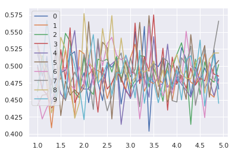


```python
# raw results

results = pd.DataFrame(results, columns=np.arange(1, 5, 0.1,).round(1))
results

```


<div>
<style scoped>
    .dataframe tbody tr th:only-of-type {
        vertical-align: middle;
    }

    .dataframe tbody tr th {
        vertical-align: top;
    }

    .dataframe thead th {
        text-align: right;
    }
</style>
<table border="1" class="dataframe">
  <thead>
    <tr style="text-align: right;">
      <th></th>
      <th>1.0</th>
      <th>1.1</th>
      <th>1.2000000000000002</th>
      <th>1.3000000000000003</th>
      <th>1.4000000000000004</th>
      <th>1.5000000000000004</th>
      <th>1.6000000000000005</th>
      <th>1.7000000000000006</th>
      <th>1.8000000000000007</th>
      <th>1.9000000000000008</th>
      <th>...</th>
      <th>4.000000000000003</th>
      <th>4.100000000000003</th>
      <th>4.200000000000003</th>
      <th>4.3000000000000025</th>
      <th>4.400000000000003</th>
      <th>4.5000000000000036</th>
      <th>4.600000000000003</th>
      <th>4.700000000000003</th>
      <th>4.800000000000003</th>
      <th>4.900000000000004</th>
    </tr>
  </thead>
  <tbody>
    <tr>
      <th>0</th>
      <td>0.501</td>
      <td>0.465</td>
      <td>0.514</td>
      <td>0.444</td>
      <td>0.474</td>
      <td>0.490</td>
      <td>0.494</td>
      <td>0.516</td>
      <td>0.521</td>
      <td>0.470</td>
      <td>...</td>
      <td>0.473</td>
      <td>0.527</td>
      <td>0.510</td>
      <td>0.456</td>
      <td>0.498</td>
      <td>0.479</td>
      <td>0.497</td>
      <td>0.479</td>
      <td>0.524</td>
      <td>0.466</td>
    </tr>
    <tr>
      <th>1</th>
      <td>0.532</td>
      <td>0.506</td>
      <td>0.473</td>
      <td>0.409</td>
      <td>0.471</td>
      <td>0.482</td>
      <td>0.524</td>
      <td>0.468</td>
      <td>0.427</td>
      <td>0.523</td>
      <td>...</td>
      <td>0.487</td>
      <td>0.480</td>
      <td>0.493</td>
      <td>0.476</td>
      <td>0.472</td>
      <td>0.493</td>
      <td>0.518</td>
      <td>0.460</td>
      <td>0.454</td>
      <td>0.480</td>
    </tr>
    <tr>
      <th>2</th>
      <td>0.462</td>
      <td>0.515</td>
      <td>0.492</td>
      <td>0.478</td>
      <td>0.446</td>
      <td>0.499</td>
      <td>0.548</td>
      <td>0.536</td>
      <td>0.461</td>
      <td>0.453</td>
      <td>...</td>
      <td>0.517</td>
      <td>0.534</td>
      <td>0.501</td>
      <td>0.414</td>
      <td>0.510</td>
      <td>0.458</td>
      <td>0.506</td>
      <td>0.482</td>
      <td>0.476</td>
      <td>0.502</td>
    </tr>
    <tr>
      <th>3</th>
      <td>0.498</td>
      <td>0.466</td>
      <td>0.458</td>
      <td>0.438</td>
      <td>0.447</td>
      <td>0.524</td>
      <td>0.480</td>
      <td>0.556</td>
      <td>0.446</td>
      <td>0.461</td>
      <td>...</td>
      <td>0.474</td>
      <td>0.486</td>
      <td>0.467</td>
      <td>0.497</td>
      <td>0.472</td>
      <td>0.482</td>
      <td>0.478</td>
      <td>0.505</td>
      <td>0.488</td>
      <td>0.485</td>
    </tr>
    <tr>
      <th>4</th>
      <td>0.529</td>
      <td>0.485</td>
      <td>0.501</td>
      <td>0.472</td>
      <td>0.484</td>
      <td>0.459</td>
      <td>0.450</td>
      <td>0.518</td>
      <td>0.552</td>
      <td>0.471</td>
      <td>...</td>
      <td>0.484</td>
      <td>0.473</td>
      <td>0.464</td>
      <td>0.454</td>
      <td>0.476</td>
      <td>0.512</td>
      <td>0.467</td>
      <td>0.479</td>
      <td>0.456</td>
      <td>0.481</td>
    </tr>
    <tr>
      <th>5</th>
      <td>0.442</td>
      <td>0.457</td>
      <td>0.458</td>
      <td>0.475</td>
      <td>0.520</td>
      <td>0.427</td>
      <td>0.478</td>
      <td>0.457</td>
      <td>0.465</td>
      <td>0.458</td>
      <td>...</td>
      <td>0.500</td>
      <td>0.482</td>
      <td>0.451</td>
      <td>0.546</td>
      <td>0.486</td>
      <td>0.507</td>
      <td>0.530</td>
      <td>0.454</td>
      <td>0.499</td>
      <td>0.508</td>
    </tr>
    <tr>
      <th>6</th>
      <td>0.456</td>
      <td>0.422</td>
      <td>0.439</td>
      <td>0.450</td>
      <td>0.464</td>
      <td>0.491</td>
      <td>0.498</td>
      <td>0.472</td>
      <td>0.466</td>
      <td>0.499</td>
      <td>...</td>
      <td>0.489</td>
      <td>0.476</td>
      <td>0.551</td>
      <td>0.500</td>
      <td>0.495</td>
      <td>0.474</td>
      <td>0.424</td>
      <td>0.504</td>
      <td>0.480</td>
      <td>0.475</td>
    </tr>
    <tr>
      <th>7</th>
      <td>0.517</td>
      <td>0.487</td>
      <td>0.502</td>
      <td>0.460</td>
      <td>0.532</td>
      <td>0.487</td>
      <td>0.449</td>
      <td>0.473</td>
      <td>0.491</td>
      <td>0.474</td>
      <td>...</td>
      <td>0.447</td>
      <td>0.512</td>
      <td>0.502</td>
      <td>0.529</td>
      <td>0.442</td>
      <td>0.477</td>
      <td>0.526</td>
      <td>0.480</td>
      <td>0.527</td>
      <td>0.566</td>
    </tr>
    <tr>
      <th>8</th>
      <td>0.523</td>
      <td>0.512</td>
      <td>0.491</td>
      <td>0.431</td>
      <td>0.453</td>
      <td>0.542</td>
      <td>0.525</td>
      <td>0.483</td>
      <td>0.423</td>
      <td>0.446</td>
      <td>...</td>
      <td>0.517</td>
      <td>0.490</td>
      <td>0.482</td>
      <td>0.481</td>
      <td>0.505</td>
      <td>0.513</td>
      <td>0.460</td>
      <td>0.510</td>
      <td>0.519</td>
      <td>0.519</td>
    </tr>
    <tr>
      <th>9</th>
      <td>0.475</td>
      <td>0.495</td>
      <td>0.567</td>
      <td>0.513</td>
      <td>0.453</td>
      <td>0.496</td>
      <td>0.453</td>
      <td>0.526</td>
      <td>0.500</td>
      <td>0.468</td>
      <td>...</td>
      <td>0.494</td>
      <td>0.450</td>
      <td>0.509</td>
      <td>0.515</td>
      <td>0.485</td>
      <td>0.538</td>
      <td>0.441</td>
      <td>0.487</td>
      <td>0.517</td>
      <td>0.445</td>
    </tr>
    <tr>
      <th>10</th>
      <td>0.562</td>
      <td>0.434</td>
      <td>0.533</td>
      <td>0.472</td>
      <td>0.496</td>
      <td>0.527</td>
      <td>0.496</td>
      <td>0.509</td>
      <td>0.521</td>
      <td>0.492</td>
      <td>...</td>
      <td>0.537</td>
      <td>0.442</td>
      <td>0.497</td>
      <td>0.462</td>
      <td>0.496</td>
      <td>0.494</td>
      <td>0.525</td>
      <td>0.473</td>
      <td>0.482</td>
      <td>0.448</td>
    </tr>
    <tr>
      <th>11</th>
      <td>0.453</td>
      <td>0.492</td>
      <td>0.491</td>
      <td>0.472</td>
      <td>0.454</td>
      <td>0.652</td>
      <td>0.476</td>
      <td>0.547</td>
      <td>0.484</td>
      <td>0.550</td>
      <td>...</td>
      <td>0.496</td>
      <td>0.462</td>
      <td>0.507</td>
      <td>0.552</td>
      <td>0.500</td>
      <td>0.454</td>
      <td>0.460</td>
      <td>0.474</td>
      <td>0.480</td>
      <td>0.444</td>
    </tr>
    <tr>
      <th>12</th>
      <td>0.492</td>
      <td>0.466</td>
      <td>0.524</td>
      <td>0.451</td>
      <td>0.505</td>
      <td>0.494</td>
      <td>0.500</td>
      <td>0.501</td>
      <td>0.527</td>
      <td>0.495</td>
      <td>...</td>
      <td>0.421</td>
      <td>0.498</td>
      <td>0.488</td>
      <td>0.462</td>
      <td>0.498</td>
      <td>0.488</td>
      <td>0.530</td>
      <td>0.461</td>
      <td>0.485</td>
      <td>0.476</td>
    </tr>
    <tr>
      <th>13</th>
      <td>0.474</td>
      <td>0.465</td>
      <td>0.521</td>
      <td>0.438</td>
      <td>0.484</td>
      <td>0.533</td>
      <td>0.438</td>
      <td>0.501</td>
      <td>0.529</td>
      <td>0.471</td>
      <td>...</td>
      <td>0.478</td>
      <td>0.528</td>
      <td>0.536</td>
      <td>0.481</td>
      <td>0.458</td>
      <td>0.499</td>
      <td>0.443</td>
      <td>0.522</td>
      <td>0.507</td>
      <td>0.501</td>
    </tr>
    <tr>
      <th>14</th>
      <td>0.500</td>
      <td>0.476</td>
      <td>0.560</td>
      <td>0.451</td>
      <td>0.431</td>
      <td>0.503</td>
      <td>0.446</td>
      <td>0.499</td>
      <td>0.483</td>
      <td>0.443</td>
      <td>...</td>
      <td>0.608</td>
      <td>0.588</td>
      <td>0.490</td>
      <td>0.472</td>
      <td>0.487</td>
      <td>0.531</td>
      <td>0.491</td>
      <td>0.520</td>
      <td>0.495</td>
      <td>0.536</td>
    </tr>
    <tr>
      <th>15</th>
      <td>0.450</td>
      <td>0.544</td>
      <td>0.465</td>
      <td>0.503</td>
      <td>0.501</td>
      <td>0.441</td>
      <td>0.470</td>
      <td>0.522</td>
      <td>0.489</td>
      <td>0.433</td>
      <td>...</td>
      <td>0.471</td>
      <td>0.464</td>
      <td>0.430</td>
      <td>0.456</td>
      <td>0.437</td>
      <td>0.442</td>
      <td>0.559</td>
      <td>0.492</td>
      <td>0.530</td>
      <td>0.505</td>
    </tr>
    <tr>
      <th>16</th>
      <td>0.481</td>
      <td>0.489</td>
      <td>0.469</td>
      <td>0.489</td>
      <td>0.500</td>
      <td>0.543</td>
      <td>0.553</td>
      <td>0.502</td>
      <td>0.494</td>
      <td>0.459</td>
      <td>...</td>
      <td>0.450</td>
      <td>0.510</td>
      <td>0.454</td>
      <td>0.493</td>
      <td>0.600</td>
      <td>0.495</td>
      <td>0.450</td>
      <td>0.477</td>
      <td>0.472</td>
      <td>0.490</td>
    </tr>
    <tr>
      <th>17</th>
      <td>0.453</td>
      <td>0.467</td>
      <td>0.532</td>
      <td>0.510</td>
      <td>0.515</td>
      <td>0.471</td>
      <td>0.483</td>
      <td>0.460</td>
      <td>0.463</td>
      <td>0.419</td>
      <td>...</td>
      <td>0.522</td>
      <td>0.492</td>
      <td>0.521</td>
      <td>0.429</td>
      <td>0.507</td>
      <td>0.468</td>
      <td>0.569</td>
      <td>0.472</td>
      <td>0.483</td>
      <td>0.532</td>
    </tr>
    <tr>
      <th>18</th>
      <td>0.477</td>
      <td>0.416</td>
      <td>0.462</td>
      <td>0.461</td>
      <td>0.450</td>
      <td>0.575</td>
      <td>0.513</td>
      <td>0.485</td>
      <td>0.537</td>
      <td>0.528</td>
      <td>...</td>
      <td>0.495</td>
      <td>0.485</td>
      <td>0.480</td>
      <td>0.502</td>
      <td>0.491</td>
      <td>0.446</td>
      <td>0.446</td>
      <td>0.492</td>
      <td>0.464</td>
      <td>0.491</td>
    </tr>
    <tr>
      <th>19</th>
      <td>0.459</td>
      <td>0.501</td>
      <td>0.460</td>
      <td>0.457</td>
      <td>0.508</td>
      <td>0.439</td>
      <td>0.487</td>
      <td>0.469</td>
      <td>0.499</td>
      <td>0.532</td>
      <td>...</td>
      <td>0.499</td>
      <td>0.448</td>
      <td>0.510</td>
      <td>0.459</td>
      <td>0.495</td>
      <td>0.498</td>
      <td>0.501</td>
      <td>0.526</td>
      <td>0.536</td>
      <td>0.460</td>
    </tr>
  </tbody>
</table>
<p>20 rows × 40 columns</p>
</div>


```python
# lets have fancy representation of our results

_results = results.describe().T
_results.iloc[:10, :]

```


<div>
<style scoped>
    .dataframe tbody tr th:only-of-type {
        vertical-align: middle;
    }

    .dataframe tbody tr th {
        vertical-align: top;
    }

    .dataframe thead th {
        text-align: right;
    }
</style>
<table border="1" class="dataframe">
  <thead>
    <tr style="text-align: right;">
      <th></th>
      <th>count</th>
      <th>mean</th>
      <th>std</th>
      <th>min</th>
      <th>25%</th>
      <th>50%</th>
      <th>75%</th>
      <th>max</th>
    </tr>
  </thead>
  <tbody>
    <tr>
      <th>1.0</th>
      <td>20.0</td>
      <td>0.48680</td>
      <td>0.032963</td>
      <td>0.442</td>
      <td>0.45825</td>
      <td>0.4790</td>
      <td>0.50500</td>
      <td>0.562</td>
    </tr>
    <tr>
      <th>1.1</th>
      <td>20.0</td>
      <td>0.47800</td>
      <td>0.031654</td>
      <td>0.416</td>
      <td>0.46500</td>
      <td>0.4805</td>
      <td>0.49650</td>
      <td>0.544</td>
    </tr>
    <tr>
      <th>1.2</th>
      <td>20.0</td>
      <td>0.49560</td>
      <td>0.035885</td>
      <td>0.439</td>
      <td>0.46425</td>
      <td>0.4915</td>
      <td>0.52175</td>
      <td>0.567</td>
    </tr>
    <tr>
      <th>1.3</th>
      <td>20.0</td>
      <td>0.46370</td>
      <td>0.026798</td>
      <td>0.409</td>
      <td>0.44850</td>
      <td>0.4605</td>
      <td>0.47575</td>
      <td>0.513</td>
    </tr>
    <tr>
      <th>1.4</th>
      <td>20.0</td>
      <td>0.47940</td>
      <td>0.029121</td>
      <td>0.431</td>
      <td>0.45300</td>
      <td>0.4790</td>
      <td>0.50200</td>
      <td>0.532</td>
    </tr>
    <tr>
      <th>1.5</th>
      <td>20.0</td>
      <td>0.50375</td>
      <td>0.051424</td>
      <td>0.427</td>
      <td>0.47925</td>
      <td>0.4950</td>
      <td>0.52850</td>
      <td>0.652</td>
    </tr>
    <tr>
      <th>1.6</th>
      <td>20.0</td>
      <td>0.48805</td>
      <td>0.032904</td>
      <td>0.438</td>
      <td>0.46575</td>
      <td>0.4850</td>
      <td>0.50325</td>
      <td>0.553</td>
    </tr>
    <tr>
      <th>1.7</th>
      <td>20.0</td>
      <td>0.50000</td>
      <td>0.028956</td>
      <td>0.457</td>
      <td>0.47275</td>
      <td>0.5010</td>
      <td>0.51900</td>
      <td>0.556</td>
    </tr>
    <tr>
      <th>1.8</th>
      <td>20.0</td>
      <td>0.48890</td>
      <td>0.035755</td>
      <td>0.423</td>
      <td>0.46450</td>
      <td>0.4900</td>
      <td>0.52100</td>
      <td>0.552</td>
    </tr>
    <tr>
      <th>1.9</th>
      <td>20.0</td>
      <td>0.47725</td>
      <td>0.034980</td>
      <td>0.419</td>
      <td>0.45675</td>
      <td>0.4705</td>
      <td>0.49600</td>
      <td>0.550</td>
    </tr>
  </tbody>
</table>
</div>


```python
# graph it 

results.boxplot()
plt.xlabel("outliers 'k' values")
plt.ylabel("log_loss score")
plt.title("benchmark various outliers 'k' values, without feat eng or meta params")
plt.show()

```


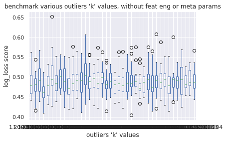


```python
# graph it 

results.describe().T.loc[:, ["mean", "50%"]].plot()
plt.xlabel("outliers 'k' values")
plt.ylabel("log_loss score")
plt.title("benchmark various outliers 'k' values, without feat eng or meta params")
plt.show()

```


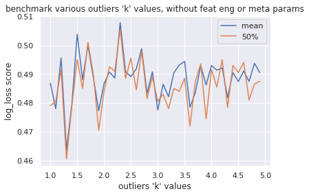


```python
# graph

results.T.iloc[:, :10].plot()
plt.xlabel("outliers 'k' values")
plt.ylabel("log_loss score")
plt.title("benchmark various outliers 'k' values, without feat eng or meta params")
plt.show()

```


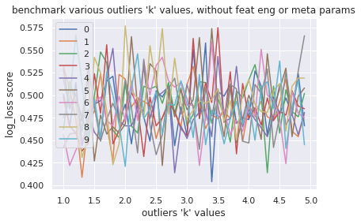


```python
# Now we will study various features transformation.
# First let's define some useful function

def transform_df(Tool, df=None, **kwargs) :

    if not isinstance(df, pd.DataFrame) : 
        df = build_df(DATA, TRAIN_FILE)

    if "target" in df : 
        X = df.drop("target", axis=1)
        y = df.target
    else : 
        X = df

    tool = Tool()
    _X = tool.fit_transform(X)
    _X = pd.DataFrame(_X, columns=X.columns, index=X.index)
    
    if "target" in df :
        _df = _X
        _df["target"] = y
    else : 
        _df = _X

    return _df


def nothing(df=None) : 
    
    if not isinstance(df, pd.DataFrame) : 
        df = build_df(DATA, TRAIN_FILE)

    return df


def standscale(df=None) : 

    if not isinstance(df, pd.DataFrame) : 
        df = build_df(DATA, TRAIN_FILE)

    return transform_df(StandardScaler, df)


def normalize(df=None, norm=None) : 

    if not isinstance(df, pd.DataFrame) : 
        df = build_df(DATA, TRAIN_FILE)

    if not norm : 
        norm='l2'

    return transform_df(StandardScaler, df) 
    

def min_max(df=None) : 

    if not isinstance(df, pd.DataFrame) : 
        df = build_df(DATA, TRAIN_FILE)

    return transform_df(MinMaxScaler, df)


def min_max_and_standsacle(df=None) : 

    return standscale(min_max(df))
    
```


```python
# transorm list and index (str values)

TRANSFORM_LIST = [nothing, normalize, standscale, min_max, min_max_and_standsacle]
TRANSFORM_INDEX = ["nothing", "normalize", "standscale", "min_max", "mimax+stdsca"]

```


```python
# here we have our benchmark function 

def benchmark_various_transform(   n=10, df=None, graph=True, params=None, model=None,
                                    transform_list=TRANSFORM_LIST, transform_index = TRANSFORM_INDEX) : 

    if not isinstance(df, pd.DataFrame): 
        df = build_df(DATA, TRAIN_FILE)

    if not model : model =  LogisticRegression

    if not params : params = dict() 

    if len(transform_list) != len(transform_index) : 
        raise ValueError("lens not goods")

    results = [     pd.Series([run_GSCV(model, params, transf(df))[0] for transf in transform_list], 
                        index=transform_index) for i in range(n)]
    
    results = pd.DataFrame(results, columns=transform_index)

    return results


####


results = benchmark_various_transform(10)

```

    wrapper : called
    build_df : 0.02 secs
    wrapper : ended
    Fitting 5 folds for each of 1 candidates, totalling 5 fits
    Fitting 5 folds for each of 1 candidates, totalling 5 fits


    [Parallel(n_jobs=6)]: Done   5 out of   5 | elapsed:    0.0s finished


    Fitting 5 folds for each of 1 candidates, totalling 5 fits


    [Parallel(n_jobs=6)]: Done   5 out of   5 | elapsed:    0.0s finished


    Fitting 5 folds for each of 1 candidates, totalling 5 fits


    [Parallel(n_jobs=6)]: Done   5 out of   5 | elapsed:    0.0s finished


    Fitting 5 folds for each of 1 candidates, totalling 5 fits


    [Parallel(n_jobs=6)]: Done   5 out of   5 | elapsed:    0.0s finished


    Fitting 5 folds for each of 1 candidates, totalling 5 fits


    [Parallel(n_jobs=6)]: Done   5 out of   5 | elapsed:    0.0s finished


    Fitting 5 folds for each of 1 candidates, totalling 5 fits


    [Parallel(n_jobs=6)]: Done   5 out of   5 | elapsed:    0.0s finished


    Fitting 5 folds for each of 1 candidates, totalling 5 fits


    [Parallel(n_jobs=6)]: Done   5 out of   5 | elapsed:    0.0s finished


    Fitting 5 folds for each of 1 candidates, totalling 5 fits


    [Parallel(n_jobs=6)]: Done   5 out of   5 | elapsed:    0.0s finished


    Fitting 5 folds for each of 1 candidates, totalling 5 fits


    [Parallel(n_jobs=6)]: Done   5 out of   5 | elapsed:    0.0s finished


    Fitting 5 folds for each of 1 candidates, totalling 5 fits


    [Parallel(n_jobs=6)]: Done   5 out of   5 | elapsed:    0.0s finished


    Fitting 5 folds for each of 1 candidates, totalling 5 fits


    [Parallel(n_jobs=6)]: Done   5 out of   5 | elapsed:    0.0s finished


    Fitting 5 folds for each of 1 candidates, totalling 5 fits


    [Parallel(n_jobs=6)]: Done   5 out of   5 | elapsed:    0.0s finished


    Fitting 5 folds for each of 1 candidates, totalling 5 fits


    [Parallel(n_jobs=6)]: Done   5 out of   5 | elapsed:    0.0s finished


    Fitting 5 folds for each of 1 candidates, totalling 5 fits


    [Parallel(n_jobs=6)]: Done   5 out of   5 | elapsed:    0.0s finished


    Fitting 5 folds for each of 1 candidates, totalling 5 fits


    [Parallel(n_jobs=6)]: Done   5 out of   5 | elapsed:    0.0s finished


    Fitting 5 folds for each of 1 candidates, totalling 5 fits


    [Parallel(n_jobs=6)]: Done   5 out of   5 | elapsed:    0.0s finished


    Fitting 5 folds for each of 1 candidates, totalling 5 fits


    [Parallel(n_jobs=6)]: Done   5 out of   5 | elapsed:    0.0s finished


    Fitting 5 folds for each of 1 candidates, totalling 5 fits


    [Parallel(n_jobs=6)]: Done   5 out of   5 | elapsed:    0.0s finished


    Fitting 5 folds for each of 1 candidates, totalling 5 fits


    [Parallel(n_jobs=6)]: Done   5 out of   5 | elapsed:    0.0s finished


    Fitting 5 folds for each of 1 candidates, totalling 5 fits


    [Parallel(n_jobs=6)]: Done   5 out of   5 | elapsed:    0.0s finished


    Fitting 5 folds for each of 1 candidates, totalling 5 fits


    [Parallel(n_jobs=6)]: Done   5 out of   5 | elapsed:    0.0s finished


    Fitting 5 folds for each of 1 candidates, totalling 5 fits


    [Parallel(n_jobs=6)]: Done   5 out of   5 | elapsed:    0.0s finished


    Fitting 5 folds for each of 1 candidates, totalling 5 fits


    [Parallel(n_jobs=6)]: Done   5 out of   5 | elapsed:    0.0s finished


    Fitting 5 folds for each of 1 candidates, totalling 5 fits


    [Parallel(n_jobs=6)]: Done   5 out of   5 | elapsed:    0.0s finished


    Fitting 5 folds for each of 1 candidates, totalling 5 fits


    [Parallel(n_jobs=6)]: Done   5 out of   5 | elapsed:    0.0s finished


    Fitting 5 folds for each of 1 candidates, totalling 5 fits


    [Parallel(n_jobs=6)]: Done   5 out of   5 | elapsed:    0.0s finished


    Fitting 5 folds for each of 1 candidates, totalling 5 fits


    [Parallel(n_jobs=6)]: Done   5 out of   5 | elapsed:    0.0s finished


    Fitting 5 folds for each of 1 candidates, totalling 5 fits


    [Parallel(n_jobs=6)]: Done   5 out of   5 | elapsed:    0.0s finished


    Fitting 5 folds for each of 1 candidates, totalling 5 fits


    [Parallel(n_jobs=6)]: Done   5 out of   5 | elapsed:    0.0s finished


    Fitting 5 folds for each of 1 candidates, totalling 5 fits


    [Parallel(n_jobs=6)]: Done   5 out of   5 | elapsed:    0.0s finished
    [Parallel(n_jobs=6)]: Done   5 out of   5 | elapsed:    0.0s finished


    Fitting 5 folds for each of 1 candidates, totalling 5 fits
    Fitting 5 folds for each of 1 candidates, totalling 5 fits


    [Parallel(n_jobs=6)]: Done   5 out of   5 | elapsed:    0.0s finished


    Fitting 5 folds for each of 1 candidates, totalling 5 fits


    [Parallel(n_jobs=6)]: Done   5 out of   5 | elapsed:    0.0s finished


    Fitting 5 folds for each of 1 candidates, totalling 5 fits


    [Parallel(n_jobs=6)]: Done   5 out of   5 | elapsed:    0.0s finished


    Fitting 5 folds for each of 1 candidates, totalling 5 fits


    [Parallel(n_jobs=6)]: Done   5 out of   5 | elapsed:    0.0s finished


    Fitting 5 folds for each of 1 candidates, totalling 5 fits


    [Parallel(n_jobs=6)]: Done   5 out of   5 | elapsed:    0.0s finished


    Fitting 5 folds for each of 1 candidates, totalling 5 fits


    [Parallel(n_jobs=6)]: Done   5 out of   5 | elapsed:    0.0s finished


    Fitting 5 folds for each of 1 candidates, totalling 5 fits


    [Parallel(n_jobs=6)]: Done   5 out of   5 | elapsed:    0.0s finished


    Fitting 5 folds for each of 1 candidates, totalling 5 fits


    [Parallel(n_jobs=6)]: Done   5 out of   5 | elapsed:    0.0s finished


    Fitting 5 folds for each of 1 candidates, totalling 5 fits


    [Parallel(n_jobs=6)]: Done   5 out of   5 | elapsed:    0.0s finished


    Fitting 5 folds for each of 1 candidates, totalling 5 fits


    [Parallel(n_jobs=6)]: Done   5 out of   5 | elapsed:    0.0s finished


    Fitting 5 folds for each of 1 candidates, totalling 5 fits


    [Parallel(n_jobs=6)]: Done   5 out of   5 | elapsed:    0.0s finished


    Fitting 5 folds for each of 1 candidates, totalling 5 fits


    [Parallel(n_jobs=6)]: Done   5 out of   5 | elapsed:    0.0s finished


    Fitting 5 folds for each of 1 candidates, totalling 5 fits


    [Parallel(n_jobs=6)]: Done   5 out of   5 | elapsed:    0.0s finished


    Fitting 5 folds for each of 1 candidates, totalling 5 fits


    [Parallel(n_jobs=6)]: Done   5 out of   5 | elapsed:    0.0s finished


    Fitting 5 folds for each of 1 candidates, totalling 5 fits


    [Parallel(n_jobs=6)]: Done   5 out of   5 | elapsed:    0.0s finished


    Fitting 5 folds for each of 1 candidates, totalling 5 fits


    [Parallel(n_jobs=6)]: Done   5 out of   5 | elapsed:    0.0s finished


    Fitting 5 folds for each of 1 candidates, totalling 5 fits


    [Parallel(n_jobs=6)]: Done   5 out of   5 | elapsed:    0.0s finished


    Fitting 5 folds for each of 1 candidates, totalling 5 fits


    [Parallel(n_jobs=6)]: Done   5 out of   5 | elapsed:    0.0s finished
    [Parallel(n_jobs=6)]: Done   5 out of   5 | elapsed:    0.0s finished


```python
# raw results 

results

```


<div>
<style scoped>
    .dataframe tbody tr th:only-of-type {
        vertical-align: middle;
    }

    .dataframe tbody tr th {
        vertical-align: top;
    }

    .dataframe thead th {
        text-align: right;
    }
</style>
<table border="1" class="dataframe">
  <thead>
    <tr style="text-align: right;">
      <th></th>
      <th>nothing</th>
      <th>normalize</th>
      <th>standscale</th>
      <th>min_max</th>
      <th>mimax+stdsca</th>
    </tr>
  </thead>
  <tbody>
    <tr>
      <th>0</th>
      <td>0.476</td>
      <td>0.476</td>
      <td>0.443</td>
      <td>0.473</td>
      <td>0.465</td>
    </tr>
    <tr>
      <th>1</th>
      <td>0.565</td>
      <td>0.450</td>
      <td>0.486</td>
      <td>0.473</td>
      <td>0.523</td>
    </tr>
    <tr>
      <th>2</th>
      <td>0.506</td>
      <td>0.597</td>
      <td>0.527</td>
      <td>0.534</td>
      <td>0.444</td>
    </tr>
    <tr>
      <th>3</th>
      <td>0.528</td>
      <td>0.521</td>
      <td>0.516</td>
      <td>0.524</td>
      <td>0.514</td>
    </tr>
    <tr>
      <th>4</th>
      <td>0.450</td>
      <td>0.484</td>
      <td>0.478</td>
      <td>0.516</td>
      <td>0.503</td>
    </tr>
    <tr>
      <th>5</th>
      <td>0.469</td>
      <td>0.474</td>
      <td>0.519</td>
      <td>0.544</td>
      <td>0.484</td>
    </tr>
    <tr>
      <th>6</th>
      <td>0.523</td>
      <td>0.471</td>
      <td>0.531</td>
      <td>0.496</td>
      <td>0.480</td>
    </tr>
    <tr>
      <th>7</th>
      <td>0.464</td>
      <td>0.495</td>
      <td>0.484</td>
      <td>0.533</td>
      <td>0.558</td>
    </tr>
    <tr>
      <th>8</th>
      <td>0.492</td>
      <td>0.510</td>
      <td>0.523</td>
      <td>0.481</td>
      <td>0.533</td>
    </tr>
    <tr>
      <th>9</th>
      <td>0.535</td>
      <td>0.569</td>
      <td>0.517</td>
      <td>0.469</td>
      <td>0.442</td>
    </tr>
  </tbody>
</table>
</div>


```python
# graph  

results.boxplot()
plt.xlabel("transformations of df")
plt.ylabel("log_loss score")
plt.title("benchmark various df transforms, without feat eng or meta params")
plt.show()

```


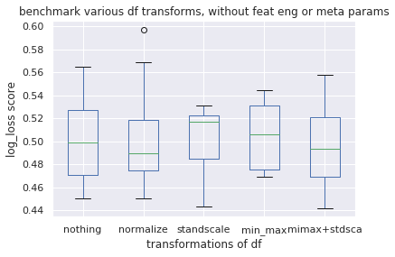


```python
# fancy results

_results = results.describe().T.sort_values(by="50%")
_results

```


<div>
<style scoped>
    .dataframe tbody tr th:only-of-type {
        vertical-align: middle;
    }

    .dataframe tbody tr th {
        vertical-align: top;
    }

    .dataframe thead th {
        text-align: right;
    }
</style>
<table border="1" class="dataframe">
  <thead>
    <tr style="text-align: right;">
      <th></th>
      <th>count</th>
      <th>mean</th>
      <th>std</th>
      <th>min</th>
      <th>25%</th>
      <th>50%</th>
      <th>75%</th>
      <th>max</th>
    </tr>
  </thead>
  <tbody>
    <tr>
      <th>normalize</th>
      <td>10.0</td>
      <td>0.5047</td>
      <td>0.046385</td>
      <td>0.450</td>
      <td>0.47450</td>
      <td>0.4895</td>
      <td>0.51825</td>
      <td>0.597</td>
    </tr>
    <tr>
      <th>mimax+stdsca</th>
      <td>10.0</td>
      <td>0.4946</td>
      <td>0.038408</td>
      <td>0.442</td>
      <td>0.46875</td>
      <td>0.4935</td>
      <td>0.52075</td>
      <td>0.558</td>
    </tr>
    <tr>
      <th>nothing</th>
      <td>10.0</td>
      <td>0.5008</td>
      <td>0.036802</td>
      <td>0.450</td>
      <td>0.47075</td>
      <td>0.4990</td>
      <td>0.52675</td>
      <td>0.565</td>
    </tr>
    <tr>
      <th>min_max</th>
      <td>10.0</td>
      <td>0.5043</td>
      <td>0.029105</td>
      <td>0.469</td>
      <td>0.47500</td>
      <td>0.5060</td>
      <td>0.53075</td>
      <td>0.544</td>
    </tr>
    <tr>
      <th>standscale</th>
      <td>10.0</td>
      <td>0.5024</td>
      <td>0.028387</td>
      <td>0.443</td>
      <td>0.48450</td>
      <td>0.5165</td>
      <td>0.52200</td>
      <td>0.531</td>
    </tr>
  </tbody>
</table>
</div>


```python
# graph 

results.T.iloc[:,:10].plot()
plt.xlabel("transformations of df")
plt.ylabel("log_loss score")
plt.title("benchmark various df transforms, without feat eng or meta params")

```


    Text(0.5,1,'benchmark various df transforms, without feat eng or meta params')


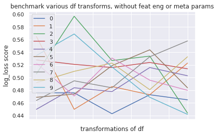


```python
# ok let's do the same thing for scoring ! 

def benchmark_various_scoring(  n=5, df=None, graph=True, params=None, model=None,
                                scoring_list=None) : 

    if not isinstance(df, pd.DataFrame): 
        df = build_df(DATA, TRAIN_FILE)

    if not scoring_list : 
        scoring_list = ['accuracy', 'neg_log_loss', 'f1', 'average_precision', 'precision', 'recall', "roc_auc"]

    if not model : model = LogisticRegression

    if not params : params = dict() 

    results = [ pd.Series([run_GSCV(model, params, df, scoring=s)[0] for s in scoring_list], 
                        index=scoring_list) for i in range(n)]
    
    results = pd.DataFrame(results, columns=scoring_list)

    return results


####

results = benchmark_various_scoring(10)

```

    wrapper : called
    build_df : 0.01 secs
    wrapper : ended
    Fitting 5 folds for each of 1 candidates, totalling 5 fits
    Fitting 5 folds for each of 1 candidates, totalling 5 fits


    [Parallel(n_jobs=6)]: Done   5 out of   5 | elapsed:    0.0s finished


    Fitting 5 folds for each of 1 candidates, totalling 5 fits


    [Parallel(n_jobs=6)]: Done   5 out of   5 | elapsed:    0.0s finished


    Fitting 5 folds for each of 1 candidates, totalling 5 fits


    [Parallel(n_jobs=6)]: Done   5 out of   5 | elapsed:    0.0s finished


    Fitting 5 folds for each of 1 candidates, totalling 5 fits


    [Parallel(n_jobs=6)]: Done   5 out of   5 | elapsed:    0.1s finished
    [Parallel(n_jobs=6)]: Done   5 out of   5 | elapsed:    0.0s finished


    Fitting 5 folds for each of 1 candidates, totalling 5 fits
    Fitting 5 folds for each of 1 candidates, totalling 5 fits


    [Parallel(n_jobs=6)]: Done   5 out of   5 | elapsed:    0.1s finished


    Fitting 5 folds for each of 1 candidates, totalling 5 fits


    [Parallel(n_jobs=6)]: Done   5 out of   5 | elapsed:    0.0s finished


    Fitting 5 folds for each of 1 candidates, totalling 5 fits


    [Parallel(n_jobs=6)]: Done   5 out of   5 | elapsed:    0.1s finished


    Fitting 5 folds for each of 1 candidates, totalling 5 fits


    [Parallel(n_jobs=6)]: Done   5 out of   5 | elapsed:    0.1s finished


    Fitting 5 folds for each of 1 candidates, totalling 5 fits


    [Parallel(n_jobs=6)]: Done   5 out of   5 | elapsed:    0.0s finished


    Fitting 5 folds for each of 1 candidates, totalling 5 fits


    [Parallel(n_jobs=6)]: Done   5 out of   5 | elapsed:    0.0s finished


    Fitting 5 folds for each of 1 candidates, totalling 5 fits


    [Parallel(n_jobs=6)]: Done   5 out of   5 | elapsed:    0.0s finished


    Fitting 5 folds for each of 1 candidates, totalling 5 fits


    [Parallel(n_jobs=6)]: Done   5 out of   5 | elapsed:    0.0s finished


    Fitting 5 folds for each of 1 candidates, totalling 5 fits


    [Parallel(n_jobs=6)]: Done   5 out of   5 | elapsed:    0.0s finished


    Fitting 5 folds for each of 1 candidates, totalling 5 fits


    [Parallel(n_jobs=6)]: Done   5 out of   5 | elapsed:    0.0s finished


    Fitting 5 folds for each of 1 candidates, totalling 5 fits


    [Parallel(n_jobs=6)]: Done   5 out of   5 | elapsed:    0.0s finished


    Fitting 5 folds for each of 1 candidates, totalling 5 fits


    [Parallel(n_jobs=6)]: Done   5 out of   5 | elapsed:    0.0s finished


    Fitting 5 folds for each of 1 candidates, totalling 5 fits


    [Parallel(n_jobs=6)]: Done   5 out of   5 | elapsed:    0.0s finished


    Fitting 5 folds for each of 1 candidates, totalling 5 fits


    [Parallel(n_jobs=6)]: Done   5 out of   5 | elapsed:    0.0s finished


    Fitting 5 folds for each of 1 candidates, totalling 5 fits


    [Parallel(n_jobs=6)]: Done   5 out of   5 | elapsed:    0.0s finished


    Fitting 5 folds for each of 1 candidates, totalling 5 fits


    [Parallel(n_jobs=6)]: Done   5 out of   5 | elapsed:    0.0s finished


    Fitting 5 folds for each of 1 candidates, totalling 5 fits


    [Parallel(n_jobs=6)]: Done   5 out of   5 | elapsed:    0.0s finished


    Fitting 5 folds for each of 1 candidates, totalling 5 fits


    [Parallel(n_jobs=6)]: Done   5 out of   5 | elapsed:    0.0s finished


    Fitting 5 folds for each of 1 candidates, totalling 5 fits


    [Parallel(n_jobs=6)]: Done   5 out of   5 | elapsed:    0.0s finished


    Fitting 5 folds for each of 1 candidates, totalling 5 fits


    [Parallel(n_jobs=6)]: Done   5 out of   5 | elapsed:    0.0s finished


    Fitting 5 folds for each of 1 candidates, totalling 5 fits


    [Parallel(n_jobs=6)]: Done   5 out of   5 | elapsed:    0.0s finished


    Fitting 5 folds for each of 1 candidates, totalling 5 fits


    [Parallel(n_jobs=6)]: Done   5 out of   5 | elapsed:    0.0s finished


    Fitting 5 folds for each of 1 candidates, totalling 5 fits


    [Parallel(n_jobs=6)]: Done   5 out of   5 | elapsed:    0.0s finished


    Fitting 5 folds for each of 1 candidates, totalling 5 fits


    [Parallel(n_jobs=6)]: Done   5 out of   5 | elapsed:    0.0s finished


    Fitting 5 folds for each of 1 candidates, totalling 5 fits


    [Parallel(n_jobs=6)]: Done   5 out of   5 | elapsed:    0.0s finished


    Fitting 5 folds for each of 1 candidates, totalling 5 fits


    [Parallel(n_jobs=6)]: Done   5 out of   5 | elapsed:    0.0s finished


    Fitting 5 folds for each of 1 candidates, totalling 5 fits


    [Parallel(n_jobs=6)]: Done   5 out of   5 | elapsed:    0.0s finished


    Fitting 5 folds for each of 1 candidates, totalling 5 fits


    [Parallel(n_jobs=6)]: Done   5 out of   5 | elapsed:    0.0s finished


    Fitting 5 folds for each of 1 candidates, totalling 5 fits


    [Parallel(n_jobs=6)]: Done   5 out of   5 | elapsed:    0.0s finished


    Fitting 5 folds for each of 1 candidates, totalling 5 fits


    [Parallel(n_jobs=6)]: Done   5 out of   5 | elapsed:    0.0s finished


    Fitting 5 folds for each of 1 candidates, totalling 5 fits


    [Parallel(n_jobs=6)]: Done   5 out of   5 | elapsed:    0.0s finished


    Fitting 5 folds for each of 1 candidates, totalling 5 fits


    [Parallel(n_jobs=6)]: Done   5 out of   5 | elapsed:    0.0s finished


    Fitting 5 folds for each of 1 candidates, totalling 5 fits


    [Parallel(n_jobs=6)]: Done   5 out of   5 | elapsed:    0.0s finished


    Fitting 5 folds for each of 1 candidates, totalling 5 fits


    [Parallel(n_jobs=6)]: Done   5 out of   5 | elapsed:    0.0s finished


    Fitting 5 folds for each of 1 candidates, totalling 5 fits


    [Parallel(n_jobs=6)]: Done   5 out of   5 | elapsed:    0.0s finished


    Fitting 5 folds for each of 1 candidates, totalling 5 fits


    [Parallel(n_jobs=6)]: Done   5 out of   5 | elapsed:    0.0s finished


    Fitting 5 folds for each of 1 candidates, totalling 5 fits


    [Parallel(n_jobs=6)]: Done   5 out of   5 | elapsed:    0.0s finished


    Fitting 5 folds for each of 1 candidates, totalling 5 fits


    [Parallel(n_jobs=6)]: Done   5 out of   5 | elapsed:    0.0s finished


    Fitting 5 folds for each of 1 candidates, totalling 5 fits


    [Parallel(n_jobs=6)]: Done   5 out of   5 | elapsed:    0.0s finished


    Fitting 5 folds for each of 1 candidates, totalling 5 fits


    [Parallel(n_jobs=6)]: Done   5 out of   5 | elapsed:    0.0s finished


    Fitting 5 folds for each of 1 candidates, totalling 5 fits


    [Parallel(n_jobs=6)]: Done   5 out of   5 | elapsed:    0.0s finished


    Fitting 5 folds for each of 1 candidates, totalling 5 fits


    [Parallel(n_jobs=6)]: Done   5 out of   5 | elapsed:    0.0s finished


    Fitting 5 folds for each of 1 candidates, totalling 5 fits


    [Parallel(n_jobs=6)]: Done   5 out of   5 | elapsed:    0.0s finished


    Fitting 5 folds for each of 1 candidates, totalling 5 fits


    [Parallel(n_jobs=6)]: Done   5 out of   5 | elapsed:    0.0s finished


    Fitting 5 folds for each of 1 candidates, totalling 5 fits


    [Parallel(n_jobs=6)]: Done   5 out of   5 | elapsed:    0.0s finished


    Fitting 5 folds for each of 1 candidates, totalling 5 fits


    [Parallel(n_jobs=6)]: Done   5 out of   5 | elapsed:    0.0s finished


    Fitting 5 folds for each of 1 candidates, totalling 5 fits


    [Parallel(n_jobs=6)]: Done   5 out of   5 | elapsed:    0.0s finished


    Fitting 5 folds for each of 1 candidates, totalling 5 fits


    [Parallel(n_jobs=6)]: Done   5 out of   5 | elapsed:    0.0s finished


    Fitting 5 folds for each of 1 candidates, totalling 5 fits


    [Parallel(n_jobs=6)]: Done   5 out of   5 | elapsed:    0.0s finished


    Fitting 5 folds for each of 1 candidates, totalling 5 fits


    [Parallel(n_jobs=6)]: Done   5 out of   5 | elapsed:    0.0s finished


    Fitting 5 folds for each of 1 candidates, totalling 5 fits


    [Parallel(n_jobs=6)]: Done   5 out of   5 | elapsed:    0.0s finished


    Fitting 5 folds for each of 1 candidates, totalling 5 fits


    [Parallel(n_jobs=6)]: Done   5 out of   5 | elapsed:    0.0s finished


    Fitting 5 folds for each of 1 candidates, totalling 5 fits


    [Parallel(n_jobs=6)]: Done   5 out of   5 | elapsed:    0.0s finished


    Fitting 5 folds for each of 1 candidates, totalling 5 fits


    [Parallel(n_jobs=6)]: Done   5 out of   5 | elapsed:    0.0s finished


    Fitting 5 folds for each of 1 candidates, totalling 5 fits


    [Parallel(n_jobs=6)]: Done   5 out of   5 | elapsed:    0.0s finished


    Fitting 5 folds for each of 1 candidates, totalling 5 fits


    [Parallel(n_jobs=6)]: Done   5 out of   5 | elapsed:    0.0s finished


    Fitting 5 folds for each of 1 candidates, totalling 5 fits


    [Parallel(n_jobs=6)]: Done   5 out of   5 | elapsed:    0.0s finished


    Fitting 5 folds for each of 1 candidates, totalling 5 fits


    [Parallel(n_jobs=6)]: Done   5 out of   5 | elapsed:    0.0s finished


    Fitting 5 folds for each of 1 candidates, totalling 5 fits


    [Parallel(n_jobs=6)]: Done   5 out of   5 | elapsed:    0.0s finished


    Fitting 5 folds for each of 1 candidates, totalling 5 fits


    [Parallel(n_jobs=6)]: Done   5 out of   5 | elapsed:    0.0s finished


    Fitting 5 folds for each of 1 candidates, totalling 5 fits


    [Parallel(n_jobs=6)]: Done   5 out of   5 | elapsed:    0.0s finished


    Fitting 5 folds for each of 1 candidates, totalling 5 fits


    [Parallel(n_jobs=6)]: Done   5 out of   5 | elapsed:    0.0s finished


    Fitting 5 folds for each of 1 candidates, totalling 5 fits


    [Parallel(n_jobs=6)]: Done   5 out of   5 | elapsed:    0.0s finished


    Fitting 5 folds for each of 1 candidates, totalling 5 fits


    [Parallel(n_jobs=6)]: Done   5 out of   5 | elapsed:    0.0s finished
    [Parallel(n_jobs=6)]: Done   5 out of   5 | elapsed:    0.0s finished


```python
# raw results

results

```


<div>
<style scoped>
    .dataframe tbody tr th:only-of-type {
        vertical-align: middle;
    }

    .dataframe tbody tr th {
        vertical-align: top;
    }

    .dataframe thead th {
        text-align: right;
    }
</style>
<table border="1" class="dataframe">
  <thead>
    <tr style="text-align: right;">
      <th></th>
      <th>accuracy</th>
      <th>neg_log_loss</th>
      <th>f1</th>
      <th>average_precision</th>
      <th>precision</th>
      <th>recall</th>
      <th>roc_auc</th>
    </tr>
  </thead>
  <tbody>
    <tr>
      <th>0</th>
      <td>0.498</td>
      <td>0.548</td>
      <td>0.479</td>
      <td>0.527</td>
      <td>0.466</td>
      <td>0.486</td>
      <td>0.453</td>
    </tr>
    <tr>
      <th>1</th>
      <td>0.456</td>
      <td>0.521</td>
      <td>0.519</td>
      <td>0.508</td>
      <td>0.480</td>
      <td>0.463</td>
      <td>0.512</td>
    </tr>
    <tr>
      <th>2</th>
      <td>0.433</td>
      <td>0.484</td>
      <td>0.442</td>
      <td>0.508</td>
      <td>0.526</td>
      <td>0.507</td>
      <td>0.568</td>
    </tr>
    <tr>
      <th>3</th>
      <td>0.461</td>
      <td>0.461</td>
      <td>0.523</td>
      <td>0.519</td>
      <td>0.518</td>
      <td>0.518</td>
      <td>0.481</td>
    </tr>
    <tr>
      <th>4</th>
      <td>0.551</td>
      <td>0.497</td>
      <td>0.500</td>
      <td>0.533</td>
      <td>0.477</td>
      <td>0.530</td>
      <td>0.465</td>
    </tr>
    <tr>
      <th>5</th>
      <td>0.471</td>
      <td>0.494</td>
      <td>0.524</td>
      <td>0.525</td>
      <td>0.428</td>
      <td>0.509</td>
      <td>0.461</td>
    </tr>
    <tr>
      <th>6</th>
      <td>0.527</td>
      <td>0.465</td>
      <td>0.568</td>
      <td>0.477</td>
      <td>0.500</td>
      <td>0.473</td>
      <td>0.501</td>
    </tr>
    <tr>
      <th>7</th>
      <td>0.506</td>
      <td>0.478</td>
      <td>0.489</td>
      <td>0.522</td>
      <td>0.486</td>
      <td>0.497</td>
      <td>0.475</td>
    </tr>
    <tr>
      <th>8</th>
      <td>0.576</td>
      <td>0.484</td>
      <td>0.449</td>
      <td>0.535</td>
      <td>0.581</td>
      <td>0.545</td>
      <td>0.458</td>
    </tr>
    <tr>
      <th>9</th>
      <td>0.536</td>
      <td>0.463</td>
      <td>0.552</td>
      <td>0.433</td>
      <td>0.518</td>
      <td>0.491</td>
      <td>0.506</td>
    </tr>
  </tbody>
</table>
</div>


```python
# graph 

results.boxplot()
plt.xlabel("scoring methods for grid search")
plt.ylabel("log_loss score")
plt.title("benchmark various scoring, without feat eng or meta params")
plt.show()

```


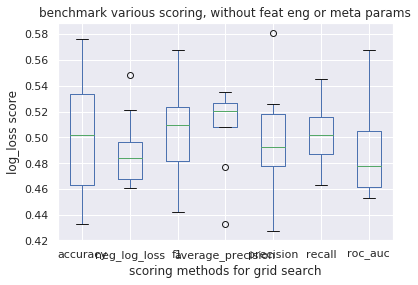


```python
# fancy results

_results = results.describe().T.sort_values(by="50%")
_results

```


<div>
<style scoped>
    .dataframe tbody tr th:only-of-type {
        vertical-align: middle;
    }

    .dataframe tbody tr th {
        vertical-align: top;
    }

    .dataframe thead th {
        text-align: right;
    }
</style>
<table border="1" class="dataframe">
  <thead>
    <tr style="text-align: right;">
      <th></th>
      <th>count</th>
      <th>mean</th>
      <th>std</th>
      <th>min</th>
      <th>25%</th>
      <th>50%</th>
      <th>75%</th>
      <th>max</th>
    </tr>
  </thead>
  <tbody>
    <tr>
      <th>roc_auc</th>
      <td>10.0</td>
      <td>0.4880</td>
      <td>0.035071</td>
      <td>0.453</td>
      <td>0.46200</td>
      <td>0.4780</td>
      <td>0.50475</td>
      <td>0.568</td>
    </tr>
    <tr>
      <th>neg_log_loss</th>
      <td>10.0</td>
      <td>0.4895</td>
      <td>0.027484</td>
      <td>0.461</td>
      <td>0.46825</td>
      <td>0.4840</td>
      <td>0.49625</td>
      <td>0.548</td>
    </tr>
    <tr>
      <th>precision</th>
      <td>10.0</td>
      <td>0.4980</td>
      <td>0.041245</td>
      <td>0.428</td>
      <td>0.47775</td>
      <td>0.4930</td>
      <td>0.51800</td>
      <td>0.581</td>
    </tr>
    <tr>
      <th>accuracy</th>
      <td>10.0</td>
      <td>0.5015</td>
      <td>0.046196</td>
      <td>0.433</td>
      <td>0.46350</td>
      <td>0.5020</td>
      <td>0.53375</td>
      <td>0.576</td>
    </tr>
    <tr>
      <th>recall</th>
      <td>10.0</td>
      <td>0.5019</td>
      <td>0.025225</td>
      <td>0.463</td>
      <td>0.48725</td>
      <td>0.5020</td>
      <td>0.51575</td>
      <td>0.545</td>
    </tr>
    <tr>
      <th>f1</th>
      <td>10.0</td>
      <td>0.5045</td>
      <td>0.040986</td>
      <td>0.442</td>
      <td>0.48150</td>
      <td>0.5095</td>
      <td>0.52375</td>
      <td>0.568</td>
    </tr>
    <tr>
      <th>average_precision</th>
      <td>10.0</td>
      <td>0.5087</td>
      <td>0.031450</td>
      <td>0.433</td>
      <td>0.50800</td>
      <td>0.5205</td>
      <td>0.52650</td>
      <td>0.535</td>
    </tr>
  </tbody>
</table>
</div>


```python
# graph 

results.T.iloc[:, :10].plot()
plt.xlabel("scoring methods for grid search")
plt.ylabel("log_loss score")
plt.title("benchmark various scoring, without feat eng or meta params")
plt.show()

```


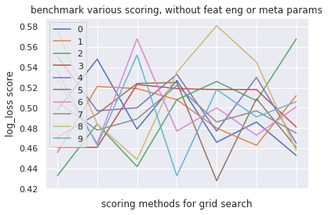


```python
# 'overkill' OK, let's be evil, we now are ready to benchmark Kfolds numbers and test/train size ! 

def benchmark_various_cv(   n=5, df=None, graph=True, params=None, model=None,
                            cv_list=None) : 

    if not isinstance(df, pd.DataFrame): 
        df = build_df(DATA, TRAIN_FILE)

    if not cv_list : 
        cv_list = [int(i) for i in np.arange(2,11, 1)]

    if not model : 
        model = LogisticRegression

    if not params : params = dict() 

    results = [ pd.Series([run_GSCV(model, params, df, cv=c)[0] for c in cv_list], 
                        index=cv_list) for i in range(n)]
    
    results = pd.DataFrame(results, columns=cv_list)

    return results


####

results = benchmark_various_cv(10)

```

    wrapper : called
    build_df : 0.01 secs
    wrapper : ended
    Fitting 2 folds for each of 1 candidates, totalling 2 fits
    Fitting 3 folds for each of 1 candidates, totalling 3 fits


    [Parallel(n_jobs=6)]: Done   2 out of   2 | elapsed:    0.0s finished


    Fitting 4 folds for each of 1 candidates, totalling 4 fits


    [Parallel(n_jobs=6)]: Done   3 out of   3 | elapsed:    0.0s finished


    Fitting 5 folds for each of 1 candidates, totalling 5 fits


    [Parallel(n_jobs=6)]: Done   4 out of   4 | elapsed:    0.0s finished


    Fitting 6 folds for each of 1 candidates, totalling 6 fits


    [Parallel(n_jobs=6)]: Done   5 out of   5 | elapsed:    0.0s finished


    Fitting 7 folds for each of 1 candidates, totalling 7 fits


    [Parallel(n_jobs=6)]: Done   2 out of   6 | elapsed:    0.0s remaining:    0.1s
    [Parallel(n_jobs=6)]: Done   6 out of   6 | elapsed:    0.0s finished


    Fitting 8 folds for each of 1 candidates, totalling 8 fits


    [Parallel(n_jobs=6)]: Done   4 out of   7 | elapsed:    0.0s remaining:    0.0s
    [Parallel(n_jobs=6)]: Done   7 out of   7 | elapsed:    0.0s finished


    Fitting 9 folds for each of 1 candidates, totalling 9 fits


    [Parallel(n_jobs=6)]: Done   6 out of   8 | elapsed:    0.1s remaining:    0.0s
    [Parallel(n_jobs=6)]: Done   8 out of   8 | elapsed:    0.1s finished


    Fitting 10 folds for each of 1 candidates, totalling 10 fits


    [Parallel(n_jobs=6)]: Done   9 out of   9 | elapsed:    0.1s finished


    Fitting 2 folds for each of 1 candidates, totalling 2 fits


    [Parallel(n_jobs=6)]: Done  10 out of  10 | elapsed:    0.1s remaining:    0.0s
    [Parallel(n_jobs=6)]: Done  10 out of  10 | elapsed:    0.1s finished
    [Parallel(n_jobs=6)]: Done   2 out of   2 | elapsed:    0.0s finished


    Fitting 3 folds for each of 1 candidates, totalling 3 fits
    Fitting 4 folds for each of 1 candidates, totalling 4 fits


    [Parallel(n_jobs=6)]: Done   3 out of   3 | elapsed:    0.0s finished


    Fitting 5 folds for each of 1 candidates, totalling 5 fits


    [Parallel(n_jobs=6)]: Done   4 out of   4 | elapsed:    0.0s finished


    Fitting 6 folds for each of 1 candidates, totalling 6 fits


    [Parallel(n_jobs=6)]: Done   5 out of   5 | elapsed:    0.0s finished


    Fitting 7 folds for each of 1 candidates, totalling 7 fits


    [Parallel(n_jobs=6)]: Done   2 out of   6 | elapsed:    0.0s remaining:    0.1s
    [Parallel(n_jobs=6)]: Done   6 out of   6 | elapsed:    0.0s finished


    Fitting 8 folds for each of 1 candidates, totalling 8 fits


    [Parallel(n_jobs=6)]: Done   4 out of   7 | elapsed:    0.0s remaining:    0.0s
    [Parallel(n_jobs=6)]: Done   7 out of   7 | elapsed:    0.0s finished


    Fitting 9 folds for each of 1 candidates, totalling 9 fits


    [Parallel(n_jobs=6)]: Done   6 out of   8 | elapsed:    0.0s remaining:    0.0s
    [Parallel(n_jobs=6)]: Done   8 out of   8 | elapsed:    0.0s finished


    Fitting 10 folds for each of 1 candidates, totalling 10 fits


    [Parallel(n_jobs=6)]: Done   9 out of   9 | elapsed:    0.0s finished


    Fitting 2 folds for each of 1 candidates, totalling 2 fits


    [Parallel(n_jobs=6)]: Done  10 out of  10 | elapsed:    0.0s remaining:    0.0s
    [Parallel(n_jobs=6)]: Done  10 out of  10 | elapsed:    0.0s finished
    [Parallel(n_jobs=6)]: Done   2 out of   2 | elapsed:    0.0s finished


    Fitting 3 folds for each of 1 candidates, totalling 3 fits
    Fitting 4 folds for each of 1 candidates, totalling 4 fits


    [Parallel(n_jobs=6)]: Done   3 out of   3 | elapsed:    0.0s finished


    Fitting 5 folds for each of 1 candidates, totalling 5 fits


    [Parallel(n_jobs=6)]: Done   4 out of   4 | elapsed:    0.0s finished


    Fitting 6 folds for each of 1 candidates, totalling 6 fits


    [Parallel(n_jobs=6)]: Done   5 out of   5 | elapsed:    0.0s finished


    Fitting 7 folds for each of 1 candidates, totalling 7 fits


    [Parallel(n_jobs=6)]: Done   2 out of   6 | elapsed:    0.0s remaining:    0.1s
    [Parallel(n_jobs=6)]: Done   6 out of   6 | elapsed:    0.0s finished


    Fitting 8 folds for each of 1 candidates, totalling 8 fits


    [Parallel(n_jobs=6)]: Done   4 out of   7 | elapsed:    0.0s remaining:    0.0s
    [Parallel(n_jobs=6)]: Done   7 out of   7 | elapsed:    0.0s finished


    Fitting 9 folds for each of 1 candidates, totalling 9 fits


    [Parallel(n_jobs=6)]: Done   6 out of   8 | elapsed:    0.0s remaining:    0.0s
    [Parallel(n_jobs=6)]: Done   8 out of   8 | elapsed:    0.0s finished


    Fitting 10 folds for each of 1 candidates, totalling 10 fits


    [Parallel(n_jobs=6)]: Done   9 out of   9 | elapsed:    0.1s finished


    Fitting 2 folds for each of 1 candidates, totalling 2 fits


    [Parallel(n_jobs=6)]: Done  10 out of  10 | elapsed:    0.1s remaining:    0.0s
    [Parallel(n_jobs=6)]: Done  10 out of  10 | elapsed:    0.1s finished
    [Parallel(n_jobs=6)]: Done   2 out of   2 | elapsed:    0.0s finished


    Fitting 3 folds for each of 1 candidates, totalling 3 fits
    Fitting 4 folds for each of 1 candidates, totalling 4 fits


    [Parallel(n_jobs=6)]: Done   3 out of   3 | elapsed:    0.0s finished


    Fitting 5 folds for each of 1 candidates, totalling 5 fits


    [Parallel(n_jobs=6)]: Done   4 out of   4 | elapsed:    0.0s finished


    Fitting 6 folds for each of 1 candidates, totalling 6 fits


    [Parallel(n_jobs=6)]: Done   5 out of   5 | elapsed:    0.0s finished


    Fitting 7 folds for each of 1 candidates, totalling 7 fits


    [Parallel(n_jobs=6)]: Done   2 out of   6 | elapsed:    0.0s remaining:    0.0s
    [Parallel(n_jobs=6)]: Done   6 out of   6 | elapsed:    0.0s finished


    Fitting 8 folds for each of 1 candidates, totalling 8 fits


    [Parallel(n_jobs=6)]: Done   4 out of   7 | elapsed:    0.0s remaining:    0.0s
    [Parallel(n_jobs=6)]: Done   7 out of   7 | elapsed:    0.0s finished


    Fitting 9 folds for each of 1 candidates, totalling 9 fits


    [Parallel(n_jobs=6)]: Done   6 out of   8 | elapsed:    0.0s remaining:    0.0s
    [Parallel(n_jobs=6)]: Done   8 out of   8 | elapsed:    0.0s finished


    Fitting 10 folds for each of 1 candidates, totalling 10 fits


    [Parallel(n_jobs=6)]: Done   9 out of   9 | elapsed:    0.1s finished


    Fitting 2 folds for each of 1 candidates, totalling 2 fits


    [Parallel(n_jobs=6)]: Done  10 out of  10 | elapsed:    0.0s remaining:    0.0s
    [Parallel(n_jobs=6)]: Done  10 out of  10 | elapsed:    0.0s finished
    [Parallel(n_jobs=6)]: Done   2 out of   2 | elapsed:    0.0s finished


    Fitting 3 folds for each of 1 candidates, totalling 3 fits
    Fitting 4 folds for each of 1 candidates, totalling 4 fits


    [Parallel(n_jobs=6)]: Done   3 out of   3 | elapsed:    0.0s finished


    Fitting 5 folds for each of 1 candidates, totalling 5 fits


    [Parallel(n_jobs=6)]: Done   4 out of   4 | elapsed:    0.0s finished


    Fitting 6 folds for each of 1 candidates, totalling 6 fits


    [Parallel(n_jobs=6)]: Done   5 out of   5 | elapsed:    0.0s finished


    Fitting 7 folds for each of 1 candidates, totalling 7 fits


    [Parallel(n_jobs=6)]: Done   2 out of   6 | elapsed:    0.0s remaining:    0.1s
    [Parallel(n_jobs=6)]: Done   6 out of   6 | elapsed:    0.0s finished


    Fitting 8 folds for each of 1 candidates, totalling 8 fits


    [Parallel(n_jobs=6)]: Done   4 out of   7 | elapsed:    0.0s remaining:    0.0s
    [Parallel(n_jobs=6)]: Done   7 out of   7 | elapsed:    0.0s finished


    Fitting 9 folds for each of 1 candidates, totalling 9 fits


    [Parallel(n_jobs=6)]: Done   6 out of   8 | elapsed:    0.0s remaining:    0.0s
    [Parallel(n_jobs=6)]: Done   8 out of   8 | elapsed:    0.0s finished


    Fitting 10 folds for each of 1 candidates, totalling 10 fits


    [Parallel(n_jobs=6)]: Done   9 out of   9 | elapsed:    0.0s finished


    Fitting 2 folds for each of 1 candidates, totalling 2 fits


    [Parallel(n_jobs=6)]: Done  10 out of  10 | elapsed:    0.0s remaining:    0.0s
    [Parallel(n_jobs=6)]: Done  10 out of  10 | elapsed:    0.0s finished
    [Parallel(n_jobs=6)]: Done   2 out of   2 | elapsed:    0.0s finished


    Fitting 3 folds for each of 1 candidates, totalling 3 fits
    Fitting 4 folds for each of 1 candidates, totalling 4 fits


    [Parallel(n_jobs=6)]: Done   3 out of   3 | elapsed:    0.0s finished


    Fitting 5 folds for each of 1 candidates, totalling 5 fits


    [Parallel(n_jobs=6)]: Done   4 out of   4 | elapsed:    0.0s finished


    Fitting 6 folds for each of 1 candidates, totalling 6 fits


    [Parallel(n_jobs=6)]: Done   5 out of   5 | elapsed:    0.0s finished


    Fitting 7 folds for each of 1 candidates, totalling 7 fits


    [Parallel(n_jobs=6)]: Done   2 out of   6 | elapsed:    0.0s remaining:    0.1s
    [Parallel(n_jobs=6)]: Done   6 out of   6 | elapsed:    0.0s finished


    Fitting 8 folds for each of 1 candidates, totalling 8 fits


    [Parallel(n_jobs=6)]: Done   4 out of   7 | elapsed:    0.0s remaining:    0.0s
    [Parallel(n_jobs=6)]: Done   7 out of   7 | elapsed:    0.0s finished


    Fitting 9 folds for each of 1 candidates, totalling 9 fits


    [Parallel(n_jobs=6)]: Done   6 out of   8 | elapsed:    0.0s remaining:    0.0s
    [Parallel(n_jobs=6)]: Done   8 out of   8 | elapsed:    0.0s finished


    Fitting 10 folds for each of 1 candidates, totalling 10 fits


    [Parallel(n_jobs=6)]: Done   9 out of   9 | elapsed:    0.0s finished


    Fitting 2 folds for each of 1 candidates, totalling 2 fits


    [Parallel(n_jobs=6)]: Done  10 out of  10 | elapsed:    0.0s remaining:    0.0s
    [Parallel(n_jobs=6)]: Done  10 out of  10 | elapsed:    0.0s finished
    [Parallel(n_jobs=6)]: Done   2 out of   2 | elapsed:    0.0s finished


    Fitting 3 folds for each of 1 candidates, totalling 3 fits
    Fitting 4 folds for each of 1 candidates, totalling 4 fits


    [Parallel(n_jobs=6)]: Done   3 out of   3 | elapsed:    0.0s finished


    Fitting 5 folds for each of 1 candidates, totalling 5 fits


    [Parallel(n_jobs=6)]: Done   4 out of   4 | elapsed:    0.0s finished


    Fitting 6 folds for each of 1 candidates, totalling 6 fits


    [Parallel(n_jobs=6)]: Done   5 out of   5 | elapsed:    0.0s finished


    Fitting 7 folds for each of 1 candidates, totalling 7 fits


    [Parallel(n_jobs=6)]: Done   2 out of   6 | elapsed:    0.0s remaining:    0.0s
    [Parallel(n_jobs=6)]: Done   6 out of   6 | elapsed:    0.0s finished


    Fitting 8 folds for each of 1 candidates, totalling 8 fits


    [Parallel(n_jobs=6)]: Done   4 out of   7 | elapsed:    0.0s remaining:    0.0s
    [Parallel(n_jobs=6)]: Done   7 out of   7 | elapsed:    0.0s finished


    Fitting 9 folds for each of 1 candidates, totalling 9 fits


    [Parallel(n_jobs=6)]: Done   6 out of   8 | elapsed:    0.0s remaining:    0.0s
    [Parallel(n_jobs=6)]: Done   8 out of   8 | elapsed:    0.0s finished


    Fitting 10 folds for each of 1 candidates, totalling 10 fits


    [Parallel(n_jobs=6)]: Done   9 out of   9 | elapsed:    0.0s finished


    Fitting 2 folds for each of 1 candidates, totalling 2 fits


    [Parallel(n_jobs=6)]: Done  10 out of  10 | elapsed:    0.0s remaining:    0.0s
    [Parallel(n_jobs=6)]: Done  10 out of  10 | elapsed:    0.0s finished


    Fitting 3 folds for each of 1 candidates, totalling 3 fits


    [Parallel(n_jobs=6)]: Done   2 out of   2 | elapsed:    0.0s finished


    Fitting 4 folds for each of 1 candidates, totalling 4 fits


    [Parallel(n_jobs=6)]: Done   3 out of   3 | elapsed:    0.0s finished


    Fitting 5 folds for each of 1 candidates, totalling 5 fits


    [Parallel(n_jobs=6)]: Done   4 out of   4 | elapsed:    0.0s finished


    Fitting 6 folds for each of 1 candidates, totalling 6 fits


    [Parallel(n_jobs=6)]: Done   5 out of   5 | elapsed:    0.0s finished


    Fitting 7 folds for each of 1 candidates, totalling 7 fits


    [Parallel(n_jobs=6)]: Done   2 out of   6 | elapsed:    0.0s remaining:    0.1s
    [Parallel(n_jobs=6)]: Done   6 out of   6 | elapsed:    0.0s finished


    Fitting 8 folds for each of 1 candidates, totalling 8 fits


    [Parallel(n_jobs=6)]: Done   4 out of   7 | elapsed:    0.0s remaining:    0.0s
    [Parallel(n_jobs=6)]: Done   7 out of   7 | elapsed:    0.0s finished


    Fitting 9 folds for each of 1 candidates, totalling 9 fits


    [Parallel(n_jobs=6)]: Done   6 out of   8 | elapsed:    0.0s remaining:    0.0s
    [Parallel(n_jobs=6)]: Done   8 out of   8 | elapsed:    0.0s finished


    Fitting 10 folds for each of 1 candidates, totalling 10 fits


    [Parallel(n_jobs=6)]: Done   9 out of   9 | elapsed:    0.0s finished


    Fitting 2 folds for each of 1 candidates, totalling 2 fits


    [Parallel(n_jobs=6)]: Done  10 out of  10 | elapsed:    0.1s remaining:    0.0s
    [Parallel(n_jobs=6)]: Done  10 out of  10 | elapsed:    0.1s finished
    [Parallel(n_jobs=6)]: Done   2 out of   2 | elapsed:    0.0s finished


    Fitting 3 folds for each of 1 candidates, totalling 3 fits
    Fitting 4 folds for each of 1 candidates, totalling 4 fits


    [Parallel(n_jobs=6)]: Done   3 out of   3 | elapsed:    0.0s finished


    Fitting 5 folds for each of 1 candidates, totalling 5 fits


    [Parallel(n_jobs=6)]: Done   4 out of   4 | elapsed:    0.0s finished


    Fitting 6 folds for each of 1 candidates, totalling 6 fits


    [Parallel(n_jobs=6)]: Done   5 out of   5 | elapsed:    0.0s finished


    Fitting 7 folds for each of 1 candidates, totalling 7 fits


    [Parallel(n_jobs=6)]: Done   2 out of   6 | elapsed:    0.0s remaining:    0.0s
    [Parallel(n_jobs=6)]: Done   6 out of   6 | elapsed:    0.0s finished


    Fitting 8 folds for each of 1 candidates, totalling 8 fits


    [Parallel(n_jobs=6)]: Done   4 out of   7 | elapsed:    0.0s remaining:    0.0s
    [Parallel(n_jobs=6)]: Done   7 out of   7 | elapsed:    0.1s finished


    Fitting 9 folds for each of 1 candidates, totalling 9 fits


    [Parallel(n_jobs=6)]: Done   6 out of   8 | elapsed:    0.0s remaining:    0.0s
    [Parallel(n_jobs=6)]: Done   8 out of   8 | elapsed:    0.0s finished


    Fitting 10 folds for each of 1 candidates, totalling 10 fits


    [Parallel(n_jobs=6)]: Done   9 out of   9 | elapsed:    0.0s finished


    Fitting 2 folds for each of 1 candidates, totalling 2 fits


    [Parallel(n_jobs=6)]: Done  10 out of  10 | elapsed:    0.0s remaining:    0.0s
    [Parallel(n_jobs=6)]: Done  10 out of  10 | elapsed:    0.0s finished
    [Parallel(n_jobs=6)]: Done   2 out of   2 | elapsed:    0.0s finished


    Fitting 3 folds for each of 1 candidates, totalling 3 fits
    Fitting 4 folds for each of 1 candidates, totalling 4 fits


    [Parallel(n_jobs=6)]: Done   3 out of   3 | elapsed:    0.0s finished


    Fitting 5 folds for each of 1 candidates, totalling 5 fits


    [Parallel(n_jobs=6)]: Done   4 out of   4 | elapsed:    0.0s finished


    Fitting 6 folds for each of 1 candidates, totalling 6 fits


    [Parallel(n_jobs=6)]: Done   5 out of   5 | elapsed:    0.0s finished


    Fitting 7 folds for each of 1 candidates, totalling 7 fits


    [Parallel(n_jobs=6)]: Done   2 out of   6 | elapsed:    0.0s remaining:    0.0s
    [Parallel(n_jobs=6)]: Done   6 out of   6 | elapsed:    0.0s finished


    Fitting 8 folds for each of 1 candidates, totalling 8 fits


    [Parallel(n_jobs=6)]: Done   4 out of   7 | elapsed:    0.0s remaining:    0.0s
    [Parallel(n_jobs=6)]: Done   7 out of   7 | elapsed:    0.0s finished


    Fitting 9 folds for each of 1 candidates, totalling 9 fits


    [Parallel(n_jobs=6)]: Done   6 out of   8 | elapsed:    0.0s remaining:    0.0s
    [Parallel(n_jobs=6)]: Done   8 out of   8 | elapsed:    0.0s finished


    Fitting 10 folds for each of 1 candidates, totalling 10 fits


    [Parallel(n_jobs=6)]: Done   9 out of   9 | elapsed:    0.0s finished
    [Parallel(n_jobs=6)]: Done  10 out of  10 | elapsed:    0.0s remaining:    0.0s
    [Parallel(n_jobs=6)]: Done  10 out of  10 | elapsed:    0.0s finished


```python
# raw results

results

```


<div>
<style scoped>
    .dataframe tbody tr th:only-of-type {
        vertical-align: middle;
    }

    .dataframe tbody tr th {
        vertical-align: top;
    }

    .dataframe thead th {
        text-align: right;
    }
</style>
<table border="1" class="dataframe">
  <thead>
    <tr style="text-align: right;">
      <th></th>
      <th>2</th>
      <th>3</th>
      <th>4</th>
      <th>5</th>
      <th>6</th>
      <th>7</th>
      <th>8</th>
      <th>9</th>
      <th>10</th>
    </tr>
  </thead>
  <tbody>
    <tr>
      <th>0</th>
      <td>0.551</td>
      <td>0.533</td>
      <td>0.517</td>
      <td>0.501</td>
      <td>0.430</td>
      <td>0.551</td>
      <td>0.433</td>
      <td>0.553</td>
      <td>0.569</td>
    </tr>
    <tr>
      <th>1</th>
      <td>0.492</td>
      <td>0.436</td>
      <td>0.443</td>
      <td>0.483</td>
      <td>0.508</td>
      <td>0.464</td>
      <td>0.487</td>
      <td>0.472</td>
      <td>0.476</td>
    </tr>
    <tr>
      <th>2</th>
      <td>0.474</td>
      <td>0.476</td>
      <td>0.493</td>
      <td>0.520</td>
      <td>0.478</td>
      <td>0.489</td>
      <td>0.480</td>
      <td>0.491</td>
      <td>0.471</td>
    </tr>
    <tr>
      <th>3</th>
      <td>0.482</td>
      <td>0.483</td>
      <td>0.457</td>
      <td>0.465</td>
      <td>0.523</td>
      <td>0.460</td>
      <td>0.465</td>
      <td>0.489</td>
      <td>0.447</td>
    </tr>
    <tr>
      <th>4</th>
      <td>0.527</td>
      <td>0.439</td>
      <td>0.492</td>
      <td>0.442</td>
      <td>0.467</td>
      <td>0.506</td>
      <td>0.512</td>
      <td>0.505</td>
      <td>0.480</td>
    </tr>
    <tr>
      <th>5</th>
      <td>0.450</td>
      <td>0.519</td>
      <td>0.524</td>
      <td>0.486</td>
      <td>0.485</td>
      <td>0.472</td>
      <td>0.468</td>
      <td>0.463</td>
      <td>0.491</td>
    </tr>
    <tr>
      <th>6</th>
      <td>0.520</td>
      <td>0.503</td>
      <td>0.462</td>
      <td>0.511</td>
      <td>0.536</td>
      <td>0.514</td>
      <td>0.430</td>
      <td>0.482</td>
      <td>0.498</td>
    </tr>
    <tr>
      <th>7</th>
      <td>0.485</td>
      <td>0.480</td>
      <td>0.512</td>
      <td>0.516</td>
      <td>0.520</td>
      <td>0.502</td>
      <td>0.539</td>
      <td>0.485</td>
      <td>0.550</td>
    </tr>
    <tr>
      <th>8</th>
      <td>0.455</td>
      <td>0.460</td>
      <td>0.465</td>
      <td>0.468</td>
      <td>0.498</td>
      <td>0.453</td>
      <td>0.503</td>
      <td>0.483</td>
      <td>0.477</td>
    </tr>
    <tr>
      <th>9</th>
      <td>0.521</td>
      <td>0.485</td>
      <td>0.494</td>
      <td>0.491</td>
      <td>0.464</td>
      <td>0.520</td>
      <td>0.477</td>
      <td>0.460</td>
      <td>0.504</td>
    </tr>
  </tbody>
</table>
</div>


```python
# graph

results.boxplot()
plt.xlabel(" nb of kfolds for grid search")
plt.ylabel("log_loss score")
plt.title("benchmark various nb of kfolds, without feat eng or meta params")
plt.show()

```


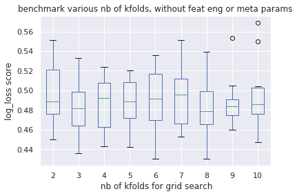


```python
# fancy results

_results = results.describe().T.sort_values(by="50%")
_results

```


<div>
<style scoped>
    .dataframe tbody tr th:only-of-type {
        vertical-align: middle;
    }

    .dataframe tbody tr th {
        vertical-align: top;
    }

    .dataframe thead th {
        text-align: right;
    }
</style>
<table border="1" class="dataframe">
  <thead>
    <tr style="text-align: right;">
      <th></th>
      <th>count</th>
      <th>mean</th>
      <th>std</th>
      <th>min</th>
      <th>25%</th>
      <th>50%</th>
      <th>75%</th>
      <th>max</th>
    </tr>
  </thead>
  <tbody>
    <tr>
      <th>8</th>
      <td>10.0</td>
      <td>0.4794</td>
      <td>0.033610</td>
      <td>0.430</td>
      <td>0.46575</td>
      <td>0.4785</td>
      <td>0.49900</td>
      <td>0.539</td>
    </tr>
    <tr>
      <th>3</th>
      <td>10.0</td>
      <td>0.4814</td>
      <td>0.031458</td>
      <td>0.436</td>
      <td>0.46400</td>
      <td>0.4815</td>
      <td>0.49850</td>
      <td>0.533</td>
    </tr>
    <tr>
      <th>9</th>
      <td>10.0</td>
      <td>0.4883</td>
      <td>0.026369</td>
      <td>0.460</td>
      <td>0.47450</td>
      <td>0.4840</td>
      <td>0.49050</td>
      <td>0.553</td>
    </tr>
    <tr>
      <th>10</th>
      <td>10.0</td>
      <td>0.4963</td>
      <td>0.037089</td>
      <td>0.447</td>
      <td>0.47625</td>
      <td>0.4855</td>
      <td>0.50250</td>
      <td>0.569</td>
    </tr>
    <tr>
      <th>2</th>
      <td>10.0</td>
      <td>0.4957</td>
      <td>0.032998</td>
      <td>0.450</td>
      <td>0.47600</td>
      <td>0.4885</td>
      <td>0.52075</td>
      <td>0.551</td>
    </tr>
    <tr>
      <th>5</th>
      <td>10.0</td>
      <td>0.4883</td>
      <td>0.024918</td>
      <td>0.442</td>
      <td>0.47175</td>
      <td>0.4885</td>
      <td>0.50850</td>
      <td>0.520</td>
    </tr>
    <tr>
      <th>6</th>
      <td>10.0</td>
      <td>0.4909</td>
      <td>0.032419</td>
      <td>0.430</td>
      <td>0.46975</td>
      <td>0.4915</td>
      <td>0.51700</td>
      <td>0.536</td>
    </tr>
    <tr>
      <th>4</th>
      <td>10.0</td>
      <td>0.4859</td>
      <td>0.027763</td>
      <td>0.443</td>
      <td>0.46275</td>
      <td>0.4925</td>
      <td>0.50750</td>
      <td>0.524</td>
    </tr>
    <tr>
      <th>7</th>
      <td>10.0</td>
      <td>0.4931</td>
      <td>0.031218</td>
      <td>0.453</td>
      <td>0.46600</td>
      <td>0.4955</td>
      <td>0.51200</td>
      <td>0.551</td>
    </tr>
  </tbody>
</table>
</div>


```python
# graph 

results.T.iloc[:, :10].plot()
plt.xlabel("scoring methods for grid search")
plt.ylabel("log_loss score")
plt.title("benchmark various scoring, without feat eng or meta params")
plt.show()

```


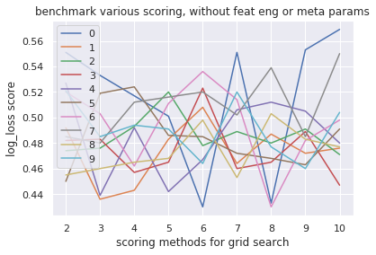


```python
# 'overkill' idem for test/train ratio

def benchmark_various_test_size(   n=5, df=None, graph=True, params=None, model=None,
                                   test_size_list=None) : 

    if not isinstance(df, pd.DataFrame): 
        df = build_df(DATA, TRAIN_FILE)

    if not test_size_list : 
        test_size_list =  [round(float(i), 2) for i in (np.arange(20, 41, 1) /100)]

    if not model : 
        model = LogisticRegression

    if not params : params = dict() 

    results = [ pd.Series([run_GSCV(model, params, df, test_size=t)[0] for t in test_size_list], 
                        index=test_size_list) for i in range(n)]
    
    results = pd.DataFrame(results, columns=test_size_list)

    return results


#### 

results = benchmark_various_test_size(10)

```

    wrapper : called
    build_df : 0.01 secs
    wrapper : ended
    Fitting 5 folds for each of 1 candidates, totalling 5 fits
    Fitting 5 folds for each of 1 candidates, totalling 5 fits


    [Parallel(n_jobs=6)]: Done   5 out of   5 | elapsed:    0.0s finished


    Fitting 5 folds for each of 1 candidates, totalling 5 fits


    [Parallel(n_jobs=6)]: Done   5 out of   5 | elapsed:    0.0s finished


    Fitting 5 folds for each of 1 candidates, totalling 5 fits


    [Parallel(n_jobs=6)]: Done   5 out of   5 | elapsed:    0.0s finished


    Fitting 5 folds for each of 1 candidates, totalling 5 fits


    [Parallel(n_jobs=6)]: Done   5 out of   5 | elapsed:    0.0s finished


    Fitting 5 folds for each of 1 candidates, totalling 5 fits


    [Parallel(n_jobs=6)]: Done   5 out of   5 | elapsed:    0.0s finished


    Fitting 5 folds for each of 1 candidates, totalling 5 fits


    [Parallel(n_jobs=6)]: Done   5 out of   5 | elapsed:    0.0s finished


    Fitting 5 folds for each of 1 candidates, totalling 5 fits


    [Parallel(n_jobs=6)]: Done   5 out of   5 | elapsed:    0.0s finished


    Fitting 5 folds for each of 1 candidates, totalling 5 fits


    [Parallel(n_jobs=6)]: Done   5 out of   5 | elapsed:    0.0s finished


    Fitting 5 folds for each of 1 candidates, totalling 5 fits


    [Parallel(n_jobs=6)]: Done   5 out of   5 | elapsed:    0.0s finished


    Fitting 5 folds for each of 1 candidates, totalling 5 fits


    [Parallel(n_jobs=6)]: Done   5 out of   5 | elapsed:    0.0s finished


    Fitting 5 folds for each of 1 candidates, totalling 5 fits


    [Parallel(n_jobs=6)]: Done   5 out of   5 | elapsed:    0.0s finished


    Fitting 5 folds for each of 1 candidates, totalling 5 fits


    [Parallel(n_jobs=6)]: Done   5 out of   5 | elapsed:    0.0s finished


    Fitting 5 folds for each of 1 candidates, totalling 5 fits


    [Parallel(n_jobs=6)]: Done   5 out of   5 | elapsed:    0.0s finished


    Fitting 5 folds for each of 1 candidates, totalling 5 fits


    [Parallel(n_jobs=6)]: Done   5 out of   5 | elapsed:    0.0s finished


    Fitting 5 folds for each of 1 candidates, totalling 5 fits


    [Parallel(n_jobs=6)]: Done   5 out of   5 | elapsed:    0.0s finished


    Fitting 5 folds for each of 1 candidates, totalling 5 fits


    [Parallel(n_jobs=6)]: Done   5 out of   5 | elapsed:    0.0s finished


    Fitting 5 folds for each of 1 candidates, totalling 5 fits


    [Parallel(n_jobs=6)]: Done   5 out of   5 | elapsed:    0.0s finished


    Fitting 5 folds for each of 1 candidates, totalling 5 fits


    [Parallel(n_jobs=6)]: Done   5 out of   5 | elapsed:    0.0s finished


    Fitting 5 folds for each of 1 candidates, totalling 5 fits


    [Parallel(n_jobs=6)]: Done   5 out of   5 | elapsed:    0.0s finished


    Fitting 5 folds for each of 1 candidates, totalling 5 fits


    [Parallel(n_jobs=6)]: Done   5 out of   5 | elapsed:    0.0s finished


    Fitting 5 folds for each of 1 candidates, totalling 5 fits


    [Parallel(n_jobs=6)]: Done   5 out of   5 | elapsed:    0.0s finished


    Fitting 5 folds for each of 1 candidates, totalling 5 fits


    [Parallel(n_jobs=6)]: Done   5 out of   5 | elapsed:    0.0s finished


    Fitting 5 folds for each of 1 candidates, totalling 5 fits


    [Parallel(n_jobs=6)]: Done   5 out of   5 | elapsed:    0.0s finished


    Fitting 5 folds for each of 1 candidates, totalling 5 fits


    [Parallel(n_jobs=6)]: Done   5 out of   5 | elapsed:    0.0s finished


    Fitting 5 folds for each of 1 candidates, totalling 5 fits


    [Parallel(n_jobs=6)]: Done   5 out of   5 | elapsed:    0.0s finished


    Fitting 5 folds for each of 1 candidates, totalling 5 fits


    [Parallel(n_jobs=6)]: Done   5 out of   5 | elapsed:    0.0s finished


    Fitting 5 folds for each of 1 candidates, totalling 5 fits


    [Parallel(n_jobs=6)]: Done   5 out of   5 | elapsed:    0.0s finished


    Fitting 5 folds for each of 1 candidates, totalling 5 fits


    [Parallel(n_jobs=6)]: Done   5 out of   5 | elapsed:    0.0s finished


    Fitting 5 folds for each of 1 candidates, totalling 5 fits


    [Parallel(n_jobs=6)]: Done   5 out of   5 | elapsed:    0.0s finished


    Fitting 5 folds for each of 1 candidates, totalling 5 fits


    [Parallel(n_jobs=6)]: Done   5 out of   5 | elapsed:    0.0s finished


    Fitting 5 folds for each of 1 candidates, totalling 5 fits


    [Parallel(n_jobs=6)]: Done   5 out of   5 | elapsed:    0.0s finished


    Fitting 5 folds for each of 1 candidates, totalling 5 fits


    [Parallel(n_jobs=6)]: Done   5 out of   5 | elapsed:    0.0s finished


    Fitting 5 folds for each of 1 candidates, totalling 5 fits


    [Parallel(n_jobs=6)]: Done   5 out of   5 | elapsed:    0.0s finished


    Fitting 5 folds for each of 1 candidates, totalling 5 fits


    [Parallel(n_jobs=6)]: Done   5 out of   5 | elapsed:    0.0s finished


    Fitting 5 folds for each of 1 candidates, totalling 5 fits


    [Parallel(n_jobs=6)]: Done   5 out of   5 | elapsed:    0.0s finished


    Fitting 5 folds for each of 1 candidates, totalling 5 fits


    [Parallel(n_jobs=6)]: Done   5 out of   5 | elapsed:    0.0s finished


    Fitting 5 folds for each of 1 candidates, totalling 5 fits


    [Parallel(n_jobs=6)]: Done   5 out of   5 | elapsed:    0.0s finished


    Fitting 5 folds for each of 1 candidates, totalling 5 fits


    [Parallel(n_jobs=6)]: Done   5 out of   5 | elapsed:    0.0s finished


    Fitting 5 folds for each of 1 candidates, totalling 5 fits


    [Parallel(n_jobs=6)]: Done   5 out of   5 | elapsed:    0.0s finished


    Fitting 5 folds for each of 1 candidates, totalling 5 fits


    [Parallel(n_jobs=6)]: Done   5 out of   5 | elapsed:    0.0s finished


    Fitting 5 folds for each of 1 candidates, totalling 5 fits


    [Parallel(n_jobs=6)]: Done   5 out of   5 | elapsed:    0.0s finished


    Fitting 5 folds for each of 1 candidates, totalling 5 fits


    [Parallel(n_jobs=6)]: Done   5 out of   5 | elapsed:    0.0s finished


    Fitting 5 folds for each of 1 candidates, totalling 5 fits


    [Parallel(n_jobs=6)]: Done   5 out of   5 | elapsed:    0.0s finished


    Fitting 5 folds for each of 1 candidates, totalling 5 fits


    [Parallel(n_jobs=6)]: Done   5 out of   5 | elapsed:    0.0s finished


    Fitting 5 folds for each of 1 candidates, totalling 5 fits


    [Parallel(n_jobs=6)]: Done   5 out of   5 | elapsed:    0.0s finished


    Fitting 5 folds for each of 1 candidates, totalling 5 fits


    [Parallel(n_jobs=6)]: Done   5 out of   5 | elapsed:    0.0s finished


    Fitting 5 folds for each of 1 candidates, totalling 5 fits


    [Parallel(n_jobs=6)]: Done   5 out of   5 | elapsed:    0.0s finished


    Fitting 5 folds for each of 1 candidates, totalling 5 fits


    [Parallel(n_jobs=6)]: Done   5 out of   5 | elapsed:    0.0s finished


    Fitting 5 folds for each of 1 candidates, totalling 5 fits


    [Parallel(n_jobs=6)]: Done   5 out of   5 | elapsed:    0.0s finished


    Fitting 5 folds for each of 1 candidates, totalling 5 fits


    [Parallel(n_jobs=6)]: Done   5 out of   5 | elapsed:    0.0s finished


    Fitting 5 folds for each of 1 candidates, totalling 5 fits


    [Parallel(n_jobs=6)]: Done   5 out of   5 | elapsed:    0.0s finished


    Fitting 5 folds for each of 1 candidates, totalling 5 fits


    [Parallel(n_jobs=6)]: Done   5 out of   5 | elapsed:    0.0s finished


    Fitting 5 folds for each of 1 candidates, totalling 5 fits


    [Parallel(n_jobs=6)]: Done   5 out of   5 | elapsed:    0.0s finished


    Fitting 5 folds for each of 1 candidates, totalling 5 fits


    [Parallel(n_jobs=6)]: Done   5 out of   5 | elapsed:    0.0s finished


    Fitting 5 folds for each of 1 candidates, totalling 5 fits


    [Parallel(n_jobs=6)]: Done   5 out of   5 | elapsed:    0.0s finished


    Fitting 5 folds for each of 1 candidates, totalling 5 fits


    [Parallel(n_jobs=6)]: Done   5 out of   5 | elapsed:    0.0s finished


    Fitting 5 folds for each of 1 candidates, totalling 5 fits


    [Parallel(n_jobs=6)]: Done   5 out of   5 | elapsed:    0.0s finished


    Fitting 5 folds for each of 1 candidates, totalling 5 fits


    [Parallel(n_jobs=6)]: Done   5 out of   5 | elapsed:    0.0s finished


    Fitting 5 folds for each of 1 candidates, totalling 5 fits


    [Parallel(n_jobs=6)]: Done   5 out of   5 | elapsed:    0.0s finished


    Fitting 5 folds for each of 1 candidates, totalling 5 fits


    [Parallel(n_jobs=6)]: Done   5 out of   5 | elapsed:    0.0s finished


    Fitting 5 folds for each of 1 candidates, totalling 5 fits


    [Parallel(n_jobs=6)]: Done   5 out of   5 | elapsed:    0.0s finished


    Fitting 5 folds for each of 1 candidates, totalling 5 fits


    [Parallel(n_jobs=6)]: Done   5 out of   5 | elapsed:    0.0s finished


    Fitting 5 folds for each of 1 candidates, totalling 5 fits


    [Parallel(n_jobs=6)]: Done   5 out of   5 | elapsed:    0.0s finished


    Fitting 5 folds for each of 1 candidates, totalling 5 fits


    [Parallel(n_jobs=6)]: Done   5 out of   5 | elapsed:    0.0s finished


    Fitting 5 folds for each of 1 candidates, totalling 5 fits


    [Parallel(n_jobs=6)]: Done   5 out of   5 | elapsed:    0.0s finished


    Fitting 5 folds for each of 1 candidates, totalling 5 fits


    [Parallel(n_jobs=6)]: Done   5 out of   5 | elapsed:    0.0s finished


    Fitting 5 folds for each of 1 candidates, totalling 5 fits


    [Parallel(n_jobs=6)]: Done   5 out of   5 | elapsed:    0.0s finished


    Fitting 5 folds for each of 1 candidates, totalling 5 fits


    [Parallel(n_jobs=6)]: Done   5 out of   5 | elapsed:    0.0s finished


    Fitting 5 folds for each of 1 candidates, totalling 5 fits


    [Parallel(n_jobs=6)]: Done   5 out of   5 | elapsed:    0.0s finished


    Fitting 5 folds for each of 1 candidates, totalling 5 fits


    [Parallel(n_jobs=6)]: Done   5 out of   5 | elapsed:    0.0s finished


    Fitting 5 folds for each of 1 candidates, totalling 5 fits


    [Parallel(n_jobs=6)]: Done   5 out of   5 | elapsed:    0.0s finished


    Fitting 5 folds for each of 1 candidates, totalling 5 fits


    [Parallel(n_jobs=6)]: Done   5 out of   5 | elapsed:    0.0s finished


    Fitting 5 folds for each of 1 candidates, totalling 5 fits


    [Parallel(n_jobs=6)]: Done   5 out of   5 | elapsed:    0.0s finished


    Fitting 5 folds for each of 1 candidates, totalling 5 fits


    [Parallel(n_jobs=6)]: Done   5 out of   5 | elapsed:    0.0s finished


    Fitting 5 folds for each of 1 candidates, totalling 5 fits


    [Parallel(n_jobs=6)]: Done   5 out of   5 | elapsed:    0.0s finished


    Fitting 5 folds for each of 1 candidates, totalling 5 fits


    [Parallel(n_jobs=6)]: Done   5 out of   5 | elapsed:    0.0s finished


    Fitting 5 folds for each of 1 candidates, totalling 5 fits


    [Parallel(n_jobs=6)]: Done   5 out of   5 | elapsed:    0.0s finished


    Fitting 5 folds for each of 1 candidates, totalling 5 fits


    [Parallel(n_jobs=6)]: Done   5 out of   5 | elapsed:    0.0s finished


    Fitting 5 folds for each of 1 candidates, totalling 5 fits


    [Parallel(n_jobs=6)]: Done   5 out of   5 | elapsed:    0.0s finished


    Fitting 5 folds for each of 1 candidates, totalling 5 fits


    [Parallel(n_jobs=6)]: Done   5 out of   5 | elapsed:    0.0s finished


    Fitting 5 folds for each of 1 candidates, totalling 5 fits


    [Parallel(n_jobs=6)]: Done   5 out of   5 | elapsed:    0.0s finished


    Fitting 5 folds for each of 1 candidates, totalling 5 fits


    [Parallel(n_jobs=6)]: Done   5 out of   5 | elapsed:    0.0s finished


    Fitting 5 folds for each of 1 candidates, totalling 5 fits


    [Parallel(n_jobs=6)]: Done   5 out of   5 | elapsed:    0.0s finished


    Fitting 5 folds for each of 1 candidates, totalling 5 fits


    [Parallel(n_jobs=6)]: Done   5 out of   5 | elapsed:    0.0s finished


    Fitting 5 folds for each of 1 candidates, totalling 5 fits


    [Parallel(n_jobs=6)]: Done   5 out of   5 | elapsed:    0.0s finished


    Fitting 5 folds for each of 1 candidates, totalling 5 fits


    [Parallel(n_jobs=6)]: Done   5 out of   5 | elapsed:    0.0s finished


    Fitting 5 folds for each of 1 candidates, totalling 5 fits


    [Parallel(n_jobs=6)]: Done   5 out of   5 | elapsed:    0.0s finished


    Fitting 5 folds for each of 1 candidates, totalling 5 fits


    [Parallel(n_jobs=6)]: Done   5 out of   5 | elapsed:    0.0s finished


    Fitting 5 folds for each of 1 candidates, totalling 5 fits


    [Parallel(n_jobs=6)]: Done   5 out of   5 | elapsed:    0.0s finished


    Fitting 5 folds for each of 1 candidates, totalling 5 fits


    [Parallel(n_jobs=6)]: Done   5 out of   5 | elapsed:    0.0s finished


    Fitting 5 folds for each of 1 candidates, totalling 5 fits


    [Parallel(n_jobs=6)]: Done   5 out of   5 | elapsed:    0.0s finished


    Fitting 5 folds for each of 1 candidates, totalling 5 fits


    [Parallel(n_jobs=6)]: Done   5 out of   5 | elapsed:    0.0s finished


    Fitting 5 folds for each of 1 candidates, totalling 5 fits


    [Parallel(n_jobs=6)]: Done   5 out of   5 | elapsed:    0.0s finished


    Fitting 5 folds for each of 1 candidates, totalling 5 fits


    [Parallel(n_jobs=6)]: Done   5 out of   5 | elapsed:    0.0s finished


    Fitting 5 folds for each of 1 candidates, totalling 5 fits


    [Parallel(n_jobs=6)]: Done   5 out of   5 | elapsed:    0.0s finished


    Fitting 5 folds for each of 1 candidates, totalling 5 fits


    [Parallel(n_jobs=6)]: Done   5 out of   5 | elapsed:    0.0s finished


    Fitting 5 folds for each of 1 candidates, totalling 5 fits


    [Parallel(n_jobs=6)]: Done   5 out of   5 | elapsed:    0.0s finished


    Fitting 5 folds for each of 1 candidates, totalling 5 fits


    [Parallel(n_jobs=6)]: Done   5 out of   5 | elapsed:    0.0s finished


    Fitting 5 folds for each of 1 candidates, totalling 5 fits


    [Parallel(n_jobs=6)]: Done   5 out of   5 | elapsed:    0.0s finished


    Fitting 5 folds for each of 1 candidates, totalling 5 fits


    [Parallel(n_jobs=6)]: Done   5 out of   5 | elapsed:    0.0s finished


    Fitting 5 folds for each of 1 candidates, totalling 5 fits


    [Parallel(n_jobs=6)]: Done   5 out of   5 | elapsed:    0.1s finished
    [Parallel(n_jobs=6)]: Done   5 out of   5 | elapsed:    0.0s finished


    Fitting 5 folds for each of 1 candidates, totalling 5 fits
    Fitting 5 folds for each of 1 candidates, totalling 5 fits


    [Parallel(n_jobs=6)]: Done   5 out of   5 | elapsed:    0.0s finished


    Fitting 5 folds for each of 1 candidates, totalling 5 fits


    [Parallel(n_jobs=6)]: Done   5 out of   5 | elapsed:    0.0s finished


    Fitting 5 folds for each of 1 candidates, totalling 5 fits


    [Parallel(n_jobs=6)]: Done   5 out of   5 | elapsed:    0.0s finished


    Fitting 5 folds for each of 1 candidates, totalling 5 fits


    [Parallel(n_jobs=6)]: Done   5 out of   5 | elapsed:    0.0s finished


    Fitting 5 folds for each of 1 candidates, totalling 5 fits


    [Parallel(n_jobs=6)]: Done   5 out of   5 | elapsed:    0.0s finished


    Fitting 5 folds for each of 1 candidates, totalling 5 fits


    [Parallel(n_jobs=6)]: Done   5 out of   5 | elapsed:    0.0s finished


    Fitting 5 folds for each of 1 candidates, totalling 5 fits


    [Parallel(n_jobs=6)]: Done   5 out of   5 | elapsed:    0.0s finished


    Fitting 5 folds for each of 1 candidates, totalling 5 fits


    [Parallel(n_jobs=6)]: Done   5 out of   5 | elapsed:    0.0s finished


    Fitting 5 folds for each of 1 candidates, totalling 5 fits


    [Parallel(n_jobs=6)]: Done   5 out of   5 | elapsed:    0.0s finished


    Fitting 5 folds for each of 1 candidates, totalling 5 fits


    [Parallel(n_jobs=6)]: Done   5 out of   5 | elapsed:    0.0s finished


    Fitting 5 folds for each of 1 candidates, totalling 5 fits


    [Parallel(n_jobs=6)]: Done   5 out of   5 | elapsed:    0.0s finished


    Fitting 5 folds for each of 1 candidates, totalling 5 fits


    [Parallel(n_jobs=6)]: Done   5 out of   5 | elapsed:    0.0s finished


    Fitting 5 folds for each of 1 candidates, totalling 5 fits


    [Parallel(n_jobs=6)]: Done   5 out of   5 | elapsed:    0.0s finished


    Fitting 5 folds for each of 1 candidates, totalling 5 fits


    [Parallel(n_jobs=6)]: Done   5 out of   5 | elapsed:    0.0s finished


    Fitting 5 folds for each of 1 candidates, totalling 5 fits


    [Parallel(n_jobs=6)]: Done   5 out of   5 | elapsed:    0.0s finished


    Fitting 5 folds for each of 1 candidates, totalling 5 fits


    [Parallel(n_jobs=6)]: Done   5 out of   5 | elapsed:    0.0s finished


    Fitting 5 folds for each of 1 candidates, totalling 5 fits


    [Parallel(n_jobs=6)]: Done   5 out of   5 | elapsed:    0.0s finished


    Fitting 5 folds for each of 1 candidates, totalling 5 fits


    [Parallel(n_jobs=6)]: Done   5 out of   5 | elapsed:    0.0s finished


    Fitting 5 folds for each of 1 candidates, totalling 5 fits


    [Parallel(n_jobs=6)]: Done   5 out of   5 | elapsed:    0.0s finished


    Fitting 5 folds for each of 1 candidates, totalling 5 fits


    [Parallel(n_jobs=6)]: Done   5 out of   5 | elapsed:    0.0s finished


    Fitting 5 folds for each of 1 candidates, totalling 5 fits


    [Parallel(n_jobs=6)]: Done   5 out of   5 | elapsed:    0.0s finished


    Fitting 5 folds for each of 1 candidates, totalling 5 fits


    [Parallel(n_jobs=6)]: Done   5 out of   5 | elapsed:    0.0s finished


    Fitting 5 folds for each of 1 candidates, totalling 5 fits


    [Parallel(n_jobs=6)]: Done   5 out of   5 | elapsed:    0.0s finished


    Fitting 5 folds for each of 1 candidates, totalling 5 fits


    [Parallel(n_jobs=6)]: Done   5 out of   5 | elapsed:    0.0s finished


    Fitting 5 folds for each of 1 candidates, totalling 5 fits


    [Parallel(n_jobs=6)]: Done   5 out of   5 | elapsed:    0.0s finished


    Fitting 5 folds for each of 1 candidates, totalling 5 fits


    [Parallel(n_jobs=6)]: Done   5 out of   5 | elapsed:    0.0s finished


    Fitting 5 folds for each of 1 candidates, totalling 5 fits


    [Parallel(n_jobs=6)]: Done   5 out of   5 | elapsed:    0.0s finished


    Fitting 5 folds for each of 1 candidates, totalling 5 fits


    [Parallel(n_jobs=6)]: Done   5 out of   5 | elapsed:    0.0s finished


    Fitting 5 folds for each of 1 candidates, totalling 5 fits


    [Parallel(n_jobs=6)]: Done   5 out of   5 | elapsed:    0.0s finished


    Fitting 5 folds for each of 1 candidates, totalling 5 fits


    [Parallel(n_jobs=6)]: Done   5 out of   5 | elapsed:    0.0s finished


    Fitting 5 folds for each of 1 candidates, totalling 5 fits


    [Parallel(n_jobs=6)]: Done   5 out of   5 | elapsed:    0.0s finished


    Fitting 5 folds for each of 1 candidates, totalling 5 fits


    [Parallel(n_jobs=6)]: Done   5 out of   5 | elapsed:    0.0s finished


    Fitting 5 folds for each of 1 candidates, totalling 5 fits


    [Parallel(n_jobs=6)]: Done   5 out of   5 | elapsed:    0.0s finished


    Fitting 5 folds for each of 1 candidates, totalling 5 fits


    [Parallel(n_jobs=6)]: Done   5 out of   5 | elapsed:    0.0s finished


    Fitting 5 folds for each of 1 candidates, totalling 5 fits


    [Parallel(n_jobs=6)]: Done   5 out of   5 | elapsed:    0.0s finished


    Fitting 5 folds for each of 1 candidates, totalling 5 fits


    [Parallel(n_jobs=6)]: Done   5 out of   5 | elapsed:    0.0s finished


    Fitting 5 folds for each of 1 candidates, totalling 5 fits


    [Parallel(n_jobs=6)]: Done   5 out of   5 | elapsed:    0.0s finished


    Fitting 5 folds for each of 1 candidates, totalling 5 fits


    [Parallel(n_jobs=6)]: Done   5 out of   5 | elapsed:    0.0s finished


    Fitting 5 folds for each of 1 candidates, totalling 5 fits


    [Parallel(n_jobs=6)]: Done   5 out of   5 | elapsed:    0.0s finished


    Fitting 5 folds for each of 1 candidates, totalling 5 fits


    [Parallel(n_jobs=6)]: Done   5 out of   5 | elapsed:    0.0s finished


    Fitting 5 folds for each of 1 candidates, totalling 5 fits


    [Parallel(n_jobs=6)]: Done   5 out of   5 | elapsed:    0.0s finished


    Fitting 5 folds for each of 1 candidates, totalling 5 fits


    [Parallel(n_jobs=6)]: Done   5 out of   5 | elapsed:    0.0s finished


    Fitting 5 folds for each of 1 candidates, totalling 5 fits


    [Parallel(n_jobs=6)]: Done   5 out of   5 | elapsed:    0.0s finished


    Fitting 5 folds for each of 1 candidates, totalling 5 fits


    [Parallel(n_jobs=6)]: Done   5 out of   5 | elapsed:    0.0s finished


    Fitting 5 folds for each of 1 candidates, totalling 5 fits


    [Parallel(n_jobs=6)]: Done   5 out of   5 | elapsed:    0.0s finished


    Fitting 5 folds for each of 1 candidates, totalling 5 fits


    [Parallel(n_jobs=6)]: Done   5 out of   5 | elapsed:    0.0s finished


    Fitting 5 folds for each of 1 candidates, totalling 5 fits


    [Parallel(n_jobs=6)]: Done   5 out of   5 | elapsed:    0.0s finished


    Fitting 5 folds for each of 1 candidates, totalling 5 fits


    [Parallel(n_jobs=6)]: Done   5 out of   5 | elapsed:    0.0s finished


    Fitting 5 folds for each of 1 candidates, totalling 5 fits


    [Parallel(n_jobs=6)]: Done   5 out of   5 | elapsed:    0.0s finished


    Fitting 5 folds for each of 1 candidates, totalling 5 fits


    [Parallel(n_jobs=6)]: Done   5 out of   5 | elapsed:    0.0s finished


    Fitting 5 folds for each of 1 candidates, totalling 5 fits


    [Parallel(n_jobs=6)]: Done   5 out of   5 | elapsed:    0.0s finished


    Fitting 5 folds for each of 1 candidates, totalling 5 fits


    [Parallel(n_jobs=6)]: Done   5 out of   5 | elapsed:    0.0s finished


    Fitting 5 folds for each of 1 candidates, totalling 5 fits


    [Parallel(n_jobs=6)]: Done   5 out of   5 | elapsed:    0.0s finished


    Fitting 5 folds for each of 1 candidates, totalling 5 fits


    [Parallel(n_jobs=6)]: Done   5 out of   5 | elapsed:    0.0s finished


    Fitting 5 folds for each of 1 candidates, totalling 5 fits


    [Parallel(n_jobs=6)]: Done   5 out of   5 | elapsed:    0.0s finished


    Fitting 5 folds for each of 1 candidates, totalling 5 fits


    [Parallel(n_jobs=6)]: Done   5 out of   5 | elapsed:    0.0s finished


    Fitting 5 folds for each of 1 candidates, totalling 5 fits


    [Parallel(n_jobs=6)]: Done   5 out of   5 | elapsed:    0.0s finished


    Fitting 5 folds for each of 1 candidates, totalling 5 fits


    [Parallel(n_jobs=6)]: Done   5 out of   5 | elapsed:    0.0s finished


    Fitting 5 folds for each of 1 candidates, totalling 5 fits


    [Parallel(n_jobs=6)]: Done   5 out of   5 | elapsed:    0.0s finished


    Fitting 5 folds for each of 1 candidates, totalling 5 fits


    [Parallel(n_jobs=6)]: Done   5 out of   5 | elapsed:    0.0s finished


    Fitting 5 folds for each of 1 candidates, totalling 5 fits


    [Parallel(n_jobs=6)]: Done   5 out of   5 | elapsed:    0.0s finished


    Fitting 5 folds for each of 1 candidates, totalling 5 fits


    [Parallel(n_jobs=6)]: Done   5 out of   5 | elapsed:    0.0s finished


    Fitting 5 folds for each of 1 candidates, totalling 5 fits


    [Parallel(n_jobs=6)]: Done   5 out of   5 | elapsed:    0.0s finished


    Fitting 5 folds for each of 1 candidates, totalling 5 fits


    [Parallel(n_jobs=6)]: Done   5 out of   5 | elapsed:    0.0s finished


    Fitting 5 folds for each of 1 candidates, totalling 5 fits


    [Parallel(n_jobs=6)]: Done   5 out of   5 | elapsed:    0.0s finished


    Fitting 5 folds for each of 1 candidates, totalling 5 fits


    [Parallel(n_jobs=6)]: Done   5 out of   5 | elapsed:    0.0s finished


    Fitting 5 folds for each of 1 candidates, totalling 5 fits


    [Parallel(n_jobs=6)]: Done   5 out of   5 | elapsed:    0.0s finished


    Fitting 5 folds for each of 1 candidates, totalling 5 fits


    [Parallel(n_jobs=6)]: Done   5 out of   5 | elapsed:    0.0s finished


    Fitting 5 folds for each of 1 candidates, totalling 5 fits


    [Parallel(n_jobs=6)]: Done   5 out of   5 | elapsed:    0.0s finished


    Fitting 5 folds for each of 1 candidates, totalling 5 fits


    [Parallel(n_jobs=6)]: Done   5 out of   5 | elapsed:    0.0s finished


    Fitting 5 folds for each of 1 candidates, totalling 5 fits


    [Parallel(n_jobs=6)]: Done   5 out of   5 | elapsed:    0.0s finished


    Fitting 5 folds for each of 1 candidates, totalling 5 fits


    [Parallel(n_jobs=6)]: Done   5 out of   5 | elapsed:    0.0s finished


    Fitting 5 folds for each of 1 candidates, totalling 5 fits


    [Parallel(n_jobs=6)]: Done   5 out of   5 | elapsed:    0.0s finished


    Fitting 5 folds for each of 1 candidates, totalling 5 fits


    [Parallel(n_jobs=6)]: Done   5 out of   5 | elapsed:    0.0s finished


    Fitting 5 folds for each of 1 candidates, totalling 5 fits


    [Parallel(n_jobs=6)]: Done   5 out of   5 | elapsed:    0.0s finished


    Fitting 5 folds for each of 1 candidates, totalling 5 fits


    [Parallel(n_jobs=6)]: Done   5 out of   5 | elapsed:    0.0s finished


    Fitting 5 folds for each of 1 candidates, totalling 5 fits


    [Parallel(n_jobs=6)]: Done   5 out of   5 | elapsed:    0.0s finished


    Fitting 5 folds for each of 1 candidates, totalling 5 fits


    [Parallel(n_jobs=6)]: Done   5 out of   5 | elapsed:    0.0s finished


    Fitting 5 folds for each of 1 candidates, totalling 5 fits


    [Parallel(n_jobs=6)]: Done   5 out of   5 | elapsed:    0.0s finished


    Fitting 5 folds for each of 1 candidates, totalling 5 fits


    [Parallel(n_jobs=6)]: Done   5 out of   5 | elapsed:    0.0s finished


    Fitting 5 folds for each of 1 candidates, totalling 5 fits


    [Parallel(n_jobs=6)]: Done   5 out of   5 | elapsed:    0.0s finished


    Fitting 5 folds for each of 1 candidates, totalling 5 fits


    [Parallel(n_jobs=6)]: Done   5 out of   5 | elapsed:    0.0s finished


    Fitting 5 folds for each of 1 candidates, totalling 5 fits


    [Parallel(n_jobs=6)]: Done   5 out of   5 | elapsed:    0.0s finished


    Fitting 5 folds for each of 1 candidates, totalling 5 fits


    [Parallel(n_jobs=6)]: Done   5 out of   5 | elapsed:    0.0s finished


    Fitting 5 folds for each of 1 candidates, totalling 5 fits


    [Parallel(n_jobs=6)]: Done   5 out of   5 | elapsed:    0.0s finished


    Fitting 5 folds for each of 1 candidates, totalling 5 fits


    [Parallel(n_jobs=6)]: Done   5 out of   5 | elapsed:    0.0s finished


    Fitting 5 folds for each of 1 candidates, totalling 5 fits


    [Parallel(n_jobs=6)]: Done   5 out of   5 | elapsed:    0.0s finished


    Fitting 5 folds for each of 1 candidates, totalling 5 fits


    [Parallel(n_jobs=6)]: Done   5 out of   5 | elapsed:    0.0s finished


    Fitting 5 folds for each of 1 candidates, totalling 5 fits


    [Parallel(n_jobs=6)]: Done   5 out of   5 | elapsed:    0.0s finished


    Fitting 5 folds for each of 1 candidates, totalling 5 fits


    [Parallel(n_jobs=6)]: Done   5 out of   5 | elapsed:    0.0s finished


    Fitting 5 folds for each of 1 candidates, totalling 5 fits


    [Parallel(n_jobs=6)]: Done   5 out of   5 | elapsed:    0.0s finished


    Fitting 5 folds for each of 1 candidates, totalling 5 fits


    [Parallel(n_jobs=6)]: Done   5 out of   5 | elapsed:    0.0s finished


    Fitting 5 folds for each of 1 candidates, totalling 5 fits


    [Parallel(n_jobs=6)]: Done   5 out of   5 | elapsed:    0.0s finished


    Fitting 5 folds for each of 1 candidates, totalling 5 fits


    [Parallel(n_jobs=6)]: Done   5 out of   5 | elapsed:    0.0s finished


    Fitting 5 folds for each of 1 candidates, totalling 5 fits


    [Parallel(n_jobs=6)]: Done   5 out of   5 | elapsed:    0.0s finished


    Fitting 5 folds for each of 1 candidates, totalling 5 fits


    [Parallel(n_jobs=6)]: Done   5 out of   5 | elapsed:    0.0s finished


    Fitting 5 folds for each of 1 candidates, totalling 5 fits


    [Parallel(n_jobs=6)]: Done   5 out of   5 | elapsed:    0.0s finished


    Fitting 5 folds for each of 1 candidates, totalling 5 fits


    [Parallel(n_jobs=6)]: Done   5 out of   5 | elapsed:    0.0s finished


    Fitting 5 folds for each of 1 candidates, totalling 5 fits


    [Parallel(n_jobs=6)]: Done   5 out of   5 | elapsed:    0.0s finished


    Fitting 5 folds for each of 1 candidates, totalling 5 fits


    [Parallel(n_jobs=6)]: Done   5 out of   5 | elapsed:    0.0s finished


    Fitting 5 folds for each of 1 candidates, totalling 5 fits


    [Parallel(n_jobs=6)]: Done   5 out of   5 | elapsed:    0.0s finished


    Fitting 5 folds for each of 1 candidates, totalling 5 fits


    [Parallel(n_jobs=6)]: Done   5 out of   5 | elapsed:    0.0s finished


    Fitting 5 folds for each of 1 candidates, totalling 5 fits


    [Parallel(n_jobs=6)]: Done   5 out of   5 | elapsed:    0.0s finished


    Fitting 5 folds for each of 1 candidates, totalling 5 fits


    [Parallel(n_jobs=6)]: Done   5 out of   5 | elapsed:    0.0s finished


    Fitting 5 folds for each of 1 candidates, totalling 5 fits


    [Parallel(n_jobs=6)]: Done   5 out of   5 | elapsed:    0.0s finished


    Fitting 5 folds for each of 1 candidates, totalling 5 fits


    [Parallel(n_jobs=6)]: Done   5 out of   5 | elapsed:    0.0s finished


    Fitting 5 folds for each of 1 candidates, totalling 5 fits


    [Parallel(n_jobs=6)]: Done   5 out of   5 | elapsed:    0.0s finished
    [Parallel(n_jobs=6)]: Done   5 out of   5 | elapsed:    0.0s finished


```python
# raw results

results
```


<div>
<style scoped>
    .dataframe tbody tr th:only-of-type {
        vertical-align: middle;
    }

    .dataframe tbody tr th {
        vertical-align: top;
    }

    .dataframe thead th {
        text-align: right;
    }
</style>
<table border="1" class="dataframe">
  <thead>
    <tr style="text-align: right;">
      <th></th>
      <th>0.2</th>
      <th>0.21</th>
      <th>0.22</th>
      <th>0.23</th>
      <th>0.24</th>
      <th>0.25</th>
      <th>0.26</th>
      <th>0.27</th>
      <th>0.28</th>
      <th>0.29</th>
      <th>...</th>
      <th>0.31</th>
      <th>0.32</th>
      <th>0.33</th>
      <th>0.34</th>
      <th>0.35</th>
      <th>0.36</th>
      <th>0.37</th>
      <th>0.38</th>
      <th>0.39</th>
      <th>0.4</th>
    </tr>
  </thead>
  <tbody>
    <tr>
      <th>0</th>
      <td>0.456</td>
      <td>0.526</td>
      <td>0.392</td>
      <td>0.477</td>
      <td>0.569</td>
      <td>0.457</td>
      <td>0.493</td>
      <td>0.481</td>
      <td>0.458</td>
      <td>0.534</td>
      <td>...</td>
      <td>0.507</td>
      <td>0.477</td>
      <td>0.486</td>
      <td>0.513</td>
      <td>0.500</td>
      <td>0.489</td>
      <td>0.487</td>
      <td>0.546</td>
      <td>0.533</td>
      <td>0.538</td>
    </tr>
    <tr>
      <th>1</th>
      <td>0.496</td>
      <td>0.442</td>
      <td>0.557</td>
      <td>0.559</td>
      <td>0.589</td>
      <td>0.472</td>
      <td>0.561</td>
      <td>0.505</td>
      <td>0.494</td>
      <td>0.526</td>
      <td>...</td>
      <td>0.491</td>
      <td>0.551</td>
      <td>0.458</td>
      <td>0.480</td>
      <td>0.535</td>
      <td>0.548</td>
      <td>0.497</td>
      <td>0.555</td>
      <td>0.481</td>
      <td>0.547</td>
    </tr>
    <tr>
      <th>2</th>
      <td>0.458</td>
      <td>0.518</td>
      <td>0.459</td>
      <td>0.473</td>
      <td>0.530</td>
      <td>0.501</td>
      <td>0.593</td>
      <td>0.556</td>
      <td>0.562</td>
      <td>0.514</td>
      <td>...</td>
      <td>0.598</td>
      <td>0.498</td>
      <td>0.437</td>
      <td>0.460</td>
      <td>0.541</td>
      <td>0.464</td>
      <td>0.451</td>
      <td>0.508</td>
      <td>0.495</td>
      <td>0.505</td>
    </tr>
    <tr>
      <th>3</th>
      <td>0.469</td>
      <td>0.445</td>
      <td>0.411</td>
      <td>0.466</td>
      <td>0.481</td>
      <td>0.532</td>
      <td>0.468</td>
      <td>0.488</td>
      <td>0.535</td>
      <td>0.461</td>
      <td>...</td>
      <td>0.514</td>
      <td>0.445</td>
      <td>0.477</td>
      <td>0.479</td>
      <td>0.488</td>
      <td>0.439</td>
      <td>0.491</td>
      <td>0.495</td>
      <td>0.510</td>
      <td>0.562</td>
    </tr>
    <tr>
      <th>4</th>
      <td>0.601</td>
      <td>0.489</td>
      <td>0.478</td>
      <td>0.507</td>
      <td>0.612</td>
      <td>0.506</td>
      <td>0.492</td>
      <td>0.443</td>
      <td>0.427</td>
      <td>0.541</td>
      <td>...</td>
      <td>0.564</td>
      <td>0.448</td>
      <td>0.443</td>
      <td>0.512</td>
      <td>0.488</td>
      <td>0.430</td>
      <td>0.505</td>
      <td>0.508</td>
      <td>0.513</td>
      <td>0.501</td>
    </tr>
    <tr>
      <th>5</th>
      <td>0.552</td>
      <td>0.542</td>
      <td>0.478</td>
      <td>0.476</td>
      <td>0.554</td>
      <td>0.560</td>
      <td>0.511</td>
      <td>0.473</td>
      <td>0.551</td>
      <td>0.494</td>
      <td>...</td>
      <td>0.497</td>
      <td>0.517</td>
      <td>0.470</td>
      <td>0.493</td>
      <td>0.471</td>
      <td>0.511</td>
      <td>0.546</td>
      <td>0.471</td>
      <td>0.464</td>
      <td>0.494</td>
    </tr>
    <tr>
      <th>6</th>
      <td>0.453</td>
      <td>0.465</td>
      <td>0.490</td>
      <td>0.426</td>
      <td>0.483</td>
      <td>0.451</td>
      <td>0.458</td>
      <td>0.456</td>
      <td>0.428</td>
      <td>0.508</td>
      <td>...</td>
      <td>0.493</td>
      <td>0.472</td>
      <td>0.495</td>
      <td>0.555</td>
      <td>0.571</td>
      <td>0.523</td>
      <td>0.558</td>
      <td>0.474</td>
      <td>0.504</td>
      <td>0.469</td>
    </tr>
    <tr>
      <th>7</th>
      <td>0.492</td>
      <td>0.475</td>
      <td>0.422</td>
      <td>0.569</td>
      <td>0.512</td>
      <td>0.475</td>
      <td>0.517</td>
      <td>0.529</td>
      <td>0.498</td>
      <td>0.495</td>
      <td>...</td>
      <td>0.503</td>
      <td>0.475</td>
      <td>0.622</td>
      <td>0.524</td>
      <td>0.496</td>
      <td>0.553</td>
      <td>0.521</td>
      <td>0.486</td>
      <td>0.489</td>
      <td>0.467</td>
    </tr>
    <tr>
      <th>8</th>
      <td>0.533</td>
      <td>0.473</td>
      <td>0.493</td>
      <td>0.561</td>
      <td>0.510</td>
      <td>0.497</td>
      <td>0.442</td>
      <td>0.453</td>
      <td>0.426</td>
      <td>0.511</td>
      <td>...</td>
      <td>0.573</td>
      <td>0.535</td>
      <td>0.436</td>
      <td>0.508</td>
      <td>0.499</td>
      <td>0.462</td>
      <td>0.486</td>
      <td>0.490</td>
      <td>0.502</td>
      <td>0.537</td>
    </tr>
    <tr>
      <th>9</th>
      <td>0.456</td>
      <td>0.535</td>
      <td>0.446</td>
      <td>0.501</td>
      <td>0.481</td>
      <td>0.537</td>
      <td>0.483</td>
      <td>0.502</td>
      <td>0.484</td>
      <td>0.489</td>
      <td>...</td>
      <td>0.481</td>
      <td>0.513</td>
      <td>0.513</td>
      <td>0.506</td>
      <td>0.513</td>
      <td>0.481</td>
      <td>0.507</td>
      <td>0.526</td>
      <td>0.524</td>
      <td>0.469</td>
    </tr>
  </tbody>
</table>
<p>10 rows × 21 columns</p>
</div>


```python
# graph 

results.boxplot()
plt.xlabel("nb of test_size for test/train split")
plt.ylabel("log_loss score")
plt.title("benchmark various test_size for test/train split, without feat eng or meta params")
plt.show()

```


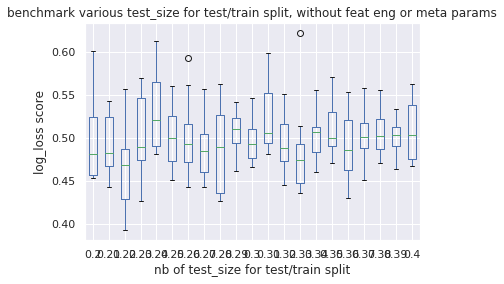


```python
# fancy results

_results = results.describe().T.sort_values(by="50%")
_results

```


<div>
<style scoped>
    .dataframe tbody tr th:only-of-type {
        vertical-align: middle;
    }

    .dataframe tbody tr th {
        vertical-align: top;
    }

    .dataframe thead th {
        text-align: right;
    }
</style>
<table border="1" class="dataframe">
  <thead>
    <tr style="text-align: right;">
      <th></th>
      <th>count</th>
      <th>mean</th>
      <th>std</th>
      <th>min</th>
      <th>25%</th>
      <th>50%</th>
      <th>75%</th>
      <th>max</th>
    </tr>
  </thead>
  <tbody>
    <tr>
      <th>0.22</th>
      <td>10.0</td>
      <td>0.4626</td>
      <td>0.047894</td>
      <td>0.392</td>
      <td>0.42800</td>
      <td>0.4685</td>
      <td>0.48700</td>
      <td>0.557</td>
    </tr>
    <tr>
      <th>0.33</th>
      <td>10.0</td>
      <td>0.4837</td>
      <td>0.054898</td>
      <td>0.436</td>
      <td>0.44675</td>
      <td>0.4735</td>
      <td>0.49275</td>
      <td>0.622</td>
    </tr>
    <tr>
      <th>0.20</th>
      <td>10.0</td>
      <td>0.4966</td>
      <td>0.050293</td>
      <td>0.453</td>
      <td>0.45650</td>
      <td>0.4805</td>
      <td>0.52375</td>
      <td>0.601</td>
    </tr>
    <tr>
      <th>0.21</th>
      <td>10.0</td>
      <td>0.4910</td>
      <td>0.036920</td>
      <td>0.442</td>
      <td>0.46700</td>
      <td>0.4820</td>
      <td>0.52400</td>
      <td>0.542</td>
    </tr>
    <tr>
      <th>0.27</th>
      <td>10.0</td>
      <td>0.4886</td>
      <td>0.035488</td>
      <td>0.443</td>
      <td>0.46025</td>
      <td>0.4845</td>
      <td>0.50425</td>
      <td>0.556</td>
    </tr>
    <tr>
      <th>0.36</th>
      <td>10.0</td>
      <td>0.4900</td>
      <td>0.042955</td>
      <td>0.430</td>
      <td>0.46250</td>
      <td>0.4850</td>
      <td>0.52000</td>
      <td>0.553</td>
    </tr>
    <tr>
      <th>0.32</th>
      <td>10.0</td>
      <td>0.4931</td>
      <td>0.035713</td>
      <td>0.445</td>
      <td>0.47275</td>
      <td>0.4875</td>
      <td>0.51600</td>
      <td>0.551</td>
    </tr>
    <tr>
      <th>0.23</th>
      <td>10.0</td>
      <td>0.5015</td>
      <td>0.047675</td>
      <td>0.426</td>
      <td>0.47375</td>
      <td>0.4890</td>
      <td>0.54600</td>
      <td>0.569</td>
    </tr>
    <tr>
      <th>0.28</th>
      <td>10.0</td>
      <td>0.4863</td>
      <td>0.051470</td>
      <td>0.426</td>
      <td>0.43550</td>
      <td>0.4890</td>
      <td>0.52575</td>
      <td>0.562</td>
    </tr>
    <tr>
      <th>0.30</th>
      <td>10.0</td>
      <td>0.4956</td>
      <td>0.024852</td>
      <td>0.466</td>
      <td>0.47625</td>
      <td>0.4925</td>
      <td>0.51000</td>
      <td>0.546</td>
    </tr>
    <tr>
      <th>0.26</th>
      <td>10.0</td>
      <td>0.5018</td>
      <td>0.046310</td>
      <td>0.442</td>
      <td>0.47175</td>
      <td>0.4925</td>
      <td>0.51550</td>
      <td>0.593</td>
    </tr>
    <tr>
      <th>0.25</th>
      <td>10.0</td>
      <td>0.4988</td>
      <td>0.036030</td>
      <td>0.451</td>
      <td>0.47275</td>
      <td>0.4990</td>
      <td>0.52550</td>
      <td>0.560</td>
    </tr>
    <tr>
      <th>0.35</th>
      <td>10.0</td>
      <td>0.5102</td>
      <td>0.030224</td>
      <td>0.471</td>
      <td>0.49000</td>
      <td>0.4995</td>
      <td>0.52950</td>
      <td>0.571</td>
    </tr>
    <tr>
      <th>0.37</th>
      <td>10.0</td>
      <td>0.5049</td>
      <td>0.030932</td>
      <td>0.451</td>
      <td>0.48800</td>
      <td>0.5010</td>
      <td>0.51750</td>
      <td>0.558</td>
    </tr>
    <tr>
      <th>0.38</th>
      <td>10.0</td>
      <td>0.5059</td>
      <td>0.028742</td>
      <td>0.471</td>
      <td>0.48700</td>
      <td>0.5015</td>
      <td>0.52150</td>
      <td>0.555</td>
    </tr>
    <tr>
      <th>0.39</th>
      <td>10.0</td>
      <td>0.5015</td>
      <td>0.020370</td>
      <td>0.464</td>
      <td>0.49050</td>
      <td>0.5030</td>
      <td>0.51225</td>
      <td>0.533</td>
    </tr>
    <tr>
      <th>0.40</th>
      <td>10.0</td>
      <td>0.5089</td>
      <td>0.035193</td>
      <td>0.467</td>
      <td>0.47525</td>
      <td>0.5030</td>
      <td>0.53775</td>
      <td>0.562</td>
    </tr>
    <tr>
      <th>0.31</th>
      <td>10.0</td>
      <td>0.5221</td>
      <td>0.040687</td>
      <td>0.481</td>
      <td>0.49400</td>
      <td>0.5050</td>
      <td>0.55150</td>
      <td>0.598</td>
    </tr>
    <tr>
      <th>0.34</th>
      <td>10.0</td>
      <td>0.5030</td>
      <td>0.026696</td>
      <td>0.460</td>
      <td>0.48325</td>
      <td>0.5070</td>
      <td>0.51275</td>
      <td>0.555</td>
    </tr>
    <tr>
      <th>0.29</th>
      <td>10.0</td>
      <td>0.5073</td>
      <td>0.023721</td>
      <td>0.461</td>
      <td>0.49425</td>
      <td>0.5095</td>
      <td>0.52300</td>
      <td>0.541</td>
    </tr>
    <tr>
      <th>0.24</th>
      <td>10.0</td>
      <td>0.5321</td>
      <td>0.047132</td>
      <td>0.481</td>
      <td>0.48975</td>
      <td>0.5210</td>
      <td>0.56525</td>
      <td>0.612</td>
    </tr>
  </tbody>
</table>
</div>


```python
# graph 

results.T.iloc[:, :10].plot()
plt.xlabel("nb of test_size for test/train split")
plt.ylabel("log_loss score")
plt.title("benchmark various test_size for test/train split, without feat eng or meta params")
plt.show()

```


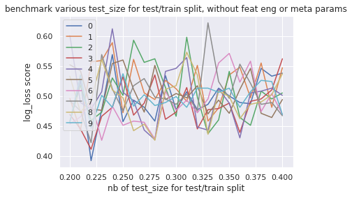


```python
# Conclusion

# After a full study of the different possibilities we have, here are the conclusions:

# - 3 models are very good, LogisticRegression, AdaBoost, and MLP (neural networks).
# - for obvious reasons we will first investigate LogisticRegression model
# - outlier threshold (1.3) and stand-up tranform of the dataset does not really improve our score but allows for more consistent results and can outperform punctually
# - roc_auc and average_precision allow a slightly better score
# - Kfolds number, test / train rate have no impact on our performance

```


```python
#############################################################
#############################################################

# 03-finding_good_models.py

#############################################################
#############################################################


"""
zaoidozdoja
dnzadzddzdaza
dzadda
dzadzadzadzad
dzadzadadza
"""
```


```python
# import

# from starting_ML import *

```


```python

def combine_param_dict(d) : 

    d = OrderedDict(d)
    combinations = it.product(*(d[feat] for feat in d))
    combinations = list(combinations)

    d = [{i:[j,] for i,j in zip(d.keys(), I)} for I in combinations ]

    return d


####

d = {"a" : ["a","b","c"], "b": [0,1,2,3,4]}
d = combine_param_dict(d)
d
```


    [{'a': ['a'], 'b': [0]},
     {'a': ['a'], 'b': [1]},
     {'a': ['a'], 'b': [2]},
     {'a': ['a'], 'b': [3]},
     {'a': ['a'], 'b': [4]},
     {'a': ['b'], 'b': [0]},
     {'a': ['b'], 'b': [1]},
     {'a': ['b'], 'b': [2]},
     {'a': ['b'], 'b': [3]},
     {'a': ['b'], 'b': [4]},
     {'a': ['c'], 'b': [0]},
     {'a': ['c'], 'b': [1]},
     {'a': ['c'], 'b': [2]},
     {'a': ['c'], 'b': [3]},
     {'a': ['c'], 'b': [4]}]


```python
def grid_LogisticRegression(df=None, param=None,
                            model=LogisticRegression) : 

    default_params  = { "penalty":["l2"],
                        "dual":[False],
                        "tol":[0.0001],
                        "C":[1.0],
                        "fit_intercept":[True],
                        "intercept_scaling":[1],
                        "class_weight":[None],
                        "solver":["liblinear"],
                        "max_iter":[100],
                        "multi_class":["ovr"],
                        "warm_start":[False],   }

    all_params      = { "penalty":["l1", "l2"],
                        "dual":[True, False],
                        "tol":[0.0001, 0.001, 0.1, 1],                   # consider also np.logspace(-6, 2, 9)
                        "C":[0.0001, 0.001, 0.01, 0.1, 1, 10, 100],      # consider also np.logspace(-3, 1, 40)
                        "fit_intercept":[True],
                        "intercept_scaling":[1],
                        "class_weight":[None],
                        "solver":["newton-cg", "lbfgs", "liblinear", "sag", "saga"],
                        "max_iter":[100, 1000],   # consider also np.logspace(3, 5, 3)
                        "multi_class":["ovr", "multinomial"],
                        "warm_start":[False, True],   }

    all_params2     = { "penalty":["l1", "l2"],
                        "dual":[True, False],
                        "tol":[0.0001, 0.001, 0.01],            # consider also np.logspace(-6, 2, 9)
                        "C":[0.001, 0.01, 0.1, 1, 10],      # consider also np.logspace(-3, 1, 40)
                        "fit_intercept":[True],
                        "intercept_scaling":[1],
                        "class_weight":[None],
                        "solver":["newton-cg", "lbfgs", "liblinear", "sag", "saga"],
                        "max_iter":[100],                   # consider also np.logspace(3, 5, 3)
                        "multi_class":["ovr", "multinomial"],
                        "warm_start":[True, False],   }

    none_params     = {}

    if not param :  param = none_params
    else  :         param = best_params_2

    # lolo, grid       = run_GSCV(model, param, None)

    # return lolo, grid
```


```python
all_params     =      { "penalty":["l1", "l2"],
                        "dual":[True, False],
                        "tol":[0.0001, 0.001],            # consider also np.logspace(-6, 2, 9)
                        "C":[ 0.01, 0.1, 1, 10],      # consider also np.logspace(-3, 1, 40)
                        "fit_intercept":[True],
                        "intercept_scaling":[1],
                        "class_weight":[None],
                        "solver":["newton-cg", "lbfgs", "liblinear", "sag", "saga"],
                        "max_iter":[100],                   # consider also np.logspace(3, 5, 3)
                        "multi_class":["ovr", "multinomial"],
                        "warm_start":[True, False],   }
```


```python

def _mean(x) : 
    
    if not isinstance(x, Iterable) : 
        raise ValueError("x must be iter")

    return round(float(sum(x) / len(x)), 3)


def _med(x) : 

    x = sorted(x)

    if not (len(x) % 2) : 
        idx     = len(x) /2
        idx_u   = ceil(idx)
        idx_d   = ceil(idx) - 1

        med = _mean([x[idx_u], x[idx_d]])

    else :
        idx = int(len(x)/2)
        med = x[idx]

    return round(med, 3)


def _mix(x) : 

    mea_x = _mean(x)
    med_x = _med(x)

    return _mean([mea_x, med_x]) 


####

ser = pd.Series([1,2,3,4,5,6,7,8, 10, 1000])
print(ser.mean())
print(ser.median())
print(pd.Series([ser.mean(), ser.median()]).mean())

print()

print(_mean(ser))
print(_med(ser))
print(_mix(ser))
```

    104.6
    5.5
    55.05
    
    104.6
    5.5
    55.05


```python

# @timer
def benchmark_various_params(model, params, n=None, df=None, 
                             meth=None, save=True) : 


    if not isinstance(df, pd.DataFrame): 
        df = build_df(DATA, TRAIN_FILE)

    if not n : 
        n = 10

    if      meth == None   : meth = _mix
    elif    meth == "mean" : meth = _mean
    elif    meth == "med"  : meth = _med
    elif    meth == "mix"  : meth = _mix
    else                   : raise ValueError("not good method") 

    if save : 
        txt =   "init file         \n"
        txt +=  "model :   {}      \n".format(model)
        txt +=  "params :  {}      \n".format(params)
        txt +=  "n :       {}      \n".format(n)
        txt +=  "meth :    {}      \n".format(meth)

        with open("benchmark_various_params.csv", "w") as f : f.write(txt)

    columns = list(params.keys())
    columns.append("lolo")

    param_dict = combine_param_dict(params)

    results = list()

    for param in param_dict : 

        info("testing param : " + str(param))

        try : 
            lolos = [run_GSCV(model, param, df)[0] for i in range(n)]
            lolo = round(meth(lolos), 3)
            # grid_param = grid.get_params()

            if save : 
                txt = str(lolo) + "," + str(param) + "\n"
                with open("benchmark_various_params.csv", "a") as f : f.write(txt)

            serie = {i: j[0] for i,j in param.items()}
            serie["lolo"] = lolo

            results.append(pd.Series(serie))

            info("done")

        except Exception as e : 

            info("invalid params")
            info(str(param))
            # info(e)

    results = pd.DataFrame(results, columns =columns )
    results.sort_values(by="lolo", ascending=True, inplace=True)

    return results


####

results = benchmark_various_params(LogisticRegression, all_params, 10, save=True)

```

    wrapper : called
    build_df : 0.01 secs
    wrapper : ended
    Fitting 5 folds for each of 1 candidates, totalling 5 fits
    Fitting 5 folds for each of 1 candidates, totalling 5 fits
    Fitting 5 folds for each of 1 candidates, totalling 5 fits
    Fitting 5 folds for each of 1 candidates, totalling 5 fits
    Fitting 5 folds for each of 1 candidates, totalling 5 fits
    Fitting 5 folds for each of 1 candidates, totalling 5 fits
    Fitting 5 folds for each of 1 candidates, totalling 5 fits
    Fitting 5 folds for each of 1 candidates, totalling 5 fits
    Fitting 5 folds for each of 1 candidates, totalling 5 fits
    Fitting 5 folds for each of 1 candidates, totalling 5 fits
    Fitting 5 folds for each of 1 candidates, totalling 5 fits
    Fitting 5 folds for each of 1 candidates, totalling 5 fits
    Fitting 5 folds for each of 1 candidates, totalling 5 fits
    Fitting 5 folds for each of 1 candidates, totalling 5 fits
    Fitting 5 folds for each of 1 candidates, totalling 5 fits
    Fitting 5 folds for each of 1 candidates, totalling 5 fits
    Fitting 5 folds for each of 1 candidates, totalling 5 fits
    Fitting 5 folds for each of 1 candidates, totalling 5 fits
    Fitting 5 folds for each of 1 candidates, totalling 5 fits
    Fitting 5 folds for each of 1 candidates, totalling 5 fits
    Fitting 5 folds for each of 1 candidates, totalling 5 fits
    Fitting 5 folds for each of 1 candidates, totalling 5 fits
    Fitting 5 folds for each of 1 candidates, totalling 5 fits
    Fitting 5 folds for each of 1 candidates, totalling 5 fits
    Fitting 5 folds for each of 1 candidates, totalling 5 fits
    Fitting 5 folds for each of 1 candidates, totalling 5 fits
    Fitting 5 folds for each of 1 candidates, totalling 5 fits
    Fitting 5 folds for each of 1 candidates, totalling 5 fits
    Fitting 5 folds for each of 1 candidates, totalling 5 fits
    Fitting 5 folds for each of 1 candidates, totalling 5 fits
    Fitting 5 folds for each of 1 candidates, totalling 5 fits
    Fitting 5 folds for each of 1 candidates, totalling 5 fits
    Fitting 5 folds for each of 1 candidates, totalling 5 fits
    Fitting 5 folds for each of 1 candidates, totalling 5 fits
    Fitting 5 folds for each of 1 candidates, totalling 5 fits
    Fitting 5 folds for each of 1 candidates, totalling 5 fits
    Fitting 5 folds for each of 1 candidates, totalling 5 fits
    Fitting 5 folds for each of 1 candidates, totalling 5 fits
    Fitting 5 folds for each of 1 candidates, totalling 5 fits
    Fitting 5 folds for each of 1 candidates, totalling 5 fits
    Fitting 5 folds for each of 1 candidates, totalling 5 fits
    Fitting 5 folds for each of 1 candidates, totalling 5 fits
    Fitting 5 folds for each of 1 candidates, totalling 5 fits
    Fitting 5 folds for each of 1 candidates, totalling 5 fits
    Fitting 5 folds for each of 1 candidates, totalling 5 fits
    Fitting 5 folds for each of 1 candidates, totalling 5 fits
    Fitting 5 folds for each of 1 candidates, totalling 5 fits
    Fitting 5 folds for each of 1 candidates, totalling 5 fits
    Fitting 5 folds for each of 1 candidates, totalling 5 fits
    Fitting 5 folds for each of 1 candidates, totalling 5 fits
    Fitting 5 folds for each of 1 candidates, totalling 5 fits
    Fitting 5 folds for each of 1 candidates, totalling 5 fits
    Fitting 5 folds for each of 1 candidates, totalling 5 fits
    Fitting 5 folds for each of 1 candidates, totalling 5 fits
    Fitting 5 folds for each of 1 candidates, totalling 5 fits
    Fitting 5 folds for each of 1 candidates, totalling 5 fits
    Fitting 5 folds for each of 1 candidates, totalling 5 fits
    Fitting 5 folds for each of 1 candidates, totalling 5 fits
    Fitting 5 folds for each of 1 candidates, totalling 5 fits
    Fitting 5 folds for each of 1 candidates, totalling 5 fits
    Fitting 5 folds for each of 1 candidates, totalling 5 fits
    Fitting 5 folds for each of 1 candidates, totalling 5 fits
    Fitting 5 folds for each of 1 candidates, totalling 5 fits
    Fitting 5 folds for each of 1 candidates, totalling 5 fits
    Fitting 5 folds for each of 1 candidates, totalling 5 fits
    Fitting 5 folds for each of 1 candidates, totalling 5 fits
    Fitting 5 folds for each of 1 candidates, totalling 5 fits
    Fitting 5 folds for each of 1 candidates, totalling 5 fits
    Fitting 5 folds for each of 1 candidates, totalling 5 fits
    Fitting 5 folds for each of 1 candidates, totalling 5 fits
    Fitting 5 folds for each of 1 candidates, totalling 5 fits
    Fitting 5 folds for each of 1 candidates, totalling 5 fits
    Fitting 5 folds for each of 1 candidates, totalling 5 fits
    Fitting 5 folds for each of 1 candidates, totalling 5 fits
    Fitting 5 folds for each of 1 candidates, totalling 5 fits
    Fitting 5 folds for each of 1 candidates, totalling 5 fits
    Fitting 5 folds for each of 1 candidates, totalling 5 fits
    Fitting 5 folds for each of 1 candidates, totalling 5 fits
    Fitting 5 folds for each of 1 candidates, totalling 5 fits
    Fitting 5 folds for each of 1 candidates, totalling 5 fits
    Fitting 5 folds for each of 1 candidates, totalling 5 fits
    Fitting 5 folds for each of 1 candidates, totalling 5 fits
    Fitting 5 folds for each of 1 candidates, totalling 5 fits
    Fitting 5 folds for each of 1 candidates, totalling 5 fits
    Fitting 5 folds for each of 1 candidates, totalling 5 fits
    Fitting 5 folds for each of 1 candidates, totalling 5 fits
    Fitting 5 folds for each of 1 candidates, totalling 5 fits
    Fitting 5 folds for each of 1 candidates, totalling 5 fits
    Fitting 5 folds for each of 1 candidates, totalling 5 fits
    Fitting 5 folds for each of 1 candidates, totalling 5 fits
    Fitting 5 folds for each of 1 candidates, totalling 5 fits
    Fitting 5 folds for each of 1 candidates, totalling 5 fits
    Fitting 5 folds for each of 1 candidates, totalling 5 fits
    Fitting 5 folds for each of 1 candidates, totalling 5 fits
    Fitting 5 folds for each of 1 candidates, totalling 5 fits
    Fitting 5 folds for each of 1 candidates, totalling 5 fits
    Fitting 5 folds for each of 1 candidates, totalling 5 fits
    Fitting 5 folds for each of 1 candidates, totalling 5 fits
    Fitting 5 folds for each of 1 candidates, totalling 5 fits
    Fitting 5 folds for each of 1 candidates, totalling 5 fits
    Fitting 5 folds for each of 1 candidates, totalling 5 fits
    Fitting 5 folds for each of 1 candidates, totalling 5 fits
    Fitting 5 folds for each of 1 candidates, totalling 5 fits
    Fitting 5 folds for each of 1 candidates, totalling 5 fits
    Fitting 5 folds for each of 1 candidates, totalling 5 fits
    Fitting 5 folds for each of 1 candidates, totalling 5 fits
    Fitting 5 folds for each of 1 candidates, totalling 5 fits
    Fitting 5 folds for each of 1 candidates, totalling 5 fits
    Fitting 5 folds for each of 1 candidates, totalling 5 fits
    Fitting 5 folds for each of 1 candidates, totalling 5 fits
    Fitting 5 folds for each of 1 candidates, totalling 5 fits
    Fitting 5 folds for each of 1 candidates, totalling 5 fits
    Fitting 5 folds for each of 1 candidates, totalling 5 fits
    Fitting 5 folds for each of 1 candidates, totalling 5 fits
    Fitting 5 folds for each of 1 candidates, totalling 5 fits
    Fitting 5 folds for each of 1 candidates, totalling 5 fits
    Fitting 5 folds for each of 1 candidates, totalling 5 fits
    Fitting 5 folds for each of 1 candidates, totalling 5 fits
    Fitting 5 folds for each of 1 candidates, totalling 5 fits
    Fitting 5 folds for each of 1 candidates, totalling 5 fits
    Fitting 5 folds for each of 1 candidates, totalling 5 fits
    Fitting 5 folds for each of 1 candidates, totalling 5 fits
    Fitting 5 folds for each of 1 candidates, totalling 5 fits
    Fitting 5 folds for each of 1 candidates, totalling 5 fits
    Fitting 5 folds for each of 1 candidates, totalling 5 fits
    Fitting 5 folds for each of 1 candidates, totalling 5 fits
    Fitting 5 folds for each of 1 candidates, totalling 5 fits
    Fitting 5 folds for each of 1 candidates, totalling 5 fits
    Fitting 5 folds for each of 1 candidates, totalling 5 fits
    Fitting 5 folds for each of 1 candidates, totalling 5 fits
    Fitting 5 folds for each of 1 candidates, totalling 5 fits
    Fitting 5 folds for each of 1 candidates, totalling 5 fits
    Fitting 5 folds for each of 1 candidates, totalling 5 fits
    Fitting 5 folds for each of 1 candidates, totalling 5 fits
    Fitting 5 folds for each of 1 candidates, totalling 5 fits
    Fitting 5 folds for each of 1 candidates, totalling 5 fits
    Fitting 5 folds for each of 1 candidates, totalling 5 fits
    Fitting 5 folds for each of 1 candidates, totalling 5 fits
    Fitting 5 folds for each of 1 candidates, totalling 5 fits
    Fitting 5 folds for each of 1 candidates, totalling 5 fits
    Fitting 5 folds for each of 1 candidates, totalling 5 fits
    Fitting 5 folds for each of 1 candidates, totalling 5 fits
    Fitting 5 folds for each of 1 candidates, totalling 5 fits
    Fitting 5 folds for each of 1 candidates, totalling 5 fits
    Fitting 5 folds for each of 1 candidates, totalling 5 fits
    Fitting 5 folds for each of 1 candidates, totalling 5 fits
    Fitting 5 folds for each of 1 candidates, totalling 5 fits
    Fitting 5 folds for each of 1 candidates, totalling 5 fits
    Fitting 5 folds for each of 1 candidates, totalling 5 fits
    Fitting 5 folds for each of 1 candidates, totalling 5 fits
    Fitting 5 folds for each of 1 candidates, totalling 5 fits
    Fitting 5 folds for each of 1 candidates, totalling 5 fits
    Fitting 5 folds for each of 1 candidates, totalling 5 fits
    Fitting 5 folds for each of 1 candidates, totalling 5 fits
    Fitting 5 folds for each of 1 candidates, totalling 5 fits
    Fitting 5 folds for each of 1 candidates, totalling 5 fits
    Fitting 5 folds for each of 1 candidates, totalling 5 fits
    Fitting 5 folds for each of 1 candidates, totalling 5 fits
    Fitting 5 folds for each of 1 candidates, totalling 5 fits
    Fitting 5 folds for each of 1 candidates, totalling 5 fits
    Fitting 5 folds for each of 1 candidates, totalling 5 fits
    Fitting 5 folds for each of 1 candidates, totalling 5 fits
    Fitting 5 folds for each of 1 candidates, totalling 5 fits
    Fitting 5 folds for each of 1 candidates, totalling 5 fits
    Fitting 5 folds for each of 1 candidates, totalling 5 fits
    Fitting 5 folds for each of 1 candidates, totalling 5 fits
    Fitting 5 folds for each of 1 candidates, totalling 5 fits
    Fitting 5 folds for each of 1 candidates, totalling 5 fits
    Fitting 5 folds for each of 1 candidates, totalling 5 fits
    Fitting 5 folds for each of 1 candidates, totalling 5 fits


    [Parallel(n_jobs=6)]: Done   5 out of   5 | elapsed:    0.0s finished


    Fitting 5 folds for each of 1 candidates, totalling 5 fits


    [Parallel(n_jobs=6)]: Done   5 out of   5 | elapsed:    0.0s finished


    Fitting 5 folds for each of 1 candidates, totalling 5 fits


    [Parallel(n_jobs=6)]: Done   5 out of   5 | elapsed:    0.0s finished


    Fitting 5 folds for each of 1 candidates, totalling 5 fits


    [Parallel(n_jobs=6)]: Done   5 out of   5 | elapsed:    0.0s finished


    Fitting 5 folds for each of 1 candidates, totalling 5 fits


    [Parallel(n_jobs=6)]: Done   5 out of   5 | elapsed:    0.0s finished


    Fitting 5 folds for each of 1 candidates, totalling 5 fits


    [Parallel(n_jobs=6)]: Done   5 out of   5 | elapsed:    0.0s finished


    Fitting 5 folds for each of 1 candidates, totalling 5 fits


    [Parallel(n_jobs=6)]: Done   5 out of   5 | elapsed:    0.0s finished


    Fitting 5 folds for each of 1 candidates, totalling 5 fits


    [Parallel(n_jobs=6)]: Done   5 out of   5 | elapsed:    0.0s finished


    Fitting 5 folds for each of 1 candidates, totalling 5 fits


    [Parallel(n_jobs=6)]: Done   5 out of   5 | elapsed:    0.0s finished


    Fitting 5 folds for each of 1 candidates, totalling 5 fits


    [Parallel(n_jobs=6)]: Done   5 out of   5 | elapsed:    0.0s finished


    Fitting 5 folds for each of 1 candidates, totalling 5 fits


    [Parallel(n_jobs=6)]: Done   5 out of   5 | elapsed:    0.0s finished


    Fitting 5 folds for each of 1 candidates, totalling 5 fits


    [Parallel(n_jobs=6)]: Done   5 out of   5 | elapsed:    0.0s finished


    Fitting 5 folds for each of 1 candidates, totalling 5 fits


    [Parallel(n_jobs=6)]: Done   5 out of   5 | elapsed:    0.0s finished


    Fitting 5 folds for each of 1 candidates, totalling 5 fits


    [Parallel(n_jobs=6)]: Done   5 out of   5 | elapsed:    0.0s finished


    Fitting 5 folds for each of 1 candidates, totalling 5 fits


    [Parallel(n_jobs=6)]: Done   5 out of   5 | elapsed:    0.0s finished


    Fitting 5 folds for each of 1 candidates, totalling 5 fits


    [Parallel(n_jobs=6)]: Done   5 out of   5 | elapsed:    0.0s finished


    Fitting 5 folds for each of 1 candidates, totalling 5 fits


    [Parallel(n_jobs=6)]: Done   5 out of   5 | elapsed:    0.0s finished


    Fitting 5 folds for each of 1 candidates, totalling 5 fits


    [Parallel(n_jobs=6)]: Done   5 out of   5 | elapsed:    0.0s finished


    Fitting 5 folds for each of 1 candidates, totalling 5 fits


    [Parallel(n_jobs=6)]: Done   5 out of   5 | elapsed:    0.0s finished


    Fitting 5 folds for each of 1 candidates, totalling 5 fits


    [Parallel(n_jobs=6)]: Done   5 out of   5 | elapsed:    0.0s finished


    Fitting 5 folds for each of 1 candidates, totalling 5 fits
    Fitting 5 folds for each of 1 candidates, totalling 5 fits
    Fitting 5 folds for each of 1 candidates, totalling 5 fits
    Fitting 5 folds for each of 1 candidates, totalling 5 fits
    Fitting 5 folds for each of 1 candidates, totalling 5 fits
    Fitting 5 folds for each of 1 candidates, totalling 5 fits
    Fitting 5 folds for each of 1 candidates, totalling 5 fits


    [Parallel(n_jobs=6)]: Done   5 out of   5 | elapsed:    0.0s finished


    Fitting 5 folds for each of 1 candidates, totalling 5 fits


    [Parallel(n_jobs=6)]: Done   5 out of   5 | elapsed:    0.0s finished


    Fitting 5 folds for each of 1 candidates, totalling 5 fits


    [Parallel(n_jobs=6)]: Done   5 out of   5 | elapsed:    0.0s finished


    Fitting 5 folds for each of 1 candidates, totalling 5 fits


    [Parallel(n_jobs=6)]: Done   5 out of   5 | elapsed:    0.0s finished


    Fitting 5 folds for each of 1 candidates, totalling 5 fits


    [Parallel(n_jobs=6)]: Done   5 out of   5 | elapsed:    0.0s finished


    Fitting 5 folds for each of 1 candidates, totalling 5 fits


    [Parallel(n_jobs=6)]: Done   5 out of   5 | elapsed:    0.0s finished


    Fitting 5 folds for each of 1 candidates, totalling 5 fits


    [Parallel(n_jobs=6)]: Done   5 out of   5 | elapsed:    0.1s finished


    Fitting 5 folds for each of 1 candidates, totalling 5 fits


    [Parallel(n_jobs=6)]: Done   5 out of   5 | elapsed:    0.1s finished


    Fitting 5 folds for each of 1 candidates, totalling 5 fits


    [Parallel(n_jobs=6)]: Done   5 out of   5 | elapsed:    0.0s finished


    Fitting 5 folds for each of 1 candidates, totalling 5 fits


    [Parallel(n_jobs=6)]: Done   5 out of   5 | elapsed:    0.0s finished


    Fitting 5 folds for each of 1 candidates, totalling 5 fits


    [Parallel(n_jobs=6)]: Done   5 out of   5 | elapsed:    0.0s finished


    Fitting 5 folds for each of 1 candidates, totalling 5 fits


    [Parallel(n_jobs=6)]: Done   5 out of   5 | elapsed:    0.0s finished


    Fitting 5 folds for each of 1 candidates, totalling 5 fits


    [Parallel(n_jobs=6)]: Done   5 out of   5 | elapsed:    0.0s finished


    Fitting 5 folds for each of 1 candidates, totalling 5 fits


    [Parallel(n_jobs=6)]: Done   5 out of   5 | elapsed:    0.1s finished


    Fitting 5 folds for each of 1 candidates, totalling 5 fits


    [Parallel(n_jobs=6)]: Done   5 out of   5 | elapsed:    0.1s finished


    Fitting 5 folds for each of 1 candidates, totalling 5 fits


    [Parallel(n_jobs=6)]: Done   5 out of   5 | elapsed:    0.0s finished


    Fitting 5 folds for each of 1 candidates, totalling 5 fits


    [Parallel(n_jobs=6)]: Done   5 out of   5 | elapsed:    0.0s finished


    Fitting 5 folds for each of 1 candidates, totalling 5 fits


    [Parallel(n_jobs=6)]: Done   5 out of   5 | elapsed:    0.1s finished


    Fitting 5 folds for each of 1 candidates, totalling 5 fits


    [Parallel(n_jobs=6)]: Done   5 out of   5 | elapsed:    0.0s finished


    Fitting 5 folds for each of 1 candidates, totalling 5 fits


    [Parallel(n_jobs=6)]: Done   5 out of   5 | elapsed:    0.0s finished


    Fitting 5 folds for each of 1 candidates, totalling 5 fits


    [Parallel(n_jobs=6)]: Done   5 out of   5 | elapsed:    0.1s finished


    Fitting 5 folds for each of 1 candidates, totalling 5 fits


    [Parallel(n_jobs=6)]: Done   5 out of   5 | elapsed:    0.1s finished


    Fitting 5 folds for each of 1 candidates, totalling 5 fits


    [Parallel(n_jobs=6)]: Done   5 out of   5 | elapsed:    0.1s finished


    Fitting 5 folds for each of 1 candidates, totalling 5 fits


    [Parallel(n_jobs=6)]: Done   5 out of   5 | elapsed:    0.1s finished


    Fitting 5 folds for each of 1 candidates, totalling 5 fits


    [Parallel(n_jobs=6)]: Done   5 out of   5 | elapsed:    0.1s finished


    Fitting 5 folds for each of 1 candidates, totalling 5 fits


    [Parallel(n_jobs=6)]: Done   5 out of   5 | elapsed:    0.1s finished


    Fitting 5 folds for each of 1 candidates, totalling 5 fits


    [Parallel(n_jobs=6)]: Done   5 out of   5 | elapsed:    0.1s finished


    Fitting 5 folds for each of 1 candidates, totalling 5 fits


    [Parallel(n_jobs=6)]: Done   5 out of   5 | elapsed:    0.1s finished


    Fitting 5 folds for each of 1 candidates, totalling 5 fits


    [Parallel(n_jobs=6)]: Done   5 out of   5 | elapsed:    0.1s finished


    Fitting 5 folds for each of 1 candidates, totalling 5 fits


    [Parallel(n_jobs=6)]: Done   5 out of   5 | elapsed:    0.1s finished


    Fitting 5 folds for each of 1 candidates, totalling 5 fits


    [Parallel(n_jobs=6)]: Done   5 out of   5 | elapsed:    0.1s finished


    Fitting 5 folds for each of 1 candidates, totalling 5 fits


    [Parallel(n_jobs=6)]: Done   5 out of   5 | elapsed:    0.1s finished


    Fitting 5 folds for each of 1 candidates, totalling 5 fits


    [Parallel(n_jobs=6)]: Done   5 out of   5 | elapsed:    0.1s finished


    Fitting 5 folds for each of 1 candidates, totalling 5 fits


    [Parallel(n_jobs=6)]: Done   5 out of   5 | elapsed:    0.1s finished


    Fitting 5 folds for each of 1 candidates, totalling 5 fits


    [Parallel(n_jobs=6)]: Done   5 out of   5 | elapsed:    0.1s finished


    Fitting 5 folds for each of 1 candidates, totalling 5 fits


    [Parallel(n_jobs=6)]: Done   5 out of   5 | elapsed:    0.1s finished


    Fitting 5 folds for each of 1 candidates, totalling 5 fits


    [Parallel(n_jobs=6)]: Done   5 out of   5 | elapsed:    0.1s finished


    Fitting 5 folds for each of 1 candidates, totalling 5 fits


    [Parallel(n_jobs=6)]: Done   5 out of   5 | elapsed:    0.1s finished


    Fitting 5 folds for each of 1 candidates, totalling 5 fits


    [Parallel(n_jobs=6)]: Done   5 out of   5 | elapsed:    0.1s finished


    Fitting 5 folds for each of 1 candidates, totalling 5 fits


    [Parallel(n_jobs=6)]: Done   5 out of   5 | elapsed:    0.1s finished


    Fitting 5 folds for each of 1 candidates, totalling 5 fits
    Fitting 5 folds for each of 1 candidates, totalling 5 fits
    Fitting 5 folds for each of 1 candidates, totalling 5 fits
    Fitting 5 folds for each of 1 candidates, totalling 5 fits
    Fitting 5 folds for each of 1 candidates, totalling 5 fits
    Fitting 5 folds for each of 1 candidates, totalling 5 fits
    Fitting 5 folds for each of 1 candidates, totalling 5 fits
    Fitting 5 folds for each of 1 candidates, totalling 5 fits
    Fitting 5 folds for each of 1 candidates, totalling 5 fits


    [Parallel(n_jobs=6)]: Done   5 out of   5 | elapsed:    0.0s finished


    Fitting 5 folds for each of 1 candidates, totalling 5 fits


    [Parallel(n_jobs=6)]: Done   5 out of   5 | elapsed:    0.0s finished


    Fitting 5 folds for each of 1 candidates, totalling 5 fits


    [Parallel(n_jobs=6)]: Done   5 out of   5 | elapsed:    0.0s finished


    Fitting 5 folds for each of 1 candidates, totalling 5 fits


    [Parallel(n_jobs=6)]: Done   5 out of   5 | elapsed:    0.0s finished


    Fitting 5 folds for each of 1 candidates, totalling 5 fits


    [Parallel(n_jobs=6)]: Done   5 out of   5 | elapsed:    0.1s finished


    Fitting 5 folds for each of 1 candidates, totalling 5 fits


    [Parallel(n_jobs=6)]: Done   5 out of   5 | elapsed:    0.0s finished


    Fitting 5 folds for each of 1 candidates, totalling 5 fits


    [Parallel(n_jobs=6)]: Done   5 out of   5 | elapsed:    0.0s finished


    Fitting 5 folds for each of 1 candidates, totalling 5 fits


    [Parallel(n_jobs=6)]: Done   5 out of   5 | elapsed:    0.0s finished


    Fitting 5 folds for each of 1 candidates, totalling 5 fits


    [Parallel(n_jobs=6)]: Done   5 out of   5 | elapsed:    0.0s finished


    Fitting 5 folds for each of 1 candidates, totalling 5 fits


    [Parallel(n_jobs=6)]: Done   5 out of   5 | elapsed:    0.0s finished


    Fitting 5 folds for each of 1 candidates, totalling 5 fits


    [Parallel(n_jobs=6)]: Done   5 out of   5 | elapsed:    0.0s finished


    Fitting 5 folds for each of 1 candidates, totalling 5 fits


    [Parallel(n_jobs=6)]: Done   5 out of   5 | elapsed:    0.0s finished


    Fitting 5 folds for each of 1 candidates, totalling 5 fits


    [Parallel(n_jobs=6)]: Done   5 out of   5 | elapsed:    0.0s finished


    Fitting 5 folds for each of 1 candidates, totalling 5 fits


    [Parallel(n_jobs=6)]: Done   5 out of   5 | elapsed:    0.0s finished


    Fitting 5 folds for each of 1 candidates, totalling 5 fits


    [Parallel(n_jobs=6)]: Done   5 out of   5 | elapsed:    0.0s finished


    Fitting 5 folds for each of 1 candidates, totalling 5 fits


    [Parallel(n_jobs=6)]: Done   5 out of   5 | elapsed:    0.0s finished


    Fitting 5 folds for each of 1 candidates, totalling 5 fits


    [Parallel(n_jobs=6)]: Done   5 out of   5 | elapsed:    0.0s finished


    Fitting 5 folds for each of 1 candidates, totalling 5 fits


    [Parallel(n_jobs=6)]: Done   5 out of   5 | elapsed:    0.0s finished


    Fitting 5 folds for each of 1 candidates, totalling 5 fits


    [Parallel(n_jobs=6)]: Done   5 out of   5 | elapsed:    0.0s finished


    Fitting 5 folds for each of 1 candidates, totalling 5 fits


    [Parallel(n_jobs=6)]: Done   5 out of   5 | elapsed:    0.0s finished


    Fitting 5 folds for each of 1 candidates, totalling 5 fits
    Fitting 5 folds for each of 1 candidates, totalling 5 fits
    Fitting 5 folds for each of 1 candidates, totalling 5 fits
    Fitting 5 folds for each of 1 candidates, totalling 5 fits
    Fitting 5 folds for each of 1 candidates, totalling 5 fits
    Fitting 5 folds for each of 1 candidates, totalling 5 fits
    Fitting 5 folds for each of 1 candidates, totalling 5 fits


    [Parallel(n_jobs=6)]: Done   5 out of   5 | elapsed:    0.1s finished


    Fitting 5 folds for each of 1 candidates, totalling 5 fits


    [Parallel(n_jobs=6)]: Done   5 out of   5 | elapsed:    0.1s finished


    Fitting 5 folds for each of 1 candidates, totalling 5 fits


    [Parallel(n_jobs=6)]: Done   5 out of   5 | elapsed:    0.1s finished


    Fitting 5 folds for each of 1 candidates, totalling 5 fits


    [Parallel(n_jobs=6)]: Done   5 out of   5 | elapsed:    0.1s finished


    Fitting 5 folds for each of 1 candidates, totalling 5 fits


    [Parallel(n_jobs=6)]: Done   5 out of   5 | elapsed:    0.1s finished


    Fitting 5 folds for each of 1 candidates, totalling 5 fits


    [Parallel(n_jobs=6)]: Done   5 out of   5 | elapsed:    0.1s finished


    Fitting 5 folds for each of 1 candidates, totalling 5 fits


    [Parallel(n_jobs=6)]: Done   5 out of   5 | elapsed:    0.1s finished


    Fitting 5 folds for each of 1 candidates, totalling 5 fits


    [Parallel(n_jobs=6)]: Done   5 out of   5 | elapsed:    0.1s finished


    Fitting 5 folds for each of 1 candidates, totalling 5 fits


    [Parallel(n_jobs=6)]: Done   5 out of   5 | elapsed:    0.1s finished


    Fitting 5 folds for each of 1 candidates, totalling 5 fits


    [Parallel(n_jobs=6)]: Done   5 out of   5 | elapsed:    0.1s finished


    Fitting 5 folds for each of 1 candidates, totalling 5 fits


    [Parallel(n_jobs=6)]: Done   5 out of   5 | elapsed:    0.1s finished


    Fitting 5 folds for each of 1 candidates, totalling 5 fits


    [Parallel(n_jobs=6)]: Done   5 out of   5 | elapsed:    0.0s finished


    Fitting 5 folds for each of 1 candidates, totalling 5 fits


    [Parallel(n_jobs=6)]: Done   5 out of   5 | elapsed:    0.0s finished


    Fitting 5 folds for each of 1 candidates, totalling 5 fits


    [Parallel(n_jobs=6)]: Done   5 out of   5 | elapsed:    0.1s finished


    Fitting 5 folds for each of 1 candidates, totalling 5 fits


    [Parallel(n_jobs=6)]: Done   5 out of   5 | elapsed:    0.1s finished


    Fitting 5 folds for each of 1 candidates, totalling 5 fits


    [Parallel(n_jobs=6)]: Done   5 out of   5 | elapsed:    0.1s finished


    Fitting 5 folds for each of 1 candidates, totalling 5 fits


    [Parallel(n_jobs=6)]: Done   5 out of   5 | elapsed:    0.1s finished


    Fitting 5 folds for each of 1 candidates, totalling 5 fits


    [Parallel(n_jobs=6)]: Done   5 out of   5 | elapsed:    0.1s finished


    Fitting 5 folds for each of 1 candidates, totalling 5 fits


    [Parallel(n_jobs=6)]: Done   5 out of   5 | elapsed:    0.1s finished


    Fitting 5 folds for each of 1 candidates, totalling 5 fits


    [Parallel(n_jobs=6)]: Done   5 out of   5 | elapsed:    0.1s finished


    Fitting 5 folds for each of 1 candidates, totalling 5 fits


    [Parallel(n_jobs=6)]: Done   5 out of   5 | elapsed:    0.1s finished


    Fitting 5 folds for each of 1 candidates, totalling 5 fits


    [Parallel(n_jobs=6)]: Done   5 out of   5 | elapsed:    0.1s finished


    Fitting 5 folds for each of 1 candidates, totalling 5 fits


    [Parallel(n_jobs=6)]: Done   5 out of   5 | elapsed:    0.1s finished


    Fitting 5 folds for each of 1 candidates, totalling 5 fits


    [Parallel(n_jobs=6)]: Done   5 out of   5 | elapsed:    0.1s finished


    Fitting 5 folds for each of 1 candidates, totalling 5 fits


    [Parallel(n_jobs=6)]: Done   5 out of   5 | elapsed:    0.1s finished


    Fitting 5 folds for each of 1 candidates, totalling 5 fits


    [Parallel(n_jobs=6)]: Done   5 out of   5 | elapsed:    0.1s finished


    Fitting 5 folds for each of 1 candidates, totalling 5 fits


    [Parallel(n_jobs=6)]: Done   5 out of   5 | elapsed:    0.1s finished


    Fitting 5 folds for each of 1 candidates, totalling 5 fits


    [Parallel(n_jobs=6)]: Done   5 out of   5 | elapsed:    0.1s finished


    Fitting 5 folds for each of 1 candidates, totalling 5 fits


    [Parallel(n_jobs=6)]: Done   5 out of   5 | elapsed:    0.1s finished


    Fitting 5 folds for each of 1 candidates, totalling 5 fits


    [Parallel(n_jobs=6)]: Done   5 out of   5 | elapsed:    0.1s finished


    Fitting 5 folds for each of 1 candidates, totalling 5 fits


    [Parallel(n_jobs=6)]: Done   5 out of   5 | elapsed:    0.1s finished


    Fitting 5 folds for each of 1 candidates, totalling 5 fits


    [Parallel(n_jobs=6)]: Done   5 out of   5 | elapsed:    0.1s finished


    Fitting 5 folds for each of 1 candidates, totalling 5 fits


    [Parallel(n_jobs=6)]: Done   5 out of   5 | elapsed:    0.1s finished


    Fitting 5 folds for each of 1 candidates, totalling 5 fits


    [Parallel(n_jobs=6)]: Done   5 out of   5 | elapsed:    0.1s finished


    Fitting 5 folds for each of 1 candidates, totalling 5 fits


    [Parallel(n_jobs=6)]: Done   5 out of   5 | elapsed:    0.1s finished


    Fitting 5 folds for each of 1 candidates, totalling 5 fits


    [Parallel(n_jobs=6)]: Done   5 out of   5 | elapsed:    0.1s finished


    Fitting 5 folds for each of 1 candidates, totalling 5 fits


    [Parallel(n_jobs=6)]: Done   5 out of   5 | elapsed:    0.1s finished


    Fitting 5 folds for each of 1 candidates, totalling 5 fits


    [Parallel(n_jobs=6)]: Done   5 out of   5 | elapsed:    0.1s finished


    Fitting 5 folds for each of 1 candidates, totalling 5 fits


    [Parallel(n_jobs=6)]: Done   5 out of   5 | elapsed:    0.1s finished


    Fitting 5 folds for each of 1 candidates, totalling 5 fits


    [Parallel(n_jobs=6)]: Done   5 out of   5 | elapsed:    0.1s finished


    Fitting 5 folds for each of 1 candidates, totalling 5 fits
    Fitting 5 folds for each of 1 candidates, totalling 5 fits
    Fitting 5 folds for each of 1 candidates, totalling 5 fits
    Fitting 5 folds for each of 1 candidates, totalling 5 fits
    Fitting 5 folds for each of 1 candidates, totalling 5 fits
    Fitting 5 folds for each of 1 candidates, totalling 5 fits
    Fitting 5 folds for each of 1 candidates, totalling 5 fits
    Fitting 5 folds for each of 1 candidates, totalling 5 fits
    Fitting 5 folds for each of 1 candidates, totalling 5 fits


    [Parallel(n_jobs=6)]: Done   5 out of   5 | elapsed:    0.0s finished


    Fitting 5 folds for each of 1 candidates, totalling 5 fits


    [Parallel(n_jobs=6)]: Done   5 out of   5 | elapsed:    0.0s finished


    Fitting 5 folds for each of 1 candidates, totalling 5 fits


    [Parallel(n_jobs=6)]: Done   5 out of   5 | elapsed:    0.0s finished


    Fitting 5 folds for each of 1 candidates, totalling 5 fits


    [Parallel(n_jobs=6)]: Done   5 out of   5 | elapsed:    0.0s finished


    Fitting 5 folds for each of 1 candidates, totalling 5 fits


    [Parallel(n_jobs=6)]: Done   5 out of   5 | elapsed:    0.0s finished


    Fitting 5 folds for each of 1 candidates, totalling 5 fits


    [Parallel(n_jobs=6)]: Done   5 out of   5 | elapsed:    0.0s finished


    Fitting 5 folds for each of 1 candidates, totalling 5 fits


    [Parallel(n_jobs=6)]: Done   5 out of   5 | elapsed:    0.0s finished


    Fitting 5 folds for each of 1 candidates, totalling 5 fits


    [Parallel(n_jobs=6)]: Done   5 out of   5 | elapsed:    0.0s finished


    Fitting 5 folds for each of 1 candidates, totalling 5 fits


    [Parallel(n_jobs=6)]: Done   5 out of   5 | elapsed:    0.0s finished


    Fitting 5 folds for each of 1 candidates, totalling 5 fits


    [Parallel(n_jobs=6)]: Done   5 out of   5 | elapsed:    0.0s finished


    Fitting 5 folds for each of 1 candidates, totalling 5 fits


    [Parallel(n_jobs=6)]: Done   5 out of   5 | elapsed:    0.0s finished


    Fitting 5 folds for each of 1 candidates, totalling 5 fits


    [Parallel(n_jobs=6)]: Done   5 out of   5 | elapsed:    0.0s finished


    Fitting 5 folds for each of 1 candidates, totalling 5 fits


    [Parallel(n_jobs=6)]: Done   5 out of   5 | elapsed:    0.0s finished


    Fitting 5 folds for each of 1 candidates, totalling 5 fits


    [Parallel(n_jobs=6)]: Done   5 out of   5 | elapsed:    0.0s finished


    Fitting 5 folds for each of 1 candidates, totalling 5 fits


    [Parallel(n_jobs=6)]: Done   5 out of   5 | elapsed:    0.0s finished


    Fitting 5 folds for each of 1 candidates, totalling 5 fits


    [Parallel(n_jobs=6)]: Done   5 out of   5 | elapsed:    0.0s finished


    Fitting 5 folds for each of 1 candidates, totalling 5 fits


    [Parallel(n_jobs=6)]: Done   5 out of   5 | elapsed:    0.0s finished


    Fitting 5 folds for each of 1 candidates, totalling 5 fits


    [Parallel(n_jobs=6)]: Done   5 out of   5 | elapsed:    0.0s finished


    Fitting 5 folds for each of 1 candidates, totalling 5 fits


    [Parallel(n_jobs=6)]: Done   5 out of   5 | elapsed:    0.0s finished


    Fitting 5 folds for each of 1 candidates, totalling 5 fits


    [Parallel(n_jobs=6)]: Done   5 out of   5 | elapsed:    0.0s finished


    Fitting 5 folds for each of 1 candidates, totalling 5 fits
    Fitting 5 folds for each of 1 candidates, totalling 5 fits
    Fitting 5 folds for each of 1 candidates, totalling 5 fits
    Fitting 5 folds for each of 1 candidates, totalling 5 fits
    Fitting 5 folds for each of 1 candidates, totalling 5 fits
    Fitting 5 folds for each of 1 candidates, totalling 5 fits
    Fitting 5 folds for each of 1 candidates, totalling 5 fits


    [Parallel(n_jobs=6)]: Done   5 out of   5 | elapsed:    0.0s finished


    Fitting 5 folds for each of 1 candidates, totalling 5 fits


    [Parallel(n_jobs=6)]: Done   5 out of   5 | elapsed:    0.0s finished


    Fitting 5 folds for each of 1 candidates, totalling 5 fits


    [Parallel(n_jobs=6)]: Done   5 out of   5 | elapsed:    0.1s finished


    Fitting 5 folds for each of 1 candidates, totalling 5 fits


    [Parallel(n_jobs=6)]: Done   5 out of   5 | elapsed:    0.1s finished


    Fitting 5 folds for each of 1 candidates, totalling 5 fits


    [Parallel(n_jobs=6)]: Done   5 out of   5 | elapsed:    0.1s finished


    Fitting 5 folds for each of 1 candidates, totalling 5 fits


    [Parallel(n_jobs=6)]: Done   5 out of   5 | elapsed:    0.1s finished


    Fitting 5 folds for each of 1 candidates, totalling 5 fits


    [Parallel(n_jobs=6)]: Done   5 out of   5 | elapsed:    0.1s finished


    Fitting 5 folds for each of 1 candidates, totalling 5 fits


    [Parallel(n_jobs=6)]: Done   5 out of   5 | elapsed:    0.1s finished


    Fitting 5 folds for each of 1 candidates, totalling 5 fits


    [Parallel(n_jobs=6)]: Done   5 out of   5 | elapsed:    0.1s finished


    Fitting 5 folds for each of 1 candidates, totalling 5 fits


    [Parallel(n_jobs=6)]: Done   5 out of   5 | elapsed:    0.1s finished


    Fitting 5 folds for each of 1 candidates, totalling 5 fits


    [Parallel(n_jobs=6)]: Done   5 out of   5 | elapsed:    0.0s finished


    Fitting 5 folds for each of 1 candidates, totalling 5 fits


    [Parallel(n_jobs=6)]: Done   5 out of   5 | elapsed:    0.1s finished


    Fitting 5 folds for each of 1 candidates, totalling 5 fits


    [Parallel(n_jobs=6)]: Done   5 out of   5 | elapsed:    0.1s finished


    Fitting 5 folds for each of 1 candidates, totalling 5 fits


    [Parallel(n_jobs=6)]: Done   5 out of   5 | elapsed:    0.1s finished


    Fitting 5 folds for each of 1 candidates, totalling 5 fits


    [Parallel(n_jobs=6)]: Done   5 out of   5 | elapsed:    0.1s finished


    Fitting 5 folds for each of 1 candidates, totalling 5 fits


    [Parallel(n_jobs=6)]: Done   5 out of   5 | elapsed:    0.1s finished


    Fitting 5 folds for each of 1 candidates, totalling 5 fits


    [Parallel(n_jobs=6)]: Done   5 out of   5 | elapsed:    0.1s finished


    Fitting 5 folds for each of 1 candidates, totalling 5 fits


    [Parallel(n_jobs=6)]: Done   5 out of   5 | elapsed:    0.1s finished


    Fitting 5 folds for each of 1 candidates, totalling 5 fits


    [Parallel(n_jobs=6)]: Done   5 out of   5 | elapsed:    0.1s finished


    Fitting 5 folds for each of 1 candidates, totalling 5 fits


    [Parallel(n_jobs=6)]: Done   5 out of   5 | elapsed:    0.1s finished


    Fitting 5 folds for each of 1 candidates, totalling 5 fits


    [Parallel(n_jobs=6)]: Done   5 out of   5 | elapsed:    0.1s finished


    Fitting 5 folds for each of 1 candidates, totalling 5 fits


    [Parallel(n_jobs=6)]: Done   5 out of   5 | elapsed:    0.1s finished


    Fitting 5 folds for each of 1 candidates, totalling 5 fits


    [Parallel(n_jobs=6)]: Done   5 out of   5 | elapsed:    0.1s finished


    Fitting 5 folds for each of 1 candidates, totalling 5 fits


    [Parallel(n_jobs=6)]: Done   5 out of   5 | elapsed:    0.1s finished


    Fitting 5 folds for each of 1 candidates, totalling 5 fits


    [Parallel(n_jobs=6)]: Done   5 out of   5 | elapsed:    0.1s finished


    Fitting 5 folds for each of 1 candidates, totalling 5 fits


    [Parallel(n_jobs=6)]: Done   5 out of   5 | elapsed:    0.1s finished


    Fitting 5 folds for each of 1 candidates, totalling 5 fits


    [Parallel(n_jobs=6)]: Done   5 out of   5 | elapsed:    0.1s finished


    Fitting 5 folds for each of 1 candidates, totalling 5 fits


    [Parallel(n_jobs=6)]: Done   5 out of   5 | elapsed:    0.1s finished


    Fitting 5 folds for each of 1 candidates, totalling 5 fits


    [Parallel(n_jobs=6)]: Done   5 out of   5 | elapsed:    0.1s finished


    Fitting 5 folds for each of 1 candidates, totalling 5 fits


    [Parallel(n_jobs=6)]: Done   5 out of   5 | elapsed:    0.1s finished


    Fitting 5 folds for each of 1 candidates, totalling 5 fits


    [Parallel(n_jobs=6)]: Done   5 out of   5 | elapsed:    0.1s finished


    Fitting 5 folds for each of 1 candidates, totalling 5 fits


    [Parallel(n_jobs=6)]: Done   5 out of   5 | elapsed:    0.1s finished


    Fitting 5 folds for each of 1 candidates, totalling 5 fits


    [Parallel(n_jobs=6)]: Done   5 out of   5 | elapsed:    0.1s finished


    Fitting 5 folds for each of 1 candidates, totalling 5 fits


    [Parallel(n_jobs=6)]: Done   5 out of   5 | elapsed:    0.1s finished


    Fitting 5 folds for each of 1 candidates, totalling 5 fits


    [Parallel(n_jobs=6)]: Done   5 out of   5 | elapsed:    0.1s finished


    Fitting 5 folds for each of 1 candidates, totalling 5 fits


    [Parallel(n_jobs=6)]: Done   5 out of   5 | elapsed:    0.1s finished


    Fitting 5 folds for each of 1 candidates, totalling 5 fits


    [Parallel(n_jobs=6)]: Done   5 out of   5 | elapsed:    0.1s finished


    Fitting 5 folds for each of 1 candidates, totalling 5 fits


    [Parallel(n_jobs=6)]: Done   5 out of   5 | elapsed:    0.1s finished


    Fitting 5 folds for each of 1 candidates, totalling 5 fits


    [Parallel(n_jobs=6)]: Done   5 out of   5 | elapsed:    0.1s finished


    Fitting 5 folds for each of 1 candidates, totalling 5 fits


    [Parallel(n_jobs=6)]: Done   5 out of   5 | elapsed:    0.1s finished


    Fitting 5 folds for each of 1 candidates, totalling 5 fits
    Fitting 5 folds for each of 1 candidates, totalling 5 fits
    Fitting 5 folds for each of 1 candidates, totalling 5 fits
    Fitting 5 folds for each of 1 candidates, totalling 5 fits
    Fitting 5 folds for each of 1 candidates, totalling 5 fits
    Fitting 5 folds for each of 1 candidates, totalling 5 fits
    Fitting 5 folds for each of 1 candidates, totalling 5 fits
    Fitting 5 folds for each of 1 candidates, totalling 5 fits
    Fitting 5 folds for each of 1 candidates, totalling 5 fits


    [Parallel(n_jobs=6)]: Done   5 out of   5 | elapsed:    0.0s finished


    Fitting 5 folds for each of 1 candidates, totalling 5 fits


    [Parallel(n_jobs=6)]: Done   5 out of   5 | elapsed:    0.0s finished


    Fitting 5 folds for each of 1 candidates, totalling 5 fits


    [Parallel(n_jobs=6)]: Done   5 out of   5 | elapsed:    0.0s finished


    Fitting 5 folds for each of 1 candidates, totalling 5 fits


    [Parallel(n_jobs=6)]: Done   5 out of   5 | elapsed:    0.0s finished


    Fitting 5 folds for each of 1 candidates, totalling 5 fits


    [Parallel(n_jobs=6)]: Done   5 out of   5 | elapsed:    0.0s finished


    Fitting 5 folds for each of 1 candidates, totalling 5 fits


    [Parallel(n_jobs=6)]: Done   5 out of   5 | elapsed:    0.0s finished


    Fitting 5 folds for each of 1 candidates, totalling 5 fits


    [Parallel(n_jobs=6)]: Done   5 out of   5 | elapsed:    0.0s finished


    Fitting 5 folds for each of 1 candidates, totalling 5 fits


    [Parallel(n_jobs=6)]: Done   5 out of   5 | elapsed:    0.0s finished


    Fitting 5 folds for each of 1 candidates, totalling 5 fits


    [Parallel(n_jobs=6)]: Done   5 out of   5 | elapsed:    0.0s finished


    Fitting 5 folds for each of 1 candidates, totalling 5 fits


    [Parallel(n_jobs=6)]: Done   5 out of   5 | elapsed:    0.0s finished


    Fitting 5 folds for each of 1 candidates, totalling 5 fits


    [Parallel(n_jobs=6)]: Done   5 out of   5 | elapsed:    0.0s finished


    Fitting 5 folds for each of 1 candidates, totalling 5 fits


    [Parallel(n_jobs=6)]: Done   5 out of   5 | elapsed:    0.0s finished


    Fitting 5 folds for each of 1 candidates, totalling 5 fits


    [Parallel(n_jobs=6)]: Done   5 out of   5 | elapsed:    0.0s finished


    Fitting 5 folds for each of 1 candidates, totalling 5 fits


    [Parallel(n_jobs=6)]: Done   5 out of   5 | elapsed:    0.0s finished


    Fitting 5 folds for each of 1 candidates, totalling 5 fits


    [Parallel(n_jobs=6)]: Done   5 out of   5 | elapsed:    0.0s finished


    Fitting 5 folds for each of 1 candidates, totalling 5 fits


    [Parallel(n_jobs=6)]: Done   5 out of   5 | elapsed:    0.0s finished


    Fitting 5 folds for each of 1 candidates, totalling 5 fits


    [Parallel(n_jobs=6)]: Done   5 out of   5 | elapsed:    0.0s finished


    Fitting 5 folds for each of 1 candidates, totalling 5 fits


    [Parallel(n_jobs=6)]: Done   5 out of   5 | elapsed:    0.0s finished


    Fitting 5 folds for each of 1 candidates, totalling 5 fits


    [Parallel(n_jobs=6)]: Done   5 out of   5 | elapsed:    0.0s finished


    Fitting 5 folds for each of 1 candidates, totalling 5 fits


    [Parallel(n_jobs=6)]: Done   5 out of   5 | elapsed:    0.0s finished


    Fitting 5 folds for each of 1 candidates, totalling 5 fits
    Fitting 5 folds for each of 1 candidates, totalling 5 fits
    Fitting 5 folds for each of 1 candidates, totalling 5 fits
    Fitting 5 folds for each of 1 candidates, totalling 5 fits
    Fitting 5 folds for each of 1 candidates, totalling 5 fits
    Fitting 5 folds for each of 1 candidates, totalling 5 fits
    Fitting 5 folds for each of 1 candidates, totalling 5 fits


    [Parallel(n_jobs=6)]: Done   5 out of   5 | elapsed:    0.1s finished


    Fitting 5 folds for each of 1 candidates, totalling 5 fits


    [Parallel(n_jobs=6)]: Done   5 out of   5 | elapsed:    0.0s finished


    Fitting 5 folds for each of 1 candidates, totalling 5 fits


    [Parallel(n_jobs=6)]: Done   5 out of   5 | elapsed:    0.1s finished


    Fitting 5 folds for each of 1 candidates, totalling 5 fits


    [Parallel(n_jobs=6)]: Done   5 out of   5 | elapsed:    0.1s finished


    Fitting 5 folds for each of 1 candidates, totalling 5 fits


    [Parallel(n_jobs=6)]: Done   5 out of   5 | elapsed:    0.1s finished


    Fitting 5 folds for each of 1 candidates, totalling 5 fits


    [Parallel(n_jobs=6)]: Done   5 out of   5 | elapsed:    0.1s finished


    Fitting 5 folds for each of 1 candidates, totalling 5 fits


    [Parallel(n_jobs=6)]: Done   5 out of   5 | elapsed:    0.1s finished


    Fitting 5 folds for each of 1 candidates, totalling 5 fits


    [Parallel(n_jobs=6)]: Done   5 out of   5 | elapsed:    0.1s finished


    Fitting 5 folds for each of 1 candidates, totalling 5 fits


    [Parallel(n_jobs=6)]: Done   5 out of   5 | elapsed:    0.1s finished


    Fitting 5 folds for each of 1 candidates, totalling 5 fits


    [Parallel(n_jobs=6)]: Done   5 out of   5 | elapsed:    0.1s finished


    Fitting 5 folds for each of 1 candidates, totalling 5 fits


    [Parallel(n_jobs=6)]: Done   5 out of   5 | elapsed:    0.1s finished


    Fitting 5 folds for each of 1 candidates, totalling 5 fits


    [Parallel(n_jobs=6)]: Done   5 out of   5 | elapsed:    0.1s finished


    Fitting 5 folds for each of 1 candidates, totalling 5 fits


    [Parallel(n_jobs=6)]: Done   5 out of   5 | elapsed:    0.1s finished


    Fitting 5 folds for each of 1 candidates, totalling 5 fits


    [Parallel(n_jobs=6)]: Done   5 out of   5 | elapsed:    0.1s finished


    Fitting 5 folds for each of 1 candidates, totalling 5 fits


    [Parallel(n_jobs=6)]: Done   5 out of   5 | elapsed:    0.1s finished


    Fitting 5 folds for each of 1 candidates, totalling 5 fits


    [Parallel(n_jobs=6)]: Done   5 out of   5 | elapsed:    0.1s finished


    Fitting 5 folds for each of 1 candidates, totalling 5 fits


    [Parallel(n_jobs=6)]: Done   5 out of   5 | elapsed:    0.1s finished


    Fitting 5 folds for each of 1 candidates, totalling 5 fits


    [Parallel(n_jobs=6)]: Done   5 out of   5 | elapsed:    0.1s finished


    Fitting 5 folds for each of 1 candidates, totalling 5 fits


    [Parallel(n_jobs=6)]: Done   5 out of   5 | elapsed:    0.1s finished


    Fitting 5 folds for each of 1 candidates, totalling 5 fits


    [Parallel(n_jobs=6)]: Done   5 out of   5 | elapsed:    0.1s finished


    Fitting 5 folds for each of 1 candidates, totalling 5 fits


    [Parallel(n_jobs=6)]: Done   5 out of   5 | elapsed:    0.1s finished


    Fitting 5 folds for each of 1 candidates, totalling 5 fits


    [Parallel(n_jobs=6)]: Done   5 out of   5 | elapsed:    0.1s finished


    Fitting 5 folds for each of 1 candidates, totalling 5 fits


    [Parallel(n_jobs=6)]: Done   5 out of   5 | elapsed:    0.1s finished


    Fitting 5 folds for each of 1 candidates, totalling 5 fits


    [Parallel(n_jobs=6)]: Done   5 out of   5 | elapsed:    0.1s finished


    Fitting 5 folds for each of 1 candidates, totalling 5 fits


    [Parallel(n_jobs=6)]: Done   5 out of   5 | elapsed:    0.1s finished


    Fitting 5 folds for each of 1 candidates, totalling 5 fits


    [Parallel(n_jobs=6)]: Done   5 out of   5 | elapsed:    0.1s finished


    Fitting 5 folds for each of 1 candidates, totalling 5 fits


    [Parallel(n_jobs=6)]: Done   5 out of   5 | elapsed:    0.1s finished


    Fitting 5 folds for each of 1 candidates, totalling 5 fits


    [Parallel(n_jobs=6)]: Done   5 out of   5 | elapsed:    0.1s finished


    Fitting 5 folds for each of 1 candidates, totalling 5 fits


    [Parallel(n_jobs=6)]: Done   5 out of   5 | elapsed:    0.1s finished


    Fitting 5 folds for each of 1 candidates, totalling 5 fits


    [Parallel(n_jobs=6)]: Done   5 out of   5 | elapsed:    0.1s finished


    Fitting 5 folds for each of 1 candidates, totalling 5 fits


    [Parallel(n_jobs=6)]: Done   5 out of   5 | elapsed:    0.1s finished


    Fitting 5 folds for each of 1 candidates, totalling 5 fits


    [Parallel(n_jobs=6)]: Done   5 out of   5 | elapsed:    0.1s finished


    Fitting 5 folds for each of 1 candidates, totalling 5 fits


    [Parallel(n_jobs=6)]: Done   5 out of   5 | elapsed:    0.1s finished


    Fitting 5 folds for each of 1 candidates, totalling 5 fits


    [Parallel(n_jobs=6)]: Done   5 out of   5 | elapsed:    0.1s finished


    Fitting 5 folds for each of 1 candidates, totalling 5 fits


    [Parallel(n_jobs=6)]: Done   5 out of   5 | elapsed:    0.1s finished


    Fitting 5 folds for each of 1 candidates, totalling 5 fits


    [Parallel(n_jobs=6)]: Done   5 out of   5 | elapsed:    0.1s finished


    Fitting 5 folds for each of 1 candidates, totalling 5 fits


    [Parallel(n_jobs=6)]: Done   5 out of   5 | elapsed:    0.1s finished


    Fitting 5 folds for each of 1 candidates, totalling 5 fits


    [Parallel(n_jobs=6)]: Done   5 out of   5 | elapsed:    0.1s finished


    Fitting 5 folds for each of 1 candidates, totalling 5 fits


    [Parallel(n_jobs=6)]: Done   5 out of   5 | elapsed:    0.1s finished


    Fitting 5 folds for each of 1 candidates, totalling 5 fits


    [Parallel(n_jobs=6)]: Done   5 out of   5 | elapsed:    0.1s finished


    Fitting 5 folds for each of 1 candidates, totalling 5 fits
    Fitting 5 folds for each of 1 candidates, totalling 5 fits
    Fitting 5 folds for each of 1 candidates, totalling 5 fits
    Fitting 5 folds for each of 1 candidates, totalling 5 fits
    Fitting 5 folds for each of 1 candidates, totalling 5 fits
    Fitting 5 folds for each of 1 candidates, totalling 5 fits
    Fitting 5 folds for each of 1 candidates, totalling 5 fits
    Fitting 5 folds for each of 1 candidates, totalling 5 fits
    Fitting 5 folds for each of 1 candidates, totalling 5 fits


    [Parallel(n_jobs=6)]: Done   5 out of   5 | elapsed:    0.0s finished


    Fitting 5 folds for each of 1 candidates, totalling 5 fits


    [Parallel(n_jobs=6)]: Done   5 out of   5 | elapsed:    0.0s finished


    Fitting 5 folds for each of 1 candidates, totalling 5 fits


    [Parallel(n_jobs=6)]: Done   5 out of   5 | elapsed:    0.0s finished


    Fitting 5 folds for each of 1 candidates, totalling 5 fits


    [Parallel(n_jobs=6)]: Done   5 out of   5 | elapsed:    0.0s finished


    Fitting 5 folds for each of 1 candidates, totalling 5 fits


    [Parallel(n_jobs=6)]: Done   5 out of   5 | elapsed:    0.0s finished


    Fitting 5 folds for each of 1 candidates, totalling 5 fits


    [Parallel(n_jobs=6)]: Done   5 out of   5 | elapsed:    0.0s finished


    Fitting 5 folds for each of 1 candidates, totalling 5 fits


    [Parallel(n_jobs=6)]: Done   5 out of   5 | elapsed:    0.0s finished


    Fitting 5 folds for each of 1 candidates, totalling 5 fits


    [Parallel(n_jobs=6)]: Done   5 out of   5 | elapsed:    0.0s finished


    Fitting 5 folds for each of 1 candidates, totalling 5 fits


    [Parallel(n_jobs=6)]: Done   5 out of   5 | elapsed:    0.0s finished


    Fitting 5 folds for each of 1 candidates, totalling 5 fits


    [Parallel(n_jobs=6)]: Done   5 out of   5 | elapsed:    0.0s finished


    Fitting 5 folds for each of 1 candidates, totalling 5 fits


    [Parallel(n_jobs=6)]: Done   5 out of   5 | elapsed:    0.0s finished


    Fitting 5 folds for each of 1 candidates, totalling 5 fits


    [Parallel(n_jobs=6)]: Done   5 out of   5 | elapsed:    0.0s finished


    Fitting 5 folds for each of 1 candidates, totalling 5 fits


    [Parallel(n_jobs=6)]: Done   5 out of   5 | elapsed:    0.0s finished


    Fitting 5 folds for each of 1 candidates, totalling 5 fits


    [Parallel(n_jobs=6)]: Done   5 out of   5 | elapsed:    0.0s finished


    Fitting 5 folds for each of 1 candidates, totalling 5 fits


    [Parallel(n_jobs=6)]: Done   5 out of   5 | elapsed:    0.0s finished


    Fitting 5 folds for each of 1 candidates, totalling 5 fits


    [Parallel(n_jobs=6)]: Done   5 out of   5 | elapsed:    0.0s finished


    Fitting 5 folds for each of 1 candidates, totalling 5 fits


    [Parallel(n_jobs=6)]: Done   5 out of   5 | elapsed:    0.0s finished


    Fitting 5 folds for each of 1 candidates, totalling 5 fits


    [Parallel(n_jobs=6)]: Done   5 out of   5 | elapsed:    0.0s finished


    Fitting 5 folds for each of 1 candidates, totalling 5 fits


    [Parallel(n_jobs=6)]: Done   5 out of   5 | elapsed:    0.0s finished


    Fitting 5 folds for each of 1 candidates, totalling 5 fits


    [Parallel(n_jobs=6)]: Done   5 out of   5 | elapsed:    0.0s finished


    Fitting 5 folds for each of 1 candidates, totalling 5 fits
    Fitting 5 folds for each of 1 candidates, totalling 5 fits
    Fitting 5 folds for each of 1 candidates, totalling 5 fits
    Fitting 5 folds for each of 1 candidates, totalling 5 fits
    Fitting 5 folds for each of 1 candidates, totalling 5 fits
    Fitting 5 folds for each of 1 candidates, totalling 5 fits
    Fitting 5 folds for each of 1 candidates, totalling 5 fits


    [Parallel(n_jobs=6)]: Done   5 out of   5 | elapsed:    0.0s finished


    Fitting 5 folds for each of 1 candidates, totalling 5 fits


    [Parallel(n_jobs=6)]: Done   5 out of   5 | elapsed:    0.0s finished


    Fitting 5 folds for each of 1 candidates, totalling 5 fits


    [Parallel(n_jobs=6)]: Done   5 out of   5 | elapsed:    0.1s finished


    Fitting 5 folds for each of 1 candidates, totalling 5 fits


    [Parallel(n_jobs=6)]: Done   5 out of   5 | elapsed:    0.0s finished


    Fitting 5 folds for each of 1 candidates, totalling 5 fits


    [Parallel(n_jobs=6)]: Done   5 out of   5 | elapsed:    0.0s finished


    Fitting 5 folds for each of 1 candidates, totalling 5 fits


    [Parallel(n_jobs=6)]: Done   5 out of   5 | elapsed:    0.0s finished


    Fitting 5 folds for each of 1 candidates, totalling 5 fits


    [Parallel(n_jobs=6)]: Done   5 out of   5 | elapsed:    0.0s finished


    Fitting 5 folds for each of 1 candidates, totalling 5 fits


    [Parallel(n_jobs=6)]: Done   5 out of   5 | elapsed:    0.0s finished


    Fitting 5 folds for each of 1 candidates, totalling 5 fits


    [Parallel(n_jobs=6)]: Done   5 out of   5 | elapsed:    0.0s finished


    Fitting 5 folds for each of 1 candidates, totalling 5 fits


    [Parallel(n_jobs=6)]: Done   5 out of   5 | elapsed:    0.0s finished


    Fitting 5 folds for each of 1 candidates, totalling 5 fits


    [Parallel(n_jobs=6)]: Done   5 out of   5 | elapsed:    0.0s finished


    Fitting 5 folds for each of 1 candidates, totalling 5 fits


    [Parallel(n_jobs=6)]: Done   5 out of   5 | elapsed:    0.0s finished


    Fitting 5 folds for each of 1 candidates, totalling 5 fits


    [Parallel(n_jobs=6)]: Done   5 out of   5 | elapsed:    0.0s finished


    Fitting 5 folds for each of 1 candidates, totalling 5 fits


    [Parallel(n_jobs=6)]: Done   5 out of   5 | elapsed:    0.0s finished


    Fitting 5 folds for each of 1 candidates, totalling 5 fits


    [Parallel(n_jobs=6)]: Done   5 out of   5 | elapsed:    0.0s finished


    Fitting 5 folds for each of 1 candidates, totalling 5 fits


    [Parallel(n_jobs=6)]: Done   5 out of   5 | elapsed:    0.0s finished


    Fitting 5 folds for each of 1 candidates, totalling 5 fits


    [Parallel(n_jobs=6)]: Done   5 out of   5 | elapsed:    0.0s finished


    Fitting 5 folds for each of 1 candidates, totalling 5 fits


    [Parallel(n_jobs=6)]: Done   5 out of   5 | elapsed:    0.0s finished


    Fitting 5 folds for each of 1 candidates, totalling 5 fits


    [Parallel(n_jobs=6)]: Done   5 out of   5 | elapsed:    0.0s finished


    Fitting 5 folds for each of 1 candidates, totalling 5 fits


    [Parallel(n_jobs=6)]: Done   5 out of   5 | elapsed:    0.0s finished


    Fitting 5 folds for each of 1 candidates, totalling 5 fits


    [Parallel(n_jobs=6)]: Done   5 out of   5 | elapsed:    0.1s finished


    Fitting 5 folds for each of 1 candidates, totalling 5 fits


    [Parallel(n_jobs=6)]: Done   5 out of   5 | elapsed:    0.0s finished


    Fitting 5 folds for each of 1 candidates, totalling 5 fits


    [Parallel(n_jobs=6)]: Done   5 out of   5 | elapsed:    0.0s finished


    Fitting 5 folds for each of 1 candidates, totalling 5 fits


    [Parallel(n_jobs=6)]: Done   5 out of   5 | elapsed:    0.1s finished


    Fitting 5 folds for each of 1 candidates, totalling 5 fits


    [Parallel(n_jobs=6)]: Done   5 out of   5 | elapsed:    0.1s finished


    Fitting 5 folds for each of 1 candidates, totalling 5 fits


    [Parallel(n_jobs=6)]: Done   5 out of   5 | elapsed:    0.0s finished


    Fitting 5 folds for each of 1 candidates, totalling 5 fits


    [Parallel(n_jobs=6)]: Done   5 out of   5 | elapsed:    0.0s finished


    Fitting 5 folds for each of 1 candidates, totalling 5 fits


    [Parallel(n_jobs=6)]: Done   5 out of   5 | elapsed:    0.1s finished


    Fitting 5 folds for each of 1 candidates, totalling 5 fits


    [Parallel(n_jobs=6)]: Done   5 out of   5 | elapsed:    0.1s finished


    Fitting 5 folds for each of 1 candidates, totalling 5 fits


    [Parallel(n_jobs=6)]: Done   5 out of   5 | elapsed:    0.1s finished


    Fitting 5 folds for each of 1 candidates, totalling 5 fits


    [Parallel(n_jobs=6)]: Done   5 out of   5 | elapsed:    0.1s finished


    Fitting 5 folds for each of 1 candidates, totalling 5 fits


    [Parallel(n_jobs=6)]: Done   5 out of   5 | elapsed:    0.1s finished


    Fitting 5 folds for each of 1 candidates, totalling 5 fits


    [Parallel(n_jobs=6)]: Done   5 out of   5 | elapsed:    0.1s finished


    Fitting 5 folds for each of 1 candidates, totalling 5 fits


    [Parallel(n_jobs=6)]: Done   5 out of   5 | elapsed:    0.1s finished


    Fitting 5 folds for each of 1 candidates, totalling 5 fits


    [Parallel(n_jobs=6)]: Done   5 out of   5 | elapsed:    0.1s finished


    Fitting 5 folds for each of 1 candidates, totalling 5 fits


    [Parallel(n_jobs=6)]: Done   5 out of   5 | elapsed:    0.1s finished


    Fitting 5 folds for each of 1 candidates, totalling 5 fits


    [Parallel(n_jobs=6)]: Done   5 out of   5 | elapsed:    0.1s finished


    Fitting 5 folds for each of 1 candidates, totalling 5 fits


    [Parallel(n_jobs=6)]: Done   5 out of   5 | elapsed:    0.1s finished


    Fitting 5 folds for each of 1 candidates, totalling 5 fits


    [Parallel(n_jobs=6)]: Done   5 out of   5 | elapsed:    0.1s finished


    Fitting 5 folds for each of 1 candidates, totalling 5 fits


    [Parallel(n_jobs=6)]: Done   5 out of   5 | elapsed:    0.1s finished


    Fitting 5 folds for each of 1 candidates, totalling 5 fits
    Fitting 5 folds for each of 1 candidates, totalling 5 fits
    Fitting 5 folds for each of 1 candidates, totalling 5 fits
    Fitting 5 folds for each of 1 candidates, totalling 5 fits
    Fitting 5 folds for each of 1 candidates, totalling 5 fits
    Fitting 5 folds for each of 1 candidates, totalling 5 fits
    Fitting 5 folds for each of 1 candidates, totalling 5 fits
    Fitting 5 folds for each of 1 candidates, totalling 5 fits
    Fitting 5 folds for each of 1 candidates, totalling 5 fits


    [Parallel(n_jobs=6)]: Done   5 out of   5 | elapsed:    0.0s finished


    Fitting 5 folds for each of 1 candidates, totalling 5 fits


    [Parallel(n_jobs=6)]: Done   5 out of   5 | elapsed:    0.0s finished


    Fitting 5 folds for each of 1 candidates, totalling 5 fits


    [Parallel(n_jobs=6)]: Done   5 out of   5 | elapsed:    0.0s finished


    Fitting 5 folds for each of 1 candidates, totalling 5 fits


    [Parallel(n_jobs=6)]: Done   5 out of   5 | elapsed:    0.0s finished


    Fitting 5 folds for each of 1 candidates, totalling 5 fits


    [Parallel(n_jobs=6)]: Done   5 out of   5 | elapsed:    0.0s finished


    Fitting 5 folds for each of 1 candidates, totalling 5 fits


    [Parallel(n_jobs=6)]: Done   5 out of   5 | elapsed:    0.0s finished


    Fitting 5 folds for each of 1 candidates, totalling 5 fits


    [Parallel(n_jobs=6)]: Done   5 out of   5 | elapsed:    0.0s finished


    Fitting 5 folds for each of 1 candidates, totalling 5 fits


    [Parallel(n_jobs=6)]: Done   5 out of   5 | elapsed:    0.0s finished


    Fitting 5 folds for each of 1 candidates, totalling 5 fits


    [Parallel(n_jobs=6)]: Done   5 out of   5 | elapsed:    0.0s finished


    Fitting 5 folds for each of 1 candidates, totalling 5 fits


    [Parallel(n_jobs=6)]: Done   5 out of   5 | elapsed:    0.0s finished


    Fitting 5 folds for each of 1 candidates, totalling 5 fits


    [Parallel(n_jobs=6)]: Done   5 out of   5 | elapsed:    0.0s finished


    Fitting 5 folds for each of 1 candidates, totalling 5 fits


    [Parallel(n_jobs=6)]: Done   5 out of   5 | elapsed:    0.0s finished


    Fitting 5 folds for each of 1 candidates, totalling 5 fits


    [Parallel(n_jobs=6)]: Done   5 out of   5 | elapsed:    0.0s finished


    Fitting 5 folds for each of 1 candidates, totalling 5 fits


    [Parallel(n_jobs=6)]: Done   5 out of   5 | elapsed:    0.0s finished


    Fitting 5 folds for each of 1 candidates, totalling 5 fits


    [Parallel(n_jobs=6)]: Done   5 out of   5 | elapsed:    0.0s finished


    Fitting 5 folds for each of 1 candidates, totalling 5 fits


    [Parallel(n_jobs=6)]: Done   5 out of   5 | elapsed:    0.0s finished


    Fitting 5 folds for each of 1 candidates, totalling 5 fits


    [Parallel(n_jobs=6)]: Done   5 out of   5 | elapsed:    0.0s finished


    Fitting 5 folds for each of 1 candidates, totalling 5 fits


    [Parallel(n_jobs=6)]: Done   5 out of   5 | elapsed:    0.0s finished


    Fitting 5 folds for each of 1 candidates, totalling 5 fits


    [Parallel(n_jobs=6)]: Done   5 out of   5 | elapsed:    0.0s finished


    Fitting 5 folds for each of 1 candidates, totalling 5 fits


    [Parallel(n_jobs=6)]: Done   5 out of   5 | elapsed:    0.0s finished


    Fitting 5 folds for each of 1 candidates, totalling 5 fits
    Fitting 5 folds for each of 1 candidates, totalling 5 fits
    Fitting 5 folds for each of 1 candidates, totalling 5 fits
    Fitting 5 folds for each of 1 candidates, totalling 5 fits
    Fitting 5 folds for each of 1 candidates, totalling 5 fits
    Fitting 5 folds for each of 1 candidates, totalling 5 fits
    Fitting 5 folds for each of 1 candidates, totalling 5 fits


    [Parallel(n_jobs=6)]: Done   5 out of   5 | elapsed:    0.0s finished


    Fitting 5 folds for each of 1 candidates, totalling 5 fits


    [Parallel(n_jobs=6)]: Done   5 out of   5 | elapsed:    0.0s finished


    Fitting 5 folds for each of 1 candidates, totalling 5 fits


    [Parallel(n_jobs=6)]: Done   5 out of   5 | elapsed:    0.0s finished


    Fitting 5 folds for each of 1 candidates, totalling 5 fits


    [Parallel(n_jobs=6)]: Done   5 out of   5 | elapsed:    0.0s finished


    Fitting 5 folds for each of 1 candidates, totalling 5 fits


    [Parallel(n_jobs=6)]: Done   5 out of   5 | elapsed:    0.0s finished


    Fitting 5 folds for each of 1 candidates, totalling 5 fits


    [Parallel(n_jobs=6)]: Done   5 out of   5 | elapsed:    0.0s finished


    Fitting 5 folds for each of 1 candidates, totalling 5 fits


    [Parallel(n_jobs=6)]: Done   5 out of   5 | elapsed:    0.0s finished


    Fitting 5 folds for each of 1 candidates, totalling 5 fits


    [Parallel(n_jobs=6)]: Done   5 out of   5 | elapsed:    0.0s finished


    Fitting 5 folds for each of 1 candidates, totalling 5 fits


    [Parallel(n_jobs=6)]: Done   5 out of   5 | elapsed:    0.0s finished


    Fitting 5 folds for each of 1 candidates, totalling 5 fits


    [Parallel(n_jobs=6)]: Done   5 out of   5 | elapsed:    0.0s finished


    Fitting 5 folds for each of 1 candidates, totalling 5 fits


    [Parallel(n_jobs=6)]: Done   5 out of   5 | elapsed:    0.0s finished


    Fitting 5 folds for each of 1 candidates, totalling 5 fits


    [Parallel(n_jobs=6)]: Done   5 out of   5 | elapsed:    0.0s finished


    Fitting 5 folds for each of 1 candidates, totalling 5 fits


    [Parallel(n_jobs=6)]: Done   5 out of   5 | elapsed:    0.0s finished


    Fitting 5 folds for each of 1 candidates, totalling 5 fits


    [Parallel(n_jobs=6)]: Done   5 out of   5 | elapsed:    0.0s finished


    Fitting 5 folds for each of 1 candidates, totalling 5 fits


    [Parallel(n_jobs=6)]: Done   5 out of   5 | elapsed:    0.0s finished


    Fitting 5 folds for each of 1 candidates, totalling 5 fits


    [Parallel(n_jobs=6)]: Done   5 out of   5 | elapsed:    0.0s finished


    Fitting 5 folds for each of 1 candidates, totalling 5 fits


    [Parallel(n_jobs=6)]: Done   5 out of   5 | elapsed:    0.0s finished


    Fitting 5 folds for each of 1 candidates, totalling 5 fits


    [Parallel(n_jobs=6)]: Done   5 out of   5 | elapsed:    0.0s finished


    Fitting 5 folds for each of 1 candidates, totalling 5 fits


    [Parallel(n_jobs=6)]: Done   5 out of   5 | elapsed:    0.0s finished


    Fitting 5 folds for each of 1 candidates, totalling 5 fits


    [Parallel(n_jobs=6)]: Done   5 out of   5 | elapsed:    0.0s finished


    Fitting 5 folds for each of 1 candidates, totalling 5 fits


    [Parallel(n_jobs=6)]: Done   5 out of   5 | elapsed:    0.0s finished


    Fitting 5 folds for each of 1 candidates, totalling 5 fits


    [Parallel(n_jobs=6)]: Done   5 out of   5 | elapsed:    0.0s finished


    Fitting 5 folds for each of 1 candidates, totalling 5 fits


    [Parallel(n_jobs=6)]: Done   5 out of   5 | elapsed:    0.0s finished


    Fitting 5 folds for each of 1 candidates, totalling 5 fits


    [Parallel(n_jobs=6)]: Done   5 out of   5 | elapsed:    0.1s finished


    Fitting 5 folds for each of 1 candidates, totalling 5 fits


    [Parallel(n_jobs=6)]: Done   5 out of   5 | elapsed:    0.0s finished


    Fitting 5 folds for each of 1 candidates, totalling 5 fits


    [Parallel(n_jobs=6)]: Done   5 out of   5 | elapsed:    0.0s finished


    Fitting 5 folds for each of 1 candidates, totalling 5 fits


    [Parallel(n_jobs=6)]: Done   5 out of   5 | elapsed:    0.1s finished


    Fitting 5 folds for each of 1 candidates, totalling 5 fits


    [Parallel(n_jobs=6)]: Done   5 out of   5 | elapsed:    0.0s finished


    Fitting 5 folds for each of 1 candidates, totalling 5 fits


    [Parallel(n_jobs=6)]: Done   5 out of   5 | elapsed:    0.0s finished


    Fitting 5 folds for each of 1 candidates, totalling 5 fits


    [Parallel(n_jobs=6)]: Done   5 out of   5 | elapsed:    0.0s finished


    Fitting 5 folds for each of 1 candidates, totalling 5 fits


    [Parallel(n_jobs=6)]: Done   5 out of   5 | elapsed:    0.1s finished


    Fitting 5 folds for each of 1 candidates, totalling 5 fits


    [Parallel(n_jobs=6)]: Done   5 out of   5 | elapsed:    0.0s finished


    Fitting 5 folds for each of 1 candidates, totalling 5 fits


    [Parallel(n_jobs=6)]: Done   5 out of   5 | elapsed:    0.0s finished


    Fitting 5 folds for each of 1 candidates, totalling 5 fits


    [Parallel(n_jobs=6)]: Done   5 out of   5 | elapsed:    0.0s finished


    Fitting 5 folds for each of 1 candidates, totalling 5 fits


    [Parallel(n_jobs=6)]: Done   5 out of   5 | elapsed:    0.0s finished


    Fitting 5 folds for each of 1 candidates, totalling 5 fits


    [Parallel(n_jobs=6)]: Done   5 out of   5 | elapsed:    0.0s finished


    Fitting 5 folds for each of 1 candidates, totalling 5 fits


    [Parallel(n_jobs=6)]: Done   5 out of   5 | elapsed:    0.1s finished


    Fitting 5 folds for each of 1 candidates, totalling 5 fits


    [Parallel(n_jobs=6)]: Done   5 out of   5 | elapsed:    0.1s finished


    Fitting 5 folds for each of 1 candidates, totalling 5 fits


    [Parallel(n_jobs=6)]: Done   5 out of   5 | elapsed:    0.0s finished


    Fitting 5 folds for each of 1 candidates, totalling 5 fits


    [Parallel(n_jobs=6)]: Done   5 out of   5 | elapsed:    0.0s finished


    Fitting 5 folds for each of 1 candidates, totalling 5 fits
    Fitting 5 folds for each of 1 candidates, totalling 5 fits
    Fitting 5 folds for each of 1 candidates, totalling 5 fits
    Fitting 5 folds for each of 1 candidates, totalling 5 fits
    Fitting 5 folds for each of 1 candidates, totalling 5 fits
    Fitting 5 folds for each of 1 candidates, totalling 5 fits
    Fitting 5 folds for each of 1 candidates, totalling 5 fits
    Fitting 5 folds for each of 1 candidates, totalling 5 fits
    Fitting 5 folds for each of 1 candidates, totalling 5 fits


    [Parallel(n_jobs=6)]: Done   5 out of   5 | elapsed:    0.0s finished


    Fitting 5 folds for each of 1 candidates, totalling 5 fits


    [Parallel(n_jobs=6)]: Done   5 out of   5 | elapsed:    0.0s finished


    Fitting 5 folds for each of 1 candidates, totalling 5 fits


    [Parallel(n_jobs=6)]: Done   5 out of   5 | elapsed:    0.0s finished


    Fitting 5 folds for each of 1 candidates, totalling 5 fits


    [Parallel(n_jobs=6)]: Done   5 out of   5 | elapsed:    0.0s finished


    Fitting 5 folds for each of 1 candidates, totalling 5 fits


    [Parallel(n_jobs=6)]: Done   5 out of   5 | elapsed:    0.0s finished


    Fitting 5 folds for each of 1 candidates, totalling 5 fits


    [Parallel(n_jobs=6)]: Done   5 out of   5 | elapsed:    0.0s finished


    Fitting 5 folds for each of 1 candidates, totalling 5 fits


    [Parallel(n_jobs=6)]: Done   5 out of   5 | elapsed:    0.0s finished


    Fitting 5 folds for each of 1 candidates, totalling 5 fits


    [Parallel(n_jobs=6)]: Done   5 out of   5 | elapsed:    0.0s finished


    Fitting 5 folds for each of 1 candidates, totalling 5 fits


    [Parallel(n_jobs=6)]: Done   5 out of   5 | elapsed:    0.0s finished


    Fitting 5 folds for each of 1 candidates, totalling 5 fits


    [Parallel(n_jobs=6)]: Done   5 out of   5 | elapsed:    0.0s finished


    Fitting 5 folds for each of 1 candidates, totalling 5 fits


    [Parallel(n_jobs=6)]: Done   5 out of   5 | elapsed:    0.1s finished


    Fitting 5 folds for each of 1 candidates, totalling 5 fits


    [Parallel(n_jobs=6)]: Done   5 out of   5 | elapsed:    0.0s finished


    Fitting 5 folds for each of 1 candidates, totalling 5 fits


    [Parallel(n_jobs=6)]: Done   5 out of   5 | elapsed:    0.0s finished


    Fitting 5 folds for each of 1 candidates, totalling 5 fits


    [Parallel(n_jobs=6)]: Done   5 out of   5 | elapsed:    0.0s finished


    Fitting 5 folds for each of 1 candidates, totalling 5 fits


    [Parallel(n_jobs=6)]: Done   5 out of   5 | elapsed:    0.0s finished


    Fitting 5 folds for each of 1 candidates, totalling 5 fits


    [Parallel(n_jobs=6)]: Done   5 out of   5 | elapsed:    0.0s finished


    Fitting 5 folds for each of 1 candidates, totalling 5 fits


    [Parallel(n_jobs=6)]: Done   5 out of   5 | elapsed:    0.0s finished


    Fitting 5 folds for each of 1 candidates, totalling 5 fits


    [Parallel(n_jobs=6)]: Done   5 out of   5 | elapsed:    0.0s finished


    Fitting 5 folds for each of 1 candidates, totalling 5 fits


    [Parallel(n_jobs=6)]: Done   5 out of   5 | elapsed:    0.0s finished


    Fitting 5 folds for each of 1 candidates, totalling 5 fits


    [Parallel(n_jobs=6)]: Done   5 out of   5 | elapsed:    0.0s finished


    Fitting 5 folds for each of 1 candidates, totalling 5 fits
    Fitting 5 folds for each of 1 candidates, totalling 5 fits
    Fitting 5 folds for each of 1 candidates, totalling 5 fits
    Fitting 5 folds for each of 1 candidates, totalling 5 fits
    Fitting 5 folds for each of 1 candidates, totalling 5 fits
    Fitting 5 folds for each of 1 candidates, totalling 5 fits
    Fitting 5 folds for each of 1 candidates, totalling 5 fits


    [Parallel(n_jobs=6)]: Done   5 out of   5 | elapsed:    0.0s finished


    Fitting 5 folds for each of 1 candidates, totalling 5 fits


    [Parallel(n_jobs=6)]: Done   5 out of   5 | elapsed:    0.0s finished


    Fitting 5 folds for each of 1 candidates, totalling 5 fits


    [Parallel(n_jobs=6)]: Done   5 out of   5 | elapsed:    0.0s finished


    Fitting 5 folds for each of 1 candidates, totalling 5 fits


    [Parallel(n_jobs=6)]: Done   5 out of   5 | elapsed:    0.0s finished


    Fitting 5 folds for each of 1 candidates, totalling 5 fits


    [Parallel(n_jobs=6)]: Done   5 out of   5 | elapsed:    0.0s finished


    Fitting 5 folds for each of 1 candidates, totalling 5 fits


    [Parallel(n_jobs=6)]: Done   5 out of   5 | elapsed:    0.0s finished


    Fitting 5 folds for each of 1 candidates, totalling 5 fits


    [Parallel(n_jobs=6)]: Done   5 out of   5 | elapsed:    0.0s finished


    Fitting 5 folds for each of 1 candidates, totalling 5 fits


    [Parallel(n_jobs=6)]: Done   5 out of   5 | elapsed:    0.0s finished


    Fitting 5 folds for each of 1 candidates, totalling 5 fits


    [Parallel(n_jobs=6)]: Done   5 out of   5 | elapsed:    0.0s finished


    Fitting 5 folds for each of 1 candidates, totalling 5 fits


    [Parallel(n_jobs=6)]: Done   5 out of   5 | elapsed:    0.0s finished


    Fitting 5 folds for each of 1 candidates, totalling 5 fits


    [Parallel(n_jobs=6)]: Done   5 out of   5 | elapsed:    0.0s finished


    Fitting 5 folds for each of 1 candidates, totalling 5 fits


    [Parallel(n_jobs=6)]: Done   5 out of   5 | elapsed:    0.0s finished


    Fitting 5 folds for each of 1 candidates, totalling 5 fits


    [Parallel(n_jobs=6)]: Done   5 out of   5 | elapsed:    0.0s finished


    Fitting 5 folds for each of 1 candidates, totalling 5 fits


    [Parallel(n_jobs=6)]: Done   5 out of   5 | elapsed:    0.0s finished


    Fitting 5 folds for each of 1 candidates, totalling 5 fits


    [Parallel(n_jobs=6)]: Done   5 out of   5 | elapsed:    0.0s finished


    Fitting 5 folds for each of 1 candidates, totalling 5 fits


    [Parallel(n_jobs=6)]: Done   5 out of   5 | elapsed:    0.0s finished


    Fitting 5 folds for each of 1 candidates, totalling 5 fits


    [Parallel(n_jobs=6)]: Done   5 out of   5 | elapsed:    0.0s finished


    Fitting 5 folds for each of 1 candidates, totalling 5 fits


    [Parallel(n_jobs=6)]: Done   5 out of   5 | elapsed:    0.0s finished


    Fitting 5 folds for each of 1 candidates, totalling 5 fits


    [Parallel(n_jobs=6)]: Done   5 out of   5 | elapsed:    0.0s finished


    Fitting 5 folds for each of 1 candidates, totalling 5 fits


    [Parallel(n_jobs=6)]: Done   5 out of   5 | elapsed:    0.0s finished


    Fitting 5 folds for each of 1 candidates, totalling 5 fits


    [Parallel(n_jobs=6)]: Done   5 out of   5 | elapsed:    0.1s finished


    Fitting 5 folds for each of 1 candidates, totalling 5 fits


    [Parallel(n_jobs=6)]: Done   5 out of   5 | elapsed:    0.1s finished


    Fitting 5 folds for each of 1 candidates, totalling 5 fits


    [Parallel(n_jobs=6)]: Done   5 out of   5 | elapsed:    0.0s finished


    Fitting 5 folds for each of 1 candidates, totalling 5 fits


    [Parallel(n_jobs=6)]: Done   5 out of   5 | elapsed:    0.0s finished


    Fitting 5 folds for each of 1 candidates, totalling 5 fits


    [Parallel(n_jobs=6)]: Done   5 out of   5 | elapsed:    0.0s finished


    Fitting 5 folds for each of 1 candidates, totalling 5 fits


    [Parallel(n_jobs=6)]: Done   5 out of   5 | elapsed:    0.0s finished


    Fitting 5 folds for each of 1 candidates, totalling 5 fits


    [Parallel(n_jobs=6)]: Done   5 out of   5 | elapsed:    0.0s finished


    Fitting 5 folds for each of 1 candidates, totalling 5 fits


    [Parallel(n_jobs=6)]: Done   5 out of   5 | elapsed:    0.0s finished


    Fitting 5 folds for each of 1 candidates, totalling 5 fits


    [Parallel(n_jobs=6)]: Done   5 out of   5 | elapsed:    0.0s finished


    Fitting 5 folds for each of 1 candidates, totalling 5 fits


    [Parallel(n_jobs=6)]: Done   5 out of   5 | elapsed:    0.0s finished


    Fitting 5 folds for each of 1 candidates, totalling 5 fits


    [Parallel(n_jobs=6)]: Done   5 out of   5 | elapsed:    0.1s finished


    Fitting 5 folds for each of 1 candidates, totalling 5 fits


    [Parallel(n_jobs=6)]: Done   5 out of   5 | elapsed:    0.0s finished


    Fitting 5 folds for each of 1 candidates, totalling 5 fits


    [Parallel(n_jobs=6)]: Done   5 out of   5 | elapsed:    0.0s finished


    Fitting 5 folds for each of 1 candidates, totalling 5 fits


    [Parallel(n_jobs=6)]: Done   5 out of   5 | elapsed:    0.1s finished


    Fitting 5 folds for each of 1 candidates, totalling 5 fits


    [Parallel(n_jobs=6)]: Done   5 out of   5 | elapsed:    0.0s finished


    Fitting 5 folds for each of 1 candidates, totalling 5 fits


    [Parallel(n_jobs=6)]: Done   5 out of   5 | elapsed:    0.1s finished


    Fitting 5 folds for each of 1 candidates, totalling 5 fits


    [Parallel(n_jobs=6)]: Done   5 out of   5 | elapsed:    0.0s finished


    Fitting 5 folds for each of 1 candidates, totalling 5 fits


    [Parallel(n_jobs=6)]: Done   5 out of   5 | elapsed:    0.0s finished


    Fitting 5 folds for each of 1 candidates, totalling 5 fits


    [Parallel(n_jobs=6)]: Done   5 out of   5 | elapsed:    0.0s finished


    Fitting 5 folds for each of 1 candidates, totalling 5 fits


    [Parallel(n_jobs=6)]: Done   5 out of   5 | elapsed:    0.0s finished


    Fitting 5 folds for each of 1 candidates, totalling 5 fits
    Fitting 5 folds for each of 1 candidates, totalling 5 fits
    Fitting 5 folds for each of 1 candidates, totalling 5 fits
    Fitting 5 folds for each of 1 candidates, totalling 5 fits
    Fitting 5 folds for each of 1 candidates, totalling 5 fits
    Fitting 5 folds for each of 1 candidates, totalling 5 fits
    Fitting 5 folds for each of 1 candidates, totalling 5 fits
    Fitting 5 folds for each of 1 candidates, totalling 5 fits
    Fitting 5 folds for each of 1 candidates, totalling 5 fits


    [Parallel(n_jobs=6)]: Done   5 out of   5 | elapsed:    0.0s finished


    Fitting 5 folds for each of 1 candidates, totalling 5 fits


    [Parallel(n_jobs=6)]: Done   5 out of   5 | elapsed:    0.0s finished


    Fitting 5 folds for each of 1 candidates, totalling 5 fits


    [Parallel(n_jobs=6)]: Done   5 out of   5 | elapsed:    0.0s finished


    Fitting 5 folds for each of 1 candidates, totalling 5 fits


    [Parallel(n_jobs=6)]: Done   5 out of   5 | elapsed:    0.0s finished


    Fitting 5 folds for each of 1 candidates, totalling 5 fits


    [Parallel(n_jobs=6)]: Done   5 out of   5 | elapsed:    0.0s finished


    Fitting 5 folds for each of 1 candidates, totalling 5 fits


    [Parallel(n_jobs=6)]: Done   5 out of   5 | elapsed:    0.0s finished


    Fitting 5 folds for each of 1 candidates, totalling 5 fits


    [Parallel(n_jobs=6)]: Done   5 out of   5 | elapsed:    0.0s finished


    Fitting 5 folds for each of 1 candidates, totalling 5 fits


    [Parallel(n_jobs=6)]: Done   5 out of   5 | elapsed:    0.0s finished


    Fitting 5 folds for each of 1 candidates, totalling 5 fits


    [Parallel(n_jobs=6)]: Done   5 out of   5 | elapsed:    0.0s finished


    Fitting 5 folds for each of 1 candidates, totalling 5 fits


    [Parallel(n_jobs=6)]: Done   5 out of   5 | elapsed:    0.0s finished


    Fitting 5 folds for each of 1 candidates, totalling 5 fits


    [Parallel(n_jobs=6)]: Done   5 out of   5 | elapsed:    0.0s finished


    Fitting 5 folds for each of 1 candidates, totalling 5 fits


    [Parallel(n_jobs=6)]: Done   5 out of   5 | elapsed:    0.0s finished


    Fitting 5 folds for each of 1 candidates, totalling 5 fits


    [Parallel(n_jobs=6)]: Done   5 out of   5 | elapsed:    0.0s finished


    Fitting 5 folds for each of 1 candidates, totalling 5 fits


    [Parallel(n_jobs=6)]: Done   5 out of   5 | elapsed:    0.0s finished


    Fitting 5 folds for each of 1 candidates, totalling 5 fits


    [Parallel(n_jobs=6)]: Done   5 out of   5 | elapsed:    0.0s finished


    Fitting 5 folds for each of 1 candidates, totalling 5 fits


    [Parallel(n_jobs=6)]: Done   5 out of   5 | elapsed:    0.0s finished


    Fitting 5 folds for each of 1 candidates, totalling 5 fits


    [Parallel(n_jobs=6)]: Done   5 out of   5 | elapsed:    0.0s finished


    Fitting 5 folds for each of 1 candidates, totalling 5 fits


    [Parallel(n_jobs=6)]: Done   5 out of   5 | elapsed:    0.0s finished


    Fitting 5 folds for each of 1 candidates, totalling 5 fits


    [Parallel(n_jobs=6)]: Done   5 out of   5 | elapsed:    0.0s finished


    Fitting 5 folds for each of 1 candidates, totalling 5 fits


    [Parallel(n_jobs=6)]: Done   5 out of   5 | elapsed:    0.0s finished


    Fitting 5 folds for each of 1 candidates, totalling 5 fits
    Fitting 5 folds for each of 1 candidates, totalling 5 fits
    Fitting 5 folds for each of 1 candidates, totalling 5 fits
    Fitting 5 folds for each of 1 candidates, totalling 5 fits
    Fitting 5 folds for each of 1 candidates, totalling 5 fits
    Fitting 5 folds for each of 1 candidates, totalling 5 fits
    Fitting 5 folds for each of 1 candidates, totalling 5 fits


    [Parallel(n_jobs=6)]: Done   5 out of   5 | elapsed:    0.0s finished


    Fitting 5 folds for each of 1 candidates, totalling 5 fits


    [Parallel(n_jobs=6)]: Done   5 out of   5 | elapsed:    0.0s finished


    Fitting 5 folds for each of 1 candidates, totalling 5 fits


    [Parallel(n_jobs=6)]: Done   5 out of   5 | elapsed:    0.0s finished


    Fitting 5 folds for each of 1 candidates, totalling 5 fits


    [Parallel(n_jobs=6)]: Done   5 out of   5 | elapsed:    0.0s finished


    Fitting 5 folds for each of 1 candidates, totalling 5 fits


    [Parallel(n_jobs=6)]: Done   5 out of   5 | elapsed:    0.0s finished


    Fitting 5 folds for each of 1 candidates, totalling 5 fits


    [Parallel(n_jobs=6)]: Done   5 out of   5 | elapsed:    0.0s finished


    Fitting 5 folds for each of 1 candidates, totalling 5 fits


    [Parallel(n_jobs=6)]: Done   5 out of   5 | elapsed:    0.0s finished


    Fitting 5 folds for each of 1 candidates, totalling 5 fits


    [Parallel(n_jobs=6)]: Done   5 out of   5 | elapsed:    0.0s finished


    Fitting 5 folds for each of 1 candidates, totalling 5 fits


    [Parallel(n_jobs=6)]: Done   5 out of   5 | elapsed:    0.0s finished


    Fitting 5 folds for each of 1 candidates, totalling 5 fits


    [Parallel(n_jobs=6)]: Done   5 out of   5 | elapsed:    0.0s finished


    Fitting 5 folds for each of 1 candidates, totalling 5 fits


    [Parallel(n_jobs=6)]: Done   5 out of   5 | elapsed:    0.0s finished


    Fitting 5 folds for each of 1 candidates, totalling 5 fits


    [Parallel(n_jobs=6)]: Done   5 out of   5 | elapsed:    0.0s finished


    Fitting 5 folds for each of 1 candidates, totalling 5 fits


    [Parallel(n_jobs=6)]: Done   5 out of   5 | elapsed:    0.0s finished


    Fitting 5 folds for each of 1 candidates, totalling 5 fits


    [Parallel(n_jobs=6)]: Done   5 out of   5 | elapsed:    0.0s finished


    Fitting 5 folds for each of 1 candidates, totalling 5 fits


    [Parallel(n_jobs=6)]: Done   5 out of   5 | elapsed:    0.0s finished


    Fitting 5 folds for each of 1 candidates, totalling 5 fits


    [Parallel(n_jobs=6)]: Done   5 out of   5 | elapsed:    0.0s finished


    Fitting 5 folds for each of 1 candidates, totalling 5 fits


    [Parallel(n_jobs=6)]: Done   5 out of   5 | elapsed:    0.0s finished


    Fitting 5 folds for each of 1 candidates, totalling 5 fits


    [Parallel(n_jobs=6)]: Done   5 out of   5 | elapsed:    0.0s finished


    Fitting 5 folds for each of 1 candidates, totalling 5 fits


    [Parallel(n_jobs=6)]: Done   5 out of   5 | elapsed:    0.0s finished


    Fitting 5 folds for each of 1 candidates, totalling 5 fits


    [Parallel(n_jobs=6)]: Done   5 out of   5 | elapsed:    0.0s finished


    Fitting 5 folds for each of 1 candidates, totalling 5 fits


    [Parallel(n_jobs=6)]: Done   5 out of   5 | elapsed:    0.0s finished


    Fitting 5 folds for each of 1 candidates, totalling 5 fits


    [Parallel(n_jobs=6)]: Done   5 out of   5 | elapsed:    0.1s finished


    Fitting 5 folds for each of 1 candidates, totalling 5 fits


    [Parallel(n_jobs=6)]: Done   5 out of   5 | elapsed:    0.0s finished


    Fitting 5 folds for each of 1 candidates, totalling 5 fits


    [Parallel(n_jobs=6)]: Done   5 out of   5 | elapsed:    0.0s finished


    Fitting 5 folds for each of 1 candidates, totalling 5 fits


    [Parallel(n_jobs=6)]: Done   5 out of   5 | elapsed:    0.0s finished


    Fitting 5 folds for each of 1 candidates, totalling 5 fits


    [Parallel(n_jobs=6)]: Done   5 out of   5 | elapsed:    0.0s finished


    Fitting 5 folds for each of 1 candidates, totalling 5 fits


    [Parallel(n_jobs=6)]: Done   5 out of   5 | elapsed:    0.0s finished


    Fitting 5 folds for each of 1 candidates, totalling 5 fits


    [Parallel(n_jobs=6)]: Done   5 out of   5 | elapsed:    0.0s finished


    Fitting 5 folds for each of 1 candidates, totalling 5 fits


    [Parallel(n_jobs=6)]: Done   5 out of   5 | elapsed:    0.0s finished


    Fitting 5 folds for each of 1 candidates, totalling 5 fits


    [Parallel(n_jobs=6)]: Done   5 out of   5 | elapsed:    0.1s finished


    Fitting 5 folds for each of 1 candidates, totalling 5 fits


    [Parallel(n_jobs=6)]: Done   5 out of   5 | elapsed:    0.1s finished


    Fitting 5 folds for each of 1 candidates, totalling 5 fits


    [Parallel(n_jobs=6)]: Done   5 out of   5 | elapsed:    0.1s finished


    Fitting 5 folds for each of 1 candidates, totalling 5 fits


    [Parallel(n_jobs=6)]: Done   5 out of   5 | elapsed:    0.1s finished


    Fitting 5 folds for each of 1 candidates, totalling 5 fits


    [Parallel(n_jobs=6)]: Done   5 out of   5 | elapsed:    0.0s finished


    Fitting 5 folds for each of 1 candidates, totalling 5 fits


    [Parallel(n_jobs=6)]: Done   5 out of   5 | elapsed:    0.0s finished


    Fitting 5 folds for each of 1 candidates, totalling 5 fits


    [Parallel(n_jobs=6)]: Done   5 out of   5 | elapsed:    0.0s finished


    Fitting 5 folds for each of 1 candidates, totalling 5 fits


    [Parallel(n_jobs=6)]: Done   5 out of   5 | elapsed:    0.0s finished


    Fitting 5 folds for each of 1 candidates, totalling 5 fits


    [Parallel(n_jobs=6)]: Done   5 out of   5 | elapsed:    0.0s finished


    Fitting 5 folds for each of 1 candidates, totalling 5 fits


    [Parallel(n_jobs=6)]: Done   5 out of   5 | elapsed:    0.0s finished


    Fitting 5 folds for each of 1 candidates, totalling 5 fits


    [Parallel(n_jobs=6)]: Done   5 out of   5 | elapsed:    0.0s finished


    Fitting 5 folds for each of 1 candidates, totalling 5 fits
    Fitting 5 folds for each of 1 candidates, totalling 5 fits
    Fitting 5 folds for each of 1 candidates, totalling 5 fits
    Fitting 5 folds for each of 1 candidates, totalling 5 fits
    Fitting 5 folds for each of 1 candidates, totalling 5 fits
    Fitting 5 folds for each of 1 candidates, totalling 5 fits
    Fitting 5 folds for each of 1 candidates, totalling 5 fits
    Fitting 5 folds for each of 1 candidates, totalling 5 fits
    Fitting 5 folds for each of 1 candidates, totalling 5 fits


    [Parallel(n_jobs=6)]: Done   5 out of   5 | elapsed:    0.0s finished


    Fitting 5 folds for each of 1 candidates, totalling 5 fits


    [Parallel(n_jobs=6)]: Done   5 out of   5 | elapsed:    0.0s finished


    Fitting 5 folds for each of 1 candidates, totalling 5 fits


    [Parallel(n_jobs=6)]: Done   5 out of   5 | elapsed:    0.0s finished


    Fitting 5 folds for each of 1 candidates, totalling 5 fits


    [Parallel(n_jobs=6)]: Done   5 out of   5 | elapsed:    0.0s finished


    Fitting 5 folds for each of 1 candidates, totalling 5 fits


    [Parallel(n_jobs=6)]: Done   5 out of   5 | elapsed:    0.0s finished


    Fitting 5 folds for each of 1 candidates, totalling 5 fits


    [Parallel(n_jobs=6)]: Done   5 out of   5 | elapsed:    0.0s finished


    Fitting 5 folds for each of 1 candidates, totalling 5 fits


    [Parallel(n_jobs=6)]: Done   5 out of   5 | elapsed:    0.0s finished


    Fitting 5 folds for each of 1 candidates, totalling 5 fits


    [Parallel(n_jobs=6)]: Done   5 out of   5 | elapsed:    0.0s finished


    Fitting 5 folds for each of 1 candidates, totalling 5 fits


    [Parallel(n_jobs=6)]: Done   5 out of   5 | elapsed:    0.1s finished


    Fitting 5 folds for each of 1 candidates, totalling 5 fits


    [Parallel(n_jobs=6)]: Done   5 out of   5 | elapsed:    0.0s finished


    Fitting 5 folds for each of 1 candidates, totalling 5 fits


    [Parallel(n_jobs=6)]: Done   5 out of   5 | elapsed:    0.0s finished


    Fitting 5 folds for each of 1 candidates, totalling 5 fits


    [Parallel(n_jobs=6)]: Done   5 out of   5 | elapsed:    0.0s finished


    Fitting 5 folds for each of 1 candidates, totalling 5 fits


    [Parallel(n_jobs=6)]: Done   5 out of   5 | elapsed:    0.0s finished


    Fitting 5 folds for each of 1 candidates, totalling 5 fits


    [Parallel(n_jobs=6)]: Done   5 out of   5 | elapsed:    0.0s finished


    Fitting 5 folds for each of 1 candidates, totalling 5 fits


    [Parallel(n_jobs=6)]: Done   5 out of   5 | elapsed:    0.0s finished


    Fitting 5 folds for each of 1 candidates, totalling 5 fits


    [Parallel(n_jobs=6)]: Done   5 out of   5 | elapsed:    0.0s finished


    Fitting 5 folds for each of 1 candidates, totalling 5 fits


    [Parallel(n_jobs=6)]: Done   5 out of   5 | elapsed:    0.0s finished


    Fitting 5 folds for each of 1 candidates, totalling 5 fits


    [Parallel(n_jobs=6)]: Done   5 out of   5 | elapsed:    0.0s finished


    Fitting 5 folds for each of 1 candidates, totalling 5 fits


    [Parallel(n_jobs=6)]: Done   5 out of   5 | elapsed:    0.0s finished


    Fitting 5 folds for each of 1 candidates, totalling 5 fits


    [Parallel(n_jobs=6)]: Done   5 out of   5 | elapsed:    0.0s finished


    Fitting 5 folds for each of 1 candidates, totalling 5 fits
    Fitting 5 folds for each of 1 candidates, totalling 5 fits
    Fitting 5 folds for each of 1 candidates, totalling 5 fits
    Fitting 5 folds for each of 1 candidates, totalling 5 fits
    Fitting 5 folds for each of 1 candidates, totalling 5 fits
    Fitting 5 folds for each of 1 candidates, totalling 5 fits
    Fitting 5 folds for each of 1 candidates, totalling 5 fits
    Fitting 5 folds for each of 1 candidates, totalling 5 fits
    Fitting 5 folds for each of 1 candidates, totalling 5 fits
    Fitting 5 folds for each of 1 candidates, totalling 5 fits
    Fitting 5 folds for each of 1 candidates, totalling 5 fits
    Fitting 5 folds for each of 1 candidates, totalling 5 fits
    Fitting 5 folds for each of 1 candidates, totalling 5 fits
    Fitting 5 folds for each of 1 candidates, totalling 5 fits
    Fitting 5 folds for each of 1 candidates, totalling 5 fits
    Fitting 5 folds for each of 1 candidates, totalling 5 fits
    Fitting 5 folds for each of 1 candidates, totalling 5 fits
    Fitting 5 folds for each of 1 candidates, totalling 5 fits
    Fitting 5 folds for each of 1 candidates, totalling 5 fits


    [Parallel(n_jobs=6)]: Done   5 out of   5 | elapsed:    0.0s finished


    Fitting 5 folds for each of 1 candidates, totalling 5 fits


    [Parallel(n_jobs=6)]: Done   5 out of   5 | elapsed:    0.0s finished


    Fitting 5 folds for each of 1 candidates, totalling 5 fits


    [Parallel(n_jobs=6)]: Done   5 out of   5 | elapsed:    0.1s finished


    Fitting 5 folds for each of 1 candidates, totalling 5 fits


    [Parallel(n_jobs=6)]: Done   5 out of   5 | elapsed:    0.1s finished


    Fitting 5 folds for each of 1 candidates, totalling 5 fits


    [Parallel(n_jobs=6)]: Done   5 out of   5 | elapsed:    0.1s finished


    Fitting 5 folds for each of 1 candidates, totalling 5 fits


    [Parallel(n_jobs=6)]: Done   5 out of   5 | elapsed:    0.1s finished


    Fitting 5 folds for each of 1 candidates, totalling 5 fits


    [Parallel(n_jobs=6)]: Done   5 out of   5 | elapsed:    0.1s finished


    Fitting 5 folds for each of 1 candidates, totalling 5 fits


    [Parallel(n_jobs=6)]: Done   5 out of   5 | elapsed:    0.1s finished


    Fitting 5 folds for each of 1 candidates, totalling 5 fits


    [Parallel(n_jobs=6)]: Done   5 out of   5 | elapsed:    0.1s finished


    Fitting 5 folds for each of 1 candidates, totalling 5 fits


    [Parallel(n_jobs=6)]: Done   5 out of   5 | elapsed:    0.1s finished


    Fitting 5 folds for each of 1 candidates, totalling 5 fits


    [Parallel(n_jobs=6)]: Done   5 out of   5 | elapsed:    0.1s finished


    Fitting 5 folds for each of 1 candidates, totalling 5 fits


    [Parallel(n_jobs=6)]: Done   5 out of   5 | elapsed:    0.1s finished


    Fitting 5 folds for each of 1 candidates, totalling 5 fits


    [Parallel(n_jobs=6)]: Done   5 out of   5 | elapsed:    0.1s finished


    Fitting 5 folds for each of 1 candidates, totalling 5 fits


    [Parallel(n_jobs=6)]: Done   5 out of   5 | elapsed:    0.1s finished


    Fitting 5 folds for each of 1 candidates, totalling 5 fits


    [Parallel(n_jobs=6)]: Done   5 out of   5 | elapsed:    0.1s finished


    Fitting 5 folds for each of 1 candidates, totalling 5 fits


    [Parallel(n_jobs=6)]: Done   5 out of   5 | elapsed:    0.1s finished


    Fitting 5 folds for each of 1 candidates, totalling 5 fits


    [Parallel(n_jobs=6)]: Done   5 out of   5 | elapsed:    0.1s finished


    Fitting 5 folds for each of 1 candidates, totalling 5 fits


    [Parallel(n_jobs=6)]: Done   5 out of   5 | elapsed:    0.1s finished


    Fitting 5 folds for each of 1 candidates, totalling 5 fits


    [Parallel(n_jobs=6)]: Done   5 out of   5 | elapsed:    0.1s finished


    Fitting 5 folds for each of 1 candidates, totalling 5 fits


    [Parallel(n_jobs=6)]: Done   5 out of   5 | elapsed:    0.0s finished


    Fitting 5 folds for each of 1 candidates, totalling 5 fits
    Fitting 5 folds for each of 1 candidates, totalling 5 fits
    Fitting 5 folds for each of 1 candidates, totalling 5 fits
    Fitting 5 folds for each of 1 candidates, totalling 5 fits
    Fitting 5 folds for each of 1 candidates, totalling 5 fits
    Fitting 5 folds for each of 1 candidates, totalling 5 fits
    Fitting 5 folds for each of 1 candidates, totalling 5 fits
    Fitting 5 folds for each of 1 candidates, totalling 5 fits
    Fitting 5 folds for each of 1 candidates, totalling 5 fits
    Fitting 5 folds for each of 1 candidates, totalling 5 fits
    Fitting 5 folds for each of 1 candidates, totalling 5 fits
    Fitting 5 folds for each of 1 candidates, totalling 5 fits
    Fitting 5 folds for each of 1 candidates, totalling 5 fits
    Fitting 5 folds for each of 1 candidates, totalling 5 fits
    Fitting 5 folds for each of 1 candidates, totalling 5 fits
    Fitting 5 folds for each of 1 candidates, totalling 5 fits
    Fitting 5 folds for each of 1 candidates, totalling 5 fits
    Fitting 5 folds for each of 1 candidates, totalling 5 fits
    Fitting 5 folds for each of 1 candidates, totalling 5 fits


    [Parallel(n_jobs=6)]: Done   5 out of   5 | elapsed:    0.0s finished


    Fitting 5 folds for each of 1 candidates, totalling 5 fits


    [Parallel(n_jobs=6)]: Done   5 out of   5 | elapsed:    0.0s finished


    Fitting 5 folds for each of 1 candidates, totalling 5 fits


    [Parallel(n_jobs=6)]: Done   5 out of   5 | elapsed:    0.1s finished


    Fitting 5 folds for each of 1 candidates, totalling 5 fits


    [Parallel(n_jobs=6)]: Done   5 out of   5 | elapsed:    0.0s finished


    Fitting 5 folds for each of 1 candidates, totalling 5 fits


    [Parallel(n_jobs=6)]: Done   5 out of   5 | elapsed:    0.0s finished


    Fitting 5 folds for each of 1 candidates, totalling 5 fits


    [Parallel(n_jobs=6)]: Done   5 out of   5 | elapsed:    0.1s finished


    Fitting 5 folds for each of 1 candidates, totalling 5 fits


    [Parallel(n_jobs=6)]: Done   5 out of   5 | elapsed:    0.1s finished


    Fitting 5 folds for each of 1 candidates, totalling 5 fits


    [Parallel(n_jobs=6)]: Done   5 out of   5 | elapsed:    0.1s finished


    Fitting 5 folds for each of 1 candidates, totalling 5 fits


    [Parallel(n_jobs=6)]: Done   5 out of   5 | elapsed:    0.1s finished


    Fitting 5 folds for each of 1 candidates, totalling 5 fits


    [Parallel(n_jobs=6)]: Done   5 out of   5 | elapsed:    0.1s finished


    Fitting 5 folds for each of 1 candidates, totalling 5 fits


    [Parallel(n_jobs=6)]: Done   5 out of   5 | elapsed:    0.1s finished


    Fitting 5 folds for each of 1 candidates, totalling 5 fits


    [Parallel(n_jobs=6)]: Done   5 out of   5 | elapsed:    0.1s finished


    Fitting 5 folds for each of 1 candidates, totalling 5 fits


    [Parallel(n_jobs=6)]: Done   5 out of   5 | elapsed:    0.1s finished


    Fitting 5 folds for each of 1 candidates, totalling 5 fits


    [Parallel(n_jobs=6)]: Done   5 out of   5 | elapsed:    0.1s finished


    Fitting 5 folds for each of 1 candidates, totalling 5 fits


    [Parallel(n_jobs=6)]: Done   5 out of   5 | elapsed:    0.0s finished


    Fitting 5 folds for each of 1 candidates, totalling 5 fits


    [Parallel(n_jobs=6)]: Done   5 out of   5 | elapsed:    0.0s finished


    Fitting 5 folds for each of 1 candidates, totalling 5 fits


    [Parallel(n_jobs=6)]: Done   5 out of   5 | elapsed:    0.0s finished


    Fitting 5 folds for each of 1 candidates, totalling 5 fits


    [Parallel(n_jobs=6)]: Done   5 out of   5 | elapsed:    0.1s finished


    Fitting 5 folds for each of 1 candidates, totalling 5 fits


    [Parallel(n_jobs=6)]: Done   5 out of   5 | elapsed:    0.1s finished


    Fitting 5 folds for each of 1 candidates, totalling 5 fits


    [Parallel(n_jobs=6)]: Done   5 out of   5 | elapsed:    0.0s finished


    Fitting 5 folds for each of 1 candidates, totalling 5 fits
    Fitting 5 folds for each of 1 candidates, totalling 5 fits
    Fitting 5 folds for each of 1 candidates, totalling 5 fits
    Fitting 5 folds for each of 1 candidates, totalling 5 fits
    Fitting 5 folds for each of 1 candidates, totalling 5 fits
    Fitting 5 folds for each of 1 candidates, totalling 5 fits
    Fitting 5 folds for each of 1 candidates, totalling 5 fits
    Fitting 5 folds for each of 1 candidates, totalling 5 fits
    Fitting 5 folds for each of 1 candidates, totalling 5 fits
    Fitting 5 folds for each of 1 candidates, totalling 5 fits
    Fitting 5 folds for each of 1 candidates, totalling 5 fits
    Fitting 5 folds for each of 1 candidates, totalling 5 fits
    Fitting 5 folds for each of 1 candidates, totalling 5 fits
    Fitting 5 folds for each of 1 candidates, totalling 5 fits
    Fitting 5 folds for each of 1 candidates, totalling 5 fits
    Fitting 5 folds for each of 1 candidates, totalling 5 fits
    Fitting 5 folds for each of 1 candidates, totalling 5 fits
    Fitting 5 folds for each of 1 candidates, totalling 5 fits
    Fitting 5 folds for each of 1 candidates, totalling 5 fits


    [Parallel(n_jobs=6)]: Done   5 out of   5 | elapsed:    0.0s finished


    Fitting 5 folds for each of 1 candidates, totalling 5 fits


    [Parallel(n_jobs=6)]: Done   5 out of   5 | elapsed:    0.0s finished


    Fitting 5 folds for each of 1 candidates, totalling 5 fits


    [Parallel(n_jobs=6)]: Done   5 out of   5 | elapsed:    0.0s finished


    Fitting 5 folds for each of 1 candidates, totalling 5 fits


    [Parallel(n_jobs=6)]: Done   5 out of   5 | elapsed:    0.0s finished


    Fitting 5 folds for each of 1 candidates, totalling 5 fits


    [Parallel(n_jobs=6)]: Done   5 out of   5 | elapsed:    0.0s finished


    Fitting 5 folds for each of 1 candidates, totalling 5 fits


    [Parallel(n_jobs=6)]: Done   5 out of   5 | elapsed:    0.1s finished


    Fitting 5 folds for each of 1 candidates, totalling 5 fits


    [Parallel(n_jobs=6)]: Done   5 out of   5 | elapsed:    0.1s finished


    Fitting 5 folds for each of 1 candidates, totalling 5 fits


    [Parallel(n_jobs=6)]: Done   5 out of   5 | elapsed:    0.0s finished


    Fitting 5 folds for each of 1 candidates, totalling 5 fits


    [Parallel(n_jobs=6)]: Done   5 out of   5 | elapsed:    0.1s finished


    Fitting 5 folds for each of 1 candidates, totalling 5 fits


    [Parallel(n_jobs=6)]: Done   5 out of   5 | elapsed:    0.0s finished


    Fitting 5 folds for each of 1 candidates, totalling 5 fits


    [Parallel(n_jobs=6)]: Done   5 out of   5 | elapsed:    0.1s finished


    Fitting 5 folds for each of 1 candidates, totalling 5 fits


    [Parallel(n_jobs=6)]: Done   5 out of   5 | elapsed:    0.0s finished


    Fitting 5 folds for each of 1 candidates, totalling 5 fits


    [Parallel(n_jobs=6)]: Done   5 out of   5 | elapsed:    0.0s finished


    Fitting 5 folds for each of 1 candidates, totalling 5 fits


    [Parallel(n_jobs=6)]: Done   5 out of   5 | elapsed:    0.0s finished


    Fitting 5 folds for each of 1 candidates, totalling 5 fits


    [Parallel(n_jobs=6)]: Done   5 out of   5 | elapsed:    0.0s finished


    Fitting 5 folds for each of 1 candidates, totalling 5 fits


    [Parallel(n_jobs=6)]: Done   5 out of   5 | elapsed:    0.0s finished


    Fitting 5 folds for each of 1 candidates, totalling 5 fits


    [Parallel(n_jobs=6)]: Done   5 out of   5 | elapsed:    0.0s finished


    Fitting 5 folds for each of 1 candidates, totalling 5 fits


    [Parallel(n_jobs=6)]: Done   5 out of   5 | elapsed:    0.1s finished


    Fitting 5 folds for each of 1 candidates, totalling 5 fits


    [Parallel(n_jobs=6)]: Done   5 out of   5 | elapsed:    0.1s finished


    Fitting 5 folds for each of 1 candidates, totalling 5 fits


    [Parallel(n_jobs=6)]: Done   5 out of   5 | elapsed:    0.0s finished


    Fitting 5 folds for each of 1 candidates, totalling 5 fits
    Fitting 5 folds for each of 1 candidates, totalling 5 fits
    Fitting 5 folds for each of 1 candidates, totalling 5 fits
    Fitting 5 folds for each of 1 candidates, totalling 5 fits
    Fitting 5 folds for each of 1 candidates, totalling 5 fits
    Fitting 5 folds for each of 1 candidates, totalling 5 fits
    Fitting 5 folds for each of 1 candidates, totalling 5 fits
    Fitting 5 folds for each of 1 candidates, totalling 5 fits
    Fitting 5 folds for each of 1 candidates, totalling 5 fits
    Fitting 5 folds for each of 1 candidates, totalling 5 fits
    Fitting 5 folds for each of 1 candidates, totalling 5 fits
    Fitting 5 folds for each of 1 candidates, totalling 5 fits
    Fitting 5 folds for each of 1 candidates, totalling 5 fits
    Fitting 5 folds for each of 1 candidates, totalling 5 fits
    Fitting 5 folds for each of 1 candidates, totalling 5 fits
    Fitting 5 folds for each of 1 candidates, totalling 5 fits
    Fitting 5 folds for each of 1 candidates, totalling 5 fits
    Fitting 5 folds for each of 1 candidates, totalling 5 fits
    Fitting 5 folds for each of 1 candidates, totalling 5 fits


    [Parallel(n_jobs=6)]: Done   5 out of   5 | elapsed:    0.0s finished


    Fitting 5 folds for each of 1 candidates, totalling 5 fits


    [Parallel(n_jobs=6)]: Done   5 out of   5 | elapsed:    0.1s finished


    Fitting 5 folds for each of 1 candidates, totalling 5 fits


    [Parallel(n_jobs=6)]: Done   5 out of   5 | elapsed:    0.0s finished


    Fitting 5 folds for each of 1 candidates, totalling 5 fits


    [Parallel(n_jobs=6)]: Done   5 out of   5 | elapsed:    0.0s finished


    Fitting 5 folds for each of 1 candidates, totalling 5 fits


    [Parallel(n_jobs=6)]: Done   5 out of   5 | elapsed:    0.0s finished


    Fitting 5 folds for each of 1 candidates, totalling 5 fits


    [Parallel(n_jobs=6)]: Done   5 out of   5 | elapsed:    0.0s finished


    Fitting 5 folds for each of 1 candidates, totalling 5 fits


    [Parallel(n_jobs=6)]: Done   5 out of   5 | elapsed:    0.0s finished


    Fitting 5 folds for each of 1 candidates, totalling 5 fits


    [Parallel(n_jobs=6)]: Done   5 out of   5 | elapsed:    0.0s finished


    Fitting 5 folds for each of 1 candidates, totalling 5 fits


    [Parallel(n_jobs=6)]: Done   5 out of   5 | elapsed:    0.0s finished


    Fitting 5 folds for each of 1 candidates, totalling 5 fits


    [Parallel(n_jobs=6)]: Done   5 out of   5 | elapsed:    0.0s finished


    Fitting 5 folds for each of 1 candidates, totalling 5 fits


    [Parallel(n_jobs=6)]: Done   5 out of   5 | elapsed:    0.1s finished


    Fitting 5 folds for each of 1 candidates, totalling 5 fits


    [Parallel(n_jobs=6)]: Done   5 out of   5 | elapsed:    0.0s finished


    Fitting 5 folds for each of 1 candidates, totalling 5 fits


    [Parallel(n_jobs=6)]: Done   5 out of   5 | elapsed:    0.0s finished


    Fitting 5 folds for each of 1 candidates, totalling 5 fits


    [Parallel(n_jobs=6)]: Done   5 out of   5 | elapsed:    0.0s finished


    Fitting 5 folds for each of 1 candidates, totalling 5 fits


    [Parallel(n_jobs=6)]: Done   5 out of   5 | elapsed:    0.0s finished


    Fitting 5 folds for each of 1 candidates, totalling 5 fits


    [Parallel(n_jobs=6)]: Done   5 out of   5 | elapsed:    0.0s finished


    Fitting 5 folds for each of 1 candidates, totalling 5 fits


    [Parallel(n_jobs=6)]: Done   5 out of   5 | elapsed:    0.0s finished


    Fitting 5 folds for each of 1 candidates, totalling 5 fits


    [Parallel(n_jobs=6)]: Done   5 out of   5 | elapsed:    0.1s finished


    Fitting 5 folds for each of 1 candidates, totalling 5 fits


    [Parallel(n_jobs=6)]: Done   5 out of   5 | elapsed:    0.1s finished


    Fitting 5 folds for each of 1 candidates, totalling 5 fits


    [Parallel(n_jobs=6)]: Done   5 out of   5 | elapsed:    0.1s finished


    Fitting 5 folds for each of 1 candidates, totalling 5 fits
    Fitting 5 folds for each of 1 candidates, totalling 5 fits
    Fitting 5 folds for each of 1 candidates, totalling 5 fits
    Fitting 5 folds for each of 1 candidates, totalling 5 fits
    Fitting 5 folds for each of 1 candidates, totalling 5 fits
    Fitting 5 folds for each of 1 candidates, totalling 5 fits
    Fitting 5 folds for each of 1 candidates, totalling 5 fits
    Fitting 5 folds for each of 1 candidates, totalling 5 fits
    Fitting 5 folds for each of 1 candidates, totalling 5 fits
    Fitting 5 folds for each of 1 candidates, totalling 5 fits
    Fitting 5 folds for each of 1 candidates, totalling 5 fits
    Fitting 5 folds for each of 1 candidates, totalling 5 fits
    Fitting 5 folds for each of 1 candidates, totalling 5 fits
    Fitting 5 folds for each of 1 candidates, totalling 5 fits
    Fitting 5 folds for each of 1 candidates, totalling 5 fits
    Fitting 5 folds for each of 1 candidates, totalling 5 fits
    Fitting 5 folds for each of 1 candidates, totalling 5 fits
    Fitting 5 folds for each of 1 candidates, totalling 5 fits
    Fitting 5 folds for each of 1 candidates, totalling 5 fits


    [Parallel(n_jobs=6)]: Done   5 out of   5 | elapsed:    0.0s finished


    Fitting 5 folds for each of 1 candidates, totalling 5 fits


    [Parallel(n_jobs=6)]: Done   5 out of   5 | elapsed:    0.0s finished


    Fitting 5 folds for each of 1 candidates, totalling 5 fits


    [Parallel(n_jobs=6)]: Done   5 out of   5 | elapsed:    0.0s finished


    Fitting 5 folds for each of 1 candidates, totalling 5 fits


    [Parallel(n_jobs=6)]: Done   5 out of   5 | elapsed:    0.0s finished


    Fitting 5 folds for each of 1 candidates, totalling 5 fits


    [Parallel(n_jobs=6)]: Done   5 out of   5 | elapsed:    0.0s finished


    Fitting 5 folds for each of 1 candidates, totalling 5 fits


    [Parallel(n_jobs=6)]: Done   5 out of   5 | elapsed:    0.0s finished


    Fitting 5 folds for each of 1 candidates, totalling 5 fits


    [Parallel(n_jobs=6)]: Done   5 out of   5 | elapsed:    0.1s finished


    Fitting 5 folds for each of 1 candidates, totalling 5 fits


    [Parallel(n_jobs=6)]: Done   5 out of   5 | elapsed:    0.0s finished


    Fitting 5 folds for each of 1 candidates, totalling 5 fits


    [Parallel(n_jobs=6)]: Done   5 out of   5 | elapsed:    0.0s finished


    Fitting 5 folds for each of 1 candidates, totalling 5 fits


    [Parallel(n_jobs=6)]: Done   5 out of   5 | elapsed:    0.1s finished


    Fitting 5 folds for each of 1 candidates, totalling 5 fits


    [Parallel(n_jobs=6)]: Done   5 out of   5 | elapsed:    0.1s finished


    Fitting 5 folds for each of 1 candidates, totalling 5 fits


    [Parallel(n_jobs=6)]: Done   5 out of   5 | elapsed:    0.1s finished


    Fitting 5 folds for each of 1 candidates, totalling 5 fits


    [Parallel(n_jobs=6)]: Done   5 out of   5 | elapsed:    0.1s finished


    Fitting 5 folds for each of 1 candidates, totalling 5 fits


    [Parallel(n_jobs=6)]: Done   5 out of   5 | elapsed:    0.0s finished


    Fitting 5 folds for each of 1 candidates, totalling 5 fits


    [Parallel(n_jobs=6)]: Done   5 out of   5 | elapsed:    0.1s finished


    Fitting 5 folds for each of 1 candidates, totalling 5 fits


    [Parallel(n_jobs=6)]: Done   5 out of   5 | elapsed:    0.0s finished


    Fitting 5 folds for each of 1 candidates, totalling 5 fits


    [Parallel(n_jobs=6)]: Done   5 out of   5 | elapsed:    0.0s finished


    Fitting 5 folds for each of 1 candidates, totalling 5 fits


    [Parallel(n_jobs=6)]: Done   5 out of   5 | elapsed:    0.0s finished


    Fitting 5 folds for each of 1 candidates, totalling 5 fits


    [Parallel(n_jobs=6)]: Done   5 out of   5 | elapsed:    0.0s finished


    Fitting 5 folds for each of 1 candidates, totalling 5 fits


    [Parallel(n_jobs=6)]: Done   5 out of   5 | elapsed:    0.0s finished


    Fitting 5 folds for each of 1 candidates, totalling 5 fits
    Fitting 5 folds for each of 1 candidates, totalling 5 fits
    Fitting 5 folds for each of 1 candidates, totalling 5 fits
    Fitting 5 folds for each of 1 candidates, totalling 5 fits
    Fitting 5 folds for each of 1 candidates, totalling 5 fits
    Fitting 5 folds for each of 1 candidates, totalling 5 fits
    Fitting 5 folds for each of 1 candidates, totalling 5 fits
    Fitting 5 folds for each of 1 candidates, totalling 5 fits
    Fitting 5 folds for each of 1 candidates, totalling 5 fits
    Fitting 5 folds for each of 1 candidates, totalling 5 fits
    Fitting 5 folds for each of 1 candidates, totalling 5 fits
    Fitting 5 folds for each of 1 candidates, totalling 5 fits
    Fitting 5 folds for each of 1 candidates, totalling 5 fits
    Fitting 5 folds for each of 1 candidates, totalling 5 fits
    Fitting 5 folds for each of 1 candidates, totalling 5 fits
    Fitting 5 folds for each of 1 candidates, totalling 5 fits
    Fitting 5 folds for each of 1 candidates, totalling 5 fits
    Fitting 5 folds for each of 1 candidates, totalling 5 fits
    Fitting 5 folds for each of 1 candidates, totalling 5 fits


    [Parallel(n_jobs=6)]: Done   5 out of   5 | elapsed:    0.0s finished


    Fitting 5 folds for each of 1 candidates, totalling 5 fits


    [Parallel(n_jobs=6)]: Done   5 out of   5 | elapsed:    0.0s finished


    Fitting 5 folds for each of 1 candidates, totalling 5 fits


    [Parallel(n_jobs=6)]: Done   5 out of   5 | elapsed:    0.0s finished


    Fitting 5 folds for each of 1 candidates, totalling 5 fits


    [Parallel(n_jobs=6)]: Done   5 out of   5 | elapsed:    0.0s finished


    Fitting 5 folds for each of 1 candidates, totalling 5 fits


    [Parallel(n_jobs=6)]: Done   5 out of   5 | elapsed:    0.0s finished


    Fitting 5 folds for each of 1 candidates, totalling 5 fits


    [Parallel(n_jobs=6)]: Done   5 out of   5 | elapsed:    0.0s finished


    Fitting 5 folds for each of 1 candidates, totalling 5 fits


    [Parallel(n_jobs=6)]: Done   5 out of   5 | elapsed:    0.0s finished


    Fitting 5 folds for each of 1 candidates, totalling 5 fits


    [Parallel(n_jobs=6)]: Done   5 out of   5 | elapsed:    0.1s finished


    Fitting 5 folds for each of 1 candidates, totalling 5 fits


    [Parallel(n_jobs=6)]: Done   5 out of   5 | elapsed:    0.1s finished


    Fitting 5 folds for each of 1 candidates, totalling 5 fits


    [Parallel(n_jobs=6)]: Done   5 out of   5 | elapsed:    0.1s finished


    Fitting 5 folds for each of 1 candidates, totalling 5 fits


    [Parallel(n_jobs=6)]: Done   5 out of   5 | elapsed:    0.1s finished


    Fitting 5 folds for each of 1 candidates, totalling 5 fits


    [Parallel(n_jobs=6)]: Done   5 out of   5 | elapsed:    0.1s finished


    Fitting 5 folds for each of 1 candidates, totalling 5 fits


    [Parallel(n_jobs=6)]: Done   5 out of   5 | elapsed:    0.1s finished


    Fitting 5 folds for each of 1 candidates, totalling 5 fits


    [Parallel(n_jobs=6)]: Done   5 out of   5 | elapsed:    0.1s finished


    Fitting 5 folds for each of 1 candidates, totalling 5 fits


    [Parallel(n_jobs=6)]: Done   5 out of   5 | elapsed:    0.0s finished


    Fitting 5 folds for each of 1 candidates, totalling 5 fits


    [Parallel(n_jobs=6)]: Done   5 out of   5 | elapsed:    0.1s finished


    Fitting 5 folds for each of 1 candidates, totalling 5 fits


    [Parallel(n_jobs=6)]: Done   5 out of   5 | elapsed:    0.0s finished


    Fitting 5 folds for each of 1 candidates, totalling 5 fits


    [Parallel(n_jobs=6)]: Done   5 out of   5 | elapsed:    0.0s finished


    Fitting 5 folds for each of 1 candidates, totalling 5 fits


    [Parallel(n_jobs=6)]: Done   5 out of   5 | elapsed:    0.0s finished


    Fitting 5 folds for each of 1 candidates, totalling 5 fits


    [Parallel(n_jobs=6)]: Done   5 out of   5 | elapsed:    0.0s finished


    Fitting 5 folds for each of 1 candidates, totalling 5 fits
    Fitting 5 folds for each of 1 candidates, totalling 5 fits
    Fitting 5 folds for each of 1 candidates, totalling 5 fits
    Fitting 5 folds for each of 1 candidates, totalling 5 fits
    Fitting 5 folds for each of 1 candidates, totalling 5 fits
    Fitting 5 folds for each of 1 candidates, totalling 5 fits
    Fitting 5 folds for each of 1 candidates, totalling 5 fits
    Fitting 5 folds for each of 1 candidates, totalling 5 fits
    Fitting 5 folds for each of 1 candidates, totalling 5 fits
    Fitting 5 folds for each of 1 candidates, totalling 5 fits
    Fitting 5 folds for each of 1 candidates, totalling 5 fits
    Fitting 5 folds for each of 1 candidates, totalling 5 fits
    Fitting 5 folds for each of 1 candidates, totalling 5 fits
    Fitting 5 folds for each of 1 candidates, totalling 5 fits
    Fitting 5 folds for each of 1 candidates, totalling 5 fits
    Fitting 5 folds for each of 1 candidates, totalling 5 fits
    Fitting 5 folds for each of 1 candidates, totalling 5 fits
    Fitting 5 folds for each of 1 candidates, totalling 5 fits
    Fitting 5 folds for each of 1 candidates, totalling 5 fits


    [Parallel(n_jobs=6)]: Done   5 out of   5 | elapsed:    0.0s finished


    Fitting 5 folds for each of 1 candidates, totalling 5 fits


    [Parallel(n_jobs=6)]: Done   5 out of   5 | elapsed:    0.0s finished


    Fitting 5 folds for each of 1 candidates, totalling 5 fits


    [Parallel(n_jobs=6)]: Done   5 out of   5 | elapsed:    0.0s finished


    Fitting 5 folds for each of 1 candidates, totalling 5 fits


    [Parallel(n_jobs=6)]: Done   5 out of   5 | elapsed:    0.1s finished


    Fitting 5 folds for each of 1 candidates, totalling 5 fits


    [Parallel(n_jobs=6)]: Done   5 out of   5 | elapsed:    0.1s finished


    Fitting 5 folds for each of 1 candidates, totalling 5 fits


    [Parallel(n_jobs=6)]: Done   5 out of   5 | elapsed:    0.0s finished


    Fitting 5 folds for each of 1 candidates, totalling 5 fits


    [Parallel(n_jobs=6)]: Done   5 out of   5 | elapsed:    0.1s finished


    Fitting 5 folds for each of 1 candidates, totalling 5 fits


    [Parallel(n_jobs=6)]: Done   5 out of   5 | elapsed:    0.1s finished


    Fitting 5 folds for each of 1 candidates, totalling 5 fits


    [Parallel(n_jobs=6)]: Done   5 out of   5 | elapsed:    0.0s finished


    Fitting 5 folds for each of 1 candidates, totalling 5 fits


    [Parallel(n_jobs=6)]: Done   5 out of   5 | elapsed:    0.1s finished


    Fitting 5 folds for each of 1 candidates, totalling 5 fits


    [Parallel(n_jobs=6)]: Done   5 out of   5 | elapsed:    0.1s finished


    Fitting 5 folds for each of 1 candidates, totalling 5 fits


    [Parallel(n_jobs=6)]: Done   5 out of   5 | elapsed:    0.0s finished


    Fitting 5 folds for each of 1 candidates, totalling 5 fits


    [Parallel(n_jobs=6)]: Done   5 out of   5 | elapsed:    0.0s finished


    Fitting 5 folds for each of 1 candidates, totalling 5 fits


    [Parallel(n_jobs=6)]: Done   5 out of   5 | elapsed:    0.1s finished


    Fitting 5 folds for each of 1 candidates, totalling 5 fits


    [Parallel(n_jobs=6)]: Done   5 out of   5 | elapsed:    0.0s finished


    Fitting 5 folds for each of 1 candidates, totalling 5 fits


    [Parallel(n_jobs=6)]: Done   5 out of   5 | elapsed:    0.1s finished


    Fitting 5 folds for each of 1 candidates, totalling 5 fits


    [Parallel(n_jobs=6)]: Done   5 out of   5 | elapsed:    0.1s finished


    Fitting 5 folds for each of 1 candidates, totalling 5 fits


    [Parallel(n_jobs=6)]: Done   5 out of   5 | elapsed:    0.1s finished


    Fitting 5 folds for each of 1 candidates, totalling 5 fits


    [Parallel(n_jobs=6)]: Done   5 out of   5 | elapsed:    0.0s finished


    Fitting 5 folds for each of 1 candidates, totalling 5 fits


    [Parallel(n_jobs=6)]: Done   5 out of   5 | elapsed:    0.0s finished


    Fitting 5 folds for each of 1 candidates, totalling 5 fits
    Fitting 5 folds for each of 1 candidates, totalling 5 fits
    Fitting 5 folds for each of 1 candidates, totalling 5 fits
    Fitting 5 folds for each of 1 candidates, totalling 5 fits
    Fitting 5 folds for each of 1 candidates, totalling 5 fits
    Fitting 5 folds for each of 1 candidates, totalling 5 fits
    Fitting 5 folds for each of 1 candidates, totalling 5 fits
    Fitting 5 folds for each of 1 candidates, totalling 5 fits
    Fitting 5 folds for each of 1 candidates, totalling 5 fits
    Fitting 5 folds for each of 1 candidates, totalling 5 fits
    Fitting 5 folds for each of 1 candidates, totalling 5 fits


    [Parallel(n_jobs=6)]: Done   5 out of   5 | elapsed:    0.1s finished
    [Parallel(n_jobs=6)]: Done   5 out of   5 | elapsed:    0.1s finished


    Fitting 5 folds for each of 1 candidates, totalling 5 fits
    Fitting 5 folds for each of 1 candidates, totalling 5 fits


    [Parallel(n_jobs=6)]: Done   5 out of   5 | elapsed:    0.1s finished


    Fitting 5 folds for each of 1 candidates, totalling 5 fits


    [Parallel(n_jobs=6)]: Done   5 out of   5 | elapsed:    0.1s finished


    Fitting 5 folds for each of 1 candidates, totalling 5 fits


    [Parallel(n_jobs=6)]: Done   5 out of   5 | elapsed:    0.1s finished


    Fitting 5 folds for each of 1 candidates, totalling 5 fits


    [Parallel(n_jobs=6)]: Done   5 out of   5 | elapsed:    0.1s finished


    Fitting 5 folds for each of 1 candidates, totalling 5 fits


    [Parallel(n_jobs=6)]: Done   5 out of   5 | elapsed:    0.1s finished


    Fitting 5 folds for each of 1 candidates, totalling 5 fits


    [Parallel(n_jobs=6)]: Done   5 out of   5 | elapsed:    0.1s finished


    Fitting 5 folds for each of 1 candidates, totalling 5 fits


    [Parallel(n_jobs=6)]: Done   5 out of   5 | elapsed:    0.1s finished


    Fitting 5 folds for each of 1 candidates, totalling 5 fits


    [Parallel(n_jobs=6)]: Done   5 out of   5 | elapsed:    0.1s finished


    Fitting 5 folds for each of 1 candidates, totalling 5 fits


    [Parallel(n_jobs=6)]: Done   5 out of   5 | elapsed:    0.1s finished


    Fitting 5 folds for each of 1 candidates, totalling 5 fits


    [Parallel(n_jobs=6)]: Done   5 out of   5 | elapsed:    0.1s finished


    Fitting 5 folds for each of 1 candidates, totalling 5 fits


    [Parallel(n_jobs=6)]: Done   5 out of   5 | elapsed:    0.1s finished


    Fitting 5 folds for each of 1 candidates, totalling 5 fits


    [Parallel(n_jobs=6)]: Done   5 out of   5 | elapsed:    0.1s finished


    Fitting 5 folds for each of 1 candidates, totalling 5 fits


    [Parallel(n_jobs=6)]: Done   5 out of   5 | elapsed:    0.1s finished


    Fitting 5 folds for each of 1 candidates, totalling 5 fits


    [Parallel(n_jobs=6)]: Done   5 out of   5 | elapsed:    0.1s finished


    Fitting 5 folds for each of 1 candidates, totalling 5 fits


    [Parallel(n_jobs=6)]: Done   5 out of   5 | elapsed:    0.1s finished


    Fitting 5 folds for each of 1 candidates, totalling 5 fits


    [Parallel(n_jobs=6)]: Done   5 out of   5 | elapsed:    0.1s finished


    Fitting 5 folds for each of 1 candidates, totalling 5 fits


    [Parallel(n_jobs=6)]: Done   5 out of   5 | elapsed:    0.1s finished


    Fitting 5 folds for each of 1 candidates, totalling 5 fits


    [Parallel(n_jobs=6)]: Done   5 out of   5 | elapsed:    0.1s finished


    Fitting 5 folds for each of 1 candidates, totalling 5 fits


    [Parallel(n_jobs=6)]: Done   5 out of   5 | elapsed:    0.1s finished
    [Parallel(n_jobs=6)]: Done   5 out of   5 | elapsed:    0.1s finished


    Fitting 5 folds for each of 1 candidates, totalling 5 fits
    Fitting 5 folds for each of 1 candidates, totalling 5 fits


    [Parallel(n_jobs=6)]: Done   5 out of   5 | elapsed:    0.1s finished


    Fitting 5 folds for each of 1 candidates, totalling 5 fits


    [Parallel(n_jobs=6)]: Done   5 out of   5 | elapsed:    0.1s finished


    Fitting 5 folds for each of 1 candidates, totalling 5 fits


    [Parallel(n_jobs=6)]: Done   5 out of   5 | elapsed:    0.1s finished


    Fitting 5 folds for each of 1 candidates, totalling 5 fits


    [Parallel(n_jobs=6)]: Done   5 out of   5 | elapsed:    0.1s finished


    Fitting 5 folds for each of 1 candidates, totalling 5 fits


    [Parallel(n_jobs=6)]: Done   5 out of   5 | elapsed:    0.1s finished


    Fitting 5 folds for each of 1 candidates, totalling 5 fits


    [Parallel(n_jobs=6)]: Done   5 out of   5 | elapsed:    0.1s finished


    Fitting 5 folds for each of 1 candidates, totalling 5 fits


    [Parallel(n_jobs=6)]: Done   5 out of   5 | elapsed:    0.1s finished
    [Parallel(n_jobs=6)]: Done   5 out of   5 | elapsed:    0.1s finished


    Fitting 5 folds for each of 1 candidates, totalling 5 fits
    Fitting 5 folds for each of 1 candidates, totalling 5 fits


    [Parallel(n_jobs=6)]: Done   5 out of   5 | elapsed:    0.1s finished


    Fitting 5 folds for each of 1 candidates, totalling 5 fits


    [Parallel(n_jobs=6)]: Done   5 out of   5 | elapsed:    0.1s finished


    Fitting 5 folds for each of 1 candidates, totalling 5 fits


    [Parallel(n_jobs=6)]: Done   5 out of   5 | elapsed:    0.1s finished


    Fitting 5 folds for each of 1 candidates, totalling 5 fits


    [Parallel(n_jobs=6)]: Done   5 out of   5 | elapsed:    0.1s finished


    Fitting 5 folds for each of 1 candidates, totalling 5 fits


    [Parallel(n_jobs=6)]: Done   5 out of   5 | elapsed:    0.1s finished


    Fitting 5 folds for each of 1 candidates, totalling 5 fits


    [Parallel(n_jobs=6)]: Done   5 out of   5 | elapsed:    0.1s finished


    Fitting 5 folds for each of 1 candidates, totalling 5 fits


    [Parallel(n_jobs=6)]: Done   5 out of   5 | elapsed:    0.1s finished


    Fitting 5 folds for each of 1 candidates, totalling 5 fits


    [Parallel(n_jobs=6)]: Done   5 out of   5 | elapsed:    0.1s finished


    Fitting 5 folds for each of 1 candidates, totalling 5 fits


    [Parallel(n_jobs=6)]: Done   5 out of   5 | elapsed:    0.1s finished


    Fitting 5 folds for each of 1 candidates, totalling 5 fits


    [Parallel(n_jobs=6)]: Done   5 out of   5 | elapsed:    0.1s finished


    Fitting 5 folds for each of 1 candidates, totalling 5 fits


    [Parallel(n_jobs=6)]: Done   5 out of   5 | elapsed:    0.1s finished
    [Parallel(n_jobs=6)]: Done   5 out of   5 | elapsed:    0.0s finished


    Fitting 5 folds for each of 1 candidates, totalling 5 fits
    Fitting 5 folds for each of 1 candidates, totalling 5 fits


    [Parallel(n_jobs=6)]: Done   5 out of   5 | elapsed:    0.0s finished


    Fitting 5 folds for each of 1 candidates, totalling 5 fits


    [Parallel(n_jobs=6)]: Done   5 out of   5 | elapsed:    0.1s finished


    Fitting 5 folds for each of 1 candidates, totalling 5 fits


    [Parallel(n_jobs=6)]: Done   5 out of   5 | elapsed:    0.1s finished


    Fitting 5 folds for each of 1 candidates, totalling 5 fits


    [Parallel(n_jobs=6)]: Done   5 out of   5 | elapsed:    0.0s finished


    Fitting 5 folds for each of 1 candidates, totalling 5 fits


    [Parallel(n_jobs=6)]: Done   5 out of   5 | elapsed:    0.1s finished


    Fitting 5 folds for each of 1 candidates, totalling 5 fits


    [Parallel(n_jobs=6)]: Done   5 out of   5 | elapsed:    0.1s finished


    Fitting 5 folds for each of 1 candidates, totalling 5 fits


    [Parallel(n_jobs=6)]: Done   5 out of   5 | elapsed:    0.1s finished


    Fitting 5 folds for each of 1 candidates, totalling 5 fits


    [Parallel(n_jobs=6)]: Done   5 out of   5 | elapsed:    0.0s finished


    Fitting 5 folds for each of 1 candidates, totalling 5 fits


    [Parallel(n_jobs=6)]: Done   5 out of   5 | elapsed:    0.1s finished


    Fitting 5 folds for each of 1 candidates, totalling 5 fits


    [Parallel(n_jobs=6)]: Done   5 out of   5 | elapsed:    0.0s finished


    Fitting 5 folds for each of 1 candidates, totalling 5 fits


    [Parallel(n_jobs=6)]: Done   5 out of   5 | elapsed:    0.0s finished


    Fitting 5 folds for each of 1 candidates, totalling 5 fits


    [Parallel(n_jobs=6)]: Done   5 out of   5 | elapsed:    0.0s finished


    Fitting 5 folds for each of 1 candidates, totalling 5 fits


    [Parallel(n_jobs=6)]: Done   5 out of   5 | elapsed:    0.0s finished


    Fitting 5 folds for each of 1 candidates, totalling 5 fits


    [Parallel(n_jobs=6)]: Done   5 out of   5 | elapsed:    0.1s finished


    Fitting 5 folds for each of 1 candidates, totalling 5 fits


    [Parallel(n_jobs=6)]: Done   5 out of   5 | elapsed:    0.0s finished


    Fitting 5 folds for each of 1 candidates, totalling 5 fits


    [Parallel(n_jobs=6)]: Done   5 out of   5 | elapsed:    0.1s finished


    Fitting 5 folds for each of 1 candidates, totalling 5 fits


    [Parallel(n_jobs=6)]: Done   5 out of   5 | elapsed:    0.0s finished


    Fitting 5 folds for each of 1 candidates, totalling 5 fits


    [Parallel(n_jobs=6)]: Done   5 out of   5 | elapsed:    0.0s finished


    Fitting 5 folds for each of 1 candidates, totalling 5 fits


    [Parallel(n_jobs=6)]: Done   5 out of   5 | elapsed:    0.1s finished


    Fitting 5 folds for each of 1 candidates, totalling 5 fits


    [Parallel(n_jobs=6)]: Done   5 out of   5 | elapsed:    0.1s finished


    Fitting 5 folds for each of 1 candidates, totalling 5 fits


    [Parallel(n_jobs=6)]: Done   5 out of   5 | elapsed:    0.1s finished


    Fitting 5 folds for each of 1 candidates, totalling 5 fits


    [Parallel(n_jobs=6)]: Done   5 out of   5 | elapsed:    0.1s finished


    Fitting 5 folds for each of 1 candidates, totalling 5 fits


    [Parallel(n_jobs=6)]: Done   5 out of   5 | elapsed:    0.1s finished


    Fitting 5 folds for each of 1 candidates, totalling 5 fits


    [Parallel(n_jobs=6)]: Done   5 out of   5 | elapsed:    0.1s finished


    Fitting 5 folds for each of 1 candidates, totalling 5 fits


    [Parallel(n_jobs=6)]: Done   5 out of   5 | elapsed:    0.1s finished


    Fitting 5 folds for each of 1 candidates, totalling 5 fits


    [Parallel(n_jobs=6)]: Done   5 out of   5 | elapsed:    0.1s finished


    Fitting 5 folds for each of 1 candidates, totalling 5 fits


    [Parallel(n_jobs=6)]: Done   5 out of   5 | elapsed:    0.1s finished


    Fitting 5 folds for each of 1 candidates, totalling 5 fits


    [Parallel(n_jobs=6)]: Done   5 out of   5 | elapsed:    0.1s finished


    Fitting 5 folds for each of 1 candidates, totalling 5 fits


    [Parallel(n_jobs=6)]: Done   5 out of   5 | elapsed:    0.1s finished


    Fitting 5 folds for each of 1 candidates, totalling 5 fits


    [Parallel(n_jobs=6)]: Done   5 out of   5 | elapsed:    0.1s finished


    Fitting 5 folds for each of 1 candidates, totalling 5 fits


    [Parallel(n_jobs=6)]: Done   5 out of   5 | elapsed:    0.1s finished


    Fitting 5 folds for each of 1 candidates, totalling 5 fits


    [Parallel(n_jobs=6)]: Done   5 out of   5 | elapsed:    0.1s finished


    Fitting 5 folds for each of 1 candidates, totalling 5 fits


    [Parallel(n_jobs=6)]: Done   5 out of   5 | elapsed:    0.1s finished


    Fitting 5 folds for each of 1 candidates, totalling 5 fits


    [Parallel(n_jobs=6)]: Done   5 out of   5 | elapsed:    0.1s finished


    Fitting 5 folds for each of 1 candidates, totalling 5 fits


    [Parallel(n_jobs=6)]: Done   5 out of   5 | elapsed:    0.1s finished


    Fitting 5 folds for each of 1 candidates, totalling 5 fits


    [Parallel(n_jobs=6)]: Done   5 out of   5 | elapsed:    0.1s finished


    Fitting 5 folds for each of 1 candidates, totalling 5 fits


    [Parallel(n_jobs=6)]: Done   5 out of   5 | elapsed:    0.1s finished


    Fitting 5 folds for each of 1 candidates, totalling 5 fits


    [Parallel(n_jobs=6)]: Done   5 out of   5 | elapsed:    0.1s finished


    Fitting 5 folds for each of 1 candidates, totalling 5 fits


    [Parallel(n_jobs=6)]: Done   5 out of   5 | elapsed:    0.0s finished


    Fitting 5 folds for each of 1 candidates, totalling 5 fits


    [Parallel(n_jobs=6)]: Done   5 out of   5 | elapsed:    0.0s finished


    Fitting 5 folds for each of 1 candidates, totalling 5 fits


    [Parallel(n_jobs=6)]: Done   5 out of   5 | elapsed:    0.0s finished


    Fitting 5 folds for each of 1 candidates, totalling 5 fits


    [Parallel(n_jobs=6)]: Done   5 out of   5 | elapsed:    0.0s finished


    Fitting 5 folds for each of 1 candidates, totalling 5 fits


    [Parallel(n_jobs=6)]: Done   5 out of   5 | elapsed:    0.0s finished


    Fitting 5 folds for each of 1 candidates, totalling 5 fits


    [Parallel(n_jobs=6)]: Done   5 out of   5 | elapsed:    0.0s finished


    Fitting 5 folds for each of 1 candidates, totalling 5 fits


    [Parallel(n_jobs=6)]: Done   5 out of   5 | elapsed:    0.0s finished


    Fitting 5 folds for each of 1 candidates, totalling 5 fits


    [Parallel(n_jobs=6)]: Done   5 out of   5 | elapsed:    0.0s finished


    Fitting 5 folds for each of 1 candidates, totalling 5 fits


    [Parallel(n_jobs=6)]: Done   5 out of   5 | elapsed:    0.0s finished


    Fitting 5 folds for each of 1 candidates, totalling 5 fits


    [Parallel(n_jobs=6)]: Done   5 out of   5 | elapsed:    0.0s finished


    Fitting 5 folds for each of 1 candidates, totalling 5 fits


    [Parallel(n_jobs=6)]: Done   5 out of   5 | elapsed:    0.0s finished


    Fitting 5 folds for each of 1 candidates, totalling 5 fits


    [Parallel(n_jobs=6)]: Done   5 out of   5 | elapsed:    0.0s finished


    Fitting 5 folds for each of 1 candidates, totalling 5 fits


    [Parallel(n_jobs=6)]: Done   5 out of   5 | elapsed:    0.0s finished


    Fitting 5 folds for each of 1 candidates, totalling 5 fits


    [Parallel(n_jobs=6)]: Done   5 out of   5 | elapsed:    0.0s finished


    Fitting 5 folds for each of 1 candidates, totalling 5 fits


    [Parallel(n_jobs=6)]: Done   5 out of   5 | elapsed:    0.0s finished


    Fitting 5 folds for each of 1 candidates, totalling 5 fits


    [Parallel(n_jobs=6)]: Done   5 out of   5 | elapsed:    0.0s finished


    Fitting 5 folds for each of 1 candidates, totalling 5 fits


    [Parallel(n_jobs=6)]: Done   5 out of   5 | elapsed:    0.0s finished


    Fitting 5 folds for each of 1 candidates, totalling 5 fits


    [Parallel(n_jobs=6)]: Done   5 out of   5 | elapsed:    0.0s finished


    Fitting 5 folds for each of 1 candidates, totalling 5 fits


    [Parallel(n_jobs=6)]: Done   5 out of   5 | elapsed:    0.0s finished


    Fitting 5 folds for each of 1 candidates, totalling 5 fits


    [Parallel(n_jobs=6)]: Done   5 out of   5 | elapsed:    0.0s finished


    Fitting 5 folds for each of 1 candidates, totalling 5 fits
    Fitting 5 folds for each of 1 candidates, totalling 5 fits
    Fitting 5 folds for each of 1 candidates, totalling 5 fits


    [Parallel(n_jobs=6)]: Done   5 out of   5 | elapsed:    0.0s finished


    Fitting 5 folds for each of 1 candidates, totalling 5 fits


    [Parallel(n_jobs=6)]: Done   5 out of   5 | elapsed:    0.0s finished


    Fitting 5 folds for each of 1 candidates, totalling 5 fits


    [Parallel(n_jobs=6)]: Done   5 out of   5 | elapsed:    0.1s finished


    Fitting 5 folds for each of 1 candidates, totalling 5 fits


    [Parallel(n_jobs=6)]: Done   5 out of   5 | elapsed:    0.1s finished


    Fitting 5 folds for each of 1 candidates, totalling 5 fits


    [Parallel(n_jobs=6)]: Done   5 out of   5 | elapsed:    0.1s finished


    Fitting 5 folds for each of 1 candidates, totalling 5 fits


    [Parallel(n_jobs=6)]: Done   5 out of   5 | elapsed:    0.1s finished


    Fitting 5 folds for each of 1 candidates, totalling 5 fits


    [Parallel(n_jobs=6)]: Done   5 out of   5 | elapsed:    0.1s finished


    Fitting 5 folds for each of 1 candidates, totalling 5 fits


    [Parallel(n_jobs=6)]: Done   5 out of   5 | elapsed:    0.1s finished


    Fitting 5 folds for each of 1 candidates, totalling 5 fits


    [Parallel(n_jobs=6)]: Done   5 out of   5 | elapsed:    0.0s finished


    Fitting 5 folds for each of 1 candidates, totalling 5 fits


    [Parallel(n_jobs=6)]: Done   5 out of   5 | elapsed:    0.1s finished


    Fitting 5 folds for each of 1 candidates, totalling 5 fits


    [Parallel(n_jobs=6)]: Done   5 out of   5 | elapsed:    0.1s finished


    Fitting 5 folds for each of 1 candidates, totalling 5 fits


    [Parallel(n_jobs=6)]: Done   5 out of   5 | elapsed:    0.1s finished


    Fitting 5 folds for each of 1 candidates, totalling 5 fits


    [Parallel(n_jobs=6)]: Done   5 out of   5 | elapsed:    0.1s finished


    Fitting 5 folds for each of 1 candidates, totalling 5 fits


    [Parallel(n_jobs=6)]: Done   5 out of   5 | elapsed:    0.1s finished


    Fitting 5 folds for each of 1 candidates, totalling 5 fits


    [Parallel(n_jobs=6)]: Done   5 out of   5 | elapsed:    0.1s finished


    Fitting 5 folds for each of 1 candidates, totalling 5 fits


    [Parallel(n_jobs=6)]: Done   5 out of   5 | elapsed:    0.1s finished


    Fitting 5 folds for each of 1 candidates, totalling 5 fits


    [Parallel(n_jobs=6)]: Done   5 out of   5 | elapsed:    0.1s finished


    Fitting 5 folds for each of 1 candidates, totalling 5 fits


    [Parallel(n_jobs=6)]: Done   5 out of   5 | elapsed:    0.1s finished


    Fitting 5 folds for each of 1 candidates, totalling 5 fits


    [Parallel(n_jobs=6)]: Done   5 out of   5 | elapsed:    0.0s finished


    Fitting 5 folds for each of 1 candidates, totalling 5 fits


    [Parallel(n_jobs=6)]: Done   5 out of   5 | elapsed:    0.1s finished


    Fitting 5 folds for each of 1 candidates, totalling 5 fits


    [Parallel(n_jobs=6)]: Done   5 out of   5 | elapsed:    0.1s finished


    Fitting 5 folds for each of 1 candidates, totalling 5 fits


    [Parallel(n_jobs=6)]: Done   5 out of   5 | elapsed:    0.1s finished


    Fitting 5 folds for each of 1 candidates, totalling 5 fits


    [Parallel(n_jobs=6)]: Done   5 out of   5 | elapsed:    0.1s finished


    Fitting 5 folds for each of 1 candidates, totalling 5 fits


    [Parallel(n_jobs=6)]: Done   5 out of   5 | elapsed:    0.1s finished


    Fitting 5 folds for each of 1 candidates, totalling 5 fits


    [Parallel(n_jobs=6)]: Done   5 out of   5 | elapsed:    0.1s finished


    Fitting 5 folds for each of 1 candidates, totalling 5 fits


    [Parallel(n_jobs=6)]: Done   5 out of   5 | elapsed:    0.1s finished


    Fitting 5 folds for each of 1 candidates, totalling 5 fits


    [Parallel(n_jobs=6)]: Done   5 out of   5 | elapsed:    0.1s finished


    Fitting 5 folds for each of 1 candidates, totalling 5 fits


    [Parallel(n_jobs=6)]: Done   5 out of   5 | elapsed:    0.1s finished


    Fitting 5 folds for each of 1 candidates, totalling 5 fits


    [Parallel(n_jobs=6)]: Done   5 out of   5 | elapsed:    0.1s finished


    Fitting 5 folds for each of 1 candidates, totalling 5 fits


    [Parallel(n_jobs=6)]: Done   5 out of   5 | elapsed:    0.1s finished


    Fitting 5 folds for each of 1 candidates, totalling 5 fits


    [Parallel(n_jobs=6)]: Done   5 out of   5 | elapsed:    0.1s finished


    Fitting 5 folds for each of 1 candidates, totalling 5 fits


    [Parallel(n_jobs=6)]: Done   5 out of   5 | elapsed:    0.1s finished


    Fitting 5 folds for each of 1 candidates, totalling 5 fits


    [Parallel(n_jobs=6)]: Done   5 out of   5 | elapsed:    0.1s finished


    Fitting 5 folds for each of 1 candidates, totalling 5 fits


    [Parallel(n_jobs=6)]: Done   5 out of   5 | elapsed:    0.1s finished


    Fitting 5 folds for each of 1 candidates, totalling 5 fits


    [Parallel(n_jobs=6)]: Done   5 out of   5 | elapsed:    0.1s finished


    Fitting 5 folds for each of 1 candidates, totalling 5 fits


    [Parallel(n_jobs=6)]: Done   5 out of   5 | elapsed:    0.1s finished


    Fitting 5 folds for each of 1 candidates, totalling 5 fits


    [Parallel(n_jobs=6)]: Done   5 out of   5 | elapsed:    0.1s finished


    Fitting 5 folds for each of 1 candidates, totalling 5 fits


    [Parallel(n_jobs=6)]: Done   5 out of   5 | elapsed:    0.1s finished


    Fitting 5 folds for each of 1 candidates, totalling 5 fits


    [Parallel(n_jobs=6)]: Done   5 out of   5 | elapsed:    0.1s finished


    Fitting 5 folds for each of 1 candidates, totalling 5 fits


    [Parallel(n_jobs=6)]: Done   5 out of   5 | elapsed:    0.1s finished


    Fitting 5 folds for each of 1 candidates, totalling 5 fits


    [Parallel(n_jobs=6)]: Done   5 out of   5 | elapsed:    0.1s finished


    Fitting 5 folds for each of 1 candidates, totalling 5 fits


    [Parallel(n_jobs=6)]: Done   5 out of   5 | elapsed:    0.1s finished


    Fitting 5 folds for each of 1 candidates, totalling 5 fits


    [Parallel(n_jobs=6)]: Done   5 out of   5 | elapsed:    0.1s finished


    Fitting 5 folds for each of 1 candidates, totalling 5 fits


    [Parallel(n_jobs=6)]: Done   5 out of   5 | elapsed:    0.1s finished


    Fitting 5 folds for each of 1 candidates, totalling 5 fits


    [Parallel(n_jobs=6)]: Done   5 out of   5 | elapsed:    0.1s finished


    Fitting 5 folds for each of 1 candidates, totalling 5 fits


    [Parallel(n_jobs=6)]: Done   5 out of   5 | elapsed:    0.1s finished


    Fitting 5 folds for each of 1 candidates, totalling 5 fits


    [Parallel(n_jobs=6)]: Done   5 out of   5 | elapsed:    0.1s finished


    Fitting 5 folds for each of 1 candidates, totalling 5 fits


    [Parallel(n_jobs=6)]: Done   5 out of   5 | elapsed:    0.1s finished


    Fitting 5 folds for each of 1 candidates, totalling 5 fits


    [Parallel(n_jobs=6)]: Done   5 out of   5 | elapsed:    0.1s finished


    Fitting 5 folds for each of 1 candidates, totalling 5 fits


    [Parallel(n_jobs=6)]: Done   5 out of   5 | elapsed:    0.1s finished


    Fitting 5 folds for each of 1 candidates, totalling 5 fits


    [Parallel(n_jobs=6)]: Done   5 out of   5 | elapsed:    0.1s finished


    Fitting 5 folds for each of 1 candidates, totalling 5 fits


    [Parallel(n_jobs=6)]: Done   5 out of   5 | elapsed:    0.1s finished


    Fitting 5 folds for each of 1 candidates, totalling 5 fits


    [Parallel(n_jobs=6)]: Done   5 out of   5 | elapsed:    0.1s finished


    Fitting 5 folds for each of 1 candidates, totalling 5 fits


    [Parallel(n_jobs=6)]: Done   5 out of   5 | elapsed:    0.1s finished


    Fitting 5 folds for each of 1 candidates, totalling 5 fits


    [Parallel(n_jobs=6)]: Done   5 out of   5 | elapsed:    0.1s finished


    Fitting 5 folds for each of 1 candidates, totalling 5 fits


    [Parallel(n_jobs=6)]: Done   5 out of   5 | elapsed:    0.1s finished


    Fitting 5 folds for each of 1 candidates, totalling 5 fits


    [Parallel(n_jobs=6)]: Done   5 out of   5 | elapsed:    0.1s finished


    Fitting 5 folds for each of 1 candidates, totalling 5 fits


    [Parallel(n_jobs=6)]: Done   5 out of   5 | elapsed:    0.1s finished


    Fitting 5 folds for each of 1 candidates, totalling 5 fits


    [Parallel(n_jobs=6)]: Done   5 out of   5 | elapsed:    0.1s finished


    Fitting 5 folds for each of 1 candidates, totalling 5 fits


    [Parallel(n_jobs=6)]: Done   5 out of   5 | elapsed:    0.1s finished


    Fitting 5 folds for each of 1 candidates, totalling 5 fits


    [Parallel(n_jobs=6)]: Done   5 out of   5 | elapsed:    0.1s finished


    Fitting 5 folds for each of 1 candidates, totalling 5 fits


    [Parallel(n_jobs=6)]: Done   5 out of   5 | elapsed:    0.1s finished


    Fitting 5 folds for each of 1 candidates, totalling 5 fits


    [Parallel(n_jobs=6)]: Done   5 out of   5 | elapsed:    0.1s finished


    Fitting 5 folds for each of 1 candidates, totalling 5 fits


    [Parallel(n_jobs=6)]: Done   5 out of   5 | elapsed:    0.1s finished


    Fitting 5 folds for each of 1 candidates, totalling 5 fits


    [Parallel(n_jobs=6)]: Done   5 out of   5 | elapsed:    0.1s finished


    Fitting 5 folds for each of 1 candidates, totalling 5 fits


    [Parallel(n_jobs=6)]: Done   5 out of   5 | elapsed:    0.1s finished


    Fitting 5 folds for each of 1 candidates, totalling 5 fits


    [Parallel(n_jobs=6)]: Done   5 out of   5 | elapsed:    0.1s finished


    Fitting 5 folds for each of 1 candidates, totalling 5 fits


    [Parallel(n_jobs=6)]: Done   5 out of   5 | elapsed:    0.1s finished


    Fitting 5 folds for each of 1 candidates, totalling 5 fits


    [Parallel(n_jobs=6)]: Done   5 out of   5 | elapsed:    0.1s finished


    Fitting 5 folds for each of 1 candidates, totalling 5 fits


    [Parallel(n_jobs=6)]: Done   5 out of   5 | elapsed:    0.1s finished


    Fitting 5 folds for each of 1 candidates, totalling 5 fits


    [Parallel(n_jobs=6)]: Done   5 out of   5 | elapsed:    0.1s finished


    Fitting 5 folds for each of 1 candidates, totalling 5 fits


    [Parallel(n_jobs=6)]: Done   5 out of   5 | elapsed:    0.1s finished


    Fitting 5 folds for each of 1 candidates, totalling 5 fits


    [Parallel(n_jobs=6)]: Done   5 out of   5 | elapsed:    0.1s finished


    Fitting 5 folds for each of 1 candidates, totalling 5 fits


    [Parallel(n_jobs=6)]: Done   5 out of   5 | elapsed:    0.1s finished


    Fitting 5 folds for each of 1 candidates, totalling 5 fits


    [Parallel(n_jobs=6)]: Done   5 out of   5 | elapsed:    0.1s finished


    Fitting 5 folds for each of 1 candidates, totalling 5 fits


    [Parallel(n_jobs=6)]: Done   5 out of   5 | elapsed:    0.1s finished


    Fitting 5 folds for each of 1 candidates, totalling 5 fits


    [Parallel(n_jobs=6)]: Done   5 out of   5 | elapsed:    0.1s finished


    Fitting 5 folds for each of 1 candidates, totalling 5 fits


    [Parallel(n_jobs=6)]: Done   5 out of   5 | elapsed:    0.1s finished


    Fitting 5 folds for each of 1 candidates, totalling 5 fits


    [Parallel(n_jobs=6)]: Done   5 out of   5 | elapsed:    0.1s finished


    Fitting 5 folds for each of 1 candidates, totalling 5 fits


    [Parallel(n_jobs=6)]: Done   5 out of   5 | elapsed:    0.1s finished


    Fitting 5 folds for each of 1 candidates, totalling 5 fits


    [Parallel(n_jobs=6)]: Done   5 out of   5 | elapsed:    0.1s finished


    Fitting 5 folds for each of 1 candidates, totalling 5 fits


    [Parallel(n_jobs=6)]: Done   5 out of   5 | elapsed:    0.1s finished


    Fitting 5 folds for each of 1 candidates, totalling 5 fits


    [Parallel(n_jobs=6)]: Done   5 out of   5 | elapsed:    0.1s finished


    Fitting 5 folds for each of 1 candidates, totalling 5 fits


    [Parallel(n_jobs=6)]: Done   5 out of   5 | elapsed:    0.1s finished


    Fitting 5 folds for each of 1 candidates, totalling 5 fits


    [Parallel(n_jobs=6)]: Done   5 out of   5 | elapsed:    0.1s finished


    Fitting 5 folds for each of 1 candidates, totalling 5 fits


    [Parallel(n_jobs=6)]: Done   5 out of   5 | elapsed:    0.1s finished


    Fitting 5 folds for each of 1 candidates, totalling 5 fits


    [Parallel(n_jobs=6)]: Done   5 out of   5 | elapsed:    0.1s finished


    Fitting 5 folds for each of 1 candidates, totalling 5 fits


    [Parallel(n_jobs=6)]: Done   5 out of   5 | elapsed:    0.1s finished


    Fitting 5 folds for each of 1 candidates, totalling 5 fits


    [Parallel(n_jobs=6)]: Done   5 out of   5 | elapsed:    0.1s finished


    Fitting 5 folds for each of 1 candidates, totalling 5 fits


    [Parallel(n_jobs=6)]: Done   5 out of   5 | elapsed:    0.1s finished


    Fitting 5 folds for each of 1 candidates, totalling 5 fits


    [Parallel(n_jobs=6)]: Done   5 out of   5 | elapsed:    0.1s finished


    Fitting 5 folds for each of 1 candidates, totalling 5 fits


    [Parallel(n_jobs=6)]: Done   5 out of   5 | elapsed:    0.1s finished


    Fitting 5 folds for each of 1 candidates, totalling 5 fits


    [Parallel(n_jobs=6)]: Done   5 out of   5 | elapsed:    0.1s finished


    Fitting 5 folds for each of 1 candidates, totalling 5 fits


    [Parallel(n_jobs=6)]: Done   5 out of   5 | elapsed:    0.1s finished


    Fitting 5 folds for each of 1 candidates, totalling 5 fits


    [Parallel(n_jobs=6)]: Done   5 out of   5 | elapsed:    0.1s finished


    Fitting 5 folds for each of 1 candidates, totalling 5 fits


    [Parallel(n_jobs=6)]: Done   5 out of   5 | elapsed:    0.1s finished


    Fitting 5 folds for each of 1 candidates, totalling 5 fits


    [Parallel(n_jobs=6)]: Done   5 out of   5 | elapsed:    0.1s finished


    Fitting 5 folds for each of 1 candidates, totalling 5 fits


    [Parallel(n_jobs=6)]: Done   5 out of   5 | elapsed:    0.1s finished


    Fitting 5 folds for each of 1 candidates, totalling 5 fits


    [Parallel(n_jobs=6)]: Done   5 out of   5 | elapsed:    0.1s finished


    Fitting 5 folds for each of 1 candidates, totalling 5 fits


    [Parallel(n_jobs=6)]: Done   5 out of   5 | elapsed:    0.1s finished
    [Parallel(n_jobs=6)]: Done   5 out of   5 | elapsed:    0.1s finished


    Fitting 5 folds for each of 1 candidates, totalling 5 fits
    Fitting 5 folds for each of 1 candidates, totalling 5 fits


    [Parallel(n_jobs=6)]: Done   5 out of   5 | elapsed:    0.1s finished


    Fitting 5 folds for each of 1 candidates, totalling 5 fits


    [Parallel(n_jobs=6)]: Done   5 out of   5 | elapsed:    0.1s finished


    Fitting 5 folds for each of 1 candidates, totalling 5 fits


    [Parallel(n_jobs=6)]: Done   5 out of   5 | elapsed:    0.1s finished


    Fitting 5 folds for each of 1 candidates, totalling 5 fits


    [Parallel(n_jobs=6)]: Done   5 out of   5 | elapsed:    0.1s finished


    Fitting 5 folds for each of 1 candidates, totalling 5 fits


    [Parallel(n_jobs=6)]: Done   5 out of   5 | elapsed:    0.1s finished


    Fitting 5 folds for each of 1 candidates, totalling 5 fits


    [Parallel(n_jobs=6)]: Done   5 out of   5 | elapsed:    0.1s finished


    Fitting 5 folds for each of 1 candidates, totalling 5 fits


    [Parallel(n_jobs=6)]: Done   5 out of   5 | elapsed:    0.1s finished


    Fitting 5 folds for each of 1 candidates, totalling 5 fits


    [Parallel(n_jobs=6)]: Done   5 out of   5 | elapsed:    0.1s finished


    Fitting 5 folds for each of 1 candidates, totalling 5 fits


    [Parallel(n_jobs=6)]: Done   5 out of   5 | elapsed:    0.1s finished


    Fitting 5 folds for each of 1 candidates, totalling 5 fits


    [Parallel(n_jobs=6)]: Done   5 out of   5 | elapsed:    0.1s finished


    Fitting 5 folds for each of 1 candidates, totalling 5 fits


    [Parallel(n_jobs=6)]: Done   5 out of   5 | elapsed:    0.1s finished
    [Parallel(n_jobs=6)]: Done   5 out of   5 | elapsed:    0.1s finished


    Fitting 5 folds for each of 1 candidates, totalling 5 fits
    Fitting 5 folds for each of 1 candidates, totalling 5 fits


    [Parallel(n_jobs=6)]: Done   5 out of   5 | elapsed:    0.1s finished


    Fitting 5 folds for each of 1 candidates, totalling 5 fits


    [Parallel(n_jobs=6)]: Done   5 out of   5 | elapsed:    0.1s finished


    Fitting 5 folds for each of 1 candidates, totalling 5 fits


    [Parallel(n_jobs=6)]: Done   5 out of   5 | elapsed:    0.1s finished


    Fitting 5 folds for each of 1 candidates, totalling 5 fits


    [Parallel(n_jobs=6)]: Done   5 out of   5 | elapsed:    0.1s finished
    [Parallel(n_jobs=6)]: Done   5 out of   5 | elapsed:    0.1s finished


    Fitting 5 folds for each of 1 candidates, totalling 5 fits
    Fitting 5 folds for each of 1 candidates, totalling 5 fits


    [Parallel(n_jobs=6)]: Done   5 out of   5 | elapsed:    0.1s finished


    Fitting 5 folds for each of 1 candidates, totalling 5 fits


    [Parallel(n_jobs=6)]: Done   5 out of   5 | elapsed:    0.1s finished


    Fitting 5 folds for each of 1 candidates, totalling 5 fits


    [Parallel(n_jobs=6)]: Done   5 out of   5 | elapsed:    0.1s finished


    Fitting 5 folds for each of 1 candidates, totalling 5 fits


    [Parallel(n_jobs=6)]: Done   5 out of   5 | elapsed:    0.1s finished


    Fitting 5 folds for each of 1 candidates, totalling 5 fits


    [Parallel(n_jobs=6)]: Done   5 out of   5 | elapsed:    0.0s finished


    Fitting 5 folds for each of 1 candidates, totalling 5 fits


    [Parallel(n_jobs=6)]: Done   5 out of   5 | elapsed:    0.1s finished


    Fitting 5 folds for each of 1 candidates, totalling 5 fits


    [Parallel(n_jobs=6)]: Done   5 out of   5 | elapsed:    0.0s finished


    Fitting 5 folds for each of 1 candidates, totalling 5 fits


    [Parallel(n_jobs=6)]: Done   5 out of   5 | elapsed:    0.1s finished


    Fitting 5 folds for each of 1 candidates, totalling 5 fits


    [Parallel(n_jobs=6)]: Done   5 out of   5 | elapsed:    0.1s finished


    Fitting 5 folds for each of 1 candidates, totalling 5 fits


    [Parallel(n_jobs=6)]: Done   5 out of   5 | elapsed:    0.0s finished


    Fitting 5 folds for each of 1 candidates, totalling 5 fits


    [Parallel(n_jobs=6)]: Done   5 out of   5 | elapsed:    0.0s finished


    Fitting 5 folds for each of 1 candidates, totalling 5 fits


    [Parallel(n_jobs=6)]: Done   5 out of   5 | elapsed:    0.1s finished


    Fitting 5 folds for each of 1 candidates, totalling 5 fits


    [Parallel(n_jobs=6)]: Done   5 out of   5 | elapsed:    0.1s finished


    Fitting 5 folds for each of 1 candidates, totalling 5 fits


    [Parallel(n_jobs=6)]: Done   5 out of   5 | elapsed:    0.1s finished


    Fitting 5 folds for each of 1 candidates, totalling 5 fits


    [Parallel(n_jobs=6)]: Done   5 out of   5 | elapsed:    0.1s finished


    Fitting 5 folds for each of 1 candidates, totalling 5 fits


    [Parallel(n_jobs=6)]: Done   5 out of   5 | elapsed:    0.1s finished


    Fitting 5 folds for each of 1 candidates, totalling 5 fits


    [Parallel(n_jobs=6)]: Done   5 out of   5 | elapsed:    0.1s finished


    Fitting 5 folds for each of 1 candidates, totalling 5 fits


    [Parallel(n_jobs=6)]: Done   5 out of   5 | elapsed:    0.1s finished


    Fitting 5 folds for each of 1 candidates, totalling 5 fits


    [Parallel(n_jobs=6)]: Done   5 out of   5 | elapsed:    0.0s finished


    Fitting 5 folds for each of 1 candidates, totalling 5 fits


    [Parallel(n_jobs=6)]: Done   5 out of   5 | elapsed:    0.1s finished


    Fitting 5 folds for each of 1 candidates, totalling 5 fits


    [Parallel(n_jobs=6)]: Done   5 out of   5 | elapsed:    0.1s finished


    Fitting 5 folds for each of 1 candidates, totalling 5 fits


    [Parallel(n_jobs=6)]: Done   5 out of   5 | elapsed:    0.1s finished


    Fitting 5 folds for each of 1 candidates, totalling 5 fits


    [Parallel(n_jobs=6)]: Done   5 out of   5 | elapsed:    0.1s finished


    Fitting 5 folds for each of 1 candidates, totalling 5 fits


    [Parallel(n_jobs=6)]: Done   5 out of   5 | elapsed:    0.1s finished


    Fitting 5 folds for each of 1 candidates, totalling 5 fits


    [Parallel(n_jobs=6)]: Done   5 out of   5 | elapsed:    0.1s finished


    Fitting 5 folds for each of 1 candidates, totalling 5 fits


    [Parallel(n_jobs=6)]: Done   5 out of   5 | elapsed:    0.1s finished


    Fitting 5 folds for each of 1 candidates, totalling 5 fits


    [Parallel(n_jobs=6)]: Done   5 out of   5 | elapsed:    0.1s finished


    Fitting 5 folds for each of 1 candidates, totalling 5 fits


    [Parallel(n_jobs=6)]: Done   5 out of   5 | elapsed:    0.1s finished


    Fitting 5 folds for each of 1 candidates, totalling 5 fits


    [Parallel(n_jobs=6)]: Done   5 out of   5 | elapsed:    0.1s finished


    Fitting 5 folds for each of 1 candidates, totalling 5 fits


    [Parallel(n_jobs=6)]: Done   5 out of   5 | elapsed:    0.1s finished


    Fitting 5 folds for each of 1 candidates, totalling 5 fits


    [Parallel(n_jobs=6)]: Done   5 out of   5 | elapsed:    0.1s finished


    Fitting 5 folds for each of 1 candidates, totalling 5 fits


    [Parallel(n_jobs=6)]: Done   5 out of   5 | elapsed:    0.1s finished


    Fitting 5 folds for each of 1 candidates, totalling 5 fits


    [Parallel(n_jobs=6)]: Done   5 out of   5 | elapsed:    0.1s finished


    Fitting 5 folds for each of 1 candidates, totalling 5 fits


    [Parallel(n_jobs=6)]: Done   5 out of   5 | elapsed:    0.1s finished


    Fitting 5 folds for each of 1 candidates, totalling 5 fits


    [Parallel(n_jobs=6)]: Done   5 out of   5 | elapsed:    0.1s finished


    Fitting 5 folds for each of 1 candidates, totalling 5 fits


    [Parallel(n_jobs=6)]: Done   5 out of   5 | elapsed:    0.1s finished


    Fitting 5 folds for each of 1 candidates, totalling 5 fits


    [Parallel(n_jobs=6)]: Done   5 out of   5 | elapsed:    0.1s finished


    Fitting 5 folds for each of 1 candidates, totalling 5 fits


    [Parallel(n_jobs=6)]: Done   5 out of   5 | elapsed:    0.1s finished


    Fitting 5 folds for each of 1 candidates, totalling 5 fits


    [Parallel(n_jobs=6)]: Done   5 out of   5 | elapsed:    0.1s finished


    Fitting 5 folds for each of 1 candidates, totalling 5 fits


    [Parallel(n_jobs=6)]: Done   5 out of   5 | elapsed:    0.1s finished


    Fitting 5 folds for each of 1 candidates, totalling 5 fits


    [Parallel(n_jobs=6)]: Done   5 out of   5 | elapsed:    0.1s finished


    Fitting 5 folds for each of 1 candidates, totalling 5 fits


    [Parallel(n_jobs=6)]: Done   5 out of   5 | elapsed:    0.1s finished
    [Parallel(n_jobs=6)]: Done   5 out of   5 | elapsed:    0.0s finished


    Fitting 5 folds for each of 1 candidates, totalling 5 fits
    Fitting 5 folds for each of 1 candidates, totalling 5 fits


    [Parallel(n_jobs=6)]: Done   5 out of   5 | elapsed:    0.0s finished


    Fitting 5 folds for each of 1 candidates, totalling 5 fits


    [Parallel(n_jobs=6)]: Done   5 out of   5 | elapsed:    0.0s finished


    Fitting 5 folds for each of 1 candidates, totalling 5 fits


    [Parallel(n_jobs=6)]: Done   5 out of   5 | elapsed:    0.0s finished


    Fitting 5 folds for each of 1 candidates, totalling 5 fits


    [Parallel(n_jobs=6)]: Done   5 out of   5 | elapsed:    0.0s finished


    Fitting 5 folds for each of 1 candidates, totalling 5 fits


    [Parallel(n_jobs=6)]: Done   5 out of   5 | elapsed:    0.0s finished


    Fitting 5 folds for each of 1 candidates, totalling 5 fits


    [Parallel(n_jobs=6)]: Done   5 out of   5 | elapsed:    0.0s finished


    Fitting 5 folds for each of 1 candidates, totalling 5 fits


    [Parallel(n_jobs=6)]: Done   5 out of   5 | elapsed:    0.0s finished


    Fitting 5 folds for each of 1 candidates, totalling 5 fits


    [Parallel(n_jobs=6)]: Done   5 out of   5 | elapsed:    0.0s finished


    Fitting 5 folds for each of 1 candidates, totalling 5 fits


    [Parallel(n_jobs=6)]: Done   5 out of   5 | elapsed:    0.0s finished


    Fitting 5 folds for each of 1 candidates, totalling 5 fits


    [Parallel(n_jobs=6)]: Done   5 out of   5 | elapsed:    0.0s finished


    Fitting 5 folds for each of 1 candidates, totalling 5 fits


    [Parallel(n_jobs=6)]: Done   5 out of   5 | elapsed:    0.0s finished


    Fitting 5 folds for each of 1 candidates, totalling 5 fits


    [Parallel(n_jobs=6)]: Done   5 out of   5 | elapsed:    0.0s finished


    Fitting 5 folds for each of 1 candidates, totalling 5 fits


    [Parallel(n_jobs=6)]: Done   5 out of   5 | elapsed:    0.0s finished


    Fitting 5 folds for each of 1 candidates, totalling 5 fits


    [Parallel(n_jobs=6)]: Done   5 out of   5 | elapsed:    0.0s finished


    Fitting 5 folds for each of 1 candidates, totalling 5 fits


    [Parallel(n_jobs=6)]: Done   5 out of   5 | elapsed:    0.0s finished


    Fitting 5 folds for each of 1 candidates, totalling 5 fits


    [Parallel(n_jobs=6)]: Done   5 out of   5 | elapsed:    0.0s finished


    Fitting 5 folds for each of 1 candidates, totalling 5 fits


    [Parallel(n_jobs=6)]: Done   5 out of   5 | elapsed:    0.0s finished


    Fitting 5 folds for each of 1 candidates, totalling 5 fits


    [Parallel(n_jobs=6)]: Done   5 out of   5 | elapsed:    0.0s finished


    Fitting 5 folds for each of 1 candidates, totalling 5 fits


    [Parallel(n_jobs=6)]: Done   5 out of   5 | elapsed:    0.0s finished


    Fitting 5 folds for each of 1 candidates, totalling 5 fits
    Fitting 5 folds for each of 1 candidates, totalling 5 fits
    Fitting 5 folds for each of 1 candidates, totalling 5 fits


    [Parallel(n_jobs=6)]: Done   5 out of   5 | elapsed:    0.1s finished


    Fitting 5 folds for each of 1 candidates, totalling 5 fits


    [Parallel(n_jobs=6)]: Done   5 out of   5 | elapsed:    0.0s finished


    Fitting 5 folds for each of 1 candidates, totalling 5 fits


    [Parallel(n_jobs=6)]: Done   5 out of   5 | elapsed:    0.1s finished


    Fitting 5 folds for each of 1 candidates, totalling 5 fits


    [Parallel(n_jobs=6)]: Done   5 out of   5 | elapsed:    0.1s finished


    Fitting 5 folds for each of 1 candidates, totalling 5 fits


    [Parallel(n_jobs=6)]: Done   5 out of   5 | elapsed:    0.1s finished


    Fitting 5 folds for each of 1 candidates, totalling 5 fits


    [Parallel(n_jobs=6)]: Done   5 out of   5 | elapsed:    0.1s finished


    Fitting 5 folds for each of 1 candidates, totalling 5 fits


    [Parallel(n_jobs=6)]: Done   5 out of   5 | elapsed:    0.0s finished


    Fitting 5 folds for each of 1 candidates, totalling 5 fits


    [Parallel(n_jobs=6)]: Done   5 out of   5 | elapsed:    0.1s finished


    Fitting 5 folds for each of 1 candidates, totalling 5 fits


    [Parallel(n_jobs=6)]: Done   5 out of   5 | elapsed:    0.1s finished


    Fitting 5 folds for each of 1 candidates, totalling 5 fits


    [Parallel(n_jobs=6)]: Done   5 out of   5 | elapsed:    0.1s finished


    Fitting 5 folds for each of 1 candidates, totalling 5 fits


    [Parallel(n_jobs=6)]: Done   5 out of   5 | elapsed:    0.1s finished


    Fitting 5 folds for each of 1 candidates, totalling 5 fits


    [Parallel(n_jobs=6)]: Done   5 out of   5 | elapsed:    0.1s finished


    Fitting 5 folds for each of 1 candidates, totalling 5 fits


    [Parallel(n_jobs=6)]: Done   5 out of   5 | elapsed:    0.1s finished


    Fitting 5 folds for each of 1 candidates, totalling 5 fits


    [Parallel(n_jobs=6)]: Done   5 out of   5 | elapsed:    0.1s finished


    Fitting 5 folds for each of 1 candidates, totalling 5 fits


    [Parallel(n_jobs=6)]: Done   5 out of   5 | elapsed:    0.1s finished


    Fitting 5 folds for each of 1 candidates, totalling 5 fits


    [Parallel(n_jobs=6)]: Done   5 out of   5 | elapsed:    0.1s finished


    Fitting 5 folds for each of 1 candidates, totalling 5 fits


    [Parallel(n_jobs=6)]: Done   5 out of   5 | elapsed:    0.1s finished


    Fitting 5 folds for each of 1 candidates, totalling 5 fits


    [Parallel(n_jobs=6)]: Done   5 out of   5 | elapsed:    0.0s finished


    Fitting 5 folds for each of 1 candidates, totalling 5 fits


    [Parallel(n_jobs=6)]: Done   5 out of   5 | elapsed:    0.1s finished


    Fitting 5 folds for each of 1 candidates, totalling 5 fits


    [Parallel(n_jobs=6)]: Done   5 out of   5 | elapsed:    0.1s finished


    Fitting 5 folds for each of 1 candidates, totalling 5 fits


    [Parallel(n_jobs=6)]: Done   5 out of   5 | elapsed:    0.1s finished


    Fitting 5 folds for each of 1 candidates, totalling 5 fits


    [Parallel(n_jobs=6)]: Done   5 out of   5 | elapsed:    0.1s finished


    Fitting 5 folds for each of 1 candidates, totalling 5 fits


    [Parallel(n_jobs=6)]: Done   5 out of   5 | elapsed:    0.1s finished


    Fitting 5 folds for each of 1 candidates, totalling 5 fits


    [Parallel(n_jobs=6)]: Done   5 out of   5 | elapsed:    0.1s finished


    Fitting 5 folds for each of 1 candidates, totalling 5 fits


    [Parallel(n_jobs=6)]: Done   5 out of   5 | elapsed:    0.1s finished


    Fitting 5 folds for each of 1 candidates, totalling 5 fits


    [Parallel(n_jobs=6)]: Done   5 out of   5 | elapsed:    0.1s finished


    Fitting 5 folds for each of 1 candidates, totalling 5 fits


    [Parallel(n_jobs=6)]: Done   5 out of   5 | elapsed:    0.1s finished


    Fitting 5 folds for each of 1 candidates, totalling 5 fits


    [Parallel(n_jobs=6)]: Done   5 out of   5 | elapsed:    0.1s finished


    Fitting 5 folds for each of 1 candidates, totalling 5 fits


    [Parallel(n_jobs=6)]: Done   5 out of   5 | elapsed:    0.1s finished


    Fitting 5 folds for each of 1 candidates, totalling 5 fits


    [Parallel(n_jobs=6)]: Done   5 out of   5 | elapsed:    0.1s finished


    Fitting 5 folds for each of 1 candidates, totalling 5 fits


    [Parallel(n_jobs=6)]: Done   5 out of   5 | elapsed:    0.1s finished


    Fitting 5 folds for each of 1 candidates, totalling 5 fits


    [Parallel(n_jobs=6)]: Done   5 out of   5 | elapsed:    0.1s finished


    Fitting 5 folds for each of 1 candidates, totalling 5 fits


    [Parallel(n_jobs=6)]: Done   5 out of   5 | elapsed:    0.1s finished


    Fitting 5 folds for each of 1 candidates, totalling 5 fits


    [Parallel(n_jobs=6)]: Done   5 out of   5 | elapsed:    0.1s finished


    Fitting 5 folds for each of 1 candidates, totalling 5 fits


    [Parallel(n_jobs=6)]: Done   5 out of   5 | elapsed:    0.1s finished


    Fitting 5 folds for each of 1 candidates, totalling 5 fits


    [Parallel(n_jobs=6)]: Done   5 out of   5 | elapsed:    0.1s finished


    Fitting 5 folds for each of 1 candidates, totalling 5 fits


    [Parallel(n_jobs=6)]: Done   5 out of   5 | elapsed:    0.1s finished


    Fitting 5 folds for each of 1 candidates, totalling 5 fits


    [Parallel(n_jobs=6)]: Done   5 out of   5 | elapsed:    0.1s finished


    Fitting 5 folds for each of 1 candidates, totalling 5 fits


    [Parallel(n_jobs=6)]: Done   5 out of   5 | elapsed:    0.1s finished


    Fitting 5 folds for each of 1 candidates, totalling 5 fits


    [Parallel(n_jobs=6)]: Done   5 out of   5 | elapsed:    0.1s finished


    Fitting 5 folds for each of 1 candidates, totalling 5 fits


    [Parallel(n_jobs=6)]: Done   5 out of   5 | elapsed:    0.1s finished


    Fitting 5 folds for each of 1 candidates, totalling 5 fits


    [Parallel(n_jobs=6)]: Done   5 out of   5 | elapsed:    0.1s finished


    Fitting 5 folds for each of 1 candidates, totalling 5 fits


    [Parallel(n_jobs=6)]: Done   5 out of   5 | elapsed:    0.1s finished


    Fitting 5 folds for each of 1 candidates, totalling 5 fits


    [Parallel(n_jobs=6)]: Done   5 out of   5 | elapsed:    0.1s finished


    Fitting 5 folds for each of 1 candidates, totalling 5 fits


    [Parallel(n_jobs=6)]: Done   5 out of   5 | elapsed:    0.1s finished


    Fitting 5 folds for each of 1 candidates, totalling 5 fits


    [Parallel(n_jobs=6)]: Done   5 out of   5 | elapsed:    0.1s finished


    Fitting 5 folds for each of 1 candidates, totalling 5 fits


    [Parallel(n_jobs=6)]: Done   5 out of   5 | elapsed:    0.1s finished


    Fitting 5 folds for each of 1 candidates, totalling 5 fits


    [Parallel(n_jobs=6)]: Done   5 out of   5 | elapsed:    0.1s finished


    Fitting 5 folds for each of 1 candidates, totalling 5 fits


    [Parallel(n_jobs=6)]: Done   5 out of   5 | elapsed:    0.1s finished


    Fitting 5 folds for each of 1 candidates, totalling 5 fits


    [Parallel(n_jobs=6)]: Done   5 out of   5 | elapsed:    0.1s finished


    Fitting 5 folds for each of 1 candidates, totalling 5 fits


    [Parallel(n_jobs=6)]: Done   5 out of   5 | elapsed:    0.1s finished


    Fitting 5 folds for each of 1 candidates, totalling 5 fits


    [Parallel(n_jobs=6)]: Done   5 out of   5 | elapsed:    0.1s finished


    Fitting 5 folds for each of 1 candidates, totalling 5 fits


    [Parallel(n_jobs=6)]: Done   5 out of   5 | elapsed:    0.1s finished


    Fitting 5 folds for each of 1 candidates, totalling 5 fits


    [Parallel(n_jobs=6)]: Done   5 out of   5 | elapsed:    0.1s finished


    Fitting 5 folds for each of 1 candidates, totalling 5 fits


    [Parallel(n_jobs=6)]: Done   5 out of   5 | elapsed:    0.1s finished


    Fitting 5 folds for each of 1 candidates, totalling 5 fits


    [Parallel(n_jobs=6)]: Done   5 out of   5 | elapsed:    0.1s finished


    Fitting 5 folds for each of 1 candidates, totalling 5 fits


    [Parallel(n_jobs=6)]: Done   5 out of   5 | elapsed:    0.1s finished


    Fitting 5 folds for each of 1 candidates, totalling 5 fits


    [Parallel(n_jobs=6)]: Done   5 out of   5 | elapsed:    0.1s finished


    Fitting 5 folds for each of 1 candidates, totalling 5 fits


    [Parallel(n_jobs=6)]: Done   5 out of   5 | elapsed:    0.1s finished


    Fitting 5 folds for each of 1 candidates, totalling 5 fits


    [Parallel(n_jobs=6)]: Done   5 out of   5 | elapsed:    0.1s finished


    Fitting 5 folds for each of 1 candidates, totalling 5 fits


    [Parallel(n_jobs=6)]: Done   5 out of   5 | elapsed:    0.1s finished


    Fitting 5 folds for each of 1 candidates, totalling 5 fits


    [Parallel(n_jobs=6)]: Done   5 out of   5 | elapsed:    0.1s finished


    Fitting 5 folds for each of 1 candidates, totalling 5 fits


    [Parallel(n_jobs=6)]: Done   5 out of   5 | elapsed:    0.1s finished


    Fitting 5 folds for each of 1 candidates, totalling 5 fits


    [Parallel(n_jobs=6)]: Done   5 out of   5 | elapsed:    0.1s finished


    Fitting 5 folds for each of 1 candidates, totalling 5 fits


    [Parallel(n_jobs=6)]: Done   5 out of   5 | elapsed:    0.1s finished


    Fitting 5 folds for each of 1 candidates, totalling 5 fits


    [Parallel(n_jobs=6)]: Done   5 out of   5 | elapsed:    0.1s finished


    Fitting 5 folds for each of 1 candidates, totalling 5 fits


    [Parallel(n_jobs=6)]: Done   5 out of   5 | elapsed:    0.1s finished


    Fitting 5 folds for each of 1 candidates, totalling 5 fits


    [Parallel(n_jobs=6)]: Done   5 out of   5 | elapsed:    0.1s finished


    Fitting 5 folds for each of 1 candidates, totalling 5 fits


    [Parallel(n_jobs=6)]: Done   5 out of   5 | elapsed:    0.1s finished


    Fitting 5 folds for each of 1 candidates, totalling 5 fits


    [Parallel(n_jobs=6)]: Done   5 out of   5 | elapsed:    0.1s finished


    Fitting 5 folds for each of 1 candidates, totalling 5 fits


    [Parallel(n_jobs=6)]: Done   5 out of   5 | elapsed:    0.1s finished


    Fitting 5 folds for each of 1 candidates, totalling 5 fits


    [Parallel(n_jobs=6)]: Done   5 out of   5 | elapsed:    0.1s finished


    Fitting 5 folds for each of 1 candidates, totalling 5 fits


    [Parallel(n_jobs=6)]: Done   5 out of   5 | elapsed:    0.1s finished


    Fitting 5 folds for each of 1 candidates, totalling 5 fits


    [Parallel(n_jobs=6)]: Done   5 out of   5 | elapsed:    0.1s finished


    Fitting 5 folds for each of 1 candidates, totalling 5 fits


    [Parallel(n_jobs=6)]: Done   5 out of   5 | elapsed:    0.1s finished


    Fitting 5 folds for each of 1 candidates, totalling 5 fits


    [Parallel(n_jobs=6)]: Done   5 out of   5 | elapsed:    0.1s finished


    Fitting 5 folds for each of 1 candidates, totalling 5 fits


    [Parallel(n_jobs=6)]: Done   5 out of   5 | elapsed:    0.1s finished


    Fitting 5 folds for each of 1 candidates, totalling 5 fits


    [Parallel(n_jobs=6)]: Done   5 out of   5 | elapsed:    0.1s finished


    Fitting 5 folds for each of 1 candidates, totalling 5 fits


    [Parallel(n_jobs=6)]: Done   5 out of   5 | elapsed:    0.1s finished


    Fitting 5 folds for each of 1 candidates, totalling 5 fits


    [Parallel(n_jobs=6)]: Done   5 out of   5 | elapsed:    0.1s finished


    Fitting 5 folds for each of 1 candidates, totalling 5 fits


    [Parallel(n_jobs=6)]: Done   5 out of   5 | elapsed:    0.1s finished


    Fitting 5 folds for each of 1 candidates, totalling 5 fits


    [Parallel(n_jobs=6)]: Done   5 out of   5 | elapsed:    0.1s finished


    Fitting 5 folds for each of 1 candidates, totalling 5 fits


    [Parallel(n_jobs=6)]: Done   5 out of   5 | elapsed:    0.1s finished


    Fitting 5 folds for each of 1 candidates, totalling 5 fits


    [Parallel(n_jobs=6)]: Done   5 out of   5 | elapsed:    0.1s finished


    Fitting 5 folds for each of 1 candidates, totalling 5 fits


    [Parallel(n_jobs=6)]: Done   5 out of   5 | elapsed:    0.1s finished


    Fitting 5 folds for each of 1 candidates, totalling 5 fits


    [Parallel(n_jobs=6)]: Done   5 out of   5 | elapsed:    0.1s finished


    Fitting 5 folds for each of 1 candidates, totalling 5 fits


    [Parallel(n_jobs=6)]: Done   5 out of   5 | elapsed:    0.1s finished


    Fitting 5 folds for each of 1 candidates, totalling 5 fits


    [Parallel(n_jobs=6)]: Done   5 out of   5 | elapsed:    0.1s finished


    Fitting 5 folds for each of 1 candidates, totalling 5 fits


    [Parallel(n_jobs=6)]: Done   5 out of   5 | elapsed:    0.1s finished


    Fitting 5 folds for each of 1 candidates, totalling 5 fits


    [Parallel(n_jobs=6)]: Done   5 out of   5 | elapsed:    0.1s finished


    Fitting 5 folds for each of 1 candidates, totalling 5 fits


    [Parallel(n_jobs=6)]: Done   5 out of   5 | elapsed:    0.1s finished


    Fitting 5 folds for each of 1 candidates, totalling 5 fits


    [Parallel(n_jobs=6)]: Done   5 out of   5 | elapsed:    0.1s finished


    Fitting 5 folds for each of 1 candidates, totalling 5 fits


    [Parallel(n_jobs=6)]: Done   5 out of   5 | elapsed:    0.1s finished


    Fitting 5 folds for each of 1 candidates, totalling 5 fits


    [Parallel(n_jobs=6)]: Done   5 out of   5 | elapsed:    0.1s finished


    Fitting 5 folds for each of 1 candidates, totalling 5 fits


    [Parallel(n_jobs=6)]: Done   5 out of   5 | elapsed:    0.1s finished


    Fitting 5 folds for each of 1 candidates, totalling 5 fits


    [Parallel(n_jobs=6)]: Done   5 out of   5 | elapsed:    0.1s finished


    Fitting 5 folds for each of 1 candidates, totalling 5 fits


    [Parallel(n_jobs=6)]: Done   5 out of   5 | elapsed:    0.1s finished


    Fitting 5 folds for each of 1 candidates, totalling 5 fits


    [Parallel(n_jobs=6)]: Done   5 out of   5 | elapsed:    0.1s finished


    Fitting 5 folds for each of 1 candidates, totalling 5 fits


    [Parallel(n_jobs=6)]: Done   5 out of   5 | elapsed:    0.1s finished


    Fitting 5 folds for each of 1 candidates, totalling 5 fits


    [Parallel(n_jobs=6)]: Done   5 out of   5 | elapsed:    0.1s finished
    [Parallel(n_jobs=6)]: Done   5 out of   5 | elapsed:    0.1s finished


    Fitting 5 folds for each of 1 candidates, totalling 5 fits
    Fitting 5 folds for each of 1 candidates, totalling 5 fits


    [Parallel(n_jobs=6)]: Done   5 out of   5 | elapsed:    0.1s finished


    Fitting 5 folds for each of 1 candidates, totalling 5 fits


    [Parallel(n_jobs=6)]: Done   5 out of   5 | elapsed:    0.1s finished


    Fitting 5 folds for each of 1 candidates, totalling 5 fits


    [Parallel(n_jobs=6)]: Done   5 out of   5 | elapsed:    0.1s finished
    [Parallel(n_jobs=6)]: Done   5 out of   5 | elapsed:    0.1s finished


    Fitting 5 folds for each of 1 candidates, totalling 5 fits
    Fitting 5 folds for each of 1 candidates, totalling 5 fits


    [Parallel(n_jobs=6)]: Done   5 out of   5 | elapsed:    0.1s finished


    Fitting 5 folds for each of 1 candidates, totalling 5 fits


    [Parallel(n_jobs=6)]: Done   5 out of   5 | elapsed:    0.1s finished


    Fitting 5 folds for each of 1 candidates, totalling 5 fits


    [Parallel(n_jobs=6)]: Done   5 out of   5 | elapsed:    0.1s finished


    Fitting 5 folds for each of 1 candidates, totalling 5 fits


    [Parallel(n_jobs=6)]: Done   5 out of   5 | elapsed:    0.1s finished


    Fitting 5 folds for each of 1 candidates, totalling 5 fits


    [Parallel(n_jobs=6)]: Done   5 out of   5 | elapsed:    0.1s finished


    Fitting 5 folds for each of 1 candidates, totalling 5 fits


    [Parallel(n_jobs=6)]: Done   5 out of   5 | elapsed:    0.1s finished


    Fitting 5 folds for each of 1 candidates, totalling 5 fits


    [Parallel(n_jobs=6)]: Done   5 out of   5 | elapsed:    0.1s finished


    Fitting 5 folds for each of 1 candidates, totalling 5 fits


    [Parallel(n_jobs=6)]: Done   5 out of   5 | elapsed:    0.1s finished


    Fitting 5 folds for each of 1 candidates, totalling 5 fits


    [Parallel(n_jobs=6)]: Done   5 out of   5 | elapsed:    0.1s finished


    Fitting 5 folds for each of 1 candidates, totalling 5 fits


    [Parallel(n_jobs=6)]: Done   5 out of   5 | elapsed:    0.1s finished


    Fitting 5 folds for each of 1 candidates, totalling 5 fits


    [Parallel(n_jobs=6)]: Done   5 out of   5 | elapsed:    0.1s finished


    Fitting 5 folds for each of 1 candidates, totalling 5 fits


    [Parallel(n_jobs=6)]: Done   5 out of   5 | elapsed:    0.1s finished


    Fitting 5 folds for each of 1 candidates, totalling 5 fits


    [Parallel(n_jobs=6)]: Done   5 out of   5 | elapsed:    0.1s finished


    Fitting 5 folds for each of 1 candidates, totalling 5 fits


    [Parallel(n_jobs=6)]: Done   5 out of   5 | elapsed:    0.1s finished


    Fitting 5 folds for each of 1 candidates, totalling 5 fits


    [Parallel(n_jobs=6)]: Done   5 out of   5 | elapsed:    0.1s finished


    Fitting 5 folds for each of 1 candidates, totalling 5 fits


    [Parallel(n_jobs=6)]: Done   5 out of   5 | elapsed:    0.1s finished


    Fitting 5 folds for each of 1 candidates, totalling 5 fits


    [Parallel(n_jobs=6)]: Done   5 out of   5 | elapsed:    0.0s finished


    Fitting 5 folds for each of 1 candidates, totalling 5 fits


    [Parallel(n_jobs=6)]: Done   5 out of   5 | elapsed:    0.0s finished


    Fitting 5 folds for each of 1 candidates, totalling 5 fits


    [Parallel(n_jobs=6)]: Done   5 out of   5 | elapsed:    0.1s finished


    Fitting 5 folds for each of 1 candidates, totalling 5 fits


    [Parallel(n_jobs=6)]: Done   5 out of   5 | elapsed:    0.1s finished


    Fitting 5 folds for each of 1 candidates, totalling 5 fits


    [Parallel(n_jobs=6)]: Done   5 out of   5 | elapsed:    0.1s finished


    Fitting 5 folds for each of 1 candidates, totalling 5 fits


    [Parallel(n_jobs=6)]: Done   5 out of   5 | elapsed:    0.1s finished


    Fitting 5 folds for each of 1 candidates, totalling 5 fits


    [Parallel(n_jobs=6)]: Done   5 out of   5 | elapsed:    0.1s finished


    Fitting 5 folds for each of 1 candidates, totalling 5 fits


    [Parallel(n_jobs=6)]: Done   5 out of   5 | elapsed:    0.1s finished


    Fitting 5 folds for each of 1 candidates, totalling 5 fits


    [Parallel(n_jobs=6)]: Done   5 out of   5 | elapsed:    0.0s finished


    Fitting 5 folds for each of 1 candidates, totalling 5 fits


    [Parallel(n_jobs=6)]: Done   5 out of   5 | elapsed:    0.1s finished


    Fitting 5 folds for each of 1 candidates, totalling 5 fits


    [Parallel(n_jobs=6)]: Done   5 out of   5 | elapsed:    0.1s finished


    Fitting 5 folds for each of 1 candidates, totalling 5 fits


    [Parallel(n_jobs=6)]: Done   5 out of   5 | elapsed:    0.0s finished


    Fitting 5 folds for each of 1 candidates, totalling 5 fits


    [Parallel(n_jobs=6)]: Done   5 out of   5 | elapsed:    0.1s finished


    Fitting 5 folds for each of 1 candidates, totalling 5 fits


    [Parallel(n_jobs=6)]: Done   5 out of   5 | elapsed:    0.0s finished


    Fitting 5 folds for each of 1 candidates, totalling 5 fits


    [Parallel(n_jobs=6)]: Done   5 out of   5 | elapsed:    0.1s finished


    Fitting 5 folds for each of 1 candidates, totalling 5 fits


    [Parallel(n_jobs=6)]: Done   5 out of   5 | elapsed:    0.0s finished


    Fitting 5 folds for each of 1 candidates, totalling 5 fits


    [Parallel(n_jobs=6)]: Done   5 out of   5 | elapsed:    0.0s finished


    Fitting 5 folds for each of 1 candidates, totalling 5 fits


    [Parallel(n_jobs=6)]: Done   5 out of   5 | elapsed:    0.0s finished


    Fitting 5 folds for each of 1 candidates, totalling 5 fits


    [Parallel(n_jobs=6)]: Done   5 out of   5 | elapsed:    0.1s finished


    Fitting 5 folds for each of 1 candidates, totalling 5 fits


    [Parallel(n_jobs=6)]: Done   5 out of   5 | elapsed:    0.1s finished


    Fitting 5 folds for each of 1 candidates, totalling 5 fits


    [Parallel(n_jobs=6)]: Done   5 out of   5 | elapsed:    0.1s finished


    Fitting 5 folds for each of 1 candidates, totalling 5 fits


    [Parallel(n_jobs=6)]: Done   5 out of   5 | elapsed:    0.1s finished


    Fitting 5 folds for each of 1 candidates, totalling 5 fits


    [Parallel(n_jobs=6)]: Done   5 out of   5 | elapsed:    0.1s finished


    Fitting 5 folds for each of 1 candidates, totalling 5 fits


    [Parallel(n_jobs=6)]: Done   5 out of   5 | elapsed:    0.1s finished


    Fitting 5 folds for each of 1 candidates, totalling 5 fits


    [Parallel(n_jobs=6)]: Done   5 out of   5 | elapsed:    0.1s finished


    Fitting 5 folds for each of 1 candidates, totalling 5 fits


    [Parallel(n_jobs=6)]: Done   5 out of   5 | elapsed:    0.1s finished


    Fitting 5 folds for each of 1 candidates, totalling 5 fits


    [Parallel(n_jobs=6)]: Done   5 out of   5 | elapsed:    0.1s finished


    Fitting 5 folds for each of 1 candidates, totalling 5 fits


    [Parallel(n_jobs=6)]: Done   5 out of   5 | elapsed:    0.1s finished


    Fitting 5 folds for each of 1 candidates, totalling 5 fits


    [Parallel(n_jobs=6)]: Done   5 out of   5 | elapsed:    0.1s finished


    Fitting 5 folds for each of 1 candidates, totalling 5 fits


    [Parallel(n_jobs=6)]: Done   5 out of   5 | elapsed:    0.1s finished


    Fitting 5 folds for each of 1 candidates, totalling 5 fits


    [Parallel(n_jobs=6)]: Done   5 out of   5 | elapsed:    0.1s finished


    Fitting 5 folds for each of 1 candidates, totalling 5 fits


    [Parallel(n_jobs=6)]: Done   5 out of   5 | elapsed:    0.1s finished


    Fitting 5 folds for each of 1 candidates, totalling 5 fits


    [Parallel(n_jobs=6)]: Done   5 out of   5 | elapsed:    0.1s finished


    Fitting 5 folds for each of 1 candidates, totalling 5 fits


    [Parallel(n_jobs=6)]: Done   5 out of   5 | elapsed:    0.1s finished


    Fitting 5 folds for each of 1 candidates, totalling 5 fits


    [Parallel(n_jobs=6)]: Done   5 out of   5 | elapsed:    0.1s finished


    Fitting 5 folds for each of 1 candidates, totalling 5 fits


    [Parallel(n_jobs=6)]: Done   5 out of   5 | elapsed:    0.1s finished


    Fitting 5 folds for each of 1 candidates, totalling 5 fits


    [Parallel(n_jobs=6)]: Done   5 out of   5 | elapsed:    0.1s finished


    Fitting 5 folds for each of 1 candidates, totalling 5 fits


    [Parallel(n_jobs=6)]: Done   5 out of   5 | elapsed:    0.1s finished


    Fitting 5 folds for each of 1 candidates, totalling 5 fits


    [Parallel(n_jobs=6)]: Done   5 out of   5 | elapsed:    0.1s finished


    Fitting 5 folds for each of 1 candidates, totalling 5 fits


    [Parallel(n_jobs=6)]: Done   5 out of   5 | elapsed:    0.1s finished


    Fitting 5 folds for each of 1 candidates, totalling 5 fits


    [Parallel(n_jobs=6)]: Done   5 out of   5 | elapsed:    0.0s finished


    Fitting 5 folds for each of 1 candidates, totalling 5 fits


    [Parallel(n_jobs=6)]: Done   5 out of   5 | elapsed:    0.0s finished


    Fitting 5 folds for each of 1 candidates, totalling 5 fits


    [Parallel(n_jobs=6)]: Done   5 out of   5 | elapsed:    0.0s finished


    Fitting 5 folds for each of 1 candidates, totalling 5 fits


    [Parallel(n_jobs=6)]: Done   5 out of   5 | elapsed:    0.0s finished


    Fitting 5 folds for each of 1 candidates, totalling 5 fits


    [Parallel(n_jobs=6)]: Done   5 out of   5 | elapsed:    0.0s finished


    Fitting 5 folds for each of 1 candidates, totalling 5 fits


    [Parallel(n_jobs=6)]: Done   5 out of   5 | elapsed:    0.0s finished


    Fitting 5 folds for each of 1 candidates, totalling 5 fits


    [Parallel(n_jobs=6)]: Done   5 out of   5 | elapsed:    0.0s finished


    Fitting 5 folds for each of 1 candidates, totalling 5 fits


    [Parallel(n_jobs=6)]: Done   5 out of   5 | elapsed:    0.0s finished


    Fitting 5 folds for each of 1 candidates, totalling 5 fits


    [Parallel(n_jobs=6)]: Done   5 out of   5 | elapsed:    0.0s finished


    Fitting 5 folds for each of 1 candidates, totalling 5 fits


    [Parallel(n_jobs=6)]: Done   5 out of   5 | elapsed:    0.0s finished


    Fitting 5 folds for each of 1 candidates, totalling 5 fits


    [Parallel(n_jobs=6)]: Done   5 out of   5 | elapsed:    0.0s finished


    Fitting 5 folds for each of 1 candidates, totalling 5 fits


    [Parallel(n_jobs=6)]: Done   5 out of   5 | elapsed:    0.0s finished


    Fitting 5 folds for each of 1 candidates, totalling 5 fits


    [Parallel(n_jobs=6)]: Done   5 out of   5 | elapsed:    0.0s finished


    Fitting 5 folds for each of 1 candidates, totalling 5 fits


    [Parallel(n_jobs=6)]: Done   5 out of   5 | elapsed:    0.0s finished


    Fitting 5 folds for each of 1 candidates, totalling 5 fits


    [Parallel(n_jobs=6)]: Done   5 out of   5 | elapsed:    0.0s finished


    Fitting 5 folds for each of 1 candidates, totalling 5 fits


    [Parallel(n_jobs=6)]: Done   5 out of   5 | elapsed:    0.0s finished


    Fitting 5 folds for each of 1 candidates, totalling 5 fits


    [Parallel(n_jobs=6)]: Done   5 out of   5 | elapsed:    0.0s finished


    Fitting 5 folds for each of 1 candidates, totalling 5 fits


    [Parallel(n_jobs=6)]: Done   5 out of   5 | elapsed:    0.0s finished


    Fitting 5 folds for each of 1 candidates, totalling 5 fits


    [Parallel(n_jobs=6)]: Done   5 out of   5 | elapsed:    0.0s finished


    Fitting 5 folds for each of 1 candidates, totalling 5 fits
    Fitting 5 folds for each of 1 candidates, totalling 5 fits
    Fitting 5 folds for each of 1 candidates, totalling 5 fits


    [Parallel(n_jobs=6)]: Done   5 out of   5 | elapsed:    0.0s finished


    Fitting 5 folds for each of 1 candidates, totalling 5 fits


    [Parallel(n_jobs=6)]: Done   5 out of   5 | elapsed:    0.1s finished


    Fitting 5 folds for each of 1 candidates, totalling 5 fits


    [Parallel(n_jobs=6)]: Done   5 out of   5 | elapsed:    0.1s finished


    Fitting 5 folds for each of 1 candidates, totalling 5 fits


    [Parallel(n_jobs=6)]: Done   5 out of   5 | elapsed:    0.1s finished


    Fitting 5 folds for each of 1 candidates, totalling 5 fits


    [Parallel(n_jobs=6)]: Done   5 out of   5 | elapsed:    0.1s finished


    Fitting 5 folds for each of 1 candidates, totalling 5 fits


    [Parallel(n_jobs=6)]: Done   5 out of   5 | elapsed:    0.1s finished


    Fitting 5 folds for each of 1 candidates, totalling 5 fits


    [Parallel(n_jobs=6)]: Done   5 out of   5 | elapsed:    0.1s finished


    Fitting 5 folds for each of 1 candidates, totalling 5 fits


    [Parallel(n_jobs=6)]: Done   5 out of   5 | elapsed:    0.1s finished


    Fitting 5 folds for each of 1 candidates, totalling 5 fits


    [Parallel(n_jobs=6)]: Done   5 out of   5 | elapsed:    0.1s finished


    Fitting 5 folds for each of 1 candidates, totalling 5 fits


    [Parallel(n_jobs=6)]: Done   5 out of   5 | elapsed:    0.1s finished


    Fitting 5 folds for each of 1 candidates, totalling 5 fits


    [Parallel(n_jobs=6)]: Done   5 out of   5 | elapsed:    0.1s finished


    Fitting 5 folds for each of 1 candidates, totalling 5 fits


    [Parallel(n_jobs=6)]: Done   5 out of   5 | elapsed:    0.1s finished


    Fitting 5 folds for each of 1 candidates, totalling 5 fits


    [Parallel(n_jobs=6)]: Done   5 out of   5 | elapsed:    0.1s finished


    Fitting 5 folds for each of 1 candidates, totalling 5 fits


    [Parallel(n_jobs=6)]: Done   5 out of   5 | elapsed:    0.0s finished


    Fitting 5 folds for each of 1 candidates, totalling 5 fits


    [Parallel(n_jobs=6)]: Done   5 out of   5 | elapsed:    0.1s finished


    Fitting 5 folds for each of 1 candidates, totalling 5 fits


    [Parallel(n_jobs=6)]: Done   5 out of   5 | elapsed:    0.1s finished


    Fitting 5 folds for each of 1 candidates, totalling 5 fits


    [Parallel(n_jobs=6)]: Done   5 out of   5 | elapsed:    0.1s finished


    Fitting 5 folds for each of 1 candidates, totalling 5 fits


    [Parallel(n_jobs=6)]: Done   5 out of   5 | elapsed:    0.1s finished


    Fitting 5 folds for each of 1 candidates, totalling 5 fits


    [Parallel(n_jobs=6)]: Done   5 out of   5 | elapsed:    0.1s finished


    Fitting 5 folds for each of 1 candidates, totalling 5 fits


    [Parallel(n_jobs=6)]: Done   5 out of   5 | elapsed:    0.1s finished


    Fitting 5 folds for each of 1 candidates, totalling 5 fits


    [Parallel(n_jobs=6)]: Done   5 out of   5 | elapsed:    0.1s finished


    Fitting 5 folds for each of 1 candidates, totalling 5 fits


    [Parallel(n_jobs=6)]: Done   5 out of   5 | elapsed:    0.1s finished


    Fitting 5 folds for each of 1 candidates, totalling 5 fits


    [Parallel(n_jobs=6)]: Done   5 out of   5 | elapsed:    0.1s finished


    Fitting 5 folds for each of 1 candidates, totalling 5 fits


    [Parallel(n_jobs=6)]: Done   5 out of   5 | elapsed:    0.1s finished


    Fitting 5 folds for each of 1 candidates, totalling 5 fits


    [Parallel(n_jobs=6)]: Done   5 out of   5 | elapsed:    0.1s finished


    Fitting 5 folds for each of 1 candidates, totalling 5 fits


    [Parallel(n_jobs=6)]: Done   5 out of   5 | elapsed:    0.1s finished


    Fitting 5 folds for each of 1 candidates, totalling 5 fits


    [Parallel(n_jobs=6)]: Done   5 out of   5 | elapsed:    0.1s finished


    Fitting 5 folds for each of 1 candidates, totalling 5 fits


    [Parallel(n_jobs=6)]: Done   5 out of   5 | elapsed:    0.1s finished


    Fitting 5 folds for each of 1 candidates, totalling 5 fits


    [Parallel(n_jobs=6)]: Done   5 out of   5 | elapsed:    0.1s finished


    Fitting 5 folds for each of 1 candidates, totalling 5 fits


    [Parallel(n_jobs=6)]: Done   5 out of   5 | elapsed:    0.1s finished


    Fitting 5 folds for each of 1 candidates, totalling 5 fits


    [Parallel(n_jobs=6)]: Done   5 out of   5 | elapsed:    0.1s finished


    Fitting 5 folds for each of 1 candidates, totalling 5 fits


    [Parallel(n_jobs=6)]: Done   5 out of   5 | elapsed:    0.1s finished


    Fitting 5 folds for each of 1 candidates, totalling 5 fits


    [Parallel(n_jobs=6)]: Done   5 out of   5 | elapsed:    0.1s finished


    Fitting 5 folds for each of 1 candidates, totalling 5 fits


    [Parallel(n_jobs=6)]: Done   5 out of   5 | elapsed:    0.1s finished


    Fitting 5 folds for each of 1 candidates, totalling 5 fits


    [Parallel(n_jobs=6)]: Done   5 out of   5 | elapsed:    0.1s finished


    Fitting 5 folds for each of 1 candidates, totalling 5 fits


    [Parallel(n_jobs=6)]: Done   5 out of   5 | elapsed:    0.1s finished


    Fitting 5 folds for each of 1 candidates, totalling 5 fits


    [Parallel(n_jobs=6)]: Done   5 out of   5 | elapsed:    0.1s finished


    Fitting 5 folds for each of 1 candidates, totalling 5 fits


    [Parallel(n_jobs=6)]: Done   5 out of   5 | elapsed:    0.1s finished


    Fitting 5 folds for each of 1 candidates, totalling 5 fits


    [Parallel(n_jobs=6)]: Done   5 out of   5 | elapsed:    0.1s finished


    Fitting 5 folds for each of 1 candidates, totalling 5 fits


    [Parallel(n_jobs=6)]: Done   5 out of   5 | elapsed:    0.1s finished


    Fitting 5 folds for each of 1 candidates, totalling 5 fits


    [Parallel(n_jobs=6)]: Done   5 out of   5 | elapsed:    0.1s finished


    Fitting 5 folds for each of 1 candidates, totalling 5 fits


    [Parallel(n_jobs=6)]: Done   5 out of   5 | elapsed:    0.1s finished


    Fitting 5 folds for each of 1 candidates, totalling 5 fits


    [Parallel(n_jobs=6)]: Done   5 out of   5 | elapsed:    0.1s finished


    Fitting 5 folds for each of 1 candidates, totalling 5 fits


    [Parallel(n_jobs=6)]: Done   5 out of   5 | elapsed:    0.1s finished


    Fitting 5 folds for each of 1 candidates, totalling 5 fits


    [Parallel(n_jobs=6)]: Done   5 out of   5 | elapsed:    0.1s finished


    Fitting 5 folds for each of 1 candidates, totalling 5 fits


    [Parallel(n_jobs=6)]: Done   5 out of   5 | elapsed:    0.1s finished


    Fitting 5 folds for each of 1 candidates, totalling 5 fits


    [Parallel(n_jobs=6)]: Done   5 out of   5 | elapsed:    0.1s finished


    Fitting 5 folds for each of 1 candidates, totalling 5 fits


    [Parallel(n_jobs=6)]: Done   5 out of   5 | elapsed:    0.1s finished


    Fitting 5 folds for each of 1 candidates, totalling 5 fits


    [Parallel(n_jobs=6)]: Done   5 out of   5 | elapsed:    0.1s finished


    Fitting 5 folds for each of 1 candidates, totalling 5 fits


    [Parallel(n_jobs=6)]: Done   5 out of   5 | elapsed:    0.1s finished


    Fitting 5 folds for each of 1 candidates, totalling 5 fits


    [Parallel(n_jobs=6)]: Done   5 out of   5 | elapsed:    0.1s finished


    Fitting 5 folds for each of 1 candidates, totalling 5 fits


    [Parallel(n_jobs=6)]: Done   5 out of   5 | elapsed:    0.1s finished


    Fitting 5 folds for each of 1 candidates, totalling 5 fits


    [Parallel(n_jobs=6)]: Done   5 out of   5 | elapsed:    0.1s finished


    Fitting 5 folds for each of 1 candidates, totalling 5 fits


    [Parallel(n_jobs=6)]: Done   5 out of   5 | elapsed:    0.1s finished


    Fitting 5 folds for each of 1 candidates, totalling 5 fits


    [Parallel(n_jobs=6)]: Done   5 out of   5 | elapsed:    0.1s finished


    Fitting 5 folds for each of 1 candidates, totalling 5 fits


    [Parallel(n_jobs=6)]: Done   5 out of   5 | elapsed:    0.1s finished


    Fitting 5 folds for each of 1 candidates, totalling 5 fits


    [Parallel(n_jobs=6)]: Done   5 out of   5 | elapsed:    0.1s finished


    Fitting 5 folds for each of 1 candidates, totalling 5 fits


    [Parallel(n_jobs=6)]: Done   5 out of   5 | elapsed:    0.1s finished


    Fitting 5 folds for each of 1 candidates, totalling 5 fits


    [Parallel(n_jobs=6)]: Done   5 out of   5 | elapsed:    0.1s finished


    Fitting 5 folds for each of 1 candidates, totalling 5 fits


    [Parallel(n_jobs=6)]: Done   5 out of   5 | elapsed:    0.1s finished


    Fitting 5 folds for each of 1 candidates, totalling 5 fits


    [Parallel(n_jobs=6)]: Done   5 out of   5 | elapsed:    0.1s finished


    Fitting 5 folds for each of 1 candidates, totalling 5 fits


    [Parallel(n_jobs=6)]: Done   5 out of   5 | elapsed:    0.1s finished


    Fitting 5 folds for each of 1 candidates, totalling 5 fits


    [Parallel(n_jobs=6)]: Done   5 out of   5 | elapsed:    0.1s finished


    Fitting 5 folds for each of 1 candidates, totalling 5 fits


    [Parallel(n_jobs=6)]: Done   5 out of   5 | elapsed:    0.1s finished


    Fitting 5 folds for each of 1 candidates, totalling 5 fits


    [Parallel(n_jobs=6)]: Done   5 out of   5 | elapsed:    0.1s finished


    Fitting 5 folds for each of 1 candidates, totalling 5 fits


    [Parallel(n_jobs=6)]: Done   5 out of   5 | elapsed:    0.1s finished


    Fitting 5 folds for each of 1 candidates, totalling 5 fits


    [Parallel(n_jobs=6)]: Done   5 out of   5 | elapsed:    0.1s finished


    Fitting 5 folds for each of 1 candidates, totalling 5 fits


    [Parallel(n_jobs=6)]: Done   5 out of   5 | elapsed:    0.1s finished


    Fitting 5 folds for each of 1 candidates, totalling 5 fits


    [Parallel(n_jobs=6)]: Done   5 out of   5 | elapsed:    0.1s finished


    Fitting 5 folds for each of 1 candidates, totalling 5 fits


    [Parallel(n_jobs=6)]: Done   5 out of   5 | elapsed:    0.1s finished


    Fitting 5 folds for each of 1 candidates, totalling 5 fits


    [Parallel(n_jobs=6)]: Done   5 out of   5 | elapsed:    0.1s finished


    Fitting 5 folds for each of 1 candidates, totalling 5 fits


    [Parallel(n_jobs=6)]: Done   5 out of   5 | elapsed:    0.1s finished


    Fitting 5 folds for each of 1 candidates, totalling 5 fits


    [Parallel(n_jobs=6)]: Done   5 out of   5 | elapsed:    0.1s finished


    Fitting 5 folds for each of 1 candidates, totalling 5 fits


    [Parallel(n_jobs=6)]: Done   5 out of   5 | elapsed:    0.1s finished


    Fitting 5 folds for each of 1 candidates, totalling 5 fits


    [Parallel(n_jobs=6)]: Done   5 out of   5 | elapsed:    0.1s finished


    Fitting 5 folds for each of 1 candidates, totalling 5 fits


    [Parallel(n_jobs=6)]: Done   5 out of   5 | elapsed:    0.1s finished


    Fitting 5 folds for each of 1 candidates, totalling 5 fits


    [Parallel(n_jobs=6)]: Done   5 out of   5 | elapsed:    0.1s finished


    Fitting 5 folds for each of 1 candidates, totalling 5 fits


    [Parallel(n_jobs=6)]: Done   5 out of   5 | elapsed:    0.1s finished


    Fitting 5 folds for each of 1 candidates, totalling 5 fits


    [Parallel(n_jobs=6)]: Done   5 out of   5 | elapsed:    0.1s finished


    Fitting 5 folds for each of 1 candidates, totalling 5 fits


    [Parallel(n_jobs=6)]: Done   5 out of   5 | elapsed:    0.1s finished


    Fitting 5 folds for each of 1 candidates, totalling 5 fits


    [Parallel(n_jobs=6)]: Done   5 out of   5 | elapsed:    0.1s finished


    Fitting 5 folds for each of 1 candidates, totalling 5 fits


    [Parallel(n_jobs=6)]: Done   5 out of   5 | elapsed:    0.1s finished


    Fitting 5 folds for each of 1 candidates, totalling 5 fits


    [Parallel(n_jobs=6)]: Done   5 out of   5 | elapsed:    0.1s finished


    Fitting 5 folds for each of 1 candidates, totalling 5 fits


    [Parallel(n_jobs=6)]: Done   5 out of   5 | elapsed:    0.1s finished


    Fitting 5 folds for each of 1 candidates, totalling 5 fits


    [Parallel(n_jobs=6)]: Done   5 out of   5 | elapsed:    0.1s finished


    Fitting 5 folds for each of 1 candidates, totalling 5 fits


    [Parallel(n_jobs=6)]: Done   5 out of   5 | elapsed:    0.1s finished


    Fitting 5 folds for each of 1 candidates, totalling 5 fits


    [Parallel(n_jobs=6)]: Done   5 out of   5 | elapsed:    0.1s finished


    Fitting 5 folds for each of 1 candidates, totalling 5 fits


    [Parallel(n_jobs=6)]: Done   5 out of   5 | elapsed:    0.1s finished


    Fitting 5 folds for each of 1 candidates, totalling 5 fits


    [Parallel(n_jobs=6)]: Done   5 out of   5 | elapsed:    0.1s finished


    Fitting 5 folds for each of 1 candidates, totalling 5 fits


    [Parallel(n_jobs=6)]: Done   5 out of   5 | elapsed:    0.1s finished


    Fitting 5 folds for each of 1 candidates, totalling 5 fits


    [Parallel(n_jobs=6)]: Done   5 out of   5 | elapsed:    0.1s finished


    Fitting 5 folds for each of 1 candidates, totalling 5 fits


    [Parallel(n_jobs=6)]: Done   5 out of   5 | elapsed:    0.1s finished


    Fitting 5 folds for each of 1 candidates, totalling 5 fits


    [Parallel(n_jobs=6)]: Done   5 out of   5 | elapsed:    0.1s finished
    [Parallel(n_jobs=6)]: Done   5 out of   5 | elapsed:    0.1s finished


    Fitting 5 folds for each of 1 candidates, totalling 5 fits
    Fitting 5 folds for each of 1 candidates, totalling 5 fits


    [Parallel(n_jobs=6)]: Done   5 out of   5 | elapsed:    0.1s finished


    Fitting 5 folds for each of 1 candidates, totalling 5 fits


    [Parallel(n_jobs=6)]: Done   5 out of   5 | elapsed:    0.1s finished


    Fitting 5 folds for each of 1 candidates, totalling 5 fits


    [Parallel(n_jobs=6)]: Done   5 out of   5 | elapsed:    0.1s finished


    Fitting 5 folds for each of 1 candidates, totalling 5 fits


    [Parallel(n_jobs=6)]: Done   5 out of   5 | elapsed:    0.1s finished


    Fitting 5 folds for each of 1 candidates, totalling 5 fits


    [Parallel(n_jobs=6)]: Done   5 out of   5 | elapsed:    0.1s finished


    Fitting 5 folds for each of 1 candidates, totalling 5 fits


    [Parallel(n_jobs=6)]: Done   5 out of   5 | elapsed:    0.1s finished


    Fitting 5 folds for each of 1 candidates, totalling 5 fits


    [Parallel(n_jobs=6)]: Done   5 out of   5 | elapsed:    0.1s finished


    Fitting 5 folds for each of 1 candidates, totalling 5 fits


    [Parallel(n_jobs=6)]: Done   5 out of   5 | elapsed:    0.1s finished


    Fitting 5 folds for each of 1 candidates, totalling 5 fits


    [Parallel(n_jobs=6)]: Done   5 out of   5 | elapsed:    0.1s finished


    Fitting 5 folds for each of 1 candidates, totalling 5 fits


    [Parallel(n_jobs=6)]: Done   5 out of   5 | elapsed:    0.1s finished


    Fitting 5 folds for each of 1 candidates, totalling 5 fits


    [Parallel(n_jobs=6)]: Done   5 out of   5 | elapsed:    0.1s finished


    Fitting 5 folds for each of 1 candidates, totalling 5 fits


    [Parallel(n_jobs=6)]: Done   5 out of   5 | elapsed:    0.1s finished


    Fitting 5 folds for each of 1 candidates, totalling 5 fits


    [Parallel(n_jobs=6)]: Done   5 out of   5 | elapsed:    0.1s finished


    Fitting 5 folds for each of 1 candidates, totalling 5 fits


    [Parallel(n_jobs=6)]: Done   5 out of   5 | elapsed:    0.1s finished


    Fitting 5 folds for each of 1 candidates, totalling 5 fits


    [Parallel(n_jobs=6)]: Done   5 out of   5 | elapsed:    0.1s finished


    Fitting 5 folds for each of 1 candidates, totalling 5 fits


    [Parallel(n_jobs=6)]: Done   5 out of   5 | elapsed:    0.1s finished


    Fitting 5 folds for each of 1 candidates, totalling 5 fits


    [Parallel(n_jobs=6)]: Done   5 out of   5 | elapsed:    0.1s finished


    Fitting 5 folds for each of 1 candidates, totalling 5 fits


    [Parallel(n_jobs=6)]: Done   5 out of   5 | elapsed:    0.1s finished


    Fitting 5 folds for each of 1 candidates, totalling 5 fits


    [Parallel(n_jobs=6)]: Done   5 out of   5 | elapsed:    0.1s finished


    Fitting 5 folds for each of 1 candidates, totalling 5 fits


    [Parallel(n_jobs=6)]: Done   5 out of   5 | elapsed:    0.1s finished


    Fitting 5 folds for each of 1 candidates, totalling 5 fits


    [Parallel(n_jobs=6)]: Done   5 out of   5 | elapsed:    0.1s finished


    Fitting 5 folds for each of 1 candidates, totalling 5 fits


    [Parallel(n_jobs=6)]: Done   5 out of   5 | elapsed:    0.1s finished


    Fitting 5 folds for each of 1 candidates, totalling 5 fits


    [Parallel(n_jobs=6)]: Done   5 out of   5 | elapsed:    0.1s finished


    Fitting 5 folds for each of 1 candidates, totalling 5 fits


    [Parallel(n_jobs=6)]: Done   5 out of   5 | elapsed:    0.1s finished
    [Parallel(n_jobs=6)]: Done   5 out of   5 | elapsed:    0.1s finished


    Fitting 5 folds for each of 1 candidates, totalling 5 fits


    [Parallel(n_jobs=6)]: Done   5 out of   5 | elapsed:    0.1s finished


    Fitting 5 folds for each of 1 candidates, totalling 5 fits
    Fitting 5 folds for each of 1 candidates, totalling 5 fits


    [Parallel(n_jobs=6)]: Done   5 out of   5 | elapsed:    0.1s finished


    Fitting 5 folds for each of 1 candidates, totalling 5 fits


    [Parallel(n_jobs=6)]: Done   5 out of   5 | elapsed:    0.1s finished


    Fitting 5 folds for each of 1 candidates, totalling 5 fits


    [Parallel(n_jobs=6)]: Done   5 out of   5 | elapsed:    0.1s finished


    Fitting 5 folds for each of 1 candidates, totalling 5 fits


    [Parallel(n_jobs=6)]: Done   5 out of   5 | elapsed:    0.1s finished


    Fitting 5 folds for each of 1 candidates, totalling 5 fits


    [Parallel(n_jobs=6)]: Done   5 out of   5 | elapsed:    0.1s finished


    Fitting 5 folds for each of 1 candidates, totalling 5 fits


    [Parallel(n_jobs=6)]: Done   5 out of   5 | elapsed:    0.1s finished


    Fitting 5 folds for each of 1 candidates, totalling 5 fits


    [Parallel(n_jobs=6)]: Done   5 out of   5 | elapsed:    0.0s finished


    Fitting 5 folds for each of 1 candidates, totalling 5 fits


    [Parallel(n_jobs=6)]: Done   5 out of   5 | elapsed:    0.0s finished


    Fitting 5 folds for each of 1 candidates, totalling 5 fits


    [Parallel(n_jobs=6)]: Done   5 out of   5 | elapsed:    0.0s finished


    Fitting 5 folds for each of 1 candidates, totalling 5 fits


    [Parallel(n_jobs=6)]: Done   5 out of   5 | elapsed:    0.1s finished


    Fitting 5 folds for each of 1 candidates, totalling 5 fits


    [Parallel(n_jobs=6)]: Done   5 out of   5 | elapsed:    0.1s finished


    Fitting 5 folds for each of 1 candidates, totalling 5 fits


    [Parallel(n_jobs=6)]: Done   5 out of   5 | elapsed:    0.0s finished


    Fitting 5 folds for each of 1 candidates, totalling 5 fits


    [Parallel(n_jobs=6)]: Done   5 out of   5 | elapsed:    0.1s finished


    Fitting 5 folds for each of 1 candidates, totalling 5 fits


    [Parallel(n_jobs=6)]: Done   5 out of   5 | elapsed:    0.1s finished


    Fitting 5 folds for each of 1 candidates, totalling 5 fits


    [Parallel(n_jobs=6)]: Done   5 out of   5 | elapsed:    0.0s finished


    Fitting 5 folds for each of 1 candidates, totalling 5 fits


    [Parallel(n_jobs=6)]: Done   5 out of   5 | elapsed:    0.0s finished


    Fitting 5 folds for each of 1 candidates, totalling 5 fits


    [Parallel(n_jobs=6)]: Done   5 out of   5 | elapsed:    0.0s finished


    Fitting 5 folds for each of 1 candidates, totalling 5 fits


    [Parallel(n_jobs=6)]: Done   5 out of   5 | elapsed:    0.1s finished


    Fitting 5 folds for each of 1 candidates, totalling 5 fits


    [Parallel(n_jobs=6)]: Done   5 out of   5 | elapsed:    0.0s finished


    Fitting 5 folds for each of 1 candidates, totalling 5 fits


    [Parallel(n_jobs=6)]: Done   5 out of   5 | elapsed:    0.1s finished


    Fitting 5 folds for each of 1 candidates, totalling 5 fits


    [Parallel(n_jobs=6)]: Done   5 out of   5 | elapsed:    0.1s finished


    Fitting 5 folds for each of 1 candidates, totalling 5 fits


    [Parallel(n_jobs=6)]: Done   5 out of   5 | elapsed:    0.1s finished


    Fitting 5 folds for each of 1 candidates, totalling 5 fits


    [Parallel(n_jobs=6)]: Done   5 out of   5 | elapsed:    0.1s finished


    Fitting 5 folds for each of 1 candidates, totalling 5 fits


    [Parallel(n_jobs=6)]: Done   5 out of   5 | elapsed:    0.1s finished


    Fitting 5 folds for each of 1 candidates, totalling 5 fits


    [Parallel(n_jobs=6)]: Done   5 out of   5 | elapsed:    0.1s finished


    Fitting 5 folds for each of 1 candidates, totalling 5 fits


    [Parallel(n_jobs=6)]: Done   5 out of   5 | elapsed:    0.1s finished


    Fitting 5 folds for each of 1 candidates, totalling 5 fits


    [Parallel(n_jobs=6)]: Done   5 out of   5 | elapsed:    0.1s finished


    Fitting 5 folds for each of 1 candidates, totalling 5 fits


    [Parallel(n_jobs=6)]: Done   5 out of   5 | elapsed:    0.1s finished


    Fitting 5 folds for each of 1 candidates, totalling 5 fits


    [Parallel(n_jobs=6)]: Done   5 out of   5 | elapsed:    0.1s finished


    Fitting 5 folds for each of 1 candidates, totalling 5 fits


    [Parallel(n_jobs=6)]: Done   5 out of   5 | elapsed:    0.1s finished


    Fitting 5 folds for each of 1 candidates, totalling 5 fits


    [Parallel(n_jobs=6)]: Done   5 out of   5 | elapsed:    0.1s finished


    Fitting 5 folds for each of 1 candidates, totalling 5 fits


    [Parallel(n_jobs=6)]: Done   5 out of   5 | elapsed:    0.1s finished


    Fitting 5 folds for each of 1 candidates, totalling 5 fits


    [Parallel(n_jobs=6)]: Done   5 out of   5 | elapsed:    0.1s finished


    Fitting 5 folds for each of 1 candidates, totalling 5 fits


    [Parallel(n_jobs=6)]: Done   5 out of   5 | elapsed:    0.1s finished


    Fitting 5 folds for each of 1 candidates, totalling 5 fits


    [Parallel(n_jobs=6)]: Done   5 out of   5 | elapsed:    0.1s finished


    Fitting 5 folds for each of 1 candidates, totalling 5 fits


    [Parallel(n_jobs=6)]: Done   5 out of   5 | elapsed:    0.1s finished


    Fitting 5 folds for each of 1 candidates, totalling 5 fits


    [Parallel(n_jobs=6)]: Done   5 out of   5 | elapsed:    0.1s finished


    Fitting 5 folds for each of 1 candidates, totalling 5 fits


    [Parallel(n_jobs=6)]: Done   5 out of   5 | elapsed:    0.1s finished


    Fitting 5 folds for each of 1 candidates, totalling 5 fits


    [Parallel(n_jobs=6)]: Done   5 out of   5 | elapsed:    0.1s finished


    Fitting 5 folds for each of 1 candidates, totalling 5 fits


    [Parallel(n_jobs=6)]: Done   5 out of   5 | elapsed:    0.1s finished


    Fitting 5 folds for each of 1 candidates, totalling 5 fits


    [Parallel(n_jobs=6)]: Done   5 out of   5 | elapsed:    0.0s finished


    Fitting 5 folds for each of 1 candidates, totalling 5 fits


    [Parallel(n_jobs=6)]: Done   5 out of   5 | elapsed:    0.0s finished


    Fitting 5 folds for each of 1 candidates, totalling 5 fits


    [Parallel(n_jobs=6)]: Done   5 out of   5 | elapsed:    0.0s finished


    Fitting 5 folds for each of 1 candidates, totalling 5 fits


    [Parallel(n_jobs=6)]: Done   5 out of   5 | elapsed:    0.0s finished


    Fitting 5 folds for each of 1 candidates, totalling 5 fits


    [Parallel(n_jobs=6)]: Done   5 out of   5 | elapsed:    0.0s finished


    Fitting 5 folds for each of 1 candidates, totalling 5 fits


    [Parallel(n_jobs=6)]: Done   5 out of   5 | elapsed:    0.0s finished


    Fitting 5 folds for each of 1 candidates, totalling 5 fits


    [Parallel(n_jobs=6)]: Done   5 out of   5 | elapsed:    0.0s finished


    Fitting 5 folds for each of 1 candidates, totalling 5 fits


    [Parallel(n_jobs=6)]: Done   5 out of   5 | elapsed:    0.0s finished


    Fitting 5 folds for each of 1 candidates, totalling 5 fits


    [Parallel(n_jobs=6)]: Done   5 out of   5 | elapsed:    0.0s finished


    Fitting 5 folds for each of 1 candidates, totalling 5 fits


    [Parallel(n_jobs=6)]: Done   5 out of   5 | elapsed:    0.0s finished


    Fitting 5 folds for each of 1 candidates, totalling 5 fits


    [Parallel(n_jobs=6)]: Done   5 out of   5 | elapsed:    0.0s finished


    Fitting 5 folds for each of 1 candidates, totalling 5 fits


    [Parallel(n_jobs=6)]: Done   5 out of   5 | elapsed:    0.0s finished


    Fitting 5 folds for each of 1 candidates, totalling 5 fits


    [Parallel(n_jobs=6)]: Done   5 out of   5 | elapsed:    0.0s finished


    Fitting 5 folds for each of 1 candidates, totalling 5 fits


    [Parallel(n_jobs=6)]: Done   5 out of   5 | elapsed:    0.0s finished


    Fitting 5 folds for each of 1 candidates, totalling 5 fits


    [Parallel(n_jobs=6)]: Done   5 out of   5 | elapsed:    0.0s finished


    Fitting 5 folds for each of 1 candidates, totalling 5 fits


    [Parallel(n_jobs=6)]: Done   5 out of   5 | elapsed:    0.0s finished


    Fitting 5 folds for each of 1 candidates, totalling 5 fits


    [Parallel(n_jobs=6)]: Done   5 out of   5 | elapsed:    0.0s finished


    Fitting 5 folds for each of 1 candidates, totalling 5 fits


    [Parallel(n_jobs=6)]: Done   5 out of   5 | elapsed:    0.0s finished


    Fitting 5 folds for each of 1 candidates, totalling 5 fits


    [Parallel(n_jobs=6)]: Done   5 out of   5 | elapsed:    0.0s finished


    Fitting 5 folds for each of 1 candidates, totalling 5 fits


    [Parallel(n_jobs=6)]: Done   5 out of   5 | elapsed:    0.0s finished


    Fitting 5 folds for each of 1 candidates, totalling 5 fits
    Fitting 5 folds for each of 1 candidates, totalling 5 fits
    Fitting 5 folds for each of 1 candidates, totalling 5 fits


    [Parallel(n_jobs=6)]: Done   5 out of   5 | elapsed:    0.0s finished


    Fitting 5 folds for each of 1 candidates, totalling 5 fits


    [Parallel(n_jobs=6)]: Done   5 out of   5 | elapsed:    0.0s finished


    Fitting 5 folds for each of 1 candidates, totalling 5 fits


    [Parallel(n_jobs=6)]: Done   5 out of   5 | elapsed:    0.0s finished


    Fitting 5 folds for each of 1 candidates, totalling 5 fits


    [Parallel(n_jobs=6)]: Done   5 out of   5 | elapsed:    0.1s finished


    Fitting 5 folds for each of 1 candidates, totalling 5 fits


    [Parallel(n_jobs=6)]: Done   5 out of   5 | elapsed:    0.0s finished


    Fitting 5 folds for each of 1 candidates, totalling 5 fits


    [Parallel(n_jobs=6)]: Done   5 out of   5 | elapsed:    0.0s finished


    Fitting 5 folds for each of 1 candidates, totalling 5 fits


    [Parallel(n_jobs=6)]: Done   5 out of   5 | elapsed:    0.1s finished


    Fitting 5 folds for each of 1 candidates, totalling 5 fits


    [Parallel(n_jobs=6)]: Done   5 out of   5 | elapsed:    0.1s finished


    Fitting 5 folds for each of 1 candidates, totalling 5 fits


    [Parallel(n_jobs=6)]: Done   5 out of   5 | elapsed:    0.1s finished


    Fitting 5 folds for each of 1 candidates, totalling 5 fits


    [Parallel(n_jobs=6)]: Done   5 out of   5 | elapsed:    0.1s finished


    Fitting 5 folds for each of 1 candidates, totalling 5 fits


    [Parallel(n_jobs=6)]: Done   5 out of   5 | elapsed:    0.1s finished


    Fitting 5 folds for each of 1 candidates, totalling 5 fits


    [Parallel(n_jobs=6)]: Done   5 out of   5 | elapsed:    0.1s finished


    Fitting 5 folds for each of 1 candidates, totalling 5 fits


    [Parallel(n_jobs=6)]: Done   5 out of   5 | elapsed:    0.1s finished


    Fitting 5 folds for each of 1 candidates, totalling 5 fits


    [Parallel(n_jobs=6)]: Done   5 out of   5 | elapsed:    0.0s finished


    Fitting 5 folds for each of 1 candidates, totalling 5 fits


    [Parallel(n_jobs=6)]: Done   5 out of   5 | elapsed:    0.1s finished


    Fitting 5 folds for each of 1 candidates, totalling 5 fits


    [Parallel(n_jobs=6)]: Done   5 out of   5 | elapsed:    0.1s finished


    Fitting 5 folds for each of 1 candidates, totalling 5 fits


    [Parallel(n_jobs=6)]: Done   5 out of   5 | elapsed:    0.1s finished


    Fitting 5 folds for each of 1 candidates, totalling 5 fits


    [Parallel(n_jobs=6)]: Done   5 out of   5 | elapsed:    0.1s finished


    Fitting 5 folds for each of 1 candidates, totalling 5 fits


    [Parallel(n_jobs=6)]: Done   5 out of   5 | elapsed:    0.1s finished


    Fitting 5 folds for each of 1 candidates, totalling 5 fits


    [Parallel(n_jobs=6)]: Done   5 out of   5 | elapsed:    0.1s finished


    Fitting 5 folds for each of 1 candidates, totalling 5 fits


    [Parallel(n_jobs=6)]: Done   5 out of   5 | elapsed:    0.1s finished


    Fitting 5 folds for each of 1 candidates, totalling 5 fits


    [Parallel(n_jobs=6)]: Done   5 out of   5 | elapsed:    0.1s finished


    Fitting 5 folds for each of 1 candidates, totalling 5 fits


    [Parallel(n_jobs=6)]: Done   5 out of   5 | elapsed:    0.1s finished


    Fitting 5 folds for each of 1 candidates, totalling 5 fits


    [Parallel(n_jobs=6)]: Done   5 out of   5 | elapsed:    0.1s finished


    Fitting 5 folds for each of 1 candidates, totalling 5 fits


    [Parallel(n_jobs=6)]: Done   5 out of   5 | elapsed:    0.1s finished


    Fitting 5 folds for each of 1 candidates, totalling 5 fits


    [Parallel(n_jobs=6)]: Done   5 out of   5 | elapsed:    0.1s finished


    Fitting 5 folds for each of 1 candidates, totalling 5 fits


    [Parallel(n_jobs=6)]: Done   5 out of   5 | elapsed:    0.1s finished


    Fitting 5 folds for each of 1 candidates, totalling 5 fits


    [Parallel(n_jobs=6)]: Done   5 out of   5 | elapsed:    0.1s finished


    Fitting 5 folds for each of 1 candidates, totalling 5 fits


    [Parallel(n_jobs=6)]: Done   5 out of   5 | elapsed:    0.1s finished


    Fitting 5 folds for each of 1 candidates, totalling 5 fits


    [Parallel(n_jobs=6)]: Done   5 out of   5 | elapsed:    0.1s finished


    Fitting 5 folds for each of 1 candidates, totalling 5 fits


    [Parallel(n_jobs=6)]: Done   5 out of   5 | elapsed:    0.1s finished


    Fitting 5 folds for each of 1 candidates, totalling 5 fits


    [Parallel(n_jobs=6)]: Done   5 out of   5 | elapsed:    0.1s finished


    Fitting 5 folds for each of 1 candidates, totalling 5 fits


    [Parallel(n_jobs=6)]: Done   5 out of   5 | elapsed:    0.1s finished


    Fitting 5 folds for each of 1 candidates, totalling 5 fits


    [Parallel(n_jobs=6)]: Done   5 out of   5 | elapsed:    0.1s finished


    Fitting 5 folds for each of 1 candidates, totalling 5 fits


    [Parallel(n_jobs=6)]: Done   5 out of   5 | elapsed:    0.1s finished


    Fitting 5 folds for each of 1 candidates, totalling 5 fits


    [Parallel(n_jobs=6)]: Done   5 out of   5 | elapsed:    0.1s finished


    Fitting 5 folds for each of 1 candidates, totalling 5 fits


    [Parallel(n_jobs=6)]: Done   5 out of   5 | elapsed:    0.1s finished


    Fitting 5 folds for each of 1 candidates, totalling 5 fits


    [Parallel(n_jobs=6)]: Done   5 out of   5 | elapsed:    0.1s finished


    Fitting 5 folds for each of 1 candidates, totalling 5 fits


    [Parallel(n_jobs=6)]: Done   5 out of   5 | elapsed:    0.1s finished


    Fitting 5 folds for each of 1 candidates, totalling 5 fits


    [Parallel(n_jobs=6)]: Done   5 out of   5 | elapsed:    0.1s finished


    Fitting 5 folds for each of 1 candidates, totalling 5 fits


    [Parallel(n_jobs=6)]: Done   5 out of   5 | elapsed:    0.1s finished


    Fitting 5 folds for each of 1 candidates, totalling 5 fits


    [Parallel(n_jobs=6)]: Done   5 out of   5 | elapsed:    0.1s finished


    Fitting 5 folds for each of 1 candidates, totalling 5 fits


    [Parallel(n_jobs=6)]: Done   5 out of   5 | elapsed:    0.1s finished


    Fitting 5 folds for each of 1 candidates, totalling 5 fits


    [Parallel(n_jobs=6)]: Done   5 out of   5 | elapsed:    0.1s finished


    Fitting 5 folds for each of 1 candidates, totalling 5 fits


    [Parallel(n_jobs=6)]: Done   5 out of   5 | elapsed:    0.1s finished


    Fitting 5 folds for each of 1 candidates, totalling 5 fits


    [Parallel(n_jobs=6)]: Done   5 out of   5 | elapsed:    0.1s finished


    Fitting 5 folds for each of 1 candidates, totalling 5 fits


    [Parallel(n_jobs=6)]: Done   5 out of   5 | elapsed:    0.1s finished


    Fitting 5 folds for each of 1 candidates, totalling 5 fits


    [Parallel(n_jobs=6)]: Done   5 out of   5 | elapsed:    0.1s finished


    Fitting 5 folds for each of 1 candidates, totalling 5 fits


    [Parallel(n_jobs=6)]: Done   5 out of   5 | elapsed:    0.1s finished


    Fitting 5 folds for each of 1 candidates, totalling 5 fits


    [Parallel(n_jobs=6)]: Done   5 out of   5 | elapsed:    0.1s finished


    Fitting 5 folds for each of 1 candidates, totalling 5 fits


    [Parallel(n_jobs=6)]: Done   5 out of   5 | elapsed:    0.1s finished


    Fitting 5 folds for each of 1 candidates, totalling 5 fits


    [Parallel(n_jobs=6)]: Done   5 out of   5 | elapsed:    0.1s finished


    Fitting 5 folds for each of 1 candidates, totalling 5 fits


    [Parallel(n_jobs=6)]: Done   5 out of   5 | elapsed:    0.1s finished


    Fitting 5 folds for each of 1 candidates, totalling 5 fits


    [Parallel(n_jobs=6)]: Done   5 out of   5 | elapsed:    0.1s finished


    Fitting 5 folds for each of 1 candidates, totalling 5 fits


    [Parallel(n_jobs=6)]: Done   5 out of   5 | elapsed:    0.1s finished


    Fitting 5 folds for each of 1 candidates, totalling 5 fits


    [Parallel(n_jobs=6)]: Done   5 out of   5 | elapsed:    0.1s finished


    Fitting 5 folds for each of 1 candidates, totalling 5 fits


    [Parallel(n_jobs=6)]: Done   5 out of   5 | elapsed:    0.1s finished


    Fitting 5 folds for each of 1 candidates, totalling 5 fits


    [Parallel(n_jobs=6)]: Done   5 out of   5 | elapsed:    0.1s finished


    Fitting 5 folds for each of 1 candidates, totalling 5 fits


    [Parallel(n_jobs=6)]: Done   5 out of   5 | elapsed:    0.1s finished


    Fitting 5 folds for each of 1 candidates, totalling 5 fits


    [Parallel(n_jobs=6)]: Done   5 out of   5 | elapsed:    0.1s finished


    Fitting 5 folds for each of 1 candidates, totalling 5 fits


    [Parallel(n_jobs=6)]: Done   5 out of   5 | elapsed:    0.1s finished


    Fitting 5 folds for each of 1 candidates, totalling 5 fits


    [Parallel(n_jobs=6)]: Done   5 out of   5 | elapsed:    0.1s finished


    Fitting 5 folds for each of 1 candidates, totalling 5 fits


    [Parallel(n_jobs=6)]: Done   5 out of   5 | elapsed:    0.1s finished


    Fitting 5 folds for each of 1 candidates, totalling 5 fits


    [Parallel(n_jobs=6)]: Done   5 out of   5 | elapsed:    0.1s finished


    Fitting 5 folds for each of 1 candidates, totalling 5 fits


    [Parallel(n_jobs=6)]: Done   5 out of   5 | elapsed:    0.1s finished


    Fitting 5 folds for each of 1 candidates, totalling 5 fits


    [Parallel(n_jobs=6)]: Done   5 out of   5 | elapsed:    0.1s finished


    Fitting 5 folds for each of 1 candidates, totalling 5 fits


    [Parallel(n_jobs=6)]: Done   5 out of   5 | elapsed:    0.1s finished


    Fitting 5 folds for each of 1 candidates, totalling 5 fits


    [Parallel(n_jobs=6)]: Done   5 out of   5 | elapsed:    0.1s finished


    Fitting 5 folds for each of 1 candidates, totalling 5 fits


    [Parallel(n_jobs=6)]: Done   5 out of   5 | elapsed:    0.1s finished


    Fitting 5 folds for each of 1 candidates, totalling 5 fits


    [Parallel(n_jobs=6)]: Done   5 out of   5 | elapsed:    0.1s finished


    Fitting 5 folds for each of 1 candidates, totalling 5 fits


    [Parallel(n_jobs=6)]: Done   5 out of   5 | elapsed:    0.1s finished


    Fitting 5 folds for each of 1 candidates, totalling 5 fits


    [Parallel(n_jobs=6)]: Done   5 out of   5 | elapsed:    0.1s finished


    Fitting 5 folds for each of 1 candidates, totalling 5 fits


    [Parallel(n_jobs=6)]: Done   5 out of   5 | elapsed:    0.1s finished


    Fitting 5 folds for each of 1 candidates, totalling 5 fits


    [Parallel(n_jobs=6)]: Done   5 out of   5 | elapsed:    0.1s finished


    Fitting 5 folds for each of 1 candidates, totalling 5 fits


    [Parallel(n_jobs=6)]: Done   5 out of   5 | elapsed:    0.1s finished


    Fitting 5 folds for each of 1 candidates, totalling 5 fits


    [Parallel(n_jobs=6)]: Done   5 out of   5 | elapsed:    0.1s finished


    Fitting 5 folds for each of 1 candidates, totalling 5 fits


    [Parallel(n_jobs=6)]: Done   5 out of   5 | elapsed:    0.1s finished


    Fitting 5 folds for each of 1 candidates, totalling 5 fits


    [Parallel(n_jobs=6)]: Done   5 out of   5 | elapsed:    0.1s finished


    Fitting 5 folds for each of 1 candidates, totalling 5 fits


    [Parallel(n_jobs=6)]: Done   5 out of   5 | elapsed:    0.1s finished


    Fitting 5 folds for each of 1 candidates, totalling 5 fits


    [Parallel(n_jobs=6)]: Done   5 out of   5 | elapsed:    0.1s finished


    Fitting 5 folds for each of 1 candidates, totalling 5 fits


    [Parallel(n_jobs=6)]: Done   5 out of   5 | elapsed:    0.1s finished


    Fitting 5 folds for each of 1 candidates, totalling 5 fits


    [Parallel(n_jobs=6)]: Done   5 out of   5 | elapsed:    0.1s finished


    Fitting 5 folds for each of 1 candidates, totalling 5 fits


    [Parallel(n_jobs=6)]: Done   5 out of   5 | elapsed:    0.1s finished


    Fitting 5 folds for each of 1 candidates, totalling 5 fits


    [Parallel(n_jobs=6)]: Done   5 out of   5 | elapsed:    0.1s finished


    Fitting 5 folds for each of 1 candidates, totalling 5 fits


    [Parallel(n_jobs=6)]: Done   5 out of   5 | elapsed:    0.1s finished


    Fitting 5 folds for each of 1 candidates, totalling 5 fits


    [Parallel(n_jobs=6)]: Done   5 out of   5 | elapsed:    0.1s finished


    Fitting 5 folds for each of 1 candidates, totalling 5 fits


    [Parallel(n_jobs=6)]: Done   5 out of   5 | elapsed:    0.1s finished


    Fitting 5 folds for each of 1 candidates, totalling 5 fits


    [Parallel(n_jobs=6)]: Done   5 out of   5 | elapsed:    0.1s finished


    Fitting 5 folds for each of 1 candidates, totalling 5 fits


    [Parallel(n_jobs=6)]: Done   5 out of   5 | elapsed:    0.1s finished


    Fitting 5 folds for each of 1 candidates, totalling 5 fits


    [Parallel(n_jobs=6)]: Done   5 out of   5 | elapsed:    0.1s finished


    Fitting 5 folds for each of 1 candidates, totalling 5 fits


    [Parallel(n_jobs=6)]: Done   5 out of   5 | elapsed:    0.1s finished


    Fitting 5 folds for each of 1 candidates, totalling 5 fits


    [Parallel(n_jobs=6)]: Done   5 out of   5 | elapsed:    0.1s finished


    Fitting 5 folds for each of 1 candidates, totalling 5 fits


    [Parallel(n_jobs=6)]: Done   5 out of   5 | elapsed:    0.1s finished


    Fitting 5 folds for each of 1 candidates, totalling 5 fits


    [Parallel(n_jobs=6)]: Done   5 out of   5 | elapsed:    0.1s finished


    Fitting 5 folds for each of 1 candidates, totalling 5 fits


    [Parallel(n_jobs=6)]: Done   5 out of   5 | elapsed:    0.1s finished


    Fitting 5 folds for each of 1 candidates, totalling 5 fits


    [Parallel(n_jobs=6)]: Done   5 out of   5 | elapsed:    0.1s finished


    Fitting 5 folds for each of 1 candidates, totalling 5 fits


    [Parallel(n_jobs=6)]: Done   5 out of   5 | elapsed:    0.1s finished


    Fitting 5 folds for each of 1 candidates, totalling 5 fits


    [Parallel(n_jobs=6)]: Done   5 out of   5 | elapsed:    0.1s finished


    Fitting 5 folds for each of 1 candidates, totalling 5 fits


    [Parallel(n_jobs=6)]: Done   5 out of   5 | elapsed:    0.1s finished


    Fitting 5 folds for each of 1 candidates, totalling 5 fits


    [Parallel(n_jobs=6)]: Done   5 out of   5 | elapsed:    0.1s finished


    Fitting 5 folds for each of 1 candidates, totalling 5 fits


    [Parallel(n_jobs=6)]: Done   5 out of   5 | elapsed:    0.1s finished


    Fitting 5 folds for each of 1 candidates, totalling 5 fits


    [Parallel(n_jobs=6)]: Done   5 out of   5 | elapsed:    0.1s finished


    Fitting 5 folds for each of 1 candidates, totalling 5 fits


    [Parallel(n_jobs=6)]: Done   5 out of   5 | elapsed:    0.1s finished


    Fitting 5 folds for each of 1 candidates, totalling 5 fits


    [Parallel(n_jobs=6)]: Done   5 out of   5 | elapsed:    0.1s finished


    Fitting 5 folds for each of 1 candidates, totalling 5 fits


    [Parallel(n_jobs=6)]: Done   5 out of   5 | elapsed:    0.1s finished


    Fitting 5 folds for each of 1 candidates, totalling 5 fits


    [Parallel(n_jobs=6)]: Done   5 out of   5 | elapsed:    0.1s finished


    Fitting 5 folds for each of 1 candidates, totalling 5 fits


    [Parallel(n_jobs=6)]: Done   5 out of   5 | elapsed:    0.1s finished


    Fitting 5 folds for each of 1 candidates, totalling 5 fits


    [Parallel(n_jobs=6)]: Done   5 out of   5 | elapsed:    0.1s finished


    Fitting 5 folds for each of 1 candidates, totalling 5 fits


    [Parallel(n_jobs=6)]: Done   5 out of   5 | elapsed:    0.1s finished


    Fitting 5 folds for each of 1 candidates, totalling 5 fits


    [Parallel(n_jobs=6)]: Done   5 out of   5 | elapsed:    0.1s finished


    Fitting 5 folds for each of 1 candidates, totalling 5 fits


    [Parallel(n_jobs=6)]: Done   5 out of   5 | elapsed:    0.1s finished


    Fitting 5 folds for each of 1 candidates, totalling 5 fits


    [Parallel(n_jobs=6)]: Done   5 out of   5 | elapsed:    0.1s finished


    Fitting 5 folds for each of 1 candidates, totalling 5 fits


    [Parallel(n_jobs=6)]: Done   5 out of   5 | elapsed:    0.1s finished


    Fitting 5 folds for each of 1 candidates, totalling 5 fits


    [Parallel(n_jobs=6)]: Done   5 out of   5 | elapsed:    0.1s finished


    Fitting 5 folds for each of 1 candidates, totalling 5 fits


    [Parallel(n_jobs=6)]: Done   5 out of   5 | elapsed:    0.1s finished


    Fitting 5 folds for each of 1 candidates, totalling 5 fits


    [Parallel(n_jobs=6)]: Done   5 out of   5 | elapsed:    0.1s finished


    Fitting 5 folds for each of 1 candidates, totalling 5 fits


    [Parallel(n_jobs=6)]: Done   5 out of   5 | elapsed:    0.1s finished


    Fitting 5 folds for each of 1 candidates, totalling 5 fits


    [Parallel(n_jobs=6)]: Done   5 out of   5 | elapsed:    0.1s finished


    Fitting 5 folds for each of 1 candidates, totalling 5 fits


    [Parallel(n_jobs=6)]: Done   5 out of   5 | elapsed:    0.1s finished


    Fitting 5 folds for each of 1 candidates, totalling 5 fits


    [Parallel(n_jobs=6)]: Done   5 out of   5 | elapsed:    0.1s finished


    Fitting 5 folds for each of 1 candidates, totalling 5 fits


    [Parallel(n_jobs=6)]: Done   5 out of   5 | elapsed:    0.1s finished


    Fitting 5 folds for each of 1 candidates, totalling 5 fits


    [Parallel(n_jobs=6)]: Done   5 out of   5 | elapsed:    0.1s finished


    Fitting 5 folds for each of 1 candidates, totalling 5 fits


    [Parallel(n_jobs=6)]: Done   5 out of   5 | elapsed:    0.0s finished


    Fitting 5 folds for each of 1 candidates, totalling 5 fits


    [Parallel(n_jobs=6)]: Done   5 out of   5 | elapsed:    0.1s finished


    Fitting 5 folds for each of 1 candidates, totalling 5 fits


    [Parallel(n_jobs=6)]: Done   5 out of   5 | elapsed:    0.0s finished


    Fitting 5 folds for each of 1 candidates, totalling 5 fits


    [Parallel(n_jobs=6)]: Done   5 out of   5 | elapsed:    0.0s finished


    Fitting 5 folds for each of 1 candidates, totalling 5 fits


    [Parallel(n_jobs=6)]: Done   5 out of   5 | elapsed:    0.0s finished


    Fitting 5 folds for each of 1 candidates, totalling 5 fits


    [Parallel(n_jobs=6)]: Done   5 out of   5 | elapsed:    0.1s finished


    Fitting 5 folds for each of 1 candidates, totalling 5 fits


    [Parallel(n_jobs=6)]: Done   5 out of   5 | elapsed:    0.1s finished


    Fitting 5 folds for each of 1 candidates, totalling 5 fits


    [Parallel(n_jobs=6)]: Done   5 out of   5 | elapsed:    0.0s finished


    Fitting 5 folds for each of 1 candidates, totalling 5 fits


    [Parallel(n_jobs=6)]: Done   5 out of   5 | elapsed:    0.0s finished


    Fitting 5 folds for each of 1 candidates, totalling 5 fits


    [Parallel(n_jobs=6)]: Done   5 out of   5 | elapsed:    0.1s finished


    Fitting 5 folds for each of 1 candidates, totalling 5 fits


    [Parallel(n_jobs=6)]: Done   5 out of   5 | elapsed:    0.1s finished


    Fitting 5 folds for each of 1 candidates, totalling 5 fits


    [Parallel(n_jobs=6)]: Done   5 out of   5 | elapsed:    0.0s finished


    Fitting 5 folds for each of 1 candidates, totalling 5 fits


    [Parallel(n_jobs=6)]: Done   5 out of   5 | elapsed:    0.0s finished


    Fitting 5 folds for each of 1 candidates, totalling 5 fits


    [Parallel(n_jobs=6)]: Done   5 out of   5 | elapsed:    0.0s finished


    Fitting 5 folds for each of 1 candidates, totalling 5 fits


    [Parallel(n_jobs=6)]: Done   5 out of   5 | elapsed:    0.0s finished


    Fitting 5 folds for each of 1 candidates, totalling 5 fits


    [Parallel(n_jobs=6)]: Done   5 out of   5 | elapsed:    0.0s finished


    Fitting 5 folds for each of 1 candidates, totalling 5 fits


    [Parallel(n_jobs=6)]: Done   5 out of   5 | elapsed:    0.0s finished


    Fitting 5 folds for each of 1 candidates, totalling 5 fits


    [Parallel(n_jobs=6)]: Done   5 out of   5 | elapsed:    0.0s finished


    Fitting 5 folds for each of 1 candidates, totalling 5 fits


    [Parallel(n_jobs=6)]: Done   5 out of   5 | elapsed:    0.1s finished


    Fitting 5 folds for each of 1 candidates, totalling 5 fits


    [Parallel(n_jobs=6)]: Done   5 out of   5 | elapsed:    0.1s finished


    Fitting 5 folds for each of 1 candidates, totalling 5 fits


    [Parallel(n_jobs=6)]: Done   5 out of   5 | elapsed:    0.1s finished


    Fitting 5 folds for each of 1 candidates, totalling 5 fits


    [Parallel(n_jobs=6)]: Done   5 out of   5 | elapsed:    0.1s finished


    Fitting 5 folds for each of 1 candidates, totalling 5 fits


    [Parallel(n_jobs=6)]: Done   5 out of   5 | elapsed:    0.1s finished


    Fitting 5 folds for each of 1 candidates, totalling 5 fits


    [Parallel(n_jobs=6)]: Done   5 out of   5 | elapsed:    0.1s finished


    Fitting 5 folds for each of 1 candidates, totalling 5 fits


    [Parallel(n_jobs=6)]: Done   5 out of   5 | elapsed:    0.1s finished


    Fitting 5 folds for each of 1 candidates, totalling 5 fits


    [Parallel(n_jobs=6)]: Done   5 out of   5 | elapsed:    0.1s finished


    Fitting 5 folds for each of 1 candidates, totalling 5 fits


    [Parallel(n_jobs=6)]: Done   5 out of   5 | elapsed:    0.1s finished


    Fitting 5 folds for each of 1 candidates, totalling 5 fits


    [Parallel(n_jobs=6)]: Done   5 out of   5 | elapsed:    0.1s finished


    Fitting 5 folds for each of 1 candidates, totalling 5 fits


    [Parallel(n_jobs=6)]: Done   5 out of   5 | elapsed:    0.1s finished


    Fitting 5 folds for each of 1 candidates, totalling 5 fits


    [Parallel(n_jobs=6)]: Done   5 out of   5 | elapsed:    0.1s finished


    Fitting 5 folds for each of 1 candidates, totalling 5 fits


    [Parallel(n_jobs=6)]: Done   5 out of   5 | elapsed:    0.1s finished


    Fitting 5 folds for each of 1 candidates, totalling 5 fits


    [Parallel(n_jobs=6)]: Done   5 out of   5 | elapsed:    0.1s finished


    Fitting 5 folds for each of 1 candidates, totalling 5 fits


    [Parallel(n_jobs=6)]: Done   5 out of   5 | elapsed:    0.1s finished


    Fitting 5 folds for each of 1 candidates, totalling 5 fits


    [Parallel(n_jobs=6)]: Done   5 out of   5 | elapsed:    0.1s finished


    Fitting 5 folds for each of 1 candidates, totalling 5 fits


    [Parallel(n_jobs=6)]: Done   5 out of   5 | elapsed:    0.1s finished


    Fitting 5 folds for each of 1 candidates, totalling 5 fits


    [Parallel(n_jobs=6)]: Done   5 out of   5 | elapsed:    0.1s finished


    Fitting 5 folds for each of 1 candidates, totalling 5 fits


    [Parallel(n_jobs=6)]: Done   5 out of   5 | elapsed:    0.1s finished


    Fitting 5 folds for each of 1 candidates, totalling 5 fits


    [Parallel(n_jobs=6)]: Done   5 out of   5 | elapsed:    0.1s finished


    Fitting 5 folds for each of 1 candidates, totalling 5 fits


    [Parallel(n_jobs=6)]: Done   5 out of   5 | elapsed:    0.0s finished


    Fitting 5 folds for each of 1 candidates, totalling 5 fits


    [Parallel(n_jobs=6)]: Done   5 out of   5 | elapsed:    0.0s finished


    Fitting 5 folds for each of 1 candidates, totalling 5 fits


    [Parallel(n_jobs=6)]: Done   5 out of   5 | elapsed:    0.0s finished


    Fitting 5 folds for each of 1 candidates, totalling 5 fits


    [Parallel(n_jobs=6)]: Done   5 out of   5 | elapsed:    0.0s finished


    Fitting 5 folds for each of 1 candidates, totalling 5 fits


    [Parallel(n_jobs=6)]: Done   5 out of   5 | elapsed:    0.0s finished


    Fitting 5 folds for each of 1 candidates, totalling 5 fits


    [Parallel(n_jobs=6)]: Done   5 out of   5 | elapsed:    0.0s finished


    Fitting 5 folds for each of 1 candidates, totalling 5 fits


    [Parallel(n_jobs=6)]: Done   5 out of   5 | elapsed:    0.0s finished


    Fitting 5 folds for each of 1 candidates, totalling 5 fits


    [Parallel(n_jobs=6)]: Done   5 out of   5 | elapsed:    0.0s finished


    Fitting 5 folds for each of 1 candidates, totalling 5 fits


    [Parallel(n_jobs=6)]: Done   5 out of   5 | elapsed:    0.0s finished


    Fitting 5 folds for each of 1 candidates, totalling 5 fits


    [Parallel(n_jobs=6)]: Done   5 out of   5 | elapsed:    0.0s finished


    Fitting 5 folds for each of 1 candidates, totalling 5 fits


    [Parallel(n_jobs=6)]: Done   5 out of   5 | elapsed:    0.0s finished


    Fitting 5 folds for each of 1 candidates, totalling 5 fits


    [Parallel(n_jobs=6)]: Done   5 out of   5 | elapsed:    0.0s finished


    Fitting 5 folds for each of 1 candidates, totalling 5 fits


    [Parallel(n_jobs=6)]: Done   5 out of   5 | elapsed:    0.0s finished


    Fitting 5 folds for each of 1 candidates, totalling 5 fits


    [Parallel(n_jobs=6)]: Done   5 out of   5 | elapsed:    0.0s finished


    Fitting 5 folds for each of 1 candidates, totalling 5 fits


    [Parallel(n_jobs=6)]: Done   5 out of   5 | elapsed:    0.0s finished


    Fitting 5 folds for each of 1 candidates, totalling 5 fits


    [Parallel(n_jobs=6)]: Done   5 out of   5 | elapsed:    0.0s finished


    Fitting 5 folds for each of 1 candidates, totalling 5 fits


    [Parallel(n_jobs=6)]: Done   5 out of   5 | elapsed:    0.0s finished


    Fitting 5 folds for each of 1 candidates, totalling 5 fits


    [Parallel(n_jobs=6)]: Done   5 out of   5 | elapsed:    0.0s finished


    Fitting 5 folds for each of 1 candidates, totalling 5 fits


    [Parallel(n_jobs=6)]: Done   5 out of   5 | elapsed:    0.0s finished


    Fitting 5 folds for each of 1 candidates, totalling 5 fits


    [Parallel(n_jobs=6)]: Done   5 out of   5 | elapsed:    0.0s finished


    Fitting 5 folds for each of 1 candidates, totalling 5 fits
    Fitting 5 folds for each of 1 candidates, totalling 5 fits
    Fitting 5 folds for each of 1 candidates, totalling 5 fits


    [Parallel(n_jobs=6)]: Done   5 out of   5 | elapsed:    0.0s finished


    Fitting 5 folds for each of 1 candidates, totalling 5 fits


    [Parallel(n_jobs=6)]: Done   5 out of   5 | elapsed:    0.1s finished


    Fitting 5 folds for each of 1 candidates, totalling 5 fits


    [Parallel(n_jobs=6)]: Done   5 out of   5 | elapsed:    0.0s finished


    Fitting 5 folds for each of 1 candidates, totalling 5 fits


    [Parallel(n_jobs=6)]: Done   5 out of   5 | elapsed:    0.0s finished


    Fitting 5 folds for each of 1 candidates, totalling 5 fits


    [Parallel(n_jobs=6)]: Done   5 out of   5 | elapsed:    0.0s finished


    Fitting 5 folds for each of 1 candidates, totalling 5 fits


    [Parallel(n_jobs=6)]: Done   5 out of   5 | elapsed:    0.1s finished


    Fitting 5 folds for each of 1 candidates, totalling 5 fits


    [Parallel(n_jobs=6)]: Done   5 out of   5 | elapsed:    0.1s finished


    Fitting 5 folds for each of 1 candidates, totalling 5 fits


    [Parallel(n_jobs=6)]: Done   5 out of   5 | elapsed:    0.0s finished


    Fitting 5 folds for each of 1 candidates, totalling 5 fits


    [Parallel(n_jobs=6)]: Done   5 out of   5 | elapsed:    0.0s finished


    Fitting 5 folds for each of 1 candidates, totalling 5 fits


    [Parallel(n_jobs=6)]: Done   5 out of   5 | elapsed:    0.0s finished


    Fitting 5 folds for each of 1 candidates, totalling 5 fits


    [Parallel(n_jobs=6)]: Done   5 out of   5 | elapsed:    0.0s finished


    Fitting 5 folds for each of 1 candidates, totalling 5 fits


    [Parallel(n_jobs=6)]: Done   5 out of   5 | elapsed:    0.0s finished


    Fitting 5 folds for each of 1 candidates, totalling 5 fits


    [Parallel(n_jobs=6)]: Done   5 out of   5 | elapsed:    0.0s finished


    Fitting 5 folds for each of 1 candidates, totalling 5 fits


    [Parallel(n_jobs=6)]: Done   5 out of   5 | elapsed:    0.0s finished


    Fitting 5 folds for each of 1 candidates, totalling 5 fits


    [Parallel(n_jobs=6)]: Done   5 out of   5 | elapsed:    0.0s finished


    Fitting 5 folds for each of 1 candidates, totalling 5 fits


    [Parallel(n_jobs=6)]: Done   5 out of   5 | elapsed:    0.0s finished


    Fitting 5 folds for each of 1 candidates, totalling 5 fits


    [Parallel(n_jobs=6)]: Done   5 out of   5 | elapsed:    0.0s finished


    Fitting 5 folds for each of 1 candidates, totalling 5 fits


    [Parallel(n_jobs=6)]: Done   5 out of   5 | elapsed:    0.0s finished


    Fitting 5 folds for each of 1 candidates, totalling 5 fits


    [Parallel(n_jobs=6)]: Done   5 out of   5 | elapsed:    0.0s finished


    Fitting 5 folds for each of 1 candidates, totalling 5 fits


    [Parallel(n_jobs=6)]: Done   5 out of   5 | elapsed:    0.0s finished


    Fitting 5 folds for each of 1 candidates, totalling 5 fits


    [Parallel(n_jobs=6)]: Done   5 out of   5 | elapsed:    0.1s finished


    Fitting 5 folds for each of 1 candidates, totalling 5 fits


    [Parallel(n_jobs=6)]: Done   5 out of   5 | elapsed:    0.1s finished


    Fitting 5 folds for each of 1 candidates, totalling 5 fits


    [Parallel(n_jobs=6)]: Done   5 out of   5 | elapsed:    0.1s finished


    Fitting 5 folds for each of 1 candidates, totalling 5 fits


    [Parallel(n_jobs=6)]: Done   5 out of   5 | elapsed:    0.1s finished


    Fitting 5 folds for each of 1 candidates, totalling 5 fits


    [Parallel(n_jobs=6)]: Done   5 out of   5 | elapsed:    0.1s finished


    Fitting 5 folds for each of 1 candidates, totalling 5 fits


    [Parallel(n_jobs=6)]: Done   5 out of   5 | elapsed:    0.1s finished


    Fitting 5 folds for each of 1 candidates, totalling 5 fits


    [Parallel(n_jobs=6)]: Done   5 out of   5 | elapsed:    0.0s finished


    Fitting 5 folds for each of 1 candidates, totalling 5 fits


    [Parallel(n_jobs=6)]: Done   5 out of   5 | elapsed:    0.1s finished


    Fitting 5 folds for each of 1 candidates, totalling 5 fits


    [Parallel(n_jobs=6)]: Done   5 out of   5 | elapsed:    0.1s finished


    Fitting 5 folds for each of 1 candidates, totalling 5 fits


    [Parallel(n_jobs=6)]: Done   5 out of   5 | elapsed:    0.1s finished


    Fitting 5 folds for each of 1 candidates, totalling 5 fits


    [Parallel(n_jobs=6)]: Done   5 out of   5 | elapsed:    0.1s finished


    Fitting 5 folds for each of 1 candidates, totalling 5 fits


    [Parallel(n_jobs=6)]: Done   5 out of   5 | elapsed:    0.1s finished


    Fitting 5 folds for each of 1 candidates, totalling 5 fits


    [Parallel(n_jobs=6)]: Done   5 out of   5 | elapsed:    0.1s finished


    Fitting 5 folds for each of 1 candidates, totalling 5 fits


    [Parallel(n_jobs=6)]: Done   5 out of   5 | elapsed:    0.1s finished


    Fitting 5 folds for each of 1 candidates, totalling 5 fits


    [Parallel(n_jobs=6)]: Done   5 out of   5 | elapsed:    0.0s finished


    Fitting 5 folds for each of 1 candidates, totalling 5 fits


    [Parallel(n_jobs=6)]: Done   5 out of   5 | elapsed:    0.1s finished


    Fitting 5 folds for each of 1 candidates, totalling 5 fits


    [Parallel(n_jobs=6)]: Done   5 out of   5 | elapsed:    0.1s finished


    Fitting 5 folds for each of 1 candidates, totalling 5 fits


    [Parallel(n_jobs=6)]: Done   5 out of   5 | elapsed:    0.1s finished


    Fitting 5 folds for each of 1 candidates, totalling 5 fits


    [Parallel(n_jobs=6)]: Done   5 out of   5 | elapsed:    0.0s finished


    Fitting 5 folds for each of 1 candidates, totalling 5 fits


    [Parallel(n_jobs=6)]: Done   5 out of   5 | elapsed:    0.1s finished


    Fitting 5 folds for each of 1 candidates, totalling 5 fits


    [Parallel(n_jobs=6)]: Done   5 out of   5 | elapsed:    0.0s finished


    Fitting 5 folds for each of 1 candidates, totalling 5 fits


    [Parallel(n_jobs=6)]: Done   5 out of   5 | elapsed:    0.0s finished


    Fitting 5 folds for each of 1 candidates, totalling 5 fits


    [Parallel(n_jobs=6)]: Done   5 out of   5 | elapsed:    0.0s finished


    Fitting 5 folds for each of 1 candidates, totalling 5 fits


    [Parallel(n_jobs=6)]: Done   5 out of   5 | elapsed:    0.0s finished


    Fitting 5 folds for each of 1 candidates, totalling 5 fits


    [Parallel(n_jobs=6)]: Done   5 out of   5 | elapsed:    0.0s finished


    Fitting 5 folds for each of 1 candidates, totalling 5 fits


    [Parallel(n_jobs=6)]: Done   5 out of   5 | elapsed:    0.0s finished


    Fitting 5 folds for each of 1 candidates, totalling 5 fits


    [Parallel(n_jobs=6)]: Done   5 out of   5 | elapsed:    0.0s finished


    Fitting 5 folds for each of 1 candidates, totalling 5 fits


    [Parallel(n_jobs=6)]: Done   5 out of   5 | elapsed:    0.0s finished


    Fitting 5 folds for each of 1 candidates, totalling 5 fits


    [Parallel(n_jobs=6)]: Done   5 out of   5 | elapsed:    0.1s finished


    Fitting 5 folds for each of 1 candidates, totalling 5 fits


    [Parallel(n_jobs=6)]: Done   5 out of   5 | elapsed:    0.0s finished


    Fitting 5 folds for each of 1 candidates, totalling 5 fits


    [Parallel(n_jobs=6)]: Done   5 out of   5 | elapsed:    0.0s finished


    Fitting 5 folds for each of 1 candidates, totalling 5 fits


    [Parallel(n_jobs=6)]: Done   5 out of   5 | elapsed:    0.1s finished


    Fitting 5 folds for each of 1 candidates, totalling 5 fits


    [Parallel(n_jobs=6)]: Done   5 out of   5 | elapsed:    0.0s finished


    Fitting 5 folds for each of 1 candidates, totalling 5 fits


    [Parallel(n_jobs=6)]: Done   5 out of   5 | elapsed:    0.0s finished


    Fitting 5 folds for each of 1 candidates, totalling 5 fits


    [Parallel(n_jobs=6)]: Done   5 out of   5 | elapsed:    0.0s finished


    Fitting 5 folds for each of 1 candidates, totalling 5 fits


    [Parallel(n_jobs=6)]: Done   5 out of   5 | elapsed:    0.0s finished


    Fitting 5 folds for each of 1 candidates, totalling 5 fits


    [Parallel(n_jobs=6)]: Done   5 out of   5 | elapsed:    0.0s finished


    Fitting 5 folds for each of 1 candidates, totalling 5 fits


    [Parallel(n_jobs=6)]: Done   5 out of   5 | elapsed:    0.0s finished


    Fitting 5 folds for each of 1 candidates, totalling 5 fits


    [Parallel(n_jobs=6)]: Done   5 out of   5 | elapsed:    0.0s finished


    Fitting 5 folds for each of 1 candidates, totalling 5 fits


    [Parallel(n_jobs=6)]: Done   5 out of   5 | elapsed:    0.0s finished


    Fitting 5 folds for each of 1 candidates, totalling 5 fits


    [Parallel(n_jobs=6)]: Done   5 out of   5 | elapsed:    0.1s finished


    Fitting 5 folds for each of 1 candidates, totalling 5 fits


    [Parallel(n_jobs=6)]: Done   5 out of   5 | elapsed:    0.0s finished


    Fitting 5 folds for each of 1 candidates, totalling 5 fits


    [Parallel(n_jobs=6)]: Done   5 out of   5 | elapsed:    0.1s finished


    Fitting 5 folds for each of 1 candidates, totalling 5 fits


    [Parallel(n_jobs=6)]: Done   5 out of   5 | elapsed:    0.0s finished


    Fitting 5 folds for each of 1 candidates, totalling 5 fits


    [Parallel(n_jobs=6)]: Done   5 out of   5 | elapsed:    0.0s finished


    Fitting 5 folds for each of 1 candidates, totalling 5 fits


    [Parallel(n_jobs=6)]: Done   5 out of   5 | elapsed:    0.0s finished


    Fitting 5 folds for each of 1 candidates, totalling 5 fits


    [Parallel(n_jobs=6)]: Done   5 out of   5 | elapsed:    0.1s finished


    Fitting 5 folds for each of 1 candidates, totalling 5 fits


    [Parallel(n_jobs=6)]: Done   5 out of   5 | elapsed:    0.0s finished


    Fitting 5 folds for each of 1 candidates, totalling 5 fits


    [Parallel(n_jobs=6)]: Done   5 out of   5 | elapsed:    0.0s finished


    Fitting 5 folds for each of 1 candidates, totalling 5 fits


    [Parallel(n_jobs=6)]: Done   5 out of   5 | elapsed:    0.0s finished


    Fitting 5 folds for each of 1 candidates, totalling 5 fits


    [Parallel(n_jobs=6)]: Done   5 out of   5 | elapsed:    0.0s finished


    Fitting 5 folds for each of 1 candidates, totalling 5 fits


    [Parallel(n_jobs=6)]: Done   5 out of   5 | elapsed:    0.0s finished


    Fitting 5 folds for each of 1 candidates, totalling 5 fits


    [Parallel(n_jobs=6)]: Done   5 out of   5 | elapsed:    0.1s finished


    Fitting 5 folds for each of 1 candidates, totalling 5 fits


    [Parallel(n_jobs=6)]: Done   5 out of   5 | elapsed:    0.0s finished


    Fitting 5 folds for each of 1 candidates, totalling 5 fits


    [Parallel(n_jobs=6)]: Done   5 out of   5 | elapsed:    0.0s finished


    Fitting 5 folds for each of 1 candidates, totalling 5 fits


    [Parallel(n_jobs=6)]: Done   5 out of   5 | elapsed:    0.1s finished


    Fitting 5 folds for each of 1 candidates, totalling 5 fits


    [Parallel(n_jobs=6)]: Done   5 out of   5 | elapsed:    0.0s finished


    Fitting 5 folds for each of 1 candidates, totalling 5 fits


    [Parallel(n_jobs=6)]: Done   5 out of   5 | elapsed:    0.1s finished


    Fitting 5 folds for each of 1 candidates, totalling 5 fits


    [Parallel(n_jobs=6)]: Done   5 out of   5 | elapsed:    0.0s finished


    Fitting 5 folds for each of 1 candidates, totalling 5 fits


    [Parallel(n_jobs=6)]: Done   5 out of   5 | elapsed:    0.0s finished


    Fitting 5 folds for each of 1 candidates, totalling 5 fits


    [Parallel(n_jobs=6)]: Done   5 out of   5 | elapsed:    0.1s finished


    Fitting 5 folds for each of 1 candidates, totalling 5 fits


    [Parallel(n_jobs=6)]: Done   5 out of   5 | elapsed:    0.1s finished


    Fitting 5 folds for each of 1 candidates, totalling 5 fits


    [Parallel(n_jobs=6)]: Done   5 out of   5 | elapsed:    0.1s finished


    Fitting 5 folds for each of 1 candidates, totalling 5 fits


    [Parallel(n_jobs=6)]: Done   5 out of   5 | elapsed:    0.1s finished


    Fitting 5 folds for each of 1 candidates, totalling 5 fits


    [Parallel(n_jobs=6)]: Done   5 out of   5 | elapsed:    0.1s finished


    Fitting 5 folds for each of 1 candidates, totalling 5 fits


    [Parallel(n_jobs=6)]: Done   5 out of   5 | elapsed:    0.1s finished


    Fitting 5 folds for each of 1 candidates, totalling 5 fits


    [Parallel(n_jobs=6)]: Done   5 out of   5 | elapsed:    0.1s finished


    Fitting 5 folds for each of 1 candidates, totalling 5 fits


    [Parallel(n_jobs=6)]: Done   5 out of   5 | elapsed:    0.1s finished


    Fitting 5 folds for each of 1 candidates, totalling 5 fits


    [Parallel(n_jobs=6)]: Done   5 out of   5 | elapsed:    0.1s finished


    Fitting 5 folds for each of 1 candidates, totalling 5 fits


    [Parallel(n_jobs=6)]: Done   5 out of   5 | elapsed:    0.1s finished


    Fitting 5 folds for each of 1 candidates, totalling 5 fits


    [Parallel(n_jobs=6)]: Done   5 out of   5 | elapsed:    0.1s finished


    Fitting 5 folds for each of 1 candidates, totalling 5 fits


    [Parallel(n_jobs=6)]: Done   5 out of   5 | elapsed:    0.1s finished


    Fitting 5 folds for each of 1 candidates, totalling 5 fits


    [Parallel(n_jobs=6)]: Done   5 out of   5 | elapsed:    0.1s finished


    Fitting 5 folds for each of 1 candidates, totalling 5 fits


    [Parallel(n_jobs=6)]: Done   5 out of   5 | elapsed:    0.1s finished


    Fitting 5 folds for each of 1 candidates, totalling 5 fits


    [Parallel(n_jobs=6)]: Done   5 out of   5 | elapsed:    0.1s finished


    Fitting 5 folds for each of 1 candidates, totalling 5 fits


    [Parallel(n_jobs=6)]: Done   5 out of   5 | elapsed:    0.1s finished


    Fitting 5 folds for each of 1 candidates, totalling 5 fits


    [Parallel(n_jobs=6)]: Done   5 out of   5 | elapsed:    0.1s finished


    Fitting 5 folds for each of 1 candidates, totalling 5 fits


    [Parallel(n_jobs=6)]: Done   5 out of   5 | elapsed:    0.1s finished


    Fitting 5 folds for each of 1 candidates, totalling 5 fits


    [Parallel(n_jobs=6)]: Done   5 out of   5 | elapsed:    0.1s finished


    Fitting 5 folds for each of 1 candidates, totalling 5 fits


    [Parallel(n_jobs=6)]: Done   5 out of   5 | elapsed:    0.1s finished


    Fitting 5 folds for each of 1 candidates, totalling 5 fits


    [Parallel(n_jobs=6)]: Done   5 out of   5 | elapsed:    0.1s finished


    Fitting 5 folds for each of 1 candidates, totalling 5 fits


    [Parallel(n_jobs=6)]: Done   5 out of   5 | elapsed:    0.1s finished


    Fitting 5 folds for each of 1 candidates, totalling 5 fits


    [Parallel(n_jobs=6)]: Done   5 out of   5 | elapsed:    0.1s finished


    Fitting 5 folds for each of 1 candidates, totalling 5 fits


    [Parallel(n_jobs=6)]: Done   5 out of   5 | elapsed:    0.1s finished


    Fitting 5 folds for each of 1 candidates, totalling 5 fits


    [Parallel(n_jobs=6)]: Done   5 out of   5 | elapsed:    0.1s finished


    Fitting 5 folds for each of 1 candidates, totalling 5 fits


    [Parallel(n_jobs=6)]: Done   5 out of   5 | elapsed:    0.1s finished


    Fitting 5 folds for each of 1 candidates, totalling 5 fits


    [Parallel(n_jobs=6)]: Done   5 out of   5 | elapsed:    0.1s finished


    Fitting 5 folds for each of 1 candidates, totalling 5 fits


    [Parallel(n_jobs=6)]: Done   5 out of   5 | elapsed:    0.1s finished


    Fitting 5 folds for each of 1 candidates, totalling 5 fits


    [Parallel(n_jobs=6)]: Done   5 out of   5 | elapsed:    0.1s finished


    Fitting 5 folds for each of 1 candidates, totalling 5 fits


    [Parallel(n_jobs=6)]: Done   5 out of   5 | elapsed:    0.1s finished


    Fitting 5 folds for each of 1 candidates, totalling 5 fits


    [Parallel(n_jobs=6)]: Done   5 out of   5 | elapsed:    0.1s finished


    Fitting 5 folds for each of 1 candidates, totalling 5 fits


    [Parallel(n_jobs=6)]: Done   5 out of   5 | elapsed:    0.1s finished


    Fitting 5 folds for each of 1 candidates, totalling 5 fits


    [Parallel(n_jobs=6)]: Done   5 out of   5 | elapsed:    0.1s finished


    Fitting 5 folds for each of 1 candidates, totalling 5 fits


    [Parallel(n_jobs=6)]: Done   5 out of   5 | elapsed:    0.1s finished


    Fitting 5 folds for each of 1 candidates, totalling 5 fits


    [Parallel(n_jobs=6)]: Done   5 out of   5 | elapsed:    0.1s finished


    Fitting 5 folds for each of 1 candidates, totalling 5 fits


    [Parallel(n_jobs=6)]: Done   5 out of   5 | elapsed:    0.1s finished


    Fitting 5 folds for each of 1 candidates, totalling 5 fits


    [Parallel(n_jobs=6)]: Done   5 out of   5 | elapsed:    0.1s finished


    Fitting 5 folds for each of 1 candidates, totalling 5 fits


    [Parallel(n_jobs=6)]: Done   5 out of   5 | elapsed:    0.1s finished


    Fitting 5 folds for each of 1 candidates, totalling 5 fits


    [Parallel(n_jobs=6)]: Done   5 out of   5 | elapsed:    0.1s finished


    Fitting 5 folds for each of 1 candidates, totalling 5 fits


    [Parallel(n_jobs=6)]: Done   5 out of   5 | elapsed:    0.1s finished


    Fitting 5 folds for each of 1 candidates, totalling 5 fits


    [Parallel(n_jobs=6)]: Done   5 out of   5 | elapsed:    0.1s finished


    Fitting 5 folds for each of 1 candidates, totalling 5 fits


    [Parallel(n_jobs=6)]: Done   5 out of   5 | elapsed:    0.0s finished


    Fitting 5 folds for each of 1 candidates, totalling 5 fits


    [Parallel(n_jobs=6)]: Done   5 out of   5 | elapsed:    0.0s finished


    Fitting 5 folds for each of 1 candidates, totalling 5 fits


    [Parallel(n_jobs=6)]: Done   5 out of   5 | elapsed:    0.1s finished


    Fitting 5 folds for each of 1 candidates, totalling 5 fits


    [Parallel(n_jobs=6)]: Done   5 out of   5 | elapsed:    0.1s finished


    Fitting 5 folds for each of 1 candidates, totalling 5 fits


    [Parallel(n_jobs=6)]: Done   5 out of   5 | elapsed:    0.0s finished


    Fitting 5 folds for each of 1 candidates, totalling 5 fits


    [Parallel(n_jobs=6)]: Done   5 out of   5 | elapsed:    0.1s finished


    Fitting 5 folds for each of 1 candidates, totalling 5 fits


    [Parallel(n_jobs=6)]: Done   5 out of   5 | elapsed:    0.0s finished


    Fitting 5 folds for each of 1 candidates, totalling 5 fits


    [Parallel(n_jobs=6)]: Done   5 out of   5 | elapsed:    0.0s finished


    Fitting 5 folds for each of 1 candidates, totalling 5 fits


    [Parallel(n_jobs=6)]: Done   5 out of   5 | elapsed:    0.0s finished


    Fitting 5 folds for each of 1 candidates, totalling 5 fits


    [Parallel(n_jobs=6)]: Done   5 out of   5 | elapsed:    0.0s finished


    Fitting 5 folds for each of 1 candidates, totalling 5 fits


    [Parallel(n_jobs=6)]: Done   5 out of   5 | elapsed:    0.0s finished


    Fitting 5 folds for each of 1 candidates, totalling 5 fits


    [Parallel(n_jobs=6)]: Done   5 out of   5 | elapsed:    0.0s finished


    Fitting 5 folds for each of 1 candidates, totalling 5 fits


    [Parallel(n_jobs=6)]: Done   5 out of   5 | elapsed:    0.0s finished


    Fitting 5 folds for each of 1 candidates, totalling 5 fits


    [Parallel(n_jobs=6)]: Done   5 out of   5 | elapsed:    0.0s finished


    Fitting 5 folds for each of 1 candidates, totalling 5 fits


    [Parallel(n_jobs=6)]: Done   5 out of   5 | elapsed:    0.1s finished


    Fitting 5 folds for each of 1 candidates, totalling 5 fits


    [Parallel(n_jobs=6)]: Done   5 out of   5 | elapsed:    0.0s finished


    Fitting 5 folds for each of 1 candidates, totalling 5 fits


    [Parallel(n_jobs=6)]: Done   5 out of   5 | elapsed:    0.0s finished


    Fitting 5 folds for each of 1 candidates, totalling 5 fits


    [Parallel(n_jobs=6)]: Done   5 out of   5 | elapsed:    0.1s finished


    Fitting 5 folds for each of 1 candidates, totalling 5 fits


    [Parallel(n_jobs=6)]: Done   5 out of   5 | elapsed:    0.1s finished


    Fitting 5 folds for each of 1 candidates, totalling 5 fits


    [Parallel(n_jobs=6)]: Done   5 out of   5 | elapsed:    0.1s finished


    Fitting 5 folds for each of 1 candidates, totalling 5 fits


    [Parallel(n_jobs=6)]: Done   5 out of   5 | elapsed:    0.1s finished


    Fitting 5 folds for each of 1 candidates, totalling 5 fits


    [Parallel(n_jobs=6)]: Done   5 out of   5 | elapsed:    0.1s finished


    Fitting 5 folds for each of 1 candidates, totalling 5 fits


    [Parallel(n_jobs=6)]: Done   5 out of   5 | elapsed:    0.1s finished


    Fitting 5 folds for each of 1 candidates, totalling 5 fits


    [Parallel(n_jobs=6)]: Done   5 out of   5 | elapsed:    0.1s finished


    Fitting 5 folds for each of 1 candidates, totalling 5 fits


    [Parallel(n_jobs=6)]: Done   5 out of   5 | elapsed:    0.1s finished


    Fitting 5 folds for each of 1 candidates, totalling 5 fits


    [Parallel(n_jobs=6)]: Done   5 out of   5 | elapsed:    0.1s finished


    Fitting 5 folds for each of 1 candidates, totalling 5 fits


    [Parallel(n_jobs=6)]: Done   5 out of   5 | elapsed:    0.1s finished


    Fitting 5 folds for each of 1 candidates, totalling 5 fits


    [Parallel(n_jobs=6)]: Done   5 out of   5 | elapsed:    0.1s finished


    Fitting 5 folds for each of 1 candidates, totalling 5 fits


    [Parallel(n_jobs=6)]: Done   5 out of   5 | elapsed:    0.1s finished


    Fitting 5 folds for each of 1 candidates, totalling 5 fits


    [Parallel(n_jobs=6)]: Done   5 out of   5 | elapsed:    0.1s finished


    Fitting 5 folds for each of 1 candidates, totalling 5 fits


    [Parallel(n_jobs=6)]: Done   5 out of   5 | elapsed:    0.1s finished


    Fitting 5 folds for each of 1 candidates, totalling 5 fits


    [Parallel(n_jobs=6)]: Done   5 out of   5 | elapsed:    0.1s finished


    Fitting 5 folds for each of 1 candidates, totalling 5 fits


    [Parallel(n_jobs=6)]: Done   5 out of   5 | elapsed:    0.1s finished


    Fitting 5 folds for each of 1 candidates, totalling 5 fits


    [Parallel(n_jobs=6)]: Done   5 out of   5 | elapsed:    0.1s finished


    Fitting 5 folds for each of 1 candidates, totalling 5 fits


    [Parallel(n_jobs=6)]: Done   5 out of   5 | elapsed:    0.1s finished


    Fitting 5 folds for each of 1 candidates, totalling 5 fits


    [Parallel(n_jobs=6)]: Done   5 out of   5 | elapsed:    0.1s finished


    Fitting 5 folds for each of 1 candidates, totalling 5 fits


    [Parallel(n_jobs=6)]: Done   5 out of   5 | elapsed:    0.1s finished


    Fitting 5 folds for each of 1 candidates, totalling 5 fits


    [Parallel(n_jobs=6)]: Done   5 out of   5 | elapsed:    0.1s finished


    Fitting 5 folds for each of 1 candidates, totalling 5 fits


    [Parallel(n_jobs=6)]: Done   5 out of   5 | elapsed:    0.1s finished


    Fitting 5 folds for each of 1 candidates, totalling 5 fits


    [Parallel(n_jobs=6)]: Done   5 out of   5 | elapsed:    0.0s finished


    Fitting 5 folds for each of 1 candidates, totalling 5 fits


    [Parallel(n_jobs=6)]: Done   5 out of   5 | elapsed:    0.0s finished


    Fitting 5 folds for each of 1 candidates, totalling 5 fits


    [Parallel(n_jobs=6)]: Done   5 out of   5 | elapsed:    0.0s finished


    Fitting 5 folds for each of 1 candidates, totalling 5 fits


    [Parallel(n_jobs=6)]: Done   5 out of   5 | elapsed:    0.0s finished


    Fitting 5 folds for each of 1 candidates, totalling 5 fits


    [Parallel(n_jobs=6)]: Done   5 out of   5 | elapsed:    0.0s finished


    Fitting 5 folds for each of 1 candidates, totalling 5 fits


    [Parallel(n_jobs=6)]: Done   5 out of   5 | elapsed:    0.0s finished


    Fitting 5 folds for each of 1 candidates, totalling 5 fits


    [Parallel(n_jobs=6)]: Done   5 out of   5 | elapsed:    0.0s finished


    Fitting 5 folds for each of 1 candidates, totalling 5 fits


    [Parallel(n_jobs=6)]: Done   5 out of   5 | elapsed:    0.0s finished


    Fitting 5 folds for each of 1 candidates, totalling 5 fits


    [Parallel(n_jobs=6)]: Done   5 out of   5 | elapsed:    0.0s finished


    Fitting 5 folds for each of 1 candidates, totalling 5 fits


    [Parallel(n_jobs=6)]: Done   5 out of   5 | elapsed:    0.0s finished


    Fitting 5 folds for each of 1 candidates, totalling 5 fits


    [Parallel(n_jobs=6)]: Done   5 out of   5 | elapsed:    0.0s finished


    Fitting 5 folds for each of 1 candidates, totalling 5 fits


    [Parallel(n_jobs=6)]: Done   5 out of   5 | elapsed:    0.0s finished


    Fitting 5 folds for each of 1 candidates, totalling 5 fits


    [Parallel(n_jobs=6)]: Done   5 out of   5 | elapsed:    0.0s finished


    Fitting 5 folds for each of 1 candidates, totalling 5 fits


    [Parallel(n_jobs=6)]: Done   5 out of   5 | elapsed:    0.0s finished


    Fitting 5 folds for each of 1 candidates, totalling 5 fits


    [Parallel(n_jobs=6)]: Done   5 out of   5 | elapsed:    0.0s finished


    Fitting 5 folds for each of 1 candidates, totalling 5 fits


    [Parallel(n_jobs=6)]: Done   5 out of   5 | elapsed:    0.0s finished


    Fitting 5 folds for each of 1 candidates, totalling 5 fits


    [Parallel(n_jobs=6)]: Done   5 out of   5 | elapsed:    0.0s finished


    Fitting 5 folds for each of 1 candidates, totalling 5 fits


    [Parallel(n_jobs=6)]: Done   5 out of   5 | elapsed:    0.0s finished


    Fitting 5 folds for each of 1 candidates, totalling 5 fits


    [Parallel(n_jobs=6)]: Done   5 out of   5 | elapsed:    0.0s finished


    Fitting 5 folds for each of 1 candidates, totalling 5 fits


    [Parallel(n_jobs=6)]: Done   5 out of   5 | elapsed:    0.0s finished


    Fitting 5 folds for each of 1 candidates, totalling 5 fits
    Fitting 5 folds for each of 1 candidates, totalling 5 fits
    Fitting 5 folds for each of 1 candidates, totalling 5 fits


    [Parallel(n_jobs=6)]: Done   5 out of   5 | elapsed:    0.0s finished


    Fitting 5 folds for each of 1 candidates, totalling 5 fits


    [Parallel(n_jobs=6)]: Done   5 out of   5 | elapsed:    0.0s finished


    Fitting 5 folds for each of 1 candidates, totalling 5 fits


    [Parallel(n_jobs=6)]: Done   5 out of   5 | elapsed:    0.0s finished


    Fitting 5 folds for each of 1 candidates, totalling 5 fits


    [Parallel(n_jobs=6)]: Done   5 out of   5 | elapsed:    0.0s finished


    Fitting 5 folds for each of 1 candidates, totalling 5 fits


    [Parallel(n_jobs=6)]: Done   5 out of   5 | elapsed:    0.0s finished


    Fitting 5 folds for each of 1 candidates, totalling 5 fits


    [Parallel(n_jobs=6)]: Done   5 out of   5 | elapsed:    0.0s finished


    Fitting 5 folds for each of 1 candidates, totalling 5 fits


    [Parallel(n_jobs=6)]: Done   5 out of   5 | elapsed:    0.0s finished


    Fitting 5 folds for each of 1 candidates, totalling 5 fits


    [Parallel(n_jobs=6)]: Done   5 out of   5 | elapsed:    0.0s finished


    Fitting 5 folds for each of 1 candidates, totalling 5 fits


    [Parallel(n_jobs=6)]: Done   5 out of   5 | elapsed:    0.0s finished


    Fitting 5 folds for each of 1 candidates, totalling 5 fits


    [Parallel(n_jobs=6)]: Done   5 out of   5 | elapsed:    0.0s finished


    Fitting 5 folds for each of 1 candidates, totalling 5 fits


    [Parallel(n_jobs=6)]: Done   5 out of   5 | elapsed:    0.1s finished


    Fitting 5 folds for each of 1 candidates, totalling 5 fits


    [Parallel(n_jobs=6)]: Done   5 out of   5 | elapsed:    0.0s finished


    Fitting 5 folds for each of 1 candidates, totalling 5 fits


    [Parallel(n_jobs=6)]: Done   5 out of   5 | elapsed:    0.0s finished


    Fitting 5 folds for each of 1 candidates, totalling 5 fits


    [Parallel(n_jobs=6)]: Done   5 out of   5 | elapsed:    0.0s finished


    Fitting 5 folds for each of 1 candidates, totalling 5 fits


    [Parallel(n_jobs=6)]: Done   5 out of   5 | elapsed:    0.0s finished


    Fitting 5 folds for each of 1 candidates, totalling 5 fits


    [Parallel(n_jobs=6)]: Done   5 out of   5 | elapsed:    0.0s finished


    Fitting 5 folds for each of 1 candidates, totalling 5 fits


    [Parallel(n_jobs=6)]: Done   5 out of   5 | elapsed:    0.0s finished


    Fitting 5 folds for each of 1 candidates, totalling 5 fits


    [Parallel(n_jobs=6)]: Done   5 out of   5 | elapsed:    0.0s finished


    Fitting 5 folds for each of 1 candidates, totalling 5 fits


    [Parallel(n_jobs=6)]: Done   5 out of   5 | elapsed:    0.0s finished


    Fitting 5 folds for each of 1 candidates, totalling 5 fits


    [Parallel(n_jobs=6)]: Done   5 out of   5 | elapsed:    0.0s finished


    Fitting 5 folds for each of 1 candidates, totalling 5 fits


    [Parallel(n_jobs=6)]: Done   5 out of   5 | elapsed:    0.1s finished


    Fitting 5 folds for each of 1 candidates, totalling 5 fits


    [Parallel(n_jobs=6)]: Done   5 out of   5 | elapsed:    0.1s finished


    Fitting 5 folds for each of 1 candidates, totalling 5 fits


    [Parallel(n_jobs=6)]: Done   5 out of   5 | elapsed:    0.1s finished


    Fitting 5 folds for each of 1 candidates, totalling 5 fits


    [Parallel(n_jobs=6)]: Done   5 out of   5 | elapsed:    0.0s finished


    Fitting 5 folds for each of 1 candidates, totalling 5 fits


    [Parallel(n_jobs=6)]: Done   5 out of   5 | elapsed:    0.0s finished


    Fitting 5 folds for each of 1 candidates, totalling 5 fits


    [Parallel(n_jobs=6)]: Done   5 out of   5 | elapsed:    0.0s finished


    Fitting 5 folds for each of 1 candidates, totalling 5 fits


    [Parallel(n_jobs=6)]: Done   5 out of   5 | elapsed:    0.1s finished


    Fitting 5 folds for each of 1 candidates, totalling 5 fits


    [Parallel(n_jobs=6)]: Done   5 out of   5 | elapsed:    0.1s finished


    Fitting 5 folds for each of 1 candidates, totalling 5 fits


    [Parallel(n_jobs=6)]: Done   5 out of   5 | elapsed:    0.0s finished


    Fitting 5 folds for each of 1 candidates, totalling 5 fits


    [Parallel(n_jobs=6)]: Done   5 out of   5 | elapsed:    0.1s finished


    Fitting 5 folds for each of 1 candidates, totalling 5 fits


    [Parallel(n_jobs=6)]: Done   5 out of   5 | elapsed:    0.1s finished


    Fitting 5 folds for each of 1 candidates, totalling 5 fits


    [Parallel(n_jobs=6)]: Done   5 out of   5 | elapsed:    0.1s finished


    Fitting 5 folds for each of 1 candidates, totalling 5 fits


    [Parallel(n_jobs=6)]: Done   5 out of   5 | elapsed:    0.0s finished


    Fitting 5 folds for each of 1 candidates, totalling 5 fits


    [Parallel(n_jobs=6)]: Done   5 out of   5 | elapsed:    0.1s finished


    Fitting 5 folds for each of 1 candidates, totalling 5 fits


    [Parallel(n_jobs=6)]: Done   5 out of   5 | elapsed:    0.0s finished


    Fitting 5 folds for each of 1 candidates, totalling 5 fits


    [Parallel(n_jobs=6)]: Done   5 out of   5 | elapsed:    0.1s finished


    Fitting 5 folds for each of 1 candidates, totalling 5 fits


    [Parallel(n_jobs=6)]: Done   5 out of   5 | elapsed:    0.0s finished


    Fitting 5 folds for each of 1 candidates, totalling 5 fits


    [Parallel(n_jobs=6)]: Done   5 out of   5 | elapsed:    0.1s finished


    Fitting 5 folds for each of 1 candidates, totalling 5 fits


    [Parallel(n_jobs=6)]: Done   5 out of   5 | elapsed:    0.0s finished


    Fitting 5 folds for each of 1 candidates, totalling 5 fits


    [Parallel(n_jobs=6)]: Done   5 out of   5 | elapsed:    0.1s finished


    Fitting 5 folds for each of 1 candidates, totalling 5 fits


    [Parallel(n_jobs=6)]: Done   5 out of   5 | elapsed:    0.0s finished


    Fitting 5 folds for each of 1 candidates, totalling 5 fits


    [Parallel(n_jobs=6)]: Done   5 out of   5 | elapsed:    0.0s finished


    Fitting 5 folds for each of 1 candidates, totalling 5 fits


    [Parallel(n_jobs=6)]: Done   5 out of   5 | elapsed:    0.0s finished


    Fitting 5 folds for each of 1 candidates, totalling 5 fits


    [Parallel(n_jobs=6)]: Done   5 out of   5 | elapsed:    0.0s finished


    Fitting 5 folds for each of 1 candidates, totalling 5 fits


    [Parallel(n_jobs=6)]: Done   5 out of   5 | elapsed:    0.0s finished


    Fitting 5 folds for each of 1 candidates, totalling 5 fits


    [Parallel(n_jobs=6)]: Done   5 out of   5 | elapsed:    0.0s finished


    Fitting 5 folds for each of 1 candidates, totalling 5 fits


    [Parallel(n_jobs=6)]: Done   5 out of   5 | elapsed:    0.0s finished


    Fitting 5 folds for each of 1 candidates, totalling 5 fits


    [Parallel(n_jobs=6)]: Done   5 out of   5 | elapsed:    0.0s finished


    Fitting 5 folds for each of 1 candidates, totalling 5 fits


    [Parallel(n_jobs=6)]: Done   5 out of   5 | elapsed:    0.0s finished


    Fitting 5 folds for each of 1 candidates, totalling 5 fits


    [Parallel(n_jobs=6)]: Done   5 out of   5 | elapsed:    0.0s finished


    Fitting 5 folds for each of 1 candidates, totalling 5 fits


    [Parallel(n_jobs=6)]: Done   5 out of   5 | elapsed:    0.1s finished


    Fitting 5 folds for each of 1 candidates, totalling 5 fits


    [Parallel(n_jobs=6)]: Done   5 out of   5 | elapsed:    0.0s finished


    Fitting 5 folds for each of 1 candidates, totalling 5 fits


    [Parallel(n_jobs=6)]: Done   5 out of   5 | elapsed:    0.0s finished


    Fitting 5 folds for each of 1 candidates, totalling 5 fits


    [Parallel(n_jobs=6)]: Done   5 out of   5 | elapsed:    0.0s finished


    Fitting 5 folds for each of 1 candidates, totalling 5 fits


    [Parallel(n_jobs=6)]: Done   5 out of   5 | elapsed:    0.0s finished


    Fitting 5 folds for each of 1 candidates, totalling 5 fits


    [Parallel(n_jobs=6)]: Done   5 out of   5 | elapsed:    0.0s finished


    Fitting 5 folds for each of 1 candidates, totalling 5 fits


    [Parallel(n_jobs=6)]: Done   5 out of   5 | elapsed:    0.0s finished


    Fitting 5 folds for each of 1 candidates, totalling 5 fits


    [Parallel(n_jobs=6)]: Done   5 out of   5 | elapsed:    0.0s finished


    Fitting 5 folds for each of 1 candidates, totalling 5 fits


    [Parallel(n_jobs=6)]: Done   5 out of   5 | elapsed:    0.0s finished


    Fitting 5 folds for each of 1 candidates, totalling 5 fits


    [Parallel(n_jobs=6)]: Done   5 out of   5 | elapsed:    0.0s finished


    Fitting 5 folds for each of 1 candidates, totalling 5 fits


    [Parallel(n_jobs=6)]: Done   5 out of   5 | elapsed:    0.1s finished


    Fitting 5 folds for each of 1 candidates, totalling 5 fits


    [Parallel(n_jobs=6)]: Done   5 out of   5 | elapsed:    0.0s finished


    Fitting 5 folds for each of 1 candidates, totalling 5 fits


    [Parallel(n_jobs=6)]: Done   5 out of   5 | elapsed:    0.0s finished


    Fitting 5 folds for each of 1 candidates, totalling 5 fits


    [Parallel(n_jobs=6)]: Done   5 out of   5 | elapsed:    0.0s finished


    Fitting 5 folds for each of 1 candidates, totalling 5 fits


    [Parallel(n_jobs=6)]: Done   5 out of   5 | elapsed:    0.0s finished


    Fitting 5 folds for each of 1 candidates, totalling 5 fits


    [Parallel(n_jobs=6)]: Done   5 out of   5 | elapsed:    0.1s finished


    Fitting 5 folds for each of 1 candidates, totalling 5 fits


    [Parallel(n_jobs=6)]: Done   5 out of   5 | elapsed:    0.0s finished


    Fitting 5 folds for each of 1 candidates, totalling 5 fits


    [Parallel(n_jobs=6)]: Done   5 out of   5 | elapsed:    0.1s finished


    Fitting 5 folds for each of 1 candidates, totalling 5 fits


    [Parallel(n_jobs=6)]: Done   5 out of   5 | elapsed:    0.1s finished


    Fitting 5 folds for each of 1 candidates, totalling 5 fits


    [Parallel(n_jobs=6)]: Done   5 out of   5 | elapsed:    0.0s finished


    Fitting 5 folds for each of 1 candidates, totalling 5 fits


    [Parallel(n_jobs=6)]: Done   5 out of   5 | elapsed:    0.1s finished


    Fitting 5 folds for each of 1 candidates, totalling 5 fits


    [Parallel(n_jobs=6)]: Done   5 out of   5 | elapsed:    0.0s finished


    Fitting 5 folds for each of 1 candidates, totalling 5 fits


    [Parallel(n_jobs=6)]: Done   5 out of   5 | elapsed:    0.0s finished


    Fitting 5 folds for each of 1 candidates, totalling 5 fits


    [Parallel(n_jobs=6)]: Done   5 out of   5 | elapsed:    0.0s finished


    Fitting 5 folds for each of 1 candidates, totalling 5 fits


    [Parallel(n_jobs=6)]: Done   5 out of   5 | elapsed:    0.0s finished


    Fitting 5 folds for each of 1 candidates, totalling 5 fits


    [Parallel(n_jobs=6)]: Done   5 out of   5 | elapsed:    0.0s finished


    Fitting 5 folds for each of 1 candidates, totalling 5 fits


    [Parallel(n_jobs=6)]: Done   5 out of   5 | elapsed:    0.1s finished


    Fitting 5 folds for each of 1 candidates, totalling 5 fits


    [Parallel(n_jobs=6)]: Done   5 out of   5 | elapsed:    0.1s finished


    Fitting 5 folds for each of 1 candidates, totalling 5 fits


    [Parallel(n_jobs=6)]: Done   5 out of   5 | elapsed:    0.1s finished


    Fitting 5 folds for each of 1 candidates, totalling 5 fits


    [Parallel(n_jobs=6)]: Done   5 out of   5 | elapsed:    0.1s finished


    Fitting 5 folds for each of 1 candidates, totalling 5 fits


    [Parallel(n_jobs=6)]: Done   5 out of   5 | elapsed:    0.1s finished


    Fitting 5 folds for each of 1 candidates, totalling 5 fits


    [Parallel(n_jobs=6)]: Done   5 out of   5 | elapsed:    0.1s finished


    Fitting 5 folds for each of 1 candidates, totalling 5 fits


    [Parallel(n_jobs=6)]: Done   5 out of   5 | elapsed:    0.1s finished


    Fitting 5 folds for each of 1 candidates, totalling 5 fits


    [Parallel(n_jobs=6)]: Done   5 out of   5 | elapsed:    0.1s finished


    Fitting 5 folds for each of 1 candidates, totalling 5 fits


    [Parallel(n_jobs=6)]: Done   5 out of   5 | elapsed:    0.1s finished


    Fitting 5 folds for each of 1 candidates, totalling 5 fits


    [Parallel(n_jobs=6)]: Done   5 out of   5 | elapsed:    0.1s finished


    Fitting 5 folds for each of 1 candidates, totalling 5 fits


    [Parallel(n_jobs=6)]: Done   5 out of   5 | elapsed:    0.1s finished


    Fitting 5 folds for each of 1 candidates, totalling 5 fits


    [Parallel(n_jobs=6)]: Done   5 out of   5 | elapsed:    0.1s finished


    Fitting 5 folds for each of 1 candidates, totalling 5 fits


    [Parallel(n_jobs=6)]: Done   5 out of   5 | elapsed:    0.1s finished


    Fitting 5 folds for each of 1 candidates, totalling 5 fits


    [Parallel(n_jobs=6)]: Done   5 out of   5 | elapsed:    0.1s finished


    Fitting 5 folds for each of 1 candidates, totalling 5 fits


    [Parallel(n_jobs=6)]: Done   5 out of   5 | elapsed:    0.1s finished


    Fitting 5 folds for each of 1 candidates, totalling 5 fits


    [Parallel(n_jobs=6)]: Done   5 out of   5 | elapsed:    0.1s finished


    Fitting 5 folds for each of 1 candidates, totalling 5 fits


    [Parallel(n_jobs=6)]: Done   5 out of   5 | elapsed:    0.1s finished


    Fitting 5 folds for each of 1 candidates, totalling 5 fits


    [Parallel(n_jobs=6)]: Done   5 out of   5 | elapsed:    0.1s finished
    [Parallel(n_jobs=6)]: Done   5 out of   5 | elapsed:    0.1s finished


    Fitting 5 folds for each of 1 candidates, totalling 5 fits
    Fitting 5 folds for each of 1 candidates, totalling 5 fits


    [Parallel(n_jobs=6)]: Done   5 out of   5 | elapsed:    0.1s finished


    Fitting 5 folds for each of 1 candidates, totalling 5 fits


    [Parallel(n_jobs=6)]: Done   5 out of   5 | elapsed:    0.1s finished


    Fitting 5 folds for each of 1 candidates, totalling 5 fits


    [Parallel(n_jobs=6)]: Done   5 out of   5 | elapsed:    0.1s finished


    Fitting 5 folds for each of 1 candidates, totalling 5 fits


    [Parallel(n_jobs=6)]: Done   5 out of   5 | elapsed:    0.1s finished


    Fitting 5 folds for each of 1 candidates, totalling 5 fits


    [Parallel(n_jobs=6)]: Done   5 out of   5 | elapsed:    0.1s finished
    [Parallel(n_jobs=6)]: Done   5 out of   5 | elapsed:    0.1s finished


    Fitting 5 folds for each of 1 candidates, totalling 5 fits


    [Parallel(n_jobs=6)]: Done   5 out of   5 | elapsed:    0.1s finished


    Fitting 5 folds for each of 1 candidates, totalling 5 fits


    [Parallel(n_jobs=6)]: Done   5 out of   5 | elapsed:    0.1s finished


    Fitting 5 folds for each of 1 candidates, totalling 5 fits


    [Parallel(n_jobs=6)]: Done   5 out of   5 | elapsed:    0.1s finished


    Fitting 5 folds for each of 1 candidates, totalling 5 fits


    [Parallel(n_jobs=6)]: Done   5 out of   5 | elapsed:    0.1s finished


    Fitting 5 folds for each of 1 candidates, totalling 5 fits
    Fitting 5 folds for each of 1 candidates, totalling 5 fits


    [Parallel(n_jobs=6)]: Done   5 out of   5 | elapsed:    0.1s finished


    Fitting 5 folds for each of 1 candidates, totalling 5 fits


    [Parallel(n_jobs=6)]: Done   5 out of   5 | elapsed:    0.1s finished


    Fitting 5 folds for each of 1 candidates, totalling 5 fits


    [Parallel(n_jobs=6)]: Done   5 out of   5 | elapsed:    0.1s finished


    Fitting 5 folds for each of 1 candidates, totalling 5 fits


    [Parallel(n_jobs=6)]: Done   5 out of   5 | elapsed:    0.1s finished


    Fitting 5 folds for each of 1 candidates, totalling 5 fits


    [Parallel(n_jobs=6)]: Done   5 out of   5 | elapsed:    0.1s finished


    Fitting 5 folds for each of 1 candidates, totalling 5 fits


    [Parallel(n_jobs=6)]: Done   5 out of   5 | elapsed:    0.1s finished


    Fitting 5 folds for each of 1 candidates, totalling 5 fits


    [Parallel(n_jobs=6)]: Done   5 out of   5 | elapsed:    0.1s finished


    Fitting 5 folds for each of 1 candidates, totalling 5 fits


    [Parallel(n_jobs=6)]: Done   5 out of   5 | elapsed:    0.1s finished


    Fitting 5 folds for each of 1 candidates, totalling 5 fits


    [Parallel(n_jobs=6)]: Done   5 out of   5 | elapsed:    0.1s finished


    Fitting 5 folds for each of 1 candidates, totalling 5 fits


    [Parallel(n_jobs=6)]: Done   5 out of   5 | elapsed:    0.1s finished
    [Parallel(n_jobs=6)]: Done   5 out of   5 | elapsed:    0.1s finished


    Fitting 5 folds for each of 1 candidates, totalling 5 fits


    [Parallel(n_jobs=6)]: Done   5 out of   5 | elapsed:    0.1s finished


    Fitting 5 folds for each of 1 candidates, totalling 5 fits
    Fitting 5 folds for each of 1 candidates, totalling 5 fits


    [Parallel(n_jobs=6)]: Done   5 out of   5 | elapsed:    0.1s finished


    Fitting 5 folds for each of 1 candidates, totalling 5 fits


    [Parallel(n_jobs=6)]: Done   5 out of   5 | elapsed:    0.1s finished


    Fitting 5 folds for each of 1 candidates, totalling 5 fits


    [Parallel(n_jobs=6)]: Done   5 out of   5 | elapsed:    0.1s finished


    Fitting 5 folds for each of 1 candidates, totalling 5 fits


    [Parallel(n_jobs=6)]: Done   5 out of   5 | elapsed:    0.1s finished


    Fitting 5 folds for each of 1 candidates, totalling 5 fits


    [Parallel(n_jobs=6)]: Done   5 out of   5 | elapsed:    0.0s finished


    Fitting 5 folds for each of 1 candidates, totalling 5 fits


    [Parallel(n_jobs=6)]: Done   5 out of   5 | elapsed:    0.1s finished


    Fitting 5 folds for each of 1 candidates, totalling 5 fits


    [Parallel(n_jobs=6)]: Done   5 out of   5 | elapsed:    0.1s finished


    Fitting 5 folds for each of 1 candidates, totalling 5 fits


    [Parallel(n_jobs=6)]: Done   5 out of   5 | elapsed:    0.0s finished


    Fitting 5 folds for each of 1 candidates, totalling 5 fits


    [Parallel(n_jobs=6)]: Done   5 out of   5 | elapsed:    0.0s finished


    Fitting 5 folds for each of 1 candidates, totalling 5 fits


    [Parallel(n_jobs=6)]: Done   5 out of   5 | elapsed:    0.0s finished


    Fitting 5 folds for each of 1 candidates, totalling 5 fits


    [Parallel(n_jobs=6)]: Done   5 out of   5 | elapsed:    0.0s finished


    Fitting 5 folds for each of 1 candidates, totalling 5 fits


    [Parallel(n_jobs=6)]: Done   5 out of   5 | elapsed:    0.0s finished


    Fitting 5 folds for each of 1 candidates, totalling 5 fits


    [Parallel(n_jobs=6)]: Done   5 out of   5 | elapsed:    0.1s finished


    Fitting 5 folds for each of 1 candidates, totalling 5 fits


    [Parallel(n_jobs=6)]: Done   5 out of   5 | elapsed:    0.0s finished


    Fitting 5 folds for each of 1 candidates, totalling 5 fits


    [Parallel(n_jobs=6)]: Done   5 out of   5 | elapsed:    0.0s finished


    Fitting 5 folds for each of 1 candidates, totalling 5 fits


    [Parallel(n_jobs=6)]: Done   5 out of   5 | elapsed:    0.0s finished


    Fitting 5 folds for each of 1 candidates, totalling 5 fits


    [Parallel(n_jobs=6)]: Done   5 out of   5 | elapsed:    0.0s finished


    Fitting 5 folds for each of 1 candidates, totalling 5 fits


    [Parallel(n_jobs=6)]: Done   5 out of   5 | elapsed:    0.1s finished


    Fitting 5 folds for each of 1 candidates, totalling 5 fits


    [Parallel(n_jobs=6)]: Done   5 out of   5 | elapsed:    0.0s finished


    Fitting 5 folds for each of 1 candidates, totalling 5 fits


    [Parallel(n_jobs=6)]: Done   5 out of   5 | elapsed:    0.1s finished


    Fitting 5 folds for each of 1 candidates, totalling 5 fits


    [Parallel(n_jobs=6)]: Done   5 out of   5 | elapsed:    0.0s finished


    Fitting 5 folds for each of 1 candidates, totalling 5 fits


    [Parallel(n_jobs=6)]: Done   5 out of   5 | elapsed:    0.0s finished


    Fitting 5 folds for each of 1 candidates, totalling 5 fits


    [Parallel(n_jobs=6)]: Done   5 out of   5 | elapsed:    0.0s finished


    Fitting 5 folds for each of 1 candidates, totalling 5 fits


    [Parallel(n_jobs=6)]: Done   5 out of   5 | elapsed:    0.1s finished


    Fitting 5 folds for each of 1 candidates, totalling 5 fits


    [Parallel(n_jobs=6)]: Done   5 out of   5 | elapsed:    0.1s finished


    Fitting 5 folds for each of 1 candidates, totalling 5 fits


    [Parallel(n_jobs=6)]: Done   5 out of   5 | elapsed:    0.1s finished


    Fitting 5 folds for each of 1 candidates, totalling 5 fits


    [Parallel(n_jobs=6)]: Done   5 out of   5 | elapsed:    0.1s finished


    Fitting 5 folds for each of 1 candidates, totalling 5 fits


    [Parallel(n_jobs=6)]: Done   5 out of   5 | elapsed:    0.1s finished
    [Parallel(n_jobs=6)]: Done   5 out of   5 | elapsed:    0.1s finished


    Fitting 5 folds for each of 1 candidates, totalling 5 fits
    Fitting 5 folds for each of 1 candidates, totalling 5 fits


    [Parallel(n_jobs=6)]: Done   5 out of   5 | elapsed:    0.1s finished


    Fitting 5 folds for each of 1 candidates, totalling 5 fits


    [Parallel(n_jobs=6)]: Done   5 out of   5 | elapsed:    0.1s finished


    Fitting 5 folds for each of 1 candidates, totalling 5 fits


    [Parallel(n_jobs=6)]: Done   5 out of   5 | elapsed:    0.1s finished


    Fitting 5 folds for each of 1 candidates, totalling 5 fits


    [Parallel(n_jobs=6)]: Done   5 out of   5 | elapsed:    0.1s finished


    Fitting 5 folds for each of 1 candidates, totalling 5 fits


    [Parallel(n_jobs=6)]: Done   5 out of   5 | elapsed:    0.1s finished


    Fitting 5 folds for each of 1 candidates, totalling 5 fits


    [Parallel(n_jobs=6)]: Done   5 out of   5 | elapsed:    0.1s finished


    Fitting 5 folds for each of 1 candidates, totalling 5 fits


    [Parallel(n_jobs=6)]: Done   5 out of   5 | elapsed:    0.1s finished


    Fitting 5 folds for each of 1 candidates, totalling 5 fits


    [Parallel(n_jobs=6)]: Done   5 out of   5 | elapsed:    0.1s finished


    Fitting 5 folds for each of 1 candidates, totalling 5 fits


    [Parallel(n_jobs=6)]: Done   5 out of   5 | elapsed:    0.1s finished


    Fitting 5 folds for each of 1 candidates, totalling 5 fits


    [Parallel(n_jobs=6)]: Done   5 out of   5 | elapsed:    0.1s finished


    Fitting 5 folds for each of 1 candidates, totalling 5 fits


    [Parallel(n_jobs=6)]: Done   5 out of   5 | elapsed:    0.1s finished


    Fitting 5 folds for each of 1 candidates, totalling 5 fits


    [Parallel(n_jobs=6)]: Done   5 out of   5 | elapsed:    0.1s finished


    Fitting 5 folds for each of 1 candidates, totalling 5 fits


    [Parallel(n_jobs=6)]: Done   5 out of   5 | elapsed:    0.1s finished


    Fitting 5 folds for each of 1 candidates, totalling 5 fits


    [Parallel(n_jobs=6)]: Done   5 out of   5 | elapsed:    0.1s finished


    Fitting 5 folds for each of 1 candidates, totalling 5 fits


    [Parallel(n_jobs=6)]: Done   5 out of   5 | elapsed:    0.0s finished


    Fitting 5 folds for each of 1 candidates, totalling 5 fits


    [Parallel(n_jobs=6)]: Done   5 out of   5 | elapsed:    0.0s finished


    Fitting 5 folds for each of 1 candidates, totalling 5 fits


    [Parallel(n_jobs=6)]: Done   5 out of   5 | elapsed:    0.0s finished


    Fitting 5 folds for each of 1 candidates, totalling 5 fits


    [Parallel(n_jobs=6)]: Done   5 out of   5 | elapsed:    0.0s finished


    Fitting 5 folds for each of 1 candidates, totalling 5 fits


    [Parallel(n_jobs=6)]: Done   5 out of   5 | elapsed:    0.0s finished


    Fitting 5 folds for each of 1 candidates, totalling 5 fits


    [Parallel(n_jobs=6)]: Done   5 out of   5 | elapsed:    0.0s finished


    Fitting 5 folds for each of 1 candidates, totalling 5 fits


    [Parallel(n_jobs=6)]: Done   5 out of   5 | elapsed:    0.0s finished


    Fitting 5 folds for each of 1 candidates, totalling 5 fits


    [Parallel(n_jobs=6)]: Done   5 out of   5 | elapsed:    0.0s finished


    Fitting 5 folds for each of 1 candidates, totalling 5 fits


    [Parallel(n_jobs=6)]: Done   5 out of   5 | elapsed:    0.0s finished


    Fitting 5 folds for each of 1 candidates, totalling 5 fits


    [Parallel(n_jobs=6)]: Done   5 out of   5 | elapsed:    0.0s finished


    Fitting 5 folds for each of 1 candidates, totalling 5 fits


    [Parallel(n_jobs=6)]: Done   5 out of   5 | elapsed:    0.0s finished


    Fitting 5 folds for each of 1 candidates, totalling 5 fits


    [Parallel(n_jobs=6)]: Done   5 out of   5 | elapsed:    0.1s finished


    Fitting 5 folds for each of 1 candidates, totalling 5 fits


    [Parallel(n_jobs=6)]: Done   5 out of   5 | elapsed:    0.0s finished


    Fitting 5 folds for each of 1 candidates, totalling 5 fits


    [Parallel(n_jobs=6)]: Done   5 out of   5 | elapsed:    0.0s finished


    Fitting 5 folds for each of 1 candidates, totalling 5 fits


    [Parallel(n_jobs=6)]: Done   5 out of   5 | elapsed:    0.0s finished


    Fitting 5 folds for each of 1 candidates, totalling 5 fits


    [Parallel(n_jobs=6)]: Done   5 out of   5 | elapsed:    0.0s finished


    Fitting 5 folds for each of 1 candidates, totalling 5 fits


    [Parallel(n_jobs=6)]: Done   5 out of   5 | elapsed:    0.0s finished


    Fitting 5 folds for each of 1 candidates, totalling 5 fits


    [Parallel(n_jobs=6)]: Done   5 out of   5 | elapsed:    0.0s finished


    Fitting 5 folds for each of 1 candidates, totalling 5 fits


    [Parallel(n_jobs=6)]: Done   5 out of   5 | elapsed:    0.0s finished


    Fitting 5 folds for each of 1 candidates, totalling 5 fits


    [Parallel(n_jobs=6)]: Done   5 out of   5 | elapsed:    0.0s finished


    Fitting 5 folds for each of 1 candidates, totalling 5 fits
    Fitting 5 folds for each of 1 candidates, totalling 5 fits
    Fitting 5 folds for each of 1 candidates, totalling 5 fits


    [Parallel(n_jobs=6)]: Done   5 out of   5 | elapsed:    0.0s finished


    Fitting 5 folds for each of 1 candidates, totalling 5 fits


    [Parallel(n_jobs=6)]: Done   5 out of   5 | elapsed:    0.1s finished


    Fitting 5 folds for each of 1 candidates, totalling 5 fits


    [Parallel(n_jobs=6)]: Done   5 out of   5 | elapsed:    0.0s finished


    Fitting 5 folds for each of 1 candidates, totalling 5 fits


    [Parallel(n_jobs=6)]: Done   5 out of   5 | elapsed:    0.0s finished


    Fitting 5 folds for each of 1 candidates, totalling 5 fits


    [Parallel(n_jobs=6)]: Done   5 out of   5 | elapsed:    0.0s finished


    Fitting 5 folds for each of 1 candidates, totalling 5 fits


    [Parallel(n_jobs=6)]: Done   5 out of   5 | elapsed:    0.0s finished


    Fitting 5 folds for each of 1 candidates, totalling 5 fits


    [Parallel(n_jobs=6)]: Done   5 out of   5 | elapsed:    0.0s finished


    Fitting 5 folds for each of 1 candidates, totalling 5 fits


    [Parallel(n_jobs=6)]: Done   5 out of   5 | elapsed:    0.0s finished


    Fitting 5 folds for each of 1 candidates, totalling 5 fits


    [Parallel(n_jobs=6)]: Done   5 out of   5 | elapsed:    0.0s finished


    Fitting 5 folds for each of 1 candidates, totalling 5 fits


    [Parallel(n_jobs=6)]: Done   5 out of   5 | elapsed:    0.0s finished


    Fitting 5 folds for each of 1 candidates, totalling 5 fits


    [Parallel(n_jobs=6)]: Done   5 out of   5 | elapsed:    0.0s finished


    Fitting 5 folds for each of 1 candidates, totalling 5 fits


    [Parallel(n_jobs=6)]: Done   5 out of   5 | elapsed:    0.0s finished


    Fitting 5 folds for each of 1 candidates, totalling 5 fits


    [Parallel(n_jobs=6)]: Done   5 out of   5 | elapsed:    0.0s finished


    Fitting 5 folds for each of 1 candidates, totalling 5 fits


    [Parallel(n_jobs=6)]: Done   5 out of   5 | elapsed:    0.0s finished


    Fitting 5 folds for each of 1 candidates, totalling 5 fits


    [Parallel(n_jobs=6)]: Done   5 out of   5 | elapsed:    0.0s finished


    Fitting 5 folds for each of 1 candidates, totalling 5 fits


    [Parallel(n_jobs=6)]: Done   5 out of   5 | elapsed:    0.0s finished


    Fitting 5 folds for each of 1 candidates, totalling 5 fits


    [Parallel(n_jobs=6)]: Done   5 out of   5 | elapsed:    0.0s finished


    Fitting 5 folds for each of 1 candidates, totalling 5 fits


    [Parallel(n_jobs=6)]: Done   5 out of   5 | elapsed:    0.0s finished


    Fitting 5 folds for each of 1 candidates, totalling 5 fits


    [Parallel(n_jobs=6)]: Done   5 out of   5 | elapsed:    0.0s finished


    Fitting 5 folds for each of 1 candidates, totalling 5 fits


    [Parallel(n_jobs=6)]: Done   5 out of   5 | elapsed:    0.0s finished


    Fitting 5 folds for each of 1 candidates, totalling 5 fits


    [Parallel(n_jobs=6)]: Done   5 out of   5 | elapsed:    0.1s finished


    Fitting 5 folds for each of 1 candidates, totalling 5 fits


    [Parallel(n_jobs=6)]: Done   5 out of   5 | elapsed:    0.1s finished


    Fitting 5 folds for each of 1 candidates, totalling 5 fits


    [Parallel(n_jobs=6)]: Done   5 out of   5 | elapsed:    0.0s finished


    Fitting 5 folds for each of 1 candidates, totalling 5 fits


    [Parallel(n_jobs=6)]: Done   5 out of   5 | elapsed:    0.0s finished


    Fitting 5 folds for each of 1 candidates, totalling 5 fits


    [Parallel(n_jobs=6)]: Done   5 out of   5 | elapsed:    0.1s finished


    Fitting 5 folds for each of 1 candidates, totalling 5 fits


    [Parallel(n_jobs=6)]: Done   5 out of   5 | elapsed:    0.1s finished


    Fitting 5 folds for each of 1 candidates, totalling 5 fits


    [Parallel(n_jobs=6)]: Done   5 out of   5 | elapsed:    0.1s finished


    Fitting 5 folds for each of 1 candidates, totalling 5 fits


    [Parallel(n_jobs=6)]: Done   5 out of   5 | elapsed:    0.0s finished


    Fitting 5 folds for each of 1 candidates, totalling 5 fits


    [Parallel(n_jobs=6)]: Done   5 out of   5 | elapsed:    0.0s finished


    Fitting 5 folds for each of 1 candidates, totalling 5 fits


    [Parallel(n_jobs=6)]: Done   5 out of   5 | elapsed:    0.0s finished


    Fitting 5 folds for each of 1 candidates, totalling 5 fits


    [Parallel(n_jobs=6)]: Done   5 out of   5 | elapsed:    0.1s finished


    Fitting 5 folds for each of 1 candidates, totalling 5 fits


    [Parallel(n_jobs=6)]: Done   5 out of   5 | elapsed:    0.1s finished


    Fitting 5 folds for each of 1 candidates, totalling 5 fits


    [Parallel(n_jobs=6)]: Done   5 out of   5 | elapsed:    0.1s finished


    Fitting 5 folds for each of 1 candidates, totalling 5 fits


    [Parallel(n_jobs=6)]: Done   5 out of   5 | elapsed:    0.0s finished


    Fitting 5 folds for each of 1 candidates, totalling 5 fits


    [Parallel(n_jobs=6)]: Done   5 out of   5 | elapsed:    0.0s finished


    Fitting 5 folds for each of 1 candidates, totalling 5 fits


    [Parallel(n_jobs=6)]: Done   5 out of   5 | elapsed:    0.0s finished


    Fitting 5 folds for each of 1 candidates, totalling 5 fits


    [Parallel(n_jobs=6)]: Done   5 out of   5 | elapsed:    0.1s finished


    Fitting 5 folds for each of 1 candidates, totalling 5 fits


    [Parallel(n_jobs=6)]: Done   5 out of   5 | elapsed:    0.1s finished


    Fitting 5 folds for each of 1 candidates, totalling 5 fits


    [Parallel(n_jobs=6)]: Done   5 out of   5 | elapsed:    0.1s finished


    Fitting 5 folds for each of 1 candidates, totalling 5 fits


    [Parallel(n_jobs=6)]: Done   5 out of   5 | elapsed:    0.0s finished


    Fitting 5 folds for each of 1 candidates, totalling 5 fits


    [Parallel(n_jobs=6)]: Done   5 out of   5 | elapsed:    0.0s finished


    Fitting 5 folds for each of 1 candidates, totalling 5 fits


    [Parallel(n_jobs=6)]: Done   5 out of   5 | elapsed:    0.0s finished


    Fitting 5 folds for each of 1 candidates, totalling 5 fits


    [Parallel(n_jobs=6)]: Done   5 out of   5 | elapsed:    0.0s finished


    Fitting 5 folds for each of 1 candidates, totalling 5 fits


    [Parallel(n_jobs=6)]: Done   5 out of   5 | elapsed:    0.0s finished


    Fitting 5 folds for each of 1 candidates, totalling 5 fits


    [Parallel(n_jobs=6)]: Done   5 out of   5 | elapsed:    0.0s finished


    Fitting 5 folds for each of 1 candidates, totalling 5 fits


    [Parallel(n_jobs=6)]: Done   5 out of   5 | elapsed:    0.0s finished


    Fitting 5 folds for each of 1 candidates, totalling 5 fits


    [Parallel(n_jobs=6)]: Done   5 out of   5 | elapsed:    0.0s finished


    Fitting 5 folds for each of 1 candidates, totalling 5 fits


    [Parallel(n_jobs=6)]: Done   5 out of   5 | elapsed:    0.0s finished


    Fitting 5 folds for each of 1 candidates, totalling 5 fits


    [Parallel(n_jobs=6)]: Done   5 out of   5 | elapsed:    0.0s finished


    Fitting 5 folds for each of 1 candidates, totalling 5 fits


    [Parallel(n_jobs=6)]: Done   5 out of   5 | elapsed:    0.0s finished


    Fitting 5 folds for each of 1 candidates, totalling 5 fits


    [Parallel(n_jobs=6)]: Done   5 out of   5 | elapsed:    0.0s finished


    Fitting 5 folds for each of 1 candidates, totalling 5 fits


    [Parallel(n_jobs=6)]: Done   5 out of   5 | elapsed:    0.0s finished


    Fitting 5 folds for each of 1 candidates, totalling 5 fits


    [Parallel(n_jobs=6)]: Done   5 out of   5 | elapsed:    0.0s finished


    Fitting 5 folds for each of 1 candidates, totalling 5 fits


    [Parallel(n_jobs=6)]: Done   5 out of   5 | elapsed:    0.0s finished


    Fitting 5 folds for each of 1 candidates, totalling 5 fits


    [Parallel(n_jobs=6)]: Done   5 out of   5 | elapsed:    0.0s finished


    Fitting 5 folds for each of 1 candidates, totalling 5 fits


    [Parallel(n_jobs=6)]: Done   5 out of   5 | elapsed:    0.0s finished


    Fitting 5 folds for each of 1 candidates, totalling 5 fits


    [Parallel(n_jobs=6)]: Done   5 out of   5 | elapsed:    0.0s finished


    Fitting 5 folds for each of 1 candidates, totalling 5 fits


    [Parallel(n_jobs=6)]: Done   5 out of   5 | elapsed:    0.0s finished


    Fitting 5 folds for each of 1 candidates, totalling 5 fits


    [Parallel(n_jobs=6)]: Done   5 out of   5 | elapsed:    0.0s finished


    Fitting 5 folds for each of 1 candidates, totalling 5 fits


    [Parallel(n_jobs=6)]: Done   5 out of   5 | elapsed:    0.0s finished


    Fitting 5 folds for each of 1 candidates, totalling 5 fits


    [Parallel(n_jobs=6)]: Done   5 out of   5 | elapsed:    0.1s finished


    Fitting 5 folds for each of 1 candidates, totalling 5 fits


    [Parallel(n_jobs=6)]: Done   5 out of   5 | elapsed:    0.0s finished


    Fitting 5 folds for each of 1 candidates, totalling 5 fits


    [Parallel(n_jobs=6)]: Done   5 out of   5 | elapsed:    0.0s finished


    Fitting 5 folds for each of 1 candidates, totalling 5 fits


    [Parallel(n_jobs=6)]: Done   5 out of   5 | elapsed:    0.0s finished


    Fitting 5 folds for each of 1 candidates, totalling 5 fits


    [Parallel(n_jobs=6)]: Done   5 out of   5 | elapsed:    0.1s finished


    Fitting 5 folds for each of 1 candidates, totalling 5 fits


    [Parallel(n_jobs=6)]: Done   5 out of   5 | elapsed:    0.1s finished


    Fitting 5 folds for each of 1 candidates, totalling 5 fits


    [Parallel(n_jobs=6)]: Done   5 out of   5 | elapsed:    0.0s finished


    Fitting 5 folds for each of 1 candidates, totalling 5 fits


    [Parallel(n_jobs=6)]: Done   5 out of   5 | elapsed:    0.0s finished


    Fitting 5 folds for each of 1 candidates, totalling 5 fits


    [Parallel(n_jobs=6)]: Done   5 out of   5 | elapsed:    0.0s finished


    Fitting 5 folds for each of 1 candidates, totalling 5 fits


    [Parallel(n_jobs=6)]: Done   5 out of   5 | elapsed:    0.0s finished


    Fitting 5 folds for each of 1 candidates, totalling 5 fits


    [Parallel(n_jobs=6)]: Done   5 out of   5 | elapsed:    0.1s finished


    Fitting 5 folds for each of 1 candidates, totalling 5 fits


    [Parallel(n_jobs=6)]: Done   5 out of   5 | elapsed:    0.0s finished


    Fitting 5 folds for each of 1 candidates, totalling 5 fits


    [Parallel(n_jobs=6)]: Done   5 out of   5 | elapsed:    0.0s finished


    Fitting 5 folds for each of 1 candidates, totalling 5 fits


    [Parallel(n_jobs=6)]: Done   5 out of   5 | elapsed:    0.1s finished


    Fitting 5 folds for each of 1 candidates, totalling 5 fits


    [Parallel(n_jobs=6)]: Done   5 out of   5 | elapsed:    0.0s finished


    Fitting 5 folds for each of 1 candidates, totalling 5 fits


    [Parallel(n_jobs=6)]: Done   5 out of   5 | elapsed:    0.1s finished


    Fitting 5 folds for each of 1 candidates, totalling 5 fits


    [Parallel(n_jobs=6)]: Done   5 out of   5 | elapsed:    0.0s finished


    Fitting 5 folds for each of 1 candidates, totalling 5 fits


    [Parallel(n_jobs=6)]: Done   5 out of   5 | elapsed:    0.0s finished


    Fitting 5 folds for each of 1 candidates, totalling 5 fits


    [Parallel(n_jobs=6)]: Done   5 out of   5 | elapsed:    0.0s finished


    Fitting 5 folds for each of 1 candidates, totalling 5 fits


    [Parallel(n_jobs=6)]: Done   5 out of   5 | elapsed:    0.0s finished


    Fitting 5 folds for each of 1 candidates, totalling 5 fits


    [Parallel(n_jobs=6)]: Done   5 out of   5 | elapsed:    0.1s finished


    Fitting 5 folds for each of 1 candidates, totalling 5 fits


    [Parallel(n_jobs=6)]: Done   5 out of   5 | elapsed:    0.1s finished


    Fitting 5 folds for each of 1 candidates, totalling 5 fits


    [Parallel(n_jobs=6)]: Done   5 out of   5 | elapsed:    0.1s finished


    Fitting 5 folds for each of 1 candidates, totalling 5 fits


    [Parallel(n_jobs=6)]: Done   5 out of   5 | elapsed:    0.1s finished


    Fitting 5 folds for each of 1 candidates, totalling 5 fits


    [Parallel(n_jobs=6)]: Done   5 out of   5 | elapsed:    0.1s finished


    Fitting 5 folds for each of 1 candidates, totalling 5 fits


    [Parallel(n_jobs=6)]: Done   5 out of   5 | elapsed:    0.1s finished


    Fitting 5 folds for each of 1 candidates, totalling 5 fits


    [Parallel(n_jobs=6)]: Done   5 out of   5 | elapsed:    0.1s finished


    Fitting 5 folds for each of 1 candidates, totalling 5 fits


    [Parallel(n_jobs=6)]: Done   5 out of   5 | elapsed:    0.1s finished


    Fitting 5 folds for each of 1 candidates, totalling 5 fits


    [Parallel(n_jobs=6)]: Done   5 out of   5 | elapsed:    0.1s finished


    Fitting 5 folds for each of 1 candidates, totalling 5 fits


    [Parallel(n_jobs=6)]: Done   5 out of   5 | elapsed:    0.1s finished


    Fitting 5 folds for each of 1 candidates, totalling 5 fits


    [Parallel(n_jobs=6)]: Done   5 out of   5 | elapsed:    0.1s finished


    Fitting 5 folds for each of 1 candidates, totalling 5 fits


    [Parallel(n_jobs=6)]: Done   5 out of   5 | elapsed:    0.1s finished


    Fitting 5 folds for each of 1 candidates, totalling 5 fits


    [Parallel(n_jobs=6)]: Done   5 out of   5 | elapsed:    0.1s finished


    Fitting 5 folds for each of 1 candidates, totalling 5 fits


    [Parallel(n_jobs=6)]: Done   5 out of   5 | elapsed:    0.1s finished


    Fitting 5 folds for each of 1 candidates, totalling 5 fits


    [Parallel(n_jobs=6)]: Done   5 out of   5 | elapsed:    0.1s finished


    Fitting 5 folds for each of 1 candidates, totalling 5 fits


    [Parallel(n_jobs=6)]: Done   5 out of   5 | elapsed:    0.1s finished


    Fitting 5 folds for each of 1 candidates, totalling 5 fits


    [Parallel(n_jobs=6)]: Done   5 out of   5 | elapsed:    0.1s finished


    Fitting 5 folds for each of 1 candidates, totalling 5 fits


    [Parallel(n_jobs=6)]: Done   5 out of   5 | elapsed:    0.1s finished


    Fitting 5 folds for each of 1 candidates, totalling 5 fits


    [Parallel(n_jobs=6)]: Done   5 out of   5 | elapsed:    0.1s finished


    Fitting 5 folds for each of 1 candidates, totalling 5 fits


    [Parallel(n_jobs=6)]: Done   5 out of   5 | elapsed:    0.1s finished


    Fitting 5 folds for each of 1 candidates, totalling 5 fits


    [Parallel(n_jobs=6)]: Done   5 out of   5 | elapsed:    0.1s finished


    Fitting 5 folds for each of 1 candidates, totalling 5 fits


    [Parallel(n_jobs=6)]: Done   5 out of   5 | elapsed:    0.1s finished


    Fitting 5 folds for each of 1 candidates, totalling 5 fits


    [Parallel(n_jobs=6)]: Done   5 out of   5 | elapsed:    0.1s finished


    Fitting 5 folds for each of 1 candidates, totalling 5 fits


    [Parallel(n_jobs=6)]: Done   5 out of   5 | elapsed:    0.1s finished


    Fitting 5 folds for each of 1 candidates, totalling 5 fits


    [Parallel(n_jobs=6)]: Done   5 out of   5 | elapsed:    0.1s finished


    Fitting 5 folds for each of 1 candidates, totalling 5 fits


    [Parallel(n_jobs=6)]: Done   5 out of   5 | elapsed:    0.1s finished


    Fitting 5 folds for each of 1 candidates, totalling 5 fits


    [Parallel(n_jobs=6)]: Done   5 out of   5 | elapsed:    0.1s finished
    [Parallel(n_jobs=6)]: Done   5 out of   5 | elapsed:    0.1s finished


    Fitting 5 folds for each of 1 candidates, totalling 5 fits
    Fitting 5 folds for each of 1 candidates, totalling 5 fits


    [Parallel(n_jobs=6)]: Done   5 out of   5 | elapsed:    0.1s finished


    Fitting 5 folds for each of 1 candidates, totalling 5 fits


    [Parallel(n_jobs=6)]: Done   5 out of   5 | elapsed:    0.1s finished


    Fitting 5 folds for each of 1 candidates, totalling 5 fits


    [Parallel(n_jobs=6)]: Done   5 out of   5 | elapsed:    0.1s finished


    Fitting 5 folds for each of 1 candidates, totalling 5 fits


    [Parallel(n_jobs=6)]: Done   5 out of   5 | elapsed:    0.1s finished


    Fitting 5 folds for each of 1 candidates, totalling 5 fits


    [Parallel(n_jobs=6)]: Done   5 out of   5 | elapsed:    0.1s finished


    Fitting 5 folds for each of 1 candidates, totalling 5 fits


    [Parallel(n_jobs=6)]: Done   5 out of   5 | elapsed:    0.1s finished


    Fitting 5 folds for each of 1 candidates, totalling 5 fits


    [Parallel(n_jobs=6)]: Done   5 out of   5 | elapsed:    0.1s finished


    Fitting 5 folds for each of 1 candidates, totalling 5 fits


    [Parallel(n_jobs=6)]: Done   5 out of   5 | elapsed:    0.1s finished


    Fitting 5 folds for each of 1 candidates, totalling 5 fits


    [Parallel(n_jobs=6)]: Done   5 out of   5 | elapsed:    0.1s finished


    Fitting 5 folds for each of 1 candidates, totalling 5 fits


    [Parallel(n_jobs=6)]: Done   5 out of   5 | elapsed:    0.1s finished


    Fitting 5 folds for each of 1 candidates, totalling 5 fits


    [Parallel(n_jobs=6)]: Done   5 out of   5 | elapsed:    0.1s finished


    Fitting 5 folds for each of 1 candidates, totalling 5 fits


    [Parallel(n_jobs=6)]: Done   5 out of   5 | elapsed:    0.1s finished


    Fitting 5 folds for each of 1 candidates, totalling 5 fits


    [Parallel(n_jobs=6)]: Done   5 out of   5 | elapsed:    0.1s finished


    Fitting 5 folds for each of 1 candidates, totalling 5 fits


    [Parallel(n_jobs=6)]: Done   5 out of   5 | elapsed:    0.1s finished


    Fitting 5 folds for each of 1 candidates, totalling 5 fits


    [Parallel(n_jobs=6)]: Done   5 out of   5 | elapsed:    0.0s finished


    Fitting 5 folds for each of 1 candidates, totalling 5 fits


    [Parallel(n_jobs=6)]: Done   5 out of   5 | elapsed:    0.1s finished


    Fitting 5 folds for each of 1 candidates, totalling 5 fits


    [Parallel(n_jobs=6)]: Done   5 out of   5 | elapsed:    0.0s finished


    Fitting 5 folds for each of 1 candidates, totalling 5 fits


    [Parallel(n_jobs=6)]: Done   5 out of   5 | elapsed:    0.0s finished


    Fitting 5 folds for each of 1 candidates, totalling 5 fits


    [Parallel(n_jobs=6)]: Done   5 out of   5 | elapsed:    0.0s finished


    Fitting 5 folds for each of 1 candidates, totalling 5 fits


    [Parallel(n_jobs=6)]: Done   5 out of   5 | elapsed:    0.0s finished


    Fitting 5 folds for each of 1 candidates, totalling 5 fits


    [Parallel(n_jobs=6)]: Done   5 out of   5 | elapsed:    0.1s finished


    Fitting 5 folds for each of 1 candidates, totalling 5 fits


    [Parallel(n_jobs=6)]: Done   5 out of   5 | elapsed:    0.1s finished


    Fitting 5 folds for each of 1 candidates, totalling 5 fits


    [Parallel(n_jobs=6)]: Done   5 out of   5 | elapsed:    0.0s finished


    Fitting 5 folds for each of 1 candidates, totalling 5 fits


    [Parallel(n_jobs=6)]: Done   5 out of   5 | elapsed:    0.1s finished


    Fitting 5 folds for each of 1 candidates, totalling 5 fits


    [Parallel(n_jobs=6)]: Done   5 out of   5 | elapsed:    0.0s finished


    Fitting 5 folds for each of 1 candidates, totalling 5 fits


    [Parallel(n_jobs=6)]: Done   5 out of   5 | elapsed:    0.0s finished


    Fitting 5 folds for each of 1 candidates, totalling 5 fits


    [Parallel(n_jobs=6)]: Done   5 out of   5 | elapsed:    0.1s finished


    Fitting 5 folds for each of 1 candidates, totalling 5 fits


    [Parallel(n_jobs=6)]: Done   5 out of   5 | elapsed:    0.0s finished


    Fitting 5 folds for each of 1 candidates, totalling 5 fits


    [Parallel(n_jobs=6)]: Done   5 out of   5 | elapsed:    0.0s finished


    Fitting 5 folds for each of 1 candidates, totalling 5 fits


    [Parallel(n_jobs=6)]: Done   5 out of   5 | elapsed:    0.1s finished


    Fitting 5 folds for each of 1 candidates, totalling 5 fits


    [Parallel(n_jobs=6)]: Done   5 out of   5 | elapsed:    0.0s finished


    Fitting 5 folds for each of 1 candidates, totalling 5 fits


    [Parallel(n_jobs=6)]: Done   5 out of   5 | elapsed:    0.0s finished


    Fitting 5 folds for each of 1 candidates, totalling 5 fits


    [Parallel(n_jobs=6)]: Done   5 out of   5 | elapsed:    0.1s finished


    Fitting 5 folds for each of 1 candidates, totalling 5 fits


    [Parallel(n_jobs=6)]: Done   5 out of   5 | elapsed:    0.1s finished


    Fitting 5 folds for each of 1 candidates, totalling 5 fits


    [Parallel(n_jobs=6)]: Done   5 out of   5 | elapsed:    0.1s finished


    Fitting 5 folds for each of 1 candidates, totalling 5 fits


    [Parallel(n_jobs=6)]: Done   5 out of   5 | elapsed:    0.1s finished


    Fitting 5 folds for each of 1 candidates, totalling 5 fits


    [Parallel(n_jobs=6)]: Done   5 out of   5 | elapsed:    0.1s finished


    Fitting 5 folds for each of 1 candidates, totalling 5 fits


    [Parallel(n_jobs=6)]: Done   5 out of   5 | elapsed:    0.1s finished


    Fitting 5 folds for each of 1 candidates, totalling 5 fits


    [Parallel(n_jobs=6)]: Done   5 out of   5 | elapsed:    0.1s finished


    Fitting 5 folds for each of 1 candidates, totalling 5 fits


    [Parallel(n_jobs=6)]: Done   5 out of   5 | elapsed:    0.1s finished


    Fitting 5 folds for each of 1 candidates, totalling 5 fits


    [Parallel(n_jobs=6)]: Done   5 out of   5 | elapsed:    0.1s finished


    Fitting 5 folds for each of 1 candidates, totalling 5 fits


    [Parallel(n_jobs=6)]: Done   5 out of   5 | elapsed:    0.1s finished


    Fitting 5 folds for each of 1 candidates, totalling 5 fits


    [Parallel(n_jobs=6)]: Done   5 out of   5 | elapsed:    0.1s finished


    Fitting 5 folds for each of 1 candidates, totalling 5 fits


    [Parallel(n_jobs=6)]: Done   5 out of   5 | elapsed:    0.1s finished


    Fitting 5 folds for each of 1 candidates, totalling 5 fits


    [Parallel(n_jobs=6)]: Done   5 out of   5 | elapsed:    0.1s finished


    Fitting 5 folds for each of 1 candidates, totalling 5 fits


    [Parallel(n_jobs=6)]: Done   5 out of   5 | elapsed:    0.1s finished


    Fitting 5 folds for each of 1 candidates, totalling 5 fits


    [Parallel(n_jobs=6)]: Done   5 out of   5 | elapsed:    0.1s finished


    Fitting 5 folds for each of 1 candidates, totalling 5 fits


    [Parallel(n_jobs=6)]: Done   5 out of   5 | elapsed:    0.1s finished


    Fitting 5 folds for each of 1 candidates, totalling 5 fits


    [Parallel(n_jobs=6)]: Done   5 out of   5 | elapsed:    0.1s finished


    Fitting 5 folds for each of 1 candidates, totalling 5 fits


    [Parallel(n_jobs=6)]: Done   5 out of   5 | elapsed:    0.1s finished


    Fitting 5 folds for each of 1 candidates, totalling 5 fits


    [Parallel(n_jobs=6)]: Done   5 out of   5 | elapsed:    0.1s finished


    Fitting 5 folds for each of 1 candidates, totalling 5 fits


    [Parallel(n_jobs=6)]: Done   5 out of   5 | elapsed:    0.1s finished


    Fitting 5 folds for each of 1 candidates, totalling 5 fits


    [Parallel(n_jobs=6)]: Done   5 out of   5 | elapsed:    0.0s finished


    Fitting 5 folds for each of 1 candidates, totalling 5 fits


    [Parallel(n_jobs=6)]: Done   5 out of   5 | elapsed:    0.0s finished


    Fitting 5 folds for each of 1 candidates, totalling 5 fits


    [Parallel(n_jobs=6)]: Done   5 out of   5 | elapsed:    0.0s finished


    Fitting 5 folds for each of 1 candidates, totalling 5 fits


    [Parallel(n_jobs=6)]: Done   5 out of   5 | elapsed:    0.0s finished


    Fitting 5 folds for each of 1 candidates, totalling 5 fits


    [Parallel(n_jobs=6)]: Done   5 out of   5 | elapsed:    0.0s finished


    Fitting 5 folds for each of 1 candidates, totalling 5 fits


    [Parallel(n_jobs=6)]: Done   5 out of   5 | elapsed:    0.0s finished


    Fitting 5 folds for each of 1 candidates, totalling 5 fits


    [Parallel(n_jobs=6)]: Done   5 out of   5 | elapsed:    0.0s finished


    Fitting 5 folds for each of 1 candidates, totalling 5 fits


    [Parallel(n_jobs=6)]: Done   5 out of   5 | elapsed:    0.0s finished


    Fitting 5 folds for each of 1 candidates, totalling 5 fits


    [Parallel(n_jobs=6)]: Done   5 out of   5 | elapsed:    0.0s finished


    Fitting 5 folds for each of 1 candidates, totalling 5 fits


    [Parallel(n_jobs=6)]: Done   5 out of   5 | elapsed:    0.0s finished


    Fitting 5 folds for each of 1 candidates, totalling 5 fits


    [Parallel(n_jobs=6)]: Done   5 out of   5 | elapsed:    0.0s finished


    Fitting 5 folds for each of 1 candidates, totalling 5 fits


    [Parallel(n_jobs=6)]: Done   5 out of   5 | elapsed:    0.1s finished
    [Parallel(n_jobs=6)]: Done   5 out of   5 | elapsed:    0.0s finished


    Fitting 5 folds for each of 1 candidates, totalling 5 fits
    Fitting 5 folds for each of 1 candidates, totalling 5 fits


    [Parallel(n_jobs=6)]: Done   5 out of   5 | elapsed:    0.0s finished


    Fitting 5 folds for each of 1 candidates, totalling 5 fits


    [Parallel(n_jobs=6)]: Done   5 out of   5 | elapsed:    0.0s finished


    Fitting 5 folds for each of 1 candidates, totalling 5 fits


    [Parallel(n_jobs=6)]: Done   5 out of   5 | elapsed:    0.0s finished


    Fitting 5 folds for each of 1 candidates, totalling 5 fits


    [Parallel(n_jobs=6)]: Done   5 out of   5 | elapsed:    0.0s finished


    Fitting 5 folds for each of 1 candidates, totalling 5 fits


    [Parallel(n_jobs=6)]: Done   5 out of   5 | elapsed:    0.0s finished


    Fitting 5 folds for each of 1 candidates, totalling 5 fits


    [Parallel(n_jobs=6)]: Done   5 out of   5 | elapsed:    0.0s finished


    Fitting 5 folds for each of 1 candidates, totalling 5 fits


    [Parallel(n_jobs=6)]: Done   5 out of   5 | elapsed:    0.0s finished


    Fitting 5 folds for each of 1 candidates, totalling 5 fits
    Fitting 5 folds for each of 1 candidates, totalling 5 fits
    Fitting 5 folds for each of 1 candidates, totalling 5 fits


    [Parallel(n_jobs=6)]: Done   5 out of   5 | elapsed:    0.0s finished


    Fitting 5 folds for each of 1 candidates, totalling 5 fits


    [Parallel(n_jobs=6)]: Done   5 out of   5 | elapsed:    0.0s finished


    Fitting 5 folds for each of 1 candidates, totalling 5 fits


    [Parallel(n_jobs=6)]: Done   5 out of   5 | elapsed:    0.0s finished


    Fitting 5 folds for each of 1 candidates, totalling 5 fits


    [Parallel(n_jobs=6)]: Done   5 out of   5 | elapsed:    0.0s finished


    Fitting 5 folds for each of 1 candidates, totalling 5 fits


    [Parallel(n_jobs=6)]: Done   5 out of   5 | elapsed:    0.0s finished


    Fitting 5 folds for each of 1 candidates, totalling 5 fits


    [Parallel(n_jobs=6)]: Done   5 out of   5 | elapsed:    0.0s finished


    Fitting 5 folds for each of 1 candidates, totalling 5 fits


    [Parallel(n_jobs=6)]: Done   5 out of   5 | elapsed:    0.0s finished


    Fitting 5 folds for each of 1 candidates, totalling 5 fits


    [Parallel(n_jobs=6)]: Done   5 out of   5 | elapsed:    0.0s finished


    Fitting 5 folds for each of 1 candidates, totalling 5 fits


    [Parallel(n_jobs=6)]: Done   5 out of   5 | elapsed:    0.0s finished


    Fitting 5 folds for each of 1 candidates, totalling 5 fits


    [Parallel(n_jobs=6)]: Done   5 out of   5 | elapsed:    0.0s finished


    Fitting 5 folds for each of 1 candidates, totalling 5 fits


    [Parallel(n_jobs=6)]: Done   5 out of   5 | elapsed:    0.0s finished


    Fitting 5 folds for each of 1 candidates, totalling 5 fits


    [Parallel(n_jobs=6)]: Done   5 out of   5 | elapsed:    0.0s finished


    Fitting 5 folds for each of 1 candidates, totalling 5 fits


    [Parallel(n_jobs=6)]: Done   5 out of   5 | elapsed:    0.0s finished


    Fitting 5 folds for each of 1 candidates, totalling 5 fits


    [Parallel(n_jobs=6)]: Done   5 out of   5 | elapsed:    0.0s finished


    Fitting 5 folds for each of 1 candidates, totalling 5 fits


    [Parallel(n_jobs=6)]: Done   5 out of   5 | elapsed:    0.0s finished


    Fitting 5 folds for each of 1 candidates, totalling 5 fits


    [Parallel(n_jobs=6)]: Done   5 out of   5 | elapsed:    0.0s finished


    Fitting 5 folds for each of 1 candidates, totalling 5 fits


    [Parallel(n_jobs=6)]: Done   5 out of   5 | elapsed:    0.0s finished


    Fitting 5 folds for each of 1 candidates, totalling 5 fits


    [Parallel(n_jobs=6)]: Done   5 out of   5 | elapsed:    0.0s finished


    Fitting 5 folds for each of 1 candidates, totalling 5 fits


    [Parallel(n_jobs=6)]: Done   5 out of   5 | elapsed:    0.0s finished


    Fitting 5 folds for each of 1 candidates, totalling 5 fits


    [Parallel(n_jobs=6)]: Done   5 out of   5 | elapsed:    0.0s finished


    Fitting 5 folds for each of 1 candidates, totalling 5 fits


    [Parallel(n_jobs=6)]: Done   5 out of   5 | elapsed:    0.0s finished


    Fitting 5 folds for each of 1 candidates, totalling 5 fits


    [Parallel(n_jobs=6)]: Done   5 out of   5 | elapsed:    0.1s finished


    Fitting 5 folds for each of 1 candidates, totalling 5 fits


    [Parallel(n_jobs=6)]: Done   5 out of   5 | elapsed:    0.1s finished


    Fitting 5 folds for each of 1 candidates, totalling 5 fits


    [Parallel(n_jobs=6)]: Done   5 out of   5 | elapsed:    0.1s finished


    Fitting 5 folds for each of 1 candidates, totalling 5 fits


    [Parallel(n_jobs=6)]: Done   5 out of   5 | elapsed:    0.0s finished


    Fitting 5 folds for each of 1 candidates, totalling 5 fits


    [Parallel(n_jobs=6)]: Done   5 out of   5 | elapsed:    0.0s finished


    Fitting 5 folds for each of 1 candidates, totalling 5 fits


    [Parallel(n_jobs=6)]: Done   5 out of   5 | elapsed:    0.0s finished


    Fitting 5 folds for each of 1 candidates, totalling 5 fits


    [Parallel(n_jobs=6)]: Done   5 out of   5 | elapsed:    0.1s finished


    Fitting 5 folds for each of 1 candidates, totalling 5 fits


    [Parallel(n_jobs=6)]: Done   5 out of   5 | elapsed:    0.0s finished


    Fitting 5 folds for each of 1 candidates, totalling 5 fits


    [Parallel(n_jobs=6)]: Done   5 out of   5 | elapsed:    0.1s finished


    Fitting 5 folds for each of 1 candidates, totalling 5 fits


    [Parallel(n_jobs=6)]: Done   5 out of   5 | elapsed:    0.1s finished


    Fitting 5 folds for each of 1 candidates, totalling 5 fits


    [Parallel(n_jobs=6)]: Done   5 out of   5 | elapsed:    0.1s finished


    Fitting 5 folds for each of 1 candidates, totalling 5 fits


    [Parallel(n_jobs=6)]: Done   5 out of   5 | elapsed:    0.0s finished


    Fitting 5 folds for each of 1 candidates, totalling 5 fits


    [Parallel(n_jobs=6)]: Done   5 out of   5 | elapsed:    0.1s finished


    Fitting 5 folds for each of 1 candidates, totalling 5 fits


    [Parallel(n_jobs=6)]: Done   5 out of   5 | elapsed:    0.1s finished


    Fitting 5 folds for each of 1 candidates, totalling 5 fits


    [Parallel(n_jobs=6)]: Done   5 out of   5 | elapsed:    0.1s finished


    Fitting 5 folds for each of 1 candidates, totalling 5 fits


    [Parallel(n_jobs=6)]: Done   5 out of   5 | elapsed:    0.0s finished


    Fitting 5 folds for each of 1 candidates, totalling 5 fits


    [Parallel(n_jobs=6)]: Done   5 out of   5 | elapsed:    0.1s finished


    Fitting 5 folds for each of 1 candidates, totalling 5 fits


    [Parallel(n_jobs=6)]: Done   5 out of   5 | elapsed:    0.1s finished


    Fitting 5 folds for each of 1 candidates, totalling 5 fits


    [Parallel(n_jobs=6)]: Done   5 out of   5 | elapsed:    0.1s finished


    Fitting 5 folds for each of 1 candidates, totalling 5 fits


    [Parallel(n_jobs=6)]: Done   5 out of   5 | elapsed:    0.0s finished


    Fitting 5 folds for each of 1 candidates, totalling 5 fits


    [Parallel(n_jobs=6)]: Done   5 out of   5 | elapsed:    0.0s finished


    Fitting 5 folds for each of 1 candidates, totalling 5 fits


    [Parallel(n_jobs=6)]: Done   5 out of   5 | elapsed:    0.0s finished


    Fitting 5 folds for each of 1 candidates, totalling 5 fits


    [Parallel(n_jobs=6)]: Done   5 out of   5 | elapsed:    0.1s finished


    Fitting 5 folds for each of 1 candidates, totalling 5 fits


    [Parallel(n_jobs=6)]: Done   5 out of   5 | elapsed:    0.1s finished


    Fitting 5 folds for each of 1 candidates, totalling 5 fits


    [Parallel(n_jobs=6)]: Done   5 out of   5 | elapsed:    0.0s finished


    Fitting 5 folds for each of 1 candidates, totalling 5 fits


    [Parallel(n_jobs=6)]: Done   5 out of   5 | elapsed:    0.0s finished


    Fitting 5 folds for each of 1 candidates, totalling 5 fits


    [Parallel(n_jobs=6)]: Done   5 out of   5 | elapsed:    0.0s finished


    Fitting 5 folds for each of 1 candidates, totalling 5 fits


    [Parallel(n_jobs=6)]: Done   5 out of   5 | elapsed:    0.0s finished


    Fitting 5 folds for each of 1 candidates, totalling 5 fits


    [Parallel(n_jobs=6)]: Done   5 out of   5 | elapsed:    0.1s finished


    Fitting 5 folds for each of 1 candidates, totalling 5 fits


    [Parallel(n_jobs=6)]: Done   5 out of   5 | elapsed:    0.1s finished


    Fitting 5 folds for each of 1 candidates, totalling 5 fits


    [Parallel(n_jobs=6)]: Done   5 out of   5 | elapsed:    0.0s finished


    Fitting 5 folds for each of 1 candidates, totalling 5 fits


    [Parallel(n_jobs=6)]: Done   5 out of   5 | elapsed:    0.0s finished


    Fitting 5 folds for each of 1 candidates, totalling 5 fits


    [Parallel(n_jobs=6)]: Done   5 out of   5 | elapsed:    0.1s finished


    Fitting 5 folds for each of 1 candidates, totalling 5 fits


    [Parallel(n_jobs=6)]: Done   5 out of   5 | elapsed:    0.0s finished


    Fitting 5 folds for each of 1 candidates, totalling 5 fits


    [Parallel(n_jobs=6)]: Done   5 out of   5 | elapsed:    0.1s finished


    Fitting 5 folds for each of 1 candidates, totalling 5 fits


    [Parallel(n_jobs=6)]: Done   5 out of   5 | elapsed:    0.0s finished


    Fitting 5 folds for each of 1 candidates, totalling 5 fits


    [Parallel(n_jobs=6)]: Done   5 out of   5 | elapsed:    0.1s finished


    Fitting 5 folds for each of 1 candidates, totalling 5 fits


    [Parallel(n_jobs=6)]: Done   5 out of   5 | elapsed:    0.0s finished


    Fitting 5 folds for each of 1 candidates, totalling 5 fits


    [Parallel(n_jobs=6)]: Done   5 out of   5 | elapsed:    0.0s finished


    Fitting 5 folds for each of 1 candidates, totalling 5 fits


    [Parallel(n_jobs=6)]: Done   5 out of   5 | elapsed:    0.1s finished


    Fitting 5 folds for each of 1 candidates, totalling 5 fits


    [Parallel(n_jobs=6)]: Done   5 out of   5 | elapsed:    0.0s finished


    Fitting 5 folds for each of 1 candidates, totalling 5 fits


    [Parallel(n_jobs=6)]: Done   5 out of   5 | elapsed:    0.1s finished


    Fitting 5 folds for each of 1 candidates, totalling 5 fits


    [Parallel(n_jobs=6)]: Done   5 out of   5 | elapsed:    0.0s finished


    Fitting 5 folds for each of 1 candidates, totalling 5 fits


    [Parallel(n_jobs=6)]: Done   5 out of   5 | elapsed:    0.1s finished


    Fitting 5 folds for each of 1 candidates, totalling 5 fits


    [Parallel(n_jobs=6)]: Done   5 out of   5 | elapsed:    0.1s finished


    Fitting 5 folds for each of 1 candidates, totalling 5 fits


    [Parallel(n_jobs=6)]: Done   5 out of   5 | elapsed:    0.0s finished


    Fitting 5 folds for each of 1 candidates, totalling 5 fits


    [Parallel(n_jobs=6)]: Done   5 out of   5 | elapsed:    0.0s finished


    Fitting 5 folds for each of 1 candidates, totalling 5 fits


    [Parallel(n_jobs=6)]: Done   5 out of   5 | elapsed:    0.0s finished


    Fitting 5 folds for each of 1 candidates, totalling 5 fits


    [Parallel(n_jobs=6)]: Done   5 out of   5 | elapsed:    0.0s finished


    Fitting 5 folds for each of 1 candidates, totalling 5 fits


    [Parallel(n_jobs=6)]: Done   5 out of   5 | elapsed:    0.1s finished


    Fitting 5 folds for each of 1 candidates, totalling 5 fits


    [Parallel(n_jobs=6)]: Done   5 out of   5 | elapsed:    0.0s finished


    Fitting 5 folds for each of 1 candidates, totalling 5 fits


    [Parallel(n_jobs=6)]: Done   5 out of   5 | elapsed:    0.0s finished


    Fitting 5 folds for each of 1 candidates, totalling 5 fits


    [Parallel(n_jobs=6)]: Done   5 out of   5 | elapsed:    0.1s finished


    Fitting 5 folds for each of 1 candidates, totalling 5 fits


    [Parallel(n_jobs=6)]: Done   5 out of   5 | elapsed:    0.1s finished


    Fitting 5 folds for each of 1 candidates, totalling 5 fits


    [Parallel(n_jobs=6)]: Done   5 out of   5 | elapsed:    0.1s finished


    Fitting 5 folds for each of 1 candidates, totalling 5 fits


    [Parallel(n_jobs=6)]: Done   5 out of   5 | elapsed:    0.1s finished


    Fitting 5 folds for each of 1 candidates, totalling 5 fits


    [Parallel(n_jobs=6)]: Done   5 out of   5 | elapsed:    0.0s finished


    Fitting 5 folds for each of 1 candidates, totalling 5 fits


    [Parallel(n_jobs=6)]: Done   5 out of   5 | elapsed:    0.1s finished
    [Parallel(n_jobs=6)]: Done   5 out of   5 | elapsed:    0.0s finished


```python
BEST_PARAMS = results.iloc[:10, :]
BEST_PARAMS
```


<div>
<style scoped>
    .dataframe tbody tr th:only-of-type {
        vertical-align: middle;
    }

    .dataframe tbody tr th {
        vertical-align: top;
    }

    .dataframe thead th {
        text-align: right;
    }
</style>
<table border="1" class="dataframe">
  <thead>
    <tr style="text-align: right;">
      <th></th>
      <th>penalty</th>
      <th>dual</th>
      <th>tol</th>
      <th>C</th>
      <th>fit_intercept</th>
      <th>intercept_scaling</th>
      <th>class_weight</th>
      <th>solver</th>
      <th>max_iter</th>
      <th>multi_class</th>
      <th>warm_start</th>
      <th>lolo</th>
    </tr>
  </thead>
  <tbody>
    <tr>
      <th>164</th>
      <td>l2</td>
      <td>False</td>
      <td>0.0010</td>
      <td>0.10</td>
      <td>True</td>
      <td>1</td>
      <td>None</td>
      <td>sag</td>
      <td>100</td>
      <td>ovr</td>
      <td>True</td>
      <td>0.468</td>
    </tr>
    <tr>
      <th>101</th>
      <td>l2</td>
      <td>False</td>
      <td>0.0001</td>
      <td>1.00</td>
      <td>True</td>
      <td>1</td>
      <td>None</td>
      <td>newton-cg</td>
      <td>100</td>
      <td>ovr</td>
      <td>False</td>
      <td>0.468</td>
    </tr>
    <tr>
      <th>42</th>
      <td>l1</td>
      <td>False</td>
      <td>0.0010</td>
      <td>10.00</td>
      <td>True</td>
      <td>1</td>
      <td>None</td>
      <td>liblinear</td>
      <td>100</td>
      <td>ovr</td>
      <td>True</td>
      <td>0.471</td>
    </tr>
    <tr>
      <th>180</th>
      <td>l2</td>
      <td>False</td>
      <td>0.0010</td>
      <td>1.00</td>
      <td>True</td>
      <td>1</td>
      <td>None</td>
      <td>liblinear</td>
      <td>100</td>
      <td>ovr</td>
      <td>True</td>
      <td>0.473</td>
    </tr>
    <tr>
      <th>8</th>
      <td>l1</td>
      <td>False</td>
      <td>0.0001</td>
      <td>0.10</td>
      <td>True</td>
      <td>1</td>
      <td>None</td>
      <td>saga</td>
      <td>100</td>
      <td>ovr</td>
      <td>True</td>
      <td>0.475</td>
    </tr>
    <tr>
      <th>150</th>
      <td>l2</td>
      <td>False</td>
      <td>0.0010</td>
      <td>0.01</td>
      <td>True</td>
      <td>1</td>
      <td>None</td>
      <td>saga</td>
      <td>100</td>
      <td>ovr</td>
      <td>True</td>
      <td>0.476</td>
    </tr>
    <tr>
      <th>57</th>
      <td>l2</td>
      <td>True</td>
      <td>0.0010</td>
      <td>0.01</td>
      <td>True</td>
      <td>1</td>
      <td>None</td>
      <td>liblinear</td>
      <td>100</td>
      <td>ovr</td>
      <td>False</td>
      <td>0.476</td>
    </tr>
    <tr>
      <th>74</th>
      <td>l2</td>
      <td>False</td>
      <td>0.0001</td>
      <td>0.01</td>
      <td>True</td>
      <td>1</td>
      <td>None</td>
      <td>sag</td>
      <td>100</td>
      <td>ovr</td>
      <td>True</td>
      <td>0.477</td>
    </tr>
    <tr>
      <th>110</th>
      <td>l2</td>
      <td>False</td>
      <td>0.0001</td>
      <td>1.00</td>
      <td>True</td>
      <td>1</td>
      <td>None</td>
      <td>sag</td>
      <td>100</td>
      <td>ovr</td>
      <td>True</td>
      <td>0.478</td>
    </tr>
    <tr>
      <th>199</th>
      <td>l2</td>
      <td>False</td>
      <td>0.0010</td>
      <td>10.00</td>
      <td>True</td>
      <td>1</td>
      <td>None</td>
      <td>liblinear</td>
      <td>100</td>
      <td>ovr</td>
      <td>False</td>
      <td>0.478</td>
    </tr>
  </tbody>
</table>
</div>


```python
best_params = results.iloc[0, :]
best_params

```


    penalty                 l2
    dual                 False
    tol                  0.001
    C                      0.1
    fit_intercept         True
    intercept_scaling        1
    class_weight          None
    solver                 sag
    max_iter               100
    multi_class            ovr
    warm_start            True
    lolo                 0.468
    Name: 164, dtype: object


```python
best_params = {i : [j] for i, j in zip(best_params.index, best_params.values) if i != "lolo"}
best_params
```


    {'C': [0.1],
     'class_weight': [None],
     'dual': [False],
     'fit_intercept': [True],
     'intercept_scaling': [1],
     'max_iter': [100],
     'multi_class': ['ovr'],
     'penalty': ['l2'],
     'solver': ['sag'],
     'tol': [0.001],
     'warm_start': [True]}


```python
# let's try this model n times

n = 40
results = [run_GSCV(LogisticRegression, best_params)[0] for i in range(n)]

```

    wrapper : called
    build_df : 0.01 secs
    wrapper : ended
    Fitting 5 folds for each of 1 candidates, totalling 5 fits
    wrapper : called
    build_df : 0.01 secs
    wrapper : ended
    Fitting 5 folds for each of 1 candidates, totalling 5 fits


    [Parallel(n_jobs=6)]: Done   5 out of   5 | elapsed:    0.0s finished


    wrapper : called
    build_df : 0.01 secs
    wrapper : ended
    Fitting 5 folds for each of 1 candidates, totalling 5 fits


    [Parallel(n_jobs=6)]: Done   5 out of   5 | elapsed:    0.0s finished


    wrapper : called
    build_df : 0.01 secs
    wrapper : ended
    Fitting 5 folds for each of 1 candidates, totalling 5 fits


    [Parallel(n_jobs=6)]: Done   5 out of   5 | elapsed:    0.0s finished


    wrapper : called
    build_df : 0.01 secs
    wrapper : ended
    Fitting 5 folds for each of 1 candidates, totalling 5 fits


    [Parallel(n_jobs=6)]: Done   5 out of   5 | elapsed:    0.0s finished


    wrapper : called
    build_df : 0.01 secs
    wrapper : ended
    Fitting 5 folds for each of 1 candidates, totalling 5 fits


    [Parallel(n_jobs=6)]: Done   5 out of   5 | elapsed:    0.0s finished


    wrapper : called
    build_df : 0.01 secs
    wrapper : ended
    Fitting 5 folds for each of 1 candidates, totalling 5 fits


    [Parallel(n_jobs=6)]: Done   5 out of   5 | elapsed:    0.0s finished


    wrapper : called
    build_df : 0.01 secs
    wrapper : ended
    Fitting 5 folds for each of 1 candidates, totalling 5 fits


    [Parallel(n_jobs=6)]: Done   5 out of   5 | elapsed:    0.0s finished


    wrapper : called
    build_df : 0.01 secs
    wrapper : ended
    Fitting 5 folds for each of 1 candidates, totalling 5 fits


    [Parallel(n_jobs=6)]: Done   5 out of   5 | elapsed:    0.0s finished


    wrapper : called
    build_df : 0.01 secs
    wrapper : ended
    Fitting 5 folds for each of 1 candidates, totalling 5 fits


    [Parallel(n_jobs=6)]: Done   5 out of   5 | elapsed:    0.0s finished


    wrapper : called
    build_df : 0.01 secs
    wrapper : ended
    Fitting 5 folds for each of 1 candidates, totalling 5 fits


    [Parallel(n_jobs=6)]: Done   5 out of   5 | elapsed:    0.0s finished


    wrapper : called
    build_df : 0.01 secs
    wrapper : ended
    Fitting 5 folds for each of 1 candidates, totalling 5 fits


    [Parallel(n_jobs=6)]: Done   5 out of   5 | elapsed:    0.0s finished


    wrapper : called
    build_df : 0.01 secs
    wrapper : ended
    Fitting 5 folds for each of 1 candidates, totalling 5 fits


    [Parallel(n_jobs=6)]: Done   5 out of   5 | elapsed:    0.0s finished


    wrapper : called
    build_df : 0.01 secs
    wrapper : ended
    Fitting 5 folds for each of 1 candidates, totalling 5 fits


    [Parallel(n_jobs=6)]: Done   5 out of   5 | elapsed:    0.0s finished


    wrapper : called
    build_df : 0.01 secs
    wrapper : ended
    Fitting 5 folds for each of 1 candidates, totalling 5 fits


    [Parallel(n_jobs=6)]: Done   5 out of   5 | elapsed:    0.0s finished


    wrapper : called
    build_df : 0.01 secs
    wrapper : ended
    Fitting 5 folds for each of 1 candidates, totalling 5 fits


    [Parallel(n_jobs=6)]: Done   5 out of   5 | elapsed:    0.0s finished


    wrapper : called
    build_df : 0.01 secs
    wrapper : ended
    Fitting 5 folds for each of 1 candidates, totalling 5 fits


    [Parallel(n_jobs=6)]: Done   5 out of   5 | elapsed:    0.0s finished


    wrapper : called
    build_df : 0.01 secs
    wrapper : ended
    Fitting 5 folds for each of 1 candidates, totalling 5 fits


    [Parallel(n_jobs=6)]: Done   5 out of   5 | elapsed:    0.1s finished


    wrapper : called
    build_df : 0.01 secs
    wrapper : ended
    Fitting 5 folds for each of 1 candidates, totalling 5 fits


    [Parallel(n_jobs=6)]: Done   5 out of   5 | elapsed:    0.0s finished


    wrapper : called
    build_df : 0.01 secs
    wrapper : ended
    Fitting 5 folds for each of 1 candidates, totalling 5 fits


    [Parallel(n_jobs=6)]: Done   5 out of   5 | elapsed:    0.0s finished


    wrapper : called
    build_df : 0.01 secs
    wrapper : ended
    Fitting 5 folds for each of 1 candidates, totalling 5 fits


    [Parallel(n_jobs=6)]: Done   5 out of   5 | elapsed:    0.0s finished


    wrapper : called
    build_df : 0.01 secs
    wrapper : ended
    Fitting 5 folds for each of 1 candidates, totalling 5 fits


    [Parallel(n_jobs=6)]: Done   5 out of   5 | elapsed:    0.0s finished


    wrapper : called
    build_df : 0.01 secs
    wrapper : ended
    Fitting 5 folds for each of 1 candidates, totalling 5 fits


    [Parallel(n_jobs=6)]: Done   5 out of   5 | elapsed:    0.0s finished


    wrapper : called
    build_df : 0.01 secs
    wrapper : ended
    Fitting 5 folds for each of 1 candidates, totalling 5 fits


    [Parallel(n_jobs=6)]: Done   5 out of   5 | elapsed:    0.0s finished


    wrapper : called
    build_df : 0.01 secs
    wrapper : ended
    Fitting 5 folds for each of 1 candidates, totalling 5 fits


    [Parallel(n_jobs=6)]: Done   5 out of   5 | elapsed:    0.0s finished


    wrapper : called
    build_df : 0.01 secs
    wrapper : ended
    Fitting 5 folds for each of 1 candidates, totalling 5 fits


    [Parallel(n_jobs=6)]: Done   5 out of   5 | elapsed:    0.0s finished


    wrapper : called
    build_df : 0.01 secs
    wrapper : ended
    Fitting 5 folds for each of 1 candidates, totalling 5 fits


    [Parallel(n_jobs=6)]: Done   5 out of   5 | elapsed:    0.0s finished


    wrapper : called
    build_df : 0.01 secs
    wrapper : ended
    Fitting 5 folds for each of 1 candidates, totalling 5 fits


    [Parallel(n_jobs=6)]: Done   5 out of   5 | elapsed:    0.0s finished


    wrapper : called
    build_df : 0.01 secs
    wrapper : ended
    Fitting 5 folds for each of 1 candidates, totalling 5 fits


    [Parallel(n_jobs=6)]: Done   5 out of   5 | elapsed:    0.0s finished


    wrapper : called
    build_df : 0.01 secs
    wrapper : ended
    Fitting 5 folds for each of 1 candidates, totalling 5 fits


    [Parallel(n_jobs=6)]: Done   5 out of   5 | elapsed:    0.0s finished


    wrapper : called
    build_df : 0.01 secs
    wrapper : ended
    Fitting 5 folds for each of 1 candidates, totalling 5 fits


    [Parallel(n_jobs=6)]: Done   5 out of   5 | elapsed:    0.0s finished


    wrapper : called
    build_df : 0.01 secs
    wrapper : ended
    Fitting 5 folds for each of 1 candidates, totalling 5 fits


    [Parallel(n_jobs=6)]: Done   5 out of   5 | elapsed:    0.0s finished


    wrapper : called
    build_df : 0.01 secs
    wrapper : ended
    Fitting 5 folds for each of 1 candidates, totalling 5 fits


    [Parallel(n_jobs=6)]: Done   5 out of   5 | elapsed:    0.0s finished


    wrapper : called
    build_df : 0.01 secs
    wrapper : ended
    Fitting 5 folds for each of 1 candidates, totalling 5 fits


    [Parallel(n_jobs=6)]: Done   5 out of   5 | elapsed:    0.0s finished


    wrapper : called
    build_df : 0.01 secs
    wrapper : ended
    Fitting 5 folds for each of 1 candidates, totalling 5 fits


    [Parallel(n_jobs=6)]: Done   5 out of   5 | elapsed:    0.0s finished


    wrapper : called
    build_df : 0.01 secs
    wrapper : ended
    Fitting 5 folds for each of 1 candidates, totalling 5 fits


    [Parallel(n_jobs=6)]: Done   5 out of   5 | elapsed:    0.0s finished


    wrapper : called
    build_df : 0.01 secs
    wrapper : ended
    Fitting 5 folds for each of 1 candidates, totalling 5 fits


    [Parallel(n_jobs=6)]: Done   5 out of   5 | elapsed:    0.0s finished


    wrapper : called
    build_df : 0.01 secs
    wrapper : ended
    Fitting 5 folds for each of 1 candidates, totalling 5 fits


    [Parallel(n_jobs=6)]: Done   5 out of   5 | elapsed:    0.0s finished


    wrapper : called
    build_df : 0.01 secs
    wrapper : ended
    Fitting 5 folds for each of 1 candidates, totalling 5 fits


    [Parallel(n_jobs=6)]: Done   5 out of   5 | elapsed:    0.0s finished


    wrapper : called
    build_df : 0.01 secs
    wrapper : ended
    Fitting 5 folds for each of 1 candidates, totalling 5 fits


    [Parallel(n_jobs=6)]: Done   5 out of   5 | elapsed:    0.0s finished
    [Parallel(n_jobs=6)]: Done   5 out of   5 | elapsed:    0.0s finished


```python
# raw results

pd.Series(results).describe()

```


    count    40.000000
    mean      0.503400
    std       0.033378
    min       0.444000
    25%       0.484500
    50%       0.495500
    75%       0.515500
    max       0.614000
    dtype: float64


```python
# let's try our theorical best model (feat eng. scoring...)

_df = standscale(delete_outliers(df,1.3))

n = 40
results = [run_GSCV(LogisticRegression, best_params, _df, scoring="roc_auc", cv=10, test_size=0.33)[0] for i in range(n)]


```

    Fitting 10 folds for each of 1 candidates, totalling 10 fits
    Fitting 10 folds for each of 1 candidates, totalling 10 fits


    [Parallel(n_jobs=6)]: Done  10 out of  10 | elapsed:    0.1s remaining:    0.0s
    [Parallel(n_jobs=6)]: Done  10 out of  10 | elapsed:    0.1s finished


    Fitting 10 folds for each of 1 candidates, totalling 10 fits


    [Parallel(n_jobs=6)]: Done  10 out of  10 | elapsed:    0.1s remaining:    0.0s
    [Parallel(n_jobs=6)]: Done  10 out of  10 | elapsed:    0.1s finished


    Fitting 10 folds for each of 1 candidates, totalling 10 fits


    [Parallel(n_jobs=6)]: Done  10 out of  10 | elapsed:    0.1s remaining:    0.0s
    [Parallel(n_jobs=6)]: Done  10 out of  10 | elapsed:    0.1s finished


    Fitting 10 folds for each of 1 candidates, totalling 10 fits


    [Parallel(n_jobs=6)]: Done  10 out of  10 | elapsed:    0.1s remaining:    0.0s
    [Parallel(n_jobs=6)]: Done  10 out of  10 | elapsed:    0.1s finished


    Fitting 10 folds for each of 1 candidates, totalling 10 fits


    [Parallel(n_jobs=6)]: Done  10 out of  10 | elapsed:    0.1s remaining:    0.0s
    [Parallel(n_jobs=6)]: Done  10 out of  10 | elapsed:    0.1s finished


    Fitting 10 folds for each of 1 candidates, totalling 10 fits


    [Parallel(n_jobs=6)]: Done  10 out of  10 | elapsed:    0.1s remaining:    0.0s
    [Parallel(n_jobs=6)]: Done  10 out of  10 | elapsed:    0.1s finished


    Fitting 10 folds for each of 1 candidates, totalling 10 fits


    [Parallel(n_jobs=6)]: Done  10 out of  10 | elapsed:    0.1s remaining:    0.0s
    [Parallel(n_jobs=6)]: Done  10 out of  10 | elapsed:    0.1s finished


    Fitting 10 folds for each of 1 candidates, totalling 10 fits


    [Parallel(n_jobs=6)]: Done  10 out of  10 | elapsed:    0.1s remaining:    0.0s
    [Parallel(n_jobs=6)]: Done  10 out of  10 | elapsed:    0.1s finished


    Fitting 10 folds for each of 1 candidates, totalling 10 fits


    [Parallel(n_jobs=6)]: Done  10 out of  10 | elapsed:    0.1s remaining:    0.0s
    [Parallel(n_jobs=6)]: Done  10 out of  10 | elapsed:    0.1s finished


    Fitting 10 folds for each of 1 candidates, totalling 10 fits


    [Parallel(n_jobs=6)]: Done  10 out of  10 | elapsed:    0.1s remaining:    0.0s
    [Parallel(n_jobs=6)]: Done  10 out of  10 | elapsed:    0.1s finished


    Fitting 10 folds for each of 1 candidates, totalling 10 fits


    [Parallel(n_jobs=6)]: Done  10 out of  10 | elapsed:    0.1s remaining:    0.0s
    [Parallel(n_jobs=6)]: Done  10 out of  10 | elapsed:    0.1s finished


    Fitting 10 folds for each of 1 candidates, totalling 10 fits


    [Parallel(n_jobs=6)]: Done  10 out of  10 | elapsed:    0.1s remaining:    0.0s
    [Parallel(n_jobs=6)]: Done  10 out of  10 | elapsed:    0.1s finished


    Fitting 10 folds for each of 1 candidates, totalling 10 fits


    [Parallel(n_jobs=6)]: Done  10 out of  10 | elapsed:    0.1s remaining:    0.0s
    [Parallel(n_jobs=6)]: Done  10 out of  10 | elapsed:    0.1s finished


    Fitting 10 folds for each of 1 candidates, totalling 10 fits


    [Parallel(n_jobs=6)]: Done  10 out of  10 | elapsed:    0.1s remaining:    0.0s
    [Parallel(n_jobs=6)]: Done  10 out of  10 | elapsed:    0.1s finished


    Fitting 10 folds for each of 1 candidates, totalling 10 fits


    [Parallel(n_jobs=6)]: Done  10 out of  10 | elapsed:    0.1s remaining:    0.0s
    [Parallel(n_jobs=6)]: Done  10 out of  10 | elapsed:    0.1s finished


    Fitting 10 folds for each of 1 candidates, totalling 10 fits


    [Parallel(n_jobs=6)]: Done  10 out of  10 | elapsed:    0.1s remaining:    0.0s
    [Parallel(n_jobs=6)]: Done  10 out of  10 | elapsed:    0.1s finished


    Fitting 10 folds for each of 1 candidates, totalling 10 fits


    [Parallel(n_jobs=6)]: Done  10 out of  10 | elapsed:    0.1s remaining:    0.0s
    [Parallel(n_jobs=6)]: Done  10 out of  10 | elapsed:    0.1s finished


    Fitting 10 folds for each of 1 candidates, totalling 10 fits


    [Parallel(n_jobs=6)]: Done  10 out of  10 | elapsed:    0.1s remaining:    0.0s
    [Parallel(n_jobs=6)]: Done  10 out of  10 | elapsed:    0.1s finished


    Fitting 10 folds for each of 1 candidates, totalling 10 fits


    [Parallel(n_jobs=6)]: Done  10 out of  10 | elapsed:    0.1s remaining:    0.0s
    [Parallel(n_jobs=6)]: Done  10 out of  10 | elapsed:    0.1s finished


    Fitting 10 folds for each of 1 candidates, totalling 10 fits


    [Parallel(n_jobs=6)]: Done  10 out of  10 | elapsed:    0.1s remaining:    0.0s
    [Parallel(n_jobs=6)]: Done  10 out of  10 | elapsed:    0.1s finished


    Fitting 10 folds for each of 1 candidates, totalling 10 fits


    [Parallel(n_jobs=6)]: Done  10 out of  10 | elapsed:    0.1s remaining:    0.0s
    [Parallel(n_jobs=6)]: Done  10 out of  10 | elapsed:    0.1s finished


    Fitting 10 folds for each of 1 candidates, totalling 10 fits


    [Parallel(n_jobs=6)]: Done  10 out of  10 | elapsed:    0.1s remaining:    0.0s
    [Parallel(n_jobs=6)]: Done  10 out of  10 | elapsed:    0.1s finished


    Fitting 10 folds for each of 1 candidates, totalling 10 fits


    [Parallel(n_jobs=6)]: Done  10 out of  10 | elapsed:    0.1s remaining:    0.0s
    [Parallel(n_jobs=6)]: Done  10 out of  10 | elapsed:    0.1s finished


    Fitting 10 folds for each of 1 candidates, totalling 10 fits


    [Parallel(n_jobs=6)]: Done  10 out of  10 | elapsed:    0.1s remaining:    0.0s
    [Parallel(n_jobs=6)]: Done  10 out of  10 | elapsed:    0.1s finished


    Fitting 10 folds for each of 1 candidates, totalling 10 fits


    [Parallel(n_jobs=6)]: Done  10 out of  10 | elapsed:    0.1s remaining:    0.0s
    [Parallel(n_jobs=6)]: Done  10 out of  10 | elapsed:    0.1s finished


    Fitting 10 folds for each of 1 candidates, totalling 10 fits


    [Parallel(n_jobs=6)]: Done  10 out of  10 | elapsed:    0.1s remaining:    0.0s
    [Parallel(n_jobs=6)]: Done  10 out of  10 | elapsed:    0.1s finished


    Fitting 10 folds for each of 1 candidates, totalling 10 fits


    [Parallel(n_jobs=6)]: Done  10 out of  10 | elapsed:    0.1s remaining:    0.0s
    [Parallel(n_jobs=6)]: Done  10 out of  10 | elapsed:    0.1s finished


    Fitting 10 folds for each of 1 candidates, totalling 10 fits


    [Parallel(n_jobs=6)]: Done  10 out of  10 | elapsed:    0.1s remaining:    0.0s
    [Parallel(n_jobs=6)]: Done  10 out of  10 | elapsed:    0.1s finished


    Fitting 10 folds for each of 1 candidates, totalling 10 fits


    [Parallel(n_jobs=6)]: Done  10 out of  10 | elapsed:    0.1s remaining:    0.0s
    [Parallel(n_jobs=6)]: Done  10 out of  10 | elapsed:    0.1s finished


    Fitting 10 folds for each of 1 candidates, totalling 10 fits


    [Parallel(n_jobs=6)]: Done  10 out of  10 | elapsed:    0.1s remaining:    0.0s
    [Parallel(n_jobs=6)]: Done  10 out of  10 | elapsed:    0.1s finished


    Fitting 10 folds for each of 1 candidates, totalling 10 fits


    [Parallel(n_jobs=6)]: Done  10 out of  10 | elapsed:    0.1s remaining:    0.0s
    [Parallel(n_jobs=6)]: Done  10 out of  10 | elapsed:    0.1s finished


    Fitting 10 folds for each of 1 candidates, totalling 10 fits


    [Parallel(n_jobs=6)]: Done  10 out of  10 | elapsed:    0.1s remaining:    0.0s
    [Parallel(n_jobs=6)]: Done  10 out of  10 | elapsed:    0.1s finished


    Fitting 10 folds for each of 1 candidates, totalling 10 fits


    [Parallel(n_jobs=6)]: Done  10 out of  10 | elapsed:    0.1s remaining:    0.0s
    [Parallel(n_jobs=6)]: Done  10 out of  10 | elapsed:    0.1s finished


    Fitting 10 folds for each of 1 candidates, totalling 10 fits


    [Parallel(n_jobs=6)]: Done  10 out of  10 | elapsed:    0.1s remaining:    0.0s
    [Parallel(n_jobs=6)]: Done  10 out of  10 | elapsed:    0.1s finished


    Fitting 10 folds for each of 1 candidates, totalling 10 fits


    [Parallel(n_jobs=6)]: Done  10 out of  10 | elapsed:    0.1s remaining:    0.0s
    [Parallel(n_jobs=6)]: Done  10 out of  10 | elapsed:    0.1s finished


    Fitting 10 folds for each of 1 candidates, totalling 10 fits


    [Parallel(n_jobs=6)]: Done  10 out of  10 | elapsed:    0.1s remaining:    0.0s
    [Parallel(n_jobs=6)]: Done  10 out of  10 | elapsed:    0.1s finished


    Fitting 10 folds for each of 1 candidates, totalling 10 fits


    [Parallel(n_jobs=6)]: Done  10 out of  10 | elapsed:    0.1s remaining:    0.0s
    [Parallel(n_jobs=6)]: Done  10 out of  10 | elapsed:    0.1s finished


    Fitting 10 folds for each of 1 candidates, totalling 10 fits


    [Parallel(n_jobs=6)]: Done  10 out of  10 | elapsed:    0.1s remaining:    0.0s
    [Parallel(n_jobs=6)]: Done  10 out of  10 | elapsed:    0.1s finished


    Fitting 10 folds for each of 1 candidates, totalling 10 fits


    [Parallel(n_jobs=6)]: Done  10 out of  10 | elapsed:    0.1s remaining:    0.0s
    [Parallel(n_jobs=6)]: Done  10 out of  10 | elapsed:    0.1s finished
    [Parallel(n_jobs=6)]: Done  10 out of  10 | elapsed:    0.1s remaining:    0.0s
    [Parallel(n_jobs=6)]: Done  10 out of  10 | elapsed:    0.1s finished


```python
pd.Series(results).describe()

```


    count    40.000000
    mean      0.477725
    std       0.032543
    min       0.420000
    25%       0.453750
    50%       0.471000
    75%       0.499500
    max       0.577000
    dtype: float64


```python
# let's definitively find the real best params grid


params_grid_list = [{i : [j] for i, j in 
                         zip(BEST_PARAMS.loc[k, :].index, BEST_PARAMS.loc[k, :].values) if i != "lolo"}
                        for k in BEST_PARAMS.index]

params_grid_list
```


    [{'C': [0.1],
      'class_weight': [None],
      'dual': [False],
      'fit_intercept': [True],
      'intercept_scaling': [1],
      'max_iter': [100],
      'multi_class': ['ovr'],
      'penalty': ['l2'],
      'solver': ['sag'],
      'tol': [0.001],
      'warm_start': [True]},
     {'C': [1.0],
      'class_weight': [None],
      'dual': [False],
      'fit_intercept': [True],
      'intercept_scaling': [1],
      'max_iter': [100],
      'multi_class': ['ovr'],
      'penalty': ['l2'],
      'solver': ['newton-cg'],
      'tol': [0.0001],
      'warm_start': [False]},
     {'C': [10.0],
      'class_weight': [None],
      'dual': [False],
      'fit_intercept': [True],
      'intercept_scaling': [1],
      'max_iter': [100],
      'multi_class': ['ovr'],
      'penalty': ['l1'],
      'solver': ['liblinear'],
      'tol': [0.001],
      'warm_start': [True]},
     {'C': [1.0],
      'class_weight': [None],
      'dual': [False],
      'fit_intercept': [True],
      'intercept_scaling': [1],
      'max_iter': [100],
      'multi_class': ['ovr'],
      'penalty': ['l2'],
      'solver': ['liblinear'],
      'tol': [0.001],
      'warm_start': [True]},
     {'C': [0.1],
      'class_weight': [None],
      'dual': [False],
      'fit_intercept': [True],
      'intercept_scaling': [1],
      'max_iter': [100],
      'multi_class': ['ovr'],
      'penalty': ['l1'],
      'solver': ['saga'],
      'tol': [0.0001],
      'warm_start': [True]},
     {'C': [0.01],
      'class_weight': [None],
      'dual': [False],
      'fit_intercept': [True],
      'intercept_scaling': [1],
      'max_iter': [100],
      'multi_class': ['ovr'],
      'penalty': ['l2'],
      'solver': ['saga'],
      'tol': [0.001],
      'warm_start': [True]},
     {'C': [0.01],
      'class_weight': [None],
      'dual': [True],
      'fit_intercept': [True],
      'intercept_scaling': [1],
      'max_iter': [100],
      'multi_class': ['ovr'],
      'penalty': ['l2'],
      'solver': ['liblinear'],
      'tol': [0.001],
      'warm_start': [False]},
     {'C': [0.01],
      'class_weight': [None],
      'dual': [False],
      'fit_intercept': [True],
      'intercept_scaling': [1],
      'max_iter': [100],
      'multi_class': ['ovr'],
      'penalty': ['l2'],
      'solver': ['sag'],
      'tol': [0.0001],
      'warm_start': [True]},
     {'C': [1.0],
      'class_weight': [None],
      'dual': [False],
      'fit_intercept': [True],
      'intercept_scaling': [1],
      'max_iter': [100],
      'multi_class': ['ovr'],
      'penalty': ['l2'],
      'solver': ['sag'],
      'tol': [0.0001],
      'warm_start': [True]},
     {'C': [10.0],
      'class_weight': [None],
      'dual': [False],
      'fit_intercept': [True],
      'intercept_scaling': [1],
      'max_iter': [100],
      'multi_class': ['ovr'],
      'penalty': ['l2'],
      'solver': ['liblinear'],
      'tol': [0.001],
      'warm_start': [False]}]


```python
n = 40
results = [[run_GSCV(LogisticRegression, p)[0] for p in params_grid_list] for i in range(n)]
results = pd.DataFrame(results, columns = [str("pg_"+str(i)) for i,j in enumerate(params_grid_list)])

```

    wrapper : called
    build_df : 0.02 secs
    wrapper : ended
    Fitting 5 folds for each of 1 candidates, totalling 5 fits
    wrapper : called
    build_df : 0.01 secs
    wrapper : ended
    Fitting 5 folds for each of 1 candidates, totalling 5 fits


    [Parallel(n_jobs=6)]: Done   5 out of   5 | elapsed:    0.0s finished


    wrapper : called
    build_df : 0.01 secs
    wrapper : ended
    Fitting 5 folds for each of 1 candidates, totalling 5 fits


    [Parallel(n_jobs=6)]: Done   5 out of   5 | elapsed:    0.1s finished


    wrapper : called
    build_df : 0.01 secs
    wrapper : ended
    Fitting 5 folds for each of 1 candidates, totalling 5 fits


    [Parallel(n_jobs=6)]: Done   5 out of   5 | elapsed:    0.0s finished


    wrapper : called
    build_df : 0.01 secs
    wrapper : ended
    Fitting 5 folds for each of 1 candidates, totalling 5 fits


    [Parallel(n_jobs=6)]: Done   5 out of   5 | elapsed:    0.0s finished


    wrapper : called
    build_df : 0.01 secs
    wrapper : ended
    Fitting 5 folds for each of 1 candidates, totalling 5 fits


    [Parallel(n_jobs=6)]: Done   5 out of   5 | elapsed:    0.0s finished


    wrapper : called
    build_df : 0.01 secs
    wrapper : ended
    Fitting 5 folds for each of 1 candidates, totalling 5 fits


    [Parallel(n_jobs=6)]: Done   5 out of   5 | elapsed:    0.0s finished


    wrapper : called
    build_df : 0.01 secs
    wrapper : ended
    Fitting 5 folds for each of 1 candidates, totalling 5 fits


    [Parallel(n_jobs=6)]: Done   5 out of   5 | elapsed:    0.0s finished


    wrapper : called
    build_df : 0.01 secs
    wrapper : ended
    Fitting 5 folds for each of 1 candidates, totalling 5 fits


    [Parallel(n_jobs=6)]: Done   5 out of   5 | elapsed:    0.0s finished


    wrapper : called
    build_df : 0.01 secs
    wrapper : ended
    Fitting 5 folds for each of 1 candidates, totalling 5 fits


    [Parallel(n_jobs=6)]: Done   5 out of   5 | elapsed:    0.0s finished


    wrapper : called
    build_df : 0.01 secs
    wrapper : ended
    Fitting 5 folds for each of 1 candidates, totalling 5 fits


    [Parallel(n_jobs=6)]: Done   5 out of   5 | elapsed:    0.0s finished


    wrapper : called
    build_df : 0.01 secs
    wrapper : ended
    Fitting 5 folds for each of 1 candidates, totalling 5 fits


    [Parallel(n_jobs=6)]: Done   5 out of   5 | elapsed:    0.0s finished


    wrapper : called
    build_df : 0.01 secs
    wrapper : ended
    Fitting 5 folds for each of 1 candidates, totalling 5 fits


    [Parallel(n_jobs=6)]: Done   5 out of   5 | elapsed:    0.1s finished


    wrapper : called
    build_df : 0.01 secs
    wrapper : ended
    Fitting 5 folds for each of 1 candidates, totalling 5 fits


    [Parallel(n_jobs=6)]: Done   5 out of   5 | elapsed:    0.0s finished


    wrapper : called
    build_df : 0.01 secs
    wrapper : ended
    Fitting 5 folds for each of 1 candidates, totalling 5 fits


    [Parallel(n_jobs=6)]: Done   5 out of   5 | elapsed:    0.0s finished


    wrapper : called
    build_df : 0.01 secs
    wrapper : ended
    Fitting 5 folds for each of 1 candidates, totalling 5 fits


    [Parallel(n_jobs=6)]: Done   5 out of   5 | elapsed:    0.0s finished


    wrapper : called
    build_df : 0.01 secs
    wrapper : ended
    Fitting 5 folds for each of 1 candidates, totalling 5 fits


    [Parallel(n_jobs=6)]: Done   5 out of   5 | elapsed:    0.0s finished


    wrapper : called
    build_df : 0.01 secs
    wrapper : ended
    Fitting 5 folds for each of 1 candidates, totalling 5 fits


    [Parallel(n_jobs=6)]: Done   5 out of   5 | elapsed:    0.0s finished


    wrapper : called
    build_df : 0.01 secs
    wrapper : ended
    Fitting 5 folds for each of 1 candidates, totalling 5 fits


    [Parallel(n_jobs=6)]: Done   5 out of   5 | elapsed:    0.0s finished


    wrapper : called
    build_df : 0.01 secs
    wrapper : ended
    Fitting 5 folds for each of 1 candidates, totalling 5 fits


    [Parallel(n_jobs=6)]: Done   5 out of   5 | elapsed:    0.0s finished


    wrapper : called
    build_df : 0.01 secs
    wrapper : ended
    Fitting 5 folds for each of 1 candidates, totalling 5 fits


    [Parallel(n_jobs=6)]: Done   5 out of   5 | elapsed:    0.0s finished


    wrapper : called
    build_df : 0.01 secs
    wrapper : ended
    Fitting 5 folds for each of 1 candidates, totalling 5 fits


    [Parallel(n_jobs=6)]: Done   5 out of   5 | elapsed:    0.0s finished


    wrapper : called
    build_df : 0.01 secs
    wrapper : ended
    Fitting 5 folds for each of 1 candidates, totalling 5 fits


    [Parallel(n_jobs=6)]: Done   5 out of   5 | elapsed:    0.1s finished


    wrapper : called
    build_df : 0.01 secs
    wrapper : ended
    Fitting 5 folds for each of 1 candidates, totalling 5 fits


    [Parallel(n_jobs=6)]: Done   5 out of   5 | elapsed:    0.0s finished


    wrapper : called
    build_df : 0.01 secs
    wrapper : ended
    Fitting 5 folds for each of 1 candidates, totalling 5 fits


    [Parallel(n_jobs=6)]: Done   5 out of   5 | elapsed:    0.0s finished


    wrapper : called
    build_df : 0.01 secs
    wrapper : ended
    Fitting 5 folds for each of 1 candidates, totalling 5 fits


    [Parallel(n_jobs=6)]: Done   5 out of   5 | elapsed:    0.0s finished


    wrapper : called
    build_df : 0.01 secs
    wrapper : ended
    Fitting 5 folds for each of 1 candidates, totalling 5 fits


    [Parallel(n_jobs=6)]: Done   5 out of   5 | elapsed:    0.0s finished


    wrapper : called
    build_df : 0.01 secs
    wrapper : ended
    Fitting 5 folds for each of 1 candidates, totalling 5 fits


    [Parallel(n_jobs=6)]: Done   5 out of   5 | elapsed:    0.0s finished


    wrapper : called
    build_df : 0.01 secs
    wrapper : ended
    Fitting 5 folds for each of 1 candidates, totalling 5 fits


    [Parallel(n_jobs=6)]: Done   5 out of   5 | elapsed:    0.0s finished


    wrapper : called
    build_df : 0.01 secs
    wrapper : ended
    Fitting 5 folds for each of 1 candidates, totalling 5 fits


    [Parallel(n_jobs=6)]: Done   5 out of   5 | elapsed:    0.0s finished


    wrapper : called
    build_df : 0.01 secs
    wrapper : ended
    Fitting 5 folds for each of 1 candidates, totalling 5 fits


    [Parallel(n_jobs=6)]: Done   5 out of   5 | elapsed:    0.0s finished


    wrapper : called
    build_df : 0.01 secs
    wrapper : ended
    Fitting 5 folds for each of 1 candidates, totalling 5 fits


    [Parallel(n_jobs=6)]: Done   5 out of   5 | elapsed:    0.0s finished


    wrapper : called
    build_df : 0.01 secs
    wrapper : ended
    Fitting 5 folds for each of 1 candidates, totalling 5 fits


    [Parallel(n_jobs=6)]: Done   5 out of   5 | elapsed:    0.1s finished


    wrapper : called
    build_df : 0.01 secs
    wrapper : ended
    Fitting 5 folds for each of 1 candidates, totalling 5 fits


    [Parallel(n_jobs=6)]: Done   5 out of   5 | elapsed:    0.0s finished


    wrapper : called
    build_df : 0.01 secs
    wrapper : ended
    Fitting 5 folds for each of 1 candidates, totalling 5 fits


    [Parallel(n_jobs=6)]: Done   5 out of   5 | elapsed:    0.0s finished


    wrapper : called
    build_df : 0.01 secs
    wrapper : ended
    Fitting 5 folds for each of 1 candidates, totalling 5 fits


    [Parallel(n_jobs=6)]: Done   5 out of   5 | elapsed:    0.0s finished


    wrapper : called
    build_df : 0.01 secs
    wrapper : ended
    Fitting 5 folds for each of 1 candidates, totalling 5 fits


    [Parallel(n_jobs=6)]: Done   5 out of   5 | elapsed:    0.0s finished


    wrapper : called
    build_df : 0.01 secs
    wrapper : ended
    Fitting 5 folds for each of 1 candidates, totalling 5 fits


    [Parallel(n_jobs=6)]: Done   5 out of   5 | elapsed:    0.0s finished


    wrapper : called
    build_df : 0.01 secs
    wrapper : ended
    Fitting 5 folds for each of 1 candidates, totalling 5 fits


    [Parallel(n_jobs=6)]: Done   5 out of   5 | elapsed:    0.0s finished


    wrapper : called
    build_df : 0.01 secs
    wrapper : ended
    Fitting 5 folds for each of 1 candidates, totalling 5 fits


    [Parallel(n_jobs=6)]: Done   5 out of   5 | elapsed:    0.0s finished


    wrapper : called
    build_df : 0.01 secs
    wrapper : ended
    Fitting 5 folds for each of 1 candidates, totalling 5 fits


    [Parallel(n_jobs=6)]: Done   5 out of   5 | elapsed:    0.0s finished


    wrapper : called
    build_df : 0.01 secs
    wrapper : ended
    Fitting 5 folds for each of 1 candidates, totalling 5 fits


    [Parallel(n_jobs=6)]: Done   5 out of   5 | elapsed:    0.1s finished


    wrapper : called
    build_df : 0.01 secs
    wrapper : ended
    Fitting 5 folds for each of 1 candidates, totalling 5 fits


    [Parallel(n_jobs=6)]: Done   5 out of   5 | elapsed:    0.1s finished


    wrapper : called
    build_df : 0.01 secs
    wrapper : ended
    Fitting 5 folds for each of 1 candidates, totalling 5 fits


    [Parallel(n_jobs=6)]: Done   5 out of   5 | elapsed:    0.0s finished


    wrapper : called
    build_df : 0.01 secs
    wrapper : ended
    Fitting 5 folds for each of 1 candidates, totalling 5 fits


    [Parallel(n_jobs=6)]: Done   5 out of   5 | elapsed:    0.0s finished


    wrapper : called
    build_df : 0.01 secs
    wrapper : ended
    Fitting 5 folds for each of 1 candidates, totalling 5 fits


    [Parallel(n_jobs=6)]: Done   5 out of   5 | elapsed:    0.1s finished


    wrapper : called
    build_df : 0.01 secs
    wrapper : ended
    Fitting 5 folds for each of 1 candidates, totalling 5 fits


    [Parallel(n_jobs=6)]: Done   5 out of   5 | elapsed:    0.0s finished


    wrapper : called
    build_df : 0.01 secs
    wrapper : ended
    Fitting 5 folds for each of 1 candidates, totalling 5 fits


    [Parallel(n_jobs=6)]: Done   5 out of   5 | elapsed:    0.0s finished


    wrapper : called
    build_df : 0.01 secs
    wrapper : ended
    Fitting 5 folds for each of 1 candidates, totalling 5 fits


    [Parallel(n_jobs=6)]: Done   5 out of   5 | elapsed:    0.0s finished


    wrapper : called
    build_df : 0.01 secs
    wrapper : ended
    Fitting 5 folds for each of 1 candidates, totalling 5 fits


    [Parallel(n_jobs=6)]: Done   5 out of   5 | elapsed:    0.0s finished


    wrapper : called
    build_df : 0.01 secs
    wrapper : ended
    Fitting 5 folds for each of 1 candidates, totalling 5 fits


    [Parallel(n_jobs=6)]: Done   5 out of   5 | elapsed:    0.0s finished


    wrapper : called
    build_df : 0.01 secs
    wrapper : ended
    Fitting 5 folds for each of 1 candidates, totalling 5 fits


    [Parallel(n_jobs=6)]: Done   5 out of   5 | elapsed:    0.0s finished


    wrapper : called
    build_df : 0.01 secs
    wrapper : ended
    Fitting 5 folds for each of 1 candidates, totalling 5 fits


    [Parallel(n_jobs=6)]: Done   5 out of   5 | elapsed:    0.1s finished


    wrapper : called
    build_df : 0.01 secs
    wrapper : ended
    Fitting 5 folds for each of 1 candidates, totalling 5 fits


    [Parallel(n_jobs=6)]: Done   5 out of   5 | elapsed:    0.0s finished


    wrapper : called
    build_df : 0.01 secs
    wrapper : ended
    Fitting 5 folds for each of 1 candidates, totalling 5 fits


    [Parallel(n_jobs=6)]: Done   5 out of   5 | elapsed:    0.0s finished


    wrapper : called
    build_df : 0.01 secs
    wrapper : ended
    Fitting 5 folds for each of 1 candidates, totalling 5 fits


    [Parallel(n_jobs=6)]: Done   5 out of   5 | elapsed:    0.0s finished


    wrapper : called
    build_df : 0.01 secs
    wrapper : ended
    Fitting 5 folds for each of 1 candidates, totalling 5 fits


    [Parallel(n_jobs=6)]: Done   5 out of   5 | elapsed:    0.0s finished


    wrapper : called
    build_df : 0.01 secs
    wrapper : ended
    Fitting 5 folds for each of 1 candidates, totalling 5 fits


    [Parallel(n_jobs=6)]: Done   5 out of   5 | elapsed:    0.0s finished


    wrapper : called
    build_df : 0.01 secs
    wrapper : ended
    Fitting 5 folds for each of 1 candidates, totalling 5 fits


    [Parallel(n_jobs=6)]: Done   5 out of   5 | elapsed:    0.0s finished


    wrapper : called
    build_df : 0.01 secs
    wrapper : ended
    Fitting 5 folds for each of 1 candidates, totalling 5 fits


    [Parallel(n_jobs=6)]: Done   5 out of   5 | elapsed:    0.0s finished


    wrapper : called
    build_df : 0.01 secs
    wrapper : ended
    Fitting 5 folds for each of 1 candidates, totalling 5 fits


    [Parallel(n_jobs=6)]: Done   5 out of   5 | elapsed:    0.0s finished


    wrapper : called
    build_df : 0.01 secs
    wrapper : ended
    Fitting 5 folds for each of 1 candidates, totalling 5 fits


    [Parallel(n_jobs=6)]: Done   5 out of   5 | elapsed:    0.0s finished


    wrapper : called
    build_df : 0.01 secs
    wrapper : ended
    Fitting 5 folds for each of 1 candidates, totalling 5 fits


    [Parallel(n_jobs=6)]: Done   5 out of   5 | elapsed:    0.1s finished


    wrapper : called
    build_df : 0.01 secs
    wrapper : ended
    Fitting 5 folds for each of 1 candidates, totalling 5 fits


    [Parallel(n_jobs=6)]: Done   5 out of   5 | elapsed:    0.0s finished


    wrapper : called
    build_df : 0.01 secs
    wrapper : ended
    Fitting 5 folds for each of 1 candidates, totalling 5 fits


    [Parallel(n_jobs=6)]: Done   5 out of   5 | elapsed:    0.0s finished


    wrapper : called
    build_df : 0.01 secs
    wrapper : ended
    Fitting 5 folds for each of 1 candidates, totalling 5 fits


    [Parallel(n_jobs=6)]: Done   5 out of   5 | elapsed:    0.0s finished


    wrapper : called
    build_df : 0.01 secs
    wrapper : ended
    Fitting 5 folds for each of 1 candidates, totalling 5 fits


    [Parallel(n_jobs=6)]: Done   5 out of   5 | elapsed:    0.0s finished


    wrapper : called
    build_df : 0.01 secs
    wrapper : ended
    Fitting 5 folds for each of 1 candidates, totalling 5 fits


    [Parallel(n_jobs=6)]: Done   5 out of   5 | elapsed:    0.0s finished


    wrapper : called
    build_df : 0.01 secs
    wrapper : ended
    Fitting 5 folds for each of 1 candidates, totalling 5 fits


    [Parallel(n_jobs=6)]: Done   5 out of   5 | elapsed:    0.0s finished


    wrapper : called
    build_df : 0.01 secs
    wrapper : ended
    Fitting 5 folds for each of 1 candidates, totalling 5 fits


    [Parallel(n_jobs=6)]: Done   5 out of   5 | elapsed:    0.0s finished


    wrapper : called
    build_df : 0.01 secs
    wrapper : ended
    Fitting 5 folds for each of 1 candidates, totalling 5 fits


    [Parallel(n_jobs=6)]: Done   5 out of   5 | elapsed:    0.0s finished


    wrapper : called
    build_df : 0.01 secs
    wrapper : ended
    Fitting 5 folds for each of 1 candidates, totalling 5 fits


    [Parallel(n_jobs=6)]: Done   5 out of   5 | elapsed:    0.0s finished


    wrapper : called
    build_df : 0.01 secs
    wrapper : ended
    Fitting 5 folds for each of 1 candidates, totalling 5 fits


    [Parallel(n_jobs=6)]: Done   5 out of   5 | elapsed:    0.1s finished


    wrapper : called
    build_df : 0.01 secs
    wrapper : ended
    Fitting 5 folds for each of 1 candidates, totalling 5 fits


    [Parallel(n_jobs=6)]: Done   5 out of   5 | elapsed:    0.0s finished


    wrapper : called
    build_df : 0.01 secs
    wrapper : ended
    Fitting 5 folds for each of 1 candidates, totalling 5 fits


    [Parallel(n_jobs=6)]: Done   5 out of   5 | elapsed:    0.0s finished


    wrapper : called
    build_df : 0.01 secs
    wrapper : ended
    Fitting 5 folds for each of 1 candidates, totalling 5 fits


    [Parallel(n_jobs=6)]: Done   5 out of   5 | elapsed:    0.1s finished


    wrapper : called
    build_df : 0.01 secs
    wrapper : ended
    Fitting 5 folds for each of 1 candidates, totalling 5 fits


    [Parallel(n_jobs=6)]: Done   5 out of   5 | elapsed:    0.0s finished


    wrapper : called
    build_df : 0.01 secs
    wrapper : ended
    Fitting 5 folds for each of 1 candidates, totalling 5 fits


    [Parallel(n_jobs=6)]: Done   5 out of   5 | elapsed:    0.0s finished


    wrapper : called
    build_df : 0.01 secs
    wrapper : ended
    Fitting 5 folds for each of 1 candidates, totalling 5 fits


    [Parallel(n_jobs=6)]: Done   5 out of   5 | elapsed:    0.1s finished


    wrapper : called
    build_df : 0.01 secs
    wrapper : ended
    Fitting 5 folds for each of 1 candidates, totalling 5 fits


    [Parallel(n_jobs=6)]: Done   5 out of   5 | elapsed:    0.0s finished


    wrapper : called
    build_df : 0.01 secs
    wrapper : ended
    Fitting 5 folds for each of 1 candidates, totalling 5 fits


    [Parallel(n_jobs=6)]: Done   5 out of   5 | elapsed:    0.0s finished


    wrapper : called
    build_df : 0.01 secs
    wrapper : ended
    Fitting 5 folds for each of 1 candidates, totalling 5 fits


    [Parallel(n_jobs=6)]: Done   5 out of   5 | elapsed:    0.0s finished


    wrapper : called
    build_df : 0.01 secs
    wrapper : ended
    Fitting 5 folds for each of 1 candidates, totalling 5 fits


    [Parallel(n_jobs=6)]: Done   5 out of   5 | elapsed:    0.1s finished
    [Parallel(n_jobs=6)]: Done   5 out of   5 | elapsed:    0.0s finished


    wrapper : called
    build_df : 0.01 secs
    wrapper : ended
    Fitting 5 folds for each of 1 candidates, totalling 5 fits
    wrapper : called
    build_df : 0.01 secs
    wrapper : ended
    Fitting 5 folds for each of 1 candidates, totalling 5 fits


    [Parallel(n_jobs=6)]: Done   5 out of   5 | elapsed:    0.0s finished


    wrapper : called
    build_df : 0.01 secs
    wrapper : ended
    Fitting 5 folds for each of 1 candidates, totalling 5 fits


    [Parallel(n_jobs=6)]: Done   5 out of   5 | elapsed:    0.0s finished


    wrapper : called
    build_df : 0.01 secs
    wrapper : ended
    Fitting 5 folds for each of 1 candidates, totalling 5 fits


    [Parallel(n_jobs=6)]: Done   5 out of   5 | elapsed:    0.0s finished


    wrapper : called
    build_df : 0.01 secs
    wrapper : ended
    Fitting 5 folds for each of 1 candidates, totalling 5 fits


    [Parallel(n_jobs=6)]: Done   5 out of   5 | elapsed:    0.0s finished


    wrapper : called
    build_df : 0.01 secs
    wrapper : ended
    Fitting 5 folds for each of 1 candidates, totalling 5 fits


    [Parallel(n_jobs=6)]: Done   5 out of   5 | elapsed:    0.0s finished


    wrapper : called
    build_df : 0.01 secs
    wrapper : ended
    Fitting 5 folds for each of 1 candidates, totalling 5 fits


    [Parallel(n_jobs=6)]: Done   5 out of   5 | elapsed:    0.0s finished


    wrapper : called
    build_df : 0.01 secs
    wrapper : ended
    Fitting 5 folds for each of 1 candidates, totalling 5 fits


    [Parallel(n_jobs=6)]: Done   5 out of   5 | elapsed:    0.0s finished


    wrapper : called
    build_df : 0.01 secs
    wrapper : ended
    Fitting 5 folds for each of 1 candidates, totalling 5 fits


    [Parallel(n_jobs=6)]: Done   5 out of   5 | elapsed:    0.0s finished


    wrapper : called
    build_df : 0.01 secs
    wrapper : ended
    Fitting 5 folds for each of 1 candidates, totalling 5 fits


    [Parallel(n_jobs=6)]: Done   5 out of   5 | elapsed:    0.1s finished


    wrapper : called
    build_df : 0.01 secs
    wrapper : ended
    Fitting 5 folds for each of 1 candidates, totalling 5 fits


    [Parallel(n_jobs=6)]: Done   5 out of   5 | elapsed:    0.0s finished


    wrapper : called
    build_df : 0.01 secs
    wrapper : ended
    Fitting 5 folds for each of 1 candidates, totalling 5 fits


    [Parallel(n_jobs=6)]: Done   5 out of   5 | elapsed:    0.0s finished


    wrapper : called
    build_df : 0.01 secs
    wrapper : ended
    Fitting 5 folds for each of 1 candidates, totalling 5 fits


    [Parallel(n_jobs=6)]: Done   5 out of   5 | elapsed:    0.0s finished


    wrapper : called
    build_df : 0.01 secs
    wrapper : ended
    Fitting 5 folds for each of 1 candidates, totalling 5 fits


    [Parallel(n_jobs=6)]: Done   5 out of   5 | elapsed:    0.0s finished


    wrapper : called
    build_df : 0.01 secs
    wrapper : ended
    Fitting 5 folds for each of 1 candidates, totalling 5 fits


    [Parallel(n_jobs=6)]: Done   5 out of   5 | elapsed:    0.0s finished


    wrapper : called
    build_df : 0.01 secs
    wrapper : ended
    Fitting 5 folds for each of 1 candidates, totalling 5 fits


    [Parallel(n_jobs=6)]: Done   5 out of   5 | elapsed:    0.1s finished


    wrapper : called
    build_df : 0.01 secs
    wrapper : ended
    Fitting 5 folds for each of 1 candidates, totalling 5 fits


    [Parallel(n_jobs=6)]: Done   5 out of   5 | elapsed:    0.0s finished


    wrapper : called
    build_df : 0.01 secs
    wrapper : ended
    Fitting 5 folds for each of 1 candidates, totalling 5 fits


    [Parallel(n_jobs=6)]: Done   5 out of   5 | elapsed:    0.0s finished


    wrapper : called
    build_df : 0.01 secs
    wrapper : ended
    Fitting 5 folds for each of 1 candidates, totalling 5 fits


    [Parallel(n_jobs=6)]: Done   5 out of   5 | elapsed:    0.0s finished


    wrapper : called
    build_df : 0.01 secs
    wrapper : ended
    Fitting 5 folds for each of 1 candidates, totalling 5 fits


    [Parallel(n_jobs=6)]: Done   5 out of   5 | elapsed:    0.1s finished


    wrapper : called
    build_df : 0.01 secs
    wrapper : ended
    Fitting 5 folds for each of 1 candidates, totalling 5 fits


    [Parallel(n_jobs=6)]: Done   5 out of   5 | elapsed:    0.0s finished


    wrapper : called
    build_df : 0.01 secs
    wrapper : ended
    Fitting 5 folds for each of 1 candidates, totalling 5 fits


    [Parallel(n_jobs=6)]: Done   5 out of   5 | elapsed:    0.0s finished


    wrapper : called
    build_df : 0.01 secs
    wrapper : ended
    Fitting 5 folds for each of 1 candidates, totalling 5 fits


    [Parallel(n_jobs=6)]: Done   5 out of   5 | elapsed:    0.0s finished


    wrapper : called
    build_df : 0.01 secs
    wrapper : ended
    Fitting 5 folds for each of 1 candidates, totalling 5 fits


    [Parallel(n_jobs=6)]: Done   5 out of   5 | elapsed:    0.0s finished


    wrapper : called
    build_df : 0.01 secs
    wrapper : ended
    Fitting 5 folds for each of 1 candidates, totalling 5 fits


    [Parallel(n_jobs=6)]: Done   5 out of   5 | elapsed:    0.0s finished


    wrapper : called
    build_df : 0.01 secs
    wrapper : ended
    Fitting 5 folds for each of 1 candidates, totalling 5 fits


    [Parallel(n_jobs=6)]: Done   5 out of   5 | elapsed:    0.0s finished


    wrapper : called
    build_df : 0.01 secs
    wrapper : ended
    Fitting 5 folds for each of 1 candidates, totalling 5 fits


    [Parallel(n_jobs=6)]: Done   5 out of   5 | elapsed:    0.1s finished


    wrapper : called
    build_df : 0.01 secs
    wrapper : ended
    Fitting 5 folds for each of 1 candidates, totalling 5 fits


    [Parallel(n_jobs=6)]: Done   5 out of   5 | elapsed:    0.0s finished


    wrapper : called
    build_df : 0.01 secs
    wrapper : ended
    Fitting 5 folds for each of 1 candidates, totalling 5 fits


    [Parallel(n_jobs=6)]: Done   5 out of   5 | elapsed:    0.0s finished


    wrapper : called
    build_df : 0.01 secs
    wrapper : ended
    Fitting 5 folds for each of 1 candidates, totalling 5 fits


    [Parallel(n_jobs=6)]: Done   5 out of   5 | elapsed:    0.1s finished


    wrapper : called
    build_df : 0.01 secs
    wrapper : ended
    Fitting 5 folds for each of 1 candidates, totalling 5 fits


    [Parallel(n_jobs=6)]: Done   5 out of   5 | elapsed:    0.0s finished


    wrapper : called
    build_df : 0.01 secs
    wrapper : ended
    Fitting 5 folds for each of 1 candidates, totalling 5 fits


    [Parallel(n_jobs=6)]: Done   5 out of   5 | elapsed:    0.0s finished


    wrapper : called
    build_df : 0.01 secs
    wrapper : ended
    Fitting 5 folds for each of 1 candidates, totalling 5 fits


    [Parallel(n_jobs=6)]: Done   5 out of   5 | elapsed:    0.0s finished


    wrapper : called
    build_df : 0.01 secs
    wrapper : ended
    Fitting 5 folds for each of 1 candidates, totalling 5 fits


    [Parallel(n_jobs=6)]: Done   5 out of   5 | elapsed:    0.0s finished


    wrapper : called
    build_df : 0.01 secs
    wrapper : ended
    Fitting 5 folds for each of 1 candidates, totalling 5 fits


    [Parallel(n_jobs=6)]: Done   5 out of   5 | elapsed:    0.0s finished


    wrapper : called
    build_df : 0.01 secs
    wrapper : ended
    Fitting 5 folds for each of 1 candidates, totalling 5 fits


    [Parallel(n_jobs=6)]: Done   5 out of   5 | elapsed:    0.1s finished


    wrapper : called
    build_df : 0.01 secs
    wrapper : ended
    Fitting 5 folds for each of 1 candidates, totalling 5 fits


    [Parallel(n_jobs=6)]: Done   5 out of   5 | elapsed:    0.1s finished


    wrapper : called
    build_df : 0.01 secs
    wrapper : ended
    Fitting 5 folds for each of 1 candidates, totalling 5 fits


    [Parallel(n_jobs=6)]: Done   5 out of   5 | elapsed:    0.0s finished


    wrapper : called
    build_df : 0.01 secs
    wrapper : ended
    Fitting 5 folds for each of 1 candidates, totalling 5 fits


    [Parallel(n_jobs=6)]: Done   5 out of   5 | elapsed:    0.0s finished


    wrapper : called
    build_df : 0.01 secs
    wrapper : ended
    Fitting 5 folds for each of 1 candidates, totalling 5 fits


    [Parallel(n_jobs=6)]: Done   5 out of   5 | elapsed:    0.1s finished


    wrapper : called
    build_df : 0.01 secs
    wrapper : ended
    Fitting 5 folds for each of 1 candidates, totalling 5 fits


    [Parallel(n_jobs=6)]: Done   5 out of   5 | elapsed:    0.0s finished


    wrapper : called
    build_df : 0.01 secs
    wrapper : ended
    Fitting 5 folds for each of 1 candidates, totalling 5 fits


    [Parallel(n_jobs=6)]: Done   5 out of   5 | elapsed:    0.0s finished


    wrapper : called
    build_df : 0.01 secs
    wrapper : ended
    Fitting 5 folds for each of 1 candidates, totalling 5 fits


    [Parallel(n_jobs=6)]: Done   5 out of   5 | elapsed:    0.1s finished


    wrapper : called
    build_df : 0.01 secs
    wrapper : ended
    Fitting 5 folds for each of 1 candidates, totalling 5 fits


    [Parallel(n_jobs=6)]: Done   5 out of   5 | elapsed:    0.0s finished


    wrapper : called
    build_df : 0.01 secs
    wrapper : ended
    Fitting 5 folds for each of 1 candidates, totalling 5 fits


    [Parallel(n_jobs=6)]: Done   5 out of   5 | elapsed:    0.0s finished


    wrapper : called
    build_df : 0.01 secs
    wrapper : ended
    Fitting 5 folds for each of 1 candidates, totalling 5 fits


    [Parallel(n_jobs=6)]: Done   5 out of   5 | elapsed:    0.1s finished


    wrapper : called
    build_df : 0.01 secs
    wrapper : ended
    Fitting 5 folds for each of 1 candidates, totalling 5 fits


    [Parallel(n_jobs=6)]: Done   5 out of   5 | elapsed:    0.0s finished


    wrapper : called
    build_df : 0.01 secs
    wrapper : ended
    Fitting 5 folds for each of 1 candidates, totalling 5 fits


    [Parallel(n_jobs=6)]: Done   5 out of   5 | elapsed:    0.0s finished


    wrapper : called
    build_df : 0.01 secs
    wrapper : ended
    Fitting 5 folds for each of 1 candidates, totalling 5 fits


    [Parallel(n_jobs=6)]: Done   5 out of   5 | elapsed:    0.0s finished


    wrapper : called
    build_df : 0.01 secs
    wrapper : ended
    Fitting 5 folds for each of 1 candidates, totalling 5 fits


    [Parallel(n_jobs=6)]: Done   5 out of   5 | elapsed:    0.1s finished


    wrapper : called
    build_df : 0.01 secs
    wrapper : ended
    Fitting 5 folds for each of 1 candidates, totalling 5 fits


    [Parallel(n_jobs=6)]: Done   5 out of   5 | elapsed:    0.0s finished


    wrapper : called
    build_df : 0.01 secs
    wrapper : ended
    Fitting 5 folds for each of 1 candidates, totalling 5 fits


    [Parallel(n_jobs=6)]: Done   5 out of   5 | elapsed:    0.0s finished


    wrapper : called
    build_df : 0.01 secs
    wrapper : ended
    Fitting 5 folds for each of 1 candidates, totalling 5 fits


    [Parallel(n_jobs=6)]: Done   5 out of   5 | elapsed:    0.1s finished


    wrapper : called
    build_df : 0.01 secs
    wrapper : ended
    Fitting 5 folds for each of 1 candidates, totalling 5 fits


    [Parallel(n_jobs=6)]: Done   5 out of   5 | elapsed:    0.0s finished


    wrapper : called
    build_df : 0.01 secs
    wrapper : ended
    Fitting 5 folds for each of 1 candidates, totalling 5 fits


    [Parallel(n_jobs=6)]: Done   5 out of   5 | elapsed:    0.0s finished


    wrapper : called
    build_df : 0.01 secs
    wrapper : ended
    Fitting 5 folds for each of 1 candidates, totalling 5 fits


    [Parallel(n_jobs=6)]: Done   5 out of   5 | elapsed:    0.1s finished


    wrapper : called
    build_df : 0.01 secs
    wrapper : ended
    Fitting 5 folds for each of 1 candidates, totalling 5 fits


    [Parallel(n_jobs=6)]: Done   5 out of   5 | elapsed:    0.0s finished


    wrapper : called
    build_df : 0.01 secs
    wrapper : ended
    Fitting 5 folds for each of 1 candidates, totalling 5 fits


    [Parallel(n_jobs=6)]: Done   5 out of   5 | elapsed:    0.0s finished


    wrapper : called
    build_df : 0.01 secs
    wrapper : ended
    Fitting 5 folds for each of 1 candidates, totalling 5 fits


    [Parallel(n_jobs=6)]: Done   5 out of   5 | elapsed:    0.0s finished


    wrapper : called
    build_df : 0.01 secs
    wrapper : ended
    Fitting 5 folds for each of 1 candidates, totalling 5 fits


    [Parallel(n_jobs=6)]: Done   5 out of   5 | elapsed:    0.1s finished


    wrapper : called
    build_df : 0.01 secs
    wrapper : ended
    Fitting 5 folds for each of 1 candidates, totalling 5 fits


    [Parallel(n_jobs=6)]: Done   5 out of   5 | elapsed:    0.0s finished


    wrapper : called
    build_df : 0.01 secs
    wrapper : ended
    Fitting 5 folds for each of 1 candidates, totalling 5 fits


    [Parallel(n_jobs=6)]: Done   5 out of   5 | elapsed:    0.0s finished


    wrapper : called
    build_df : 0.01 secs
    wrapper : ended
    Fitting 5 folds for each of 1 candidates, totalling 5 fits


    [Parallel(n_jobs=6)]: Done   5 out of   5 | elapsed:    0.1s finished


    wrapper : called
    build_df : 0.01 secs
    wrapper : ended
    Fitting 5 folds for each of 1 candidates, totalling 5 fits


    [Parallel(n_jobs=6)]: Done   5 out of   5 | elapsed:    0.0s finished


    wrapper : called
    build_df : 0.01 secs
    wrapper : ended
    Fitting 5 folds for each of 1 candidates, totalling 5 fits


    [Parallel(n_jobs=6)]: Done   5 out of   5 | elapsed:    0.0s finished


    wrapper : called
    build_df : 0.01 secs
    wrapper : ended
    Fitting 5 folds for each of 1 candidates, totalling 5 fits


    [Parallel(n_jobs=6)]: Done   5 out of   5 | elapsed:    0.0s finished


    wrapper : called
    build_df : 0.01 secs
    wrapper : ended
    Fitting 5 folds for each of 1 candidates, totalling 5 fits


    [Parallel(n_jobs=6)]: Done   5 out of   5 | elapsed:    0.0s finished


    wrapper : called
    build_df : 0.01 secs
    wrapper : ended
    Fitting 5 folds for each of 1 candidates, totalling 5 fits


    [Parallel(n_jobs=6)]: Done   5 out of   5 | elapsed:    0.0s finished


    wrapper : called
    build_df : 0.01 secs
    wrapper : ended
    Fitting 5 folds for each of 1 candidates, totalling 5 fits


    [Parallel(n_jobs=6)]: Done   5 out of   5 | elapsed:    0.0s finished


    wrapper : called
    build_df : 0.01 secs
    wrapper : ended
    Fitting 5 folds for each of 1 candidates, totalling 5 fits


    [Parallel(n_jobs=6)]: Done   5 out of   5 | elapsed:    0.1s finished


    wrapper : called
    build_df : 0.01 secs
    wrapper : ended
    Fitting 5 folds for each of 1 candidates, totalling 5 fits


    [Parallel(n_jobs=6)]: Done   5 out of   5 | elapsed:    0.0s finished


    wrapper : called
    build_df : 0.01 secs
    wrapper : ended
    Fitting 5 folds for each of 1 candidates, totalling 5 fits


    [Parallel(n_jobs=6)]: Done   5 out of   5 | elapsed:    0.0s finished


    wrapper : called
    build_df : 0.01 secs
    wrapper : ended
    Fitting 5 folds for each of 1 candidates, totalling 5 fits


    [Parallel(n_jobs=6)]: Done   5 out of   5 | elapsed:    0.1s finished


    wrapper : called
    build_df : 0.01 secs
    wrapper : ended
    Fitting 5 folds for each of 1 candidates, totalling 5 fits


    [Parallel(n_jobs=6)]: Done   5 out of   5 | elapsed:    0.0s finished


    wrapper : called
    build_df : 0.01 secs
    wrapper : ended
    Fitting 5 folds for each of 1 candidates, totalling 5 fits


    [Parallel(n_jobs=6)]: Done   5 out of   5 | elapsed:    0.0s finished


    wrapper : called
    build_df : 0.01 secs
    wrapper : ended
    Fitting 5 folds for each of 1 candidates, totalling 5 fits


    [Parallel(n_jobs=6)]: Done   5 out of   5 | elapsed:    0.1s finished


    wrapper : called
    build_df : 0.01 secs
    wrapper : ended
    Fitting 5 folds for each of 1 candidates, totalling 5 fits


    [Parallel(n_jobs=6)]: Done   5 out of   5 | elapsed:    0.0s finished


    wrapper : called
    build_df : 0.01 secs
    wrapper : ended
    Fitting 5 folds for each of 1 candidates, totalling 5 fits


    [Parallel(n_jobs=6)]: Done   5 out of   5 | elapsed:    0.0s finished


    wrapper : called
    build_df : 0.01 secs
    wrapper : ended
    Fitting 5 folds for each of 1 candidates, totalling 5 fits


    [Parallel(n_jobs=6)]: Done   5 out of   5 | elapsed:    0.0s finished


    wrapper : called
    build_df : 0.01 secs
    wrapper : ended
    Fitting 5 folds for each of 1 candidates, totalling 5 fits


    [Parallel(n_jobs=6)]: Done   5 out of   5 | elapsed:    0.1s finished


    wrapper : called
    build_df : 0.01 secs
    wrapper : ended
    Fitting 5 folds for each of 1 candidates, totalling 5 fits


    [Parallel(n_jobs=6)]: Done   5 out of   5 | elapsed:    0.0s finished


    wrapper : called
    build_df : 0.01 secs
    wrapper : ended
    Fitting 5 folds for each of 1 candidates, totalling 5 fits


    [Parallel(n_jobs=6)]: Done   5 out of   5 | elapsed:    0.0s finished


    wrapper : called
    build_df : 0.01 secs
    wrapper : ended
    Fitting 5 folds for each of 1 candidates, totalling 5 fits


    [Parallel(n_jobs=6)]: Done   5 out of   5 | elapsed:    0.1s finished


    wrapper : called
    build_df : 0.01 secs
    wrapper : ended
    Fitting 5 folds for each of 1 candidates, totalling 5 fits


    [Parallel(n_jobs=6)]: Done   5 out of   5 | elapsed:    0.0s finished


    wrapper : called
    build_df : 0.01 secs
    wrapper : ended
    Fitting 5 folds for each of 1 candidates, totalling 5 fits


    [Parallel(n_jobs=6)]: Done   5 out of   5 | elapsed:    0.0s finished


    wrapper : called
    build_df : 0.01 secs
    wrapper : ended
    Fitting 5 folds for each of 1 candidates, totalling 5 fits


    [Parallel(n_jobs=6)]: Done   5 out of   5 | elapsed:    0.1s finished


    wrapper : called
    build_df : 0.01 secs
    wrapper : ended
    Fitting 5 folds for each of 1 candidates, totalling 5 fits


    [Parallel(n_jobs=6)]: Done   5 out of   5 | elapsed:    0.0s finished


    wrapper : called
    build_df : 0.01 secs
    wrapper : ended
    Fitting 5 folds for each of 1 candidates, totalling 5 fits


    [Parallel(n_jobs=6)]: Done   5 out of   5 | elapsed:    0.0s finished


    wrapper : called
    build_df : 0.01 secs
    wrapper : ended
    Fitting 5 folds for each of 1 candidates, totalling 5 fits


    [Parallel(n_jobs=6)]: Done   5 out of   5 | elapsed:    0.0s finished


    wrapper : called
    build_df : 0.01 secs
    wrapper : ended
    Fitting 5 folds for each of 1 candidates, totalling 5 fits


    [Parallel(n_jobs=6)]: Done   5 out of   5 | elapsed:    0.1s finished


    wrapper : called
    build_df : 0.01 secs
    wrapper : ended
    Fitting 5 folds for each of 1 candidates, totalling 5 fits


    [Parallel(n_jobs=6)]: Done   5 out of   5 | elapsed:    0.0s finished


    wrapper : called
    build_df : 0.01 secs
    wrapper : ended
    Fitting 5 folds for each of 1 candidates, totalling 5 fits


    [Parallel(n_jobs=6)]: Done   5 out of   5 | elapsed:    0.0s finished


    wrapper : called
    build_df : 0.01 secs
    wrapper : ended
    Fitting 5 folds for each of 1 candidates, totalling 5 fits


    [Parallel(n_jobs=6)]: Done   5 out of   5 | elapsed:    0.1s finished


    wrapper : called
    build_df : 0.01 secs
    wrapper : ended
    Fitting 5 folds for each of 1 candidates, totalling 5 fits


    [Parallel(n_jobs=6)]: Done   5 out of   5 | elapsed:    0.0s finished


    wrapper : called
    build_df : 0.01 secs
    wrapper : ended
    Fitting 5 folds for each of 1 candidates, totalling 5 fits


    [Parallel(n_jobs=6)]: Done   5 out of   5 | elapsed:    0.0s finished


    wrapper : called
    build_df : 0.01 secs
    wrapper : ended
    Fitting 5 folds for each of 1 candidates, totalling 5 fits


    [Parallel(n_jobs=6)]: Done   5 out of   5 | elapsed:    0.1s finished


    wrapper : called
    build_df : 0.01 secs
    wrapper : ended
    Fitting 5 folds for each of 1 candidates, totalling 5 fits


    [Parallel(n_jobs=6)]: Done   5 out of   5 | elapsed:    0.1s finished


    wrapper : called
    build_df : 0.01 secs
    wrapper : ended
    Fitting 5 folds for each of 1 candidates, totalling 5 fits


    [Parallel(n_jobs=6)]: Done   5 out of   5 | elapsed:    0.0s finished


    wrapper : called
    build_df : 0.01 secs
    wrapper : ended
    Fitting 5 folds for each of 1 candidates, totalling 5 fits


    [Parallel(n_jobs=6)]: Done   5 out of   5 | elapsed:    0.0s finished


    wrapper : called
    build_df : 0.01 secs
    wrapper : ended
    Fitting 5 folds for each of 1 candidates, totalling 5 fits


    [Parallel(n_jobs=6)]: Done   5 out of   5 | elapsed:    0.1s finished


    wrapper : called
    build_df : 0.01 secs
    wrapper : ended
    Fitting 5 folds for each of 1 candidates, totalling 5 fits


    [Parallel(n_jobs=6)]: Done   5 out of   5 | elapsed:    0.0s finished


    wrapper : called
    build_df : 0.01 secs
    wrapper : ended
    Fitting 5 folds for each of 1 candidates, totalling 5 fits


    [Parallel(n_jobs=6)]: Done   5 out of   5 | elapsed:    0.0s finished


    wrapper : called
    build_df : 0.01 secs
    wrapper : ended
    Fitting 5 folds for each of 1 candidates, totalling 5 fits


    [Parallel(n_jobs=6)]: Done   5 out of   5 | elapsed:    0.1s finished


    wrapper : called
    build_df : 0.01 secs
    wrapper : ended
    Fitting 5 folds for each of 1 candidates, totalling 5 fits


    [Parallel(n_jobs=6)]: Done   5 out of   5 | elapsed:    0.0s finished


    wrapper : called
    build_df : 0.01 secs
    wrapper : ended
    Fitting 5 folds for each of 1 candidates, totalling 5 fits


    [Parallel(n_jobs=6)]: Done   5 out of   5 | elapsed:    0.0s finished


    wrapper : called
    build_df : 0.01 secs
    wrapper : ended
    Fitting 5 folds for each of 1 candidates, totalling 5 fits


    [Parallel(n_jobs=6)]: Done   5 out of   5 | elapsed:    0.1s finished


    wrapper : called
    build_df : 0.01 secs
    wrapper : ended
    Fitting 5 folds for each of 1 candidates, totalling 5 fits


    [Parallel(n_jobs=6)]: Done   5 out of   5 | elapsed:    0.1s finished


    wrapper : called
    build_df : 0.01 secs
    wrapper : ended
    Fitting 5 folds for each of 1 candidates, totalling 5 fits


    [Parallel(n_jobs=6)]: Done   5 out of   5 | elapsed:    0.0s finished


    wrapper : called
    build_df : 0.01 secs
    wrapper : ended
    Fitting 5 folds for each of 1 candidates, totalling 5 fits


    [Parallel(n_jobs=6)]: Done   5 out of   5 | elapsed:    0.0s finished


    wrapper : called
    build_df : 0.01 secs
    wrapper : ended
    Fitting 5 folds for each of 1 candidates, totalling 5 fits


    [Parallel(n_jobs=6)]: Done   5 out of   5 | elapsed:    0.1s finished


    wrapper : called
    build_df : 0.01 secs
    wrapper : ended
    Fitting 5 folds for each of 1 candidates, totalling 5 fits


    [Parallel(n_jobs=6)]: Done   5 out of   5 | elapsed:    0.0s finished


    wrapper : called
    build_df : 0.01 secs
    wrapper : ended
    Fitting 5 folds for each of 1 candidates, totalling 5 fits


    [Parallel(n_jobs=6)]: Done   5 out of   5 | elapsed:    0.0s finished


    wrapper : called
    build_df : 0.01 secs
    wrapper : ended
    Fitting 5 folds for each of 1 candidates, totalling 5 fits


    [Parallel(n_jobs=6)]: Done   5 out of   5 | elapsed:    0.1s finished


    wrapper : called
    build_df : 0.01 secs
    wrapper : ended
    Fitting 5 folds for each of 1 candidates, totalling 5 fits


    [Parallel(n_jobs=6)]: Done   5 out of   5 | elapsed:    0.0s finished


    wrapper : called
    build_df : 0.01 secs
    wrapper : ended
    Fitting 5 folds for each of 1 candidates, totalling 5 fits


    [Parallel(n_jobs=6)]: Done   5 out of   5 | elapsed:    0.1s finished


    wrapper : called
    build_df : 0.01 secs
    wrapper : ended
    Fitting 5 folds for each of 1 candidates, totalling 5 fits


    [Parallel(n_jobs=6)]: Done   5 out of   5 | elapsed:    0.1s finished


    wrapper : called
    build_df : 0.01 secs
    wrapper : ended
    Fitting 5 folds for each of 1 candidates, totalling 5 fits


    [Parallel(n_jobs=6)]: Done   5 out of   5 | elapsed:    0.1s finished


    wrapper : called
    build_df : 0.01 secs
    wrapper : ended
    Fitting 5 folds for each of 1 candidates, totalling 5 fits


    [Parallel(n_jobs=6)]: Done   5 out of   5 | elapsed:    0.0s finished


    wrapper : called
    build_df : 0.01 secs
    wrapper : ended
    Fitting 5 folds for each of 1 candidates, totalling 5 fits


    [Parallel(n_jobs=6)]: Done   5 out of   5 | elapsed:    0.0s finished


    wrapper : called
    build_df : 0.01 secs
    wrapper : ended
    Fitting 5 folds for each of 1 candidates, totalling 5 fits


    [Parallel(n_jobs=6)]: Done   5 out of   5 | elapsed:    0.1s finished


    wrapper : called
    build_df : 0.01 secs
    wrapper : ended
    Fitting 5 folds for each of 1 candidates, totalling 5 fits


    [Parallel(n_jobs=6)]: Done   5 out of   5 | elapsed:    0.0s finished


    wrapper : called
    build_df : 0.01 secs
    wrapper : ended
    Fitting 5 folds for each of 1 candidates, totalling 5 fits


    [Parallel(n_jobs=6)]: Done   5 out of   5 | elapsed:    0.0s finished


    wrapper : called
    build_df : 0.01 secs
    wrapper : ended
    Fitting 5 folds for each of 1 candidates, totalling 5 fits


    [Parallel(n_jobs=6)]: Done   5 out of   5 | elapsed:    0.1s finished


    wrapper : called
    build_df : 0.01 secs
    wrapper : ended
    Fitting 5 folds for each of 1 candidates, totalling 5 fits


    [Parallel(n_jobs=6)]: Done   5 out of   5 | elapsed:    0.0s finished


    wrapper : called
    build_df : 0.01 secs
    wrapper : ended
    Fitting 5 folds for each of 1 candidates, totalling 5 fits


    [Parallel(n_jobs=6)]: Done   5 out of   5 | elapsed:    0.0s finished


    wrapper : called
    build_df : 0.01 secs
    wrapper : ended
    Fitting 5 folds for each of 1 candidates, totalling 5 fits


    [Parallel(n_jobs=6)]: Done   5 out of   5 | elapsed:    0.1s finished


    wrapper : called
    build_df : 0.01 secs
    wrapper : ended
    Fitting 5 folds for each of 1 candidates, totalling 5 fits


    [Parallel(n_jobs=6)]: Done   5 out of   5 | elapsed:    0.1s finished


    wrapper : called
    build_df : 0.01 secs
    wrapper : ended
    Fitting 5 folds for each of 1 candidates, totalling 5 fits


    [Parallel(n_jobs=6)]: Done   5 out of   5 | elapsed:    0.0s finished


    wrapper : called
    build_df : 0.01 secs
    wrapper : ended
    Fitting 5 folds for each of 1 candidates, totalling 5 fits


    [Parallel(n_jobs=6)]: Done   5 out of   5 | elapsed:    0.0s finished


    wrapper : called
    build_df : 0.01 secs
    wrapper : ended
    Fitting 5 folds for each of 1 candidates, totalling 5 fits


    [Parallel(n_jobs=6)]: Done   5 out of   5 | elapsed:    0.1s finished


    wrapper : called
    build_df : 0.01 secs
    wrapper : ended
    Fitting 5 folds for each of 1 candidates, totalling 5 fits


    [Parallel(n_jobs=6)]: Done   5 out of   5 | elapsed:    0.0s finished


    wrapper : called
    build_df : 0.01 secs
    wrapper : ended
    Fitting 5 folds for each of 1 candidates, totalling 5 fits


    [Parallel(n_jobs=6)]: Done   5 out of   5 | elapsed:    0.0s finished


    wrapper : called
    build_df : 0.01 secs
    wrapper : ended
    Fitting 5 folds for each of 1 candidates, totalling 5 fits


    [Parallel(n_jobs=6)]: Done   5 out of   5 | elapsed:    0.1s finished


    wrapper : called
    build_df : 0.01 secs
    wrapper : ended
    Fitting 5 folds for each of 1 candidates, totalling 5 fits


    [Parallel(n_jobs=6)]: Done   5 out of   5 | elapsed:    0.0s finished


    wrapper : called
    build_df : 0.01 secs
    wrapper : ended
    Fitting 5 folds for each of 1 candidates, totalling 5 fits


    [Parallel(n_jobs=6)]: Done   5 out of   5 | elapsed:    0.0s finished


    wrapper : called
    build_df : 0.01 secs
    wrapper : ended
    Fitting 5 folds for each of 1 candidates, totalling 5 fits


    [Parallel(n_jobs=6)]: Done   5 out of   5 | elapsed:    0.1s finished


    wrapper : called
    build_df : 0.01 secs
    wrapper : ended
    Fitting 5 folds for each of 1 candidates, totalling 5 fits


    [Parallel(n_jobs=6)]: Done   5 out of   5 | elapsed:    0.1s finished


    wrapper : called
    build_df : 0.01 secs
    wrapper : ended
    Fitting 5 folds for each of 1 candidates, totalling 5 fits


    [Parallel(n_jobs=6)]: Done   5 out of   5 | elapsed:    0.0s finished


    wrapper : called
    build_df : 0.01 secs
    wrapper : ended
    Fitting 5 folds for each of 1 candidates, totalling 5 fits


    [Parallel(n_jobs=6)]: Done   5 out of   5 | elapsed:    0.0s finished


    wrapper : called
    build_df : 0.01 secs
    wrapper : ended
    Fitting 5 folds for each of 1 candidates, totalling 5 fits


    [Parallel(n_jobs=6)]: Done   5 out of   5 | elapsed:    0.1s finished


    wrapper : called
    build_df : 0.01 secs
    wrapper : ended
    Fitting 5 folds for each of 1 candidates, totalling 5 fits


    [Parallel(n_jobs=6)]: Done   5 out of   5 | elapsed:    0.0s finished


    wrapper : called
    build_df : 0.01 secs
    wrapper : ended
    Fitting 5 folds for each of 1 candidates, totalling 5 fits


    [Parallel(n_jobs=6)]: Done   5 out of   5 | elapsed:    0.0s finished


    wrapper : called
    build_df : 0.01 secs
    wrapper : ended
    Fitting 5 folds for each of 1 candidates, totalling 5 fits


    [Parallel(n_jobs=6)]: Done   5 out of   5 | elapsed:    0.1s finished


    wrapper : called
    build_df : 0.01 secs
    wrapper : ended
    Fitting 5 folds for each of 1 candidates, totalling 5 fits


    [Parallel(n_jobs=6)]: Done   5 out of   5 | elapsed:    0.0s finished


    wrapper : called
    build_df : 0.01 secs
    wrapper : ended
    Fitting 5 folds for each of 1 candidates, totalling 5 fits


    [Parallel(n_jobs=6)]: Done   5 out of   5 | elapsed:    0.0s finished


    wrapper : called
    build_df : 0.01 secs
    wrapper : ended
    Fitting 5 folds for each of 1 candidates, totalling 5 fits


    [Parallel(n_jobs=6)]: Done   5 out of   5 | elapsed:    0.1s finished


    wrapper : called
    build_df : 0.01 secs
    wrapper : ended
    Fitting 5 folds for each of 1 candidates, totalling 5 fits


    [Parallel(n_jobs=6)]: Done   5 out of   5 | elapsed:    0.1s finished


    wrapper : called
    build_df : 0.01 secs
    wrapper : ended
    Fitting 5 folds for each of 1 candidates, totalling 5 fits


    [Parallel(n_jobs=6)]: Done   5 out of   5 | elapsed:    0.0s finished


    wrapper : called
    build_df : 0.01 secs
    wrapper : ended
    Fitting 5 folds for each of 1 candidates, totalling 5 fits


    [Parallel(n_jobs=6)]: Done   5 out of   5 | elapsed:    0.0s finished


    wrapper : called
    build_df : 0.01 secs
    wrapper : ended
    Fitting 5 folds for each of 1 candidates, totalling 5 fits


    [Parallel(n_jobs=6)]: Done   5 out of   5 | elapsed:    0.1s finished


    wrapper : called
    build_df : 0.01 secs
    wrapper : ended
    Fitting 5 folds for each of 1 candidates, totalling 5 fits


    [Parallel(n_jobs=6)]: Done   5 out of   5 | elapsed:    0.0s finished


    wrapper : called
    build_df : 0.01 secs
    wrapper : ended
    Fitting 5 folds for each of 1 candidates, totalling 5 fits


    [Parallel(n_jobs=6)]: Done   5 out of   5 | elapsed:    0.0s finished


    wrapper : called
    build_df : 0.01 secs
    wrapper : ended
    Fitting 5 folds for each of 1 candidates, totalling 5 fits


    [Parallel(n_jobs=6)]: Done   5 out of   5 | elapsed:    0.1s finished


    wrapper : called
    build_df : 0.01 secs
    wrapper : ended
    Fitting 5 folds for each of 1 candidates, totalling 5 fits


    [Parallel(n_jobs=6)]: Done   5 out of   5 | elapsed:    0.0s finished


    wrapper : called
    build_df : 0.01 secs
    wrapper : ended
    Fitting 5 folds for each of 1 candidates, totalling 5 fits


    [Parallel(n_jobs=6)]: Done   5 out of   5 | elapsed:    0.1s finished


    wrapper : called
    build_df : 0.01 secs
    wrapper : ended
    Fitting 5 folds for each of 1 candidates, totalling 5 fits


    [Parallel(n_jobs=6)]: Done   5 out of   5 | elapsed:    0.1s finished


    wrapper : called
    build_df : 0.01 secs
    wrapper : ended
    Fitting 5 folds for each of 1 candidates, totalling 5 fits


    [Parallel(n_jobs=6)]: Done   5 out of   5 | elapsed:    0.1s finished


    wrapper : called
    build_df : 0.01 secs
    wrapper : ended
    Fitting 5 folds for each of 1 candidates, totalling 5 fits


    [Parallel(n_jobs=6)]: Done   5 out of   5 | elapsed:    0.0s finished


    wrapper : called
    build_df : 0.01 secs
    wrapper : ended
    Fitting 5 folds for each of 1 candidates, totalling 5 fits


    [Parallel(n_jobs=6)]: Done   5 out of   5 | elapsed:    0.0s finished


    wrapper : called
    build_df : 0.01 secs
    wrapper : ended
    Fitting 5 folds for each of 1 candidates, totalling 5 fits


    [Parallel(n_jobs=6)]: Done   5 out of   5 | elapsed:    0.1s finished


    wrapper : called
    build_df : 0.01 secs
    wrapper : ended
    Fitting 5 folds for each of 1 candidates, totalling 5 fits


    [Parallel(n_jobs=6)]: Done   5 out of   5 | elapsed:    0.0s finished


    wrapper : called
    build_df : 0.01 secs
    wrapper : ended
    Fitting 5 folds for each of 1 candidates, totalling 5 fits


    [Parallel(n_jobs=6)]: Done   5 out of   5 | elapsed:    0.0s finished


    wrapper : called
    build_df : 0.01 secs
    wrapper : ended
    Fitting 5 folds for each of 1 candidates, totalling 5 fits


    [Parallel(n_jobs=6)]: Done   5 out of   5 | elapsed:    0.1s finished


    wrapper : called
    build_df : 0.01 secs
    wrapper : ended
    Fitting 5 folds for each of 1 candidates, totalling 5 fits


    [Parallel(n_jobs=6)]: Done   5 out of   5 | elapsed:    0.0s finished


    wrapper : called
    build_df : 0.01 secs
    wrapper : ended
    Fitting 5 folds for each of 1 candidates, totalling 5 fits


    [Parallel(n_jobs=6)]: Done   5 out of   5 | elapsed:    0.0s finished


    wrapper : called
    build_df : 0.01 secs
    wrapper : ended
    Fitting 5 folds for each of 1 candidates, totalling 5 fits


    [Parallel(n_jobs=6)]: Done   5 out of   5 | elapsed:    0.1s finished


    wrapper : called
    build_df : 0.01 secs
    wrapper : ended
    Fitting 5 folds for each of 1 candidates, totalling 5 fits


    [Parallel(n_jobs=6)]: Done   5 out of   5 | elapsed:    0.1s finished


    wrapper : called
    build_df : 0.01 secs
    wrapper : ended
    Fitting 5 folds for each of 1 candidates, totalling 5 fits


    [Parallel(n_jobs=6)]: Done   5 out of   5 | elapsed:    0.0s finished


    wrapper : called
    build_df : 0.01 secs
    wrapper : ended
    Fitting 5 folds for each of 1 candidates, totalling 5 fits


    [Parallel(n_jobs=6)]: Done   5 out of   5 | elapsed:    0.0s finished


    wrapper : called
    build_df : 0.01 secs
    wrapper : ended
    Fitting 5 folds for each of 1 candidates, totalling 5 fits


    [Parallel(n_jobs=6)]: Done   5 out of   5 | elapsed:    0.1s finished


    wrapper : called
    build_df : 0.01 secs
    wrapper : ended
    Fitting 5 folds for each of 1 candidates, totalling 5 fits


    [Parallel(n_jobs=6)]: Done   5 out of   5 | elapsed:    0.0s finished


    wrapper : called
    build_df : 0.01 secs
    wrapper : ended
    Fitting 5 folds for each of 1 candidates, totalling 5 fits


    [Parallel(n_jobs=6)]: Done   5 out of   5 | elapsed:    0.0s finished


    wrapper : called
    build_df : 0.01 secs
    wrapper : ended
    Fitting 5 folds for each of 1 candidates, totalling 5 fits


    [Parallel(n_jobs=6)]: Done   5 out of   5 | elapsed:    0.1s finished


    wrapper : called
    build_df : 0.01 secs
    wrapper : ended
    Fitting 5 folds for each of 1 candidates, totalling 5 fits


    [Parallel(n_jobs=6)]: Done   5 out of   5 | elapsed:    0.0s finished


    wrapper : called
    build_df : 0.01 secs
    wrapper : ended
    Fitting 5 folds for each of 1 candidates, totalling 5 fits


    [Parallel(n_jobs=6)]: Done   5 out of   5 | elapsed:    0.0s finished


    wrapper : called
    build_df : 0.01 secs
    wrapper : ended
    Fitting 5 folds for each of 1 candidates, totalling 5 fits


    [Parallel(n_jobs=6)]: Done   5 out of   5 | elapsed:    0.1s finished


    wrapper : called
    build_df : 0.01 secs
    wrapper : ended
    Fitting 5 folds for each of 1 candidates, totalling 5 fits


    [Parallel(n_jobs=6)]: Done   5 out of   5 | elapsed:    0.1s finished


    wrapper : called
    build_df : 0.01 secs
    wrapper : ended
    Fitting 5 folds for each of 1 candidates, totalling 5 fits


    [Parallel(n_jobs=6)]: Done   5 out of   5 | elapsed:    0.0s finished


    wrapper : called
    build_df : 0.01 secs
    wrapper : ended
    Fitting 5 folds for each of 1 candidates, totalling 5 fits


    [Parallel(n_jobs=6)]: Done   5 out of   5 | elapsed:    0.0s finished


    wrapper : called
    build_df : 0.01 secs
    wrapper : ended
    Fitting 5 folds for each of 1 candidates, totalling 5 fits


    [Parallel(n_jobs=6)]: Done   5 out of   5 | elapsed:    0.1s finished


    wrapper : called
    build_df : 0.01 secs
    wrapper : ended
    Fitting 5 folds for each of 1 candidates, totalling 5 fits


    [Parallel(n_jobs=6)]: Done   5 out of   5 | elapsed:    0.0s finished


    wrapper : called
    build_df : 0.01 secs
    wrapper : ended
    Fitting 5 folds for each of 1 candidates, totalling 5 fits


    [Parallel(n_jobs=6)]: Done   5 out of   5 | elapsed:    0.0s finished


    wrapper : called
    build_df : 0.01 secs
    wrapper : ended
    Fitting 5 folds for each of 1 candidates, totalling 5 fits


    [Parallel(n_jobs=6)]: Done   5 out of   5 | elapsed:    0.1s finished


    wrapper : called
    build_df : 0.01 secs
    wrapper : ended
    Fitting 5 folds for each of 1 candidates, totalling 5 fits


    [Parallel(n_jobs=6)]: Done   5 out of   5 | elapsed:    0.0s finished


    wrapper : called
    build_df : 0.01 secs
    wrapper : ended
    Fitting 5 folds for each of 1 candidates, totalling 5 fits


    [Parallel(n_jobs=6)]: Done   5 out of   5 | elapsed:    0.1s finished


    wrapper : called
    build_df : 0.01 secs
    wrapper : ended
    Fitting 5 folds for each of 1 candidates, totalling 5 fits


    [Parallel(n_jobs=6)]: Done   5 out of   5 | elapsed:    0.1s finished


    wrapper : called
    build_df : 0.01 secs
    wrapper : ended
    Fitting 5 folds for each of 1 candidates, totalling 5 fits


    [Parallel(n_jobs=6)]: Done   5 out of   5 | elapsed:    0.1s finished


    wrapper : called
    build_df : 0.01 secs
    wrapper : ended
    Fitting 5 folds for each of 1 candidates, totalling 5 fits


    [Parallel(n_jobs=6)]: Done   5 out of   5 | elapsed:    0.0s finished


    wrapper : called
    build_df : 0.01 secs
    wrapper : ended
    Fitting 5 folds for each of 1 candidates, totalling 5 fits


    [Parallel(n_jobs=6)]: Done   5 out of   5 | elapsed:    0.0s finished


    wrapper : called
    build_df : 0.01 secs
    wrapper : ended
    Fitting 5 folds for each of 1 candidates, totalling 5 fits


    [Parallel(n_jobs=6)]: Done   5 out of   5 | elapsed:    0.1s finished


    wrapper : called
    build_df : 0.01 secs
    wrapper : ended
    Fitting 5 folds for each of 1 candidates, totalling 5 fits


    [Parallel(n_jobs=6)]: Done   5 out of   5 | elapsed:    0.0s finished


    wrapper : called
    build_df : 0.01 secs
    wrapper : ended
    Fitting 5 folds for each of 1 candidates, totalling 5 fits


    [Parallel(n_jobs=6)]: Done   5 out of   5 | elapsed:    0.0s finished


    wrapper : called
    build_df : 0.01 secs
    wrapper : ended
    Fitting 5 folds for each of 1 candidates, totalling 5 fits


    [Parallel(n_jobs=6)]: Done   5 out of   5 | elapsed:    0.1s finished


    wrapper : called
    build_df : 0.01 secs
    wrapper : ended
    Fitting 5 folds for each of 1 candidates, totalling 5 fits


    [Parallel(n_jobs=6)]: Done   5 out of   5 | elapsed:    0.0s finished


    wrapper : called
    build_df : 0.01 secs
    wrapper : ended
    Fitting 5 folds for each of 1 candidates, totalling 5 fits


    [Parallel(n_jobs=6)]: Done   5 out of   5 | elapsed:    0.1s finished


    wrapper : called
    build_df : 0.01 secs
    wrapper : ended
    Fitting 5 folds for each of 1 candidates, totalling 5 fits


    [Parallel(n_jobs=6)]: Done   5 out of   5 | elapsed:    0.1s finished


    wrapper : called
    build_df : 0.01 secs
    wrapper : ended
    Fitting 5 folds for each of 1 candidates, totalling 5 fits


    [Parallel(n_jobs=6)]: Done   5 out of   5 | elapsed:    0.1s finished


    wrapper : called
    build_df : 0.01 secs
    wrapper : ended
    Fitting 5 folds for each of 1 candidates, totalling 5 fits


    [Parallel(n_jobs=6)]: Done   5 out of   5 | elapsed:    0.0s finished


    wrapper : called
    build_df : 0.01 secs
    wrapper : ended
    Fitting 5 folds for each of 1 candidates, totalling 5 fits


    [Parallel(n_jobs=6)]: Done   5 out of   5 | elapsed:    0.0s finished


    wrapper : called
    build_df : 0.01 secs
    wrapper : ended
    Fitting 5 folds for each of 1 candidates, totalling 5 fits


    [Parallel(n_jobs=6)]: Done   5 out of   5 | elapsed:    0.1s finished


    wrapper : called
    build_df : 0.01 secs
    wrapper : ended
    Fitting 5 folds for each of 1 candidates, totalling 5 fits


    [Parallel(n_jobs=6)]: Done   5 out of   5 | elapsed:    0.0s finished


    wrapper : called
    build_df : 0.01 secs
    wrapper : ended
    Fitting 5 folds for each of 1 candidates, totalling 5 fits


    [Parallel(n_jobs=6)]: Done   5 out of   5 | elapsed:    0.0s finished


    wrapper : called
    build_df : 0.01 secs
    wrapper : ended
    Fitting 5 folds for each of 1 candidates, totalling 5 fits


    [Parallel(n_jobs=6)]: Done   5 out of   5 | elapsed:    0.1s finished


    wrapper : called
    build_df : 0.01 secs
    wrapper : ended
    Fitting 5 folds for each of 1 candidates, totalling 5 fits


    [Parallel(n_jobs=6)]: Done   5 out of   5 | elapsed:    0.0s finished


    wrapper : called
    build_df : 0.01 secs
    wrapper : ended
    Fitting 5 folds for each of 1 candidates, totalling 5 fits


    [Parallel(n_jobs=6)]: Done   5 out of   5 | elapsed:    0.0s finished


    wrapper : called
    build_df : 0.01 secs
    wrapper : ended
    Fitting 5 folds for each of 1 candidates, totalling 5 fits


    [Parallel(n_jobs=6)]: Done   5 out of   5 | elapsed:    0.1s finished


    wrapper : called
    build_df : 0.01 secs
    wrapper : ended
    Fitting 5 folds for each of 1 candidates, totalling 5 fits


    [Parallel(n_jobs=6)]: Done   5 out of   5 | elapsed:    0.1s finished


    wrapper : called
    build_df : 0.01 secs
    wrapper : ended
    Fitting 5 folds for each of 1 candidates, totalling 5 fits


    [Parallel(n_jobs=6)]: Done   5 out of   5 | elapsed:    0.0s finished


    wrapper : called
    build_df : 0.01 secs
    wrapper : ended
    Fitting 5 folds for each of 1 candidates, totalling 5 fits


    [Parallel(n_jobs=6)]: Done   5 out of   5 | elapsed:    0.0s finished


    wrapper : called
    build_df : 0.01 secs
    wrapper : ended
    Fitting 5 folds for each of 1 candidates, totalling 5 fits


    [Parallel(n_jobs=6)]: Done   5 out of   5 | elapsed:    0.1s finished


    wrapper : called
    build_df : 0.01 secs
    wrapper : ended
    Fitting 5 folds for each of 1 candidates, totalling 5 fits


    [Parallel(n_jobs=6)]: Done   5 out of   5 | elapsed:    0.0s finished


    wrapper : called
    build_df : 0.01 secs
    wrapper : ended
    Fitting 5 folds for each of 1 candidates, totalling 5 fits


    [Parallel(n_jobs=6)]: Done   5 out of   5 | elapsed:    0.0s finished


    wrapper : called
    build_df : 0.01 secs
    wrapper : ended
    Fitting 5 folds for each of 1 candidates, totalling 5 fits


    [Parallel(n_jobs=6)]: Done   5 out of   5 | elapsed:    0.1s finished


    wrapper : called
    build_df : 0.01 secs
    wrapper : ended
    Fitting 5 folds for each of 1 candidates, totalling 5 fits


    [Parallel(n_jobs=6)]: Done   5 out of   5 | elapsed:    0.0s finished


    wrapper : called
    build_df : 0.01 secs
    wrapper : ended
    Fitting 5 folds for each of 1 candidates, totalling 5 fits


    [Parallel(n_jobs=6)]: Done   5 out of   5 | elapsed:    0.0s finished


    wrapper : called
    build_df : 0.01 secs
    wrapper : ended
    Fitting 5 folds for each of 1 candidates, totalling 5 fits


    [Parallel(n_jobs=6)]: Done   5 out of   5 | elapsed:    0.1s finished


    wrapper : called
    build_df : 0.01 secs
    wrapper : ended
    Fitting 5 folds for each of 1 candidates, totalling 5 fits


    [Parallel(n_jobs=6)]: Done   5 out of   5 | elapsed:    0.1s finished


    wrapper : called
    build_df : 0.01 secs
    wrapper : ended
    Fitting 5 folds for each of 1 candidates, totalling 5 fits


    [Parallel(n_jobs=6)]: Done   5 out of   5 | elapsed:    0.0s finished


    wrapper : called
    build_df : 0.01 secs
    wrapper : ended
    Fitting 5 folds for each of 1 candidates, totalling 5 fits


    [Parallel(n_jobs=6)]: Done   5 out of   5 | elapsed:    0.0s finished


    wrapper : called
    build_df : 0.01 secs
    wrapper : ended
    Fitting 5 folds for each of 1 candidates, totalling 5 fits


    [Parallel(n_jobs=6)]: Done   5 out of   5 | elapsed:    0.1s finished


    wrapper : called
    build_df : 0.01 secs
    wrapper : ended
    Fitting 5 folds for each of 1 candidates, totalling 5 fits


    [Parallel(n_jobs=6)]: Done   5 out of   5 | elapsed:    0.0s finished


    wrapper : called
    build_df : 0.01 secs
    wrapper : ended
    Fitting 5 folds for each of 1 candidates, totalling 5 fits


    [Parallel(n_jobs=6)]: Done   5 out of   5 | elapsed:    0.0s finished


    wrapper : called
    build_df : 0.01 secs
    wrapper : ended
    Fitting 5 folds for each of 1 candidates, totalling 5 fits


    [Parallel(n_jobs=6)]: Done   5 out of   5 | elapsed:    0.1s finished


    wrapper : called
    build_df : 0.01 secs
    wrapper : ended
    Fitting 5 folds for each of 1 candidates, totalling 5 fits


    [Parallel(n_jobs=6)]: Done   5 out of   5 | elapsed:    0.0s finished


    wrapper : called
    build_df : 0.01 secs
    wrapper : ended
    Fitting 5 folds for each of 1 candidates, totalling 5 fits


    [Parallel(n_jobs=6)]: Done   5 out of   5 | elapsed:    0.0s finished


    wrapper : called
    build_df : 0.01 secs
    wrapper : ended
    Fitting 5 folds for each of 1 candidates, totalling 5 fits


    [Parallel(n_jobs=6)]: Done   5 out of   5 | elapsed:    0.1s finished


    wrapper : called
    build_df : 0.01 secs
    wrapper : ended
    Fitting 5 folds for each of 1 candidates, totalling 5 fits


    [Parallel(n_jobs=6)]: Done   5 out of   5 | elapsed:    0.1s finished


    wrapper : called
    build_df : 0.01 secs
    wrapper : ended
    Fitting 5 folds for each of 1 candidates, totalling 5 fits


    [Parallel(n_jobs=6)]: Done   5 out of   5 | elapsed:    0.0s finished


    wrapper : called
    build_df : 0.01 secs
    wrapper : ended
    Fitting 5 folds for each of 1 candidates, totalling 5 fits


    [Parallel(n_jobs=6)]: Done   5 out of   5 | elapsed:    0.0s finished


    wrapper : called
    build_df : 0.01 secs
    wrapper : ended
    Fitting 5 folds for each of 1 candidates, totalling 5 fits


    [Parallel(n_jobs=6)]: Done   5 out of   5 | elapsed:    0.1s finished


    wrapper : called
    build_df : 0.01 secs
    wrapper : ended
    Fitting 5 folds for each of 1 candidates, totalling 5 fits


    [Parallel(n_jobs=6)]: Done   5 out of   5 | elapsed:    0.0s finished


    wrapper : called
    build_df : 0.01 secs
    wrapper : ended
    Fitting 5 folds for each of 1 candidates, totalling 5 fits


    [Parallel(n_jobs=6)]: Done   5 out of   5 | elapsed:    0.0s finished


    wrapper : called
    build_df : 0.01 secs
    wrapper : ended
    Fitting 5 folds for each of 1 candidates, totalling 5 fits


    [Parallel(n_jobs=6)]: Done   5 out of   5 | elapsed:    0.1s finished


    wrapper : called
    build_df : 0.01 secs
    wrapper : ended
    Fitting 5 folds for each of 1 candidates, totalling 5 fits


    [Parallel(n_jobs=6)]: Done   5 out of   5 | elapsed:    0.0s finished


    wrapper : called
    build_df : 0.01 secs
    wrapper : ended
    Fitting 5 folds for each of 1 candidates, totalling 5 fits


    [Parallel(n_jobs=6)]: Done   5 out of   5 | elapsed:    0.0s finished


    wrapper : called
    build_df : 0.01 secs
    wrapper : ended
    Fitting 5 folds for each of 1 candidates, totalling 5 fits


    [Parallel(n_jobs=6)]: Done   5 out of   5 | elapsed:    0.1s finished


    wrapper : called
    build_df : 0.01 secs
    wrapper : ended
    Fitting 5 folds for each of 1 candidates, totalling 5 fits


    [Parallel(n_jobs=6)]: Done   5 out of   5 | elapsed:    0.1s finished


    wrapper : called
    build_df : 0.01 secs
    wrapper : ended
    Fitting 5 folds for each of 1 candidates, totalling 5 fits


    [Parallel(n_jobs=6)]: Done   5 out of   5 | elapsed:    0.0s finished


    wrapper : called
    build_df : 0.01 secs
    wrapper : ended
    Fitting 5 folds for each of 1 candidates, totalling 5 fits


    [Parallel(n_jobs=6)]: Done   5 out of   5 | elapsed:    0.0s finished


    wrapper : called
    build_df : 0.01 secs
    wrapper : ended
    Fitting 5 folds for each of 1 candidates, totalling 5 fits


    [Parallel(n_jobs=6)]: Done   5 out of   5 | elapsed:    0.1s finished


    wrapper : called
    build_df : 0.01 secs
    wrapper : ended
    Fitting 5 folds for each of 1 candidates, totalling 5 fits


    [Parallel(n_jobs=6)]: Done   5 out of   5 | elapsed:    0.0s finished


    wrapper : called
    build_df : 0.01 secs
    wrapper : ended
    Fitting 5 folds for each of 1 candidates, totalling 5 fits


    [Parallel(n_jobs=6)]: Done   5 out of   5 | elapsed:    0.0s finished


    wrapper : called
    build_df : 0.01 secs
    wrapper : ended
    Fitting 5 folds for each of 1 candidates, totalling 5 fits


    [Parallel(n_jobs=6)]: Done   5 out of   5 | elapsed:    0.1s finished


    wrapper : called
    build_df : 0.01 secs
    wrapper : ended
    Fitting 5 folds for each of 1 candidates, totalling 5 fits


    [Parallel(n_jobs=6)]: Done   5 out of   5 | elapsed:    0.0s finished


    wrapper : called
    build_df : 0.01 secs
    wrapper : ended
    Fitting 5 folds for each of 1 candidates, totalling 5 fits


    [Parallel(n_jobs=6)]: Done   5 out of   5 | elapsed:    0.0s finished


    wrapper : called
    build_df : 0.01 secs
    wrapper : ended
    Fitting 5 folds for each of 1 candidates, totalling 5 fits


    [Parallel(n_jobs=6)]: Done   5 out of   5 | elapsed:    0.0s finished


    wrapper : called
    build_df : 0.01 secs
    wrapper : ended
    Fitting 5 folds for each of 1 candidates, totalling 5 fits


    [Parallel(n_jobs=6)]: Done   5 out of   5 | elapsed:    0.0s finished


    wrapper : called
    build_df : 0.01 secs
    wrapper : ended
    Fitting 5 folds for each of 1 candidates, totalling 5 fits


    [Parallel(n_jobs=6)]: Done   5 out of   5 | elapsed:    0.0s finished


    wrapper : called
    build_df : 0.01 secs
    wrapper : ended
    Fitting 5 folds for each of 1 candidates, totalling 5 fits


    [Parallel(n_jobs=6)]: Done   5 out of   5 | elapsed:    0.0s finished


    wrapper : called
    build_df : 0.01 secs
    wrapper : ended
    Fitting 5 folds for each of 1 candidates, totalling 5 fits


    [Parallel(n_jobs=6)]: Done   5 out of   5 | elapsed:    0.1s finished


    wrapper : called
    build_df : 0.01 secs
    wrapper : ended
    Fitting 5 folds for each of 1 candidates, totalling 5 fits


    [Parallel(n_jobs=6)]: Done   5 out of   5 | elapsed:    0.0s finished


    wrapper : called
    build_df : 0.01 secs
    wrapper : ended
    Fitting 5 folds for each of 1 candidates, totalling 5 fits


    [Parallel(n_jobs=6)]: Done   5 out of   5 | elapsed:    0.0s finished


    wrapper : called
    build_df : 0.01 secs
    wrapper : ended
    Fitting 5 folds for each of 1 candidates, totalling 5 fits


    [Parallel(n_jobs=6)]: Done   5 out of   5 | elapsed:    0.1s finished


    wrapper : called
    build_df : 0.01 secs
    wrapper : ended
    Fitting 5 folds for each of 1 candidates, totalling 5 fits


    [Parallel(n_jobs=6)]: Done   5 out of   5 | elapsed:    0.0s finished


    wrapper : called
    build_df : 0.01 secs
    wrapper : ended
    Fitting 5 folds for each of 1 candidates, totalling 5 fits


    [Parallel(n_jobs=6)]: Done   5 out of   5 | elapsed:    0.0s finished


    wrapper : called
    build_df : 0.01 secs
    wrapper : ended
    Fitting 5 folds for each of 1 candidates, totalling 5 fits


    [Parallel(n_jobs=6)]: Done   5 out of   5 | elapsed:    0.1s finished


    wrapper : called
    build_df : 0.01 secs
    wrapper : ended
    Fitting 5 folds for each of 1 candidates, totalling 5 fits


    [Parallel(n_jobs=6)]: Done   5 out of   5 | elapsed:    0.1s finished


    wrapper : called
    build_df : 0.01 secs
    wrapper : ended
    Fitting 5 folds for each of 1 candidates, totalling 5 fits


    [Parallel(n_jobs=6)]: Done   5 out of   5 | elapsed:    0.0s finished


    wrapper : called
    build_df : 0.01 secs
    wrapper : ended
    Fitting 5 folds for each of 1 candidates, totalling 5 fits


    [Parallel(n_jobs=6)]: Done   5 out of   5 | elapsed:    0.0s finished


    wrapper : called
    build_df : 0.01 secs
    wrapper : ended
    Fitting 5 folds for each of 1 candidates, totalling 5 fits


    [Parallel(n_jobs=6)]: Done   5 out of   5 | elapsed:    0.1s finished


    wrapper : called
    build_df : 0.01 secs
    wrapper : ended
    Fitting 5 folds for each of 1 candidates, totalling 5 fits


    [Parallel(n_jobs=6)]: Done   5 out of   5 | elapsed:    0.0s finished


    wrapper : called
    build_df : 0.01 secs
    wrapper : ended
    Fitting 5 folds for each of 1 candidates, totalling 5 fits


    [Parallel(n_jobs=6)]: Done   5 out of   5 | elapsed:    0.0s finished


    wrapper : called
    build_df : 0.01 secs
    wrapper : ended
    Fitting 5 folds for each of 1 candidates, totalling 5 fits


    [Parallel(n_jobs=6)]: Done   5 out of   5 | elapsed:    0.1s finished


    wrapper : called
    build_df : 0.01 secs
    wrapper : ended
    Fitting 5 folds for each of 1 candidates, totalling 5 fits


    [Parallel(n_jobs=6)]: Done   5 out of   5 | elapsed:    0.0s finished


    wrapper : called
    build_df : 0.01 secs
    wrapper : ended
    Fitting 5 folds for each of 1 candidates, totalling 5 fits


    [Parallel(n_jobs=6)]: Done   5 out of   5 | elapsed:    0.0s finished


    wrapper : called
    build_df : 0.01 secs
    wrapper : ended
    Fitting 5 folds for each of 1 candidates, totalling 5 fits


    [Parallel(n_jobs=6)]: Done   5 out of   5 | elapsed:    0.0s finished


    wrapper : called
    build_df : 0.01 secs
    wrapper : ended
    Fitting 5 folds for each of 1 candidates, totalling 5 fits


    [Parallel(n_jobs=6)]: Done   5 out of   5 | elapsed:    0.1s finished


    wrapper : called
    build_df : 0.01 secs
    wrapper : ended
    Fitting 5 folds for each of 1 candidates, totalling 5 fits


    [Parallel(n_jobs=6)]: Done   5 out of   5 | elapsed:    0.0s finished


    wrapper : called
    build_df : 0.01 secs
    wrapper : ended
    Fitting 5 folds for each of 1 candidates, totalling 5 fits


    [Parallel(n_jobs=6)]: Done   5 out of   5 | elapsed:    0.0s finished


    wrapper : called
    build_df : 0.01 secs
    wrapper : ended
    Fitting 5 folds for each of 1 candidates, totalling 5 fits


    [Parallel(n_jobs=6)]: Done   5 out of   5 | elapsed:    0.1s finished


    wrapper : called
    build_df : 0.01 secs
    wrapper : ended
    Fitting 5 folds for each of 1 candidates, totalling 5 fits


    [Parallel(n_jobs=6)]: Done   5 out of   5 | elapsed:    0.0s finished


    wrapper : called
    build_df : 0.01 secs
    wrapper : ended
    Fitting 5 folds for each of 1 candidates, totalling 5 fits


    [Parallel(n_jobs=6)]: Done   5 out of   5 | elapsed:    0.0s finished


    wrapper : called
    build_df : 0.01 secs
    wrapper : ended
    Fitting 5 folds for each of 1 candidates, totalling 5 fits


    [Parallel(n_jobs=6)]: Done   5 out of   5 | elapsed:    0.1s finished


    wrapper : called
    build_df : 0.01 secs
    wrapper : ended
    Fitting 5 folds for each of 1 candidates, totalling 5 fits


    [Parallel(n_jobs=6)]: Done   5 out of   5 | elapsed:    0.0s finished


    wrapper : called
    build_df : 0.01 secs
    wrapper : ended
    Fitting 5 folds for each of 1 candidates, totalling 5 fits


    [Parallel(n_jobs=6)]: Done   5 out of   5 | elapsed:    0.0s finished


    wrapper : called
    build_df : 0.01 secs
    wrapper : ended
    Fitting 5 folds for each of 1 candidates, totalling 5 fits


    [Parallel(n_jobs=6)]: Done   5 out of   5 | elapsed:    0.0s finished


    wrapper : called
    build_df : 0.01 secs
    wrapper : ended
    Fitting 5 folds for each of 1 candidates, totalling 5 fits


    [Parallel(n_jobs=6)]: Done   5 out of   5 | elapsed:    0.1s finished


    wrapper : called
    build_df : 0.01 secs
    wrapper : ended
    Fitting 5 folds for each of 1 candidates, totalling 5 fits


    [Parallel(n_jobs=6)]: Done   5 out of   5 | elapsed:    0.0s finished


    wrapper : called
    build_df : 0.01 secs
    wrapper : ended
    Fitting 5 folds for each of 1 candidates, totalling 5 fits


    [Parallel(n_jobs=6)]: Done   5 out of   5 | elapsed:    0.0s finished


    wrapper : called
    build_df : 0.01 secs
    wrapper : ended
    Fitting 5 folds for each of 1 candidates, totalling 5 fits


    [Parallel(n_jobs=6)]: Done   5 out of   5 | elapsed:    0.1s finished


    wrapper : called
    build_df : 0.01 secs
    wrapper : ended
    Fitting 5 folds for each of 1 candidates, totalling 5 fits


    [Parallel(n_jobs=6)]: Done   5 out of   5 | elapsed:    0.0s finished


    wrapper : called
    build_df : 0.01 secs
    wrapper : ended
    Fitting 5 folds for each of 1 candidates, totalling 5 fits


    [Parallel(n_jobs=6)]: Done   5 out of   5 | elapsed:    0.0s finished


    wrapper : called
    build_df : 0.01 secs
    wrapper : ended
    Fitting 5 folds for each of 1 candidates, totalling 5 fits


    [Parallel(n_jobs=6)]: Done   5 out of   5 | elapsed:    0.0s finished


    wrapper : called
    build_df : 0.01 secs
    wrapper : ended
    Fitting 5 folds for each of 1 candidates, totalling 5 fits


    [Parallel(n_jobs=6)]: Done   5 out of   5 | elapsed:    0.0s finished


    wrapper : called
    build_df : 0.01 secs
    wrapper : ended
    Fitting 5 folds for each of 1 candidates, totalling 5 fits


    [Parallel(n_jobs=6)]: Done   5 out of   5 | elapsed:    0.0s finished


    wrapper : called
    build_df : 0.01 secs
    wrapper : ended
    Fitting 5 folds for each of 1 candidates, totalling 5 fits


    [Parallel(n_jobs=6)]: Done   5 out of   5 | elapsed:    0.1s finished


    wrapper : called
    build_df : 0.01 secs
    wrapper : ended
    Fitting 5 folds for each of 1 candidates, totalling 5 fits


    [Parallel(n_jobs=6)]: Done   5 out of   5 | elapsed:    0.1s finished


    wrapper : called
    build_df : 0.01 secs
    wrapper : ended
    Fitting 5 folds for each of 1 candidates, totalling 5 fits


    [Parallel(n_jobs=6)]: Done   5 out of   5 | elapsed:    0.0s finished


    wrapper : called
    build_df : 0.01 secs
    wrapper : ended
    Fitting 5 folds for each of 1 candidates, totalling 5 fits


    [Parallel(n_jobs=6)]: Done   5 out of   5 | elapsed:    0.0s finished


    wrapper : called
    build_df : 0.01 secs
    wrapper : ended
    Fitting 5 folds for each of 1 candidates, totalling 5 fits


    [Parallel(n_jobs=6)]: Done   5 out of   5 | elapsed:    0.1s finished


    wrapper : called
    build_df : 0.01 secs
    wrapper : ended
    Fitting 5 folds for each of 1 candidates, totalling 5 fits


    [Parallel(n_jobs=6)]: Done   5 out of   5 | elapsed:    0.0s finished


    wrapper : called
    build_df : 0.01 secs
    wrapper : ended
    Fitting 5 folds for each of 1 candidates, totalling 5 fits


    [Parallel(n_jobs=6)]: Done   5 out of   5 | elapsed:    0.0s finished


    wrapper : called
    build_df : 0.01 secs
    wrapper : ended
    Fitting 5 folds for each of 1 candidates, totalling 5 fits


    [Parallel(n_jobs=6)]: Done   5 out of   5 | elapsed:    0.0s finished


    wrapper : called
    build_df : 0.01 secs
    wrapper : ended
    Fitting 5 folds for each of 1 candidates, totalling 5 fits


    [Parallel(n_jobs=6)]: Done   5 out of   5 | elapsed:    0.0s finished


    wrapper : called
    build_df : 0.01 secs
    wrapper : ended
    Fitting 5 folds for each of 1 candidates, totalling 5 fits


    [Parallel(n_jobs=6)]: Done   5 out of   5 | elapsed:    0.0s finished


    wrapper : called
    build_df : 0.01 secs
    wrapper : ended
    Fitting 5 folds for each of 1 candidates, totalling 5 fits


    [Parallel(n_jobs=6)]: Done   5 out of   5 | elapsed:    0.0s finished


    wrapper : called
    build_df : 0.01 secs
    wrapper : ended
    Fitting 5 folds for each of 1 candidates, totalling 5 fits


    [Parallel(n_jobs=6)]: Done   5 out of   5 | elapsed:    0.0s finished


    wrapper : called
    build_df : 0.01 secs
    wrapper : ended
    Fitting 5 folds for each of 1 candidates, totalling 5 fits


    [Parallel(n_jobs=6)]: Done   5 out of   5 | elapsed:    0.0s finished


    wrapper : called
    build_df : 0.01 secs
    wrapper : ended
    Fitting 5 folds for each of 1 candidates, totalling 5 fits


    [Parallel(n_jobs=6)]: Done   5 out of   5 | elapsed:    0.0s finished


    wrapper : called
    build_df : 0.01 secs
    wrapper : ended
    Fitting 5 folds for each of 1 candidates, totalling 5 fits


    [Parallel(n_jobs=6)]: Done   5 out of   5 | elapsed:    0.1s finished


    wrapper : called
    build_df : 0.01 secs
    wrapper : ended
    Fitting 5 folds for each of 1 candidates, totalling 5 fits


    [Parallel(n_jobs=6)]: Done   5 out of   5 | elapsed:    0.0s finished


    wrapper : called
    build_df : 0.01 secs
    wrapper : ended
    Fitting 5 folds for each of 1 candidates, totalling 5 fits


    [Parallel(n_jobs=6)]: Done   5 out of   5 | elapsed:    0.0s finished


    wrapper : called
    build_df : 0.01 secs
    wrapper : ended
    Fitting 5 folds for each of 1 candidates, totalling 5 fits


    [Parallel(n_jobs=6)]: Done   5 out of   5 | elapsed:    0.1s finished


    wrapper : called
    build_df : 0.01 secs
    wrapper : ended
    Fitting 5 folds for each of 1 candidates, totalling 5 fits


    [Parallel(n_jobs=6)]: Done   5 out of   5 | elapsed:    0.0s finished


    wrapper : called
    build_df : 0.01 secs
    wrapper : ended
    Fitting 5 folds for each of 1 candidates, totalling 5 fits


    [Parallel(n_jobs=6)]: Done   5 out of   5 | elapsed:    0.0s finished


    wrapper : called
    build_df : 0.01 secs
    wrapper : ended
    Fitting 5 folds for each of 1 candidates, totalling 5 fits


    [Parallel(n_jobs=6)]: Done   5 out of   5 | elapsed:    0.0s finished


    wrapper : called
    build_df : 0.01 secs
    wrapper : ended
    Fitting 5 folds for each of 1 candidates, totalling 5 fits


    [Parallel(n_jobs=6)]: Done   5 out of   5 | elapsed:    0.1s finished


    wrapper : called
    build_df : 0.01 secs
    wrapper : ended
    Fitting 5 folds for each of 1 candidates, totalling 5 fits


    [Parallel(n_jobs=6)]: Done   5 out of   5 | elapsed:    0.0s finished


    wrapper : called
    build_df : 0.01 secs
    wrapper : ended
    Fitting 5 folds for each of 1 candidates, totalling 5 fits


    [Parallel(n_jobs=6)]: Done   5 out of   5 | elapsed:    0.0s finished


    wrapper : called
    build_df : 0.01 secs
    wrapper : ended
    Fitting 5 folds for each of 1 candidates, totalling 5 fits


    [Parallel(n_jobs=6)]: Done   5 out of   5 | elapsed:    0.1s finished


    wrapper : called
    build_df : 0.01 secs
    wrapper : ended
    Fitting 5 folds for each of 1 candidates, totalling 5 fits


    [Parallel(n_jobs=6)]: Done   5 out of   5 | elapsed:    0.0s finished


    wrapper : called
    build_df : 0.01 secs
    wrapper : ended
    Fitting 5 folds for each of 1 candidates, totalling 5 fits


    [Parallel(n_jobs=6)]: Done   5 out of   5 | elapsed:    0.0s finished


    wrapper : called
    build_df : 0.01 secs
    wrapper : ended
    Fitting 5 folds for each of 1 candidates, totalling 5 fits


    [Parallel(n_jobs=6)]: Done   5 out of   5 | elapsed:    0.1s finished


    wrapper : called
    build_df : 0.01 secs
    wrapper : ended
    Fitting 5 folds for each of 1 candidates, totalling 5 fits


    [Parallel(n_jobs=6)]: Done   5 out of   5 | elapsed:    0.0s finished


    wrapper : called
    build_df : 0.01 secs
    wrapper : ended
    Fitting 5 folds for each of 1 candidates, totalling 5 fits


    [Parallel(n_jobs=6)]: Done   5 out of   5 | elapsed:    0.0s finished


    wrapper : called
    build_df : 0.01 secs
    wrapper : ended
    Fitting 5 folds for each of 1 candidates, totalling 5 fits


    [Parallel(n_jobs=6)]: Done   5 out of   5 | elapsed:    0.0s finished


    wrapper : called
    build_df : 0.01 secs
    wrapper : ended
    Fitting 5 folds for each of 1 candidates, totalling 5 fits


    [Parallel(n_jobs=6)]: Done   5 out of   5 | elapsed:    0.1s finished
    [Parallel(n_jobs=6)]: Done   5 out of   5 | elapsed:    0.0s finished


```python
results
```


<div>
<style scoped>
    .dataframe tbody tr th:only-of-type {
        vertical-align: middle;
    }

    .dataframe tbody tr th {
        vertical-align: top;
    }

    .dataframe thead th {
        text-align: right;
    }
</style>
<table border="1" class="dataframe">
  <thead>
    <tr style="text-align: right;">
      <th></th>
      <th>pg_0</th>
      <th>pg_1</th>
      <th>pg_2</th>
      <th>pg_3</th>
      <th>pg_4</th>
      <th>pg_5</th>
      <th>pg_6</th>
      <th>pg_7</th>
      <th>pg_8</th>
      <th>pg_9</th>
    </tr>
  </thead>
  <tbody>
    <tr>
      <th>0</th>
      <td>0.505</td>
      <td>0.512</td>
      <td>0.469</td>
      <td>0.499</td>
      <td>0.508</td>
      <td>0.568</td>
      <td>0.489</td>
      <td>0.514</td>
      <td>0.477</td>
      <td>0.460</td>
    </tr>
    <tr>
      <th>1</th>
      <td>0.479</td>
      <td>0.486</td>
      <td>0.511</td>
      <td>0.429</td>
      <td>0.487</td>
      <td>0.514</td>
      <td>0.547</td>
      <td>0.530</td>
      <td>0.568</td>
      <td>0.465</td>
    </tr>
    <tr>
      <th>2</th>
      <td>0.492</td>
      <td>0.497</td>
      <td>0.513</td>
      <td>0.525</td>
      <td>0.484</td>
      <td>0.489</td>
      <td>0.513</td>
      <td>0.478</td>
      <td>0.459</td>
      <td>0.509</td>
    </tr>
    <tr>
      <th>3</th>
      <td>0.506</td>
      <td>0.498</td>
      <td>0.540</td>
      <td>0.478</td>
      <td>0.507</td>
      <td>0.499</td>
      <td>0.482</td>
      <td>0.488</td>
      <td>0.481</td>
      <td>0.485</td>
    </tr>
    <tr>
      <th>4</th>
      <td>0.479</td>
      <td>0.489</td>
      <td>0.521</td>
      <td>0.465</td>
      <td>0.497</td>
      <td>0.518</td>
      <td>0.470</td>
      <td>0.503</td>
      <td>0.480</td>
      <td>0.487</td>
    </tr>
    <tr>
      <th>5</th>
      <td>0.491</td>
      <td>0.536</td>
      <td>0.478</td>
      <td>0.494</td>
      <td>0.466</td>
      <td>0.493</td>
      <td>0.507</td>
      <td>0.477</td>
      <td>0.460</td>
      <td>0.482</td>
    </tr>
    <tr>
      <th>6</th>
      <td>0.542</td>
      <td>0.437</td>
      <td>0.452</td>
      <td>0.487</td>
      <td>0.485</td>
      <td>0.455</td>
      <td>0.488</td>
      <td>0.499</td>
      <td>0.486</td>
      <td>0.449</td>
    </tr>
    <tr>
      <th>7</th>
      <td>0.465</td>
      <td>0.494</td>
      <td>0.489</td>
      <td>0.462</td>
      <td>0.478</td>
      <td>0.476</td>
      <td>0.481</td>
      <td>0.509</td>
      <td>0.494</td>
      <td>0.494</td>
    </tr>
    <tr>
      <th>8</th>
      <td>0.509</td>
      <td>0.475</td>
      <td>0.437</td>
      <td>0.504</td>
      <td>0.506</td>
      <td>0.522</td>
      <td>0.515</td>
      <td>0.511</td>
      <td>0.491</td>
      <td>0.459</td>
    </tr>
    <tr>
      <th>9</th>
      <td>0.498</td>
      <td>0.558</td>
      <td>0.472</td>
      <td>0.501</td>
      <td>0.494</td>
      <td>0.442</td>
      <td>0.478</td>
      <td>0.475</td>
      <td>0.496</td>
      <td>0.443</td>
    </tr>
    <tr>
      <th>10</th>
      <td>0.515</td>
      <td>0.511</td>
      <td>0.448</td>
      <td>0.502</td>
      <td>0.532</td>
      <td>0.506</td>
      <td>0.482</td>
      <td>0.519</td>
      <td>0.477</td>
      <td>0.514</td>
    </tr>
    <tr>
      <th>11</th>
      <td>0.559</td>
      <td>0.493</td>
      <td>0.448</td>
      <td>0.503</td>
      <td>0.507</td>
      <td>0.560</td>
      <td>0.576</td>
      <td>0.496</td>
      <td>0.474</td>
      <td>0.504</td>
    </tr>
    <tr>
      <th>12</th>
      <td>0.491</td>
      <td>0.482</td>
      <td>0.478</td>
      <td>0.457</td>
      <td>0.537</td>
      <td>0.529</td>
      <td>0.495</td>
      <td>0.459</td>
      <td>0.468</td>
      <td>0.480</td>
    </tr>
    <tr>
      <th>13</th>
      <td>0.555</td>
      <td>0.488</td>
      <td>0.552</td>
      <td>0.508</td>
      <td>0.497</td>
      <td>0.580</td>
      <td>0.474</td>
      <td>0.551</td>
      <td>0.452</td>
      <td>0.492</td>
    </tr>
    <tr>
      <th>14</th>
      <td>0.541</td>
      <td>0.560</td>
      <td>0.511</td>
      <td>0.440</td>
      <td>0.520</td>
      <td>0.530</td>
      <td>0.489</td>
      <td>0.469</td>
      <td>0.512</td>
      <td>0.512</td>
    </tr>
    <tr>
      <th>15</th>
      <td>0.492</td>
      <td>0.514</td>
      <td>0.508</td>
      <td>0.533</td>
      <td>0.503</td>
      <td>0.508</td>
      <td>0.518</td>
      <td>0.492</td>
      <td>0.525</td>
      <td>0.494</td>
    </tr>
    <tr>
      <th>16</th>
      <td>0.431</td>
      <td>0.453</td>
      <td>0.514</td>
      <td>0.485</td>
      <td>0.431</td>
      <td>0.503</td>
      <td>0.509</td>
      <td>0.501</td>
      <td>0.537</td>
      <td>0.454</td>
    </tr>
    <tr>
      <th>17</th>
      <td>0.526</td>
      <td>0.559</td>
      <td>0.460</td>
      <td>0.491</td>
      <td>0.481</td>
      <td>0.524</td>
      <td>0.512</td>
      <td>0.432</td>
      <td>0.491</td>
      <td>0.492</td>
    </tr>
    <tr>
      <th>18</th>
      <td>0.479</td>
      <td>0.490</td>
      <td>0.491</td>
      <td>0.479</td>
      <td>0.512</td>
      <td>0.492</td>
      <td>0.453</td>
      <td>0.477</td>
      <td>0.446</td>
      <td>0.493</td>
    </tr>
    <tr>
      <th>19</th>
      <td>0.522</td>
      <td>0.501</td>
      <td>0.466</td>
      <td>0.457</td>
      <td>0.489</td>
      <td>0.519</td>
      <td>0.469</td>
      <td>0.479</td>
      <td>0.551</td>
      <td>0.531</td>
    </tr>
    <tr>
      <th>20</th>
      <td>0.464</td>
      <td>0.578</td>
      <td>0.478</td>
      <td>0.453</td>
      <td>0.450</td>
      <td>0.460</td>
      <td>0.516</td>
      <td>0.459</td>
      <td>0.443</td>
      <td>0.464</td>
    </tr>
    <tr>
      <th>21</th>
      <td>0.414</td>
      <td>0.536</td>
      <td>0.468</td>
      <td>0.575</td>
      <td>0.523</td>
      <td>0.511</td>
      <td>0.526</td>
      <td>0.481</td>
      <td>0.492</td>
      <td>0.460</td>
    </tr>
    <tr>
      <th>22</th>
      <td>0.489</td>
      <td>0.508</td>
      <td>0.480</td>
      <td>0.416</td>
      <td>0.517</td>
      <td>0.524</td>
      <td>0.547</td>
      <td>0.488</td>
      <td>0.465</td>
      <td>0.525</td>
    </tr>
    <tr>
      <th>23</th>
      <td>0.444</td>
      <td>0.509</td>
      <td>0.506</td>
      <td>0.465</td>
      <td>0.481</td>
      <td>0.479</td>
      <td>0.486</td>
      <td>0.504</td>
      <td>0.476</td>
      <td>0.487</td>
    </tr>
    <tr>
      <th>24</th>
      <td>0.479</td>
      <td>0.551</td>
      <td>0.498</td>
      <td>0.435</td>
      <td>0.517</td>
      <td>0.491</td>
      <td>0.455</td>
      <td>0.488</td>
      <td>0.473</td>
      <td>0.461</td>
    </tr>
    <tr>
      <th>25</th>
      <td>0.431</td>
      <td>0.466</td>
      <td>0.497</td>
      <td>0.511</td>
      <td>0.485</td>
      <td>0.539</td>
      <td>0.525</td>
      <td>0.486</td>
      <td>0.489</td>
      <td>0.506</td>
    </tr>
    <tr>
      <th>26</th>
      <td>0.469</td>
      <td>0.502</td>
      <td>0.431</td>
      <td>0.497</td>
      <td>0.529</td>
      <td>0.495</td>
      <td>0.472</td>
      <td>0.503</td>
      <td>0.518</td>
      <td>0.520</td>
    </tr>
    <tr>
      <th>27</th>
      <td>0.490</td>
      <td>0.528</td>
      <td>0.483</td>
      <td>0.503</td>
      <td>0.487</td>
      <td>0.501</td>
      <td>0.541</td>
      <td>0.433</td>
      <td>0.519</td>
      <td>0.481</td>
    </tr>
    <tr>
      <th>28</th>
      <td>0.478</td>
      <td>0.479</td>
      <td>0.490</td>
      <td>0.561</td>
      <td>0.468</td>
      <td>0.549</td>
      <td>0.477</td>
      <td>0.534</td>
      <td>0.447</td>
      <td>0.497</td>
    </tr>
    <tr>
      <th>29</th>
      <td>0.481</td>
      <td>0.452</td>
      <td>0.486</td>
      <td>0.516</td>
      <td>0.547</td>
      <td>0.590</td>
      <td>0.471</td>
      <td>0.518</td>
      <td>0.448</td>
      <td>0.496</td>
    </tr>
    <tr>
      <th>30</th>
      <td>0.477</td>
      <td>0.484</td>
      <td>0.481</td>
      <td>0.478</td>
      <td>0.487</td>
      <td>0.518</td>
      <td>0.473</td>
      <td>0.489</td>
      <td>0.529</td>
      <td>0.512</td>
    </tr>
    <tr>
      <th>31</th>
      <td>0.506</td>
      <td>0.461</td>
      <td>0.455</td>
      <td>0.496</td>
      <td>0.540</td>
      <td>0.475</td>
      <td>0.508</td>
      <td>0.483</td>
      <td>0.529</td>
      <td>0.515</td>
    </tr>
    <tr>
      <th>32</th>
      <td>0.507</td>
      <td>0.468</td>
      <td>0.453</td>
      <td>0.532</td>
      <td>0.578</td>
      <td>0.538</td>
      <td>0.462</td>
      <td>0.500</td>
      <td>0.489</td>
      <td>0.473</td>
    </tr>
    <tr>
      <th>33</th>
      <td>0.569</td>
      <td>0.505</td>
      <td>0.487</td>
      <td>0.504</td>
      <td>0.468</td>
      <td>0.452</td>
      <td>0.525</td>
      <td>0.490</td>
      <td>0.505</td>
      <td>0.524</td>
    </tr>
    <tr>
      <th>34</th>
      <td>0.502</td>
      <td>0.465</td>
      <td>0.520</td>
      <td>0.475</td>
      <td>0.524</td>
      <td>0.538</td>
      <td>0.495</td>
      <td>0.488</td>
      <td>0.478</td>
      <td>0.466</td>
    </tr>
    <tr>
      <th>35</th>
      <td>0.468</td>
      <td>0.513</td>
      <td>0.507</td>
      <td>0.473</td>
      <td>0.514</td>
      <td>0.572</td>
      <td>0.463</td>
      <td>0.522</td>
      <td>0.443</td>
      <td>0.446</td>
    </tr>
    <tr>
      <th>36</th>
      <td>0.544</td>
      <td>0.479</td>
      <td>0.455</td>
      <td>0.491</td>
      <td>0.575</td>
      <td>0.478</td>
      <td>0.509</td>
      <td>0.452</td>
      <td>0.470</td>
      <td>0.484</td>
    </tr>
    <tr>
      <th>37</th>
      <td>0.522</td>
      <td>0.444</td>
      <td>0.498</td>
      <td>0.489</td>
      <td>0.469</td>
      <td>0.530</td>
      <td>0.502</td>
      <td>0.479</td>
      <td>0.480</td>
      <td>0.499</td>
    </tr>
    <tr>
      <th>38</th>
      <td>0.480</td>
      <td>0.516</td>
      <td>0.449</td>
      <td>0.478</td>
      <td>0.468</td>
      <td>0.493</td>
      <td>0.499</td>
      <td>0.513</td>
      <td>0.459</td>
      <td>0.490</td>
    </tr>
    <tr>
      <th>39</th>
      <td>0.531</td>
      <td>0.537</td>
      <td>0.480</td>
      <td>0.477</td>
      <td>0.453</td>
      <td>0.469</td>
      <td>0.502</td>
      <td>0.462</td>
      <td>0.480</td>
      <td>0.497</td>
    </tr>
  </tbody>
</table>
</div>


```python
_results = results.describe().T.sort_values(by="mean", axis=0)
_results

```


<div>
<style scoped>
    .dataframe tbody tr th:only-of-type {
        vertical-align: middle;
    }

    .dataframe tbody tr th {
        vertical-align: top;
    }

    .dataframe thead th {
        text-align: right;
    }
</style>
<table border="1" class="dataframe">
  <thead>
    <tr style="text-align: right;">
      <th></th>
      <th>count</th>
      <th>mean</th>
      <th>std</th>
      <th>min</th>
      <th>25%</th>
      <th>50%</th>
      <th>75%</th>
      <th>max</th>
    </tr>
  </thead>
  <tbody>
    <tr>
      <th>pg_2</th>
      <td>40.0</td>
      <td>0.484000</td>
      <td>0.027769</td>
      <td>0.431</td>
      <td>0.46450</td>
      <td>0.4820</td>
      <td>0.50625</td>
      <td>0.552</td>
    </tr>
    <tr>
      <th>pg_8</th>
      <td>40.0</td>
      <td>0.486425</td>
      <td>0.030181</td>
      <td>0.443</td>
      <td>0.46725</td>
      <td>0.4800</td>
      <td>0.49825</td>
      <td>0.568</td>
    </tr>
    <tr>
      <th>pg_9</th>
      <td>40.0</td>
      <td>0.487550</td>
      <td>0.023305</td>
      <td>0.443</td>
      <td>0.46575</td>
      <td>0.4910</td>
      <td>0.50450</td>
      <td>0.531</td>
    </tr>
    <tr>
      <th>pg_3</th>
      <td>40.0</td>
      <td>0.488100</td>
      <td>0.032484</td>
      <td>0.416</td>
      <td>0.47100</td>
      <td>0.4900</td>
      <td>0.50325</td>
      <td>0.575</td>
    </tr>
    <tr>
      <th>pg_7</th>
      <td>40.0</td>
      <td>0.490775</td>
      <td>0.025309</td>
      <td>0.432</td>
      <td>0.47775</td>
      <td>0.4885</td>
      <td>0.50525</td>
      <td>0.551</td>
    </tr>
    <tr>
      <th>pg_0</th>
      <td>40.0</td>
      <td>0.495550</td>
      <td>0.034910</td>
      <td>0.414</td>
      <td>0.47875</td>
      <td>0.4915</td>
      <td>0.51675</td>
      <td>0.569</td>
    </tr>
    <tr>
      <th>pg_6</th>
      <td>40.0</td>
      <td>0.497525</td>
      <td>0.027526</td>
      <td>0.453</td>
      <td>0.47625</td>
      <td>0.4950</td>
      <td>0.51350</td>
      <td>0.576</td>
    </tr>
    <tr>
      <th>pg_4</th>
      <td>40.0</td>
      <td>0.500025</td>
      <td>0.031474</td>
      <td>0.431</td>
      <td>0.48100</td>
      <td>0.4970</td>
      <td>0.51775</td>
      <td>0.578</td>
    </tr>
    <tr>
      <th>pg_1</th>
      <td>40.0</td>
      <td>0.500350</td>
      <td>0.033673</td>
      <td>0.437</td>
      <td>0.47900</td>
      <td>0.4975</td>
      <td>0.51450</td>
      <td>0.578</td>
    </tr>
    <tr>
      <th>pg_5</th>
      <td>40.0</td>
      <td>0.510725</td>
      <td>0.035301</td>
      <td>0.442</td>
      <td>0.49050</td>
      <td>0.5095</td>
      <td>0.53000</td>
      <td>0.590</td>
    </tr>
  </tbody>
</table>
</div>


```python
best_params = params_grid_list[2]
best_params
```


    {'C': [10.0],
     'class_weight': [None],
     'dual': [False],
     'fit_intercept': [True],
     'intercept_scaling': [1],
     'max_iter': [100],
     'multi_class': ['ovr'],
     'penalty': ['l1'],
     'solver': ['liblinear'],
     'tol': [0.001],
     'warm_start': [True]}


```python
# let's try our theorical best model (feat eng. scoring...)

_df = standscale(delete_outliers(df,1.3))

n = 40
results = [run_GSCV(LogisticRegression, best_params, _df, scoring="roc_auc", cv=10, test_size=0.33)[0] for i in range(n)]

```

    Fitting 10 folds for each of 1 candidates, totalling 10 fits
    Fitting 10 folds for each of 1 candidates, totalling 10 fits


    [Parallel(n_jobs=6)]: Done  10 out of  10 | elapsed:    0.1s remaining:    0.0s
    [Parallel(n_jobs=6)]: Done  10 out of  10 | elapsed:    0.1s finished


    Fitting 10 folds for each of 1 candidates, totalling 10 fits


    [Parallel(n_jobs=6)]: Done  10 out of  10 | elapsed:    0.1s remaining:    0.0s
    [Parallel(n_jobs=6)]: Done  10 out of  10 | elapsed:    0.1s finished


    Fitting 10 folds for each of 1 candidates, totalling 10 fits


    [Parallel(n_jobs=6)]: Done  10 out of  10 | elapsed:    0.1s remaining:    0.0s
    [Parallel(n_jobs=6)]: Done  10 out of  10 | elapsed:    0.1s finished


    Fitting 10 folds for each of 1 candidates, totalling 10 fits


    [Parallel(n_jobs=6)]: Done  10 out of  10 | elapsed:    0.1s remaining:    0.0s
    [Parallel(n_jobs=6)]: Done  10 out of  10 | elapsed:    0.1s finished


    Fitting 10 folds for each of 1 candidates, totalling 10 fits


    [Parallel(n_jobs=6)]: Done  10 out of  10 | elapsed:    0.1s remaining:    0.0s
    [Parallel(n_jobs=6)]: Done  10 out of  10 | elapsed:    0.1s finished


    Fitting 10 folds for each of 1 candidates, totalling 10 fits


    [Parallel(n_jobs=6)]: Done  10 out of  10 | elapsed:    0.1s remaining:    0.0s
    [Parallel(n_jobs=6)]: Done  10 out of  10 | elapsed:    0.1s finished


    Fitting 10 folds for each of 1 candidates, totalling 10 fits


    [Parallel(n_jobs=6)]: Done  10 out of  10 | elapsed:    0.1s remaining:    0.0s
    [Parallel(n_jobs=6)]: Done  10 out of  10 | elapsed:    0.1s finished


    Fitting 10 folds for each of 1 candidates, totalling 10 fits


    [Parallel(n_jobs=6)]: Done  10 out of  10 | elapsed:    0.1s remaining:    0.0s
    [Parallel(n_jobs=6)]: Done  10 out of  10 | elapsed:    0.1s finished


    Fitting 10 folds for each of 1 candidates, totalling 10 fits


    [Parallel(n_jobs=6)]: Done  10 out of  10 | elapsed:    0.1s remaining:    0.0s
    [Parallel(n_jobs=6)]: Done  10 out of  10 | elapsed:    0.1s finished


    Fitting 10 folds for each of 1 candidates, totalling 10 fits


    [Parallel(n_jobs=6)]: Done  10 out of  10 | elapsed:    0.1s remaining:    0.0s
    [Parallel(n_jobs=6)]: Done  10 out of  10 | elapsed:    0.1s finished


    Fitting 10 folds for each of 1 candidates, totalling 10 fits


    [Parallel(n_jobs=6)]: Done  10 out of  10 | elapsed:    0.1s remaining:    0.0s
    [Parallel(n_jobs=6)]: Done  10 out of  10 | elapsed:    0.1s finished


    Fitting 10 folds for each of 1 candidates, totalling 10 fits


    [Parallel(n_jobs=6)]: Done  10 out of  10 | elapsed:    0.1s remaining:    0.0s
    [Parallel(n_jobs=6)]: Done  10 out of  10 | elapsed:    0.1s finished


    Fitting 10 folds for each of 1 candidates, totalling 10 fits


    [Parallel(n_jobs=6)]: Done  10 out of  10 | elapsed:    0.1s remaining:    0.0s
    [Parallel(n_jobs=6)]: Done  10 out of  10 | elapsed:    0.1s finished


    Fitting 10 folds for each of 1 candidates, totalling 10 fits


    [Parallel(n_jobs=6)]: Done  10 out of  10 | elapsed:    0.1s remaining:    0.0s
    [Parallel(n_jobs=6)]: Done  10 out of  10 | elapsed:    0.1s finished


    Fitting 10 folds for each of 1 candidates, totalling 10 fits


    [Parallel(n_jobs=6)]: Done  10 out of  10 | elapsed:    0.1s remaining:    0.0s
    [Parallel(n_jobs=6)]: Done  10 out of  10 | elapsed:    0.1s finished


    Fitting 10 folds for each of 1 candidates, totalling 10 fits


    [Parallel(n_jobs=6)]: Done  10 out of  10 | elapsed:    0.1s remaining:    0.0s
    [Parallel(n_jobs=6)]: Done  10 out of  10 | elapsed:    0.1s finished


    Fitting 10 folds for each of 1 candidates, totalling 10 fits


    [Parallel(n_jobs=6)]: Done  10 out of  10 | elapsed:    0.1s remaining:    0.0s
    [Parallel(n_jobs=6)]: Done  10 out of  10 | elapsed:    0.1s finished


    Fitting 10 folds for each of 1 candidates, totalling 10 fits


    [Parallel(n_jobs=6)]: Done  10 out of  10 | elapsed:    0.1s remaining:    0.0s
    [Parallel(n_jobs=6)]: Done  10 out of  10 | elapsed:    0.1s finished


    Fitting 10 folds for each of 1 candidates, totalling 10 fits


    [Parallel(n_jobs=6)]: Done  10 out of  10 | elapsed:    0.1s remaining:    0.0s
    [Parallel(n_jobs=6)]: Done  10 out of  10 | elapsed:    0.1s finished


    Fitting 10 folds for each of 1 candidates, totalling 10 fits


    [Parallel(n_jobs=6)]: Done  10 out of  10 | elapsed:    0.1s remaining:    0.0s
    [Parallel(n_jobs=6)]: Done  10 out of  10 | elapsed:    0.1s finished


    Fitting 10 folds for each of 1 candidates, totalling 10 fits


    [Parallel(n_jobs=6)]: Done  10 out of  10 | elapsed:    0.1s remaining:    0.0s
    [Parallel(n_jobs=6)]: Done  10 out of  10 | elapsed:    0.1s finished


    Fitting 10 folds for each of 1 candidates, totalling 10 fits


    [Parallel(n_jobs=6)]: Done  10 out of  10 | elapsed:    0.1s remaining:    0.0s
    [Parallel(n_jobs=6)]: Done  10 out of  10 | elapsed:    0.1s finished


    Fitting 10 folds for each of 1 candidates, totalling 10 fits


    [Parallel(n_jobs=6)]: Done  10 out of  10 | elapsed:    0.0s remaining:    0.0s
    [Parallel(n_jobs=6)]: Done  10 out of  10 | elapsed:    0.0s finished


    Fitting 10 folds for each of 1 candidates, totalling 10 fits


    [Parallel(n_jobs=6)]: Done  10 out of  10 | elapsed:    0.1s remaining:    0.0s
    [Parallel(n_jobs=6)]: Done  10 out of  10 | elapsed:    0.1s finished


    Fitting 10 folds for each of 1 candidates, totalling 10 fits


    [Parallel(n_jobs=6)]: Done  10 out of  10 | elapsed:    0.1s remaining:    0.0s
    [Parallel(n_jobs=6)]: Done  10 out of  10 | elapsed:    0.1s finished


    Fitting 10 folds for each of 1 candidates, totalling 10 fits


    [Parallel(n_jobs=6)]: Done  10 out of  10 | elapsed:    0.1s remaining:    0.0s
    [Parallel(n_jobs=6)]: Done  10 out of  10 | elapsed:    0.1s finished


    Fitting 10 folds for each of 1 candidates, totalling 10 fits


    [Parallel(n_jobs=6)]: Done  10 out of  10 | elapsed:    0.1s remaining:    0.0s
    [Parallel(n_jobs=6)]: Done  10 out of  10 | elapsed:    0.1s finished


    Fitting 10 folds for each of 1 candidates, totalling 10 fits


    [Parallel(n_jobs=6)]: Done  10 out of  10 | elapsed:    0.1s remaining:    0.0s
    [Parallel(n_jobs=6)]: Done  10 out of  10 | elapsed:    0.1s finished


    Fitting 10 folds for each of 1 candidates, totalling 10 fits


    [Parallel(n_jobs=6)]: Done  10 out of  10 | elapsed:    0.1s remaining:    0.0s
    [Parallel(n_jobs=6)]: Done  10 out of  10 | elapsed:    0.1s finished


    Fitting 10 folds for each of 1 candidates, totalling 10 fits


    [Parallel(n_jobs=6)]: Done  10 out of  10 | elapsed:    0.1s remaining:    0.0s
    [Parallel(n_jobs=6)]: Done  10 out of  10 | elapsed:    0.1s finished


    Fitting 10 folds for each of 1 candidates, totalling 10 fits


    [Parallel(n_jobs=6)]: Done  10 out of  10 | elapsed:    0.1s remaining:    0.0s
    [Parallel(n_jobs=6)]: Done  10 out of  10 | elapsed:    0.1s finished


    Fitting 10 folds for each of 1 candidates, totalling 10 fits


    [Parallel(n_jobs=6)]: Done  10 out of  10 | elapsed:    0.1s remaining:    0.0s
    [Parallel(n_jobs=6)]: Done  10 out of  10 | elapsed:    0.1s finished


    Fitting 10 folds for each of 1 candidates, totalling 10 fits


    [Parallel(n_jobs=6)]: Done  10 out of  10 | elapsed:    0.1s remaining:    0.0s
    [Parallel(n_jobs=6)]: Done  10 out of  10 | elapsed:    0.1s finished


    Fitting 10 folds for each of 1 candidates, totalling 10 fits


    [Parallel(n_jobs=6)]: Done  10 out of  10 | elapsed:    0.1s remaining:    0.0s
    [Parallel(n_jobs=6)]: Done  10 out of  10 | elapsed:    0.1s finished


    Fitting 10 folds for each of 1 candidates, totalling 10 fits


    [Parallel(n_jobs=6)]: Done  10 out of  10 | elapsed:    0.1s remaining:    0.0s
    [Parallel(n_jobs=6)]: Done  10 out of  10 | elapsed:    0.1s finished


    Fitting 10 folds for each of 1 candidates, totalling 10 fits


    [Parallel(n_jobs=6)]: Done  10 out of  10 | elapsed:    0.1s remaining:    0.0s
    [Parallel(n_jobs=6)]: Done  10 out of  10 | elapsed:    0.1s finished


    Fitting 10 folds for each of 1 candidates, totalling 10 fits


    [Parallel(n_jobs=6)]: Done  10 out of  10 | elapsed:    0.1s remaining:    0.0s
    [Parallel(n_jobs=6)]: Done  10 out of  10 | elapsed:    0.1s finished


    Fitting 10 folds for each of 1 candidates, totalling 10 fits


    [Parallel(n_jobs=6)]: Done  10 out of  10 | elapsed:    0.1s remaining:    0.0s
    [Parallel(n_jobs=6)]: Done  10 out of  10 | elapsed:    0.1s finished


    Fitting 10 folds for each of 1 candidates, totalling 10 fits


    [Parallel(n_jobs=6)]: Done  10 out of  10 | elapsed:    0.1s remaining:    0.0s
    [Parallel(n_jobs=6)]: Done  10 out of  10 | elapsed:    0.1s finished
    [Parallel(n_jobs=6)]: Done  10 out of  10 | elapsed:    0.1s remaining:    0.0s
    [Parallel(n_jobs=6)]: Done  10 out of  10 | elapsed:    0.1s finished


```python
pd.Series(results).describe()
```


    count    40.000000
    mean      0.482575
    std       0.033001
    min       0.412000
    25%       0.469750
    50%       0.479500
    75%       0.495500
    max       0.632000
    dtype: float64


```python
#############################################################
#############################################################

# 04-making_submission.py

#############################################################
#############################################################


"""
ccdsdcds
cdcdscdscs
cddscdscsdc
"""
```


    '\nccdsdcds\ncdcdscdscs\ncddscdscsdc\n'


```python
# import 

# from finding_good_models import * 
```


```python
p = {   "solver"            : ["liblinear"],
        "class_weight"      : [None], 
        "dual"              : [False],
        "intercept_scaling" : [1],
        "fit_intercept"     : [True],
        "C"                 : [10],
        "tol"               : [0.00001],
        "max_iter"          : [100],
        "warm_start"        : [False],
        "penalty"           : ["l2"],
        "multi_class"       : ["ovr"],  }
```


```python
params = p
```


```python
# warm up

df          = build_df(DATA, TRAIN_FILE)
df          = standscale(df)
model       = LogisticRegression()

lolo, grid  = run_GSCV(      model       = model,     
                             params      = params, 
                             df          = df,        
                             cv          = 10, 
                             n_jobs      = 6,    
                             scoring     = "average_precision",
                             verbose     = 1,   
                             test_size   = 0.33)

print(lolo)
print(grid)

```

    wrapper : called
    build_df : 0.01 secs
    wrapper : ended
    Fitting 10 folds for each of 1 candidates, totalling 10 fits
    0.453
    GridSearchCV(cv=10, error_score='raise',
           estimator=LogisticRegression(C=1.0, class_weight=None, dual=False, fit_intercept=True,
              intercept_scaling=1, max_iter=100, multi_class='ovr', n_jobs=1,
              penalty='l2', random_state=None, solver='liblinear', tol=0.0001,
              verbose=0, warm_start=False),
           fit_params=None, iid=True, n_jobs=6,
           param_grid={'solver': ['liblinear'], 'class_weight': [None], 'dual': [False], 'intercept_scaling': [1], 'fit_intercept': [True], 'C': [10], 'tol': [1e-05], 'max_iter': [100], 'warm_start': [False], 'penalty': ['l2'], 'multi_class': ['ovr']},
           pre_dispatch='2*n_jobs', refit=True, return_train_score='warn',
           scoring='average_precision', verbose=1)


    [Parallel(n_jobs=6)]: Done  10 out of  10 | elapsed:    0.1s remaining:    0.0s
    [Parallel(n_jobs=6)]: Done  10 out of  10 | elapsed:    0.1s finished


```python
# training

train_df    = build_df(DATA, TRAIN_FILE)
train_df    = standscale(train_df)

X,y         = return_X_y(train_df)
grid        = GridSearchCV( estimator   = model, 
                            param_grid  = params,  
                            cv          = 10, 
                            n_jobs      = 6,
                            scoring     = "average_precision", 
                            verbose     = 1)
grid.fit(X,y)


```

    wrapper : called
    build_df : 0.01 secs
    wrapper : ended
    Fitting 10 folds for each of 1 candidates, totalling 10 fits


    [Parallel(n_jobs=6)]: Done  10 out of  10 | elapsed:    0.1s remaining:    0.0s
    [Parallel(n_jobs=6)]: Done  10 out of  10 | elapsed:    0.1s finished


    GridSearchCV(cv=10, error_score='raise',
           estimator=LogisticRegression(C=1.0, class_weight=None, dual=False, fit_intercept=True,
              intercept_scaling=1, max_iter=100, multi_class='ovr', n_jobs=1,
              penalty='l2', random_state=None, solver='liblinear', tol=0.0001,
              verbose=0, warm_start=False),
           fit_params=None, iid=True, n_jobs=6,
           param_grid={'solver': ['liblinear'], 'class_weight': [None], 'dual': [False], 'intercept_scaling': [1], 'fit_intercept': [True], 'C': [10], 'tol': [1e-05], 'max_iter': [100], 'warm_start': [False], 'penalty': ['l2'], 'multi_class': ['ovr']},
           pre_dispatch='2*n_jobs', refit=True, return_train_score='warn',
           scoring='average_precision', verbose=1)


```python
# predicting

test_df     = build_df(DATA, TEST_FILE)
test_df     = standscale(test_df)

y_pred      = grid.predict_proba(test_df)
y_pred      = y_pred[:,1]


```

    wrapper : called
    build_df : 0.01 secs
    wrapper : ended


```python
y_pred      = pd.Series(y_pred, name="Made Donation in March 2007", index = test_df.index, dtype=np.float64)
path        = finding_master_path("submissions", PROJECT)
path       += "submission0.csv"
y_pred.to_csv(  path, index=True, header=True, index_label="")

print("done")
```


```python
from IPython.display import Image
Image("../head.png")
```


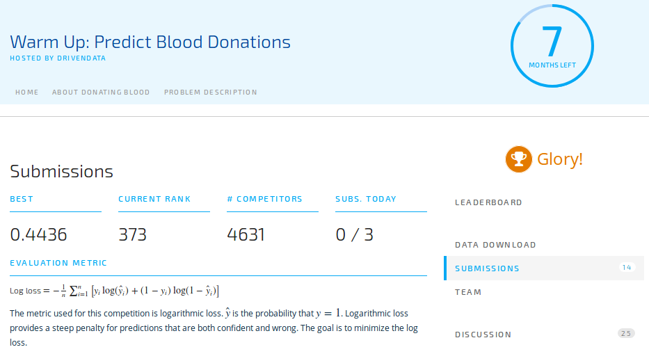


